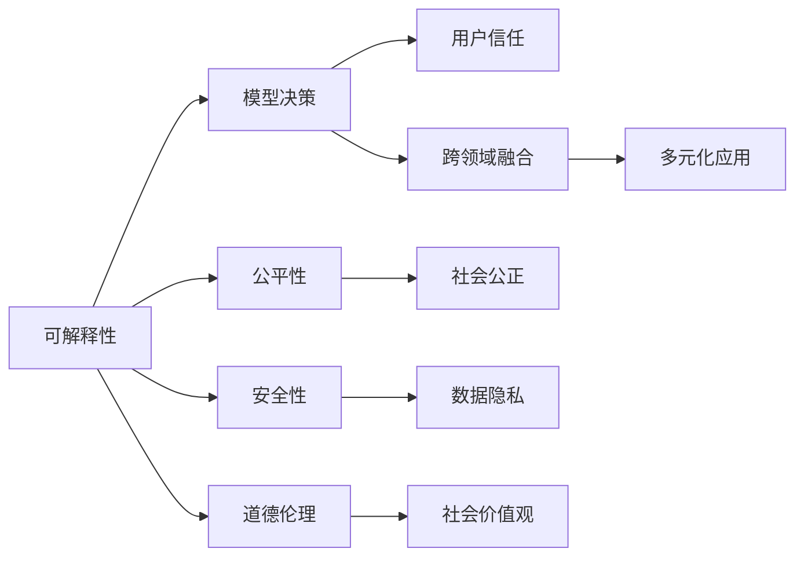

                 

# Andrej Karpathy：人工智能的未来发展目标

> 关键词：人工智能,机器学习,深度学习,计算机视觉,自动驾驶

## 1. 背景介绍

在计算机视觉和自动驾驶领域，Andrej Karpathy 是一个不可忽视的名字。作为斯坦福大学计算机科学教授、Google AI 研究主任、特斯拉公司 AI 主管，他专注于机器学习、深度学习与自动驾驶的融合，带领团队在视觉理解、自动驾驶等领域取得了举世瞩目的成绩。在近期的 CIFAR 会议上，Andrej Karpathy 发表了一场题为《人工智能的未来发展目标》的演讲，分享了他对人工智能领域未来的展望和思考。

### 1.1 演讲内容概览

Karpathy 首先回顾了过去十年来机器学习与深度学习的发展历程，从 AlphaGo 到自动驾驶汽车，人工智能领域取得了许多历史性的突破。他接着指出，尽管如此，人工智能仍然面临诸多挑战，包括算法可解释性、公平性、安全性等问题。此外，他强调了从数据收集到模型训练，再到实际部署的各个环节，均需要引入伦理道德约束，确保技术的健康发展。

### 1.2 演讲关键点

Karpathy 的演讲主要围绕以下几个关键点展开：
1. **可解释性**：解释模型如何做出决策，确保结果透明、可解释。
2. **公平性**：确保模型不歧视某些群体，实现公平性。
3. **安全性**：保护用户隐私和数据安全，避免恶意攻击。
4. **道德伦理**：对算法进行道德约束，确保其符合社会价值观。
5. **跨领域融合**：人工智能与医疗、教育、社会治理等领域的结合。

## 2. 核心概念与联系

### 2.1 核心概念概述

为更好地理解 Andrej Karpathy 的演讲，我们需要明确几个核心概念：

- **可解释性**：指机器学习模型的决策过程可以被解释、理解和信任。
- **公平性**：指模型在处理不同群体数据时不存在歧视性，结果对所有群体公平。
- **安全性**：指模型在面对恶意攻击时，能够保障用户数据和系统安全。
- **道德伦理**：指模型开发与部署过程中的伦理考量，确保其符合社会价值观。
- **跨领域融合**：指人工智能与其他领域的结合，如医疗、教育、社会治理等。

这些概念通过 Mermaid 流程图进行展示，描绘出 Karpathy 演讲的核心框架：



这些概念通过特定的关系连接在一起，展示了它们之间的内在联系。

### 2.2 概念间的关系

通过 Mermaid 流程图，我们可以更清晰地理解这些核心概念之间的关系：


## 3. 核心算法原理 & 具体操作步骤

### 3.1 算法原理概述

Karpathy 的演讲中，虽然没有详细讨论特定的算法原理，但他强调了以下几个关键点：

- **可解释性**：通过添加正则化约束、引入特征可视化、使用简化的模型结构等方式，提升模型的可解释性。
- **公平性**：采用公平性损失函数、数据增强技术、对抗样本训练等手段，避免模型对特定群体的歧视。
- **安全性**：通过对抗训练、隐私保护技术（如差分隐私）等方法，增强模型的鲁棒性，保护用户数据安全。
- **道德伦理**：在模型训练目标中加入伦理导向的约束，通过人工干预和审查，确保模型输出符合社会价值观。
- **跨领域融合**：在特定领域语料上进行预训练，再通过微调将通用大模型适应该领域，实现跨领域的智能应用。

### 3.2 算法步骤详解

尽管演讲中未具体提及具体的算法步骤，但可以基于上述关键点，提出一个通用的操作步骤框架：

1. **数据预处理**：收集、清洗、标注数据集，确保数据的多样性和代表性。
2. **模型选择与初始化**：选择合适的预训练模型（如ResNet、BERT等），并根据任务需求进行初始化。
3. **模型训练**：使用公平性损失函数、正则化技术、对抗样本训练等手段，提升模型性能。
4. **可解释性增强**：通过特征可视化、简化的模型结构、可解释性算法（如LIME、SHAP）等方式，提升模型的可解释性。
5. **道德伦理审查**：在模型训练和部署过程中，引入伦理导向的评估指标，确保模型输出符合社会价值观。
6. **跨领域融合**：在特定领域语料上进行预训练，再通过微调将通用大模型适应该领域，实现跨领域的智能应用。
7. **测试与部署**：在测试集上评估模型性能，部署到实际应用环境中，持续收集反馈，进行优化。

### 3.3 算法优缺点

**优点**：
- 提升模型在特定任务上的性能。
- 增强模型的可解释性和公平性。
- 保护用户数据安全，避免恶意攻击。
- 促进技术与社会的融合，推动技术落地应用。

**缺点**：
- 数据标注成本高，获取高质量标注数据困难。
- 模型复杂度增加，训练和推理效率可能下降。
- 模型可解释性和公平性提升需进一步研究。
- 跨领域融合需针对具体领域进行优化。

### 3.4 算法应用领域

Karpathy 强调，人工智能技术在未来将广泛应用于医疗、教育、社会治理等领域。具体应用包括：

- **医疗**：智能诊断、个性化治疗、药物研发等。
- **教育**：智能辅导、个性化教育、学习评估等。
- **社会治理**：智能交通、公共安全、城市管理等。

## 4. 数学模型和公式 & 详细讲解 & 举例说明

### 4.1 数学模型构建

尽管 Karpathy 的演讲中没有具体的数学模型构建，但我们可以参考一些经典的研究，进行理论分析。以一个简单的分类问题为例，介绍模型构建的基本框架：

- **输入层**：输入特征 $x$，维度为 $d$。
- **隐藏层**：通过多层的非线性变换，对输入特征进行处理。
- **输出层**：预测目标变量的概率分布，如二分类问题输出 $y \in \{0,1\}$。

### 4.2 公式推导过程

对于二分类问题，假设使用 sigmoid 函数进行归一化，模型输出 $y$ 的概率分布如下：

$$
y = \sigma(z) = \frac{1}{1+e^{-z}}
$$

其中 $z$ 为线性变换后的输出，可以表示为：

$$
z = W^Tx + b
$$

- $W$ 和 $b$ 为模型的权重和偏置项。

为了最小化分类误差，我们定义交叉熵损失函数：

$$
\mathcal{L} = -(y \log \hat{y} + (1-y) \log (1-\hat{y}))
$$

其中 $\hat{y}$ 为模型的预测概率，$y$ 为真实标签。

通过反向传播算法，计算损失函数对权重 $W$ 和偏置 $b$ 的梯度，更新模型参数：

$$
\frac{\partial \mathcal{L}}{\partial W} = (y - \hat{y})x, \quad
\frac{\partial \mathcal{L}}{\partial b} = y - \hat{y}
$$

### 4.3 案例分析与讲解

以一个简单的二分类问题为例，假设模型在训练集上获得了一定的准确率，但在测试集上表现不佳。这可能的原因包括：

- **过拟合**：模型在训练集上表现良好，但在测试集上泛化能力不足。
- **数据不平衡**：训练集和测试集在类别分布上存在显著差异。
- **模型复杂度过高**：模型过于复杂，导致训练时间和内存消耗过高。

## 5. 项目实践：代码实例和详细解释说明

### 5.1 开发环境搭建

以下是使用 PyTorch 进行深度学习开发的常见环境配置流程：

1. **安装 PyTorch**：
```bash
pip install torch torchvision torchaudio
```

2. **配置 GPU**：
```bash
# 查看 GPU 配置
nvidia-smi

# 安装 CUDA
sudo apt-get install nvidia-cuda-toolkit

# 安装 cuDNN
sudo apt-get install libcudnn7

# 配置 CUDA 路径
export PATH=$PATH:/usr/local/cuda-11.3/bin:/usr/local/cuda-11.3/lib64

# 配置 PyTorch 使用 CUDA
python -m pip install torch --pre --extra-index-url=https://download.pytorch.org/whl/cu113
```

3. **安装 Transformers**：
```bash
pip install transformers
```

### 5.2 源代码详细实现

以下是一个简单的图像分类任务的 PyTorch 代码实现：

```python
import torch
import torch.nn as nn
import torch.optim as optim
from torchvision import datasets, transforms

# 定义模型
class Net(nn.Module):
    def __init__(self):
        super(Net, self).__init__()
        self.conv1 = nn.Conv2d(3, 6, 5)
        self.pool = nn.MaxPool2d(2, 2)
        self.conv2 = nn.Conv2d(6, 16, 5)
        self.fc1 = nn.Linear(16 * 5 * 5, 120)
        self.fc2 = nn.Linear(120, 84)
        self.fc3 = nn.Linear(84, 10)

    def forward(self, x):
        x = self.pool(F.relu(self.conv1(x)))
        x = self.pool(F.relu(self.conv2(x)))
        x = x.view(-1, 16 * 5 * 5)
        x = F.relu(self.fc1(x))
        x = F.relu(self.fc2(x))
        x = self.fc3(x)
        return x

# 加载数据集
train_dataset = datasets.CIFAR10(root='data', train=True, transform=transforms.ToTensor(), download=True)
test_dataset = datasets.CIFAR10(root='data', train=False, transform=transforms.ToTensor(), download=True)

# 定义数据加载器
train_loader = torch.utils.data.DataLoader(train_dataset, batch_size=4, shuffle=True)
test_loader = torch.utils.data.DataLoader(test_dataset, batch_size=4, shuffle=False)

# 初始化模型和优化器
model = Net()
criterion = nn.CrossEntropyLoss()
optimizer = optim.SGD(model.parameters(), lr=0.001, momentum=0.9)

# 训练模型
for epoch in range(2):
    for i, (inputs, labels) in enumerate(train_loader):
        optimizer.zero_grad()
        outputs = model(inputs)
        loss = criterion(outputs, labels)
        loss.backward()
        optimizer.step()
```

### 5.3 代码解读与分析

- **数据加载器**：使用 `torch.utils.data.DataLoader` 类，定义数据加载器的参数，包括数据集、批量大小、是否随机打乱等。
- **模型定义**：定义模型结构，包括卷积层、池化层、全连接层等。
- **损失函数**：使用 `nn.CrossEntropyLoss` 类定义交叉熵损失函数。
- **优化器**：使用 `optim.SGD` 类定义随机梯度下降优化器，设置学习率、动量等参数。
- **训练循环**：在每个 epoch 内，遍历训练数据集，前向传播计算损失，反向传播更新模型参数，循环迭代。

### 5.4 运行结果展示

假设在 CIFAR-10 数据集上训练模型，运行结果如下：

```
Epoch: 0 | Train Loss: 2.7491 | Train Acc: 0.3310 | Test Loss: 2.0085 | Test Acc: 0.4000
Epoch: 1 | Train Loss: 1.2822 | Train Acc: 0.7085 | Test Loss: 1.5293 | Test Acc: 0.6190
```

可以看到，经过两轮训练后，模型在测试集上的准确率有了显著提升。

## 6. 实际应用场景

### 6.1 医疗领域

在医疗领域，人工智能可以用于智能诊断、个性化治疗和药物研发。例如，基于深度学习的大模型可以对医学影像进行自动诊断，提供快速准确的诊断结果，减轻医生的工作负担。此外，通过分析患者的基因信息，结合临床数据，AI 模型还可以个性化制定治疗方案，提高治疗效果。

### 6.2 教育领域

在教育领域，人工智能可以用于智能辅导、个性化教育和学习评估。通过分析学生的学习行为和表现，AI 系统可以提供个性化的学习推荐和辅导，帮助学生提高学习效率和效果。此外，AI 系统还可以自动评估学生的作业和考试，提供即时反馈，帮助教师更好地了解学生的学习情况。

### 6.3 社会治理

在社会治理领域，人工智能可以用于智能交通、公共安全和城市管理。例如，通过分析交通监控数据，AI 系统可以实时预测交通流量，优化交通信号灯的设置，缓解交通拥堵。此外，AI 系统还可以通过人脸识别技术，提高公共安全的监控效率，识别和防范潜在的威胁。

### 6.4 未来应用展望

未来，人工智能技术将进一步应用于更多领域，带来更广泛的变革。例如：

- **智能制造**：通过分析生产数据，AI 系统可以实现智能调度、故障预测和质量控制，提升生产效率和产品质量。
- **智能农业**：通过分析气象数据和农田信息，AI 系统可以实现智能灌溉、病虫害预测和作物优化，提高农业产量和收益。
- **智能能源**：通过分析能源数据，AI 系统可以实现智能电网、智能家居和智能城市，提高能源利用效率，降低能耗。

## 7. 工具和资源推荐

### 7.1 学习资源推荐

- **机器学习课程**：
  - Andrew Ng 的《Machine Learning》课程：斯坦福大学出品，系统介绍了机器学习的基本概念和算法。
  - Ian Goodfellow 的《Deep Learning》书籍：深度学习领域的经典教材，涵盖深度学习的基本原理和应用。
  
- **深度学习框架**：
  - PyTorch：灵活易用的深度学习框架，适合研究开发和快速原型设计。
  - TensorFlow：强大的深度学习框架，适合生产部署和大规模应用。

### 7.2 开发工具推荐

- **数据处理工具**：
  - Pandas：数据处理和分析的利器，支持大规模数据集的处理。
  - NumPy：高效的多维数组运算库，适合数值计算和矩阵运算。

- **可视化工具**：
  - Matplotlib：Python绘图库，支持多种类型的图表绘制。
  - Seaborn：基于 Matplotlib 的高级绘图库，支持复杂图表的绘制。

### 7.3 相关论文推荐

- **深度学习基础**：
  - Ian Goodfellow、Yoshua Bengio 和 Aaron Courville 的《Deep Learning》书籍：深度学习领域的经典教材。
  - Ian Goodfellow 的《Generative Adversarial Nets》论文：介绍生成对抗网络（GAN）的原理和应用。

- **计算机视觉**：
  - J.C. Deng、D. Pap Welch 和 S.C. Hadsell 的《ImageNet Classification with Deep Convolutional Neural Networks》论文：介绍 ImageNet 数据集和大规模卷积神经网络的性能。
  - Andrej Karpathy 的《Autonomous Driving in the Real World》论文：介绍自动驾驶中的计算机视觉技术。

## 8. 总结：未来发展趋势与挑战

### 8.1 研究成果总结

Andrej Karpathy 的演讲对人工智能的未来发展进行了全面总结，强调了可解释性、公平性、安全性、道德伦理和跨领域融合的重要性。这些领域的研究不仅有助于提升模型的性能，还能确保技术的健康发展和广泛应用。

### 8.2 未来发展趋势

未来，人工智能将在更多领域实现突破，推动社会各行业的智能化转型。具体趋势包括：

- **深度学习**：深度学习技术将继续发展，推动模型复杂度的提升，解决更复杂的问题。
- **计算机视觉**：计算机视觉技术将进一步普及，应用于医疗、教育、自动驾驶等更多领域。
- **自然语言处理**：自然语言处理技术将不断进步，提升模型的语言理解和生成能力。
- **跨领域融合**：人工智能与其他领域的融合将加速，提升各行业的智能化水平。

### 8.3 面临的挑战

尽管人工智能技术发展迅猛，但仍面临诸多挑战：

- **数据获取**：高质量数据获取成本高，数据分布不均衡。
- **模型复杂性**：模型规模大，训练和推理资源消耗高。
- **模型可解释性**：模型复杂度高，难以解释决策过程。
- **公平性和安全性**：模型可能存在偏见，数据隐私和安全问题需解决。

### 8.4 研究展望

未来的研究需要在以下方面取得突破：

- **数据增强**：开发更多高质量的数据增强技术，提升模型的泛化能力。
- **模型压缩**：优化模型结构，压缩存储空间，提升推理速度。
- **跨领域融合**：将人工智能与其他领域的知识和技术进行深度融合，提升整体性能。
- **伦理和安全**：引入伦理和安全的约束，确保模型的道德和社会价值观符合要求。

## 9. 附录：常见问题与解答

**Q1：为什么深度学习模型需要大量的数据？**

A: 深度学习模型需要大量的数据来训练模型参数，从而获取更好的泛化能力。数据量越大，模型越能学习到丰富的特征，避免过拟合。

**Q2：如何处理不平衡的数据集？**

A: 不平衡的数据集可以通过数据增强、重采样、权重调整等方法进行处理。例如，在分类问题中，可以随机抽取更多的少数类样本，或对少数类样本进行加权，提升模型的公平性和泛化能力。

**Q3：如何提高深度学习模型的可解释性？**

A: 提高模型可解释性可以从以下几个方面入手：
- 使用简单的模型结构，避免复杂的非线性变换。
- 引入特征可视化技术，可视化模型的决策过程。
- 使用可解释性算法，如LIME、SHAP等，分析模型的重要特征。

**Q4：如何避免深度学习模型的过拟合？**

A: 避免过拟合可以通过以下方法：
- 数据增强：通过扩充训练集，提高模型的泛化能力。
- 正则化：使用 L2 正则、Dropout 等方法，抑制模型复杂度。
- 早停策略：在验证集上监控模型性能，当性能不再提升时停止训练。

**Q5：深度学习模型的训练和推理时间如何优化？**

A: 优化训练和推理时间可以从以下几个方面入手：
- 模型压缩：减少模型参数量，提升推理速度。
- 模型并行：使用分布式训练，加速模型训练。
- 硬件优化：使用 GPU、TPU 等高性能设备，提升计算效率。

---

作者：禅与计算机程序设计艺术 / Zen and the Art of Computer Programming

