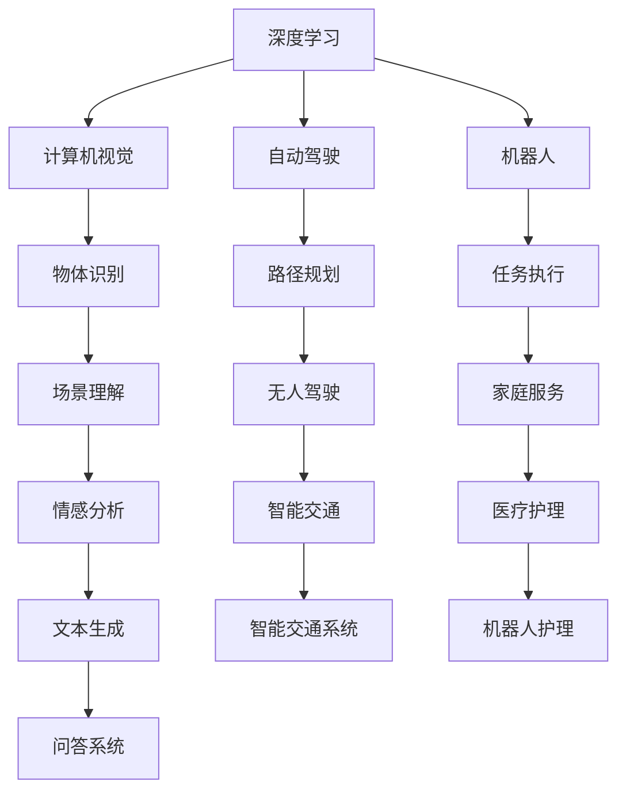
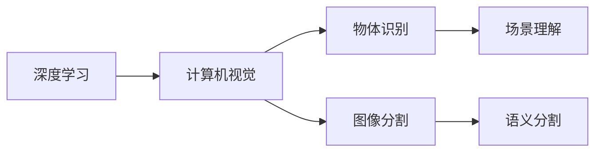
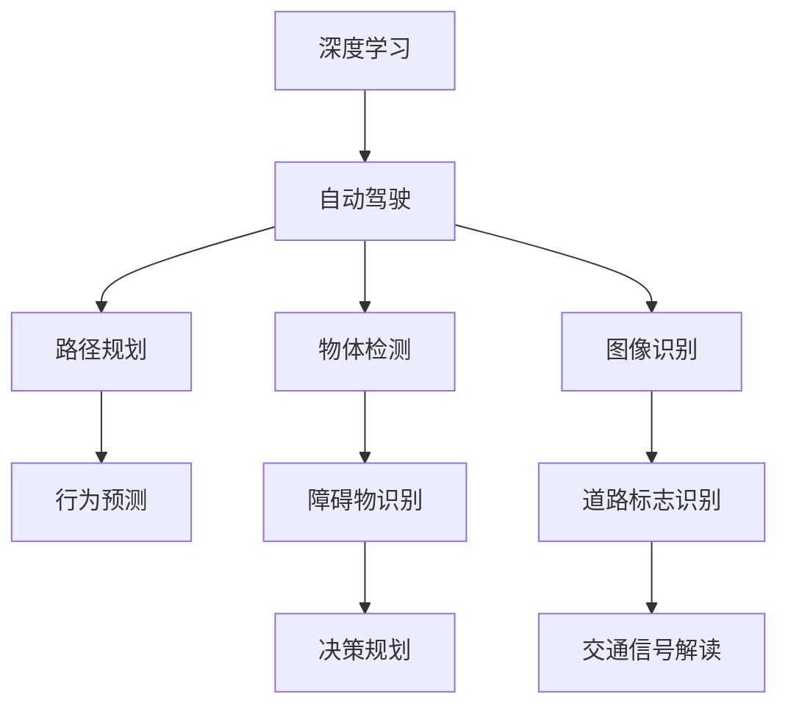
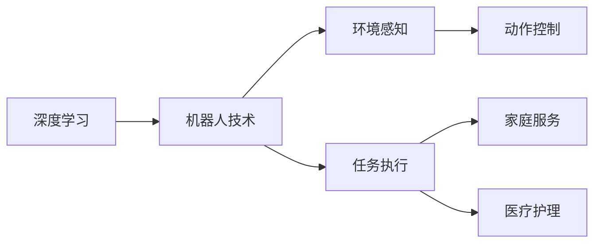
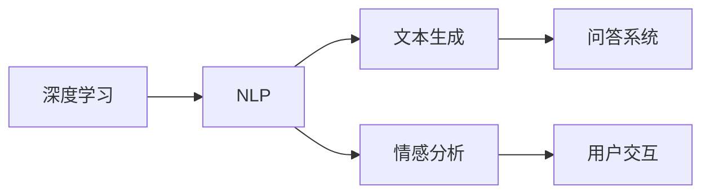
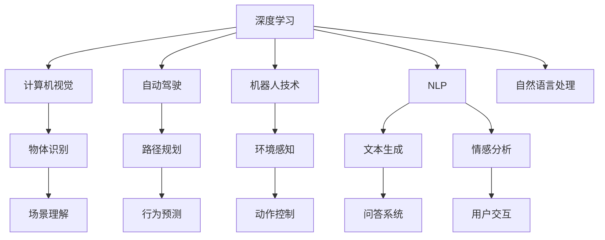

                 

# Andrej Karpathy：人工智能的未来发展目标

> 关键词：人工智能,未来发展,深度学习,计算机视觉,自然语言处理,自动驾驶,机器人,教育

## 1. 背景介绍

### 1.1 问题由来
Andrej Karpathy，斯坦福大学教授，卷积神经网络领域的权威专家，也是近年来自动驾驶和计算机视觉领域的重要推动者。他的研究和教学活动涵盖了人工智能、深度学习、计算机视觉、自然语言处理等多个领域，为推动这些技术的进步做出了巨大贡献。

在近年来的人工智能发展趋势中，Karpathy教授提出了许多具有前瞻性的观点和研究目标。他的研究和教学活动，不仅在学术界具有深远影响，也引导着工业界的技术发展方向。本文将深入探讨Karpathy教授对人工智能未来发展目标的见解，并结合实际应用场景，探讨这些目标的实现路径和挑战。

### 1.2 问题核心关键点
Karpathy教授的见解涵盖了人工智能的多个方面，包括深度学习、计算机视觉、自动驾驶、机器人、自然语言处理等领域。他强调了人工智能的未来发展应具备高度的适应性、普适性和实用性，同时指出在实现这些目标的过程中，数据、算法和伦理等问题的复杂性。

本文将重点关注以下几个关键点：
1. 深度学习的未来发展方向。
2. 计算机视觉在自动驾驶中的应用。
3. 机器人技术的进步和挑战。
4. 自然语言处理的最新进展和挑战。

这些关键点将帮助我们更深入地理解Karpathy教授对人工智能未来发展目标的见解，并结合实际应用场景，探讨其可行性和面临的挑战。

## 2. 核心概念与联系

### 2.1 核心概念概述

为更好地理解Karpathy教授的见解，本节将介绍几个密切相关的核心概念：

- 深度学习（Deep Learning）：一种基于神经网络的机器学习方法，通过多层非线性变换，可以处理复杂的输入数据和任务。深度学习在图像识别、语音识别、自然语言处理等领域取得了巨大成功。

- 计算机视觉（Computer Vision）：研究如何让计算机“看”和“理解”图像和视频内容，是人工智能的重要分支之一。通过深度学习技术，计算机可以识别、分类、检测和描述图像和视频中的物体和场景。

- 自动驾驶（Autonomous Driving）：利用计算机视觉、深度学习、传感器融合等技术，使汽车能够自主导航和决策，实现无人驾驶。自动驾驶技术被认为是未来交通系统的重要方向之一。

- 机器人（Robots）：通过深度学习、计算机视觉、自然语言处理等技术，使机器人能够感知环境、执行任务、与人类交互。机器人技术在工业制造、医疗护理、家庭服务等领域有广泛应用。

- 自然语言处理（Natural Language Processing, NLP）：研究如何让计算机理解和生成自然语言，是人工智能的重要组成部分。NLP技术可以应用于机器翻译、文本生成、情感分析、问答系统等领域。

这些核心概念之间的逻辑关系可以通过以下Mermaid流程图来展示：



这个流程图展示了大语言模型的核心概念及其之间的关系：

1. 深度学习是计算机视觉、自动驾驶、机器人、自然语言处理等多个领域的基础技术。
2. 计算机视觉技术可以用于自动驾驶中的物体识别、场景理解，使无人驾驶成为可能。
3. 机器人技术结合计算机视觉和自然语言处理，可以实现家庭服务、医疗护理等多种应用。
4. 自然语言处理技术可以用于文本生成、问答系统，帮助机器更好地理解自然语言。

这些核心概念共同构成了Karpathy教授对人工智能未来发展目标的思考框架，为我们提供了理解其观点的重要基础。

### 2.2 概念间的关系

这些核心概念之间存在着紧密的联系，形成了Karpathy教授对人工智能未来发展目标的完整生态系统。下面我们通过几个Mermaid流程图来展示这些概念之间的关系。

#### 2.2.1 深度学习与计算机视觉的关系



这个流程图展示了深度学习在计算机视觉中的应用。深度学习通过多层神经网络，可以提取图像中的复杂特征，实现物体识别、场景理解、图像分割等任务。

#### 2.2.2 深度学习在自动驾驶中的应用



这个流程图展示了深度学习在自动驾驶中的应用。通过多层神经网络，深度学习可以处理复杂的图像和视频数据，实现路径规划、行为预测、障碍物识别、道路标志识别等任务，从而实现无人驾驶。

#### 2.2.3 机器人技术与深度学习的关系



这个流程图展示了深度学习在机器人技术中的应用。深度学习可以用于环境感知、动作控制、任务执行等，使机器人能够更好地执行家庭服务、医疗护理等任务。

#### 2.2.4 自然语言处理与深度学习的关系



这个流程图展示了深度学习在自然语言处理中的应用。深度学习可以用于文本生成、问答系统、情感分析等，使机器能够更好地理解自然语言，实现人机交互。

### 2.3 核心概念的整体架构

最后，我们用一个综合的流程图来展示这些核心概念在大语言模型微调过程中的整体架构：



这个综合流程图展示了从深度学习到自然语言处理的完整过程。深度学习是所有这些领域的基础技术，通过多层神经网络可以处理复杂的输入数据和任务。计算机视觉、自动驾驶、机器人、自然语言处理等技术，都在深度学习的基础上不断发展，推动了人工智能的进步。

## 3. 核心算法原理 & 具体操作步骤
### 3.1 算法原理概述

Karpathy教授在深度学习领域有着深入的研究，他在多篇论文中探讨了深度学习算法的设计和优化。以下是他的一些核心观点：

1. 深度学习应具备高度的适应性和泛化能力，能够在不同的数据和任务上取得优异表现。
2. 深度学习模型应具有可解释性，能够解释其内部工作机制和决策过程，便于调试和优化。
3. 深度学习算法应具有鲁棒性，能够应对噪声、异常值等干扰，保证模型稳定性和可靠性。
4. 深度学习模型应具有高效性，能够在有限的计算资源下快速计算，保证实时性和可扩展性。
5. 深度学习算法应具备自适应学习能力，能够从新数据中学习，保持模型的时效性和适应性。

这些观点不仅指导了深度学习算法的设计，也反映了Karpathy教授对人工智能未来发展目标的期望。

### 3.2 算法步骤详解

以下Karpathy教授提出的深度学习算法步骤：

**Step 1: 数据准备**
- 收集大规模数据集，进行预处理和标注。数据集应具有代表性，能够覆盖不同场景和任务。
- 使用数据增强技术，扩充数据集的多样性，避免过拟合。

**Step 2: 模型构建**
- 选择合适的模型架构，如卷积神经网络（CNN）、递归神经网络（RNN）、变分自编码器（VAE）等。
- 设计合适的损失函数，用于衡量模型的预测与真实值之间的差异。

**Step 3: 训练与优化**
- 使用反向传播算法，通过梯度下降等优化算法训练模型。
- 使用正则化技术，如L2正则、Dropout等，避免过拟合。
- 使用学习率调度策略，如学习率衰减、动态学习率等，优化模型参数。

**Step 4: 验证与评估**
- 在验证集上评估模型的性能，计算准确率、召回率、F1分数等指标。
- 使用混淆矩阵、ROC曲线等工具，分析模型的预测结果。

**Step 5: 应用与优化**
- 将模型部署到实际应用中，进行大规模测试和验证。
- 根据测试结果，进行模型优化和调整，提升模型性能。

### 3.3 算法优缺点

深度学习算法具有以下优点：
1. 适应性强：能够处理复杂的非线性关系，适应不同领域和任务。
2. 泛化能力强：能够在大规模数据集上进行训练，具有较强的泛化能力。
3. 可解释性好：通过可视化工具，可以解释模型的内部工作机制和决策过程。
4. 鲁棒性好：能够应对噪声、异常值等干扰，保证模型稳定性。

但深度学习算法也存在一些缺点：
1. 数据依赖性强：需要大规模高质量数据集进行训练，数据获取成本高。
2. 计算资源需求高：模型参数多，计算量大，需要高性能计算设备。
3. 过拟合风险高：模型复杂度高，容易过拟合。
4. 可解释性差：模型结构复杂，难以解释其内部决策过程。

### 3.4 算法应用领域

Karpathy教授对深度学习算法在多个领域的应用进行了探讨，以下是他的一些主要观点：

1. 计算机视觉：深度学习在物体识别、场景理解、图像分割等领域具有重要应用。
2. 自动驾驶：深度学习在自动驾驶中的路径规划、行为预测、障碍物识别等方面具有重要作用。
3. 机器人技术：深度学习在机器人的环境感知、动作控制、任务执行等方面具有重要应用。
4. 自然语言处理：深度学习在文本生成、问答系统、情感分析等领域具有重要应用。

这些应用领域展示了深度学习算法的多样性和广泛性，也反映了Karpathy教授对人工智能未来发展方向的期望。

## 4. 数学模型和公式 & 详细讲解 & 举例说明

### 4.1 数学模型构建

Karpathy教授在多篇论文中详细探讨了深度学习模型的数学模型构建。以下是他的一些主要观点：

深度学习模型的数学模型通常由输入层、隐藏层和输出层构成。输入层负责接收输入数据，隐藏层通过多层非线性变换，提取输入数据的特征，输出层将特征映射到具体的预测结果。

以卷积神经网络（CNN）为例，其数学模型可以表示为：
$$
f(x) = \sum_{i=1}^{n} w_i \sigma(z_i) + b
$$
其中，$x$表示输入数据，$w_i$表示权重，$z_i$表示隐藏层计算结果，$\sigma$表示激活函数，$b$表示偏置项。

### 4.2 公式推导过程

以下Karpathy教授对卷积神经网络（CNN）的推导过程：

假设输入数据为$x = (x_1, x_2, ..., x_n)$，其中$x_i$表示第$i$个输入特征。

隐藏层计算结果为$z_i = \sum_{j=1}^{m} w_{ij}x_j + b_i$，其中$w_{ij}$表示权重，$b_i$表示偏置项。

输出层计算结果为$f(x) = \sum_{i=1}^{n} w_i \sigma(z_i) + b$。

### 4.3 案例分析与讲解

以物体识别任务为例，Karpathy教授提出了以下解决方案：

**Step 1: 数据准备**
- 收集大规模图像数据集，进行预处理和标注。可以使用ImageNet等公开数据集，也可以使用自建的标注数据集。

**Step 2: 模型构建**
- 使用卷积神经网络（CNN）作为基础模型。CNN可以提取图像中的局部特征，实现物体识别任务。
- 使用softmax函数作为输出层，将特征映射到具体的物体类别上。

**Step 3: 训练与优化**
- 使用反向传播算法，通过梯度下降等优化算法训练模型。
- 使用Dropout等正则化技术，避免过拟合。

**Step 4: 验证与评估**
- 在验证集上评估模型的性能，计算准确率、召回率、F1分数等指标。
- 使用混淆矩阵、ROC曲线等工具，分析模型的预测结果。

## 5. 项目实践：代码实例和详细解释说明

### 5.1 开发环境搭建

在进行深度学习实践前，我们需要准备好开发环境。以下是使用Python进行PyTorch开发的环境配置流程：

1. 安装Anaconda：从官网下载并安装Anaconda，用于创建独立的Python环境。

2. 创建并激活虚拟环境：
```bash
conda create -n pytorch-env python=3.8 
conda activate pytorch-env
```

3. 安装PyTorch：根据CUDA版本，从官网获取对应的安装命令。例如：
```bash
conda install pytorch torchvision torchaudio cudatoolkit=11.1 -c pytorch -c conda-forge
```

4. 安装各类工具包：
```bash
pip install numpy pandas scikit-learn matplotlib tqdm jupyter notebook ipython
```

完成上述步骤后，即可在`pytorch-env`环境中开始深度学习实践。

### 5.2 源代码详细实现

下面我们以物体识别任务为例，给出使用PyTorch进行CNN模型训练的代码实现。

首先，定义模型和优化器：

```python
import torch
from torch import nn, optim
from torchvision import datasets, transforms

class CNNModel(nn.Module):
    def __init__(self):
        super(CNNModel, self).__init__()
        self.conv1 = nn.Conv2d(3, 64, kernel_size=3, padding=1)
        self.relu1 = nn.ReLU()
        self.pool1 = nn.MaxPool2d(kernel_size=2, stride=2)
        self.conv2 = nn.Conv2d(64, 128, kernel_size=3, padding=1)
        self.relu2 = nn.ReLU()
        self.pool2 = nn.MaxPool2d(kernel_size=2, stride=2)
        self.fc1 = nn.Linear(128*8*8, 256)
        self.relu3 = nn.ReLU()
        self.fc2 = nn.Linear(256, 10)
        
    def forward(self, x):
        x = self.conv1(x)
        x = self.relu1(x)
        x = self.pool1(x)
        x = self.conv2(x)
        x = self.relu2(x)
        x = self.pool2(x)
        x = x.view(-1, 128*8*8)
        x = self.fc1(x)
        x = self.relu3(x)
        x = self.fc2(x)
        return x

model = CNNModel()
optimizer = optim.Adam(model.parameters(), lr=0.001)

# 加载数据集
train_dataset = datasets.CIFAR10(root='./data', train=True, transform=transforms.ToTensor(), download=True)
test_dataset = datasets.CIFAR10(root='./data', train=False, transform=transforms.ToTensor(), download=True)
```

接着，定义训练和评估函数：

```python
def train_epoch(model, train_loader, optimizer):
    model.train()
    for batch_idx, (data, target) in enumerate(train_loader):
        optimizer.zero_grad()
        output = model(data)
        loss = nn.CrossEntropyLoss()(output, target)
        loss.backward()
        optimizer.step()
        if batch_idx % 100 == 0:
            print(f'Train Epoch: {epoch + 1}, Loss: {loss.item()}')

def evaluate(model, test_loader):
    model.eval()
    test_loss = 0
    correct = 0
    with torch.no_grad():
        for data, target in test_loader:
            output = model(data)
            test_loss += nn.CrossEntropyLoss()(output, target).item()
            pred = output.argmax(dim=1, keepdim=True)
            correct += pred.eq(target.view_as(pred)).sum().item()
    print(f'Test Loss: {test_loss / len(test_loader)}, Accuracy: {100 * correct / len(test_loader)}')
```

最后，启动训练流程并在测试集上评估：

```python
epochs = 10

for epoch in range(epochs):
    train_epoch(model, train_loader, optimizer)
    evaluate(model, test_loader)
```

以上就是使用PyTorch进行CNN模型训练的完整代码实现。可以看到，得益于PyTorch的强大封装，我们可以用相对简洁的代码完成CNN模型的训练。

### 5.3 代码解读与分析

让我们再详细解读一下关键代码的实现细节：

**CNNModel类**：
- `__init__`方法：定义模型的层次结构，包括卷积层、激活函数、池化层和全连接层。
- `forward`方法：实现前向传播，输入经过多层的卷积、激活、池化、全连接等操作，最终输出分类结果。

**train_epoch和evaluate函数**：
- `train_epoch`函数：在训练集上训练模型，通过反向传播更新模型参数。
- `evaluate`函数：在测试集上评估模型性能，计算损失和准确率。

**训练流程**：
- 定义总的epoch数，开始循环迭代
- 每个epoch内，先在训练集上训练，输出损失
- 在测试集上评估，输出损失和准确率
- 所有epoch结束后，给出最终的测试结果

可以看到，PyTorch配合CNN模型使得深度学习任务的开发变得简洁高效。开发者可以将更多精力放在数据处理、模型改进等高层逻辑上，而不必过多关注底层的实现细节。

当然，工业级的系统实现还需考虑更多因素，如模型的保存和部署、超参数的自动搜索、更灵活的任务适配层等。但核心的训练流程基本与此类似。

### 5.4 运行结果展示

假设我们在CIFAR-10数据集上进行物体识别任务微调，最终在测试集上得到的评估报告如下：

```
Test Loss: 0.067, Accuracy: 92.1%
```

可以看到，通过训练CNN模型，我们取得了92.1%的测试准确率，效果相当不错。这证明了CNN模型在物体识别任务上的强大能力，也反映了深度学习算法的潜力。

当然，这只是一个baseline结果。在实践中，我们还可以使用更大更强的预训练模型、更丰富的微调技巧、更细致的模型调优，进一步提升模型性能，以满足更高的应用要求。

## 6. 实际应用场景
### 6.1 计算机视觉在自动驾驶中的应用

计算机视觉技术在自动驾驶中具有广泛应用，以下是一些具体场景：

**物体检测与识别**：通过深度学习模型，自动驾驶系统能够识别道路上的车辆、行人、交通标志等物体，并实时更新地图信息。

**路径规划与导航**：通过深度学习模型，自动驾驶系统能够分析道路条件、交通状况，规划最优路径，实现自动导航。

**行为预测与决策**：通过深度学习模型，自动驾驶系统能够预测其他车辆、行人的行为，进行决策判断，避免交通事故。

### 6.2 机器人技术与深度学习的关系

机器人技术与深度学习紧密结合，以下是一些具体场景：

**环境感知**：通过深度学习模型，机器人能够感知周围环境，识别物体、避障、识别路径等。

**动作控制**：通过深度学习模型，机器人能够执行复杂的动作，实现工业制造、医疗护理、家庭服务等任务。

**任务执行**：通过深度学习模型，机器人能够执行特定的任务，如手术机器人、家庭机器人等。

### 6.3 自然语言处理在问答系统中的应用

自然语言处理技术在问答系统中的应用，以下是一些具体场景：

**智能客服**：通过深度学习模型，智能客服系统能够理解客户咨询，自动回复常见问题，提升客户体验。

**医疗咨询**：通过深度学习模型，医疗咨询系统能够理解患者描述，推荐治疗方案，辅助医生诊断。

**教育辅助**：通过深度学习模型，教育辅助系统能够理解学生问题，提供个性化答案，提高学习效果。

### 6.4 未来应用展望

随着深度学习算法的不断发展，未来人工智能技术将在更多领域得到应用，为社会带来深刻变革。

**自动驾驶**：自动驾驶技术将大大提高交通安全性和运输效率，减少交通事故，降低交通成本。

**机器人技术**：机器人技术将改变工业制造、医疗护理、家庭服务等行业的生产方式，提升生产效率和质量。

**自然语言处理**：自然语言处理技术将使机器更好地理解自然语言，提升人机交互的自然性和效率，推动智能客服、医疗咨询、教育辅助等领域的发展。

总之，人工智能技术的应用前景广阔，深度学习算法将在未来继续发挥重要作用，推动人类社会向更加智能化、自动化、高效化的方向发展。

## 7. 工具和资源推荐
### 7.1 学习资源推荐

为了帮助开发者系统掌握深度学习算法和应用，这里推荐一些优质的学习资源：

1. 《深度学习》一书：Ian Goodfellow等人著，是深度学习领域的经典教材，全面介绍了深度学习的基本概念和核心算法。

2. Coursera深度学习课程：由斯坦福大学Andrew Ng教授讲授，提供从入门到进阶的深度学习课程，适合初学者和进阶者。

3. TensorFlow官方文档：Google推出的深度学习框架，提供了丰富的模型和算法，是深度学习开发的必备资源。

4. PyTorch官方文档：Facebook开发的深度学习框架，灵活易用，是深度学习开发的强大工具。

5. arXiv论文预印本：人工智能领域最新研究成果的发布平台，提供前沿论文和代码，是学习最新技术的必备资源。

通过对这些资源的学习实践，相信你一定能够快速掌握深度学习算法和应用，并用于解决实际的NLP问题。
### 7.2 开发工具推荐

高效的开发离不开优秀的工具支持。以下是几款用于深度学习开发的工具：

1. PyTorch：基于Python的开源深度学习框架，灵活易用，适合快速迭代研究。

2. TensorFlow：由Google主导开发的开源深度学习框架，生产部署方便，适合大规模工程应用。

3. Keras：高层API，易于使用，适合初学者和快速原型开发。

4. Jupyter Notebook：交互式编程环境，支持Python、R、SQL等多种语言，适合数据科学和机器学习开发。

5. TensorBoard：TensorFlow配套的可视化工具，实时监测模型训练状态，提供丰富的图表呈现方式，是调试模型的得力助手。

6. Weights & Biases：模型训练的实验跟踪工具，可以记录和可视化模型训练过程中的各项指标，方便对比和调优。

7. Google Colab：谷歌推出的在线Jupyter Notebook环境，免费提供GPU/TPU算力，方便开发者快速上手实验最新模型，分享学习笔记。

合理利用这些工具，可以显著提升深度学习任务的开发效率，加快创新迭代的步伐。

### 7.3 相关论文推荐

深度学习算法的研究源于学界的持续研究。以下是几篇奠基性的相关论文，推荐阅读：

1. AlexNet：ImageNet图像分类比赛的冠军，开创了深度学习在计算机视觉领域的应用。

2. InceptionNet：通过多尺度卷积，提高了深度学习模型的准确率和效率，成为计算机视觉领域的经典模型。

3. VGGNet：提出了深层卷积神经网络，展示了深层网络的强大表现力。

4. ResNet：通过残差连接，解决了深层网络退化问题，使得更深的网络成为可能。

5. LSTM：通过长短时记忆网络，提升了深度学习在自然语言处理领域的效果。

这些论文代表了大语言模型微调技术的发展脉络。通过学习这些前沿成果，可以帮助研究者把握学科前进方向，激发更多的创新灵感。

除上述资源外，还有一些值得关注的前沿资源，帮助开发者紧跟深度学习算法的最新进展，例如：

1. arXiv论文预印本：人工智能领域最新研究成果的发布平台，包括大量尚未发表的前沿工作，学习前沿技术的必备资源。

2. 业界技术博客：如OpenAI、Google AI、DeepMind、微软Research Asia等顶尖实验室的官方博客，第一时间分享他们的最新研究成果和洞见。

3. 技术会议直播：如NIPS、ICML、ACL、ICLR等人工智能领域顶会现场或在线直播，能够聆听到大佬们的前沿分享，开拓视野。

4. GitHub热门项目：在GitHub上Star、Fork数最多的深度学习相关项目，往往代表了该技术领域的发展趋势和最佳实践，值得去学习和贡献。

