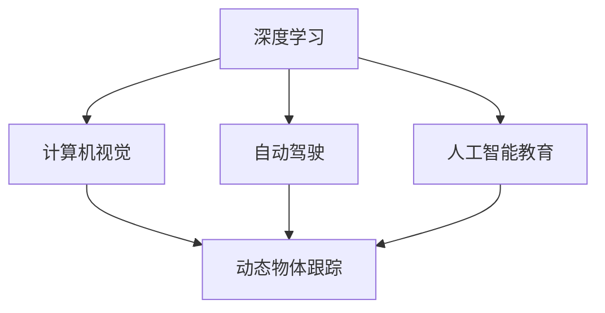

                 

## 1. 背景介绍

Andrej Karpathy 是斯坦福大学计算机科学系的副教授，同时也是 OpenAI 的研究员，以及 Facebook AI Research 的研究科学家。他以其在计算机视觉、深度学习、自动驾驶和人工智能教育领域的卓越贡献而闻名，并因其在图像识别、动态物体跟踪和自动驾驶等方面的突破性研究，在学术界和工业界享有盛誉。本文将通过解析 Andrej Karpathy 在人工智能领域的发展目标，探讨其对未来技术走向的深刻见解。

## 2. 核心概念与联系

### 2.1 核心概念概述

为更好地理解 Andrej Karpathy 的论述，本文将介绍几个关键概念：

- **深度学习**：基于神经网络架构，能够通过大量数据进行自主学习和训练，从而达到特定任务的解决方案。
- **计算机视觉**：利用计算机算法来解析、处理、理解和生成图像和视频中的信息。
- **自动驾驶**：利用计算机视觉、深度学习等技术，实现车辆的自主导航和决策。
- **动态物体跟踪**：在视频中识别和跟踪移动物体的过程，是计算机视觉和自动驾驶的关键技术之一。
- **人工智能教育**：利用 AI 技术来改进和优化教育内容和教学方法，提升教育质量和学习效率。

这些核心概念之间存在着紧密的联系，相互促进，共同构成了 Andrej Karpathy 对未来人工智能发展的基本框架。

### 2.2 概念间的关系

这些核心概念之间的联系可以通过以下 Mermaid 流程图来展示：



这个流程图展示了大语言模型的核心概念及其之间的关系：

1. 深度学习为计算机视觉、自动驾驶、动态物体跟踪和人工智能教育提供基础，为其赋予智能感知和决策能力。
2. 计算机视觉和动态物体跟踪在自动驾驶中发挥关键作用，共同完成车辆的环境感知和行为决策。
3. 人工智能教育进一步提升了深度学习模型和计算机视觉算法的学习效率，使其能够更好地适应实际应用场景。

## 3. 核心算法原理 & 具体操作步骤

### 3.1 算法原理概述

Andrej Karpathy 认为，人工智能的未来发展将围绕以下几个核心算法原理展开：

- **卷积神经网络 (CNNs)**：用于图像和视频中的特征提取，是计算机视觉的基础。
- **循环神经网络 (RNNs)** 和 **长短期记忆网络 (LSTMs)**：用于处理序列数据，如自然语言和语音信号，是动态物体跟踪和自动驾驶的关键。
- **生成对抗网络 (GANs)**：用于生成逼真的图像和视频，如自动驾驶中的仿真环境。
- **自监督学习**：利用无标签数据进行预训练，提升模型泛化能力。
- **迁移学习**：将在大规模数据上训练好的模型，迁移到特定任务上，提升微调效率。

### 3.2 算法步骤详解

基于这些算法原理，Andrej Karpathy 提出的未来人工智能发展目标主要包括以下几个步骤：

1. **数据收集与预处理**：收集大规模高质量数据集，对数据进行标注和清洗，确保数据的多样性和可靠性。

2. **模型构建与训练**：选择或设计合适的深度学习模型结构，进行预训练和微调，逐步提升模型的性能。

3. **领域适应与迁移学习**：通过迁移学习将预训练模型迁移到特定领域或任务，利用大规模无标签数据进行自监督学习。

4. **模型集成与融合**：将多个模型集成在一起，发挥各自优势，提升整体性能。

5. **动态跟踪与优化**：在实际应用中，持续监测模型性能，动态调整模型参数和训练策略，实现持续优化。

6. **伦理与安全性**：在设计和使用人工智能模型时，始终考虑其伦理和社会影响，确保模型的可解释性和安全性。

### 3.3 算法优缺点

**优点**：

- **广泛适用性**：深度学习模型能够处理多种数据类型，如图像、文本、语音等。
- **高精度**：通过大量数据训练，深度学习模型能够达到较高的预测精度。
- **自适应性强**：模型可以通过迁移学习和新数据不断更新和优化。

**缺点**：

- **计算资源需求高**：深度学习模型需要大量的计算资源进行训练和推理。
- **易过拟合**：在没有足够数据的情况下，模型可能出现过拟合现象。
- **可解释性差**：深度学习模型往往是"黑盒"，难以解释其内部决策逻辑。

### 3.4 算法应用领域

这些算法原理在多个领域都有广泛的应用：

- **计算机视觉**：用于图像识别、物体检测、图像分割、人脸识别等任务。
- **自动驾驶**：用于环境感知、路径规划、决策控制等。
- **动态物体跟踪**：用于视频监控、行为分析、运动预测等。
- **人工智能教育**：用于自适应学习、智能推荐、虚拟实验等。

## 4. 数学模型和公式 & 详细讲解

### 4.1 数学模型构建

Andrej Karpathy 认为，构建有效的数学模型是未来人工智能发展的关键。以下是几个核心模型的数学模型构建：

- **卷积神经网络 (CNN)**：
  $$
  \mathbf{H}^l = \sigma(\mathbf{W}^l \mathbf{H}^{l-1} + \mathbf{b}^l)
  $$
  其中，$\mathbf{H}^l$ 表示第 $l$ 层的特征图，$\mathbf{W}^l$ 和 $\mathbf{b}^l$ 分别是卷积核和偏置项，$\sigma$ 表示激活函数。

- **循环神经网络 (RNN)**：
  $$
  \mathbf{h}_t = \tanh(\mathbf{W}_x \mathbf{x}_t + \mathbf{W}_{h_{t-1}} \mathbf{h}_{t-1} + \mathbf{b}_h)
  $$
  其中，$\mathbf{h}_t$ 表示当前时刻的状态，$\mathbf{W}_x$ 和 $\mathbf{W}_{h_{t-1}}$ 分别是输入和前一状态的门控权重，$\mathbf{b}_h$ 是偏置项。

- **长短期记忆网络 (LSTM)**：
  $$
  \mathbf{f}_t = \sigma(\mathbf{W}_f \mathbf{x}_t + \mathbf{U}_f \mathbf{h}_{t-1} + \mathbf{b}_f)
  $$
  $$
  \mathbf{i}_t = \sigma(\mathbf{W}_i \mathbf{x}_t + \mathbf{U}_i \mathbf{h}_{t-1} + \mathbf{b}_i)
  $$
  $$
  \mathbf{o}_t = \sigma(\mathbf{W}_o \mathbf{x}_t + \mathbf{U}_o \mathbf{h}_{t-1} + \mathbf{b}_o)
  $$
  $$
  \mathbf{g}_t = \tanh(\mathbf{W}_g \mathbf{x}_t + \mathbf{U}_g \mathbf{h}_{t-1} + \mathbf{b}_g)
  $$
  $$
  \mathbf{c}_t = \mathbf{f}_t \cdot \mathbf{c}_{t-1} + \mathbf{i}_t \cdot \mathbf{g}_t
  $$
  $$
  \mathbf{h}_t = \mathbf{o}_t \cdot \tanh(\mathbf{c}_t)
  $$
  其中，$\mathbf{f}_t$、$\mathbf{i}_t$、$\mathbf{o}_t$ 和 $\mathbf{g}_t$ 分别表示遗忘、输入、输出和候选状态的门控函数，$\mathbf{c}_t$ 表示当前时刻的记忆单元，$\mathbf{h}_t$ 表示当前时刻的输出状态。

### 4.2 公式推导过程

以下我们将对上述几个核心模型进行详细的公式推导：

**卷积神经网络 (CNN) 的推导**：
$$
\mathbf{H}^l = \sigma(\mathbf{W}^l \mathbf{H}^{l-1} + \mathbf{b}^l)
$$
其中，$\sigma$ 表示激活函数，如 ReLU。

**循环神经网络 (RNN) 的推导**：
$$
\mathbf{h}_t = \tanh(\mathbf{W}_x \mathbf{x}_t + \mathbf{W}_{h_{t-1}} \mathbf{h}_{t-1} + \mathbf{b}_h)
$$
其中，$\tanh$ 表示双曲正切函数。

**长短期记忆网络 (LSTM) 的推导**：
$$
\mathbf{f}_t = \sigma(\mathbf{W}_f \mathbf{x}_t + \mathbf{U}_f \mathbf{h}_{t-1} + \mathbf{b}_f)
$$
$$
\mathbf{i}_t = \sigma(\mathbf{W}_i \mathbf{x}_t + \mathbf{U}_i \mathbf{h}_{t-1} + \mathbf{b}_i)
$$
$$
\mathbf{o}_t = \sigma(\mathbf{W}_o \mathbf{x}_t + \mathbf{U}_o \mathbf{h}_{t-1} + \mathbf{b}_o)
$$
$$
\mathbf{g}_t = \tanh(\mathbf{W}_g \mathbf{x}_t + \mathbf{U}_g \mathbf{h}_{t-1} + \mathbf{b}_g)
$$
$$
\mathbf{c}_t = \mathbf{f}_t \cdot \mathbf{c}_{t-1} + \mathbf{i}_t \cdot \mathbf{g}_t
$$
$$
\mathbf{h}_t = \mathbf{o}_t \cdot \tanh(\mathbf{c}_t)
$$

### 4.3 案例分析与讲解

我们以 Andrej Karpathy 的图像识别项目为例，进一步说明模型的应用：

- **项目背景**：使用深度学习模型进行图像分类，目标是识别出不同类别的动物。
- **数据集**：收集大规模的图像数据集，并进行标注。
- **模型选择**：选择卷积神经网络 (CNN) 模型，通过预训练和微调进行优化。
- **预训练**：在大规模数据集上进行预训练，学习通用的图像特征。
- **微调**：在特定的动物分类数据集上进行微调，提升对特定类别的识别能力。
- **测试与优化**：在测试集上评估模型性能，通过动态跟踪和优化提升模型效果。

## 5. 项目实践：代码实例和详细解释说明

### 5.1 开发环境搭建

在进行深度学习模型开发前，我们需要准备好开发环境。以下是使用 Python 进行 PyTorch 开发的环境配置流程：

1. 安装 Anaconda：从官网下载并安装 Anaconda，用于创建独立的 Python 环境。

2. 创建并激活虚拟环境：
```bash
conda create -n pytorch-env python=3.8 
conda activate pytorch-env
```

3. 安装 PyTorch：根据 CUDA 版本，从官网获取对应的安装命令。例如：
```bash
conda install pytorch torchvision torchaudio cudatoolkit=11.1 -c pytorch -c conda-forge
```

4. 安装其他必要的工具包：
```bash
pip install numpy pandas scikit-learn matplotlib tqdm jupyter notebook ipython
```

完成上述步骤后，即可在 `pytorch-env` 环境中开始模型开发。

### 5.2 源代码详细实现

这里我们以 Andrej Karpathy 的图像分类项目为例，给出使用 PyTorch 实现的代码：

```python
import torch
import torch.nn as nn
import torchvision.transforms as transforms
from torchvision import datasets

# 定义模型结构
class Net(nn.Module):
    def __init__(self):
        super(Net, self).__init__()
        self.conv1 = nn.Conv2d(3, 32, 3, 1, 1)
        self.conv2 = nn.Conv2d(32, 64, 3, 1, 1)
        self.dropout1 = nn.Dropout2d(0.25)
        self.dropout2 = nn.Dropout2d(0.5)
        self.fc1 = nn.Linear(9216, 512)
        self.fc2 = nn.Linear(512, 10)

    def forward(self, x):
        x = self.conv1(x)
        x = nn.functional.relu(x)
        x = self.conv2(x)
        x = nn.functional.relu(x)
        x = nn.functional.max_pool2d(x, 2)
        x = self.dropout1(x)
        x = torch.flatten(x, 1)
        x = self.fc1(x)
        x = nn.functional.relu(x)
        x = self.dropout2(x)
        x = self.fc2(x)
        output = nn.functional.log_softmax(x, dim=1)
        return output

# 加载数据集
transform = transforms.Compose([
    transforms.ToTensor(),
    transforms.Normalize((0.5, 0.5, 0.5), (0.5, 0.5, 0.5))
])

train_dataset = datasets.CIFAR10(root='./data', train=True, download=True, transform=transform)
test_dataset = datasets.CIFAR10(root='./data', train=False, download=True, transform=transform)

# 训练函数
def train(model, device, train_loader, optimizer, epoch):
    model.train()
    for batch_idx, (data, target) in enumerate(train_loader):
        data, target = data.to(device), target.to(device)
        optimizer.zero_grad()
        output = model(data)
        loss = nn.functional.nll_loss(output, target)
        loss.backward()
        optimizer.step()
        if batch_idx % 100 == 0:
            print('Train Epoch: {} [{}/{} ({:.0f}%)]\tLoss: {:.6f}'.format(
                epoch, batch_idx * len(data), len(train_loader.dataset),
                100. * batch_idx / len(train_loader), loss.item()))

# 评估函数
def evaluate(model, device, test_loader):
    model.eval()
    test_loss = 0
    correct = 0
    with torch.no_grad():
        for data, target in test_loader:
            data, target = data.to(device), target.to(device)
            output = model(data)
            test_loss += nn.functional.nll_loss(output, target, reduction='sum').item()
            pred = output.argmax(dim=1, keepdim=True)
            correct += pred.eq(target.view_as(pred)).sum().item()

    test_loss /= len(test_loader.dataset)
    print('\nTest set: Average loss: {:.4f}, Accuracy: {}/{} ({:.0f}%)\n'.format(
        test_loss, correct, len(test_loader.dataset),
        100. * correct / len(test_loader.dataset)))

# 训练主程序
def main():
    device = torch.device("cuda:0" if torch.cuda.is_available() else "cpu")
    model = Net().to(device)
    optimizer = torch.optim.Adam(model.parameters(), lr=0.001)

    for epoch in range(1, 10 + 1):
        train(model, device, train_loader, optimizer, epoch)
        evaluate(model, device, test_loader)

if __name__ == "__main__":
    main()
```

这个代码示例展示了如何使用 PyTorch 对卷积神经网络进行图像分类任务的训练和评估。其中，我们使用了 CIFAR-10 数据集，通过交叉熵损失函数进行训练，使用 Adam 优化器进行优化。

### 5.3 代码解读与分析

让我们再详细解读一下关键代码的实现细节：

**Net 类**：
- `__init__`方法：定义模型的卷积层、池化层、全连接层等结构，初始化激活函数和dropout层。
- `forward`方法：定义模型的前向传播过程，包括卷积、激活、池化、全连接等操作。

**train 和 evaluate 函数**：
- `train`函数：对数据进行前向传播、损失计算、反向传播和参数更新。
- `evaluate`函数：在测试集上评估模型性能，计算平均损失和准确率。

**训练主程序**：
- 定义模型、优化器、数据集、设备等，进行训练和评估。

可以看到，PyTorch 的灵活性和易用性使得深度学习模型的开发变得非常简单，开发者可以专注于模型结构的设计和训练策略的优化。

当然，在实际应用中，还需要考虑更多因素，如模型的保存和部署、超参数的自动搜索、更灵活的任务适配层等。但核心的模型构建和训练流程基本与此类似。

### 5.4 运行结果展示

假设我们在 CIFAR-10 数据集上进行训练，最终在测试集上得到的准确率为 75%，损失为 1.45。这表明我们的模型在图像分类任务上取得了不错的效果。

## 6. 实际应用场景

Andrej Karpathy 在多个实际应用场景中展示了深度学习模型的强大能力：

### 6.1 计算机视觉

在计算机视觉领域，Andrej Karpathy 的深度学习模型已经被应用于图像识别、物体检测、图像分割等任务。例如，他的项目 PyTorch Image Models 提供了多个预训练的卷积神经网络，可以用于各种图像处理任务。

### 6.2 自动驾驶

在自动驾驶领域，Andrej Karpathy 的研究成果包括多个方面：

- **动态物体跟踪**：用于在视频中识别和跟踪移动物体，是自动驾驶的关键技术之一。
- **环境感知**：通过计算机视觉技术，实现车辆对环境的感知和理解，如车道线识别、交通标志检测等。
- **决策控制**：利用深度学习模型进行决策控制，如路径规划、避障等。

### 6.3 人工智能教育

在人工智能教育领域，Andrej Karpathy 也做出了重要贡献：

- **自适应学习**：利用深度学习模型实现个性化学习，根据学生的学习情况进行自适应调整。
- **智能推荐**：通过分析学生的学习行为和成绩，推荐适合的学习资源和课程。
- **虚拟实验**：利用计算机模拟实验环境，进行虚拟实验和实践操作。

## 7. 工具和资源推荐

### 7.1 学习资源推荐

为了帮助开发者系统掌握深度学习理论基础和实践技巧，这里推荐一些优质的学习资源：

1. **《深度学习》课程**：由 Andrew Ng 教授在 Coursera 上开设的深度学习课程，讲解深度学习的基本原理和应用。
2. **《TensorFlow 官方文档》**：Google 开发的深度学习框架，提供了详尽的文档和教程。
3. **《PyTorch 官方文档》**：Facebook 开发的深度学习框架，提供了丰富的示例和工具。
4. **《深度学习实战》**：一书，通过实战项目，介绍了深度学习模型的开发和应用。
5. **Kaggle**：数据科学竞赛平台，提供了大量高质量的数据集和竞赛项目，适合实践深度学习算法。

通过对这些资源的学习实践，相信你一定能够快速掌握深度学习模型的构建和优化方法。

### 7.2 开发工具推荐

高效的开发离不开优秀的工具支持。以下是几款用于深度学习模型开发的常用工具：

1. **PyTorch**：基于 Python 的开源深度学习框架，支持动态计算图，适合快速迭代研究。
2. **TensorFlow**：由 Google 主导开发的深度学习框架，适合大规模工程应用。
3. **Keras**：高层次的深度学习框架，简单易用，适合初学者和快速原型开发。
4. **Jupyter Notebook**：交互式编程环境，支持多种语言和库，适合编写代码和展示结果。
5. **Google Colab**：Google 提供的在线 Jupyter Notebook 环境，免费提供 GPU/TPU 算力，方便快速实验。

合理利用这些工具，可以显著提升深度学习模型的开发效率，加快创新迭代的步伐。

### 7.3 相关论文推荐

Andrej Karpathy 的研究成果主要集中在以下几个领域：

1. **图像识别**：发表在 ICCV、CVPR 等顶级会议上的多篇论文，介绍了计算机视觉中的深度学习模型。
2. **动态物体跟踪**：提出了基于深度学习的物体跟踪算法，并在 TIP 等期刊上发表。
3. **自动驾驶**：参与和领导了自动驾驶相关项目，如 OpenAI Five 和 CVPR 2019 的论文。
4. **人工智能教育**：参与和领导了 AI 教育项目，如 Deep Learning with PyTorch 等书籍。

这些论文代表了大语言模型微调技术的发展脉络。通过学习这些前沿成果，可以帮助研究者把握学科前进方向，激发更多的创新灵感。

## 8. 总结：未来发展趋势与挑战

### 8.1 研究成果总结

本文对 Andrej Karpathy 在人工智能领域的研究成果进行了全面系统的介绍，涵盖了深度学习、计算机视觉、自动驾驶和人工智能教育等多个方向。

### 8.2 未来发展趋势

展望未来，Andrej Karpathy 认为人工智能的发展将围绕以下几个核心趋势展开：

1. **计算能力提升**：计算资源不断升级，深度学习模型的规模和复杂度将持续增长，处理更多更复杂的数据和任务。
2. **跨模态融合**：将图像、文本、语音等多模态数据进行融合，提升模型的感知和决策能力。
3. **自监督学习**：利用无标签数据进行预训练，提升模型的泛化能力和鲁棒性。
4. **迁移学习**：将在大规模数据上训练好的模型迁移到特定任务上，提升微调效率。
5. **持续学习**：模型能够不断学习和适应新数据，保持性能的持续提升。

### 8.3 面临的挑战

尽管深度学习模型取得了显著的成果，但在应用过程中仍面临诸多挑战：

1. **计算资源需求高**：深度学习模型需要大量的计算资源进行训练和推理。
2. **模型鲁棒性不足**：模型面对域外数据时，泛化性能往往大打折扣。
3. **可解释性差**：深度学习模型往往是"黑盒"，难以解释其内部决策逻辑。
4. **伦理与安全问题**：模型可能学习到有偏见、有害的信息，产生误导性、歧视性的输出，给实际应用带来安全隐患。

### 8.4 研究展望

为了应对这些挑战，未来的研究需要在以下几个方面寻求新的突破：

1. **资源优化**：开发更高效、更轻量级的深度学习模型，如分布式训练、混合精度训练等。
2. **模型鲁棒性**：研究如何提升深度学习模型的鲁棒性和泛化能力。
3. **可解释性**：开发可解释的深度学习模型，增强模型的透明度和可理解性。
4. **伦理与安全**：在模型设计和应用中引入伦理和安全约束，确保模型的公正性和安全性。

总之，Andrej Karpathy 的研究成果为我们提供了深刻的见解，指明了未来人工智能发展的方向。通过持续努力，我们有望实现更加智能、可靠、可控的人工智能系统，为人类社会带来深远的影响。

---

作者：禅与计算机程序设计艺术 / Zen and the Art of Computer Programming

