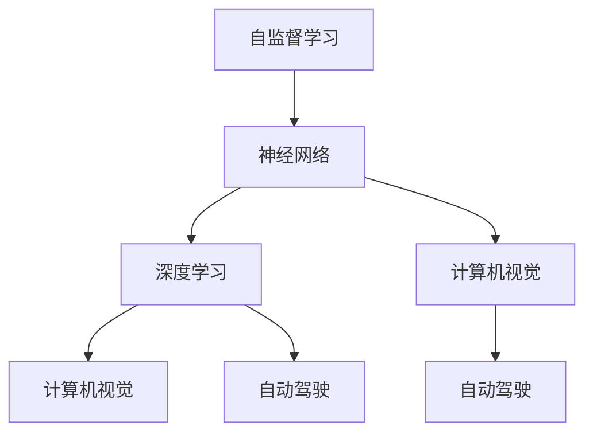

                 

# Andrej Karpathy：人工智能的未来发展策略

> 关键词：人工智能，深度学习，神经网络，计算机视觉，自监督学习，自动驾驶，未来预测

## 1. 背景介绍

### 1.1 问题由来
Andrej Karpathy 是深度学习领域的顶尖专家，以其在计算机视觉和自动驾驶领域的创新贡献闻名。本文将探讨他关于人工智能未来的发展策略。

### 1.2 问题核心关键点
Andrej Karpathy 强调了自监督学习的重要性，认为它是构建智能系统的重要基础。他指出，自监督学习可以让模型从无标签数据中学习到丰富的特征，从而提高泛化能力。

## 2. 核心概念与联系

### 2.1 核心概念概述
Andrej Karpathy 的核心概念包括：

- **自监督学习**：通过未标注数据进行学习，无需人工标注。
- **神经网络**：通过多层非线性映射实现复杂特征提取。
- **深度学习**：多层次的非线性处理，从而解决复杂任务。
- **计算机视觉**：使用神经网络处理图像数据，实现自动驾驶等任务。
- **自动驾驶**：结合深度学习和计算机视觉技术，实现无人驾驶。

### 2.2 概念间的关系

Andrej Karpathy 认为，自监督学习是深度学习的基础，神经网络是其核心算法，计算机视觉和自动驾驶是其应用场景。自监督学习通过未标注数据，使得神经网络能够学习到更加丰富的特征表示，从而提高深度学习的性能。

以下是一个简单的 Mermaid 流程图，展示了这些核心概念之间的关系：



## 3. 核心算法原理 & 具体操作步骤
### 3.1 算法原理概述

Andrej Karpathy 认为，自监督学习是构建智能系统的关键。他指出，自监督学习可以在大规模未标注数据上训练模型，从中学习到数据的特征表示。这些特征表示可以用于监督学习任务，从而提高模型的泛化能力。

### 3.2 算法步骤详解

自监督学习的典型步骤包括：

1. **数据准备**：收集大规模未标注数据集。
2. **特征提取**：使用神经网络提取数据特征。
3. **损失函数设计**：设计合适的自监督损失函数，如预测任务、重构误差等。
4. **模型训练**：在未标注数据上训练模型，优化损失函数。
5. **特征迁移**：将学习到的特征表示用于监督学习任务，进行微调。

### 3.3 算法优缺点

自监督学习的优点包括：

- **无需人工标注**：节省了标注成本。
- **数据多样性**：能够利用大规模未标注数据进行训练。
- **泛化能力强**：学习到丰富的特征表示，适用于多种任务。

缺点包括：

- **难度大**：设计合适的自监督损失函数和训练策略具有挑战性。
- **数据依赖**：需要大规模未标注数据才能取得良好效果。

### 3.4 算法应用领域

自监督学习已经在图像识别、自然语言处理、推荐系统等领域取得了显著成果。例如：

- **图像识别**：通过预测图像中的局部区域或像素，学习到图像的全局特征。
- **自然语言处理**：通过掩码语言模型、自编码等方法，学习到文本的语义表示。
- **推荐系统**：通过协同过滤、矩阵分解等方法，学习到用户和物品的隐向量表示。

## 4. 数学模型和公式 & 详细讲解 & 举例说明

### 4.1 数学模型构建

以下是一个简单的自监督学习模型：

```
Model = MLP(x;θ)
Loss = L(Model(x), x')
```

其中，$MLP$ 表示多层感知机，$x$ 表示输入数据，$x'$ 表示数据重构后的预测值。

### 4.2 公式推导过程

自监督学习的目标是最小化预测误差，即：

$$
\min_{\theta} \mathbb{E}_{x \sim D} \left[ \ell(M_{\theta}(x), x') \right]
$$

其中，$D$ 表示未标注数据集，$M_{\theta}(x)$ 表示模型对输入数据 $x$ 的预测，$\ell$ 表示损失函数。

### 4.3 案例分析与讲解

以图像识别为例，常用的自监督损失函数包括：

- **自编码器**：$M_{\theta}$ 将输入图像 $x$ 重构为 $x'$，最小化重构误差。
- **预测任务**：$M_{\theta}$ 预测图像中的局部区域，最小化预测误差。
- **视角生成**：$M_{\theta}$ 生成输入图像的不同视角，最小化视角之间的差异。

## 5. 项目实践：代码实例和详细解释说明
### 5.1 开发环境搭建

Andrej Karpathy 推荐使用 PyTorch 进行深度学习开发。以下是一个简单的 PyTorch 环境搭建步骤：

1. 安装 Anaconda。
2. 创建 Python 虚拟环境。
3. 安装 PyTorch 和相关依赖库。

```bash
conda create -n pytorch-env python=3.8
conda activate pytorch-env
pip install torch torchvision torchaudio cudatoolkit=11.1 -c pytorch -c conda-forge
```

### 5.2 源代码详细实现

以下是一个简单的自监督学习示例，使用自编码器对 MNIST 数据集进行训练：

```python
import torch
import torch.nn as nn
import torch.optim as optim
from torchvision import datasets, transforms

class AutoEncoder(nn.Module):
    def __init__(self):
        super(AutoEncoder, self).__init__()
        self.encoder = nn.Sequential(
            nn.Linear(784, 512),
            nn.ReLU(),
            nn.Linear(512, 256),
            nn.ReLU(),
            nn.Linear(256, 128),
            nn.ReLU()
        )
        self.decoder = nn.Sequential(
            nn.Linear(128, 256),
            nn.ReLU(),
            nn.Linear(256, 512),
            nn.ReLU(),
            nn.Linear(512, 784),
            nn.Sigmoid()
        )

    def forward(self, x):
        x = self.encoder(x)
        x = self.decoder(x)
        return x

device = torch.device('cuda' if torch.cuda.is_available() else 'cpu')
model = AutoEncoder().to(device)
criterion = nn.MSELoss()
optimizer = optim.Adam(model.parameters(), lr=0.001)

train_loader = torch.utils.data.DataLoader(
    datasets.MNIST('../data', train=True, download=True,
                   transform=transforms.ToTensor()),
    batch_size=64, shuffle=True)

for epoch in range(10):
    for batch_idx, (data, target) in enumerate(train_loader):
        data, target = data.to(device), target.to(device)
        optimizer.zero_grad()
        output = model(data)
        loss = criterion(output, data.view(-1, 784))
        loss.backward()
        optimizer.step()
        if (batch_idx + 1) % 100 == 0:
            print('Train Epoch: {} [{}/{} ({:.0f}%)]\tLoss: {:.6f}'.format(
                epoch, batch_idx * len(data), len(train_loader.dataset),
                100. * batch_idx / len(train_loader), loss.item()))
```

### 5.3 代码解读与分析

上述代码中，我们定义了一个简单的自编码器，使用 MNIST 数据集进行训练。具体步骤如下：

1. 定义自编码器结构。
2. 准备训练数据集。
3. 定义损失函数和优化器。
4. 在训练数据上迭代训练。

### 5.4 运行结果展示

训练过程中，我们可以观察到损失函数逐渐减小，模型重构误差逐渐降低，这表明模型已经学习了到有效的特征表示。

## 6. 实际应用场景

### 6.1 计算机视觉

Andrej Karpathy 认为，计算机视觉是自监督学习的重要应用场景之一。通过大规模无标签图像数据，训练神经网络可以学习到丰富的特征表示，从而实现图像分类、目标检测、图像生成等任务。

### 6.2 自然语言处理

自监督学习在自然语言处理中也具有重要应用。例如，使用掩码语言模型，可以学习到文本的语义表示，用于文本分类、情感分析等任务。

### 6.3 自动驾驶

自动驾驶是安德烈·卡帕西的另一个重要研究方向。通过自监督学习，自动驾驶系统可以从大规模无标签视频数据中学习到复杂的驾驶场景，从而提高系统的鲁棒性和泛化能力。

## 7. 工具和资源推荐
### 7.1 学习资源推荐

Andrej Karpathy 推荐以下学习资源：

1. **《Deep Learning Specialization》**：由 Andrew Ng 教授讲授的深度学习系列课程，覆盖了深度学习的基础和进阶知识。
2. **《Learning to Drive》**：Andrej Karpathy 本人讲授的自动驾驶课程，详细介绍了自动驾驶的原理和实践。
3. **《Neural Networks and Deep Learning》**：由 Ian Goodfellow 教授撰写，全面介绍了深度学习的原理和应用。
4. **《CS231n: Convolutional Neural Networks for Visual Recognition》**：斯坦福大学开设的计算机视觉课程，涵盖了深度学习在计算机视觉中的应用。

### 7.2 开发工具推荐

Andrej Karpathy 推荐以下开发工具：

1. **PyTorch**：深度学习领域的主流框架，提供了丰富的预训练模型和高效计算图。
2. **TensorFlow**：由 Google 主导的开源深度学习框架，支持大规模分布式训练。
3. **Keras**：一个高级的深度学习 API，可以方便地进行模型搭建和训练。
4. **JAX**：一个高性能的深度学习框架，支持自动微分和分布式计算。

### 7.3 相关论文推荐

以下是安德烈·卡帕西的一些重要论文：

1. **《Concrete Visual Reasoning》**：提出了一种基于注意力机制的视觉推理方法，可以解释图像中的推理过程。
2. **《Adversarial Examples for Visual Recognition》**：研究了对抗样本在图像分类中的影响，提出了防御方法。
3. **《Learning to Drive》**：详细介绍了自动驾驶系统的原理和实践，包括计算机视觉和深度学习的应用。

## 8. 总结：未来发展趋势与挑战

### 8.1 研究成果总结

Andrej Karpathy 的研究成果包括：

1. **深度学习在计算机视觉中的应用**：提出了一系列深度学习模型和算法，如残差网络、卷积神经网络等，提高了计算机视觉系统的性能。
2. **自动驾驶系统**：设计和实现了多个自动驾驶系统，包括图像分类、目标检测、路径规划等功能。
3. **自监督学习**：提出了多种自监督学习方法，如自编码器、掩码语言模型等，提高了深度学习的泛化能力。

### 8.2 未来发展趋势

未来，自监督学习将继续在深度学习中发挥重要作用。以下是一些趋势：

1. **数据利用率提升**：通过大规模未标注数据的自监督学习，可以显著提高数据利用率。
2. **泛化能力增强**：自监督学习可以学习到更加丰富的特征表示，提高模型的泛化能力。
3. **多模态融合**：将视觉、听觉、文本等多种模态数据结合，实现更加全面的智能系统。

### 8.3 面临的挑战

尽管自监督学习取得了许多进展，但仍面临以下挑战：

1. **数据获取困难**：获取大规模未标注数据仍然是一个难题。
2. **计算资源需求高**：训练大规模自监督模型需要高性能计算资源。
3. **模型解释性不足**：自监督学习的模型往往是“黑盒”，难以解释其决策过程。

### 8.4 研究展望

未来，自监督学习将继续推动深度学习的发展。以下是一些研究方向：

1. **自监督学习的多样性**：探索更多自监督学习任务和方法，如自预测、自重建等。
2. **自监督学习的可解释性**：研究如何提高自监督学习的模型解释性，增强其可信度。
3. **自监督学习的融合**：将自监督学习与其他技术结合，如生成对抗网络、强化学习等，实现更加智能的系统。

总之，Andrej Karpathy 认为，自监督学习是深度学习的重要基础，未来将继续在计算机视觉、自动驾驶等领域发挥重要作用。通过不断探索和改进，自监督学习将为构建智能系统提供更加高效、可靠的基础。

## 9. 附录：常见问题与解答

**Q1：自监督学习和监督学习有什么区别？**

A: 自监督学习不需要标注数据，通过未标注数据进行学习；而监督学习需要标注数据，通过标注数据进行学习。

**Q2：自监督学习的应用场景有哪些？**

A: 自监督学习适用于图像识别、自然语言处理、推荐系统等领域。

**Q3：自监督学习的优势和劣势是什么？**

A: 自监督学习的优势在于不需要标注数据，可以充分利用未标注数据；劣势在于设计合适的自监督损失函数具有挑战性。

**Q4：自监督学习的发展方向有哪些？**

A: 未来的研究将探索更多自监督学习任务和方法，如自预测、自重建等；同时，也将研究如何提高自监督学习的模型解释性。

**Q5：自监督学习的应用前景如何？**

A: 自监督学习将在深度学习、计算机视觉、自动驾驶等领域发挥重要作用，推动智能系统的进一步发展。

---

作者：禅与计算机程序设计艺术 / Zen and the Art of Computer Programming

