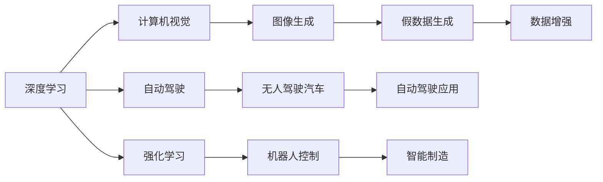

                 

# Andrej Karpathy：人工智能的未来趋势

在探索人工智能（AI）的未来趋势时，我们不能忽视Andrej Karpathy的视角和洞见。作为OpenAI的杰出研究员、深度学习领域的领军人物之一，Karpathy以其卓越的学术成就、富有洞察力的公开演讲和广泛的社交媒体影响力而闻名。他的思考不仅引领了AI的研究方向，还对业界产生了深远影响。本文将深入探讨Andrej Karpathy对人工智能未来趋势的见解，揭示其对当前和未来技术发展的深刻洞察。

## 1. 背景介绍

Andrej Karpathy于1987年出生于斯洛文尼亚，在进入斯坦福大学攻读博士学位之前，他在爱丁堡大学获得了计算机科学硕士学位。他的研究方向包括深度学习、计算机视觉和自动驾驶等领域，发表了大量高影响力的研究成果。Karpathy现任OpenAI的研究科学家，同时也是斯坦福大学的教员。

Karpathy的贡献不仅限于学术界，他还积极参与开源社区，推出了许多被广泛使用的深度学习库和工具，如DeepLearning.AI。他的公共演讲和博客文章吸引了全球数百万读者，成为了AI界的网红人物。

## 2. 核心概念与联系

### 2.1 核心概念概述

理解Andrej Karpathy对未来AI趋势的预测，需要掌握以下几个核心概念：

- **深度学习（Deep Learning）**：一种模拟人脑神经网络结构的机器学习技术，通过多层非线性变换来处理复杂的输入数据。
- **自动驾驶（Autonomous Driving）**：利用AI技术使车辆能够自主导航，无需人类干预。
- **计算机视觉（Computer Vision）**：使计算机能够“看”和“理解”图像和视频中的内容。
- **强化学习（Reinforcement Learning）**：通过与环境互动，使AI系统在不断试错中学习最优策略。
- **生成对抗网络（GANs）**：由生成器和判别器组成的网络，用于生成高质量的图像、音频等数据。

这些概念构成了Karpathy对AI未来趋势思考的基础。

### 2.2 概念间的关系

Karpathy的AI未来趋势预测是基于对上述核心概念的深刻理解和它们的相互联系。以下是一个Mermaid流程图，展示了这些概念之间的关系：



这个流程图展示了深度学习如何渗透到计算机视觉、自动驾驶、强化学习等领域，以及这些技术如何共同推动AI的进步。

## 3. 核心算法原理 & 具体操作步骤

### 3.1 算法原理概述

Karpathy认为，未来的AI将是一个以深度学习为基础的“通用智能体”，能够在多个领域中自主学习和适应。以下是他关于AI未来趋势的主要预测：

- **多模态学习**：未来的AI将不仅仅局限于处理单一类型的数据（如图像、文本），而是能够整合多种数据源，包括视觉、听觉、触觉等，以实现更全面的理解和智能。
- **自监督学习**：AI系统将更多地依赖于自监督学习，即在缺乏大量标注数据的情况下，通过数据的内在结构和模式进行学习。
- **对抗性训练**：为了提高模型的鲁棒性，未来的AI将广泛应用对抗性训练技术，使模型能够更好地应对恶意攻击和噪声数据。
- **强化学习**：AI系统将更加依赖强化学习，通过与环境互动来学习最优策略，从而在动态和不确定的环境中做出决策。

### 3.2 算法步骤详解

以下是一个基于Karpathy视角的AI未来发展路径，分为四个主要步骤：

1. **数据准备**：收集和预处理多样化的数据，涵盖不同模态和领域，为多模态学习奠定基础。
2. **模型设计**：设计具有多模态适应能力的深度学习模型，使用自监督和对抗性训练技术提高模型鲁棒性。
3. **强化学习**：在动态环境中，通过强化学习让AI系统不断优化其策略，提升决策能力和适应性。
4. **部署与应用**：将训练好的AI模型部署到实际应用场景中，持续收集反馈，优化模型性能。

### 3.3 算法优缺点

Karpathy认为，未来AI的优点包括：

- **适应性强**：能够处理多种数据模态和复杂场景，提供更全面和智能的解决方案。
- **学习效率高**：自监督和强化学习技术使得AI系统在缺乏标注数据的情况下也能快速学习。
- **鲁棒性强**：通过对抗性训练，AI模型能够更好地应对噪声和攻击。

但同时也存在一些挑战：

- **数据隐私和安全**：多模态学习和数据增强技术可能涉及大量敏感数据，如何保护隐私和确保数据安全是一个重要问题。
- **模型解释性**：AI系统的决策过程复杂，难以解释，这在某些高风险领域（如医疗、金融）可能带来信任危机。
- **计算资源需求高**：多模态学习和深度学习模型需要大量的计算资源，可能会限制AI的普及和应用。

### 3.4 算法应用领域

Karpathy认为，AI的广泛应用将覆盖以下几个领域：

- **医疗健康**：AI系统可以辅助医生进行疾病诊断、药物研发和个性化治疗。
- **自动驾驶**：通过深度学习和强化学习，AI系统能够实现无人驾驶汽车和智能交通管理。
- **智能家居**：多模态学习和计算机视觉技术可以实现智能家居系统的环境感知和智能控制。
- **金融科技**：AI系统可以用于风险评估、欺诈检测和个性化投资建议。
- **教育**：AI辅助的教育系统可以根据学生的学习习惯和进度，提供个性化的学习内容和反馈。

## 4. 数学模型和公式 & 详细讲解

### 4.1 数学模型构建

Karpathy的预测是基于深度学习和强化学习模型的数学构建。以下是一个简单的自监督学习模型，用于图像数据的多模态学习：

- **输入**：图像$x$和标签$y$。
- **目标**：最大化预测标签的概率$p(y|x)$。
- **模型**：使用深度神经网络$f$，对输入$x$进行映射，得到标签概率分布$p(y|x)$。
- **损失函数**：交叉熵损失函数$\mathcal{L} = -\sum_y p(y|x) \log f(x)$。

### 4.2 公式推导过程

对于图像数据，假设有一个卷积神经网络（CNN）作为特征提取器，将输入图像$x$映射到特征向量$z$。然后使用全连接层将$z$映射到标签概率分布$p(y|z)$。则模型输出的概率分布为：

$$
p(y|x) = \int p(y|z) p(z|x) dz = \frac{p(y|z)}{\int p(y|z) dz}
$$

其中，$p(z|x)$为特征提取器输出的概率分布。通过最大化交叉熵损失函数，最小化预测误差。

### 4.3 案例分析与讲解

以Karpathy所在的OpenAI开发的DALL-E为例，这是一个使用自监督学习进行图像生成的模型。DALL-E通过大规模的图像-文本数据集进行预训练，学习了丰富的语义知识。然后在图像生成任务上进行微调，能够根据自然语言描述生成高质量的图像。该模型展示了多模态学习和自监督学习在图像生成中的强大能力。

## 5. 项目实践：代码实例和详细解释说明

### 5.1 开发环境搭建

搭建AI开发环境，需要以下步骤：

1. **安装Python**：推荐使用Anaconda或Miniconda，安装最新版本的Python和相关依赖库。
2. **安装深度学习库**：安装TensorFlow、PyTorch、Keras等深度学习框架。
3. **安装数据处理库**：安装NumPy、Pandas、SciPy等数据处理和分析库。
4. **安装可视化库**：安装Matplotlib、Seaborn等数据可视化库。

### 5.2 源代码详细实现

以下是一个使用PyTorch实现的自监督学习模型示例：

```python
import torch
import torch.nn as nn
import torchvision.transforms as transforms

# 定义模型
class Autoencoder(nn.Module):
    def __init__(self):
        super(Autoencoder, self).__init__()
        self.encoder = nn.Sequential(
            nn.Conv2d(3, 32, 3, stride=2, padding=1),
            nn.ReLU(),
            nn.Conv2d(32, 64, 3, stride=2, padding=1),
            nn.ReLU(),
            nn.Conv2d(64, 128, 3, stride=2, padding=1),
            nn.ReLU()
        )
        self.decoder = nn.Sequential(
            nn.ConvTranspose2d(128, 64, 3, stride=2, padding=1),
            nn.ReLU(),
            nn.ConvTranspose2d(64, 32, 3, stride=2, padding=1),
            nn.ReLU(),
            nn.ConvTranspose2d(32, 3, 3, stride=2, padding=1),
            nn.Tanh()
        )

    def forward(self, x):
        encoded = self.encoder(x)
        decoded = self.decoder(encoded)
        return decoded

# 加载数据
transform = transforms.Compose([
    transforms.ToTensor(),
    transforms.Normalize((0.5, 0.5, 0.5), (0.5, 0.5, 0.5))
])
trainset = torchvision.datasets.CIFAR10(root='./data', train=True, download=True, transform=transform)
trainloader = torch.utils.data.DataLoader(trainset, batch_size=64, shuffle=True)

# 定义模型和优化器
model = Autoencoder()
optimizer = torch.optim.Adam(model.parameters(), lr=0.001)

# 训练模型
for epoch in range(100):
    for images, _ in trainloader:
        images = images.to(device)
        optimizer.zero_grad()
        output = model(images)
        loss = nn.functional.mse_loss(output, images)
        loss.backward()
        optimizer.step()
```

### 5.3 代码解读与分析

上述代码实现了一个简单的自监督学习模型，用于图像数据的编码和解码。模型首先通过卷积层进行特征提取，然后使用反卷积层进行图像重构。在训练过程中，通过最小化均方误差损失函数，使模型能够学习到图像的压缩和重建能力。

## 6. 实际应用场景

### 6.4 未来应用展望

Karpathy认为，未来AI将在以下几个方面取得突破：

- **自监督学习**：在缺乏标注数据的情况下，自监督学习将使AI系统具备更强的泛化能力。
- **多模态数据融合**：通过整合视觉、听觉、触觉等多种数据源，AI系统将能够更全面地理解和交互。
- **强化学习**：AI系统将在复杂动态环境中，通过不断试错和学习，实现更智能的决策和适应。
- **个性化**：AI系统将能够根据用户行为和偏好，提供高度个性化的服务，如智能推荐、个性化医疗等。

## 7. 工具和资源推荐

### 7.1 学习资源推荐

1. **Coursera《深度学习专项课程》**：由吴恩达教授主讲，涵盖了深度学习的基础知识和高级技术，适合初学者和进阶者。
2. **Kaggle竞赛平台**：提供了大量数据集和比赛任务，适合实战练习和技能提升。
3. **arXiv预印本**：获取最新的深度学习和AI研究成果，紧跟学科前沿。
4. **GitHub开源项目**：搜索和学习优秀的深度学习项目和代码，推动自己的研究和实践。

### 7.2 开发工具推荐

1. **PyTorch**：由Facebook开发，提供了灵活的深度学习框架，适合研究型项目和快速迭代。
2. **TensorFlow**：由Google开发，适合大规模生产部署和模型优化。
3. **Jupyter Notebook**：强大的交互式编程环境，支持Python代码的执行和可视化。
4. **Colab**：Google开发的免费云服务，支持GPU和TPU计算，适合快速实验和分享。

### 7.3 相关论文推荐

1. **《Image Is All You Need》**：由Google提出，展示了自监督学习在图像生成中的潜力。
2. **《Playing Atari with Deep Reinforcement Learning》**：由DeepMind开发，展示了强化学习在游戏AI中的应用。
3. **《Domain Adaptation with Coupled Generative Adversarial Networks》**：由OpenAI提出，展示了生成对抗网络在数据增强中的应用。

## 8. 总结：未来发展趋势与挑战

### 8.1 研究成果总结

Andrej Karpathy的研究成果和见解，为AI的未来发展提供了宝贵的视角和思考。他强调了多模态学习、自监督学习和强化学习的重要性，揭示了AI在医疗、自动驾驶等领域的应用潜力。同时，他也指出了数据隐私、模型解释性和计算资源等挑战，提出了有针对性的解决方案。

### 8.2 未来发展趋势

1. **多模态学习**：AI系统将能够整合多种数据模态，实现更全面和智能的解决方案。
2. **自监督学习**：在缺乏标注数据的情况下，自监督学习将使AI系统具备更强的泛化能力。
3. **强化学习**：AI系统将在复杂动态环境中，通过不断试错和学习，实现更智能的决策和适应。
4. **个性化**：AI系统将能够根据用户行为和偏好，提供高度个性化的服务。

### 8.3 面临的挑战

1. **数据隐私和安全**：多模态学习和数据增强技术可能涉及大量敏感数据，如何保护隐私和确保数据安全是一个重要问题。
2. **模型解释性**：AI系统的决策过程复杂，难以解释，这在某些高风险领域可能带来信任危机。
3. **计算资源需求高**：多模态学习和深度学习模型需要大量的计算资源，可能会限制AI的普及和应用。

### 8.4 研究展望

未来的AI研究应着重解决数据隐私和安全问题，提高模型的解释性和可控性，降低计算资源需求，推动AI技术的普及和应用。同时，应积极探索新的AI应用领域，推动学科的深入发展。

## 9. 附录：常见问题与解答

**Q1: 什么是自监督学习？**

A: 自监督学习是指在无监督数据上训练模型，通过数据的内在结构和模式进行学习，无需标注数据。

**Q2: 强化学习与监督学习有何不同？**

A: 强化学习与监督学习的主要区别在于，监督学习是给定标注数据，模型学习输入和输出之间的映射关系；而强化学习是通过与环境互动，通过奖励信号来学习最优策略。

**Q3: 多模态学习在AI中的应用前景如何？**

A: 多模态学习能够整合视觉、听觉、触觉等多种数据源，实现更全面和智能的解决方案，具有广阔的应用前景。

**Q4: 如何提高AI模型的解释性和可控性？**

A: 通过引入因果分析和博弈论工具，增强模型决策的因果性和逻辑性；同时，建立模型行为的监管机制，确保输出符合人类价值观和伦理道德。

通过深入理解Andrej Karpathy的预测和见解，我们可以更清晰地看到AI未来的发展趋势和面临的挑战，从而为未来的研究和实践奠定坚实的基础。

