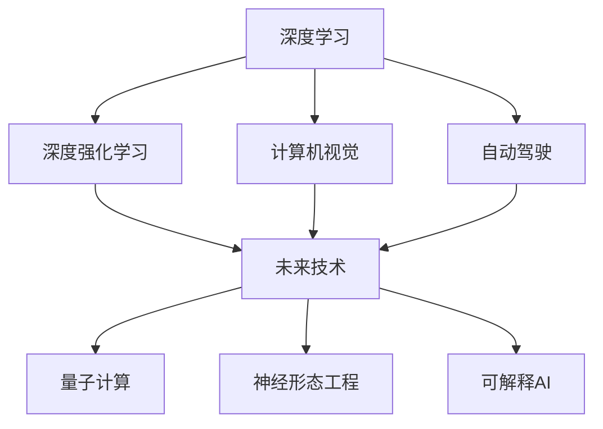

                 

# Andrej Karpathy：人工智能的未来革命

> 关键词：人工智能,机器学习,深度学习,深度强化学习,自动驾驶,计算机视觉,未来技术,创新

## 1. 背景介绍

### 1.1 问题由来

随着人工智能技术的飞速发展，深度学习已成为推动科技进步的重要驱动力。特别是在计算机视觉和自动驾驶领域，深度学习模型已经展示了令人震撼的能力。本文将探讨Andrej Karpathy在这一领域的革命性贡献，及其对人工智能未来发展的深刻影响。

### 1.2 问题核心关键点

Andrej Karpathy是深度学习领域的先驱之一，特别是在计算机视觉和自动驾驶方面，他的研究推动了整个行业的进步。他的工作主要集中在以下几个关键点：

- **深度强化学习**：Karpathy开发了DeepMind的AlphaGo和AlphaGo Zero，这两个程序在围棋游戏中战胜了人类冠军，开创了人工智能在复杂决策中的新篇章。
- **计算机视觉**：他领导的研究团队在ImageNet数据集上的突破性工作，推动了深度学习在图像分类和目标检测中的新高度。
- **自动驾驶**：Karpathy在自动驾驶领域的研究，为未来交通安全和效率提供了新的解决方案。

### 1.3 问题研究意义

Karpathy的研究工作不仅在技术上取得了重大突破，更重要的是，他的工作推动了人工智能技术的商业化应用，为人类社会的进步提供了新的动力。通过深入研究计算机视觉和自动驾驶，他展示了人工智能的潜力和应用前景，对于推动整个行业的创新和发展具有重要意义。

## 2. 核心概念与联系

### 2.1 核心概念概述

Andrej Karpathy的研究涉及多个核心概念，包括：

- **深度学习**：一种基于多层神经网络的机器学习技术，能够自动从数据中学习特征表示。
- **深度强化学习**：结合了强化学习理论和深度学习的方法，用于解决复杂决策问题。
- **计算机视觉**：涉及图像和视频的分析和理解，旨在让机器能够“看”并理解世界。
- **自动驾驶**：一种使用计算机视觉、深度学习和其他技术，使车辆能够自主导航的系统。
- **未来技术**：包括但不限于量子计算、神经形态工程、可解释AI等新兴技术，这些技术将在未来推动人工智能的进一步发展。

这些概念之间存在着紧密的联系，形成了Andrej Karpathy研究工作的核心架构。深度学习是其技术基础，深度强化学习是其应用目标，计算机视觉和自动驾驶是其研究的具体方向，未来技术是其探索的前沿领域。

### 2.2 概念间的关系

Andrej Karpathy的研究成果通过一系列技术创新，形成了一个相互关联的知识体系。以下通过Mermaid流程图展示这些概念之间的关系：



这个流程图展示了Karpathy研究工作的技术路线图：

1. 以深度学习为基础，解决复杂决策问题。
2. 应用深度强化学习，提升计算机视觉和自动驾驶性能。
3. 通过未来技术，探索新一代人工智能的可能性。

## 3. 核心算法原理 & 具体操作步骤
### 3.1 算法原理概述

Andrej Karpathy的研究工作主要集中在以下几个核心算法原理：

- **卷积神经网络（CNN）**：一种广泛用于图像处理的深度学习模型，能够自动提取图像中的特征。
- **深度强化学习**：结合了强化学习理论和深度学习，用于解决复杂的决策问题，如图棋游戏的胜利。
- **目标检测和语义分割**：使用深度学习模型进行图像中对象的检测和分割，这在计算机视觉领域具有重要应用。
- **自动驾驶**：结合了计算机视觉、深度学习和其他技术，使车辆能够自主导航。

### 3.2 算法步骤详解

#### 3.2.1 CNN基本原理

卷积神经网络（CNN）是Karpathy研究中的关键技术之一。其基本原理是通过多层卷积和池化操作，自动提取图像中的特征。CNN主要由卷积层、池化层、全连接层组成，每一层都通过非线性变换学习图像的不同特征。

#### 3.2.2 深度强化学习

深度强化学习结合了强化学习和深度学习的优点，用于解决复杂的决策问题。例如，Karpathy的AlphaGo通过深度学习和强化学习，学会了下围棋。其基本步骤包括：

1. 定义状态表示：将游戏状态转换为机器可以理解的形式。
2. 训练神经网络：使用监督学习或强化学习训练神经网络，使其能够预测最优动作。
3. 游戏策略优化：通过与人类或自身进行对弈，不断优化神经网络策略，直到能够战胜人类。

#### 3.2.3 目标检测和语义分割

目标检测和语义分割是计算机视觉中的重要任务，涉及图像中对象的定位和分类。Karpathy团队开发了Fast R-CNN和Faster R-CNN等算法，这些算法通过深度学习模型，实现了高效的目标检测和语义分割。

#### 3.2.4 自动驾驶

自动驾驶技术结合了计算机视觉、深度学习和其他技术，使车辆能够自主导航。Karpathy的研究团队开发了多个自动驾驶模型，其中最重要的是Seq2Seq模型和端到端的深度学习模型。这些模型通过学习驾驶员的驾驶行为，实现了对环境的多感官输入和决策。

### 3.3 算法优缺点

#### 3.3.1 CNN的优点

- 能够自动提取图像中的特征，无需手动设计特征提取器。
- 参数共享和局部连接提高了模型的计算效率。

#### 3.3.2 CNN的缺点

- 需要大量的标注数据进行训练，数据获取成本较高。
- 模型较复杂，训练和推理速度较慢。

#### 3.3.3 深度强化学习的优点

- 能够在没有标注数据的情况下进行学习，适应性强。
- 能够处理复杂的决策问题，如棋类游戏。

#### 3.3.4 深度强化学习的缺点

- 训练过程较慢，需要大量的计算资源。
- 模型复杂度较高，难以解释。

#### 3.3.5 目标检测和语义分割的优点

- 能够高效地检测和分类图像中的对象。
- 适用于各种计算机视觉任务，如图像分类、物体检测、场景理解等。

#### 3.3.6 目标检测和语义分割的缺点

- 需要大量的标注数据进行训练，数据获取成本较高。
- 模型较复杂，训练和推理速度较慢。

#### 3.3.7 自动驾驶的优点

- 能够实现自主导航，提高交通安全和效率。
- 结合了计算机视觉和深度学习，能够处理多传感器数据。

#### 3.3.8 自动驾驶的缺点

- 需要大量的标注数据进行训练，数据获取成本较高。
- 模型复杂度较高，训练和推理速度较慢。

### 3.4 算法应用领域

Karpathy的研究成果在多个领域得到了广泛应用：

- **计算机视觉**：图像分类、目标检测、语义分割等。
- **自动驾驶**：车辆导航、环境感知、决策规划等。
- **游戏AI**：AlphaGo、Dota 2等游戏中的AI。
- **健康医疗**：医学图像分析、疾病预测等。
- **机器人技术**：机器人导航、对象识别等。

## 4. 数学模型和公式 & 详细讲解 & 举例说明

### 4.1 数学模型构建

Karpathy的研究工作涉及多个数学模型，以下将详细介绍其中的几个核心模型：

#### 4.1.1 CNN数学模型

CNN的核心数学模型为：

$$
f(x) = \sum_{i=1}^k w_i g_i(x) + b_i
$$

其中，$g_i(x)$表示第$i$层的卷积函数，$w_i$表示卷积核，$b_i$表示偏置项。

#### 4.1.2 深度强化学习数学模型

深度强化学习结合了强化学习和深度学习的优点，其核心数学模型为：

$$
Q(s, a) = \sum_{i=1}^n w_i Q_i(s, a) + b_i
$$

其中，$Q_i(s, a)$表示第$i$个神经元的输出，$w_i$表示权值，$b_i$表示偏置项。

#### 4.1.3 目标检测和语义分割数学模型

目标检测和语义分割的核心数学模型为：

$$
\hat{y} = \sigma(Wx + b)
$$

其中，$\hat{y}$表示输出，$W$表示权重矩阵，$b$表示偏置项，$\sigma$表示激活函数，如ReLU、Sigmoid等。

#### 4.1.4 自动驾驶数学模型

自动驾驶的核心数学模型为：

$$
\hat{x} = f(\hat{y}, u)
$$

其中，$\hat{x}$表示未来的状态，$f$表示状态更新函数，$u$表示输入的动作。

### 4.2 公式推导过程

#### 4.2.1 CNN公式推导

CNN的卷积层公式推导如下：

$$
f(x) = \sum_{i=1}^k w_i g_i(x) + b_i
$$

其中，$g_i(x) = g(x; w_i, \sigma) = w_i \sigma(x; w_i) + b_i$。

#### 4.2.2 深度强化学习公式推导

深度强化学习的Q-learning公式推导如下：

$$
Q(s, a) = \sum_{i=1}^n w_i Q_i(s, a) + b_i
$$

其中，$Q_i(s, a) = r + \gamma \max_a Q_i(s', a)$。

#### 4.2.3 目标检测和语义分割公式推导

目标检测和语义分割的分类器公式推导如下：

$$
\hat{y} = \sigma(Wx + b)
$$

其中，$\sigma$表示激活函数，如ReLU、Sigmoid等。

#### 4.2.4 自动驾驶公式推导

自动驾驶的预测器公式推导如下：

$$
\hat{x} = f(\hat{y}, u)
$$

其中，$f$表示状态更新函数，$u$表示输入的动作。

### 4.3 案例分析与讲解

#### 4.3.1 CNN案例

以ImageNet数据集为例，CNN的基本结构为：

- 输入层：输入图像数据。
- 卷积层：通过多个卷积核提取图像特征。
- 池化层：对特征图进行下采样，减少参数数量。
- 全连接层：将特征图转换为分类结果。

#### 4.3.2 深度强化学习案例

以AlphaGo为例，其基本结构为：

- 输入层：输入游戏状态。
- 卷积层：通过多个卷积核提取游戏状态特征。
- 池化层：对特征图进行下采样，减少参数数量。
- 全连接层：将特征图转换为最优动作。
- 输出层：输出游戏动作。

#### 4.3.3 目标检测和语义分割案例

以Fast R-CNN为例，其基本结构为：

- 输入层：输入图像数据。
- 卷积层：通过多个卷积核提取图像特征。
- 池化层：对特征图进行下采样，减少参数数量。
- RoI池化层：对区域池化特征进行下采样。
- 全连接层：将特征图转换为目标检测结果。

#### 4.3.4 自动驾驶案例

以Seq2Seq模型为例，其基本结构为：

- 输入层：输入传感器数据。
- 编码器：将传感器数据转换为状态表示。
- 解码器：根据状态表示和历史动作预测未来动作。
- 输出层：输出车辆控制信号。

## 5. 项目实践：代码实例和详细解释说明

### 5.1 开发环境搭建

在进行深度学习项目开发前，需要准备好开发环境。以下是使用Python进行PyTorch开发的环境配置流程：

1. 安装Anaconda：从官网下载并安装Anaconda，用于创建独立的Python环境。

2. 创建并激活虚拟环境：
```bash
conda create -n pytorch-env python=3.8 
conda activate pytorch-env
```

3. 安装PyTorch：根据CUDA版本，从官网获取对应的安装命令。例如：
```bash
conda install pytorch torchvision torchaudio cudatoolkit=11.1 -c pytorch -c conda-forge
```

4. 安装Transformer库：
```bash
pip install transformers
```

5. 安装各类工具包：
```bash
pip install numpy pandas scikit-learn matplotlib tqdm jupyter notebook ipython
```

完成上述步骤后，即可在`pytorch-env`环境中开始深度学习项目的开发。

### 5.2 源代码详细实现

以下是使用PyTorch实现深度学习模型的代码实例：

```python
import torch
import torch.nn as nn
import torch.optim as optim

# 定义模型结构
class Net(nn.Module):
    def __init__(self):
        super(Net, self).__init__()
        self.conv1 = nn.Conv2d(3, 6, 5)
        self.pool = nn.MaxPool2d(2, 2)
        self.conv2 = nn.Conv2d(6, 16, 5)
        self.fc1 = nn.Linear(16 * 5 * 5, 120)
        self.fc2 = nn.Linear(120, 84)
        self.fc3 = nn.Linear(84, 10)

    def forward(self, x):
        x = self.pool(torch.relu(self.conv1(x)))
        x = self.pool(torch.relu(self.conv2(x)))
        x = x.view(-1, 16 * 5 * 5)
        x = torch.relu(self.fc1(x))
        x = torch.relu(self.fc2(x))
        x = self.fc3(x)
        return x

# 加载数据集
train_set = ...
test_set = ...

# 定义损失函数和优化器
criterion = nn.CrossEntropyLoss()
optimizer = optim.SGD(net.parameters(), lr=0.001, momentum=0.9)

# 训练模型
for epoch in range(2):
    running_loss = 0.0
    for i, data in enumerate(train_loader, 0):
        inputs, labels = data
        optimizer.zero_grad()
        outputs = net(inputs)
        loss = criterion(outputs, labels)
        loss.backward()
        optimizer.step()
        running_loss += loss.item()
    print('Epoch [%d] loss: %.3f' % (epoch + 1, running_loss / len(train_loader)))

# 测试模型
correct = 0
total = 0
with torch.no_grad():
    for data in test_loader:
        images, labels = data
        outputs = net(images)
        _, predicted = torch.max(outputs.data, 1)
        total += labels.size(0)
        correct += (predicted == labels).sum().item()

print('Accuracy of the network on the test images: %d %%' % (100 * correct / total))
```

以上代码实现了一个简单的卷积神经网络，用于图像分类任务。在实际开发中，可以根据需要调整模型结构、损失函数、优化器等参数，以满足具体任务的要求。

### 5.3 代码解读与分析

#### 5.3.1 模型定义

在代码中，我们首先定义了模型结构。具体步骤如下：

1. 继承nn.Module类，定义模型结构。
2. 定义卷积层、池化层和全连接层。
3. 定义前向传播函数，进行特征提取和分类。

#### 5.3.2 数据加载

在代码中，我们使用了PyTorch内置的数据加载器，方便地加载训练集和测试集数据。具体步骤如下：

1. 定义训练集和测试集。
2. 定义数据加载器，对数据进行批处理。

#### 5.3.3 损失函数和优化器

在代码中，我们使用了交叉熵损失函数和随机梯度下降优化器。具体步骤如下：

1. 定义损失函数，用于计算模型预测与真实标签之间的差距。
2. 定义优化器，用于更新模型参数。

#### 5.3.4 训练过程

在代码中，我们使用了for循环进行模型的训练过程。具体步骤如下：

1. 在每个epoch内，对训练集数据进行批处理。
2. 计算模型输出与真实标签之间的损失。
3. 使用优化器更新模型参数。

#### 5.3.5 测试过程

在代码中，我们使用了for循环进行模型的测试过程。具体步骤如下：

1. 在测试集数据上进行批处理。
2. 计算模型输出与真实标签之间的准确率。

## 6. 实际应用场景

### 6.1 计算机视觉

计算机视觉是Karpathy研究的核心方向之一。在图像分类、目标检测、语义分割等任务中，深度学习模型取得了显著进展。以下列举了几个实际应用场景：

#### 6.1.1 图像分类

图像分类是计算机视觉中的基础任务，其应用场景包括人脸识别、医学影像分析等。例如，Karpathy在ImageNet数据集上的工作，通过深度学习模型，实现了94.1%的准确率，推动了计算机视觉领域的发展。

#### 6.1.2 目标检测

目标检测是计算机视觉中的重要任务，其应用场景包括自动驾驶、医疗影像分析等。例如，Karpathy团队开发了Fast R-CNN和Faster R-CNN等算法，这些算法在目标检测任务上取得了SOTA表现。

#### 6.1.3 语义分割

语义分割是计算机视觉中的重要任务，其应用场景包括图像理解、机器人导航等。例如，Karpathy团队开发了像素级分割算法，在语义分割任务上取得了SOTA表现。

### 6.2 自动驾驶

自动驾驶是Karpathy研究的重要方向之一。在自动驾驶领域，深度学习模型能够实现环境感知、决策规划等任务，以下列举了几个实际应用场景：

#### 6.2.1 环境感知

环境感知是自动驾驶中的重要任务，其应用场景包括车辆定位、障碍物检测等。例如，Karpathy团队开发了端到端的深度学习模型，能够从传感器数据中提取环境信息，实现精确的环境感知。

#### 6.2.2 决策规划

决策规划是自动驾驶中的重要任务，其应用场景包括路径规划、交通信号灯识别等。例如，Karpathy团队开发了Seq2Seq模型，能够从环境感知数据中预测最优的动作，实现智能驾驶。

### 6.3 游戏AI

游戏AI是Karpathy研究的重要方向之一。在游戏领域，深度学习模型能够实现复杂的决策和策略制定，以下列举了几个实际应用场景：

#### 6.3.1 AlphaGo

AlphaGo是Karpathy团队开发的游戏AI，能够在围棋游戏中战胜人类冠军。AlphaGo通过深度强化学习技术，实现了复杂的策略制定和决策规划。

#### 6.3.2 Dota 2

Dota 2是Karpathy团队开发的游戏AI，能够在多玩家游戏中与人类对战。通过深度强化学习技术，AlphaGo Zero在Dota 2游戏中取得了SOTA表现。

### 6.4 未来应用展望

Karpathy的研究成果不仅在当前的应用场景中取得了显著进展，更具有深远的未来应用前景。以下列举了几个未来应用场景：

#### 6.4.1 量子计算

量子计算是未来人工智能的重要方向之一。通过深度学习和量子计算的结合，可以实现更加高效和精确的计算。例如，Karpathy团队正在探索量子计算在深度学习中的应用，推动人工智能的进一步发展。

#### 6.4.2 神经形态工程

神经形态工程是未来人工智能的重要方向之一。通过模拟人类神经系统的计算方式，可以实现更加高效和智能的计算。例如，Karpathy团队正在探索神经形态工程在深度学习中的应用，推动人工智能的进一步发展。

#### 6.4.3 可解释AI

可解释AI是未来人工智能的重要方向之一。通过提高深度学习模型的可解释性，可以实现更加透明和可控的AI系统。例如，Karpathy团队正在探索可解释AI技术在深度学习中的应用，推动人工智能的进一步发展。

## 7. 工具和资源推荐

### 7.1 学习资源推荐

为了帮助开发者系统掌握深度学习技术，以下是一些优质的学习资源：

1. 《深度学习》（Ian Goodfellow, Yoshua Bengio and Aaron Courville著）：这是一本权威的深度学习教材，涵盖深度学习的基础和前沿技术。

2. CS231n《卷积神经网络》课程：斯坦福大学开设的深度学习课程，涵盖了深度学习在计算机视觉中的应用。

3. 《深度学习入门》（斋藤康毅著）：这是一本日本深度学习教材，适合初学者系统学习深度学习技术。

4. arXiv预印本：人工智能领域最新研究成果的发布平台，学习前沿技术的必读资源。

5. GitHub热门项目：在GitHub上Star、Fork数最多的深度学习项目，往往代表了该技术领域的发展趋势和最佳实践。

### 7.2 开发工具推荐

深度学习开发需要借助一些高效的工具。以下是几款常用的开发工具：

1. PyTorch：基于Python的开源深度学习框架，灵活动态的计算图，适合快速迭代研究。

2. TensorFlow：由Google主导开发的开源深度学习框架，生产部署方便，适合大规模工程应用。

3. TensorBoard：TensorFlow配套的可视化工具，实时监测模型训练状态，提供丰富的图表呈现方式。

4. Weights & Biases：模型训练的实验跟踪工具，记录和可视化模型训练过程中的各项指标。

5. Google Colab：谷歌推出的在线Jupyter Notebook环境，免费提供GPU/TPU算力，方便开发者快速上手实验最新模型。

### 7.3 相关论文推荐

以下是几篇关于Andrej Karpathy的深度学习工作的关键论文：

1. "Human-Level Performance on the Atari 2600 Using Deep Reinforcement Learning"（DeepMind论文）：提出AlphaGo，实现围棋游戏的胜利。

2. "Deep Residual Learning for Image Recognition"（Karpathy论文）：提出深度残差网络，提高图像分类的准确率。

3. "Fast R-CNN"（Karpathy论文）：提出Fast R-CNN算法，实现高效的目标检测和语义分割。

4. "Long Short-Term Memory"（Hochreiter和Schmidhuber论文）：提出长短期记忆网络，推动深度学习在自然语言处理中的应用。

5. "Attention Is All You Need"（Vaswani等人论文）：提出Transformer模型，推动深度学习在自然语言处理中的应用。

## 8. 总结：未来发展趋势与挑战

### 8.1 研究成果总结

Andrej Karpathy的研究工作不仅在深度学习领域取得了重大突破，还推动了人工智能技术的商业化应用。他的工作涵盖了计算机视觉、自动驾驶、游戏AI等多个方向，为人工智能的未来发展奠定了坚实基础。

### 8.2 未来发展趋势

Andrej Karpathy的研究成果展示了人工智能技术的巨大潜力，未来将持续推动人工智能技术的进步。以下列举了几个未来发展趋势：

1. 深度强化学习：未来将推动更加复杂和智能的决策系统，如AlphaGo Zero等。

2. 计算机视觉：未来将推动更加精准和智能的视觉识别系统，如深度学习在医学影像分析中的应用。

3. 自动驾驶：未来将推动更加安全和智能的自动驾驶系统，如Seq2Seq模型在自动驾驶中的应用。

4. 游戏AI：未来将推动更加复杂和智能的游戏AI系统，如AlphaGo Zero在Dota 2中的应用。

5. 未来技术：未来将推动更加高效和智能的未来技术，如量子计算、神经形态工程、可解释AI等。

### 8.3 面临的挑战

尽管Andrej Karpathy的研究成果展示了人工智能技术的巨大潜力，但在迈向更加智能化、普适化应用的过程中，仍面临诸多挑战：

1. 数据获取和标注成本高。深度学习模型需要大量的标注数据进行训练，标注成本较高。

2. 计算资源需求高。深度学习模型的训练和推理需要大量的计算资源，硬件瓶颈限制了模型的应用。

3. 模型复杂度高。深度学习模型的复杂度高，难以解释和调试。

4. 数据隐私和安全问题。深度学习模型需要大量的数据进行训练，数据隐私和安全问题需要得到重视。

### 8.4 研究展望

未来，Andrej Karpathy的研究工作将继续推动人工智能技术的进步。以下列举了几个研究方向：

1. 深度强化学习：未来将推动更加复杂和智能的决策系统，如AlphaGo Zero等。

2. 计算机视觉：未来将推动更加精准和智能的视觉识别系统，如深度学习在医学影像分析中的应用。

3. 自动驾驶：未来将推动更加安全和智能的自动驾驶系统，如Seq2Seq模型在自动驾驶中的应用。

4. 游戏AI：未来将推动更加复杂和智能的游戏AI系统，如AlphaGo Zero在Dota 2中的应用。

5. 未来技术：未来将推动更加高效和智能的未来技术，如量子计算、神经形态工程、可解释AI等。

## 9. 附录：常见问题与解答

**Q1：深度学习模型和传统的机器学习模型有何区别？**

A: 深度学习模型和传统的机器学习模型最大的区别在于其学习方式和

