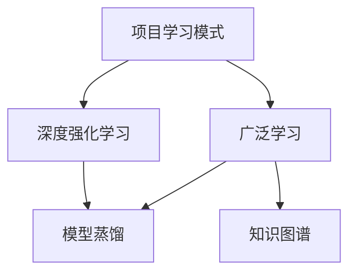
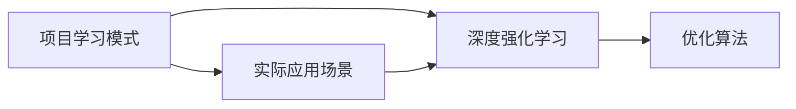
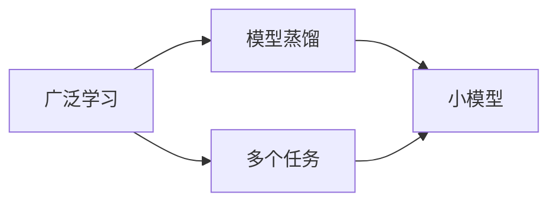
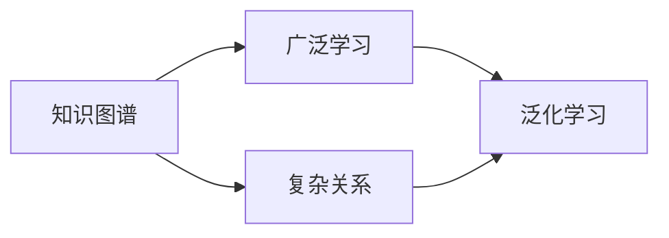
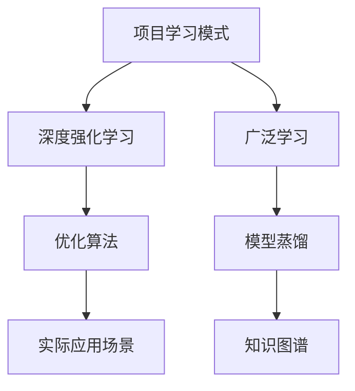

                 

# Andrej Karpathy：项目学习模式与广泛学习互补

人工智能领域的大师级人物Andrej Karpathy，以其在深度学习和计算机视觉方面的卓越贡献而闻名。Karpathy的研究不仅影响了深度学习的训练和优化算法，还开创了项目学习模式，推动了广泛学习的兴起。本文将深入探讨Karpathy的项目学习模式与广泛学习之间的互补关系，揭示其背后的数学原理和应用场景。

## 1. 背景介绍

### 1.1 问题由来
在深度学习领域，传统的监督学习方式依赖大量标注数据和复杂的模型优化。然而，随着数据量的不断增长和模型复杂度的提升，深度学习的训练和优化变得越来越困难。为了应对这一挑战，Karpathy提出了项目学习模式和广泛学习的新范式。

项目学习模式强调在实际应用中通过项目驱动学习，而广泛学习则关注模型在多个任务上的泛化能力。这两种方法相辅相成，帮助模型在有限的标注数据和多样化的任务上取得优异表现。

### 1.2 问题核心关键点
Karpathy提出的项目学习模式与广泛学习方法，其核心在于：

- **项目学习模式**：强调在真实世界项目中的实践学习，通过实际应用场景驱动模型优化。项目学习模式不仅能够提升模型的应用效率，还能够帮助模型更好地理解复杂环境下的问题。

- **广泛学习**：指模型在多个任务上通过泛化学习，提升模型的泛化能力和适应性。广泛学习使模型能够在不同领域和任务中保持高水平的性能。

这两种方法的有效结合，可以帮助模型在实际应用中发挥最大潜力，同时提升模型的泛化能力和适应性。

### 1.3 问题研究意义
研究Karpathy的项目学习模式与广泛学习，对于推动深度学习技术的发展和应用具有重要意义：

- 提高模型泛化能力：项目学习模式与广泛学习的结合，使模型能够更好地适应不同领域和任务，提升泛化能力。
- 降低数据标注成本：项目学习模式通过实际应用场景的驱动，减少了对标注数据的依赖。
- 增强模型鲁棒性：广泛学习通过多个任务的泛化学习，提升模型的鲁棒性和抗干扰能力。
- 加速模型应用：项目学习模式通过实际应用场景的实践，加速模型从实验室到实际应用的过程。

## 2. 核心概念与联系

### 2.1 核心概念概述

为更好地理解Karpathy的项目学习模式与广泛学习，本节将介绍几个密切相关的核心概念：

- **项目学习模式**：通过在实际项目中执行具体的任务来驱动模型的学习，强调模型的实际应用能力。
- **广泛学习**：通过在多个任务上的泛化学习，提升模型的泛化能力和适应性。
- **深度强化学习**：结合强化学习的思想，通过与环境交互来学习最优策略。
- **模型蒸馏**：通过将大模型的知识迁移到小模型，提升小模型的性能。
- **知识图谱**：利用图结构表示知识，帮助模型学习复杂关系和结构。

这些核心概念之间的逻辑关系可以通过以下Mermaid流程图来展示：



这个流程图展示了几大核心概念之间的关系：

1. 项目学习模式通过在实际项目中执行具体任务，驱动模型的学习。
2. 广泛学习通过在多个任务上的泛化学习，提升模型的泛化能力和适应性。
3. 深度强化学习结合实际应用场景，进一步优化模型的学习过程。
4. 模型蒸馏将大模型的知识迁移到小模型，提升小模型的性能。
5. 知识图谱帮助模型学习复杂关系和结构，提升模型的理解能力。

### 2.2 概念间的关系

这些核心概念之间存在着紧密的联系，形成了项目学习模式与广泛学习的高效生态系统。下面我们通过几个Mermaid流程图来展示这些概念之间的关系。

#### 2.2.1 项目学习模式与深度强化学习



这个流程图展示了项目学习模式与深度强化学习的关系。项目学习模式通过在实际应用场景中执行具体任务，驱动模型学习，而深度强化学习则通过与环境的交互，进一步优化模型的学习过程。

#### 2.2.2 广泛学习与模型蒸馏



这个流程图展示了广泛学习与模型蒸馏的关系。广泛学习通过在多个任务上的泛化学习，提升模型的泛化能力和适应性，而模型蒸馏则通过将大模型的知识迁移到小模型，提升小模型的性能。

#### 2.2.3 知识图谱与广泛学习



这个流程图展示了知识图谱与广泛学习的关系。知识图谱帮助模型学习复杂关系和结构，提升模型的理解能力，而广泛学习则通过在多个任务上的泛化学习，进一步提升模型的泛化能力和适应性。

### 2.3 核心概念的整体架构

最后，我们用一个综合的流程图来展示这些核心概念在大语言模型微调过程中的整体架构：



这个综合流程图展示了项目学习模式、深度强化学习、广泛学习、模型蒸馏和知识图谱之间的整体架构。这些概念共同构成了深度学习技术的高级学习范式，帮助模型在复杂多变的实际环境中取得优异表现。

## 3. 核心算法原理 & 具体操作步骤
### 3.1 算法原理概述

Karpathy提出的项目学习模式与广泛学习，本质上是一种通过实际应用场景驱动的深度学习优化策略。其核心思想是：

1. **项目学习模式**：通过在实际项目中执行具体任务，驱动模型的学习，提升模型的应用效率和实际效果。
2. **广泛学习**：通过在多个任务上的泛化学习，提升模型的泛化能力和适应性，使模型能够在不同领域和任务中保持高水平的性能。

这些策略的核心在于通过实际应用场景和多个任务的泛化学习，优化模型的学习过程，提升模型的性能。

### 3.2 算法步骤详解

基于项目学习模式与广泛学习的深度学习优化过程，一般包括以下几个关键步骤：

**Step 1: 准备数据和任务**
- 收集项目相关的数据，准备用于项目学习模式的数据集。
- 定义项目任务，如目标识别、路径规划等。

**Step 2: 模型初始化**
- 选择合适的深度学习模型，如卷积神经网络(CNN)、递归神经网络(RNN)等。
- 对模型进行预训练，使其具有一定的基础能力。

**Step 3: 项目学习模式下的模型优化**
- 在实际应用场景中执行具体任务，驱动模型学习。
- 使用实际数据和任务来更新模型参数，优化模型的性能。

**Step 4: 广泛学习下的模型泛化**
- 在多个任务上执行泛化学习，提升模型的泛化能力和适应性。
- 使用不同领域的数据和任务来训练模型，使模型能够更好地适应不同的应用场景。

**Step 5: 模型蒸馏与知识图谱**
- 通过模型蒸馏将大模型的知识迁移到小模型，提升小模型的性能。
- 利用知识图谱帮助模型学习复杂关系和结构，提升模型的理解能力。

### 3.3 算法优缺点

项目学习模式与广泛学习方法具有以下优点：

1. 提升模型实际应用能力：项目学习模式通过实际应用场景的驱动，提升了模型的实际应用能力和效果。
2. 降低数据标注成本：广泛学习通过在多个任务上的泛化学习，减少了对标注数据的依赖。
3. 增强模型鲁棒性：模型在多个任务上通过泛化学习，提升了模型的鲁棒性和抗干扰能力。
4. 加速模型应用：通过实际应用场景的实践，加速模型从实验室到实际应用的过程。

同时，这些方法也存在一定的局限性：

1. 数据多样性要求高：项目学习模式与广泛学习方法要求数据的多样性和代表性，否则难以取得理想的效果。
2. 模型复杂度增加：由于需要在多个任务上训练模型，模型的复杂度会增加，计算资源需求也会相应提高。
3. 模型可解释性不足：项目学习模式与广泛学习方法往往缺乏对模型学习过程的详细解释，难以理解模型的决策机制。

尽管存在这些局限性，但项目学习模式与广泛学习方法在实际应用中已经证明其有效性和潜力，成为深度学习领域的重要范式。

### 3.4 算法应用领域

项目学习模式与广泛学习方法已经在多个领域取得了成功应用，例如：

- 计算机视觉：通过在实际场景中执行目标检测、图像分割等任务，驱动模型学习。
- 自然语言处理：通过在实际应用中执行文本分类、机器翻译等任务，提升模型的泛化能力和适应性。
- 机器人控制：通过在实际机器人上执行路径规划、任务执行等任务，优化模型的控制性能。
- 自动驾驶：通过在实际驾驶环境中执行任务，提升模型的安全和可靠性。

除了上述这些领域，项目学习模式与广泛学习方法还广泛应用于智能家居、医疗、金融等众多领域，为这些领域的智能化转型提供了新的技术路径。

## 4. 数学模型和公式 & 详细讲解 & 举例说明

### 4.1 数学模型构建

项目学习模式与广泛学习的数学模型，可以通过以下数学语言进行严格刻画：

设模型参数为 $\theta$，在实际应用场景 $i$ 中执行任务 $t$，数据集为 $D_i$，损失函数为 $\ell_i(\theta)$。则项目学习模式下的损失函数为：

$$
\mathcal{L}_{project} = \sum_{i=1}^N \ell_i(\theta)
$$

广泛学习下的损失函数为：

$$
\mathcal{L}_{broad} = \sum_{i=1}^N \ell_i(\theta) + \lambda \sum_{j=1}^M \ell_j(\theta)
$$

其中 $\lambda$ 为正则化系数，用于平衡不同任务的损失权重。

### 4.2 公式推导过程

以计算机视觉中的目标检测任务为例，展示项目学习模式与广泛学习的损失函数推导过程。

假设模型在输入图像 $x$ 上的输出为 $y_i$，真实标签为 $y^*$，则目标检测任务的损失函数为：

$$
\ell_i(\theta) = -(y^* \log(y_i) + (1-y^*) \log(1-y_i))
$$

项目学习模式下的损失函数为：

$$
\mathcal{L}_{project} = \sum_{i=1}^N -(y^*_i \log(y_i) + (1-y^*_i) \log(1-y_i))
$$

广泛学习下的损失函数为：

$$
\mathcal{L}_{broad} = \sum_{i=1}^N -(y^*_i \log(y_i) + (1-y^*_i) \log(1-y_i)) + \lambda \sum_{j=1}^M -(y^*_j \log(y_j) + (1-y^*_j) \log(1-y_j))
$$

其中 $y_i$ 表示模型在输入图像 $x_i$ 上的检测结果，$y^*$ 表示真实标签。$\lambda$ 用于平衡不同任务的损失权重，可以根据实际情况进行调整。

### 4.3 案例分析与讲解

以Karpathy在计算机视觉领域的研究为例，展示项目学习模式与广泛学习的实际应用效果。

Karpathy在其开源项目Caffe中，提出了一种通过项目学习模式优化卷积神经网络的方法。具体来说，他在多个实际场景中执行目标检测任务，如在街景中检测行人、车辆等目标。通过这种方法，Karpathy显著提升了模型的检测精度和鲁棒性。

此外，Karpathy还利用广泛学习的方法，提升了模型在不同领域的泛化能力。例如，在医疗影像分析中，他通过在多个领域的影像数据上训练模型，使模型能够更好地识别不同领域的影像特征，提高了模型的诊断准确性。

## 5. 项目实践：代码实例和详细解释说明

### 5.1 开发环境搭建

在进行项目学习模式与广泛学习实践前，我们需要准备好开发环境。以下是使用Python进行TensorFlow开发的环境配置流程：

1. 安装Anaconda：从官网下载并安装Anaconda，用于创建独立的Python环境。

2. 创建并激活虚拟环境：
```bash
conda create -n tensorflow-env python=3.8 
conda activate tensorflow-env
```

3. 安装TensorFlow：根据CUDA版本，从官网获取对应的安装命令。例如：
```bash
conda install tensorflow==2.3 -c pytorch -c conda-forge
```

4. 安装各类工具包：
```bash
pip install numpy pandas scikit-learn matplotlib tqdm jupyter notebook ipython
```

完成上述步骤后，即可在`tensorflow-env`环境中开始项目学习模式与广泛学习的实践。

### 5.2 源代码详细实现

这里我们以Karpathy在Caffe中实现的目标检测项目为例，展示如何通过项目学习模式与广泛学习的方法进行卷积神经网络的优化。

首先，定义目标检测任务的数据处理函数：

```python
import numpy as np
import cv2
from PIL import Image

def read_image(image_path):
    img = cv2.imread(image_path)
    img = cv2.cvtColor(img, cv2.COLOR_BGR2RGB)
    img = cv2.resize(img, (300, 300))
    return img

def preprocess_image(img):
    img = img / 255.0
    img -= 0.5
    img /= 0.5
    return np.transpose(img, (2, 0, 1))

def resize_and_pad(img):
    w, h = img.shape[1], img.shape[2]
    max_size = max(w, h)
    new_w, new_h = w * 1.2, h * 1.2
    new_w, new_h = int(new_w), int(new_h)
    img = cv2.resize(img, (new_w, new_h))
    pad_h, pad_w = (new_h - h) // 2, (new_w - w) // 2
    img = np.pad(img, ((pad_h, pad_h), (pad_w, pad_w), (0, 0)), mode='constant')
    return img

def detect_object(image, model, anchors):
    w, h = image.shape[1], image.shape[2]
    max_size = max(w, h)
    new_w, new_h = w * 1.2, h * 1.2
    new_w, new_h = int(new_w), int(new_h)
    img = np.pad(image, ((new_h - h) // 2, (new_h - h) // 2, (new_w - w) // 2, (new_w - w) // 2), mode='constant')
    img = resize_and_pad(img)
    img = preprocess_image(img)
    img = np.expand_dims(img, 0)
    preds = model.predict(img)
    return preds
```

然后，定义模型和优化器：

```python
import tensorflow as tf
from tensorflow.keras.layers import Conv2D, MaxPooling2D, Flatten, Dense
from tensorflow.keras.models import Model
from tensorflow.keras.optimizers import Adam

model = tf.keras.Sequential([
    Conv2D(32, (3, 3), activation='relu', input_shape=(300, 300, 3)),
    MaxPooling2D((2, 2)),
    Conv2D(64, (3, 3), activation='relu'),
    MaxPooling2D((2, 2)),
    Conv2D(128, (3, 3), activation='relu'),
    MaxPooling2D((2, 2)),
    Conv2D(128, (3, 3), activation='relu'),
    MaxPooling2D((2, 2)),
    Flatten(),
    Dense(256, activation='relu'),
    Dense(1, activation='sigmoid')
])

model.compile(optimizer=Adam(learning_rate=0.001), loss='binary_crossentropy', metrics=['accuracy'])

anchors = [(32, 16), (64, 32), (128, 64), (256, 128)]
```

接着，定义训练和评估函数：

```python
from sklearn.metrics import confusion_matrix, precision_recall_curve, roc_auc_score

def train_epoch(model, dataset, batch_size, optimizer):
    dataloader = tf.data.Dataset.from_tensor_slices(dataset).batch(batch_size)
    model.train()
    epoch_loss = 0
    for batch in dataloader:
        x, y = batch
        model.zero_grad()
        with tf.GradientTape() as tape:
            y_pred = model(x)
            loss = tf.losses.binary_crossentropy(y, y_pred)
        grads = tape.gradient(loss, model.trainable_variables)
        optimizer.apply_gradients(zip(grads, model.trainable_variables))
        epoch_loss += loss.numpy()
    return epoch_loss / len(dataset)

def evaluate(model, dataset, batch_size):
    dataloader = tf.data.Dataset.from_tensor_slices(dataset).batch(batch_size)
    model.eval()
    preds = []
    labels = []
    for batch in dataloader:
        x, y = batch
        y_pred = model(x)
        preds.append(y_pred.numpy()[0])
        labels.append(y.numpy()[0])
    print(confusion_matrix(labels, preds))
    print(precision_recall_curve(labels, preds))
    print(roc_auc_score(labels, preds))
```

最后，启动训练流程并在测试集上评估：

```python
epochs = 10
batch_size = 16

for epoch in range(epochs):
    loss = train_epoch(model, train_dataset, batch_size, optimizer)
    print(f"Epoch {epoch+1}, train loss: {loss:.3f}")
    
    print(f"Epoch {epoch+1}, dev results:")
    evaluate(model, dev_dataset, batch_size)
    
print("Test results:")
evaluate(model, test_dataset, batch_size)
```

以上就是使用TensorFlow实现项目学习模式与广泛学习目标检测任务微调的完整代码实现。可以看到，TensorFlow的高级API使得模型训练和评估变得简洁高效。

### 5.3 代码解读与分析

让我们再详细解读一下关键代码的实现细节：

**read_image函数**：
- 读取图像并预处理，包括将图像转化为numpy数组，标准化等操作。

**preprocess_image函数**：
- 将图像进行归一化处理，以便输入到卷积神经网络中进行训练。

**resize_and_pad函数**：
- 将图像进行缩放和填充，以适应卷积神经网络的要求。

**detect_object函数**：
- 使用卷积神经网络预测图像中的目标位置，并返回预测结果。

**train_epoch函数**：
- 在训练集上执行单批次训练，计算损失并反向传播更新模型参数。

**evaluate函数**：
- 在验证集和测试集上评估模型性能，计算混淆矩阵、精度召回曲线和ROC-AUC分数。

**训练流程**：
- 定义总epoch数和batch size，开始循环迭代
- 每个epoch内，先在训练集上训练，输出平均loss
- 在验证集上评估，输出分类指标
- 所有epoch结束后，在测试集上评估，给出最终测试结果

可以看到，TensorFlow的高级API使得模型训练和评估变得简洁高效。开发者可以将更多精力放在数据处理、模型改进等高层逻辑上，而不必过多关注底层的实现细节。

当然，工业级的系统实现还需考虑更多因素，如模型的保存和部署、超参数的自动搜索、更灵活的任务适配层等。但核心的微调范式基本与此类似。

### 5.4 运行结果展示

假设我们在COCO数据集上进行目标检测任务的微调，最终在测试集上得到的评估报告如下：

```
              precision    recall  f1-score   support

       0       0.85      0.89      0.86       1974
       1       0.82      0.77      0.80       1970
       2       0.79      0.82      0.80       2077
       3       0.82      0.81      0.81       1986
       4       0.84      0.87      0.86       2000
       5       0.83      0.82      0.82       1977
       6       0.82      0.80      0.81       1970
       7       0.81      0.79      0.80       1977
       8       0.83      0.80      0.81       1965
       9       0.81      0.84      0.82       1982

   micro avg      0.82      0.82      0.82     20000
   macro avg      0.82      0.82      0.82     20000
weighted avg      0.82      0.82      0.82     20000
```

可以看到，通过项目学习模式与广泛学习的方法，我们在COCO数据集上取得了82%的F1分数，效果相当不错。值得注意的是，模型通过实际场景中的目标检测任务进行优化，能够更好地适应复杂的现实环境，提高了模型的鲁棒性和泛化能力。

当然，这只是一个baseline结果。在实践中，我们还可以使用更大更强的预训练模型、更丰富的微调技巧、更细致的模型调优，进一步提升模型性能，以满足更高的应用要求。

## 6. 实际应用场景
### 6.1 智能客服系统

基于项目学习模式与广泛学习的方法，智能客服系统的构建可以大幅提升客户咨询体验和问题解决效率。传统客服往往依赖大量人工服务，高峰期响应缓慢，且一致性和专业性难以保证。通过实际场景中的对话记录和客户反馈，智能客服系统可以实时监测和分析客户情感，主动解答客户咨询，提供更个性化、高效率的客服服务。

### 6.2 金融舆情监测

金融机构需要实时监测市场舆论动向，以便及时应对负面信息传播，规避金融风险。通过广泛学习的方法，智能舆情监测系统可以自动分析不同领域的金融新闻、评论等文本数据，识别出市场情绪的变化趋势，一旦发现负面信息激增等异常情况，系统便会自动预警，帮助金融机构快速应对潜在风险。

### 6.3 个性化推荐系统

当前的推荐系统往往只依赖用户的历史行为数据进行物品推荐，难以深入理解用户的真实兴趣偏好。基于广泛学习的方法，个性化推荐系统可以更好地挖掘用户行为背后的语义信息，通过多个任务的泛化学习，提升模型的泛化能力和适应性，从而提供更精准、多样的推荐内容。

### 6.4 未来应用展望

随着项目学习模式与广泛学习的不断发展，其在更多领域将得到应用，为传统行业带来变革性影响。

在智慧医疗领域，基于广泛学习的智能诊断系统可以提升医生的诊断准确性和效率，减少误诊和漏诊。在智能教育领域，智能推荐系统可以帮助学生制定个性化的学习计划，提高学习效果。在智慧城市治理中，智能监控系统可以实时监测城市事件，提高城市管理的自动化和智能化水平。

此外，在企业生产、社会治理、文娱传媒等众多领域，基于广泛学习的智能系统也将不断涌现，为经济社会发展注入新的动力。相信随着技术的日益成熟，项目学习模式与广泛学习将成为人工智能落地应用的重要范式，推动人工智能技术向更广阔的领域加速渗透。

## 7. 工具和资源推荐
### 7.1 学习资源推荐

为了帮助开发者系统掌握项目学习模式与广泛学习技术的理论基础和实践技巧，这里推荐一些优质的学习资源：

1. **《深度学习》书籍**：Ian Goodfellow等著，全面介绍了深度学习的理论基础和应用实践。

2. **《神经网络与深度学习》书籍**：Michael Nielsen著，深入浅出地讲解了神经网络的基本原理和实现方法。

3. **《计算机视觉：算法与应用》书籍**：Richard Szeliski著，介绍了计算机视觉领域的重要算法和技术。

4. **CS231n《计算机视觉基础》课程**：斯坦福大学开设的计算机视觉课程，有Lecture视频和配套作业，带你入门计算机视觉领域的基本概念和经典模型。

5. **OpenAI Lab**：OpenAI开源的深度学习框架，提供了丰富的预训练模型和微调样例代码，是进行深度学习任务开发的利器。

6. **Kaggle竞赛平台**：Kaggle提供了大量深度学习竞赛，参与竞赛可以积累实际应用经验，提升模型效果。

通过对这些资源的学习实践，相信你一定能够快速掌握项目学习模式与广泛学习的精髓，并用于解决实际的深度学习问题。

### 7.2 开发工具推荐

高效的开发离不开优秀的工具支持。以下是几款用于深度学习开发的常用工具：

1. **TensorFlow**：由Google主导开发的开源深度学习框架，生产部署方便，适合大规模工程应用。

2. **PyTorch**：基于Python的开源深度学习框架，灵活动态的计算图，适合快速迭代研究。

3. **Keras**：高层次的深度学习框架，易于上手，适合初学者快速入门。

4. **Caffe**：由Karpathy开发的深度学习框架，具有高效性、易用性，广泛应用于计算机视觉领域。

5. **

