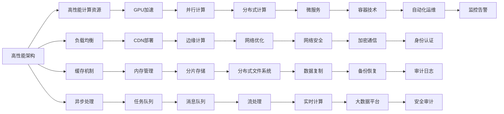
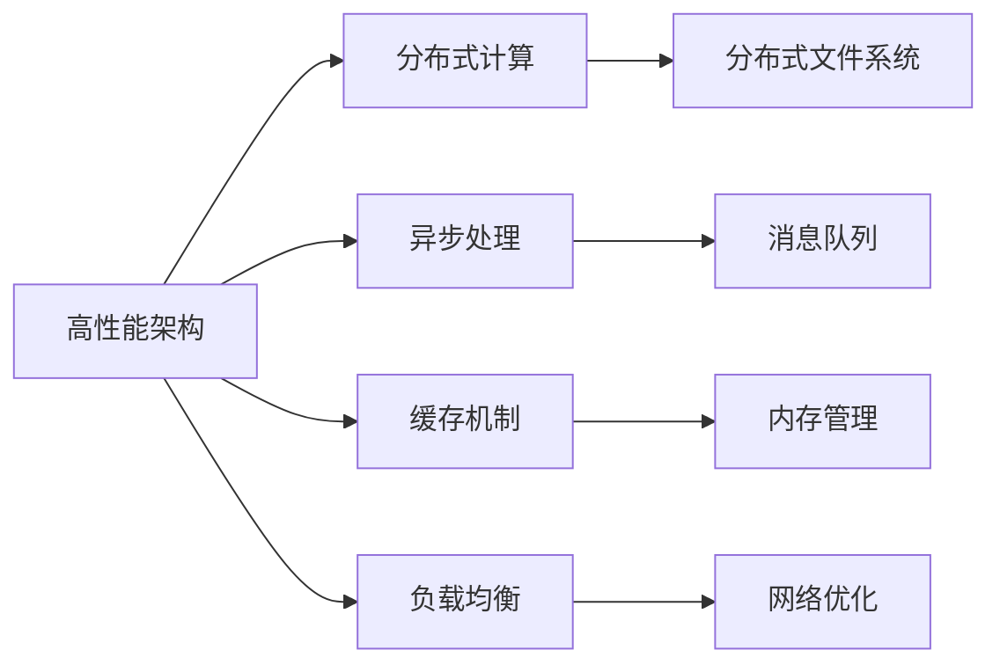
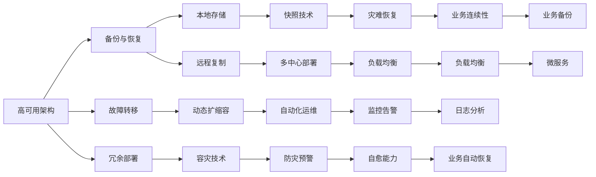
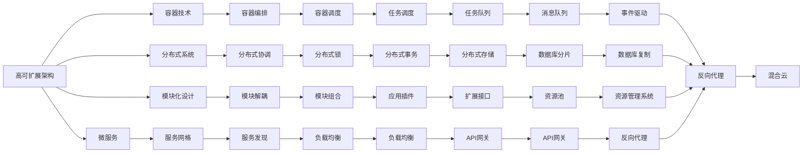

                 

# App电商业务系统核心架构设计

## 1. 背景介绍

### 1.1 问题由来

在当今数字化时代，移动电商成为商家和用户之间最重要的交互方式之一。App电商业务系统不仅要承载复杂的交易流程、精细的推荐算法、丰富的内容呈现，还要提供稳定的用户体验和强大的安全保障。如何设计一个高性能、高可用、高可扩展、高安全的App电商业务系统，是当前各大电商平台共同面临的挑战。

### 1.2 问题核心关键点

- **高性能**：保证用户操作流畅、响应快速。
- **高可用**：确保系统稳定运行，即使故障也能快速恢复。
- **高可扩展**：能适应业务增长，容易进行横向和纵向扩展。
- **高安全**：保护用户数据和交易信息的安全性。
- **高稳定性**：确保系统平稳运行，不出现系统性故障。

### 1.3 问题研究意义

设计一个高性能、高可用、高可扩展、高安全的App电商业务系统，具有重要的实际意义：

1. **用户体验提升**：优化用户体验，提升用户满意度和忠诚度。
2. **业务增长加速**：满足业务快速增长需求，增加商家销售额。
3. **运营成本降低**：通过系统架构优化，降低运维和维护成本。
4. **风险控制加强**：强化系统安全性，保障用户数据和交易安全。
5. **市场竞争力增强**：构建核心竞争力，抢占市场先机。

## 2. 核心概念与联系

### 2.1 核心概念概述

为更好地理解App电商业务系统的核心架构设计，本节将介绍几个密切相关的核心概念：

- **高性能架构**：通过合理的设计和优化，使系统具备快速响应、并发处理的能力。
- **高可用架构**：保证系统具备自我修复能力，即使出现故障也能快速恢复。
- **高可扩展架构**：系统设计上具备灵活性，能方便地进行横向和纵向扩展。
- **高安全架构**：采用多层次的安全措施，保护用户数据和交易信息。
- **高稳定性架构**：通过各种技术手段，保证系统稳定运行。

这些核心概念之间的逻辑关系可以通过以下Mermaid流程图来展示：



这个流程图展示了App电商业务系统的核心概念及其之间的关系：

1. 高性能架构通过多种计算资源和优化手段，保证系统快速响应。
2. 高可用架构通过多层次的故障修复和恢复策略，保证系统持续稳定运行。
3. 高可扩展架构通过模块化和解耦设计，方便进行横向和纵向扩展。
4. 高安全架构通过多种安全技术手段，保护数据和交易安全。
5. 高稳定性架构通过各种技术手段，保证系统稳定运行。

这些概念共同构成了App电商业务系统的完整架构，确保其能够高效、稳定地支持电商业务的各项功能。通过理解这些核心概念，我们可以更好地把握App电商业务系统的设计原则和优化方向。

### 2.2 概念间的关系

这些核心概念之间存在着紧密的联系，形成了App电商业务系统的完整生态系统。下面我通过几个Mermaid流程图来展示这些概念之间的关系。

#### 2.2.1 高性能架构的设计要素



这个流程图展示了高性能架构的设计要素：

1. 通过分布式计算和异步处理提高系统并发处理能力。
2. 使用缓存机制和负载均衡提升数据访问和请求处理的效率。
3. 采用分布式文件系统和网络优化减少数据传输和通信成本。

#### 2.2.2 高可用架构的实现手段



这个流程图展示了高可用架构的实现手段：

1. 通过备份与恢复、故障转移等手段，确保系统在故障后能够快速恢复。
2. 采用冗余部署和容灾技术，构建多地域、多中心的部署架构。
3. 利用自动化运维和监控告警，实现系统动态管理和故障快速定位。

#### 2.2.3 高可扩展架构的技术支撑



这个流程图展示了高可扩展架构的技术支撑：

1. 采用微服务架构和容器技术，实现系统的模块化和自动化部署。
2. 通过分布式系统和分布式锁，保证系统的高并发和数据一致性。
3. 利用服务网格和服务发现，提升系统的弹性和自恢复能力。

#### 2.2.4 高安全架构的策略措施

```mermaid
graph LR
    A[高安全架构] --> B[加密技术]
    A --> C[身份认证]
    A --> D[权限控制]
    A --> E[日志审计]
    B --> F[传输加密]
    B --> G[存储加密]
    C --> H[认证服务]
    C --> I[单点登录]
    D --> J[权限管理]
    D --> K[访问控制]
    E --> L[日志记录]
    E --> M[安全审计]
    F --> N[API安全]
    G --> O[数据加密]
    H --> P[认证中心]
    I --> Q[联邦认证]
    J --> R[授权中心]
    K --> S[访问控制]
    L --> T[安全记录]
    M --> U[合规审计]
    N --> V[API网关]
    O --> W[数据加密]
    P --> X[认证中心]
    Q --> Y[联邦认证]
    R --> Z[授权中心]
    S --> AA[访问控制]
    T --> AB[安全记录]
    U --> AC[合规审计]
    V --> AD[API网关]
    W --> AE[数据加密]
    X --> AF[认证中心]
    Y --> AG[联邦认证]
    Z --> AH[授权中心]
    AA --> AI[访问控制]
    AB --> AI[安全记录]
    AC --> AI[合规审计]
    AD --> AI[API网关]
    AE --> AI[数据加密]
    AF --> AI[认证中心]
    AG --> AI[联邦认证]
    AH --> AI[授权中心]
    AI --> AJ[身份认证]
    AJ --> AK[单点登录]
    AK --> AL[认证服务]
    AL --> AM[安全审计]
    AM --> AN[API安全]
    AN --> AO[数据加密]
    AO --> AP[数据库加密]
    AP --> AQ[加密通信]
    AQ --> AR[密钥管理]
    AR --> AS[身份认证]
    AS --> AT[权限控制]
    AT --> AU[日志记录]
    AU --> AV[安全审计]
    AV --> AW[合规审计]
    AW --> AX[合规报告]
    AX --> AY[合规控制]
    AY --> AZ[风险管理]
    AZ --> BA[业务合规]
    BA --> BB[业务审计]
    BB --> BC[风险预警]
    BC --> BD[风险处置]
    BD --> BE[业务连续性]
    BE --> BF[业务备份]
    BF --> BG[业务恢复]
    BG --> BH[业务监控]
    BH --> BI[业务预警]
    BI --> BJ[业务演练]
    BJ --> BK[业务演练]
    BK --> BL[业务演练]
    BL --> BM[业务演练]
    BM --> BN[业务演练]
    BN --> BO[业务演练]
    BO --> BP[业务演练]
    BP --> BQ[业务演练]
    BQ --> BR[业务演练]
    BR --> BS[业务演练]
    BS --> BT[业务演练]
    BT --> BU[业务演练]
    BU --> BV[业务演练]
    BV --> BW[业务演练]
    BW --> BX[业务演练]
    BX --> BY[业务演练]
    BY --> BZ[业务演练]
    BZ --> CA[业务演练]
    CA --> CB[业务演练]
    CB --> CC[业务演练]
    CC --> CD[业务演练]
    CD --> CE[业务演练]
    CE --> CF[业务演练]
    CF --> CG[业务演练]
    CG --> CH[业务演练]
    CH --> CI[业务演练]
    CI --> CJ[业务演练]
    CJ --> CK[业务演练]
    CK --> CL[业务演练]
    CL --> CM[业务演练]
    CM --> CN[业务演练]
    CN --> CO[业务演练]
    CO --> CP[业务演练]
    CP --> CQ[业务演练]
    CQ --> CR[业务演练]
    CR --> CS[业务演练]
    CS --> CT[业务演练]
    CT --> CU[业务演练]
    CU --> CV[业务演练]
    CV --> CW[业务演练]
    CW --> CX[业务演练]
    CX --> CY[业务演练]
    CY --> CZ[业务演练]
    CZ --> DA[业务演练]
    DA --> DB[业务演练]
    DB --> DC[业务演练]
    DC --> DD[业务演练]
    DD --> DE[业务演练]
    DE --> DF[业务演练]
    DF --> DG[业务演练]
    DG --> DH[业务演练]
    DH --> DI[业务演练]
    DI --> DJ[业务演练]
    DJ --> DK[业务演练]
    DK --> DL[业务演练]
    DL --> DM[业务演练]
    DM --> DN[业务演练]
    DN --> DO[业务演练]
    DO --> DP[业务演练]
    DP --> DQ[业务演练]
    DQ --> DR[业务演练]
    DR --> DS[业务演练]
    DS --> DT[业务演练]
    DT --> DU[业务演练]
    DU --> DV[业务演练]
    DV --> DW[业务演练]
    DW --> DX[业务演练]
    DX --> DY[业务演练]
    DY --> DZ[业务演练]
    DZ --> EA[业务演练]
    EA --> EB[业务演练]
    EB --> EC[业务演练]
    EC --> ED[业务演练]
    ED --> EE[业务演练]
    EE --> EF[业务演练]
    EF --> EG[业务演练]
    EG --> EH[业务演练]
    EH --> EI[业务演练]
    EI --> EJ[业务演练]
    EJ --> EK[业务演练]
    EK --> EL[业务演练]
    EL --> EM[业务演练]
    EM --> EN[业务演练]
    EN --> EO[业务演练]
    EO --> EP[业务演练]
    EP --> EQ[业务演练]
    EQ --> ER[业务演练]
    ER --> ES[业务演练]
    ES --> ET[业务演练]
    ET --> EU[业务演练]
    EU --> EV[业务演练]
    EV --> EW[业务演练]
    EW --> EX[业务演练]
    EX --> EY[业务演练]
    EY --> EZ[业务演练]
    EZ --> FA[业务演练]
    FA --> FB[业务演练]
    FB --> FC[业务演练]
    FC --> FD[业务演练]
    FD --> FE[业务演练]
    FE --> FF[业务演练]
    FF --> FG[业务演练]
    FG --> FH[业务演练]
    FH --> FI[业务演练]
    FI --> FJ[业务演练]
    FJ --> FK[业务演练]
    FK --> FL[业务演练]
    FL --> FM[业务演练]
    FM --> FN[业务演练]
    FN --> FO[业务演练]
    FO --> FP[业务演练]
    FP --> FQ[业务演练]
    FQ --> FR[业务演练]
    FR --> FS[业务演练]
    FS --> FT[业务演练]
    FT --> FU[业务演练]
    FU --> FV[业务演练]
    FV --> FW[业务演练]
    FW --> FX[业务演练]
    FX --> FY[业务演练]
    FY --> FZ[业务演练]
    FZ --> GA[业务演练]
    GA --> GB[业务演练]
    GB --> GC[业务演练]
    GC --> GD[业务演练]
    GD --> GE[业务演练]
    GE --> GF[业务演练]
    GF --> GG[业务演练]
    GG --> GH[业务演练]
    GH --> GI[业务演练]
    GI --> GJ[业务演练]
    GJ --> GK[业务演练]
    GK --> GL[业务演练]
    GL --> GM[业务演练]
    GM --> GN[业务演练]
    GN --> GO[业务演练]
    GO --> GP[业务演练]
    GP --> GQ[业务演练]
    GQ --> GR[业务演练]
    GR --> GS[业务演练]
    GS --> GT[业务演练]
    GT --> GU[业务演练]
    GU -->GV[业务演练]
    GV --> GW[业务演练]
    GW --> GX[业务演练]
    GX --> GY[业务演练]
    GY --> GZ[业务演练]
    GZ --> HA[业务演练]
    HA --> HB[业务演练]
    HB --> HC[业务演练]
    HC --> HD[业务演练]
    HD --> HE[业务演练]
    HE --> HF[业务演练]
    HF --> HG[业务演练]
    HG --> HH[业务演练]
    HH --> HI[业务演练]
    HI --> HJ[业务演练]
    HJ --> HK[业务演练]
    HK --> HL[业务演练]
    HL --> HM[业务演练]
    HM --> HN[业务演练]
    HN --> HO[业务演练]
    HO --> HP[业务演练]
    HP --> HQ[业务演练]
    HQ --> HR[业务演练]
    HR --> HS[业务演练]
    HS --> HT[业务演练]
    HT --> HU[业务演练]
    HU --> HV[业务演练]
    HV --> HW[业务演练]
    HW --> HX[业务演练]
    HX --> HY[业务演练]
    HY --> HZ[业务演练]
    HZ --> IA[业务演练]
    IA --> IB[业务演练]
    IB --> IC[业务演练]
    IC --> ID[业务演练]
    ID --> IE[业务演练]
    IE --> IF[业务演练]
    IF --> IG[业务演练]
    IG --> IH[业务演练]
    IH --> II[业务演练]
    II --> IJ[业务演练]
    IJ --> IK[业务演练]
    IK --> IL[业务演练]
    IL --> IM[业务演练]
    IM --> IN[业务演练]
    IN --> IO[业务演练]
    IO --> IP[业务演练]
    IP --> IQ[业务演练]
    IQ --> IR[业务演练]
    IR --> IS[业务演练]
    IS --> IT[业务演练]
    IT --> IU[业务演练]
    IU --> IV[业务演练]
    IV --> IW[业务演练]
    IW --> IX[业务演练]
    IX --> IY[业务演练]
    IY --> IZ[业务演练]
    IZ -->JA[业务演练]
    JA -->JB[业务演练]
    JB -->JC[业务演练]
    JC -->JD[业务演练]
    JD -->JE[业务演练]
    JE --> JF[业务演练]
    JF --> JG[业务演练]
    JG --> JH[业务演练]
    JH -->JI[业务演练]
    JI --> JJ[业务演练]
    JJ -->JK[业务演练]
    JK --> JL[业务演练]
    JL --> JM[业务演练]
    JM --> JN[业务演练]
    JN --> JO[业务演练]
    JO --> JP[业务演练]
    JP --> JQ[业务演练]
    JQ --> JR[业务演练]
    JR --> JS[业务演练]
    JS --> JT[业务演练]
    JT --> JU[业务演练]
    JU --> JV[业务演练]
    JV --> JW[业务演练]
    JW --> JX[业务演练]
    JX --> JY[业务演练]
    JY --> JZ[业务演练]
    JZ -->KA[业务演练]
    KA -->KB[业务演练]
    KB -->KC[业务演练]
    KC -->KD[业务演练]
    KD -->KE[业务演练]
    KE -->KF[业务演练]
    KF -->KG[业务演练]
    KG -->KH[业务演练]
    KH -->KI[业务演练]
    KI -->KJ[业务演练]
    KJ -->KK[业务演练]
    KK -->KL[业务演练]
    KL -->KM[业务演练]
    KM -->KN[业务演练]
    KN -->KO[业务演练]
    KO -->KP[业务演练]
    KP -->KQ[业务演练]
    KQ -->KR[业务演练]
    KR -->KS[业务演练]
    KS -->KT[业务演练]
    KT -->KU[业务演练]
    KU -->KV[业务演练]
    KV -->KW[业务演练]
    KW -->KX[业务演练]
    KX -->KY[业务演练]
    KY -->KZ[业务演练]
    KZ -->LA[业务演练]
    LA -->LB[业务演练]
    LB -->LC[业务演练]
    LC -->LD[业务演练]
    LD -->LE[业务演练]
    LE -->LF[业务演练]
    LF -->LG[业务演练]
    LG -->LH[业务演练]
    LH -->LI[业务演练]
    LI -->LJ[业务演练]
    LJ -->LK[业务演练]
    LK -->LL[业务演练]
    LL -->LM[业务演练]
    LM -->LN[业务演练]
    LN -->LO[业务演练]
    LO -->LP[业务演练]
    LP -->LQ[业务演练]
    LQ -->LR[业务演练]
    LR -->LS[业务演练]
    LS -->LT[业务演练]
    LT -->LU[业务演练]
    LU -->LV[业务演练]
    LV -->LW[业务演练]
    LW -->LX[业务演练]
    LX -->LY[业务演练]
    LY -->LZ[业务演练]
    LZ -->MA[业务演练]
    MA -->MB[业务演练]
    MB -->MC[业务演练]
    MC -->MD[业务演练]
    MD -->ME[业务演练]
    ME -->MF[业务演练]
    MF -->MG[业务演练]
    MG -->MH[业务演练]
    MH -->MI[业务演练]
    MI -->MJ[业务演练]
    MJ -->MK[业务演练]
    MK -->ML[业务演练]
    ML -->MM[业务演练]
    MM -->MN[业务演练]
    MN -->MO[业务演练]
    MO -->MP[业务演练]
    MP -->MQ[业务演练]
    MQ -->MR[业务演练]
    MR -->MS[业务演练]
    MS -->MT[业务演练]
    MT -->MU[业务演练]
    MU -->MV[业务演练]
    MV -->MW[业务演练]
    MW -->MX[业务演练]
    MX -->MY[业务演练]
    MY -->MZ[业务演练]
    MZ -->NA[业务演练]
    NA -->NB[业务演练]
    NB -->NC[业务演练]
    NC -->ND[业务演练]
    ND -->NE[业务演练]
    NE -->NF[业务演练]
    NF -->NG[业务演练]
    NG -->NH[业务演练]
    NH -->NI[业务演练]
    NI -->NJ[业务演练]
    NJ -->NK[业务演练]
    NK -->NL[业务演练]
    NL -->NM[业务演练]
    NM -->NN[业务演练]
    NN -->NO[业务演练]
    NO -->NP[业务演练]
    NP -->NQ[业务演练]
    NQ -->NR[业务演练]
    NR -->NS[业务演练]
    NS -->NT[业务演练]
    NT -->NU[业务演练]
    NU -->NV[业务演练]
    NV -->NW[业务演练]
    NW -->NX[业务演练]
    NX -->NY[业务演练]
    NY -->NZ[业务演练]
    NZ -->OA[业务演练]
    OA -->OB[业务演练]
    OB -->OC[业务演练]
    OC -->OD[业务演练]
    OD -->OE[业务演练]
    OE -->OF[业务演练]
    OF -->OG[业务演练]
    OG -->OH[业务演练]
    OH -->OI[业务演练]
    OI -->OJ[业务演练]
    OJ -->OK[业务演练]
    OK -->OL[业务演练]
    OL -->OM[业务演练]
    OM -->ON[业务演练]
    ON -->OO[业务演练]
    OO -->OP[业务演练]
    OP -->OQ[业务演练]
    OQ -->OR[业务演练]
    OR -->OS[业务演练]
    OS -->OT[业务演练]
    OT -->OU[业务演练]
    OU -->OV[业务演练]
    OV -->OW[业务演练]
    OW -->OX[业务演练]
    OX -->OY[业务演练]
    OY -->OZ[业务演练]
    OZ -->PA[业务演练]
    PA -->PB[业务演练]
    PB -->PC[业务演练]
    PC -->PD[业务演练]
    PD -->PE[业务演练]
    PE -->PF[业务演练]
    PF -->PG[业务演练]
    PG -->PH[业务演练]
    PH -->PI[业务演练]
    PI -->PJ[业务演练]
    PJ -->PK[业务演练]
    PK -->PL[业务演练]
    PL -->PM[业务演练]
    PM -->PN[业务演练]
    PN -->PO[业务演练]
    PO -->PP[业务演练]
    PP -->PQ[业务演练]
    PQ -->PR[业务演练]
    PR -->PS[业务演练]
    PS -->PT[业务演练]
    PT -->PU[业务演练]
    PU -->PV[业务演练]
    PV -->PW[业务演练]
    PW -->PX[业务演练]
    PX -->PY[业务演练]
    PY -->PZ[业务演练]
    PZ -->QA[业务演练]
    QA -->QB[业务演练]
    QB -->QC[业务演练]
    QC -->QD[业务演练]
    QD -->QE[业务演练]
    QE -->QF[业务演练]
    QF -->QG[业务演练]
    QG -->QH[业务演练]
    QH -->QI[业务演练]
    QI -->QJ[业务演练]
    QJ -->QK[业务演练]
    QK -->QL[业务演练]
    QL -->QM[业务演练]
    QM -->QN[业务演练]
    QN -->QO[业务演练]
    QO -->QP[业务演练]
    QP -->QQ[业务演练]
    QQ -->QR[业务演练]
    QR -->QS[业务演练]
    QS -->QT[业务演练]
    QT -->QU[业务演练]
    QU -->QV[业务演练]
    QV -->QW[业务演练]
    QW -->QX[业务演练]
    QX -->QY[业务演练]
    QY -->QZ[业务演练]
    QZ -->RA[业务演练]
    

