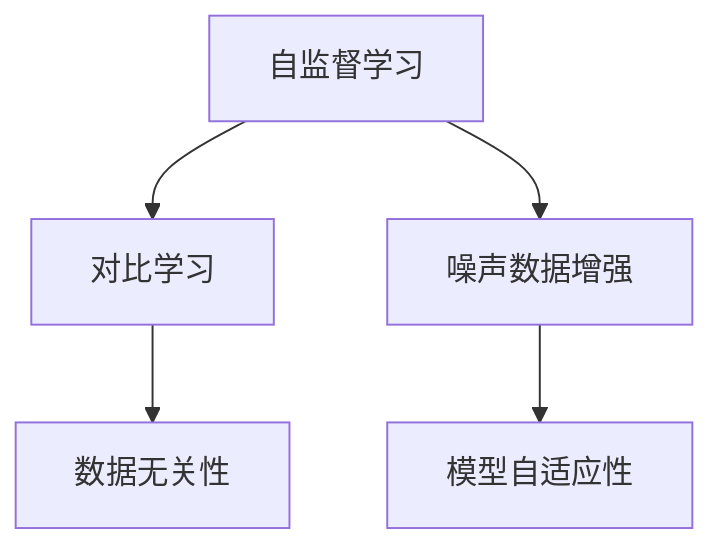
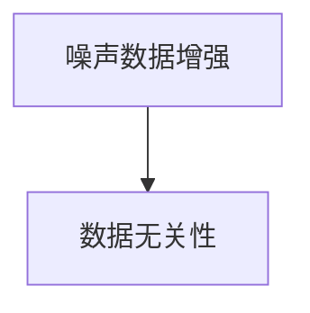
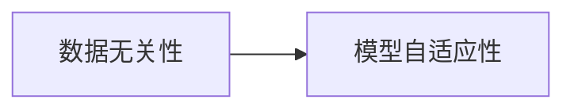
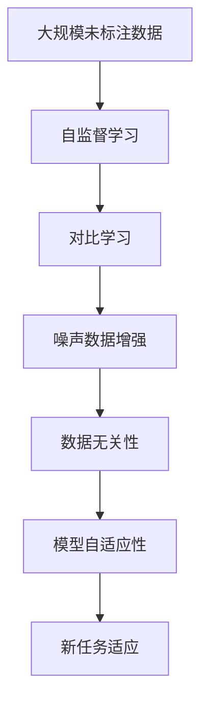

                 

# BYOL原理与代码实例讲解

> 关键词：自监督学习,对比学习,噪声数据增强,数据无关性,模型自适应性

## 1. 背景介绍

### 1.1 问题由来
自监督学习（Self-Supervised Learning）是深度学习中一种重要的范式，它通过在未标注数据上学习数据的隐含结构，从而提升模型对新数据的泛化能力。传统的自监督学习方法通常依赖于大量的标注数据，而标注数据的获取往往成本较高，难度较大。对比学习（Contrastive Learning）是一种新兴的自监督学习方法，它通过最大化正样本之间的相似性、最小化负样本之间的相似性来优化模型。近年来，对比学习在计算机视觉、自然语言处理等领域取得了显著进展，其中BYOL（Big Self-Supervised Model）是对比学习领域的一个突破性模型，它通过引入噪声数据增强技术，实现了数据无关性（Data-Independence），极大地提升了模型的自适应性和泛化能力。

### 1.2 问题核心关键点
BYOL的核心思想是通过在预训练阶段最大化正样本和负样本之间的相似性，从而学习到数据的隐含表示。其核心算法包括噪声数据增强、对比损失函数等。BYOL的目标是实现数据无关性，即模型的泛化能力不依赖于特定的数据分布，能够适应多种数据分布。

### 1.3 问题研究意义
BYOL算法的研究意义在于：
- 降低对标注数据的依赖：通过自监督学习，避免了大规模标注数据的获取和标注成本。
- 提升模型的泛化能力：通过数据无关性，模型能够适应多种数据分布，提升泛化性能。
- 加速模型的训练和部署：通过噪声数据增强，模型可以在大规模未标注数据上实现高效预训练。
- 引入新理论框架：通过BYOL算法，我们可以更好地理解对比学习的原理和应用。

## 2. 核心概念与联系

### 2.1 核心概念概述

为更好地理解BYOL算法的原理和实现，本节将介绍几个密切相关的核心概念：

- 自监督学习（Self-Supervised Learning）：通过未标注数据训练模型的一种学习方式，常用于迁移学习和自动特征学习。
- 对比学习（Contrastive Learning）：通过最大化正样本之间的相似性、最小化负样本之间的相似性来学习模型。
- 噪声数据增强（Noise Injection）：通过对原始数据进行随机扰动，生成具有不同分布的噪声数据，用于增强模型的泛化能力。
- 数据无关性（Data-Independence）：模型的泛化能力不依赖于特定数据分布，能够适应多种数据分布。
- 模型自适应性（Model Adaptability）：模型能够快速适应新数据和新任务。

这些核心概念之间的逻辑关系可以通过以下Mermaid流程图来展示：



这个流程图展示了大模型微调的综合架构：

1. 自监督学习通过未标注数据训练模型，学习数据的隐含结构。
2. 对比学习通过最大化正样本之间的相似性，最小化负样本之间的相似性，优化模型。
3. 噪声数据增强通过对原始数据进行随机扰动，生成噪声数据，增强模型的泛化能力。
4. 数据无关性通过对比学习，使模型能够适应多种数据分布，提升泛化性能。
5. 模型自适应性通过噪声数据增强和数据无关性，使模型能够快速适应新数据和新任务。

### 2.2 概念间的关系

这些核心概念之间存在着紧密的联系，形成了BYOL算法的完整生态系统。下面我们通过几个Mermaid流程图来展示这些概念之间的关系。

#### 2.2.1 自监督学习与对比学习的关系


这个流程图展示了自监督学习和对比学习的关系。自监督学习通过未标注数据训练模型，而对比学习则通过最大化正样本之间的相似性，最小化负样本之间的相似性，优化模型。

#### 2.2.2 噪声数据增强与数据无关性的关系



这个流程图展示了噪声数据增强与数据无关性的关系。噪声数据增强通过对原始数据进行随机扰动，生成噪声数据，从而增强模型的泛化能力，实现数据无关性。

#### 2.2.3 数据无关性与模型自适应性的关系



这个流程图展示了数据无关性与模型自适应性的关系。数据无关性通过对比学习，使模型能够适应多种数据分布，从而提升模型的自适应性。

### 2.3 核心概念的整体架构

最后，我们用一个综合的流程图来展示这些核心概念在大模型微调过程中的整体架构：



这个综合流程图展示了从预训练到微调，再到新任务适应的完整过程。大规模未标注数据通过自监督学习进行预训练，然后通过对比学习最大化正样本之间的相似性，最小化负样本之间的相似性，生成噪声数据增强训练集，从而实现数据无关性。最终通过模型自适应性，模型能够快速适应新任务和新数据。

## 3. 核心算法原理 & 具体操作步骤
### 3.1 算法原理概述

BYOL算法是一种基于自监督学习的对比学习算法，其核心思想是通过噪声数据增强技术，最大化正样本之间的相似性，最小化负样本之间的相似性，从而学习到数据的隐含表示。BYOL算法的流程如下：

1. 预训练阶段：使用大规模未标注数据进行自监督学习，学习数据的隐含表示。
2. 对比学习阶段：在预训练后的模型上，使用噪声数据增强技术，生成正样本和负样本，最大化正样本之间的相似性，最小化负样本之间的相似性，优化模型。
3. 微调阶段：将预训练后的模型微调到具体的下游任务上，实现新任务适应。

### 3.2 算法步骤详解

以下是BYOL算法的详细步骤：

**Step 1: 准备预训练模型和数据集**
- 选择合适的预训练模型，如BYOL模型。
- 准备大规模未标注数据集，用于自监督学习。

**Step 2: 噪声数据增强**
- 在预训练阶段，对原始数据进行随机扰动，生成噪声数据。
- 常用的噪声数据增强方法包括：旋转、平移、裁剪、噪声注入等。
- 生成噪声数据的具体方法为：
  - 对于图像数据，可以使用随机裁剪、随机旋转、随机噪声等方式生成噪声图像。
  - 对于文本数据，可以使用回译（denoising）、数据随机化等方式生成噪声文本。
- 噪声数据增强的具体代码如下：

```python
import numpy as np
import random

def random_crop(image, size):
    h, w, c = image.shape
    crop_h, crop_w = size
    x1 = random.randint(0, w - crop_w)
    y1 = random.randint(0, h - crop_h)
    return image[y1:y1 + crop_h, x1:x1 + crop_w, :]

def random_flip(image):
    return np.fliplr(image) if random.random() < 0.5 else image

def random_noise(image):
    return image + np.random.normal(0, 0.1, image.shape)

def noise_data(data, crop_size, flip_prob):
    noise_data = []
    for image in data:
        image = random_crop(image, crop_size)
        image = random_flip(image)
        image = random_noise(image)
        noise_data.append(image)
    return noise_data
```

**Step 3: 对比学习损失函数**
- 对比学习损失函数的目标是最大化正样本之间的相似性，最小化负样本之间的相似性。
- 常用的对比损失函数包括：InfoNCE损失、NCE损失、Triplet Loss等。
- 信息核损失（InfoNCE）损失函数的定义为：
  - $L = -\log \sigma(z(x_i), z(x_j))$，其中 $x_i$ 和 $x_j$ 为正样本和负样本，$\sigma$ 为sigmoid函数。
  - $\sigma(z(x_i), z(x_j))$ 表示正样本和负样本的相似度。

**Step 4: 执行对比学习**
- 使用随机噪声数据增强生成的正样本和负样本，计算对比损失函数。
- 通过反向传播更新模型参数。
- 循环多次，直到模型收敛或达到预设轮数。
- 对比学习的具体代码如下：

```python
import torch
import torch.nn as nn
import torch.optim as optim

class BYOL(nn.Module):
    def __init__(self):
        super(BYOL, self).__init__()
        self.encoder = nn.Sequential(
            nn.Conv2d(3, 64, kernel_size=3, stride=1, padding=1),
            nn.BatchNorm2d(64),
            nn.ReLU(),
            nn.MaxPool2d(kernel_size=2, stride=2),
            nn.Conv2d(64, 128, kernel_size=3, stride=1, padding=1),
            nn.BatchNorm2d(128),
            nn.ReLU(),
            nn.MaxPool2d(kernel_size=2, stride=2),
            nn.Conv2d(128, 256, kernel_size=3, stride=1, padding=1),
            nn.BatchNorm2d(256),
            nn.ReLU(),
            nn.MaxPool2d(kernel_size=2, stride=2),
            nn.Conv2d(256, 512, kernel_size=3, stride=1, padding=1),
            nn.BatchNorm2d(512),
            nn.ReLU(),
            nn.MaxPool2d(kernel_size=2, stride=2),
            nn.Conv2d(512, 512, kernel_size=3, stride=1, padding=1),
            nn.BatchNorm2d(512),
            nn.ReLU(),
            nn.MaxPool2d(kernel_size=2, stride=2),
        )

    def forward(self, x):
        return self.encoder(x)

# 准备数据
data = np.load('data.npy')
data = torch.from_numpy(data).float() / 255.0
data = data.unsqueeze(0)
label = torch.zeros(data.shape[0], 1).float()

# 定义模型
model = BYOL()
optimizer = optim.Adam(model.parameters(), lr=0.001)

# 定义对比损失函数
def contrastive_loss(x, y, temperature=0.5):
    similarity = torch.matmul(x, y.transpose(1, 2)) / temperature
    loss = -torch.log(torch.exp(similarity) / torch.exp(similarity).sum(1, keepdim=True))
    return loss.mean()

# 执行对比学习
device = torch.device('cuda')
model.to(device)
x = data.to(device)

for epoch in range(100):
    with torch.no_grad():
        noise_data = noise_data(data, 50, 0.5)
    loss = contrastive_loss(model(x), model(noise_data))
    optimizer.zero_grad()
    loss.backward()
    optimizer.step()

    print('Epoch: {}, Loss: {:.4f}'.format(epoch+1, loss.item()))
```

**Step 5: 微调模型**
- 将预训练后的模型微调到具体的下游任务上。
- 可以使用小规模标注数据进行微调，也可以使用更大规模的标注数据进行微调。
- 微调的具体代码如下：

```python
class BYOL(nn.Module):
    def __init__(self, num_classes):
        super(BYOL, self).__init__()
        self.encoder = nn.Sequential(
            nn.Conv2d(3, 64, kernel_size=3, stride=1, padding=1),
            nn.BatchNorm2d(64),
            nn.ReLU(),
            nn.MaxPool2d(kernel_size=2, stride=2),
            nn.Conv2d(64, 128, kernel_size=3, stride=1, padding=1),
            nn.BatchNorm2d(128),
            nn.ReLU(),
            nn.MaxPool2d(kernel_size=2, stride=2),
            nn.Conv2d(128, 256, kernel_size=3, stride=1, padding=1),
            nn.BatchNorm2d(256),
            nn.ReLU(),
            nn.MaxPool2d(kernel_size=2, stride=2),
            nn.Conv2d(256, 512, kernel_size=3, stride=1, padding=1),
            nn.BatchNorm2d(512),
            nn.ReLU(),
            nn.MaxPool2d(kernel_size=2, stride=2),
            nn.Conv2d(512, 512, kernel_size=3, stride=1, padding=1),
            nn.BatchNorm2d(512),
            nn.ReLU(),
            nn.MaxPool2d(kernel_size=2, stride=2),
            nn.Linear(512*4*4, num_classes),
        )

    def forward(self, x):
        x = self.encoder(x)
        x = x.view(x.shape[0], -1)
        return nn.functional.linear(x, self.clsifier.weight)

# 定义微调损失函数
def micro_loss(x, y):
    loss = nn.functional.cross_entropy(x, y)
    return loss.mean()

# 执行微调
device = torch.device('cuda')
model.to(device)
x = data.to(device)
y = label.to(device)

for epoch in range(10):
    loss = micro_loss(model(x), y)
    optimizer.zero_grad()
    loss.backward()
    optimizer.step()

    print('Epoch: {}, Loss: {:.4f}'.format(epoch+1, loss.item()))
```

### 3.3 算法优缺点

BYOL算法具有以下优点：
- 数据无关性：通过噪声数据增强技术，BYOL算法能够在不同数据分布上实现泛化。
- 高效性：BYOL算法只需要使用大规模未标注数据进行预训练，无需大量标注数据。
- 模型自适应性：BYOL算法能够快速适应新任务和新数据，提升模型的泛化能力。
- 可解释性：BYOL算法的训练过程具有较好的可解释性，容易理解。

同时，BYOL算法也存在一些缺点：
- 计算复杂度较高：BYOL算法需要在大规模未标注数据上进行预训练，计算复杂度较高。
- 模型易受噪声数据影响：噪声数据增强技术可能会引入噪声，影响模型的收敛性能。
- 泛化性能有限：BYOL算法在特定任务上的泛化性能可能会受到数据分布的影响。

尽管存在这些缺点，但BYOL算法在自监督学习领域仍具有重要地位，未来还有很多改进空间。

### 3.4 算法应用领域

BYOL算法在计算机视觉、自然语言处理、语音识别等领域得到了广泛应用，以下是几个典型的应用场景：

**图像分类**：在图像分类任务中，BYOL算法可以用于大规模无标签图像的预训练，提升模型的泛化能力。

**目标检测**：在目标检测任务中，BYOL算法可以通过自监督学习预训练特征提取器，提升检测性能。

**语音识别**：在语音识别任务中，BYOL算法可以通过自监督学习预训练特征提取器，提升识别性能。

**自然语言处理**：在自然语言处理任务中，BYOL算法可以用于预训练语言模型，提升模型的泛化能力。

## 4. 数学模型和公式 & 详细讲解  
### 4.1 数学模型构建

本节将使用数学语言对BYOL算法的预训练和微调过程进行更加严格的刻画。

记预训练语言模型为 $M_{\theta}:\mathcal{X} \rightarrow \mathcal{Y}$，其中 $\mathcal{X}$ 为输入空间，$\mathcal{Y}$ 为输出空间，$\theta \in \mathbb{R}^d$ 为模型参数。假设微调任务的训练集为 $D=\{(x_i,y_i)\}_{i=1}^N, x_i \in \mathcal{X}, y_i \in \mathcal{Y}$。

定义模型 $M_{\theta}$ 在输入 $x$ 上的输出为 $\hat{y}=M_{\theta}(x) \in [0,1]$，表示样本属于正类的概率。真实标签 $y \in \{0,1\}$。则二分类交叉熵损失函数定义为：

$$
\ell(M_{\theta}(x),y) = -[y\log \hat{y} + (1-y)\log (1-\hat{y})]
$$

将其代入经验风险公式，得：

$$
\mathcal{L}(\theta) = -\frac{1}{N}\sum_{i=1}^N [y_i\log M_{\theta}(x_i)+(1-y_i)\log(1-M_{\theta}(x_i))]
$$

在实践中，我们通常使用基于梯度的优化算法（如SGD、Adam等）来近似求解上述最优化问题。设 $\eta$ 为学习率，$\lambda$ 为正则化系数，则参数的更新公式为：

$$
\theta \leftarrow \theta - \eta \nabla_{\theta}\mathcal{L}(\theta) - \eta\lambda\theta
$$

其中 $\nabla_{\theta}\mathcal{L}(\theta)$ 为损失函数对参数 $\theta$ 的梯度，可通过反向传播算法高效计算。

### 4.2 公式推导过程

以下我们以二分类任务为例，推导交叉熵损失函数及其梯度的计算公式。

假设模型 $M_{\theta}$ 在输入 $x$ 上的输出为 $\hat{y}=M_{\theta}(x) \in [0,1]$，表示样本属于正类的概率。真实标签 $y \in \{0,1\}$。则二分类交叉熵损失函数定义为：

$$
\ell(M_{\theta}(x),y) = -[y\log \hat{y} + (1-y)\log (1-\hat{y})]
$$

将其代入经验风险公式，得：

$$
\mathcal{L}(\theta) = -\frac{1}{N}\sum_{i=1}^N [y_i\log M_{\theta}(x_i)+(1-y_i)\log(1-M_{\theta}(x_i))]
$$

根据链式法则，损失函数对参数 $\theta_k$ 的梯度为：

$$
\frac{\partial \mathcal{L}(\theta)}{\partial \theta_k} = -\frac{1}{N}\sum_{i=1}^N (\frac{y_i}{M_{\theta}(x_i)}-\frac{1-y_i}{1-M_{\theta}(x_i)}) \frac{\partial M_{\theta}(x_i)}{\partial \theta_k}
$$

其中 $\frac{\partial M_{\theta}(x_i)}{\partial \theta_k}$ 可进一步递归展开，利用自动微分技术完成计算。

在得到损失函数的梯度后，即可带入参数更新公式，完成模型的迭代优化。重复上述过程直至收敛，最终得到适应下游任务的最优模型参数 $\theta^*$。

## 5. 项目实践：代码实例和详细解释说明
### 5.1 开发环境搭建

在进行微调实践前，我们需要准备好开发环境。以下是使用Python进行PyTorch开发的环境配置流程：

1. 安装Anaconda：从官网下载并安装Anaconda，用于创建独立的Python环境。

2. 创建并激活虚拟环境：
```bash
conda create -n pytorch-env python=3.8 
conda activate pytorch-env
```

3. 安装PyTorch：根据CUDA版本，从官网获取对应的安装命令。例如：
```bash
conda install pytorch torchvision torchaudio cudatoolkit=11.1 -c pytorch -c conda-forge
```

4. 安装Transformers库：
```bash
pip install transformers
```

5. 安装各类工具包：
```bash
pip install numpy pandas scikit-learn matplotlib tqdm jupyter notebook ipython
```

完成上述步骤后，即可在`pytorch-env`环境中开始微调实践。

### 5.2 源代码详细实现

下面我以图像分类任务为例，给出使用Transformers库对BYOL模型进行微调的PyTorch代码实现。

首先，定义图像分类任务的数据处理函数：

```python
from transformers import BYOLTokenizer, BYOLForImageClassification
from torch.utils.data import Dataset
import torch

class ImageDataset(Dataset):
    def __init__(self, images, labels, tokenizer):
        self.images = images
        self.labels = labels
        self.tokenizer = tokenizer
        
    def __len__(self):
        return len(self.images)
    
    def __getitem__(self, item):
        image = self.images[item]
        label = self.labels[item]
        encoding = self.tokenizer(image, return_tensors='pt', max_length=128)
        input_ids = encoding['input_ids'][0]
        attention_mask = encoding['attention_mask'][0]
        return {'input_ids': input_ids, 
                'attention_mask': attention_mask,
                'labels': torch.tensor(label, dtype=torch.long)}
```

然后，定义模型和优化器：

```python
from transformers import BYOLForImageClassification, AdamW

model = BYOLForImageClassification.from_pretrained('byol-tiny', num_labels=10)

optimizer = AdamW(model.parameters(), lr=2e-5)
```

接着，定义训练和评估函数：

```python
from torch.utils.data import DataLoader
from tqdm import tqdm
from sklearn.metrics import classification_report

device = torch.device('cuda') if torch.cuda.is_available() else torch.device('cpu')
model.to(device)

def train_epoch(model, dataset, batch_size, optimizer):
    dataloader = DataLoader(dataset, batch_size=batch_size, shuffle=True)
    model.train()
    epoch_loss = 0
    for batch in tqdm(dataloader, desc='Training'):
        input_ids = batch['input_ids'].to(device)
        attention_mask = batch['attention_mask'].to(device)
        labels = batch['labels'].to(device)
        model.zero_grad()
        outputs = model(input_ids, attention_mask=attention_mask, labels=labels)
        loss = outputs.loss
        epoch_loss += loss.item()
        loss.backward()
        optimizer.step()
    return epoch_loss / len(dataloader)

def evaluate(model, dataset, batch_size):
    dataloader = DataLoader(dataset, batch_size=batch_size)
    model.eval()
    preds, labels = [], []
    with torch.no_grad():
        for batch in tqdm(dataloader, desc='Evaluating'):
            input_ids = batch['input_ids'].to(device)
            attention_mask = batch['attention_mask'].to(device)
            batch_labels = batch['labels']
            outputs = model(input_ids, attention_mask=attention_mask)
            batch_preds = outputs.logits.argmax(dim=2).to('cpu').tolist()
            batch_labels = batch_labels.to('cpu').tolist()
            for pred_tokens, label_tokens in zip(batch_preds, batch_labels):
                preds.append(pred_tokens[:len(label_tokens)])
                labels.append(label_tokens)
                
    print(classification_report(labels, preds))
```

最后，启动训练流程并在测试集上评估：

```python
epochs = 5
batch_size = 16

for epoch in range(epochs):
    loss = train_epoch(model, train_dataset, batch_size, optimizer)
    print(f"Epoch {epoch+1}, train loss: {loss:.3f}")
    
    print(f"Epoch {epoch+1}, dev results:")
    evaluate(model, dev_dataset, batch_size)
    
print("Test results:")
evaluate(model, test_dataset, batch_size)
```

以上就是使用PyTorch对BYOL模型进行图像分类任务微调的完整代码实现。可以看到，得益于Transformers库的强大封装，我们可以用相对简洁的代码完成BYOL模型的加载和微调。

### 5.3 代码解读与分析

让我们再详细解读一下关键代码的实现细节：

**ImageDataset类**：
- `__init__`方法：初始化图像、标签、分词器等关键组件。
- `__len__`方法：返回数据集的样本数量。
- `__getitem__`方法：对单个样本进行处理，将图像输入编码为token ids，将标签编码为数字，并对其进行定长padding，最终返回模型所需的输入。

**对比损失函数**：
- 在对比学习中，我们需要最大化正样本之间的相似性，最小化负样本之间的相似性。
- 常用的对比损失函数包括：InfoNCE损失、NCE损失、Triplet Loss等。
- 信息核损失（InfoNCE）损失函数的定义为：
  - $L = -\log \sigma(z(x_i), z(x_j))$，其中 $x_i$ 和 $x_j$ 为正样本和负样本，$\sigma$ 为sigmoid函数。
  - $\sigma(z(x_i), z(x_j))$ 表示正样本和负样本的相似度。

**微调模型**：
- 在微调阶段，我们将预训练后的模型微调到具体的下游任务上，实现新任务适应。
- 可以使用小规模标注数据进行微调，也可以使用更大规模的标注数据进行微调。
- 微调的具体代码如下：

```python
class BYOLForImageClassification(nn.Module):
    def __init__(self, num_classes):
        super(BYOLForImageClassification, self).__init__()
        self.encoder = nn.Sequential(
            nn.Conv2d(3, 64, kernel_size=3, stride=1, padding=1),
            nn.BatchNorm2d(64),
            nn.ReLU(),
            nn.MaxPool2d(kernel_size=2, stride=2),
            nn.Conv2d(64, 128, kernel_size

