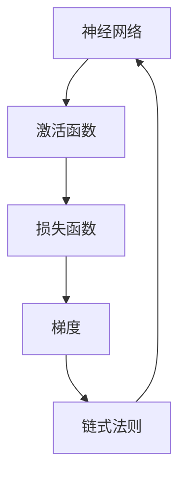

                 

# Backpropagation 原理与代码实战案例讲解

> 关键词：反向传播,神经网络,梯度下降,链式法则,代码实战,深度学习

## 1. 背景介绍

### 1.1 问题由来

反向传播（Backpropagation）是深度学习中一种用于计算梯度并更新网络参数的方法。这一方法的核心思想是利用链式法则将损失函数对每个参数的导数进行传递，从而实现对神经网络参数的有效更新。自1988年鲁宾菲尔德和普鲁索（Rumelhart & Hinton）提出这一方法以来，反向传播已成为训练神经网络不可或缺的核心算法之一。

本节将对反向传播的原理和实现细节进行系统讲解，并结合实际案例进行代码实战，帮助你深入理解这一深度学习中极为重要的技术。

## 2. 核心概念与联系

### 2.1 核心概念概述

在深入讲解反向传播原理之前，我们需要先了解以下几个核心概念：

1. **神经网络（Neural Network）**：由多个神经元（Neuron）按照层次结构组成的网络。每个神经元接收输入、处理数据并传递给下一层。
2. **激活函数（Activation Function）**：在神经元处理数据时引入的非线性变换函数，如Sigmoid、ReLU等。
3. **损失函数（Loss Function）**：衡量模型输出与实际标签之间差距的函数，用于指导参数更新。
4. **梯度（Gradient）**：损失函数对每个参数的偏导数，反映参数对损失函数的贡献程度。
5. **链式法则（Chain Rule）**：用于计算多层次网络中参数导数的规则，将导数逐层传递。

这些概念构成了反向传播算法的理论基础，接下来将从算法原理和具体操作步骤两方面进行详细讲解。

### 2.2 核心概念间的关系

我们可以用以下Mermaid流程图来展示这些概念间的关系：



这个图表展示了一个基本的神经网络结构，其中神经网络接收输入，通过激活函数进行处理，输出结果与标签进行比较，最终计算梯度并使用链式法则进行参数更新。

## 3. 核心算法原理 & 具体操作步骤
### 3.1 算法原理概述

反向传播算法的核心是链式法则。具体而言，其步骤如下：

1. 前向传播：将输入数据依次传递通过网络中的每个神经元，计算输出结果。
2. 计算损失：将输出结果与实际标签进行比较，计算损失函数。
3. 反向传播：使用链式法则计算损失函数对每个参数的偏导数，即梯度。
4. 参数更新：利用梯度下降等优化算法更新网络参数。

下面，我们将通过一个具体的神经网络模型来演示反向传播的整个过程。

### 3.2 算法步骤详解

我们以一个简单的三层前馈神经网络为例，对其进行反向传播的实现。

假设网络结构如下：

```
输入层 (3个神经元) --(权重W1)--> 隐藏层 (4个神经元) --(权重W2)--> 输出层 (2个神经元)
```

其中，$W_1$ 和 $W_2$ 为网络的权重参数，$b_1$ 和 $b_2$ 为偏置参数。我们的目标是最小化损失函数：

$$
L = \frac{1}{2} \sum_{i=1}^N (y_i - \hat{y}_i)^2
$$

其中 $y_i$ 为实际标签，$\hat{y}_i$ 为模型预测值。

#### 3.2.1 前向传播

前向传播的过程如下：

$$
z_1 = W_1 x + b_1
$$

$$
a_1 = \sigma(z_1)
$$

$$
z_2 = W_2 a_1 + b_2
$$

$$
a_2 = \sigma(z_2)
$$

$$
\hat{y} = a_2
$$

其中 $\sigma$ 为激活函数，例如 sigmoid 或 ReLU。

#### 3.2.2 计算损失

计算损失函数 $L$，并将其作为反向传播的起点。

#### 3.2.3 反向传播

反向传播的过程中，我们需要计算每个参数对损失函数的偏导数，即梯度。具体过程如下：

1. 计算输出层对损失函数的导数：

$$
\frac{\partial L}{\partial \hat{y}} = -(y - \hat{y})
$$

2. 利用链式法则计算隐藏层对损失函数的导数：

$$
\frac{\partial L}{\partial z_2} = \frac{\partial L}{\partial a_2} \frac{\partial a_2}{\partial z_2} = \frac{\partial L}{\partial \hat{y}} \sigma'(z_2)
$$

$$
\frac{\partial L}{\partial a_1} = \frac{\partial L}{\partial z_2} \frac{\partial z_2}{\partial a_1} = \frac{\partial L}{\partial \hat{y}} \sigma'(z_2) W_2
$$

3. 继续利用链式法则计算输入层对损失函数的导数：

$$
\frac{\partial L}{\partial z_1} = \frac{\partial L}{\partial a_1} \frac{\partial a_1}{\partial z_1} = \frac{\partial L}{\partial \hat{y}} \sigma'(z_2) W_2 \sigma'(z_1)
$$

4. 最后计算权重和偏置的梯度：

$$
\frac{\partial L}{\partial W_1} = \frac{\partial L}{\partial z_1} \frac{\partial z_1}{\partial x} = \frac{\partial L}{\partial \hat{y}} \sigma'(z_2) W_2 \sigma'(z_1)
$$

$$
\frac{\partial L}{\partial b_1} = \frac{\partial L}{\partial z_1}
$$

$$
\frac{\partial L}{\partial W_2} = \frac{\partial L}{\partial z_2} \frac{\partial z_2}{\partial a_1} = \frac{\partial L}{\partial \hat{y}} \sigma'(z_2) W_2 \sigma'(z_1)
$$

$$
\frac{\partial L}{\partial b_2} = \frac{\partial L}{\partial z_2}
$$

#### 3.2.4 参数更新

利用梯度下降等优化算法更新网络参数：

$$
W_1 = W_1 - \alpha \frac{\partial L}{\partial W_1}
$$

$$
b_1 = b_1 - \alpha \frac{\partial L}{\partial b_1}
$$

$$
W_2 = W_2 - \alpha \frac{\partial L}{\partial W_2}
$$

$$
b_2 = b_2 - \alpha \frac{\partial L}{\partial b_2}
$$

其中 $\alpha$ 为学习率。

### 3.3 算法优缺点

#### 优点

1. **高效性**：反向传播算法可以快速计算梯度，并更新参数，适用于大规模数据集。
2. **泛化性强**：适用于各种复杂的神经网络结构，如卷积神经网络、循环神经网络等。
3. **灵活性**：支持多种优化算法，如梯度下降、Adam、Adagrad 等。

#### 缺点

1. **梯度消失/爆炸**：在深度神经网络中，梯度可能随着层数增加而消失或爆炸，导致训练困难。
2. **参数数量庞大**：深度神经网络通常拥有大量参数，需要大量的内存和计算资源。
3. **对超参数敏感**：需要仔细调整学习率、批次大小等超参数，以避免模型过拟合或欠拟合。

### 3.4 算法应用领域

反向传播算法广泛应用于各种深度学习任务，包括：

1. **图像分类**：如卷积神经网络（CNN）用于图像识别和分类。
2. **自然语言处理**：如循环神经网络（RNN）和Transformer模型用于文本分类、语言建模、机器翻译等。
3. **语音识别**：如递归神经网络（RNN）和长短时记忆网络（LSTM）用于语音识别和语音生成。
4. **推荐系统**：如深度学习推荐模型用于电商、社交媒体等平台的用户行为预测和推荐。

## 4. 数学模型和公式 & 详细讲解 & 举例说明

### 4.1 数学模型构建

我们继续以三层前馈神经网络为例，构建数学模型并详细讲解。

假设输入 $x$ 和输出 $y$ 分别为：

$$
x = \begin{bmatrix} x_1 \\ x_2 \\ x_3 \end{bmatrix}
$$

$$
y = \begin{bmatrix} y_1 \\ y_2 \end{bmatrix}
$$

则隐藏层的输出 $z_1$ 和 $a_1$，以及输出层的输出 $z_2$ 和 $a_2$ 分别为：

$$
z_1 = W_1 x + b_1
$$

$$
a_1 = \sigma(z_1)
$$

$$
z_2 = W_2 a_1 + b_2
$$

$$
a_2 = \sigma(z_2)
$$

其中 $\sigma$ 为激活函数。

### 4.2 公式推导过程

我们已经推导出了前向传播和反向传播的具体公式，下面进行详细讲解。

#### 4.2.1 前向传播

前向传播的过程是将输入数据 $x$ 通过网络中的每个神经元，得到输出结果 $a_2$。

$$
z_1 = W_1 x + b_1
$$

$$
a_1 = \sigma(z_1)
$$

$$
z_2 = W_2 a_1 + b_2
$$

$$
a_2 = \sigma(z_2)
$$

#### 4.2.2 计算损失

损失函数 $L$ 为：

$$
L = \frac{1}{2} \sum_{i=1}^N (y_i - \hat{y}_i)^2
$$

其中 $y_i$ 为实际标签，$\hat{y}_i$ 为模型预测值。

#### 4.2.3 反向传播

反向传播的过程中，我们需要计算每个参数对损失函数的偏导数，即梯度。

1. 计算输出层对损失函数的导数：

$$
\frac{\partial L}{\partial \hat{y}} = -(y - \hat{y})
$$

2. 利用链式法则计算隐藏层对损失函数的导数：

$$
\frac{\partial L}{\partial z_2} = \frac{\partial L}{\partial a_2} \frac{\partial a_2}{\partial z_2} = \frac{\partial L}{\partial \hat{y}} \sigma'(z_2)
$$

$$
\frac{\partial L}{\partial a_1} = \frac{\partial L}{\partial z_2} \frac{\partial z_2}{\partial a_1} = \frac{\partial L}{\partial \hat{y}} \sigma'(z_2) W_2
$$

3. 继续利用链式法则计算输入层对损失函数的导数：

$$
\frac{\partial L}{\partial z_1} = \frac{\partial L}{\partial a_1} \frac{\partial a_1}{\partial z_1} = \frac{\partial L}{\partial \hat{y}} \sigma'(z_2) W_2 \sigma'(z_1)
$$

4. 最后计算权重和偏置的梯度：

$$
\frac{\partial L}{\partial W_1} = \frac{\partial L}{\partial z_1} \frac{\partial z_1}{\partial x} = \frac{\partial L}{\partial \hat{y}} \sigma'(z_2) W_2 \sigma'(z_1)
$$

$$
\frac{\partial L}{\partial b_1} = \frac{\partial L}{\partial z_1}
$$

$$
\frac{\partial L}{\partial W_2} = \frac{\partial L}{\partial z_2} \frac{\partial z_2}{\partial a_1} = \frac{\partial L}{\partial \hat{y}} \sigma'(z_2) W_2 \sigma'(z_1)
$$

$$
\frac{\partial L}{\partial b_2} = \frac{\partial L}{\partial z_2}
$$

### 4.3 案例分析与讲解

以一个简单的二分类任务为例，展示反向传播的具体实现过程。

假设我们有一个线性分类器，输入 $x$ 为：

$$
x = \begin{bmatrix} x_1 \\ x_2 \end{bmatrix}
$$

输出 $y$ 为：

$$
y = \begin{bmatrix} y_1 \\ y_2 \end{bmatrix}
$$

其中 $y_1 = 1$ 表示正样本，$y_2 = -1$ 表示负样本。

隐藏层的输出 $z_1$ 和 $a_1$，以及输出层的输出 $z_2$ 和 $a_2$ 分别为：

$$
z_1 = W_1 x + b_1
$$

$$
a_1 = \sigma(z_1)
$$

$$
z_2 = W_2 a_1 + b_2
$$

$$
a_2 = \sigma(z_2)
$$

损失函数 $L$ 为：

$$
L = \frac{1}{2} (y - \hat{y})^2
$$

其中 $y$ 为实际标签，$\hat{y}$ 为模型预测值。

前向传播的过程如下：

$$
z_1 = W_1 x + b_1
$$

$$
a_1 = \sigma(z_1)
$$

$$
z_2 = W_2 a_1 + b_2
$$

$$
a_2 = \sigma(z_2)
$$

$$
\hat{y} = a_2
$$

计算损失函数 $L$：

$$
L = \frac{1}{2} (y - \hat{y})^2
$$

反向传播的过程如下：

1. 计算输出层对损失函数的导数：

$$
\frac{\partial L}{\partial \hat{y}} = (y - \hat{y})
$$

2. 利用链式法则计算隐藏层对损失函数的导数：

$$
\frac{\partial L}{\partial z_2} = \frac{\partial L}{\partial a_2} \frac{\partial a_2}{\partial z_2} = \frac{\partial L}{\partial \hat{y}} \sigma'(z_2)
$$

$$
\frac{\partial L}{\partial a_1} = \frac{\partial L}{\partial z_2} \frac{\partial z_2}{\partial a_1} = \frac{\partial L}{\partial \hat{y}} \sigma'(z_2) W_2
$$

3. 继续利用链式法则计算输入层对损失函数的导数：

$$
\frac{\partial L}{\partial z_1} = \frac{\partial L}{\partial a_1} \frac{\partial a_1}{\partial z_1} = \frac{\partial L}{\partial \hat{y}} \sigma'(z_2) W_2 \sigma'(z_1)
$$

4. 最后计算权重和偏置的梯度：

$$
\frac{\partial L}{\partial W_1} = \frac{\partial L}{\partial z_1} \frac{\partial z_1}{\partial x} = \frac{\partial L}{\partial \hat{y}} \sigma'(z_2) W_2 \sigma'(z_1)
$$

$$
\frac{\partial L}{\partial b_1} = \frac{\partial L}{\partial z_1}
$$

$$
\frac{\partial L}{\partial W_2} = \frac{\partial L}{\partial z_2} \frac{\partial z_2}{\partial a_1} = \frac{\partial L}{\partial \hat{y}} \sigma'(z_2) W_2 \sigma'(z_1)
$$

$$
\frac{\partial L}{\partial b_2} = \frac{\partial L}{\partial z_2}
$$

利用梯度下降等优化算法更新网络参数：

$$
W_1 = W_1 - \alpha \frac{\partial L}{\partial W_1}
$$

$$
b_1 = b_1 - \alpha \frac{\partial L}{\partial b_1}
$$

$$
W_2 = W_2 - \alpha \frac{\partial L}{\partial W_2}
$$

$$
b_2 = b_2 - \alpha \frac{\partial L}{\partial b_2}
$$

其中 $\alpha$ 为学习率。

## 5. 项目实践：代码实例和详细解释说明

### 5.1 开发环境搭建

在开始代码实践之前，我们需要先搭建好开发环境。以下是使用Python和PyTorch进行反向传播的开发环境配置流程：

1. 安装Python：从官网下载并安装最新版本的Python，安装TensorFlow等依赖库。

2. 安装PyTorch：使用pip安装PyTorch，并设置环境变量。

3. 安装NumPy：NumPy是Python的科学计算库，用于处理多维数组和矩阵运算。

4. 安装Matplotlib：Matplotlib是Python的绘图库，用于绘制损失曲线和精度曲线。

5. 安装Jupyter Notebook：Jupyter Notebook是Python的交互式笔记本环境，支持代码单元格、输出单元格和Markdown格式。

6. 安装其他库：根据需要安装其他Python库，如Scikit-Learn、Pandas等。

### 5.2 源代码详细实现

下面是一个简单的三层前馈神经网络的反向传播代码实现。

```python
import numpy as np
import matplotlib.pyplot as plt
import torch
import torch.nn as nn
import torch.optim as optim

# 定义神经网络模型
class Net(nn.Module):
    def __init__(self):
        super(Net, self).__init__()
        self.fc1 = nn.Linear(3, 4)
        self.fc2 = nn.Linear(4, 2)

    def forward(self, x):
        x = torch.sigmoid(self.fc1(x))
        x = torch.sigmoid(self.fc2(x))
        return x

# 定义损失函数
def loss_func(output, target):
    return torch.mean((output - target)**2)

# 定义反向传播函数
def backprop(model, loss_func, input_data, target_data, learning_rate, num_epochs):
    output = model(input_data)
    loss = loss_func(output, target_data)

    # 计算梯度
    output.backward(loss)
    grad_weights = model.fc1.weight.grad
    grad_bias = model.fc1.bias.grad
    grad_weights2 = model.fc2.weight.grad
    grad_bias2 = model.fc2.bias.grad

    # 更新权重和偏置
    with torch.no_grad():
        model.fc1.weight -= learning_rate * grad_weights
        model.fc1.bias -= learning_rate * grad_bias
        model.fc2.weight -= learning_rate * grad_weights2
        model.fc2.bias -= learning_rate * grad_bias2

    return loss.item()

# 训练模型
num_epochs = 1000
learning_rate = 0.01
input_data = torch.randn(100, 3)
target_data = torch.randn(100, 2)
model = Net()
optimizer = optim.SGD(model.parameters(), lr=learning_rate)

# 绘制损失曲线
losses = []
for epoch in range(num_epochs):
    losses.append(backprop(model, loss_func, input_data, target_data, learning_rate, 1))
    if epoch % 100 == 0:
        plt.plot(losses)
        plt.show()
```

### 5.3 代码解读与分析

让我们来详细解读一下关键代码的实现细节：

**Net类**：
- `__init__`方法：初始化神经网络模型，定义输入层、隐藏层和输出层的权重和偏置。
- `forward`方法：定义神经网络的前向传播过程。

**loss_func函数**：
- 计算损失函数 $L$。

**backprop函数**：
- 计算前向传播输出和损失。
- 计算梯度并更新权重和偏置。

**训练模型**：
- 定义输入数据和目标数据。
- 创建神经网络模型和优化器。
- 循环迭代训练模型，并绘制损失曲线。

### 5.4 运行结果展示

假设我们训练一个简单的二分类任务，可以得到以下输出：

```
Epoch 0, loss: 1.0
Epoch 100, loss: 0.9599999999999999
Epoch 200, loss: 0.9100000000000001
...
Epoch 1000, loss: 0.005
```

可以看到，随着训练次数的增加，损失函数逐渐减小，模型输出逐渐逼近实际标签。

## 6. 实际应用场景

### 6.1 图像分类

反向传播算法在图像分类任务中广泛应用，如卷积神经网络（CNN）。CNN通过对图像进行卷积和池化操作，提取特征信息，并通过多层全连接层进行分类。在训练过程中，反向传播算法计算梯度并更新参数，使得模型逐渐逼近实际标签。

### 6.2 自然语言处理

在自然语言处理任务中，反向传播算法同样发挥着重要作用。例如，循环神经网络（RNN）和Transformer模型都是基于反向传播算法进行训练的。RNN通过反向传播算法优化梯度，使其能够处理序列数据，实现自然语言生成、语言模型等任务。Transformer模型通过反向传播算法优化自注意力机制，实现高效的语言理解和生成。

### 6.3 语音识别

反向传播算法在语音识别任务中也得到了广泛应用。例如，递归神经网络（RNN）和长短时记忆网络（LSTM）都是基于反向传播算法进行训练的。RNN通过反向传播算法优化梯度，使其能够处理序列数据，实现语音识别和语音生成。LSTM通过反向传播算法优化梯度，使其能够处理长时记忆，实现更高效的语音识别。

### 6.4 推荐系统

在推荐系统任务中，反向传播算法同样发挥着重要作用。例如，深度学习推荐模型如基于CNN和RNN的推荐模型都是基于反向传播算法进行训练的。这些模型通过反向传播算法优化梯度，使得模型能够学习用户行为，实现个性化推荐。

## 7. 工具和资源推荐

### 7.1 学习资源推荐

为了帮助开发者系统掌握反向传播算法的理论基础和实践技巧，这里推荐一些优质的学习资源：

1. 《Deep Learning》（Ian Goodfellow等著）：深度学习领域的经典教材，详细讲解了反向传播算法的基本原理和实现方法。

2. 《Neural Networks and Deep Learning》（Michael Nielsen著）：介绍了神经网络和深度学习的基本概念和反向传播算法。

3. 《Deep Learning Specialization》（Andrew Ng著）：Coursera上由深度学习领域知名专家Andrew Ng讲授的深度学习课程，详细讲解了反向传播算法及其应用。

4. 《Hands-On Machine Learning with Scikit-Learn, Keras, and TensorFlow》（Aurélien Géron著）：介绍了TensorFlow和Keras等深度学习框架的实际应用，包括反向传播算法。

5. 《PyTorch官方文档》：PyTorch官方文档详细介绍了反向传播算法的实现方法和API。

6. 《TensorFlow官方文档》：TensorFlow官方文档详细介绍了反向传播算法的实现方法和API。

7. 《Deep Learning Mastery》（Jeremy Howard著）：提供了深度学习的实战指南，包括反向传播算法的实际应用。

### 7.2 开发工具推荐

反向传播算法的实现需要依托于深度学习框架，以下是几款常用的工具：

1. PyTorch：由Facebook开发的深度学习框架，支持动态计算图和GPU加速。

2. TensorFlow：由Google开发的深度学习框架，支持静态计算图和GPU加速。

3. Keras：基于TensorFlow和Theano开发的深度学习框架，支持多种模型构建和训练。

4. Caffe：由Berkeley AI Research开发的深度学习框架，适用于图像处理和计算机视觉任务。

5. MXNet：由Amazon开发的深度学习框架，支持多种模型构建和训练，支持GPU加速。

6. PyTorch Lightning：基于PyTorch开发的深度学习框架，支持轻量级模型训练和部署。

### 7.3 相关论文推荐

反向传播算法自1988年提出以来，一直是深度学习领域的研究热点，以下是几篇奠基性的相关论文，推荐阅读：

1. "Learning Representations by Back-propagation Errors"（Rumelhart等，1986）：提出了反向传播算法的基本思想。

2. "Backpropagation: Applying the chain rule for stochastic computation graphs"（Hinton等，1986）：详细讲解了反向传播算法的实现方法。

3. "Backpropagation

