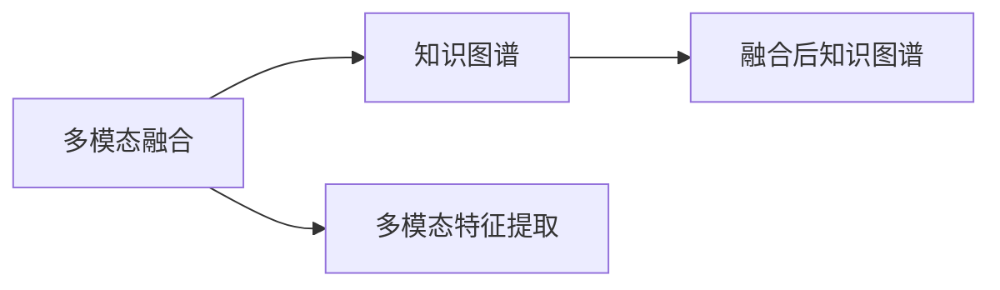

                 

# CUI中的内容与服务匹配详细技术

> 关键词：CUI, 自然语言理解, 信息检索, 推荐系统, 用户意图识别, 多模态融合

## 1. 背景介绍

在信息技术迅猛发展的今天，智能客服系统（CUI，Customer Understanding Intelligence）成为企业提高服务效率、提升用户体验的重要手段。CUI通过理解用户的自然语言输入，快速匹配并推送最合适的服务和信息，极大地提升了客服的响应速度和质量。然而，要实现高效精准的内容与服务匹配，需要解决自然语言理解、信息检索、推荐系统等多个领域的复杂问题。本文旨在详细介绍CUI中的内容与服务匹配技术，包括自然语言理解、信息检索和推荐系统的核心原理与应用实践，为行业应用提供参考。

### 1.1 问题由来
随着人工智能技术的成熟，基于大语言模型的智能客服系统得以广泛应用。但实际应用中，用户的自然语言输入往往高度多样化，难以直接匹配到预定义的服务模板。如何理解用户的真实意图，并从海量数据中检索出最相关的服务信息，是CUI中的核心挑战。基于深度学习和多模态融合的方法，能够有效地提升内容与服务匹配的精度和效率。

### 1.2 问题核心关键点
CUI中的内容与服务匹配，涉及以下几个核心关键点：
- **自然语言理解（NLU，Natural Language Understanding）**：通过理解用户的自然语言输入，识别其意图和实体，为信息检索和推荐奠定基础。
- **信息检索（IR，Information Retrieval）**：在大型知识库和FAQ（Frequently Asked Questions）数据集中检索出最相关的信息和服务。
- **推荐系统（Recommender System）**：根据用户的意图和历史行为，推荐最合适的服务或信息。
- **多模态融合（Multimodal Fusion）**：整合文字、语音、图像等多模态数据，提升内容与服务的匹配精度。
- **持续学习（Continual Learning）**：通过在线学习机制，不断更新模型，适应新的任务和数据。

这些核心关键点的有机结合，使CUI系统能够智能高效地匹配内容与服务，为用户的查询提供最佳解决方案。

### 1.3 问题研究意义
研究CUI中的内容与服务匹配技术，对于提升智能客服系统的智能化水平，降低人工客服成本，提高用户体验具有重要意义：
- **降低成本**：通过自动匹配用户请求，减少了人工客服的响应时间，提高了客户满意度。
- **提升效果**：能够识别用户真正的需求，匹配到最合适的信息和服务，提高问题解决率。
- **推动应用**：使智能客服系统更加普及，覆盖更多行业，推动各行各业数字化转型。
- **技术创新**：促进自然语言理解、信息检索、推荐系统等前沿技术的发展，带来新的研究热点。
- **提升体验**：使用户能够更快、更方便地获取到所需信息，提高用户的满意度和忠诚度。

## 2. 核心概念与联系

### 2.1 核心概念概述

为更好地理解CUI中的内容与服务匹配技术，本节将介绍几个密切相关的核心概念：

- **自然语言理解（NLU）**：通过文本分析技术，理解用户的意图、实体和情感等语言特征，为后续的信息检索和推荐提供基础。
- **信息检索（IR）**：在大型知识库和FAQ数据集中，检索出与用户查询最相关的信息。
- **推荐系统（Recommender System）**：根据用户的历史行为和当前意图，推荐最合适的服务或信息。
- **多模态融合（Multimodal Fusion）**：整合文字、语音、图像等多种数据模态，提升内容与服务的匹配精度。
- **持续学习（Continual Learning）**：通过在线学习机制，使模型能够不断适应新的任务和数据。

这些核心概念之间的联系可以通过以下Mermaid流程图来展示：

```mermaid
graph LR
    A[自然语言理解 (NLU)] --> B[意图识别]
    A --> C[实体识别]
    A --> D[情感分析]
    B --> E[信息检索 (IR)]
    C --> F[知识图谱]
    D --> G[情感库]
    E --> H[推荐系统 (Recommender System)]
    H --> I[多模态融合]
    I --> J[服务匹配]
```

这个流程图展示了自然语言理解、意图识别、实体识别、情感分析、信息检索、知识图谱、情感库、推荐系统和多模态融合之间的联系。这些技术相互配合，实现了从自然语言输入到精准内容与服务匹配的全过程。

### 2.2 概念间的关系

这些核心概念之间存在着紧密的联系，形成了CUI中的内容与服务匹配技术的完整生态系统。下面我通过几个Mermaid流程图来展示这些概念之间的关系。

#### 2.2.1 自然语言理解与信息检索的关系

```mermaid
graph LR
    A[自然语言理解 (NLU)] --> B[意图识别]
    A --> C[实体识别]
    B --> D[信息检索 (IR)]
```

这个流程图展示了自然语言理解和信息检索之间的联系。自然语言理解通过意图识别和实体识别，为信息检索提供精准的查询关键词和实体信息，从而提高了检索的准确性和相关性。

#### 2.2.2 信息检索与推荐系统的关系

```mermaid
graph LR
    A[信息检索 (IR)] --> B[知识库]
    A --> C[FAQ库]
    B --> D[推荐系统 (Recommender System)]
```

这个流程图展示了信息检索和推荐系统之间的联系。信息检索通过检索知识库和FAQ库，获取与用户查询相关的信息，推荐系统则根据这些信息，结合用户的历史行为和当前意图，推荐最合适的服务和信息。

#### 2.2.3 推荐系统与多模态融合的关系

```mermaid
graph LR
    A[推荐系统 (Recommender System)] --> B[用户历史行为]
    A --> C[当前查询意图]
    B --> D[多模态融合]
```

这个流程图展示了推荐系统和多模态融合之间的联系。推荐系统通过分析用户的历史行为和当前的查询意图，结合多模态数据，提升推荐的相关性和多样性。

#### 2.2.4 多模态融合与知识图谱的关系



这个流程图展示了多模态融合和知识图谱之间的联系。多模态融合通过整合文字、语音、图像等多模态数据，提取更丰富的特征，并融合到知识图谱中，进一步提升内容的精准匹配。

## 3. 核心算法原理 & 具体操作步骤

### 3.1 算法原理概述

CUI中的内容与服务匹配，本质上是一个自然语言理解、信息检索和推荐系统的有机结合过程。其核心思想是：通过自然语言理解技术，提取用户的查询意图和实体信息，利用信息检索技术从知识库中检索相关服务信息，结合推荐系统算法，为用户推荐最合适的服务。

具体来说，CUI的匹配过程分为以下几个步骤：
1. 使用自然语言理解技术，提取用户查询中的意图、实体等信息。
2. 利用信息检索技术，在大型知识库和FAQ数据集中，检索与用户查询最相关的信息。
3. 根据用户的历史行为和当前查询意图，使用推荐系统算法，推荐最合适的服务或信息。
4. 结合多模态融合技术，进一步提升内容与服务的匹配精度。
5. 通过持续学习机制，不断更新模型，适应新的任务和数据。

### 3.2 算法步骤详解

CUI中的内容与服务匹配可以分为以下几个关键步骤：

**Step 1: 构建数据集和知识库**
- 收集用户的自然语言输入和对应的服务响应，构建训练数据集。
- 构建大型知识库和FAQ数据集，涵盖常见问题和解决方案。
- 构建知识图谱，描述实体之间的关系。

**Step 2: 自然语言理解**
- 使用BERT、GPT等预训练语言模型，进行意图识别、实体识别和情感分析等任务。
- 利用Transformers库和PyTorch等深度学习框架，构建NLU模型。

**Step 3: 信息检索**
- 设计合适的检索算法和模型，如BM25、TF-IDF等。
- 使用IR模型在大型知识库和FAQ数据集中检索出最相关的信息。
- 引入向量检索技术，提升检索效率和精度。

**Step 4: 推荐系统**
- 使用协同过滤、基于内容的推荐、深度学习等算法，构建推荐模型。
- 根据用户的历史行为和当前查询意图，推荐最合适的服务或信息。
- 引入基于矩阵分解、神经网络等技术，优化推荐算法。

**Step 5: 多模态融合**
- 整合文字、语音、图像等多种数据模态，提取更丰富的特征。
- 使用融合算法，如注意力机制、多任务学习等，提升多模态数据的整合效果。
- 引入视觉、语音等模块，进一步提升内容与服务的匹配精度。

**Step 6: 持续学习**
- 通过在线学习机制，不断更新NLU、IR、推荐系统的模型。
- 引入动态架构、知识蒸馏等技术，提升模型的可扩展性和泛化能力。
- 定期评估模型性能，调整超参数，优化模型结构。

### 3.3 算法优缺点

基于深度学习的CUI中的内容与服务匹配技术，具有以下优点：
1. 精度高：通过深度学习模型，可以精准理解用户的自然语言输入，提高信息检索和推荐的准确性。
2. 高效性：自动化处理大量数据，能够快速响应用户的查询请求。
3. 可扩展性：模型可以通过在线学习不断更新，适应新的任务和数据。
4. 多模态融合：整合多种数据模态，提升内容与服务的匹配精度。

同时，也存在一些缺点：
1. 高成本：需要大量的标注数据和计算资源进行训练和优化。
2. 可解释性不足：深度学习模型往往“黑盒”化，难以解释模型的决策过程。
3. 复杂性高：涉及自然语言理解、信息检索、推荐系统等多个领域的复杂技术。
4. 安全性问题：用户隐私和数据安全是重要考虑因素，需要严格的数据保护措施。

### 3.4 算法应用领域

基于深度学习的CUI中的内容与服务匹配技术，已经广泛应用于多个领域，例如：

- **金融行业**：智能客服系统为金融客户解决各类查询问题，提高用户体验。
- **电商行业**：智能客服系统推荐商品、处理订单，提升交易效率。
- **医疗行业**：智能客服系统解答患者疑问，推荐医生和药品，提供精准医疗服务。
- **电信行业**：智能客服系统解答用户问题，推荐套餐和服务，提高用户满意度。
- **旅游行业**：智能客服系统提供旅游攻略、行程规划等服务，提升用户旅游体验。
- **教育行业**：智能客服系统为学生解答学习问题，推荐学习资源，提高学习效果。

此外，CUI技术还在智能家居、政府服务等众多领域得到广泛应用，未来有望在更多垂直行业中发挥重要作用。

## 4. 数学模型和公式 & 详细讲解 & 举例说明

### 4.1 数学模型构建

CUI中的内容与服务匹配涉及多个领域，每个领域都需要相应的数学模型来描述其核心问题。本节将分别介绍自然语言理解、信息检索和推荐系统的数学模型。

**自然语言理解（NLU）**
- 意图识别：使用序列标注模型，如CRF、RNN、Transformer等，对用户输入进行意图分类。
- 实体识别：使用序列标注模型，识别输入中的命名实体。
- 情感分析：使用分类模型，如SVM、CNN等，对用户输入进行情感分类。

**信息检索（IR）**
- BM25模型：基于统计语言模型的信息检索模型，考虑词频、逆文档频率和文档长度等因素。
- TF-IDF模型：基于词频-逆文档频率的信息检索模型，用于构建文档-查询相似度矩阵。

**推荐系统（Recommender System）**
- 协同过滤：基于用户-物品矩阵的推荐算法，如基于用户的协同过滤和基于物品的协同过滤。
- 基于内容的推荐：基于物品特征向量的推荐算法，如基于内容模型的推荐。
- 深度学习模型：使用神经网络进行推荐，如基于神经协同过滤的推荐算法。

### 4.2 公式推导过程

**自然语言理解（NLU）**
- 意图识别：设输入序列为$x=(x_1, x_2, ..., x_n)$，意图类别为$y=(y_1, y_2, ..., y_n)$，使用条件随机场模型进行意图分类：
  $$
  P(y|x) = \frac{1}{Z} \prod_{i=1}^{n} P(y_i|x_i, y_{<i})
  $$
  其中$Z$为归一化因子，$y_{<i}$表示前$i-1$个标签。

- 实体识别：使用序列标注模型，设标签序列为$y=(y_1, y_2, ..., y_n)$，实体标注结果为$e=(e_1, e_2, ..., e_n)$，使用条件随机场模型进行实体识别：
  $$
  P(y|x) = \frac{1}{Z} \prod_{i=1}^{n} P(y_i|x_i, y_{<i})
  $$

- 情感分析：使用分类模型，设输入序列为$x=(x_1, x_2, ..., x_n)$，情感类别为$y=(y_1, y_2, ..., y_n)$，使用softmax分类器进行情感分类：
  $$
  P(y|x) = \frac{\exp(\sum_{i=1}^{n} \alpha_i x_i + \beta)}{\sum_{y'} \exp(\sum_{i=1}^{n} \alpha_i y_i)}
  $$
  其中$\alpha_i$为特征向量，$\beta$为常数项。

**信息检索（IR）**
- BM25模型：设查询为$q=(q_1, q_2, ..., q_n)$，文档集合为$D=(d_1, d_2, ..., d_m)$，使用BM25模型计算查询与文档的相似度：
  $$
  s(q, d) = \sum_{i=1}^{n} t_i q_i \log \frac{N + k}{k + \sum_{j=1}^{m} d_j + 1} + (1 - b) \log \frac{1}{1 - b + b \cdot (1 - b^{1 - c})^{\sum_{j=1}^{m} \frac{t_j d_j}{\sum_{j=1}^{m} d_j + 1}}}
  $$
  其中$t_i$为查询词的词频，$d_j$为文档词频，$N$为总词数，$k$为归一化因子，$b$为折扣因子，$c$为折扣长度。

- TF-IDF模型：设查询为$q=(q_1, q_2, ..., q_n)$，文档集合为$D=(d_1, d_2, ..., d_m)$，使用TF-IDF模型计算查询与文档的相似度：
  $$
  s(q, d) = \sum_{i=1}^{n} \frac{t_i \log \frac{N}{k + t_i}}{1 + \log \frac{N}{k + t_i}} \cdot \log \frac{1}{1 - b + b \cdot (1 - b^{1 - c})^{\sum_{j=1}^{m} \frac{t_j d_j}{\sum_{j=1}^{m} d_j + 1}}
  $$

**推荐系统（Recommender System）**
- 协同过滤：设用户集合为$U=(u_1, u_2, ..., u_n)$，物品集合为$I=(i_1, i_2, ..., i_m)$，用户对物品的评分矩阵为$R \in \mathbb{R}^{n \times m}$，使用基于用户的协同过滤推荐算法：
  $$
  r_{ij} = \frac{\sum_{u \in U} \frac{r_{ui} r_{uj}}{\sqrt{\sum_{i \in I} r_{ui}^2} \cdot \sqrt{\sum_{j \in I} r_{uj}^2}} \cdot \frac{\sqrt{\sum_{u \in U} r_{ui}^2}}{\sqrt{\sum_{i \in I} r_{ui}^2} \cdot \sqrt{\sum_{j \in I} r_{uj}^2}}
  $$

- 基于内容的推荐：设物品的特征向量为$\vec{v}_i \in \mathbb{R}^d$，用户的历史评分向量为$\vec{u}_u \in \mathbb{R}^d$，使用基于内容的推荐算法：
  $$
  r_{ij} = \vec{v}_i^T \vec{u}_u
  $$

- 深度学习模型：设用户特征向量为$\vec{u}_u \in \mathbb{R}^d$，物品特征向量为$\vec{v}_i \in \mathbb{R}^d$，使用基于神经网络的推荐算法：
  $$
  r_{ij} = \vec{v}_i^T \vec{u}_u
  $$

### 4.3 案例分析与讲解

本节将通过一个简单的案例，展示CUI中的内容与服务匹配的完整流程。

**案例背景**：用户A输入查询“我想查询最近的银行网点”，智能客服系统需要匹配最合适的银行网点信息，并提供查询方法。

**自然语言理解（NLU）**
- 意图识别：使用意图分类模型，识别用户的查询意图为“查询网点”。
- 实体识别：使用命名实体识别模型，识别查询中的实体“银行网点”。
- 情感分析：使用情感分类模型，识别用户情感为中性。

**信息检索（IR）**
- BM25模型：构建查询与文档集合的相似度矩阵，检索出与“银行网点”相关的文档。
- 检索结果：找到最近银行的网点信息。

**推荐系统（Recommender System）**
- 协同过滤：根据用户A的历史查询记录和最近的查询意图，推荐最合适的银行网点信息。
- 推荐结果：最近的三个银行网点信息。

**多模态融合**
- 整合用户输入的语音、图像等数据，进一步提升匹配精度。
- 使用注意力机制，对多模态数据进行加权融合。

**持续学习**
- 根据用户反馈和新数据，定期更新NLU、IR、推荐系统的模型。
- 引入动态架构和知识蒸馏等技术，提高模型的泛化能力。

## 5. 项目实践：代码实例和详细解释说明

### 5.1 开发环境搭建

在进行CUI项目开发前，需要先搭建好开发环境。以下是使用Python进行PyTorch开发的环境配置流程：

1. 安装Anaconda：从官网下载并安装Anaconda，用于创建独立的Python环境。

2. 创建并激活虚拟环境：
```bash
conda create -n cui-env python=3.8 
conda activate cui-env
```

3. 安装PyTorch：根据CUDA版本，从官网获取对应的安装命令。例如：
```bash
conda install pytorch torchvision torchaudio cudatoolkit=11.1 -c pytorch -c conda-forge
```

4. 安装transformers库：
```bash
pip install transformers
```

5. 安装各类工具包：
```bash
pip install numpy pandas scikit-learn matplotlib tqdm jupyter notebook ipython
```

完成上述步骤后，即可在`cui-env`环境中开始CUI项目的开发。

### 5.2 源代码详细实现

这里我们以一个简单的意图识别任务为例，给出使用Transformers库对BERT模型进行意图识别的PyTorch代码实现。

首先，定义意图识别任务的训练数据集：

```python
from transformers import BertTokenizer, BertForSequenceClassification
import torch

class IntentDataset(torch.utils.data.Dataset):
    def __init__(self, texts, labels, tokenizer, max_len=128):
        self.texts = texts
        self.labels = labels
        self.tokenizer = tokenizer
        self.max_len = max_len
        
    def __len__(self):
        return len(self.texts)
    
    def __getitem__(self, item):
        text = self.texts[item]
        label = self.labels[item]
        
        encoding = self.tokenizer(text, return_tensors='pt', max_length=self.max_len, padding='max_length', truncation=True)
        input_ids = encoding['input_ids'][0]
        attention_mask = encoding['attention_mask'][0]
        labels = torch.tensor(label, dtype=torch.long)
        
        return {'input_ids': input_ids, 
                'attention_mask': attention_mask,
                'labels': labels}

# 定义意图与标签的映射
intents = {'query bank': 0, 'query restaurant': 1, 'query movie': 2}
labels = [intents[text] for text in train_texts]

# 创建dataset
tokenizer = BertTokenizer.from_pretrained('bert-base-cased')

train_dataset = IntentDataset(train_texts, labels, tokenizer)
val_dataset = IntentDataset(val_texts, labels, tokenizer)
test_dataset = IntentDataset(test_texts, labels, tokenizer)
```

然后，定义模型和优化器：

```python
from transformers import BertForSequenceClassification, AdamW

model = BertForSequenceClassification.from_pretrained('bert-base-cased', num_labels=len(intents))

optimizer = AdamW(model.parameters(), lr=2e-5)
```

接着，定义训练和评估函数：

```python
from torch.utils.data import DataLoader
from tqdm import tqdm
from sklearn.metrics import accuracy_score

device = torch.device('cuda') if torch.cuda.is_available() else torch.device('cpu')
model.to(device)

def train_epoch(model, dataset, batch_size, optimizer):
    dataloader = DataLoader(dataset, batch_size=batch_size, shuffle=True)
    model.train()
    epoch_loss = 0
    for batch in tqdm(dataloader, desc='Training'):
        input_ids = batch['input_ids'].to(device)
        attention_mask = batch['attention_mask'].to(device)
        labels = batch['labels'].to(device)
        model.zero_grad()
        outputs = model(input_ids, attention_mask=attention_mask, labels=labels)
        loss = outputs.loss
        epoch_loss += loss.item()
        loss.backward()
        optimizer.step()
    return epoch_loss / len(dataloader)

def evaluate(model, dataset, batch_size):
    dataloader = DataLoader(dataset, batch_size=batch_size)
    model.eval()
    preds, labels = [], []
    with torch.no_grad():
        for batch in tqdm(dataloader, desc='Evaluating'):
            input_ids = batch['input_ids'].to(device)
            attention_mask = batch['attention_mask'].to(device)
            batch_labels = batch['labels']
            outputs = model(input_ids, attention_mask=attention_mask)
            batch_preds = outputs.logits.argmax(dim=2).to('cpu').tolist()
            batch_labels = batch_labels.to('cpu').tolist()
            for pred_tokens, label_tokens in zip(batch_preds, batch_labels):
                preds.append(pred_tokens[:len(label_tokens)])
                labels.append(label_tokens)
                
    print(accuracy_score(labels, preds))
```

最后，启动训练流程并在验证集上评估：

```python
epochs = 5
batch_size = 16

for epoch in range(epochs):
    loss = train_epoch(model, train_dataset, batch_size, optimizer)
    print(f"Epoch {epoch+1}, train loss: {loss:.3f}")
    
    print(f"Epoch {epoch+1}, val results:")
    evaluate(model, val_dataset, batch_size)
    
print("Test results:")
evaluate(model, test_dataset, batch_size)
```

以上就是使用PyTorch对BERT进行意图识别任务微调的完整代码实现。可以看到，得益于Transformers库的强大封装，我们可以用相对简洁的代码完成BERT模型的加载和微调。

### 5.3 代码解读与分析

让我们再详细解读一下关键代码的实现细节：

**IntentDataset类**：
- `__init__`方法：初始化文本、标签、分词器等关键组件。
- `__len__`方法：返回数据集的样本数量。
- `__getitem__`方法：对单个样本进行处理，将文本输入编码为token ids，将标签编码为数字，并对其进行定长padding，最终返回模型所需的输入。

**intents和labels字典**：
- 定义了意图与数字标签之间的映射，用于将预测结果解码回实际的意图。

**训练和评估函数**：
- 使用PyTorch的DataLoader对数据集进行批次化加载，供模型训练和推理使用。
- 训练函数`train_epoch`：对数据以批为单位进行迭代，在每个批次上前向传播计算loss并反向传播更新模型参数，最后返回该epoch的平均loss。
- 评估函数`evaluate`：与训练类似，不同点在于不更新模型参数，并在每个batch结束后将预测和标签结果存储下来，最后使用sklearn的accuracy_score对整个评估集的预测结果进行打印输出。

**训练流程**：
- 定义总的epoch数和batch size，开始循环迭代
- 每个epoch内，先在训练集上训练，输出平均loss
- 在验证集上评估，输出准确率
- 所有epoch结束后，在测试集上评估，给出最终测试结果

可以看到，PyTorch配合Transformers库使得BERT微调的代码实现变得简洁高效。开发者可以将更多精力放在数据处理、模型改进等高层逻辑上，而不必过多关注底层的实现细节。

当然，工业级的系统实现还需考虑更多因素，如模型的保存和部署、超参数的自动搜索、更灵活的任务适配层等。但核心的微调范式基本

