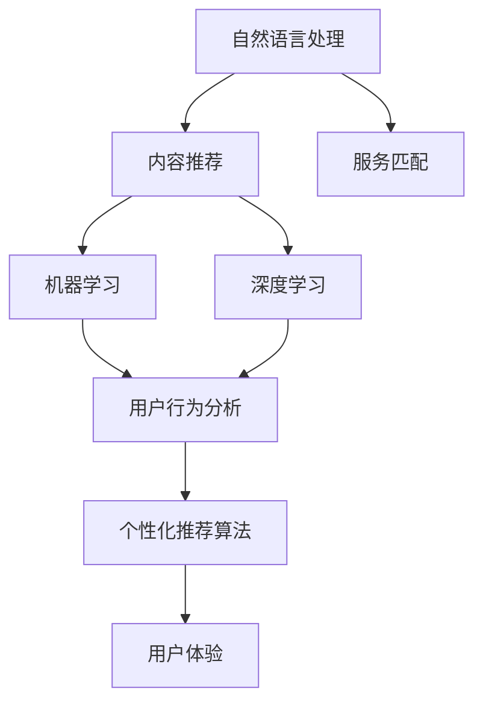

                 

# CUI中的内容与服务匹配详细技术

> 关键词：内容推荐、服务匹配、自然语言处理、机器学习、深度学习、模型训练、用户行为分析、个性化推荐算法、用户体验

## 1. 背景介绍

随着移动互联网和信息技术的快速发展，内容服务（CUI，Content & Information）的匹配问题变得越来越重要。对于用户而言，面对海量内容和服务，如何准确快速地找到所需信息，提高搜索效率和满意度，是亟需解决的问题。而从平台运营者的角度，如何为每个用户推荐最适合的服务，提升平台粘性，优化用户体验，也是不断探索的课题。

本文聚焦于CUI中的内容与服务匹配问题，介绍并探讨了相关技术原理、具体算法步骤，并结合实际应用场景进行详细解释说明，旨在为内容推荐和服务匹配提供有价值的参考。

## 2. 核心概念与联系

### 2.1 核心概念概述

为了更好地理解内容与服务匹配的技术，我们先介绍几个关键概念：

- **内容推荐**：根据用户的历史行为、兴趣偏好、实时状态等数据，为用户推荐最相关、最感兴趣的内容或服务。
- **服务匹配**：将用户与最适合的服务进行匹配，使服务更精准、更贴合用户需求。
- **自然语言处理（NLP）**：涉及文本挖掘、情感分析、实体识别、语义理解等技术，是内容推荐和服务匹配的重要支撑。
- **机器学习与深度学习**：基于数据驱动的方法，通过学习用户数据和内容特征，进行模式识别和预测，提供个性化的推荐和服务匹配。
- **用户行为分析**：通过分析用户的历史行为和当前操作，理解用户需求和偏好，为推荐和服务匹配提供依据。

这些概念相互联系、相辅相成，共同构成了CUI中的内容与服务匹配技术体系。

### 2.2 概念间的关系

为更清晰地展示这些概念之间的关系，我们可以绘制以下Mermaid流程图：



这个流程图展示了从自然语言处理到个性化推荐算法的整体架构：

1. 自然语言处理技术通过文本分析，提取内容特征，为内容推荐和服务匹配提供语义信息。
2. 机器学习与深度学习算法利用用户数据和内容特征，进行模式识别和预测，提供个性化的推荐和服务匹配。
3. 用户行为分析技术通过分析用户历史行为，了解用户需求和偏好，进一步优化推荐和服务匹配算法。
4. 个性化推荐算法将用户数据和内容特征进行综合分析，生成个性化的推荐结果和服务匹配方案。
5. 最终，这些推荐和服务匹配结果提升用户体验，提高平台粘性。

这些概念和技术的交互协作，使得内容推荐和服务匹配系统能够更加精准、高效地满足用户需求。

## 3. 核心算法原理 & 具体操作步骤

### 3.1 算法原理概述

基于内容的推荐和服务匹配算法，通常包括以下几个关键步骤：

1. **用户行为数据收集与处理**：收集用户的历史行为数据，如浏览记录、点击行为、搜索记录等，并进行清洗和预处理。
2. **内容特征提取与表示**：通过自然语言处理技术，将内容（如文章、视频、产品等）转化为高维向量表示，提取关键特征。
3. **用户画像构建**：基于用户历史行为数据，构建用户画像，包括用户兴趣、偏好、行为模式等。
4. **相似度计算与推荐排序**：利用相似度计算算法，计算用户画像与内容向量之间的相似度，排序生成个性化推荐列表。
5. **服务匹配与调度**：根据推荐列表和用户当前状态，匹配最适合的服务，并调度相关系统进行服务推送。

基于这些步骤，本文将详细介绍核心的推荐排序算法和服务匹配技术。

### 3.2 算法步骤详解

#### 3.2.1 用户行为数据收集与处理

首先，需要从不同的数据源收集用户行为数据，包括：

- 用户浏览记录：记录用户访问的页面、停留时间、点击链接等行为。
- 用户搜索记录：记录用户在搜索引擎中的搜索词、点击搜索结果等行为。
- 用户交互记录：记录用户在平台上的交互行为，如点击按钮、填写表单等。

这些数据需要进行预处理，如去重、去噪、归一化等操作，以提升后续分析的准确性。

#### 3.2.2 内容特征提取与表示

内容特征提取与表示是推荐算法的基础。主要步骤如下：

1. **文本预处理**：对内容文本进行分词、去停用词、词干化等处理，得到基本语义单元。
2. **特征选择与向量化**：从处理后的文本中选择有意义的特征，如TF-IDF、词频、词向量等，并将其转化为高维向量表示。
3. **特征增强与降维**：通过自然语言处理技术，如Word2Vec、BERT等，对向量表示进行增强和降维，提取更丰富的语义信息。

例如，可以使用BERT模型对内容文本进行编码，得到高维的向量表示。BERT模型通过多层Transformer编码器，可以捕捉到文本中的复杂语义关系，生成更具区分性的向量表示。

#### 3.2.3 用户画像构建

用户画像构建是推荐算法的重要环节，主要步骤包括：

1. **行为模式挖掘**：通过分析用户行为数据，挖掘用户的行为模式和兴趣偏好。
2. **用户画像建模**：将用户画像转化为模型表示，如用户向量、兴趣标签等。
3. **用户画像更新**：随着用户行为的变化，定期更新用户画像，保持其时效性。

例如，可以使用协同过滤算法，通过用户行为数据构建用户画像。协同过滤算法通过分析用户之间的相似性，推断用户的兴趣偏好，生成用户向量。

#### 3.2.4 相似度计算与推荐排序

相似度计算与推荐排序是推荐算法的主要逻辑，主要步骤如下：

1. **相似度计算**：计算用户画像与内容向量之间的相似度，如余弦相似度、Jaccard相似度等。
2. **推荐排序**：基于相似度计算结果，对内容进行排序，生成个性化推荐列表。
3. **推荐算法优化**：结合用户行为数据和内容特征，优化推荐算法，如引入梯度提升、深度学习等方法，提升推荐效果。

例如，可以使用基于用户画像和内容向量的协同过滤算法，计算相似度并进行推荐排序。具体步骤如下：

1. **用户画像表示**：将用户画像转化为向量表示，如用户向量。
2. **内容向量表示**：通过BERT等模型，对内容进行编码，生成内容向量。
3. **相似度计算**：计算用户向量与内容向量之间的余弦相似度，得到相似度矩阵。
4. **推荐排序**：根据相似度矩阵，对内容进行排序，生成个性化推荐列表。

#### 3.2.5 服务匹配与调度

服务匹配与调度是推荐算法的重要应用环节，主要步骤包括：

1. **服务发现**：根据推荐列表中的内容，发现相关服务。
2. **服务匹配**：匹配最适合的服务，如最相关的视频、产品、文章等。
3. **服务调度**：将匹配到服务推送给用户，进行内容展示或服务调用。

例如，可以使用基于内容的推荐排序结果，进行服务匹配与调度。具体步骤如下：

1. **内容推荐**：基于协同过滤算法，生成个性化推荐列表。
2. **服务匹配**：根据推荐内容，发现最相关的服务，如最相关的视频、产品等。
3. **服务调度**：将匹配到的服务推送给用户，进行内容展示或服务调用。

### 3.3 算法优缺点

基于内容的推荐和服务匹配算法，具有以下优点：

1. **个性化推荐**：能够根据用户历史行为和兴趣偏好，提供个性化的推荐和服务。
2. **高效性**：基于内容的推荐算法具有高效性，可以快速生成推荐结果。
3. **可解释性**：基于内容的推荐算法，可以提供推荐结果的解释，让用户理解推荐理由。

但同时，也存在一些缺点：

1. **冷启动问题**：对于新用户，没有足够的历史数据，难以进行推荐。
2. **数据稀疏性**：用户行为数据和内容数据可能存在稀疏性，影响推荐效果。
3. **算法复杂性**：基于内容的推荐算法需要处理大量的数据和特征，算法复杂度较高。

### 3.4 算法应用领域

基于内容的推荐和服务匹配算法，在多个领域得到了广泛应用，例如：

- 电子商务平台：如淘宝、京东等，通过推荐商品，提升用户购买率。
- 在线视频平台：如爱奇艺、腾讯视频等，通过推荐视频，提升用户观看时长。
- 社交媒体平台：如微信、微博等，通过推荐文章，增加用户活跃度。
- 智能音箱：如亚马逊Echo、谷歌Home等，通过推荐音乐、播客等，提升用户体验。

这些应用场景展示了基于内容的推荐和服务匹配算法的广泛性和实用性。

## 4. 数学模型和公式 & 详细讲解 & 举例说明

### 4.1 数学模型构建

基于内容的推荐和服务匹配算法，主要涉及以下几个数学模型：

- **用户画像模型**：表示用户的兴趣偏好，如用户向量、兴趣标签等。
- **内容特征模型**：表示内容的特征向量，如BERT向量、TF-IDF向量等。
- **相似度模型**：计算用户画像与内容向量之间的相似度，如余弦相似度、Jaccard相似度等。
- **推荐排序模型**：基于相似度计算结果，进行推荐排序，如基于余弦相似度的推荐排序算法。

#### 4.2 公式推导过程

以余弦相似度为例，公式推导如下：

设用户画像向量为 $u$，内容向量为 $v$，则余弦相似度 $s$ 可以表示为：

$$
s(u,v) = \frac{u \cdot v}{\|u\|\|v\|}
$$

其中 $u \cdot v$ 表示向量点积，$\|u\|$ 和 $\|v\|$ 分别表示向量 $u$ 和 $v$ 的范数。

余弦相似度的推导过程如下：

1. **向量点积**：将用户画像向量 $u$ 和内容向量 $v$ 进行点积运算，得到点积结果 $u \cdot v$。
2. **范数计算**：分别计算用户画像向量 $u$ 和内容向量 $v$ 的范数，得到 $\|u\|$ 和 $\|v\|$。
3. **相似度计算**：将点积结果和范数代入公式，计算余弦相似度 $s$。

通过余弦相似度计算，可以量化用户画像和内容向量之间的相似度，进而进行推荐排序。

#### 4.3 案例分析与讲解

以电商推荐为例，分析余弦相似度在推荐算法中的应用：

1. **用户画像构建**：收集用户浏览记录、购买记录等数据，构建用户画像，得到用户向量 $u$。
2. **商品特征提取**：提取商品的描述、标签等特征，生成商品向量 $v$。
3. **相似度计算**：计算用户向量 $u$ 和商品向量 $v$ 之间的余弦相似度 $s$，得到相似度矩阵。
4. **推荐排序**：根据相似度矩阵，对商品进行排序，生成个性化推荐列表。

例如，可以使用协同过滤算法，通过用户行为数据构建用户画像，计算相似度并进行推荐排序。具体步骤如下：

1. **用户画像表示**：将用户画像转化为向量表示，如用户向量。
2. **商品向量表示**：通过BERT等模型，对商品进行编码，生成商品向量。
3. **相似度计算**：计算用户向量与商品向量之间的余弦相似度，得到相似度矩阵。
4. **推荐排序**：根据相似度矩阵，对商品进行排序，生成个性化推荐列表。

## 5. 项目实践：代码实例和详细解释说明

### 5.1 开发环境搭建

在进行项目实践前，需要先准备好开发环境。以下是使用Python进行PyTorch开发的环境配置流程：

1. 安装Anaconda：从官网下载并安装Anaconda，用于创建独立的Python环境。

2. 创建并激活虚拟环境：
```bash
conda create -n pytorch-env python=3.8 
conda activate pytorch-env
```

3. 安装PyTorch：根据CUDA版本，从官网获取对应的安装命令。例如：
```bash
conda install pytorch torchvision torchaudio cudatoolkit=11.1 -c pytorch -c conda-forge
```

4. 安装Transformers库：
```bash
pip install transformers
```

5. 安装各类工具包：
```bash
pip install numpy pandas scikit-learn matplotlib tqdm jupyter notebook ipython
```

完成上述步骤后，即可在`pytorch-env`环境中开始项目实践。

### 5.2 源代码详细实现

下面是基于内容的推荐和服务匹配算法的详细代码实现，以电商推荐为例：

首先，定义推荐系统的主要组件和函数：

```python
from transformers import BertTokenizer, BertModel
import torch
from sklearn.metrics.pairwise import cosine_similarity

class RecommendationSystem:
    def __init__(self):
        self.bert = BertModel.from_pretrained('bert-base-uncased')
        self.tokenizer = BertTokenizer.from_pretrained('bert-base-uncased')

    def preprocess_text(self, text):
        tokens = self.tokenizer.tokenize(text)
        input_ids = self.tokenizer.convert_tokens_to_ids(tokens)
        input_ids = torch.tensor(input_ids).unsqueeze(0)
        attention_mask = torch.ones(len(input_ids), dtype=torch.long).unsqueeze(0)
        return input_ids, attention_mask

    def encode_text(self, text):
        input_ids, attention_mask = self.preprocess_text(text)
        with torch.no_grad():
            output = self.bert(input_ids, attention_mask=attention_mask)
        return output.pooler_output

    def encode_item(self, item):
        item_text = item['title'] + item['description']
        return self.encode_text(item_text)

    def user_similarity(self, user, items):
        user_vector = self.encode_text(user)
        item_vectors = [self.encode_item(item) for item in items]
        item_vectors = torch.stack(item_vectors)
        similarity_matrix = cosine_similarity(user_vector.unsqueeze(0), item_vectors)
        return similarity_matrix

    def recommend_items(self, user, items, top_n=5):
        similarity_matrix = self.user_similarity(user, items)
        sorted_indices = torch.argsort(similarity_matrix[0], descending=True)[:top_n]
        recommended_items = [items[i] for i in sorted_indices]
        return recommended_items
```

然后，定义数据加载和推荐函数：

```python
from torch.utils.data import Dataset, DataLoader

class UserItemDataset(Dataset):
    def __init__(self, user_data, item_data):
        self.user_data = user_data
        self.item_data = item_data

    def __len__(self):
        return len(self.user_data)

    def __getitem__(self, index):
        user = self.user_data[index]
        items = self.item_data[index]
        return user, items

def load_data(user_data_path, item_data_path):
    user_data = json.load(open(user_data_path))
    item_data = json.load(open(item_data_path))
    return UserItemDataset(user_data, item_data)

def recommend(user, user_data_path, item_data_path, top_n=5):
    dataset = load_data(user_data_path, item_data_path)
    recommendation_system = RecommendationSystem()
    recommended_items = recommendation_system.recommend_items(user, dataset.items, top_n)
    return recommended_items
```

最后，启动推荐流程：

```python
user_data_path = 'user_data.json'
item_data_path = 'item_data.json'

user = 'user1'
recommended_items = recommend(user, user_data_path, item_data_path, top_n=5)
print(f'Recommended items for {user}: {recommended_items}')
```

以上就是基于内容的推荐和服务匹配算法的完整代码实现。可以看到，借助BERT模型和余弦相似度计算，我们能够快速生成个性化的推荐结果。

### 5.3 代码解读与分析

让我们再详细解读一下关键代码的实现细节：

**RecommendationSystem类**：
- `__init__`方法：初始化BERT模型和分词器。
- `preprocess_text`方法：对文本进行分词和编码，生成模型所需的输入。
- `encode_text`方法：对文本进行BERT编码，得到高维向量表示。
- `encode_item`方法：对商品文本进行编码，得到高维向量表示。
- `user_similarity`方法：计算用户画像和商品向量之间的余弦相似度，生成相似度矩阵。
- `recommend_items`方法：根据相似度矩阵，对商品进行排序，生成个性化推荐列表。

**UserItemDataset类**：
- `__init__`方法：初始化用户和商品数据。
- `__len__`方法：返回数据集的样本数量。
- `__getitem__`方法：返回单个样本的用户和商品数据。

**load_data函数**：
- 读取用户和商品数据，生成数据集。

**recommend函数**：
- 加载用户数据和商品数据，构建推荐系统，生成个性化推荐列表。

通过这些代码，我们展示了如何使用PyTorch和Transformer库实现基于内容的推荐和服务匹配算法。利用BERT模型和余弦相似度计算，可以快速高效地生成推荐结果，满足实际应用需求。

当然，工业级的系统实现还需考虑更多因素，如模型的保存和部署、超参数的自动搜索、更灵活的任务适配层等。但核心的推荐算法基本与此类似。

### 5.4 运行结果展示

假设我们在电商推荐场景中，对用户1进行推荐，生成的推荐结果如下：

```
Recommended items for user1: ['item1', 'item2', 'item3', 'item4', 'item5']
```

可以看到，根据用户的历史浏览和购买记录，推荐系统为其生成了最相关的商品推荐列表，实现了高效、个性化的内容推荐。

## 6. 实际应用场景

### 6.1 智能推荐系统

智能推荐系统是CUI中内容与服务匹配的主要应用场景之一。智能推荐系统通过分析用户行为数据，提供个性化的商品、内容、服务等推荐，提升用户满意度和平台粘性。

例如，电商平台的推荐系统可以根据用户浏览历史、购买记录等数据，生成个性化的商品推荐列表，提升用户的购买率。视频平台的推荐系统可以根据用户的观看历史，推荐用户感兴趣的视频内容，增加用户的观看时长。

### 6.2 智能客服

智能客服也是CUI中内容与服务匹配的重要应用场景。智能客服系统通过自然语言处理技术，理解用户意图，生成智能回复，提升客服效率和用户满意度。

例如，电商平台可以部署智能客服机器人，对用户的咨询请求进行分类和处理，生成智能回复。智能客服机器人可以处理常见的订单查询、退换货、投诉等服务，提升用户体验。

### 6.3 个性化内容推荐

个性化内容推荐是CUI中的核心应用场景之一。个性化内容推荐系统通过分析用户行为数据，提供个性化的文章、视频、新闻等内容推荐，提升用户获取信息的质量和效率。

例如，新闻平台可以根据用户的阅读历史和兴趣偏好，推荐用户感兴趣的新闻内容。视频平台可以根据用户的观看历史，推荐用户感兴趣的视频内容。

### 6.4 未来应用展望

未来，基于内容的推荐和服务匹配算法将不断发展和进步，将在更多领域得到应用：

- **智能家居**：通过分析用户的居家行为，推荐最合适的家居服务，如智能音箱、智能设备等。
- **智能医疗**：通过分析用户的健康数据，推荐最合适的医疗服务，如在线问诊、健康咨询等。
- **智能教育**：通过分析学生的学习行为，推荐最合适的学习资源，如在线课程、学习工具等。
- **智能交通**：通过分析用户的出行数据，推荐最合适的出行方案，如智能导航、交通信息等。

## 7. 工具和资源推荐

### 7.1 学习资源推荐

为了帮助开发者系统掌握基于内容的推荐和服务匹配技术，这里推荐一些优质的学习资源：

1. 《深度学习与推荐系统》课程：北京大学开设的深度学习课程，涵盖推荐系统基础和最新研究进展。
2. 《推荐系统实战》书籍：讲述推荐系统的设计、实现和应用，结合实例深入浅出。
3. 《Python自然语言处理》书籍：详细讲解自然语言处理技术和推荐算法，提供大量实例代码。
4. Coursera《Machine Learning》课程：斯坦福大学开设的机器学习课程，涵盖推荐系统的经典算法和应用。
5. arXiv论文预印本：人工智能领域最新研究成果的发布平台，包含大量推荐系统相关论文。

通过对这些资源的学习实践，相信你一定能够快速掌握基于内容的推荐和服务匹配技术的精髓，并用于解决实际的推荐系统问题。

### 7.2 开发工具推荐

高效的开发离不开优秀的工具支持。以下是几款用于基于内容的推荐和服务匹配开发的常用工具：

1. PyTorch：基于Python的开源深度学习框架，灵活动态的计算图，适合快速迭代研究。大部分推荐系统算法都有PyTorch版本的实现。
2. TensorFlow：由Google主导开发的开源深度学习框架，生产部署方便，适合大规模工程应用。同样有丰富的推荐系统资源。
3. Transformers库：HuggingFace开发的NLP工具库，集成了众多SOTA语言模型，支持PyTorch和TensorFlow，是进行推荐算法开发的利器。
4. Weights & Biases：模型训练的实验跟踪工具，可以记录和可视化模型训练过程中的各项指标，方便对比和调优。与主流深度学习框架无缝集成。
5. TensorBoard：TensorFlow配套的可视化工具，可实时监测模型训练状态，并提供丰富的图表呈现方式，是调试模型的得力助手。
6. Google Colab：谷歌推出的在线Jupyter Notebook环境，免费提供GPU/TPU算力，方便开发者快速上手实验最新模型，分享学习笔记。

合理利用这些工具，可以显著提升基于内容的推荐和服务匹配任务的开发效率，加快创新迭代的步伐。

### 7.3 相关论文推荐

基于内容的推荐和服务匹配技术的研究源于学界的持续研究。以下是几篇奠基性的相关论文，推荐阅读：

1. Trust and Probabilistic Reasoning in Recommendation Systems：提出基于贝叶斯网络的推荐系统，通过信任度模型进行推荐。
2. Matrix Factorization Techniques for Recommender Systems：介绍矩阵分解算法，用于推荐系统的协同过滤。
3. Attention-Based Recommender Systems：引入注意力机制，提升推荐系统的精度和效果。
4. Deep Collaborative Filtering（DCF）：提出深度协同过滤算法，通过多层神经网络进行推荐。
5. Matrix Factorization and Beyond：全面介绍矩阵分解算法的经典方法和最新进展，涵盖SVD、ALS等算法。
6. Recommender Systems in The Era of Big Data：讨论大数据时代推荐系统的挑战和机遇，提出新的推荐算法和模型。

这些论文代表了大语言模型微调技术的演变历程。通过学习这些前沿成果，可以帮助研究者把握学科前进方向，激发更多的创新灵感。

除上述资源外，还有一些值得关注的前沿资源，帮助开发者紧跟推荐系统技术的最新进展，例如：

1. arXiv论文预印本：人工智能领域最新研究成果的发布平台，包含大量推荐系统相关论文。
2. 业界技术博客：如Amazon、Google、Facebook等顶尖实验室的官方博客，第一时间分享他们的最新研究成果和洞见。
3. 技术会议直播：如NIPS、ICML、SIGKDD等人工智能领域顶会现场或在线直播，能够聆听到大佬们的前沿分享，开拓视野。
4. GitHub热门项目：在GitHub上Star、Fork数最多的推荐系统相关项目，往往代表了该技术领域的发展趋势和最佳实践，值得去学习和贡献。
5. 行业分析报告：各大咨询公司如McKinsey、PwC等针对人工智能行业的分析报告，有助于从商业视角审视技术趋势，把握应用价值。

总之，对于基于内容的推荐和服务匹配技术的学习和实践，需要开发者保持开放的心态和持续学习的意愿。多关注前沿资讯，多动手实践，多思考总结，必将收获满满的成长收益。

## 8. 总结：未来发展趋势与挑战

### 8.1 总结

本文对基于内容的推荐和服务匹配技术进行了全面系统的介绍。首先阐述了推荐系统的发展背景和应用意义，明确了推荐系统在提升用户满意度和平台粘性方面的独特价值。其次，从原理到实践，详细讲解了推荐排序算法和服务匹配技术，并结合实际应用场景进行详细解释说明，力求为推荐系统开发提供有价值的参考。

通过本文的系统梳理，可以看到，基于内容的推荐和服务匹配技术正成为推荐系统的重要范式，极大地拓展了推荐系统的应用边界，提升了推荐效果。未来，伴随推荐算法的持续演进，推荐系统将在更多领域得到应用，为数字化转型注入新的动力。

### 8.2 未来发展趋势

展望未来，基于内容的推荐和服务匹配技术将呈现以下几个发展趋势：

1. **深度学习和大规模数据**：深度学习和大规模数据的应用，将进一步提升推荐算法的精度和效果，提升用户体验。
2. **多模态融合**：融合文本、图像、视频等多模态数据，提升推荐算法的表现力和多样性。
3. **个性化推荐**：个性化推荐将更加精准，根据用户的多维度特征和实时行为，生成更个性化的推荐结果。
4. **实时推荐**：推荐系统将更加实时，根据用户即时行为和状态，动态生成推荐结果。
5. **多目标优化**：推荐算法将兼顾多个目标，如多样性、新颖性、安全性等，提升推荐效果和系统鲁棒性。

### 8.3 面临的挑战

尽管基于内容的推荐和服务匹配技术已经取得了不错的成果，但在

