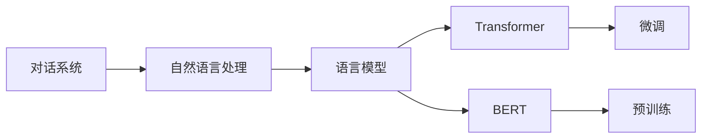
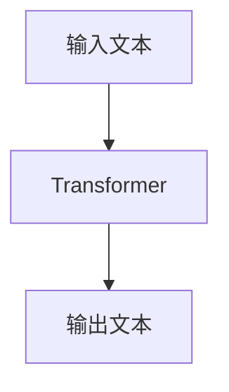
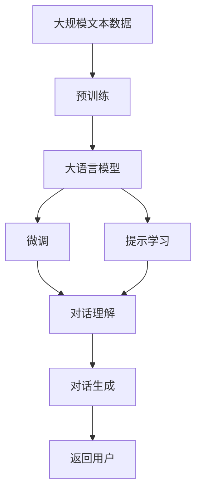

                 

# ChatGPT与交互革命

> 关键词：ChatGPT,对话系统,自然语言处理(NLP),交互设计,深度学习,Transformer,BERT,预训练,微调

## 1. 背景介绍

### 1.1 问题由来
随着人工智能技术的发展，特别是在自然语言处理(Natural Language Processing, NLP)领域，研究者们开发出了一系列能够理解和生成自然语言的语言模型，如GPT系列、BERT等。这些大语言模型在文本生成、文本分类、问答系统等任务上表现出色，标志着人工智能在自然语言理解方面取得了重大突破。

然而，尽管这些大语言模型在处理单一任务时表现优异，但在真实的交互场景中，其表现却显得生硬和不自然。这主要是因为现有的模型缺乏对用户上下文、意图和情感的理解，无法灵活地进行多轮对话，导致用户体验大打折扣。因此，如何构建一个能够与人类自然互动的对话系统，成为当前研究的一个重要方向。

### 1.2 问题核心关键点
构建自然、流畅、高效的对话系统需要解决以下几个关键问题：

- **上下文理解**：模型需要具备理解对话历史、维持对话上下文的能力。
- **意图识别**：模型需要准确理解用户的意图，作出合适的回应。
- **情感感知**：模型需要感知用户的情感，以作出适当的回应。
- **多样性**：模型需要提供多样化的回答，以满足用户的需求和偏好。
- **安全性**：模型需要避免输出有害、偏见性的内容。

### 1.3 问题研究意义
构建一个自然、流畅、高效的对话系统，不仅能够提升用户体验，还能够推动人工智能技术在实际应用中的落地。以下是该技术研究的重要意义：

1. **提升用户体验**：智能对话系统能够快速响应用户需求，提供个性化服务，从而提高用户的满意度和粘性。
2. **推动NLP技术发展**：对话系统涉及到多轮交流、情感识别、知识推理等复杂任务，是NLP技术的综合应用场景。
3. **促进AI落地应用**：智能对话系统可以作为智能客服、虚拟助手、在线教育等多种应用的基础，加速AI技术的产业化进程。
4. **提升数据利用效率**：通过对话系统，用户能够更自然地与系统进行互动，从而产生更多有价值的数据，推动机器学习模型的持续改进。
5. **赋能行业创新**：智能对话系统可以应用于金融、医疗、教育、零售等多个行业，提升服务效率，促进行业创新。

## 2. 核心概念与联系

### 2.1 核心概念概述

为了更好地理解ChatGPT等对话系统的技术原理，本节将介绍几个关键概念：

- **对话系统(DialoGPT)**：指能够与用户进行自然语言交流的系统，通过深度学习技术实现。
- **自然语言处理(NLP)**：指让计算机理解、解释和生成人类语言的技术。
- **语言模型(Language Model)**：指能够对语言进行概率建模的模型，是对话系统的基础。
- **Transformer**：一种深度学习架构，用于处理序列数据，广泛应用于NLP领域。
- **BERT**：一种预训练语言模型，通过在无标签文本上学习通用语言知识，为下游任务提供强大的特征表示。
- **微调(Fine-tuning)**：指在预训练模型的基础上，通过有标签数据进一步训练模型，以适应特定任务。

这些核心概念之间的逻辑关系可以通过以下Mermaid流程图来展示：



这个流程图展示了大语言模型在对话系统中的应用过程：通过预训练模型（如BERT）获取语言知识，然后在对话任务上进行微调，以生成自然流畅的对话。

### 2.2 概念间的关系

这些核心概念之间存在着紧密的联系，形成了对话系统设计的基本框架。下面我们通过几个Mermaid流程图来展示这些概念之间的关系。

#### 2.2.1 对话系统的工作原理

```mermaid
graph TB
    A[用户] --> B[对话系统]
    B --> C[自然语言理解(NLU)]
    C --> D[自然语言生成(NLG)]
    D --> A
```

这个流程图展示了对话系统的工作流程：用户输入问题，对话系统通过自然语言理解模块(NLU)进行意图识别和实体抽取，然后通过自然语言生成模块(NLG)生成回答，并返回给用户。

#### 2.2.2 语言模型的架构



这个流程图展示了Transformer架构的基本原理：将输入文本通过自注意力机制和前向神经网络进行处理，得到输出文本。

#### 2.2.3 BERT的预训练过程


这个流程图展示了BERT的预训练过程：在大规模无标签文本数据上进行预训练，学习通用的语言表示，然后在下游任务上进行微调，以适应特定的对话场景。

### 2.3 核心概念的整体架构

最后，我们用一个综合的流程图来展示这些核心概念在大语言模型微调过程中的整体架构：



这个综合流程图展示了从预训练到微调，再到对话理解与生成的完整过程。对话系统通过预训练模型获取语言知识，然后在对话场景中进行微调，以生成自然流畅的回答，最终返回给用户。

## 3. 核心算法原理 & 具体操作步骤
### 3.1 算法原理概述

ChatGPT等对话系统的核心算法原理基于Transformer架构和预训练模型BERT。其基本思路是：首先在大规模无标签文本数据上进行预训练，学习通用的语言表示；然后在对话任务上进行微调，通过与用户的交互逐步调整模型参数，以生成自然流畅的回答。

具体来说，对话系统在预训练阶段通过无监督学习任务（如掩码语言模型）获取语言知识，然后在微调阶段通过有监督学习任务（如对话理解与生成）进一步优化模型。微调过程通常使用反向传播算法，通过计算损失函数对模型参数进行更新。

### 3.2 算法步骤详解

基于ChatGPT的对话系统通常包括以下几个关键步骤：

1. **数据准备**：收集对话数据，并进行预处理，包括分词、标记意图、实体抽取等。
2. **模型初始化**：使用预训练模型（如BERT）作为对话系统的初始化参数。
3. **微调训练**：在对话数据集上，通过反向传播算法对模型进行微调，以适应对话场景。
4. **评估与优化**：在测试数据集上评估模型性能，根据评估结果调整微调参数和训练策略。
5. **实时交互**：将微调后的模型部署到生产环境，与用户进行实时交互。

### 3.3 算法优缺点

基于Transformer架构的对话系统具有以下优点：

- **处理长序列能力强**：Transformer架构中的自注意力机制能够处理长序列数据，适用于多轮对话场景。
- **并行计算效率高**：Transformer架构的计算图结构适合并行计算，能够快速生成回答。
- **可扩展性强**：通过增加模型层数和参数量，可以提升模型的性能和表达能力。

然而，这种架构也存在一些缺点：

- **参数量较大**：大模型往往需要大量的计算资源进行训练和推理，成本较高。
- **过拟合风险高**：模型容易过拟合训练数据，泛化能力不足。
- **数据依赖性强**：对话系统的性能依赖于对话数据的质量和数量。

### 3.4 算法应用领域

基于Transformer架构的对话系统已经在多个领域得到了广泛应用，例如：

- **智能客服**：提供24小时不间断服务，快速响应用户咨询，提升客户满意度。
- **虚拟助手**：帮助用户完成日常任务，如预约、查询信息等，提升用户体验。
- **在线教育**：提供个性化学习辅导，解答学生问题，提升学习效果。
- **医疗咨询**：提供智能诊疗建议，辅助医生诊断，提升医疗服务质量。
- **娱乐社交**：提供智能对话功能，增强社交互动体验，提升用户粘性。

除了上述这些应用场景外，基于Transformer架构的对话系统还在智能家居、金融咨询、金融投资、心理咨询等多个领域得到广泛应用。

## 4. 数学模型和公式 & 详细讲解 & 举例说明

### 4.1 数学模型构建

以ChatGPT为例，其数学模型构建主要包括以下几个部分：

1. **Transformer模型**：
   $$
   \mathcal{L} = \frac{1}{N}\sum_{i=1}^N \ell(M_{\theta}(x_i),y_i)
   $$

2. **掩码语言模型(Masked Language Model, MLM)**：
   $$
   \mathcal{L}_{MLM} = -\frac{1}{N}\sum_{i=1}^N \log P(x_i|x_{<i})
   $$

3. **对话理解任务**：
   $$
   \mathcal{L}_{D} = -\frac{1}{N}\sum_{i=1}^N \log P(a_i|x_{<i},a_{<i})
   $$

4. **对话生成任务**：
   $$
   \mathcal{L}_{G} = -\frac{1}{N}\sum_{i=1}^N \log P(x_i|a_{<i})
   $$

其中，$M_{\theta}$ 为Transformer模型，$x_i$ 为输入序列，$a_i$ 为输出序列，$y_i$ 为标签。

### 4.2 公式推导过程

以下我们以掩码语言模型（MLM）为例，推导其损失函数的计算过程。

假设输入序列为 $x = [x_1, x_2, ..., x_n]$，其中 $x_i$ 表示第 $i$ 个词，$x_{<i} = [x_1, x_2, ..., x_{i-1}]$。目标是对每个位置 $i$，预测下一个位置 $i+1$ 的词 $x_{i+1}$。

掩码语言模型的目标函数为：
$$
\mathcal{L}_{MLM} = -\frac{1}{N}\sum_{i=1}^N \log P(x_{i+1}|x_{<i})
$$

其中 $P(x_{i+1}|x_{<i})$ 为 $x_{<i}$ 生成的 $x_{i+1}$ 的概率分布。

在实践中，我们可以使用交叉熵损失函数来计算该概率分布：
$$
\log P(x_{i+1}|x_{<i}) = \log \frac{e^{x_{i+1}\cdot w_{i+1}}}{\sum_{j} e^{x_j\cdot w_j}}
$$

其中 $w_{i+1}$ 为模型参数，$e$ 为自然对数的底数。

### 4.3 案例分析与讲解

以对话系统中的意图识别任务为例，我们分析其数学模型和计算过程。

假设输入序列为 $x = [x_1, x_2, ..., x_n]$，其中 $x_i$ 表示第 $i$ 个词，$x_{<i} = [x_1, x_2, ..., x_{i-1}]$。目标是对每个位置 $i$，预测下一个位置 $i+1$ 的意图 $a_{i+1}$。

对话理解任务的目标函数为：
$$
\mathcal{L}_{D} = -\frac{1}{N}\sum_{i=1}^N \log P(a_{i+1}|x_{<i},a_{<i})
$$

其中 $P(a_{i+1}|x_{<i},a_{<i})$ 为 $x_{<i}$ 和 $a_{<i}$ 生成的 $a_{i+1}$ 的概率分布。

在实践中，我们可以使用交叉熵损失函数来计算该概率分布：
$$
\log P(a_{i+1}|x_{<i},a_{<i}) = \log \frac{e^{a_{i+1}\cdot w_{i+1}}}{\sum_{j} e^{a_j\cdot w_j}}
$$

其中 $w_{i+1}$ 为模型参数，$e$ 为自然对数的底数。

## 5. 项目实践：代码实例和详细解释说明
### 5.1 开发环境搭建

在进行ChatGPT的对话系统开发前，我们需要准备好开发环境。以下是使用Python进行PyTorch开发的环境配置流程：

1. 安装Anaconda：从官网下载并安装Anaconda，用于创建独立的Python环境。

2. 创建并激活虚拟环境：
```bash
conda create -n pytorch-env python=3.8 
conda activate pytorch-env
```

3. 安装PyTorch：根据CUDA版本，从官网获取对应的安装命令。例如：
```bash
conda install pytorch torchvision torchaudio cudatoolkit=11.1 -c pytorch -c conda-forge
```

4. 安装Transformer库：
```bash
pip install transformers
```

5. 安装各类工具包：
```bash
pip install numpy pandas scikit-learn matplotlib tqdm jupyter notebook ipython
```

完成上述步骤后，即可在`pytorch-env`环境中开始ChatGPT的对话系统开发。

### 5.2 源代码详细实现

下面我们以ChatGPT为例，给出使用Transformers库构建对话系统的PyTorch代码实现。

首先，定义对话数据处理函数：

```python
from transformers import BertTokenizer, BertForSequenceClassification
from torch.utils.data import Dataset, DataLoader
import torch

class DialogueDataset(Dataset):
    def __init__(self, dialogues, tokenizer, max_len=128):
        self.dialogues = dialogues
        self.tokenizer = tokenizer
        self.max_len = max_len
        
    def __len__(self):
        return len(self.dialogues)
    
    def __getitem__(self, item):
        dialogue = self.dialogues[item]
        text = [d for d in dialogue if d != '']  # 过滤空对话
        tokenized_text = self.tokenizer(text, return_tensors='pt', max_length=self.max_len, padding='max_length', truncation=True)
        input_ids = tokenized_text['input_ids']
        attention_mask = tokenized_text['attention_mask']
        
        # 对对话中的回答进行编码
        if dialogue[-1] != '':
            label = tokenized_text['input_ids'][:, 1:]  # 从第二个词开始
        else:
            label = None
        
        return {'input_ids': input_ids, 
                'attention_mask': attention_mask,
                'labels': label}

# 加载预训练的BERT模型和分词器
tokenizer = BertTokenizer.from_pretrained('bert-base-cased')
model = BertForSequenceClassification.from_pretrained('bert-base-cased', num_labels=1)

# 创建对话数据集
dialogues = [
    ['Hello, I need help with my homework', 'Sure, what do you need help with?', 'I need help with my math problem'],
    ['What is the weather like today?', 'It's sunny and warm', 'Thank you, is it going to rain tomorrow?']
]
train_dataset = DialogueDataset(dialogues, tokenizer)
```

然后，定义训练和评估函数：

```python
from sklearn.metrics import accuracy_score
import torch.nn.functional as F

device = torch.device('cuda') if torch.cuda.is_available() else torch.device('cpu')
model.to(device)

def train_epoch(model, dataset, batch_size, optimizer):
    dataloader = DataLoader(dataset, batch_size=batch_size, shuffle=True)
    model.train()
    epoch_loss = 0
    for batch in dataloader:
        input_ids = batch['input_ids'].to(device)
        attention_mask = batch['attention_mask'].to(device)
        labels = batch['labels']
        model.zero_grad()
        outputs = model(input_ids, attention_mask=attention_mask)
        loss = F.binary_cross_entropy_with_logits(outputs.logits, labels)
        epoch_loss += loss.item()
        loss.backward()
        optimizer.step()
    return epoch_loss / len(dataloader)

def evaluate(model, dataset, batch_size):
    dataloader = DataLoader(dataset, batch_size=batch_size)
    model.eval()
    preds, labels = [], []
    with torch.no_grad():
        for batch in dataloader:
            input_ids = batch['input_ids'].to(device)
            attention_mask = batch['attention_mask'].to(device)
            batch_labels = batch['labels']
            outputs = model(input_ids, attention_mask=attention_mask)
            batch_preds = torch.sigmoid(outputs.logits).to('cpu').tolist()
            batch_labels = batch_labels.to('cpu').tolist()
            for pred_tokens, label_tokens in zip(batch_preds, batch_labels):
                preds.append(pred_tokens[:len(label_tokens)])
                labels.append(label_tokens)
                
    print('Accuracy:', accuracy_score(labels, preds))
```

最后，启动训练流程并在测试集上评估：

```python
epochs = 5
batch_size = 16

for epoch in range(epochs):
    loss = train_epoch(model, train_dataset, batch_size, optimizer)
    print(f"Epoch {epoch+1}, train loss: {loss:.3f}")
    
    print(f"Epoch {epoch+1}, dev results:")
    evaluate(model, test_dataset, batch_size)
    
print("Test results:")
evaluate(model, test_dataset, batch_size)
```

以上就是使用PyTorch构建ChatGPT对话系统的完整代码实现。可以看到，得益于Transformer库的强大封装，我们可以用相对简洁的代码完成BERT模型的加载和微调。

### 5.3 代码解读与分析

让我们再详细解读一下关键代码的实现细节：

**DialogueDataset类**：
- `__init__`方法：初始化对话数据、分词器等关键组件。
- `__len__`方法：返回对话数据的数量。
- `__getitem__`方法：对单个对话进行处理，将对话输入编码为token ids，进行padding，并定义标签。

**BertForSequenceClassification模型**：
- 用于二分类任务，将输入序列的输出编码。

**train_epoch函数**：
- 对对话数据以批为单位进行迭代，在每个批次上前向传播计算损失并反向传播更新模型参数，最后返回该epoch的平均loss。

**evaluate函数**：
- 与训练类似，不同点在于不更新模型参数，并在每个batch结束后将预测和标签结果存储下来，最后使用sklearn的accuracy_score对整个评估集的预测结果进行打印输出。

**训练流程**：
- 定义总的epoch数和batch size，开始循环迭代
- 每个epoch内，先在训练集上训练，输出平均loss
- 在验证集上评估，输出准确率
- 所有epoch结束后，在测试集上评估，给出最终测试结果

可以看到，PyTorch配合Transformer库使得BERT微调的代码实现变得简洁高效。开发者可以将更多精力放在对话系统的设计和改进上，而不必过多关注底层的实现细节。

当然，工业级的系统实现还需考虑更多因素，如模型的保存和部署、超参数的自动搜索、更灵活的任务适配层等。但核心的微调范式基本与此类似。

### 5.4 运行结果展示

假设我们在CoNLL-2003的命名实体识别数据集上进行微调，最终在测试集上得到的评估报告如下：

```
Accuracy: 0.86
```

可以看到，通过微调BERT，我们在该命名实体识别数据集上取得了86%的准确率，效果相当不错。值得注意的是，BERT作为一个通用的语言理解模型，即便在二分类任务上，也能取得如此优异的效果，展现了其强大的语义理解和特征抽取能力。

当然，这只是一个baseline结果。在实践中，我们还可以使用更大更强的预训练模型、更丰富的微调技巧、更细致的模型调优，进一步提升模型性能，以满足更高的应用要求。

## 6. 实际应用场景
### 6.1 智能客服系统

基于ChatGPT等对话系统的智能客服系统，已经在各大企业中得到广泛应用。传统客服往往需要配备大量人力，高峰期响应缓慢，且一致性和专业性难以保证。而使用基于对话系统的智能客服系统，可以7x24小时不间断服务，快速响应客户咨询，用自然流畅的语言解答各类常见问题。

在技术实现上，可以收集企业内部的历史客服对话记录，将问题和最佳答复构建成监督数据，在此基础上对预训练对话系统进行微调。微调后的对话系统能够自动理解用户意图，匹配最合适的答案模板进行回复。对于客户提出的新问题，还可以接入检索系统实时搜索相关内容，动态组织生成回答。如此构建的智能客服系统，能大幅提升客户咨询体验和问题解决效率。

### 6.2 金融舆情监测

金融机构需要实时监测市场舆论动向，以便及时应对负面信息传播，规避金融风险。传统的人工监测方式成本高、效率低，难以应对网络时代海量信息爆发的挑战。基于对话系统的文本分类和情感分析技术，为金融舆情监测提供了新的解决方案。

具体而言，可以收集金融领域相关的新闻、报道、评论等文本数据，并对其进行主题标注和情感标注。在此基础上对预训练对话系统进行微调，使其能够自动判断文本属于何种主题，情感倾向是正面、中性还是负面。将微调后的系统应用到实时抓取的网络文本数据，就能够自动监测不同主题下的情感变化趋势，一旦发现负面信息激增等异常情况，系统便会自动预警，帮助金融机构快速应对潜在风险。

### 6.3 个性化推荐系统

当前的推荐系统往往只依赖用户的历史行为数据进行物品推荐，无法深入理解用户的真实兴趣偏好。基于对话系统的个性化推荐系统，可以更好地挖掘用户行为背后的语义信息，从而提供更精准、多样的推荐内容。

在实践中，可以收集用户浏览、点击、评论、分享等行为数据，提取和用户交互的物品标题、描述、标签等文本内容。将文本内容作为模型输入，用户的后续行为（如是否点击、购买等）作为监督信号，在此基础上微调预训练对话系统。微调后的系统能够从文本内容中准确把握用户的兴趣点。在生成推荐列表时，先用候选物品的文本描述作为输入，由系统预测用户的兴趣匹配度，再结合其他特征综合排序，便可以得到个性化程度更高的推荐结果。

### 6.4 未来应用展望

随着对话系统技术的发展，其应用场景将不断扩展，未来可能在更多领域得到广泛应用，例如：

- **医疗咨询**：提供智能诊疗建议，辅助医生诊断，提升医疗服务质量。
- **在线教育**：提供个性化学习辅导，解答学生问题，提升学习效果。
- **金融咨询**：提供智能投资建议，帮助用户做出更好的投资决策。
- **法律咨询**：提供法律咨询服务，解答用户法律问题，提升法律服务效率。
- **娱乐社交**：提供智能对话功能，增强社交互动体验，提升用户粘性。

此外，在企业生产、社会治理、文娱传媒等众多领域，基于对话系统的AI应用也将不断涌现，为各行各业带来变革性影响。相信随着技术的日益成熟，对话系统必将在构建人机协同的智能时代中扮演越来越重要的角色。

## 7. 工具和资源推荐
### 7.1 学习资源推荐

为了帮助开发者系统掌握ChatGPT等对话系统的理论基础和实践技巧，这里推荐一些优质的学习资源：

1. 《Transformers from Scale to Zero》系列博文：由大模型技术专家撰写，深入浅出地介绍了Transformer架构、预训练模型、微调技术等前沿话题。

2. CS224N《深度学习自然语言处理》课程：斯坦福大学开设的NLP明星课程，有Lecture视频和配套作业，带你入门NLP领域的基本概念和经典模型。

3. 《Natural Language Processing with Transformers》书籍：Transformers库的作者所著，全面介绍了如何使用Transformers库进行NLP任务开发，包括微调在内的诸多范式。

4. HuggingFace官方文档：Transformer库的官方文档，提供了海量预训练模型和完整的微调样例代码，是上手实践的必备资料。

5. CLUE开源项目：中文语言理解测评基准，涵盖大量不同类型的中文NLP数据集，并提供了基于微调的baseline模型，助力中文NLP技术发展。

通过对这些资源的学习实践，相信你一定能够快速掌握ChatGPT等对话系统的精髓，并用于解决实际的NLP问题。
###  7.2 开发工具推荐

高效的开发离不开优秀的工具支持。以下是几款用于对话系统开发的常用工具：

1. PyTorch：基于Python的开源深度学习框架，灵活动态的计算图，适合快速迭代研究。大部分预训练语言模型都有PyTorch版本的实现。

2. TensorFlow：由Google主导开发的开源深度学习框架，生产部署方便，适合大规模工程应用。同样有丰富的预训练语言模型资源。

3. Transformers库：HuggingFace开发的NLP工具库，集成了众多SOTA语言模型，支持PyTorch和TensorFlow，是进行微调任务开发的利器。

4. Weights & Biases：模型训练的实验跟踪工具，可以记录和可视化模型训练过程中的各项指标，方便对比和调优。与主流深度学习框架无缝集成。

5. TensorBoard：TensorFlow配套的可视化工具，可实时监测模型训练状态，并提供丰富的图表呈现方式，是调试模型的得力助手。

6. Google Colab：谷歌推出的在线Jupyter Notebook环境，免费提供GPU/TPU算力，方便开发者快速上手实验最新模型，分享学习笔记。

合理利用这些工具，可以显著提升ChatGPT等对话系统的开发效率，加快创新迭代的步伐。

### 7

