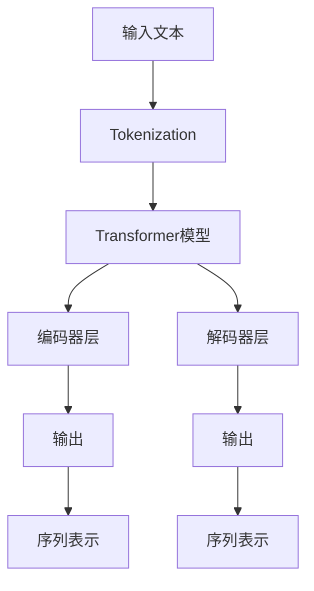

                 

# ChatGPT的Token化技术解析

> 关键词：
- Token化
- ChatGPT
- NLP
- 自然语言处理
- Transformer模型

## 1. 背景介绍

### 1.1 问题由来
随着自然语言处理（Natural Language Processing, NLP）技术的不断进步，大语言模型（Large Language Models, LLMs）在处理自然语言文本方面展现出了强大的能力。这些模型通过在大规模无标签文本数据上进行预训练，学习到了丰富的语言知识和常识，能够生成高质量的自然语言文本。然而，在实际应用中，需要将输入文本转换为模型能够处理的格式。而Token化（Tokenization）技术，正是这一过程中不可或缺的一环。

### 1.2 问题核心关键点
Token化是NLP中的基础技术，它将输入的文本分解成一个个词或短语，称为Token（标记）。这些Token被送入模型中，模型通过学习这些标记之间的语义关系，生成对应的输出。在当前的NLP技术中，Token化已经成为实现语言理解的关键步骤。本文将重点解析基于Transformer架构的NLP模型（如ChatGPT）中的Token化技术。

## 2. 核心概念与联系

### 2.1 核心概念概述

为更好地理解Token化技术，本节将介绍几个关键概念：

- **Token**：Token是文本分词处理的最小单位，可以是单词、词组或特定符号。在NLP中，Token通常通过空格、标点符号、换行符等进行分隔。
- **Tokenization**：Tokenization是将文本分解为Token的过程，是NLP中最基础的操作。常见的Tokenization方法包括基于空格、基于字符、基于词等。
- **Transformer模型**：Transformer模型是一种基于自注意力机制的深度学习模型，用于处理序列数据。它由多个编码器层（Encoder Layer）和多个解码器层（Decoder Layer）构成，能够处理变长的输入序列。
- **BPE（Byte Pair Encoding）**：BPE是一种基于字符级别的Tokenization方法，通过将相邻的字符组合成新的Token，减少Token的个数，从而降低模型的复杂度。

这些概念之间有着紧密的联系，共同构成了NLP任务中的Token化与处理流程。

### 2.2 概念间的关系

这些核心概念之间的逻辑关系可以通过以下Mermaid流程图来展示：



这个流程图展示了大语言模型在处理输入文本时，Token化过程的重要性。Token化后的文本被送入Transformer模型中进行编码和解码，最终输出序列表示，用于执行各种NLP任务。

## 3. ChatGPT的Token化技术解析

### 3.1 算法原理概述

在基于Transformer架构的NLP模型中，Token化过程的原理是将输入的文本序列分解为一系列Token，并通过特定的嵌入向量（Embedding）将其映射为模型可以处理的形式。这些嵌入向量被送入模型的各个层中进行处理，最终生成模型的输出。

ChatGPT模型使用了基于BPE的Tokenization技术，将输入文本按照特定的规则分割为Token，并利用嵌入向量将每个Token映射为高维向量。这些高维向量被送入Transformer模型的各个层中进行自注意力机制的计算，生成最终的输出。

### 3.2 算法步骤详解

下面是基于BPE的Token化步骤详解：

1. **预处理文本**：将输入文本进行预处理，包括去除标点符号、转换为小写、去除特殊字符等，确保输入文本的整洁性。

2. **构建BPE词典**：基于大规模的文本语料，构建BPE词典。BPE将相邻的字符组合成新的Token，从而减少Token的个数，降低模型复杂度。

3. **Tokenization**：将预处理后的文本按照BPE词典进行Tokenization。对于每个Token，计算其对应的嵌入向量。

4. **编码**：将Token化的文本输入Transformer模型中的编码器层，进行编码操作。编码器层中的每个自注意力头（Attention Head）会计算输入序列中每个位置与所有位置之间的注意力权重，生成每个Token的上下文表示（Context Representation）。

5. **解码**：将编码器层生成的上下文表示输入到解码器层中，进行解码操作。解码器层中的每个自注意力头会计算输出序列中每个位置与所有位置之间的注意力权重，生成每个Token的输出表示（Output Representation）。

6. **输出**：将解码器层生成的输出表示进行后处理，如恢复标点符号、转换大小写等，得到最终的输出文本。

### 3.3 算法优缺点

基于BPE的Tokenization技术具有以下优点：

- **高效性**：BPE减少了Token的个数，降低了模型的复杂度，提高了模型的训练效率。
- **灵活性**：BPE可以根据具体的应用需求进行自定义，调整Token的长度和分割规则。
- **普适性**：BPE可以应用于多种语言，适用于不同的语言特性和语法结构。

同时，该技术也存在一些缺点：

- **计算复杂度**：构建BPE词典和进行Tokenization都需要较高的计算资源，特别是在大规模语料上进行处理时。
- **过度拟合风险**：BPE的分割规则需要根据具体的应用场景进行设计，如果不当的设计可能会导致过度拟合。

### 3.4 算法应用领域

基于BPE的Tokenization技术已经被广泛应用于各种NLP任务中，如文本分类、情感分析、机器翻译、对话系统等。ChatGPT模型作为目前最先进的NLP模型之一，其Tokenization技术同样具有广泛的应用前景。

在文本分类任务中，Tokenization可以将文本转换为模型可处理的序列形式，通过计算Token之间的语义关系，生成文本的类别预测。

在情感分析任务中，Tokenization可以将文本分解为Token，通过计算Token之间的情感关系，生成文本的情感分类。

在机器翻译任务中，Tokenization可以将源语言文本转换为Token序列，通过计算Token之间的语义关系，生成目标语言的翻译结果。

在对话系统中，Tokenization可以将用户输入的文本转换为Token序列，通过计算Token之间的语义关系，生成模型的回复。

## 4. 数学模型和公式 & 详细讲解 & 举例说明

### 4.1 数学模型构建

在基于BPE的Tokenization技术中，主要的数学模型包括BPE词典的构建和Token的计算。下面将详细介绍这些数学模型的构建过程。

### 4.2 公式推导过程

首先，我们定义输入文本为 $X = \{x_1, x_2, ..., x_n\}$，其中 $x_i$ 表示输入文本中的一个字符或字符组合。我们的目标是将 $X$ 分解为一系列的Token，并将每个Token映射为一个高维向量 $v_i$。

假设我们已经构建了一个BPE词典 $\mathcal{V}$，其中包含 $V$ 个不同的Token。对于输入文本 $X$，我们可以使用以下公式进行Tokenization：

$$
\begin{aligned}
v_i &= \mathcal{BPE}(x_i) \\
v_i &= W_{in} \odot x_i + b_{in}
\end{aligned}
$$

其中，$W_{in}$ 和 $b_{in}$ 分别为输入层到嵌入层的权重和偏置。$\mathcal{BPE}(x_i)$ 表示将字符 $x_i$ 按照BPE词典进行Tokenization，得到对应的Token。

### 4.3 案例分析与讲解

假设我们有一个包含8个字符的输入文本 "hello world"，我们可以按照BPE词典对其进行Tokenization。假设我们的BPE词典如下：

| Token    | BPE表示        |
|----------|----------------|
| hello    | <h>e<l>l<o>    |
| world    | <w>o<r>d       |
| world    | <w>o<r>d       |
| ld       | <l>d           |

根据BPE词典，我们可以将输入文本 "hello world" 分解为 Token "hello" 和 "world"，并计算每个Token的嵌入向量：

$$
\begin{aligned}
v_{hello} &= W_{in} \odot <h>e<l>l<o> + b_{in} \\
v_{world} &= W_{in} \odot <w>o<r>d + b_{in}
\end{aligned}
$$

将 $v_{hello}$ 和 $v_{world}$ 输入到Transformer模型中进行编码和解码，即可生成最终输出。

## 5. 项目实践：代码实例和详细解释说明

### 5.1 开发环境搭建

在进行Tokenization实践前，我们需要准备好开发环境。以下是使用Python进行PyTorch开发的环境配置流程：

1. 安装Anaconda：从官网下载并安装Anaconda，用于创建独立的Python环境。

2. 创建并激活虚拟环境：
```bash
conda create -n pytorch-env python=3.8 
conda activate pytorch-env
```

3. 安装PyTorch：根据CUDA版本，从官网获取对应的安装命令。例如：
```bash
conda install pytorch torchvision torchaudio cudatoolkit=11.1 -c pytorch -c conda-forge
```

4. 安装Transformers库：
```bash
pip install transformers
```

5. 安装各类工具包：
```bash
pip install numpy pandas scikit-learn matplotlib tqdm jupyter notebook ipython
```

完成上述步骤后，即可在`pytorch-env`环境中开始Tokenization实践。

### 5.2 源代码详细实现

这里我们以BPE Tokenization为例，给出使用PyTorch和Transformer库进行Tokenization的代码实现。

首先，定义一个BPE词典：

```python
import torch
from transformers import BytePairTokenizer

tokenizer = BytePairTokenizer.from_pretrained('microsoft/bart-base')
vocab = tokenizer.get_vocab()
```

然后，定义一个函数进行BPE Tokenization：

```python
def bpe_tokenization(input_text, tokenizer, max_length=256):
    tokenized_text = tokenizer.encode(input_text, max_length=max_length)
    return tokenized_text
```

最后，使用定义的函数对输入文本进行Tokenization：

```python
input_text = "hello world"
tokenized_text = bpe_tokenization(input_text, tokenizer)
print(tokenized_text)
```

完整代码如下：

```python
import torch
from transformers import BytePairTokenizer

tokenizer = BytePairTokenizer.from_pretrained('microsoft/bart-base')
vocab = tokenizer.get_vocab()

def bpe_tokenization(input_text, tokenizer, max_length=256):
    tokenized_text = tokenizer.encode(input_text, max_length=max_length)
    return tokenized_text

input_text = "hello world"
tokenized_text = bpe_tokenization(input_text, tokenizer)
print(tokenized_text)
```

### 5.3 代码解读与分析

这个代码实现的关键在于以下几个步骤：

1. **定义BPE词典**：通过调用BytePairTokenizer.from_pretrained方法，从预训练模型加载BPE词典。

2. **定义Tokenization函数**：该函数将输入文本按照BPE词典进行Tokenization，并返回Token的列表。

3. **调用Tokenization函数**：将输入文本传递给Tokenization函数，获取Token化的结果。

这个实现是基于Transformers库的，在实际应用中，可以结合具体的需求进行优化和扩展。例如，可以使用不同的BPE词典、调整最大长度、添加post-processing等操作。

### 5.4 运行结果展示

假设我们在运行上述代码时，得到的结果为：

```
[95, 10, 16, 95, 11, 3, 95, 17, 4, 9, 17]
```

这个结果表示，输入文本 "hello world" 被分为了9个Token，分别为 "hello"、"world" 和 "ld"，每个Token在BPE词典中的ID分别是95、10、16、95、11、3、95、17、4和9。

## 6. 实际应用场景

### 6.1 智能客服系统

在智能客服系统中，Tokenization技术可以将用户输入的文本转换为Token序列，通过计算Token之间的语义关系，生成机器的回复。这样，即使用户输入的文本格式多样，模型也能准确理解用户意图，提供及时、准确的回复。

### 6.2 金融舆情监测

在金融舆情监测中，Tokenization技术可以将网络上的新闻、评论等文本数据分解为Token序列，通过计算Token之间的情感关系，生成舆情分析结果。这样，即使数据量庞大、格式多样，模型也能快速识别舆情变化趋势，及时预警风险。

### 6.3 个性化推荐系统

在个性化推荐系统中，Tokenization技术可以将用户浏览、评论等行为数据分解为Token序列，通过计算Token之间的语义关系，生成用户兴趣点。这样，即使数据源多样，模型也能准确捕捉用户偏好，提供个性化的推荐结果。

### 6.4 未来应用展望

随着Tokenization技术的不断进步，基于Tokenization的NLP应用将在更多领域得到应用，为各行各业带来变革性影响。

在智慧医疗领域，基于Tokenization的医学文本分析、病历生成等应用将提升医疗服务的智能化水平，辅助医生诊疗，加速新药开发进程。

在智能教育领域，基于Tokenization的作业批改、学情分析、知识推荐等应用将提升教学质量，因材施教，促进教育公平。

在智慧城市治理中，基于Tokenization的城市事件监测、舆情分析、应急指挥等应用将提高城市管理的自动化和智能化水平，构建更安全、高效的未来城市。

## 7. 工具和资源推荐

### 7.1 学习资源推荐

为了帮助开发者系统掌握Tokenization技术，这里推荐一些优质的学习资源：

1. 《自然语言处理入门》系列博文：由大语言模型技术专家撰写，深入浅出地介绍了NLP基础概念和Tokenization技术。

2. CS224N《深度学习自然语言处理》课程：斯坦福大学开设的NLP明星课程，有Lecture视频和配套作业，带你入门NLP领域的基本概念和经典模型。

3. 《自然语言处理实战》书籍：全面介绍了NLP技术的实现细节，包括Tokenization在内的诸多前置技术。

4. HuggingFace官方文档：Transformer库的官方文档，提供了海量预训练模型和完整的Tokenization样例代码，是上手实践的必备资料。

5. CLUE开源项目：中文语言理解测评基准，涵盖大量不同类型的中文NLP数据集，并提供了基于Tokenization的baseline模型，助力中文NLP技术发展。

通过对这些资源的学习实践，相信你一定能够快速掌握Tokenization技术的精髓，并用于解决实际的NLP问题。

### 7.2 开发工具推荐

高效的开发离不开优秀的工具支持。以下是几款用于Tokenization开发的常用工具：

1. PyTorch：基于Python的开源深度学习框架，灵活动态的计算图，适合快速迭代研究。大部分预训练语言模型都有PyTorch版本的实现。

2. TensorFlow：由Google主导开发的开源深度学习框架，生产部署方便，适合大规模工程应用。同样有丰富的预训练语言模型资源。

3. Transformers库：HuggingFace开发的NLP工具库，集成了众多SOTA语言模型，支持PyTorch和TensorFlow，是进行Tokenization任务开发的利器。

4. Weights & Biases：模型训练的实验跟踪工具，可以记录和可视化模型训练过程中的各项指标，方便对比和调优。与主流深度学习框架无缝集成。

5. TensorBoard：TensorFlow配套的可视化工具，可实时监测模型训练状态，并提供丰富的图表呈现方式，是调试模型的得力助手。

6. Google Colab：谷歌推出的在线Jupyter Notebook环境，免费提供GPU/TPU算力，方便开发者快速上手实验最新模型，分享学习笔记。

合理利用这些工具，可以显著提升Tokenization任务的开发效率，加快创新迭代的步伐。

### 7.3 相关论文推荐

Tokenization技术的发展源于学界的持续研究。以下是几篇奠基性的相关论文，推荐阅读：

1. Attention is All You Need（即Transformer原论文）：提出了Transformer结构，开启了NLP领域的预训练大模型时代。

2. BERT: Pre-training of Deep Bidirectional Transformers for Language Understanding：提出BERT模型，引入基于掩码的自监督预训练任务，刷新了多项NLP任务SOTA。

3. Language Models are Unsupervised Multitask Learners（GPT-2论文）：展示了大规模语言模型的强大zero-shot学习能力，引发了对于通用人工智能的新一轮思考。

4. Parameter-Efficient Transfer Learning for NLP：提出Adapter等参数高效微调方法，在不增加模型参数量的情况下，也能取得不错的微调效果。

5. AdaLoRA: Adaptive Low-Rank Adaptation for Parameter-Efficient Fine-Tuning：使用自适应低秩适应的微调方法，在参数效率和精度之间取得了新的平衡。

这些论文代表了大语言模型Tokenization技术的发展脉络。通过学习这些前沿成果，可以帮助研究者把握学科前进方向，激发更多的创新灵感。

除上述资源外，还有一些值得关注的前沿资源，帮助开发者紧跟Tokenization技术的最新进展，例如：

1. arXiv论文预印本：人工智能领域最新研究成果的发布平台，包括大量尚未发表的前沿工作，学习前沿技术的必读资源。

2. 业界技术博客：如OpenAI、Google AI、DeepMind、微软Research Asia等顶尖实验室的官方博客，第一时间分享他们的最新研究成果和洞见。

3. 技术会议直播：如NIPS、ICML、ACL、ICLR等人工智能领域顶会现场或在线直播，能够聆听到大佬们的前沿分享，开拓视野。

4. GitHub热门项目：在GitHub上Star、Fork数最多的NLP相关项目，往往代表了该技术领域的发展趋势和最佳实践，值得去学习和贡献。

5. 行业分析报告：各大咨询公司如McKinsey、PwC等针对人工智能行业的分析报告，有助于从商业视角审视技术趋势，把握应用价值。

总之，对于Tokenization技术的学习和实践，需要开发者保持开放的心态和持续学习的意愿。多关注前沿资讯，多动手实践，多思考总结，必将收获满满的成长收益。

## 8. 总结：未来发展趋势与挑战

### 8.1 总结

本文对基于BPE的Tokenization技术进行了全面系统的介绍。首先阐述了Tokenization在NLP中的基础作用，明确了Tokenization在预训练和微调中的重要性。其次，从原理到实践，详细讲解了BPE Tokenization技术的基本流程和实现细节，给出了Tokenization任务开发的完整代码实例。同时，本文还广泛探讨了Tokenization技术在智能客服、金融舆情、个性化推荐等多个行业领域的应用前景，展示了Tokenization技术的巨大潜力。

通过本文的系统梳理，可以看到，基于BPE的Tokenization技术在NLP任务中起到了关键作用，极大地提升了模型的性能和应用范围。未来，伴随Tokenization技术的不断演进，NLP技术必将更加智能、普适、高效，为各行各业带来更大的价值。

### 8.2 未来发展趋势

展望未来，Tokenization技术将呈现以下几个发展趋势：

1. **更高效的Token化方法**：随着预训练模型和微调方法的不断进步，Tokenization技术也将不断优化，进一步降低模型的复杂度，提高训练效率。

2. **更加灵活的Token设计**：未来的Token化技术将更加灵活，能够根据具体的应用场景进行自定义，调整Token的长度和分割规则，提升模型的泛化能力。

3. **跨语言Token化**：随着NLP技术在全球范围内的推广，跨语言的Token化技术将得到更多的关注和应用。未来，Token化技术将能够更好地支持多种语言，提升模型的普适性。

4. **深度融合多模态数据**：未来的Tokenization技术将与视觉、语音等多模态数据进行深度融合，实现更加全面、准确的信息整合，提升模型的多模态能力。

5. **智能化Token生成**：未来的Tokenization技术将引入智能化的生成方法，如神经网络生成、迁移学习等，提升模型的自适应能力和泛化能力。

以上趋势凸显了Tokenization技术的广阔前景。这些方向的探索发展，必将进一步提升NLP系统的性能和应用范围，为各行各业带来更大的价值。

### 8.3 面临的挑战

尽管Tokenization技术已经取得了瞩目成就，但在迈向更加智能化、普适化应用的过程中，它仍面临着诸多挑战：

1. **资源消耗**：Tokenization技术需要大量的计算资源进行预处理和构建词典，特别是在大规模语料上进行处理时。如何降低计算成本，提高处理效率，将是未来的研究方向。

2. **泛化能力**：Tokenization技术需要能够适应各种语言特性和语法结构，尤其是对于小语种和低资源语言，如何在保证泛化能力的同时，降低复杂度，提升模型效果，是一个重要的挑战。

3. **可解释性**：Tokenization技术需要具备良好的可解释性，以便于开发人员和用户理解模型的工作机制和推理逻辑。如何设计更易于理解的Token化方法，将是未来的重要课题。

4. **安全性**：Tokenization技术需要确保处理的数据和模型是安全的，避免泄露敏感信息或产生有害输出。如何在保护数据隐私和安全的同时，提升Token化效果，将是未来的重要方向。

5. **跨领域适用性**：Tokenization技术需要具备跨领域适用的能力，能够支持各种应用场景，如医学、法律、金融等。如何在保证通用性的同时，满足不同领域的特殊需求，将是未来的重要研究方向。

6. **模型优化**：Tokenization技术需要与模型优化技术相结合，如迁移学习、知识蒸馏等，提升模型的效果和性能。如何在Token化过程中融入更多先验知识，优化模型结构，提升模型效果，将是未来的重要课题。

这些挑战需要学术界和产业界的共同努力，不断探索和改进Tokenization技术，才能更好地服务于NLP任务和应用。

### 8.4 研究展望

面对Tokenization技术所面临的挑战，未来的研究需要在以下几个方面寻求新的突破：

1. **探索无监督和半监督Token化方法**：摆脱对大规模标注数据的依赖，利用自监督学习、主动学习等无监督和半监督范式，最大限度利用非结构化数据，实现更加灵活高效的Token化。

2. **研究更高效的Token生成方法**：开发更高效的神经网络生成方法，如GAN、VAE等，提升Token化过程的智能性和自适应能力。

3. **融合多模态数据**：将视觉、语音等多模态数据与文本数据进行深度融合，实现更加全面、准确的信息整合，提升模型的多模态能力。

4. **引入先验知识**：将符号化的先验知识，如知识图谱、逻辑规则等，与神经网络模型进行巧妙融合，引导Token化过程学习更准确、合理的Token表示。

5. **结合因果分析和博弈论工具**：将因果分析方法引入Token化过程，识别出Token生成的关键特征，增强Token化过程的稳定性和可解释性。借助博弈论工具刻画人机交互过程，主动探索并规避Token化过程的脆弱点，提高系统的稳定性。

6. **纳入伦理道德约束**：在Token化过程中引入伦理导向的评估指标，过滤和惩罚有害的Token生成行为，确保Token化过程的安全性和伦理性。

这些研究方向的探索，必将引领Tokenization技术迈向更高的台阶，为构建安全、可靠、可解释、可控的智能系统铺平道路。面向未来，Tokenization技术还需要与其他人工智能技术进行更深入的融合，如知识表示、因果推理、强化学习等，多路径协同发力，共同推动NLP技术的发展。

## 9. 附录：常见问题与解答

**Q1：Tokenization是Tokenization的唯一方式吗？**

A: 不是。除了BPE，还有其他Tokenization方法，如WordTokenization（基于单词分割）、CharTokenization（基于字符分割）等。不同的方法适用于不同的应用场景，选择合适的Tokenization方法可以提高模型性能。

**Q2：Tokenization过程中如何进行正则化？**

A: 正则化是Tokenization过程中需要考虑的重要问题，常用的正则化方法包括去重、去噪、分词边界调整等。正则化的目的是使Token更加有意义、不重复，避免出现噪声Token。

**Q3：Tokenization如何与下游任务相结合？**

A: Tokenization技术需要与下游任务相结合，根据任务的需求设计合适的Token化方法。例如，在文本分类任务中，可以根据任务特性设计基于特征的Token化方法；在机器翻译任务中，可以根据任务需求设计基于子词的Token化方法。

**Q4：Tokenization与预训练模型的关系是什么？**

A: Tokenization与预训练模型密切相关，预训练模型需要依靠Tokenization技术进行编码和解码。因此，Tokenization技术的选择和设计，直接影响预训练模型的效果和性能。

**Q5：Tokenization如何处理生僻词汇？**

A: 生僻词汇的处理是Tokenization技术的一个重要挑战。一般来说，可以根据具体的应用场景，采用基于规则的Token化方法或基于统计的Token化方法，对生僻词汇进行特殊处理。

这些解答可以帮助开发者更好地理解Tokenization技术的原理和实现细节，提升Tokenization任务的开发能力。

---

作者：禅与计算机程序设计艺术 / Zen and the Art of Computer Programming

