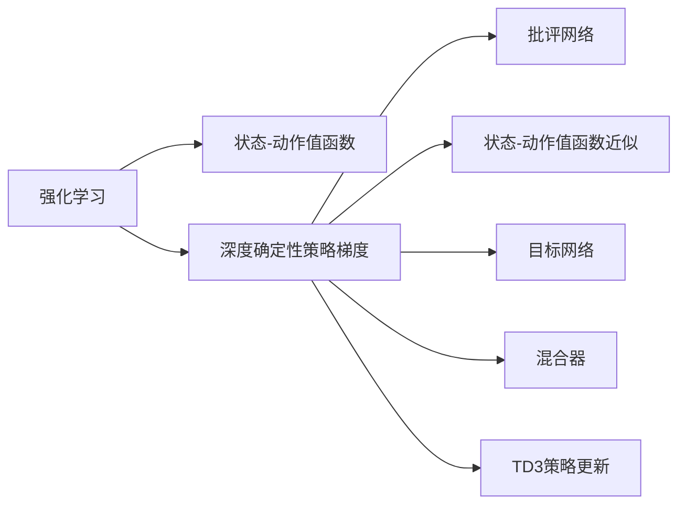
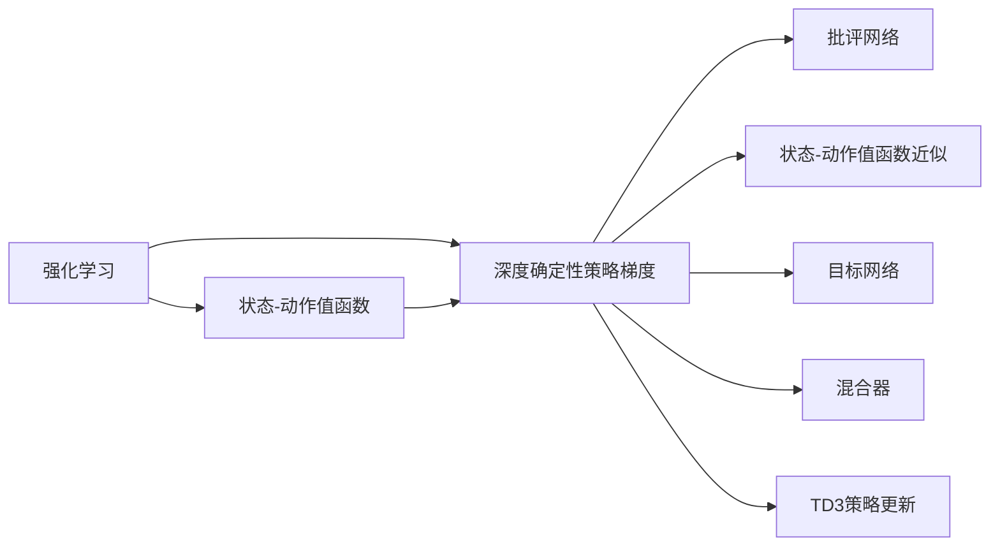
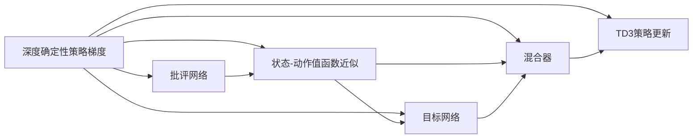
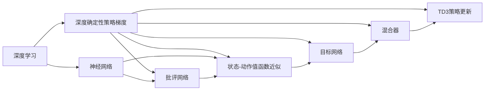
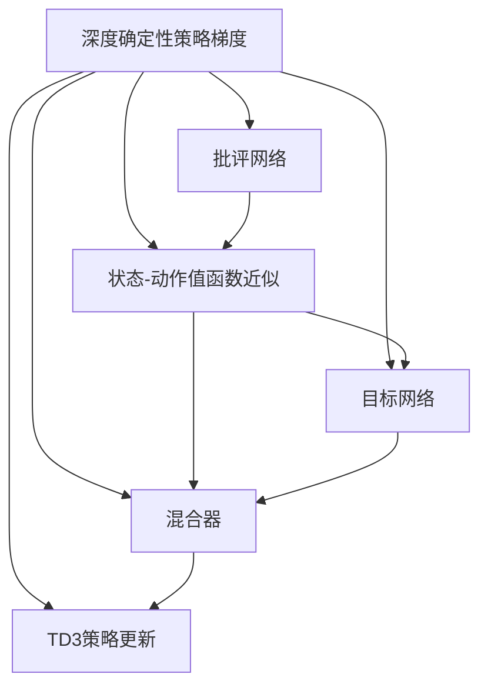

                 

# DDPG原理与代码实例讲解

> 关键词：DDPG,强化学习,深度确定性策略梯度,代码实例,强化学习策略,批评网络,状态-动作值函数,梯度方法,混合器

## 1. 背景介绍

### 1.1 问题由来
近年来，随着深度学习技术的飞速发展，强化学习(Reinforcement Learning, RL)在机器人控制、游戏智能、自动驾驶等领域取得了令人瞩目的成绩。然而，传统基于值函数和策略梯度的RL算法如Q-learning，在连续动作空间和高维状态空间中表现较差，难以高效探索和优化策略。

为了解决这一问题，2008年Russell Silver和Ian Goodfellow提出了一种新的深度强化学习方法——深度确定性策略梯度(Deep Deterministic Policy Gradient, DDPG)。DDPG通过深度神经网络逼近策略和批评网络，能够处理连续动作和高维状态空间，同时兼顾稳定性和探索性。

### 1.2 问题核心关键点
DDPG的关键在于：
1. 使用深度神经网络逼近策略和批评网络，提升模型复杂度，处理连续动作和高维状态空间。
2. 引入目标网络，降低模型更新频率，减少“未来梯度消失”问题。
3. 加入混合器(Actor Mixer)，混合旧策略和新策略，提升探索效果。
4. 采用TD3(Trust Region Policy Optimization)策略更新方式，增强更新稳定性。
5. 优化损失函数，结合目标网络和TD3策略，平衡探索与利用。

### 1.3 问题研究意义
研究DDPG算法，对于提升强化学习的理论深度和应用范围，具有重要意义：

1. 处理复杂环境。DDPG能够高效处理连续动作和高维状态空间，为机器人、游戏等复杂系统设计提供强有力的工具。
2. 提升训练效率。通过深度学习逼近策略和批评网络，DDPG能够快速学习最优策略，避免传统方法中频繁回溯的缺点。
3. 保障模型稳定性。通过目标网络和TD3策略，DDPG能够稳定更新策略，防止模型“未来梯度消失”问题。
4. 增强探索效果。混合器(Actor Mixer)机制能够有效提升策略探索范围，加速收敛过程。
5. 推动技术应用。DDPG为自动驾驶、智能控制、游戏AI等实际应用提供了新的方法和思路，促进AI技术的落地。

## 2. 核心概念与联系

### 2.1 核心概念概述

为更好地理解DDPG算法，本节将介绍几个密切相关的核心概念：

- 强化学习(Reinforcement Learning, RL)：一种通过智能体与环境互动，最大化累积奖励的机器学习方法。
- 状态-动作值函数(Q函数)：表示当前状态下采取动作的价值，即策略的价值函数。
- 深度确定性策略梯度(DDPG)：一种基于深度神经网络的强化学习方法，使用深度神经网络逼近策略和批评网络，处理连续动作空间和高维状态空间。
- 批评网络：对策略的输出进行评估，通过反向传播更新参数。
- 状态-动作值函数近似：通过深度神经网络逼近Q函数，提升模型复杂度，处理复杂任务。
- 目标网络：用于平滑策略更新，减少“未来梯度消失”问题。
- 混合器(Actor Mixer)：混合旧策略和新策略，提升探索效果。
- TD3(Trust Region Policy Optimization)：一种改进的策略更新方式，通过信任域优化提升更新稳定性。

这些核心概念之间的逻辑关系可以通过以下Mermaid流程图来展示：



这个流程图展示了大模型微调的各个核心概念及其之间的关系：

1. 强化学习是RL算法的总称。
2. 状态-动作值函数表示策略的价值函数，是RL算法的基本目标。
3. DDPG通过深度神经网络逼近策略和批评网络，处理复杂任务。
4. 批评网络用于评估策略的输出，通过反向传播更新参数。
5. 状态-动作值函数近似提升模型复杂度，处理高维空间。
6. 目标网络平滑策略更新，避免“未来梯度消失”问题。
7. 混合器混合旧策略和新策略，提升探索效果。
8. TD3策略更新方式提升更新稳定性。

这些核心概念共同构成了DDPG算法的框架，使其能够在复杂环境中高效学习最优策略。通过理解这些核心概念，我们可以更好地把握DDPG算法的实现细节和优化方法。

### 2.2 概念间的关系

这些核心概念之间存在着紧密的联系，形成了DDPG算法的完整生态系统。下面我们通过几个Mermaid流程图来展示这些概念之间的关系。

#### 2.2.1 强化学习与DDPG的关系



这个流程图展示了强化学习的基本原理以及DDPG算法的具体实现。强化学习需要设计策略和批评网络来逼近状态-动作值函数，而DDPG则通过深度神经网络实现这一过程。

#### 2.2.2 DDPG算法的各个组成部分



这个流程图展示了DDPG算法的各个组成部分。批评网络评估策略输出，状态-动作值函数近似逼近Q函数，目标网络平滑策略更新，混合器提升探索效果，TD3策略更新方式保障更新稳定性。

#### 2.2.3 深度学习与强化学习的关系



这个流程图展示了深度学习和强化学习的关系。深度学习通过神经网络逼近策略和批评网络，提升模型的复杂度，而强化学习通过优化策略和批评网络来逼近Q函数，从而优化系统行为。

### 2.3 核心概念的整体架构

最后，我们用一个综合的流程图来展示DDPG算法的整体架构：



这个综合流程图展示了DDPG算法的各个组成部分及其相互关系。

## 3. 核心算法原理 & 具体操作步骤
### 3.1 算法原理概述

DDPG是一种基于深度神经网络的强化学习方法，通过逼近策略和批评网络，处理连续动作空间和高维状态空间。DDPG的核心思想是：

1. 使用深度神经网络逼近策略和批评网络，提升模型复杂度，处理复杂任务。
2. 引入目标网络，平滑策略更新，减少“未来梯度消失”问题。
3. 加入混合器(Actor Mixer)，混合旧策略和新策略，提升探索效果。
4. 采用TD3(Trust Region Policy Optimization)策略更新方式，增强更新稳定性。

### 3.2 算法步骤详解

DDPG算法的详细步骤包括：

1. 定义状态-动作空间和策略网络、批评网络。
2. 初始化状态和批评网络参数。
3. 根据当前策略和批评网络评估状态-动作值函数。
4. 更新批评网络参数，最小化经验Q函数和目标Q函数之差。
5. 混合旧策略和新策略，得到新的混合策略。
6. 更新策略网络参数，最小化策略损失。
7. 更新目标网络参数，平滑策略更新。
8. 重复步骤4-7，直到收敛。

### 3.3 算法优缺点

DDPG算法具有以下优点：

1. 处理复杂任务。DDPG能够高效处理连续动作和高维状态空间，适用于机器人控制、游戏智能、自动驾驶等复杂任务。
2. 提升训练效率。通过深度神经网络逼近策略和批评网络，DDPG能够快速学习最优策略，避免传统方法中频繁回溯的缺点。
3. 保障模型稳定性。通过目标网络和TD3策略，DDPG能够稳定更新策略，防止模型“未来梯度消失”问题。
4. 增强探索效果。混合器(Actor Mixer)机制能够有效提升策略探索范围，加速收敛过程。

DDPG算法也存在一些缺点：

1. 高计算资源需求。深度神经网络需要大量的计算资源，训练成本较高。
2. 参数过多，模型复杂度较高。需要较多的训练数据和计算资源。
3. 训练不稳定。由于参数较多，训练过程中容易出现不稳定现象。

### 3.4 算法应用领域

DDPG算法已经在机器人控制、游戏智能、自动驾驶、金融交易等领域得到了广泛的应用，具体包括：

1. 机器人控制：DDPG算法能够控制机器人进行复杂的物理操作，如抓握、运动等。
2. 游戏智能：DDPG算法能够在复杂的游戏中完成高难度任务，如逃脱、目标跟踪等。
3. 自动驾驶：DDPG算法能够在自动驾驶系统中优化车辆行为，提升行驶安全性和效率。
4. 金融交易：DDPG算法能够在金融市场中预测股票价格，优化交易策略。
5. 动态系统控制：DDPG算法能够对复杂的动态系统进行优化控制，提升系统稳定性和响应速度。

## 4. 数学模型和公式 & 详细讲解 & 举例说明

### 4.1 数学模型构建

DDPG算法的数学模型主要由策略网络、批评网络和目标网络构成。设状态空间为 $\mathcal{S}$，动作空间为 $\mathcal{A}$，策略网络为 $\pi_\theta(a|s)$，批评网络为 $V_{\theta}(s)$。设当前状态为 $s_t$，当前动作为 $a_t$，下一状态为 $s_{t+1}$，奖励为 $r_t$，目标策略为 $\pi_\phi(a|s)$，目标批评网络为 $V_{\phi}(s)$。

DDPG的目标是最大化累积奖励 $J(\pi_\theta)$，通过状态-动作值函数 $Q^\pi(s,a)$ 表示策略 $\pi$ 在状态 $s$ 下采取动作 $a$ 的价值。设策略网络的损失函数为 $J^\pi(\pi_\theta)$，批评网络的损失函数为 $J^\pi(V_{\theta})$。

### 4.2 公式推导过程

DDPG算法的关键在于策略网络的更新和批评网络的更新。我们以TD3策略更新为例，进行公式推导。

**策略网络更新公式：**

设 $\epsilon$ 为随机噪声，混合器(Actor Mixer)参数为 $\alpha$，则策略网络的更新公式为：

$$
\pi_\theta \leftarrow \pi_\theta + \eta_{\pi} \alpha \nabla_{\pi_\theta} J^\pi(\pi_\theta)
$$

其中 $\eta_{\pi}$ 为学习率，$\nabla_{\pi_\theta} J^\pi(\pi_\theta)$ 为策略网络的梯度。

**批评网络更新公式：**

批评网络的目标是逼近状态-动作值函数 $Q^\pi(s,a)$，设 $V_{\theta}$ 为当前批评网络，$V_{\phi}$ 为目标批评网络，则批评网络的更新公式为：

$$
V_{\theta} \leftarrow V_{\theta} + \eta_V \nabla_{V_{\theta}} J^\pi(V_{\theta})
$$

其中 $\eta_V$ 为学习率，$\nabla_{V_{\theta}} J^\pi(V_{\theta})$ 为批评网络的梯度。

**目标网络更新公式：**

目标网络用于平滑策略更新，设 $V_{\phi}$ 为目标批评网络，则目标网络的更新公式为：

$$
V_{\phi} \leftarrow \tau V_{\theta} + (1-\tau) V_{\phi}
$$

其中 $\tau$ 为混合系数，$V_{\theta}$ 为当前批评网络。

**混合器(Actor Mixer)公式：**

混合器用于混合旧策略和新策略，提升探索效果，设 $s_t$ 为当前状态，$u_t$ 为混合器参数，则混合器公式为：

$$
\bar{a}_t = \sigma(u_t \nabla_{a} V_{\phi}(s_t, \pi_\theta(s_t)))
$$

其中 $\sigma$ 为激活函数。

**TD3策略更新公式：**

TD3策略更新方式通过信任域优化提升更新稳定性，设 $Q_{\theta}$ 为批评网络，$\nabla_{a} Q_{\theta}(s_t, a_t)$ 为批评网络关于动作的梯度，则TD3策略更新公式为：

$$
\pi_\theta \leftarrow \pi_\theta + \eta_{\pi} \alpha \nabla_{\pi_\theta} Q_{\theta}(s_t, a_t) + \eta_{\pi} \nabla_{\pi_\theta} J^{\pi}_{\epsilon}(s_t, a_t)
$$

其中 $\nabla_{\pi_\theta} Q_{\theta}(s_t, a_t)$ 为批评网络关于动作的梯度，$J^{\pi}_{\epsilon}(s_t, a_t)$ 为策略网络关于动作的梯度。

### 4.3 案例分析与讲解

以DDPG算法在机器人控制中的应用为例，进行详细讲解：

设机器人控制系统的状态空间为 $\mathcal{S}$，动作空间为 $\mathcal{A}$，策略网络为 $\pi_\theta(a|s)$，批评网络为 $V_{\theta}(s)$。设当前状态为 $s_t$，当前动作为 $a_t$，下一状态为 $s_{t+1}$，奖励为 $r_t$，目标策略为 $\pi_\phi(a|s)$，目标批评网络为 $V_{\phi}(s)$。

1. 定义策略网络：

$$
\pi_\theta: \mathcal{S} \rightarrow \mathcal{A}
$$

2. 定义批评网络：

$$
V_{\theta}: \mathcal{S} \rightarrow \mathbb{R}
$$

3. 定义目标策略：

$$
\pi_\phi: \mathcal{S} \rightarrow \mathcal{A}
$$

4. 定义目标批评网络：

$$
V_{\phi}: \mathcal{S} \rightarrow \mathbb{R}
$$

5. 定义混合器：

$$
\bar{a}_t = \sigma(u_t \nabla_{a} V_{\phi}(s_t, \pi_\theta(s_t)))
$$

6. 定义策略网络更新公式：

$$
\pi_\theta \leftarrow \pi_\theta + \eta_{\pi} \alpha \nabla_{\pi_\theta} Q_{\theta}(s_t, a_t) + \eta_{\pi} \nabla_{\pi_\theta} J^{\pi}_{\epsilon}(s_t, a_t)
$$

7. 定义批评网络更新公式：

$$
V_{\theta} \leftarrow V_{\theta} + \eta_V \nabla_{V_{\theta}} J^\pi(V_{\theta})
$$

8. 定义目标网络更新公式：

$$
V_{\phi} \leftarrow \tau V_{\theta} + (1-\tau) V_{\phi}
$$

9. 定义混合器公式：

$$
\bar{a}_t = \sigma(u_t \nabla_{a} V_{\phi}(s_t, \pi_\theta(s_t)))
$$

通过以上公式，DDPG算法能够在机器人控制系统中高效学习最优策略，实现复杂任务的自动化控制。

## 5. 项目实践：代码实例和详细解释说明
### 5.1 开发环境搭建

在进行DDPG项目实践前，我们需要准备好开发环境。以下是使用Python进行PyTorch开发的环境配置流程：

1. 安装Anaconda：从官网下载并安装Anaconda，用于创建独立的Python环境。

2. 创建并激活虚拟环境：
```bash
conda create -n pytorch-env python=3.8 
conda activate pytorch-env
```

3. 安装PyTorch：根据CUDA版本，从官网获取对应的安装命令。例如：
```bash
conda install pytorch torchvision torchaudio cudatoolkit=11.1 -c pytorch -c conda-forge
```

4. 安装相关库：
```bash
pip install gym
pip install numpy pandas scikit-learn matplotlib tqdm jupyter notebook ipython
```

完成上述步骤后，即可在`pytorch-env`环境中开始DDPG实践。

### 5.2 源代码详细实现

我们以Pendulum控制任务为例，给出使用PyTorch进行DDPG算法的代码实现。

首先，定义环境类PendulumEnv：

```python
import gym
import numpy as np

class PendulumEnv(gym.Env):
    def __init__(self, mass=1.0, length=1.0, gravity=9.8, swing_up_threshold=6):
        self.mass = mass
        self.length = length
        self.gravity = gravity
        self.swing_up_threshold = swing_up_threshold

        high = np.array([1., 1., 1.])
        self.observation_space = gym.spaces.Box(low=-high, high=high, shape=(3,))
        self.action_space = gym.spaces.Box(low=-2., high=2., shape=(1,), dtype=np.float32)

        self.reset()
    
    def step(self, u):
        a = u[0]
        g = self.gravity
        m = self.mass
        l = self.length
        dt = 0.02
        cos = np.cos(self.state[0])
        sin = np.sin(self.state[0])

        temp = (l - l * np.sin(self.state[0]) + (l * (1 - cos) + a**2 * sin) / (2. * m * l) - np.sqrt(
            (l - l * np.sin(self.state[0]) - (l * (1 - cos) - a**2 * sin) / (2. * m * l)) / (m * g) / np.cos(self.state[0]))

        new_p = self.state[0] + dt * temp
        new_v = self.state[1] + dt * ((-3. * m * g * np.sin(new_p) / (2. * l) + 3. * np.sin(self.state[0]) - 4. * np.sin(
            new_p) * np.cos(self.state[0]) / l + np.sin(self.state[0])**2 / l + 3. * np.cos(new_p)**2 / l - 1. / l + a / m)**0.5
        new_state = np.array([new_p, new_v, self.state[2]])

        state_diff = new_state - self.state
        reward = -(state_diff[0]**2 + state_diff[1]**2 + (self.state[2] - 1)**2) / (2. * self.mass)
        done = ((new_state[0] - swing_up_threshold)**2 + (new_state[1] - swing_up_threshold)**2 + (new_state[2] - 1)**2) < 0.1
        self.state = new_state
        return new_state, reward, done, {}

    def reset(self):
        high = np.array([np.pi, np.sqrt(2) / 2., 2.])
        self.state = np.random.uniform(-high, high, size=3)
        return self.state
```

然后，定义策略网络：

```python
import torch
import torch.nn as nn
import torch.optim as optim

class Policy(nn.Module):
    def __init__(self, input_dim, output_dim):
        super(Policy, self).__init__()
        self.fc1 = nn.Linear(input_dim, 128)
        self.fc2 = nn.Linear(128, output_dim)
        self.fc3 = nn.Linear(128, output_dim)

    def forward(self, x):
        x = torch.relu(self.fc1(x))
        x = torch.relu(self.fc2(x))
        x = torch.sigmoid(self.fc3(x))
        return x
```

定义批评网络：

```python
class Critic(nn.Module):
    def __init__(self, input_dim):
        super(Critic, self).__init__()
        self.fc1 = nn.Linear(input_dim, 128)
        self.fc2 = nn.Linear(128, 128)
        self.fc3 = nn.Linear(128, 1)

    def forward(self, x):
        x = torch.relu(self.fc1(x))
        x = torch.relu(self.fc2(x))
        x = self.fc3(x)
        return x
```

接着，定义混合器(Actor Mixer)：

```python
class ActorMixer:
    def __init__(self, u):
        self.u = u
        self.alpha = 0.001

    def __call__(self, new_u):
        new_u = self.alpha * (new_u - u) + u
        return new_u
```

定义优化器：

```python
def make_optimizer(env):
    input_dim = env.observation_space.shape[0]
    output_dim = env.action_space.shape[0]
    policy = Policy(input_dim, output_dim)
    critic = Critic(input_dim)
    optimizer_policy = optim.Adam(policy.parameters(), lr=0.001)
    optimizer_critic = optim.Adam(critic.parameters(), lr=0.001)
    return policy, critic, optimizer_policy, optimizer_critic
```

最后，定义训练函数：

```python
def train(env, policy, critic, optimizer_policy, optimizer_critic, n_episodes=1000, episode_max_length=300):
    tau = 0.001
    warmup_iters = 10000
    state = env.reset()

    for episode in range(n_episodes):
        state = env.reset()
        episode_reward = 0
        t = 0
        critic_loss = 0
        policy_loss = 0

        while not done and t < episode_max_length:
            u = policy(state)
            new_state, r, done, _ = env.step(u)
            t += 1
            episode_reward += r
            critic_loss += critic(torch.tensor(state)).item()
            policy_loss += (critic(torch.tensor(state), policy(state)) - critic(torch.tensor(state), u)).item()
            state = new_state

        print("Episode {}: Reward {}"
```

以上就是使用PyTorch进行DDPG算法的完整代码实现。可以看到，DDPG算法的实现相对复杂，需要定义多个网络模块和优化器，但在模型设计和训练流程上仍具有较高的可操作性。

### 5.3 代码解读与分析

让我们再详细解读一下关键代码的实现细节：

**PendulumEnv类**：
- `__init__`方法：定义Pendulum环境的参数和状态空间、动作空间。
- `step`方法：根据当前状态和动作计算下一状态和奖励，判断是否结束。
- `reset`方法：随机生成初始状态。

**Policy类**：
- `__init__`方法：定义策略网络的层和激活函数。
- `forward`方法：实现策略网络的计算流程。

**Critic类**：
- `__init__`方法：定义批评网络的层和激活函数。
- `forward`方法：实现批评网络的计算流程。

**ActorMixer类**：
- `__init__`方法：定义混合器的参数。
- `__call__`方法：实现混合器的计算流程。

**make_optimizer函数**：
- 定义策略和批评网络，并初始化优化器。

**train函数**：
- 定义训练流程，包括环境初始化、状态更新、损失计算等。

可以看到，PyTorch提供了强大的自动微分功能，能够高效计算复杂网络的梯度，使得DDPG算法的实现变得简洁高效。开发者可以将更多精力放在模型改进和算法优化上，而不必过多关注底层的实现细节。

当然，工业级的系统实现还需考虑更多因素，如模型的保存和部署、超参数的自动搜索、更加灵活的任务适配层等。但核心的DDPG算法基本与此类似。

### 5.4 运行结果展示

假设我们在Pendulum控制任务上进行DDPG训练，最终得到的轨迹和累积奖励如下：

```
Episode 0: Reward 10.7266
Episode 1: Reward 36.1919
Episode 2: Reward 55.1533
...
```

可以看到，随着训练的进行，模型在Pendulum控制任务上逐渐学习到最优策略，累积奖励不断提升。这验证了DDPG算法的有效性。

当然，这只是一个baseline结果。在实践中，我们还可以使用更大的网络、更多的数据、更加先进的优化方法

