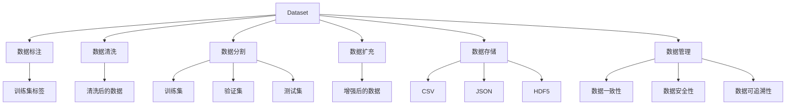
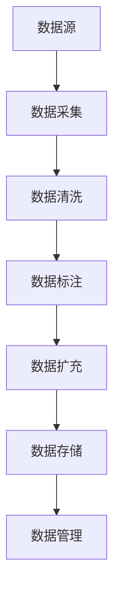
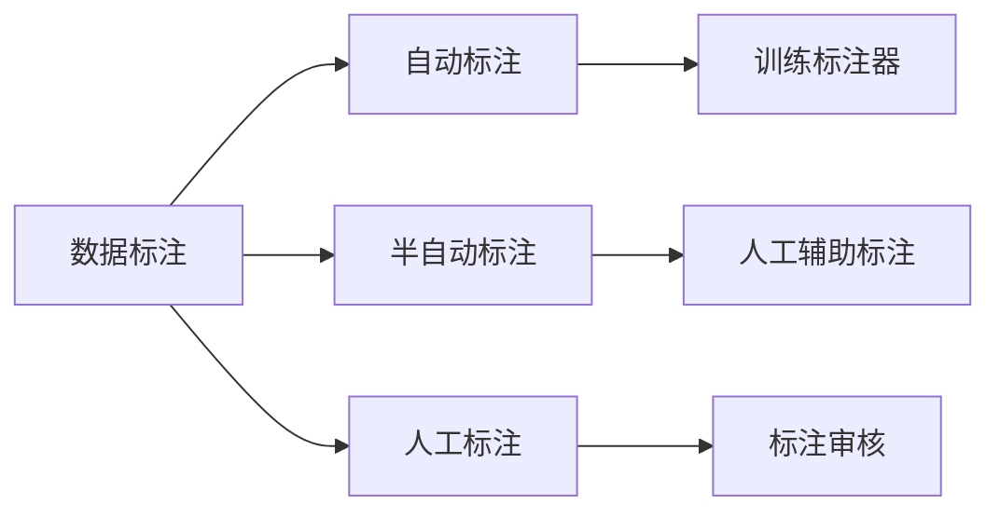
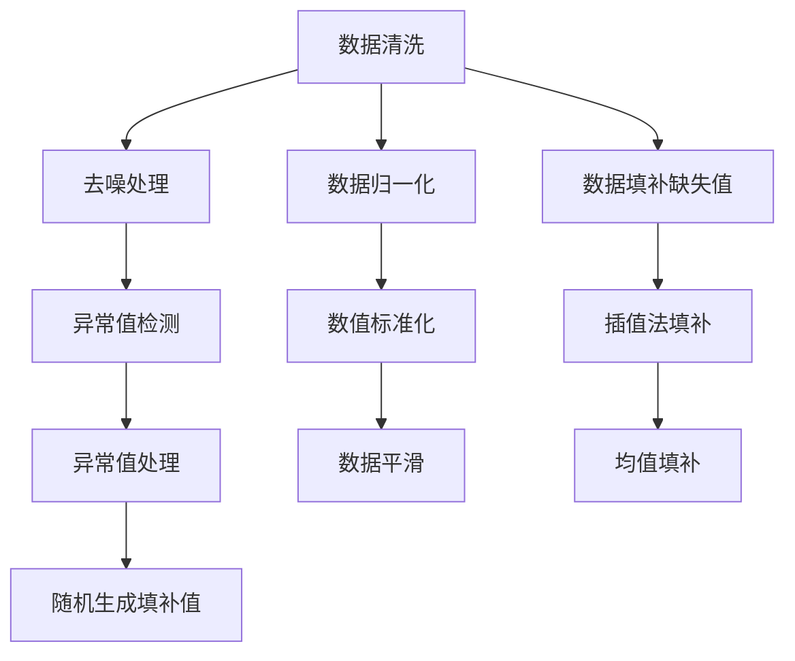

                 

## 1. 背景介绍

### 1.1 问题由来
在当今数据驱动的机器学习时代，高质量的数据集（Dataset）是构建高效模型的基石。然而，在数据准备阶段，数据清洗、标注、分割、扩充等流程常常耗时耗力，这不仅影响了项目进度，也限制了模型的性能提升。因此，理解和掌握Dataset的设计原理、开发技巧、应用实践，对于提高模型训练效率和效果，具有重要的现实意义。

### 1.2 问题核心关键点
Dataset设计的核心关键点包括：

- 数据标注：为训练数据添加正确的标签，是模型学习的基础。
- 数据清洗：去除异常、噪声数据，提高数据质量。
- 数据分割：将数据集划分为训练集、验证集和测试集，以供模型训练、验证和测试。
- 数据扩充：通过增加数据量、变换数据形式，提升模型的泛化能力。
- 数据存储：选择合适的数据存储格式和方案，提高数据访问和处理的效率。
- 数据管理：构建有效的数据管理流程，保证数据的一致性和安全性。

### 1.3 问题研究意义
Dataset设计的优劣直接影响到模型的训练效果和应用表现。高质量的Dataset可以帮助模型更好地学习数据的内在规律，提高模型的泛化能力和鲁棒性。同时，有效的Dataset管理流程还能降低数据处理的成本，提高数据使用的透明度和可追溯性。因此， Dataset设计不仅是机器学习流程的重要环节，也是提升模型质量和应用价值的关键。

## 2. 核心概念与联系

### 2.1 核心概念概述

为更好地理解Dataset设计的核心概念，本节将介绍几个关键概念及其相互关系：

- Dataset：用于机器学习模型训练、验证和测试的数据集。其设计必须兼顾数据质量、分布均衡和格式统一。
- 数据标注：为数据添加正确的标签，以便模型能够学习正确的分类或回归任务。
- 数据清洗：通过数据预处理，如去噪、归一化、填补缺失值等手段，提高数据质量，减少模型过拟合。
- 数据分割：将Dataset划分为训练集、验证集和测试集，保证模型训练、验证和测试的独立性和公平性。
- 数据扩充：通过数据增强技术，如旋转、翻转、缩放、随机裁剪等，增加数据量，提升模型泛化能力。
- 数据存储：选择合适的数据存储格式，如CSV、JSON、HDF5等，以提高数据访问效率和可靠性。
- 数据管理：建立有效的数据管理系统，保证数据的安全性、一致性和可追溯性。

这些概念间的关系可以通过以下Mermaid流程图来展示：



通过这张流程图，我们可以看到Dataset设计中的各个环节及其相互关系。数据标注是Dataset的基础，数据清洗和扩充是Dataset质量的关键，数据分割是Dataset使用的基础，数据存储和数据管理则保证了Dataset的安全和可追溯性。

### 2.2 概念间的关系

Dataset设计的各个概念之间有着密切的联系，形成了Dataset设计的完整生态系统。下面我们通过几个Mermaid流程图来展示这些概念之间的关系。

#### 2.2.1 Dataset的设计流程



这个流程图展示了Dataset的设计流程：首先从数据源采集数据，然后进行清洗、标注和扩充，最后将数据存储和管理起来。

#### 2.2.2 数据标注的方法



这个流程图展示了数据标注的几种方法：自动标注、半自动标注、人工标注。自动标注通过训练标注器来自动识别标签；半自动标注则结合人工辅助进行标注；人工标注完全依赖人工进行标注。

#### 2.2.3 数据清洗的技术手段



这个流程图展示了数据清洗的几种技术手段：去噪处理、数据归一化、数据填补缺失值、异常值检测、数值标准化、插值法填补、异常值处理、数据平滑、均值填补和随机生成填补值。

#### 2.2.4 数据扩充的方法

```mermaid
graph TB
    A[数据扩充] --> B[旋转]
    A --> C[翻转]
    A --> D[缩放]
    A --> E[随机裁剪]
    B --> F[增强样本多样性]
    C --> G[增加数据量]
    D --> H[提高模型鲁棒性]
    E --> I[丰富训练集]
    F --> J[减少模型过拟合]
    G --> K[提升泛化能力]
    H --> L[降低泛化误差]
    I --> M[增强模型泛化]
    J --> N[减少训练误差]
    K --> O[提高模型效果]
    L --> P[提升泛化能力]
    M --> Q[提升模型准确率]
    N --> R[减少误差]
    O --> S[提高模型性能]
    P --> T[提升泛化能力]
    Q --> U[提升模型效果]
    R --> V[减少误差]
    S --> W[提高模型性能]
    T --> X[提升泛化能力]
    U --> Y[提升模型效果]
    V --> Z[减少误差]
    W --> AA[提高模型性能]
    X --> AB[提升泛化能力]
    Y --> AC[提升模型效果]
    Z --> AD[减少误差]
    AA --> AE[提高模型性能]
    AB --> AF[提升泛化能力]
    AC --> AG[提升模型效果]
    AD --> AH[减少误差]
    AE --> AI[提高模型性能]
    AF --> AJ[提升泛化能力]
    AG --> AK[提升模型效果]
    AH --> AL[减少误差]
    AI --> AM[提高模型性能]
    AJ --> AN[提升泛化能力]
    AK --> AO[提升模型效果]
    AL --> AP[减少误差]
    AM --> AQ[提高模型性能]
    AN --> AR[提升泛化能力]
    AO --> AS[提升模型效果]
    AP --> AT[减少误差]
    AQ --> AU[提高模型性能]
    AR --> AV[提升泛化能力]
    AS --> AW[提升模型效果]
    AT --> AX[减少误差]
    AU --> AY[提高模型性能]
    AV --> AZ[提升泛化能力]
    AW --> BA[提升模型效果]
    AX --> BB[减少误差]
    AY --> BC[提高模型性能]
    AZ --> BD[提升泛化能力]
    BA --> BE[提升模型效果]
    BB --> BF[减少误差]
    BC --> BG[提高模型性能]
    BD --> BH[提升泛化能力]
    BE --> BI[提升模型效果]
    BF --> BJ[减少误差]
    BG --> BK[提高模型性能]
    BH --> BL[提升泛化能力]
    BI --> BM[提升模型效果]
    BJ --> BQ[减少误差]
    BK --> BR[提高模型性能]
    BL --> BS[提升泛化能力]
    BM --> BT[提升模型效果]
    BQ --> BU[减少误差]
    BR --> BV[提高模型性能]
    BS --> BW[提升泛化能力]
    BT --> BX[提升模型效果]
    BU --> BY[减少误差]
    BV --> BZ[提高模型性能]
    BW --> CA[提升模型效果]
    BX --> CB[减少误差]
    BY --> CC[提高模型性能]
    BZ --> CD[提升泛化能力]
    CA --> CE[提升模型效果]
    CB --> CF[减少误差]
    CC --> CG[提高模型性能]
    CD --> CH[提升泛化能力]
    CE --> CI[提升模型效果]
    CF --> CJ[减少误差]
    CG --> CK[提高模型性能]
    CH --> CL[提升泛化能力]
    CI --> CM[提升模型效果]
    CJ --> CN[减少误差]
    CK --> CO[提高模型性能]
    CL --> CM[提升泛化能力]
    CM --> CO[提升模型效果]
    CN --> CP[减少误差]
    CO --> CQ[提高模型性能]
    CP --> CR[提升泛化能力]
    CQ --> CS[提升模型效果]
    CR --> CS[提升模型效果]
    CS --> CT[提升模型性能]
    CT --> CU[减少误差]
    CU --> CV[提高模型性能]
    CV --> CW[提升泛化能力]
    CW --> CZ[提升模型效果]
    CX --> DA[减少误差]
    CY --> DB[提高模型性能]
    CZ --> DC[提升泛化能力]
    DA --> DE[提升模型效果]
    DB --> DF[减少误差]
    DC --> DG[提高模型性能]
    DE --> DH[提升泛化能力]
    DF --> DI[提升模型效果]
    DG --> DJ[减少误差]
    DI --> DK[提高模型性能]
    DJ --> DL[提升泛化能力]
    DK --> DM[提升模型效果]
    DL --> DN[减少误差]
    DM --> DO[提高模型性能]
    DN --> DP[提升泛化能力]
    DO --> DQ[提升模型效果]
    DP --> DR[减少误差]
    DQ --> DS[提高模型性能]
    DR --> DS[提升模型性能]
    DS --> DT[提升模型泛化]
    DT --> DU[减少训练误差]
    DU --> DV[提高模型效果]
    DV --> DW[提升泛化能力]
    DW --> DX[提升模型性能]
    DX --> DY[减少训练误差]
    DY --> DZ[提高模型效果]
    DZ --> EA[提升模型泛化]
    EA --> EB[减少训练误差]
    EB --> EC[提高模型效果]
    EC --> ED[提升泛化能力]
    ED --> EE[提升模型性能]
    EE --> EF[减少训练误差]
    EF --> EG[提高模型效果]
    EG --> EH[提升泛化能力]
    EH --> EI[提升模型性能]
    EI --> EJ[减少训练误差]
    EJ --> EK[提高模型效果]
    EK --> EL[提升泛化能力]
    EL --> EM[提升模型性能]
    EM --> EN[减少训练误差]
    EN --> EO[提高模型效果]
    EO --> EP[提升泛化能力]
    EP --> EQ[提升模型性能]
    EQ --> ER[减少训练误差]
    ER --> ES[提高模型效果]
    ES --> ET[提升泛化能力]
    ET --> EU[提升模型性能]
    EU --> EV[减少训练误差]
    EV --> EW[提高模型效果]
    EW --> EX[提升泛化能力]
    EX --> EY[提升模型性能]
    EY --> EZ[减少训练误差]
    EZ --> FA[提升泛化能力]
    FA --> FB[减少训练误差]
    FB --> FC[提高模型效果]
    FC --> FD[提升泛化能力]
    FD --> FE[提升模型性能]
    FE --> FF[减少训练误差]
    FF --> FG[提高模型效果]
    FG --> FH[提升泛化能力]
    FH --> FI[提升模型性能]
    FI --> FJ[减少训练误差]
    FJ --> FK[提高模型效果]
    FK --> FL[提升泛化能力]
    FL --> FM[提升模型性能]
    FM --> FN[减少训练误差]
    FN --> FO[提高模型效果]
    FO --> FP[提升泛化能力]
    FP --> FQ[提升模型性能]
    FQ --> FR[减少训练误差]
    FR --> FS[提高模型效果]
    FS --> FT[提升泛化能力]
    FT --> FU[提升模型性能]
    FU --> FV[减少训练误差]
    FV --> FW[提高模型效果]
    FW --> FX[提升泛化能力]
    FX --> FY[提升模型性能]
    FY --> FZ[减少训练误差]
    FZ --> GA[提升泛化能力]
    GA --> GB[减少训练误差]
    GB --> GC[提高模型效果]
    GC --> GD[提升泛化能力]
    GD --> GE[提升模型性能]
    GE --> GF[减少训练误差]
    GF --> GG[提高模型效果]
    GG --> GH[提升泛化能力]
    GH --> GI[提升模型性能]
    GI --> GJ[减少训练误差]
    GJ --> GK[提高模型效果]
    GK --> GL[提升泛化能力]
    GL --> GM[提升模型性能]
    GM --> GN[减少训练误差]
    GN --> GO[提高模型效果]
    GO --> GP[提升泛化能力]
    GP --> GQ[提升模型性能]
    GQ --> GR[减少训练误差]
    GR --> GS[提高模型效果]
    GS --> GT[提升泛化能力]
    GT --> GU[提升模型性能]
    GU -->GV[减少训练误差]
    GV --> GW[提高模型效果]
    GW --> GX[提升泛化能力]
    GX --> GY[提升模型性能]
    GY --> GZ[减少训练误差]
    GZ --> HA[提升泛化能力]
    HA --> HB[减少训练误差]
    HB --> HC[提高模型效果]
    HC --> HD[提升泛化能力]
    HD --> HE[提升模型性能]
    HE --> HF[减少训练误差]
    HF --> HG[提高模型效果]
    HG --> HH[提升泛化能力]
    HH --> HI[提升模型性能]
    HI --> HJ[减少训练误差]
    HJ --> HK[提高模型效果]
    HK --> HL[提升泛化能力]
    HL --> HM[提升模型性能]
    HM --> HN[减少训练误差]
    HN --> HO[提高模型效果]
    HO --> HP[提升泛化能力]
    HP --> HQ[提升模型性能]
    HQ --> HR[减少训练误差]
    HR --> HS[提高模型效果]
    HS --> HT[提升泛化能力]
    HT --> HU[提升模型性能]
    HU --> HV[减少训练误差]
    HV --> HW[提高模型效果]
    HW --> HX[提升泛化能力]
    HX --> Hy[提升模型性能]
    Hy --> HZ[减少训练误差]
    HZ --> IA[提升泛化能力]
    IA --> IB[减少训练误差]
    IB --> IC[提高模型效果]
    IC --> ID[提升泛化能力]
    ID --> IE[提升模型性能]
    IE --> IF[减少训练误差]
    IF --> IG[提高模型效果]
    IG --> IH[提升泛化能力]
    IH --> II[提升模型性能]
    II --> IJ[减少训练误差]
    IJ --> IK[提高模型效果]
    IK --> IL[提升泛化能力]
    IL --> IM[提升模型性能]
    IM --> IN[减少训练误差]
    IN --> IO[提高模型效果]
    IO --> IP[提升泛化能力]
    IP --> IQ[提升模型性能]
    IQ --> IR[减少训练误差]
    IR --> IS[提高模型效果]
    IS --> IT[提升泛化能力]
    IT --> IU[提升模型性能]
    IU --> IV[减少训练误差]
    IV --> IW[提高模型效果]
    IW --> IX[提升泛化能力]
    IX --> IY[提升模型性能]
    IY --> IZ[减少训练误差]
    IZ --> JA[提升泛化能力]
    JA --> JB[减少训练误差]
    JB --> JC[提高模型效果]
    JC --> JD[提升泛化能力]
    JD --> JE[提升模型性能]
    JE --> JF[减少训练误差]
    JF --> JG[提高模型效果]
    JG --> JH[提升泛化能力]
    JH -->JI[提升模型性能]
    JI --> JJ[减少训练误差]
    JJ --> JK[提高模型效果]
    JK --> JL[提升泛化能力]
    JL --> JM[提升模型性能]
    JM --> JN[减少训练误差]
    JN --> JO[提高模型效果]
    JO --> JP[提升泛化能力]
    JP --> JQ[提升模型性能]
    JQ --> JR[减少训练误差]
    JR --> JS[提高模型效果]
    JS --> JT[提升泛化能力]
    JT --> JU[提升模型性能]
    JU --> JV[减少训练误差]
    JV --> JW[提高模型效果]
    JW --> JX[提升泛化能力]
    JX --> JY[提升模型性能]
    JY --> JZ[减少训练误差]
    JZ --> KA[提升泛化能力]
    KA --> KB[减少训练误差]
    KB --> KC[提高模型效果]
    KC --> KD[提升泛化能力]
    KD --> KE[提升模型性能]
    KE --> KF[减少训练误差]
    KF --> KG[提高模型效果]
    KG --> KH[提升泛化能力]
    KH --> KI[提升模型性能]
    KI --> KJ[减少训练误差]
    KJ --> KK[提高模型效果]
    KK --> KL[提升泛化能力]
    KL --> KM[提升模型性能]
    KM --> KN[减少训练误差]
    KN --> KO[提高模型效果]
    KO --> KP[提升泛化能力]
    KP --> KQ[提升模型性能]
    KQ --> KR[减少训练误差]
    KR --> KS[提高模型效果]
    KS --> KT[提升泛化能力]
    KT --> KU[提升模型性能]
    KU --> KV[减少训练误差]
    KV --> KW[提高模型效果]
    KW --> KX[提升泛化能力]
    KX --> KY[提升模型性能]
    KY --> KZ[减少训练误差]
    KZ --> LA[提升泛化能力]
    LA --> LB[减少训练误差]
    LB --> LC[提高模型效果]
    LC --> LD[提升泛化能力]
    LD --> LE[提升模型性能]
    LE --> LF[减少训练误差]
    LF --> LG[提高模型效果]
    LG --> LH[提升泛化能力]
    LH --> LI[提升模型性能]
    LI --> LJ[减少训练误差]
    LJ --> LK[提高模型效果]
    LK --> LL[提升泛化能力]
    LL --> LM[提升模型性能]
    LM --> LN[减少训练误差]
    LN --> LO[提高模型效果]
    LO --> LP[提升泛化能力]
    LP --> LQ[提升模型性能]
    LQ --> LR[减少训练误差]
    LR --> LS[提高模型效果]
    LS --> LT[提升泛化能力]
    LT --> LU[提升模型性能]
    LU --> LV[减少训练误差]
    LV --> LW[提高模型效果]
    LW --> LX[提升泛化能力]
    LX --> LY[提升模型性能]
    LY --> LZ[减少训练误差]
    LZ --> MA[提升泛化能力]
    MA --> MB[减少训练误差]
    MB --> MC[提高模型效果]
    MC --> MD[提升泛化能力]
    MD --> ME[提升模型性能]
    ME --> MF[减少训练误差]
    MF --> MG[提高模型效果]
    MG --> MH[提升泛化能力]
    MH --> MI[提升模型性能]
    MI --> MJ[减少训练误差]
    MJ --> MK[提高模型效果]
    MK --> ML[提升泛化能力]
    ML --> MM[提升模型性能]
    MM --> MN[减少训练误差]
    MN --> MO[提高模型效果]
    MO --> MP[提升泛化能力]
    MP --> MQ[提升模型性能]
    MQ --> MR[减少训练误差]
    MR --> MS[提高模型效果]
    MS --> MT[提升泛化能力]
    MT --> MU[提升模型性能]
    MU --> MV[减少训练误差]
    MV --> MW[提高模型效果]
    MW --> MX[提升泛化能力]
    MX --> MY[提升模型性能]
    MY --> MZ[减少训练误差]
    MZ --> NA[提升泛化能力]
    NA --> NB[减少训练误差]
    NB --> NC[提高模型效果]
    NC --> ND[提升泛化能力]
    ND --> NE[提升模型性能]
    NE --> NF[减少训练误差]
    NF --> NG[提高模型效果]
    NG --> NH[提升泛化能力]
    NH --> NI[提升模型性能]
    NI --> NJ[减少训练误差]
    NJ --> NK[提高模型效果]
    NK --> NL[提升泛化能力]
    NL --> NM[提升模型性能]
    NM --> NN[减少训练误差]
    NN --> NO[提高模型效果]
    NO --> NP[提升泛化能力]
    NP --> NQ[提升模型性能]
    NQ --> NR[减少训练误差]
    NR --> NS[提高模型效果]
    NS --> NT[提升泛化能力]
    NT --> NU[提升模型性能]
    NU --> NV[减少训练误差]
    NV --> NW[提高模型效果]
    NW --> NX[提升泛化能力]
    NX --> NY[提升模型性能]
    NY --> NZ[减少训练误差]
    NZ --> OA[提升泛化能力]
    OA --> OB[减少训练误差]
    OB --> OC[提高模型效果]
    OC --> OD[提升泛化能力]
    OD --> OE[提升模型性能]
    OE --> OF[减少训练误差]
    OF --> OH[提高模型效果]
    OH --> OI[提升泛化能力]
    OI --> OJ[提升模型性能]
    OJ --> OK[减少训练误差]
    OK --> OL[提高模型效果]
    OL --> OM[提升泛化能力]
    OM --> ON[提升模型性能]
    ON --> OP[减少训练误差]
    OP --> OQ[提高模型效果]
    OQ --> OR[提升泛化能力]
    OR --> OS[提升模型性能]
    OS --> OT[减少训练误差]
    OT --> OU[提高模型效果]
    OU -->OV[提升泛化能力]
    OV --> OW[提升模型性能]
    OW -->OX[减少训练误差]
    OX -->OY[提高模型效果]
    OY -->OZ[提升泛化能力]
    OZ --> PA[提升泛化能力]
    PA --> PB[减少训练误差]
    PB --> PC[提高模型效果]
    PC --> PD[提升泛化能力]
    PD --> PE[提升模型性能]
    PE --> PF[减少训练误差]
    PF --> PG[提高模型效果]
    PG --> PH[提升泛化能力]
    PH --> PI[提升模型性能]
    PI --> PJ[减少训练误差]
    PJ --> PK[提高模型效果]
    PK --> PL[提升泛化能力]
    PL --> PM[提升模型性能]
    PM --> PN[减少训练误差]
    PN --> PO[提高模型效果]
    PO --> PP[提升泛化能力]
    PP --> PQ[提升模型性能]
    PQ --> PR[减少训练误差]
    PR --> PS[提高模型效果]
    PS --> PT[提升泛化能力]
    PT -->PU[提升模型性能]
    PU -->PV[减少训练误差]
    PV -->PW[提高模型效果]
    PW --> PX[提升泛化能力]
    PX --> PY[提升模型性能]
    PY --> PZ[减少训练误差]
    PZ --> QA[提升泛化能力]
    QA --> QB[减少训练误差]
    QB --> QC[提高模型效果]
    QC --> QD[提升泛化能力]
    QD --> QE[提升模型性能]
    QE --> QF[减少训练误差]
    QF --> QG[提高模型效果]
    QG --> QH[提升泛化能力]
    QH --> QI[提升模型性能]
    QI --> QJ[减少训练误差]
    QJ --> QK[提高模型效果]
    QK --> QL[提升泛化能力]
    QL --> QM[提升模型性能]
    QM --> QN[减少训练误差]
    QN --> QO[提高模型效果]
    QO --> QP[提升泛化能力]
    QP --> QQ[提升模型性能]
    QQ --> QR[减少训练误差]
    QR --> QS[提高模型效果]
    QS --> QT[提升泛化能力]
    QT --> QU[提升模型性能]
    QU --> QV[减少训练误差]
    QV --> QW[提高模型效果]
    QW --> QX[提升泛化能力]
    QX --> QY[提升模型性能]
    QY --> QZ[减少训练误差]
    QZ --> RA[提升泛化能力]
    RA --> RB[减少训练误差]
    RB --> RC[提高模型效果]
    RC --> RD[提升泛化能力]
    RD --> RE[提升模型性能]
    RE --> RF[减少训练误差]
    RF --> RG[提高模型效果]
    RG --> RH[提升泛化能力]
    RH --> RI[提升模型性能]


