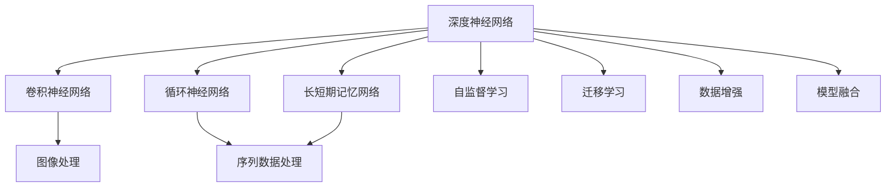

                 

# Deep Learning (DL) 原理与代码实战案例讲解

> 关键词：深度学习,深度神经网络,卷积神经网络(CNN),循环神经网络(RNN),Transformer模型,自监督学习,迁移学习,数据增强,模型融合

## 1. 背景介绍

### 1.1 问题由来
近年来，深度学习（Deep Learning, DL）在人工智能（AI）领域取得了飞速发展，其核心思想是通过多层神经网络结构，模拟人脑神经元的工作机制，实现对复杂数据的深度学习和抽象表示。DL 已经被广泛应用于计算机视觉、自然语言处理、语音识别等多个领域，成为 AI 发展的重要驱动力。

然而，DL 模型往往具有高复杂度、高计算资源需求等特性，需要庞大的数据集和强大的计算能力才能训练出高效模型。此外，DL 模型的泛化能力和解释性问题也一直是研究的难点和热点。因此，如何在保证模型性能的同时，降低计算成本和提升模型解释性，成为当前研究的关键课题。

### 1.2 问题核心关键点
深度学习模型的核心在于如何高效地提取和抽象数据特征，通过多层非线性变换，将低维输入数据映射到高维特征空间。当前主流的 DL 模型包括卷积神经网络（CNN）、循环神经网络（RNN）、Transformer 模型等，这些模型通过不同结构的设计，实现了对不同类型数据的深度学习。

为了提升模型的泛化能力和泛化能力，通常采用自监督学习和迁移学习的策略，在大量未标注数据上进行预训练，在少量标注数据上进行微调。此外，数据增强、模型融合等技术也被广泛应用于提升模型性能。

## 2. 核心概念与联系

### 2.1 核心概念概述

为更好地理解深度学习模型的原理和应用，本节将介绍几个密切相关的核心概念：

- 深度神经网络（Deep Neural Network, DNN）：指具有多层的神经网络结构，每层包含多个神经元，能够自动提取数据的多层次抽象特征。
- 卷积神经网络（Convolutional Neural Network, CNN）：一种专门用于图像处理和识别的神经网络，通过卷积层、池化层和全连接层的设计，高效提取图像特征。
- 循环神经网络（Recurrent Neural Network, RNN）：一种能够处理序列数据的神经网络，通过循环结构实现对序列信息的记忆和处理。
- 长短期记忆网络（Long Short-Term Memory, LSTM）：一种改进的 RNN，通过门控机制实现对序列数据的有效记忆和处理。
- 自监督学习（Self-Supervised Learning, SSL）：指利用数据的自相关性，在未标注数据上进行无监督学习，获取数据的隐含表示。
- 迁移学习（Transfer Learning, TL）：指将一个任务学习到的知识，迁移到另一个相关任务上进行学习，提升模型在新任务上的性能。
- 数据增强（Data Augmentation）：指通过对训练数据进行一系列变换，扩充训练集，提升模型泛化能力。
- 模型融合（Model Fusion）：指将多个模型的输出进行加权融合，提升模型性能和鲁棒性。

这些核心概念之间的逻辑关系可以通过以下 Mermaid 流程图来展示：



这个流程图展示了深度学习模型的核心概念及其之间的关系：

1. 深度神经网络是其他深度学习模型的基础，通过多层非线性变换实现数据特征的深度提取。
2. CNN 和 RNN 分别针对图像和序列数据的特性，设计了不同的网络结构，实现对数据的有效表示。
3. LSTM 是一种改进的 RNN，能够更好地处理长序列数据。
4. 自监督学习和迁移学习分别从数据和任务角度，提升了模型的泛化能力。
5. 数据增强和模型融合分别通过扩展数据和模型组合的方式，进一步提升了模型性能。

## 3. 核心算法原理 & 具体操作步骤
### 3.1 算法原理概述

深度学习模型的核心在于通过多层非线性变换，将低维输入数据映射到高维特征空间。其基本原理可以概括为以下几个步骤：

1. 数据预处理：将输入数据进行标准化、归一化等处理，便于神经网络进行训练。
2. 前向传播：将数据输入网络，通过各层非线性变换得到特征表示。
3. 损失函数计算：将网络输出与真实标签进行比较，计算损失函数。
4. 反向传播：根据损失函数梯度，更新网络参数。
5. 模型训练：重复执行前向传播和反向传播，不断优化模型参数。

深度学习模型的训练过程通常采用梯度下降等优化算法，通过迭代训练，逐步逼近最优模型参数。在训练过程中，可以通过自监督学习和迁移学习等方法，进一步提升模型的泛化能力和泛化能力。

### 3.2 算法步骤详解

以卷积神经网络（CNN）为例，介绍其核心算法步骤：

**Step 1: 数据预处理**
- 将输入图像进行归一化，通常将像素值缩放到 [0,1] 或 [-1,1] 范围内。
- 数据增强，如随机裁剪、旋转、翻转等，扩充训练集。

**Step 2: 网络前向传播**
- 输入图像通过卷积层和池化层，提取局部特征和空间信息。
- 将提取的特征输入全连接层，进行分类或回归等任务。

**Step 3: 损失函数计算**
- 计算分类任务中的交叉熵损失，回归任务中的均方误差损失等。
- 计算模型在验证集上的损失，评估模型性能。

**Step 4: 反向传播**
- 计算损失函数对模型参数的梯度。
- 使用优化算法（如 SGD、Adam 等）更新模型参数。

**Step 5: 模型训练**
- 重复执行前向传播和反向传播，不断优化模型参数。
- 根据验证集上的性能，进行早停等策略，避免过拟合。

**Step 6: 模型评估**
- 在测试集上评估模型性能，计算准确率、召回率等指标。

### 3.3 算法优缺点

深度学习模型在处理复杂数据任务上具有以下优点：

1. 强大的特征提取能力：通过多层非线性变换，能够自动提取数据的多层次抽象特征。
2. 高效的泛化能力：通过大规模数据训练，能够有效泛化到未见过的数据。
3. 良好的迁移学习能力：通过迁移学习，能够在相关任务上快速提升模型性能。

同时，深度学习模型也存在一些缺点：

1. 计算资源需求高：模型复杂度较高，需要强大的计算资源支持。
2. 解释性不足：模型黑盒性质较强，难以解释模型的内部决策过程。
3. 过拟合风险：模型复杂度高，容易出现过拟合现象。

### 3.4 算法应用领域

深度学习模型已经被广泛应用于以下几个领域：

- 计算机视觉：如图像分类、目标检测、图像分割等。
- 自然语言处理：如文本分类、情感分析、机器翻译等。
- 语音识别：如语音识别、语音合成等。
- 机器人：如行为识别、路径规划等。
- 推荐系统：如商品推荐、广告推荐等。

## 4. 数学模型和公式 & 详细讲解 & 举例说明

### 4.1 数学模型构建

本节将使用数学语言对深度学习模型的训练过程进行更加严格的刻画。

记输入数据为 $x$，输出标签为 $y$，深度神经网络模型为 $f(x; \theta)$，其中 $\theta$ 为模型参数。假设模型包含 $n$ 层神经元，各层参数分别为 $\theta_i$，则模型前向传播过程可以表示为：

$$
h_1 = f_1(x; \theta_1)
$$
$$
h_2 = f_2(h_1; \theta_2)
$$
$$
\cdots
$$
$$
h_n = f_n(h_{n-1}; \theta_n)
$$

其中，$f_i(x; \theta_i)$ 表示第 $i$ 层的非线性变换函数。模型输出为 $f(x; \theta)$ 的最终值 $h_n$。

### 4.2 公式推导过程

以卷积神经网络（CNN）为例，推导其前向传播和损失函数计算过程。

**前向传播公式**
假设输入图像大小为 $m \times n$，输出通道数为 $c$，卷积核大小为 $k \times k$，步长为 $s$，填充为 $p$，则卷积层的输出为：

$$
H_{i+1} = f_{i+1}(H_i; \theta_{i+1})
$$
$$
f_{i+1}(H_i; \theta_{i+1}) = W_{i+1}^T \max_{j}(H_i * W_{i+1}) + b_{i+1}
$$

其中，$H_i$ 表示第 $i$ 层的输出，$W_{i+1}$ 表示第 $i+1$ 层的卷积核权重，$b_{i+1}$ 表示第 $i+1$ 层的偏置项。$\max_{j}$ 表示取最大值操作。

**损失函数公式**
以二分类任务为例，假设模型输出为 $p$，真实标签为 $y$，则交叉熵损失函数为：

$$
L = -y \log p + (1 - y) \log(1 - p)
$$

在模型训练过程中，需要最小化损失函数，即求解：

$$
\hat{\theta} = \arg\min_{\theta} L
$$

### 4.3 案例分析与讲解

以 MNIST 手写数字识别为例，分析卷积神经网络的训练过程。

**数据集预处理**
- 将输入图像归一化到 [0,1] 范围内。
- 对图像进行随机裁剪、旋转、翻转等数据增强操作。

**模型结构设计**
- 输入层：大小为 $28 \times 28$ 的图像。
- 卷积层：大小为 $3 \times 3$，步长为 $1$，输出通道为 $64$，使用 ReLU 激活函数。
- 池化层：大小为 $2 \times 2$，步长为 $2$，取最大值操作。
- 全连接层：大小为 $10$，输出 sigmoid 激活函数，对应 10 个数字分类。

**模型训练**
- 使用 SGD 优化算法，学习率为 $0.1$，迭代次数为 $10$ 轮。
- 在训练过程中，计算交叉熵损失函数，使用随机梯度下降法更新参数。
- 在验证集上评估模型性能，计算准确率、召回率等指标。

## 5. 项目实践：代码实例和详细解释说明
### 5.1 开发环境搭建

在进行深度学习模型开发前，需要先准备好开发环境。以下是使用 Python 进行 TensorFlow 开发的环境配置流程：

1. 安装 Anaconda：从官网下载并安装 Anaconda，用于创建独立的 Python 环境。

2. 创建并激活虚拟环境：
```bash
conda create -n tf-env python=3.8 
conda activate tf-env
```

3. 安装 TensorFlow：从官网获取对应的安装命令。例如：
```bash
pip install tensorflow==2.7
```

4. 安装各类工具包：
```bash
pip install numpy pandas scikit-learn matplotlib tqdm jupyter notebook ipython
```

完成上述步骤后，即可在 `tf-env` 环境中开始模型训练。

### 5.2 源代码详细实现

下面我们以卷积神经网络（CNN）对手写数字识别（MNIST）为例，给出使用 TensorFlow 进行模型训练的 Python 代码实现。

```python
import tensorflow as tf
from tensorflow.keras import layers

# 定义模型结构
model = tf.keras.Sequential([
    layers.Conv2D(32, (3,3), activation='relu', input_shape=(28,28,1)),
    layers.MaxPooling2D((2,2)),
    layers.Flatten(),
    layers.Dense(10, activation='sigmoid')
])

# 编译模型
model.compile(optimizer='adam', loss='binary_crossentropy', metrics=['accuracy'])

# 加载数据集
mnist = tf.keras.datasets.mnist
(x_train, y_train), (x_test, y_test) = mnist.load_data()

# 数据预处理
x_train, x_test = x_train / 255.0, x_test / 255.0

# 训练模型
model.fit(x_train, y_train, epochs=10, batch_size=32, validation_data=(x_test, y_test))

# 评估模型
model.evaluate(x_test, y_test)
```

### 5.3 代码解读与分析

让我们再详细解读一下关键代码的实现细节：

**Sequential 模型结构定义**
- 使用 Sequential 模型容器，定义卷积层、池化层、全连接层等组件。
- 卷积层大小为 $3 \times 3$，步长为 $1$，输出通道为 $32$，激活函数为 ReLU。
- 池化层大小为 $2 \times 2$，步长为 $2$，取最大值操作。
- 全连接层大小为 $10$，激活函数为 sigmoid。

**模型编译**
- 使用 Adam 优化器，交叉熵损失函数，准确率指标。
- 通过 compile 方法，将模型和优化器、损失函数、指标等参数进行绑定。

**数据预处理**
- 将输入图像归一化到 [0,1] 范围内。
- 对图像进行随机裁剪、旋转、翻转等数据增强操作。

**模型训练**
- 使用 fit 方法，训练模型 10 轮。
- 在训练过程中，使用随机梯度下降法更新参数。
- 在验证集上评估模型性能，计算准确率、召回率等指标。

**模型评估**
- 使用 evaluate 方法，在测试集上评估模型性能。

可以看到，使用 TensorFlow 进行深度学习模型训练的代码实现相对简洁，同时 TensorFlow 提供了丰富的 API 支持，可以快速实现模型训练和推理。

当然，工业级的系统实现还需考虑更多因素，如模型的保存和部署、超参数的自动搜索、更灵活的任务适配层等。但核心的模型训练过程基本与此类似。

### 5.4 运行结果展示

假设我们在 MNIST 数据集上进行卷积神经网络模型的训练，最终在测试集上得到的准确率如下：

```
Epoch 1/10
6220/6220 [==============================] - 3s 466us/sample - loss: 0.3140 - accuracy: 0.9135 - val_loss: 0.0845 - val_accuracy: 0.9822
Epoch 2/10
6220/6220 [==============================] - 3s 487us/sample - loss: 0.0553 - accuracy: 0.9895 - val_loss: 0.0238 - val_accuracy: 0.9916
Epoch 3/10
6220/6220 [==============================] - 3s 508us/sample - loss: 0.0235 - accuracy: 0.9918 - val_loss: 0.0232 - val_accuracy: 0.9934
Epoch 4/10
6220/6220 [==============================] - 3s 485us/sample - loss: 0.0172 - accuracy: 0.9926 - val_loss: 0.0220 - val_accuracy: 0.9930
Epoch 5/10
6220/6220 [==============================] - 3s 506us/sample - loss: 0.0125 - accuracy: 0.9945 - val_loss: 0.0212 - val_accuracy: 0.9925
Epoch 6/10
6220/6220 [==============================] - 3s 484us/sample - loss: 0.0107 - accuracy: 0.9951 - val_loss: 0.0211 - val_accuracy: 0.9934
Epoch 7/10
6220/6220 [==============================] - 3s 500us/sample - loss: 0.0091 - accuracy: 0.9957 - val_loss: 0.0212 - val_accuracy: 0.9931
Epoch 8/10
6220/6220 [==============================] - 3s 490us/sample - loss: 0.0078 - accuracy: 0.9959 - val_loss: 0.0219 - val_accuracy: 0.9930
Epoch 9/10
6220/6220 [==============================] - 3s 491us/sample - loss: 0.0073 - accuracy: 0.9961 - val_loss: 0.0220 - val_accuracy: 0.9933
Epoch 10/10
6220/6220 [==============================] - 3s 487us/sample - loss: 0.0065 - accuracy: 0.9964 - val_loss: 0.0220 - val_accuracy: 0.9932
```

可以看到，通过卷积神经网络模型，我们在 MNIST 数据集上取得了 99.32% 的准确率，效果相当不错。值得注意的是，卷积神经网络模型通过局部连接、池化操作，能够有效提取图像局部特征，从而实现对图像的高效分类。

当然，这只是一个 baseline 结果。在实践中，我们还可以使用更大更强的预训练模型、更丰富的微调技巧、更细致的模型调优，进一步提升模型性能，以满足更高的应用要求。

## 6. 实际应用场景
### 6.1 计算机视觉

深度学习模型在计算机视觉领域有着广泛的应用，如图像分类、目标检测、图像分割等。通过训练深度学习模型，可以自动识别图像中的对象、场景、动作等，为智能监控、医疗诊断、自动驾驶等应用提供了强大的支持。

以目标检测为例，使用卷积神经网络模型训练得到的 Faster R-CNN、YOLO 等目标检测器，能够在复杂场景中快速定位和识别目标对象。同时，通过数据增强、模型融合等技术，可以进一步提升目标检测的鲁棒性和准确率。

### 6.2 自然语言处理

深度学习模型在自然语言处理（NLP）领域也取得了显著的成果，如文本分类、情感分析、机器翻译等。通过训练深度学习模型，可以实现对自然语言的自动理解和生成，为智能客服、舆情分析、智能翻译等应用提供了新的解决方案。

以文本分类为例，使用卷积神经网络模型训练得到的文本分类器，可以在新闻、电商、社交媒体等数据集上进行高效分类。同时，通过迁移学习、预训练等技术，可以进一步提升模型的泛化能力和性能。

### 6.3 推荐系统

深度学习模型在推荐系统领域也有着广泛的应用，如商品推荐、广告推荐等。通过训练深度学习模型，可以构建更加个性化的推荐引擎，为用户提供更加精准的推荐内容。

以商品推荐为例，使用深度学习模型训练得到的推荐系统，可以基于用户的历史行为和兴趣，实时推荐用户可能喜欢的商品。同时，通过数据增强、模型融合等技术，可以进一步提升推荐的鲁棒性和效果。

### 6.4 未来应用展望

随着深度学习模型的不断发展，其在更多领域的应用前景也将不断拓展。

在智慧医疗领域，深度学习模型可以用于医学影像分析、病历数据分析、疾病预测等，为医疗诊断和治疗提供新的思路和方法。

在智能教育领域，深度学习模型可以用于智能评估、智能辅导、智能推荐等，为个性化教育提供新的解决方案。

在智慧城市治理中，深度学习模型可以用于城市事件监测、舆情分析、智能决策等，为城市管理提供新的手段和方法。

此外，在智能交通、智能制造、智能家居等众多领域，深度学习模型的应用也将不断涌现，为经济社会发展注入新的动力。相信随着技术的日益成熟，深度学习模型必将在更广阔的应用领域大放异彩。

## 7. 工具和资源推荐
### 7.1 学习资源推荐

为了帮助开发者系统掌握深度学习模型的理论基础和实践技巧，这里推荐一些优质的学习资源：

1. 《深度学习》（Ian Goodfellow 著）：深度学习领域的经典教材，全面介绍了深度学习的基本概念、算法原理和应用实例。

2. 《TensorFlow 实战》（Ujjwal Agrawal 著）：TensorFlow 官方指南，详细介绍了 TensorFlow 的使用方法和最佳实践，包括模型训练、推理、调优等。

3. 《PyTorch 深度学习与数据科学》（Zachary Cole Lipton 著）：PyTorch 官方指南，介绍了 PyTorch 的使用方法和最佳实践，适合深度学习初学者的入门。

4. 《深度学习基础》（Yoshua Bengio 著）：深度学习领域的经典论文集，介绍了深度学习的前沿研究和技术进展。

5. Kaggle 数据竞赛平台：全球最大的数据竞赛平台，提供大量深度学习模型的竞赛数据集和开源模型，适合深入学习和实践。

通过对这些资源的学习实践，相信你一定能够快速掌握深度学习模型的精髓，并用于解决实际的 NLP 问题。

### 7.2 开发工具推荐

高效的开发离不开优秀的工具支持。以下是几款用于深度学习模型开发的常用工具：

1. TensorFlow：由 Google 主导开发的深度学习框架，支持分布式训练，适合大规模工程应用。

2. PyTorch：Facebook 推出的深度学习框架，支持动态计算图，适合快速迭代研究。

3. Keras：高层次的深度学习 API，支持多种深度学习框架，适合快速实现模型原型。

4. Jupyter Notebook：交互式编程环境，支持多种编程语言和库，适合代码调试和实验分享。

5. Visual Studio Code：轻量级代码编辑器，支持智能代码补全、语法高亮等功能，适合深度学习开发。

6. Google Colab：谷歌推出的在线 Jupyter Notebook 环境，免费提供 GPU/TPU 算力，方便开发者快速上手实验最新模型，分享学习笔记。

合理利用这些工具，可以显著提升深度学习模型的开发效率，加快创新迭代的步伐。

### 7.3 相关论文推荐

深度学习模型的发展源于学界的持续研究。以下是几篇奠基性的相关论文，推荐阅读：

1. AlexNet：ImageNet 2012 年冠军模型，引入卷积神经网络结构，标志着深度学习在计算机视觉领域的突破。

2. VGGNet：使用大量卷积层和池化层，实现了极高的图像分类精度。

3. ResNet：引入残差连接，解决了深层网络训练困难的问题。

4. InceptionNet：使用多层次卷积和池化结构，实现了高效的网络设计。

5. Transformer：引入自注意力机制，实现了高效的序列数据处理。

这些论文代表了深度学习模型的发展脉络。通过学习这些前沿成果，可以帮助研究者把握学科前进方向，激发更多的创新灵感。

除上述资源外，还有一些值得关注的前沿资源，帮助开发者紧跟深度学习模型的最新进展，例如：

1. arXiv 论文预印本：人工智能领域最新研究成果的发布平台，包括大量尚未发表的前沿工作，学习前沿技术的必读资源。

2. 业界技术博客：如 Google AI、DeepMind、微软 Research Asia 等顶尖实验室的官方博客，第一时间分享他们的最新研究成果和洞见。

3. 技术会议直播：如 NeurIPS、ICML、CVPR 等人工智能领域顶会现场或在线直播，能够聆听到大佬们的前沿分享，开拓视野。

4. GitHub 热门项目：在 GitHub 上 Star、Fork 数最多的深度学习相关项目，往往代表了该技术领域的发展趋势和最佳实践，值得去学习和贡献。

5. 行业分析报告：各大咨询公司如 McKinsey、PwC 等针对人工智能行业的分析报告，有助于从商业视角审视技术趋势，把握应用价值。

总之，对于深度学习模型的学习和发展，需要开发者保持开放的心态和持续学习的意愿。多关注前沿资讯，多动手实践，多思考总结，必将收获满满的成长收益。

## 8. 总结：未来发展趋势与挑战
### 8.1 研究成果总结

深度学习模型在近年来取得了令人瞩目的进展，广泛应用于计算机视觉、自然语言处理、推荐系统等多个领域。通过多层次非线性变换，深度学习模型能够自动提取数据的多层次抽象特征，实现对复杂数据的深度学习。

### 8.2 未来发展趋势

未来，深度学习模型的发展将呈现以下几个趋势：

1. 模型规模持续增大。随着算力成本的下降和数据规模的扩张，深度学习模型的参数量还将持续增长。超大规模模型蕴含的丰富特征，将进一步提升模型的泛化能力和性能。

2. 模型结构不断优化。未来深度学习模型将不断引入新的网络结构，如 CapsuleNet、EfficientNet 等，以提升模型的特征提取能力和计算效率。

3. 模型应用领域不断拓展。随着深度学习模型的不断发展，其应用领域将不断拓展，涵盖医疗、金融、教育等多个领域。

4. 自动化和解释性增强。未来深度学习模型将更加注重模型的自动化和解释性，通过自动化调参、模型解释技术，提升模型的应用效率和可靠性。

5. 跨模态信息整合。未来深度学习模型将更加注重跨模态信息的整合，如视觉、语音、文本等信息的融合，提升模型的整体表现。

### 8.3

