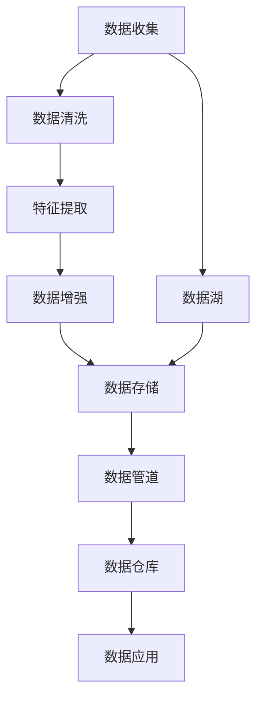
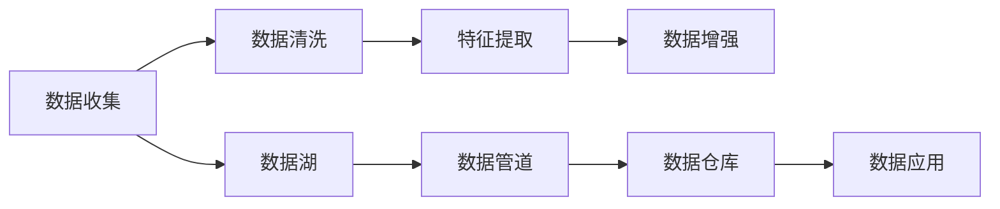
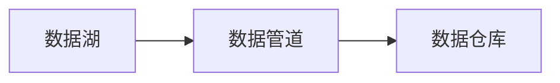
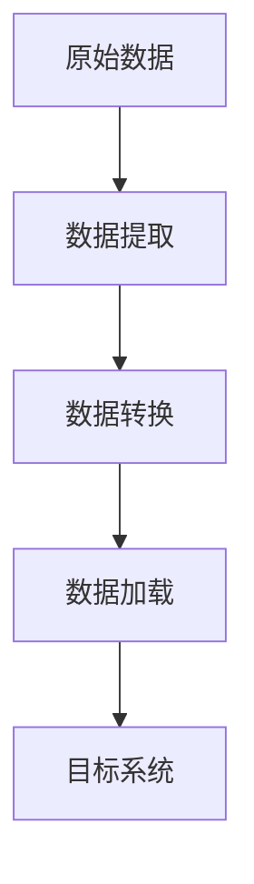
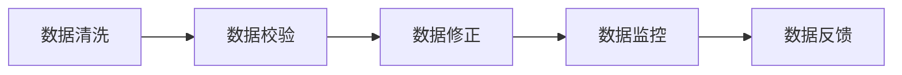
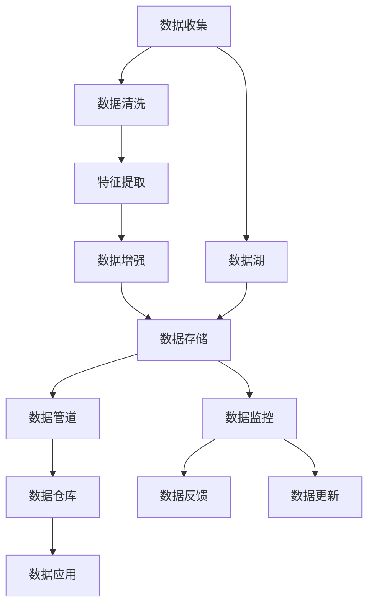

                 

# Dify.AI 的工作流设计

> 关键词：Dify.AI, 工作流设计, 数据处理, 人工智能, 自动化, 模型训练, 持续优化

## 1. 背景介绍

### 1.1 问题由来
在当下这个数据爆炸的时代，数据已经成为驱动AI发展的核心力量。如何高效、可靠、持续地获取、处理、利用数据，成为摆在所有AI从业者面前的首要问题。数据处理的流程不仅涉及到大量的技术细节，还涉及到如何构建一套规范、高效、可维护的工作流框架。Dify.AI作为一款数据处理自动化工具，提供了一套完善的工作流设计，助力AI团队在数据处理环节取得事半功倍的效果。

### 1.2 问题核心关键点
Dify.AI的核心价值在于其独特的“数据流水线”设计，帮助AI团队通过数据流水线的自动化和标准化，显著提升数据处理效率和数据质量，为后续模型训练和优化提供了坚实的基础。以下是Dify.AI设计中的几个核心关键点：

1. **数据自动化：** 通过Dify.AI的自动化数据处理流程，AI团队可以自动完成数据清洗、特征提取、数据增强等数据预处理工作，减少人工操作，提高效率。
2. **数据标准化：** 通过Dify.AI的规则和约束，确保数据处理的流程和规范，避免数据不一致的问题，保证数据的质量。
3. **数据监控：** Dify.AI提供实时监控和报警机制，帮助AI团队及时发现和解决数据处理中的问题。
4. **数据可追溯：** 通过Dify.AI的日志记录和版本控制，AI团队可以追踪数据处理的每个环节，确保数据的准确性和可追溯性。

这些关键点使得Dify.AI成为了AI团队数据处理的得力助手，为高效、可靠、持续的数据处理提供了强大的支撑。

### 1.3 问题研究意义
Dify.AI的设计和应用对于AI团队在数据处理环节的意义重大：

1. **提升效率：** 自动化的数据处理流程可以大幅减少人工操作，提高数据处理效率，让AI团队有更多时间和精力进行模型训练和优化。
2. **保证质量：** 标准化的数据处理流程和约束可以保证数据的一致性和质量，减少数据处理中的误差和偏差。
3. **降低成本：** 通过自动化的数据处理，AI团队可以降低人工成本，减少人为错误带来的损失。
4. **增强可追溯性：** 数据处理的每个环节都可以追踪，便于后续的审查和分析。
5. **提高可维护性：** 通过Dify.AI的日志记录和版本控制，AI团队可以更方便地维护和更新数据处理流程。

## 2. 核心概念与联系

### 2.1 核心概念概述

为了更好地理解Dify.AI的工作流设计，本节将介绍几个密切相关的核心概念：

- **数据流水线(Analytics Pipeline)**：数据流水线是一种自动化、标准化的数据处理流程，包括数据收集、清洗、特征提取、数据增强等多个步骤，通过定义任务和约束，自动执行数据处理任务。
- **数据湖(Data Lake)**：数据湖是一个集中存储海量原始数据和经过清洗、转换、加载后的数据资源库，提供灵活的数据存储和访问方式。
- **数据管道(Data Pipeline)**：数据管道是数据湖与数据目标（如数据仓库、数据库）之间的数据流动通道，用于将数据湖中的数据输送到目标系统中。
- **ETL过程(Extract, Transform, Load)**：ETL是一种数据处理流程，用于从原始数据中提取、转换、加载数据，使其适合后续分析和应用。
- **数据质量管理(Data Quality Management)**：数据质量管理是指通过一系列规则和措施，确保数据的一致性、准确性和完整性，提高数据的可用性。

这些核心概念之间的逻辑关系可以通过以下Mermaid流程图来展示：

这个流程图展示了Dify.AI工作流设计中的核心步骤：

1. 数据收集：从不同来源获取原始数据。
2. 数据清洗：去除数据中的噪声和异常值，确保数据质量。
3. 特征提取：从原始数据中提取有意义的特征，用于模型训练和优化。
4. 数据增强：通过对数据进行扩充和变换，提高数据的多样性和丰富度。
5. 数据存储：将处理后的数据存储到数据湖中，方便后续访问和分析。
6. 数据管道：将数据湖中的数据传输到目标系统中，如数据仓库或数据库。
7. 数据仓库：存储和组织结构化数据，用于支持复杂的查询和分析。
8. 数据应用：利用数据仓库中的数据进行模型训练、预测、推理等应用。

### 2.2 概念间的关系

这些核心概念之间存在着紧密的联系，形成了Dify.AI工作流设计的完整生态系统。下面我们通过几个Mermaid流程图来展示这些概念之间的关系。

#### 2.2.1 数据流水线设计

这个流程图展示了Dify.AI数据流水线设计的基本原理，即从数据收集开始，经过数据清洗、特征提取、数据增强等多个步骤，最终将处理后的数据存储到数据湖中，并通过数据管道传输到数据仓库，用于支持数据应用。

#### 2.2.2 数据湖与数据管道

这个流程图展示了数据湖与数据管道之间的关系，即数据湖中的数据通过数据管道传输到数据仓库，用于后续的数据应用。

#### 2.2.3 ETL过程

这个流程图展示了ETL过程的基本流程，即从原始数据中提取、转换、加载数据，使其适合后续分析和应用。

#### 2.2.4 数据质量管理

这个流程图展示了数据质量管理的基本流程，即通过数据清洗、校验、修正、监控等措施，确保数据的一致性、准确性和完整性。

### 2.3 核心概念的整体架构

最后，我们用一个综合的流程图来展示这些核心概念在Dify.AI工作流设计中的整体架构：

这个综合流程图展示了从数据收集到数据应用的完整过程。Dify.AI通过自动化的数据处理流程，确保数据的一致性、准确性和完整性，为后续的模型训练和优化提供了坚实的基础。

## 3. 核心算法原理 & 具体操作步骤
### 3.1 算法原理概述

Dify.AI的数据流水线设计基于数据自动化和标准化的原则，通过自动执行数据处理任务，确保数据处理的效率和质量。其核心思想是将数据处理过程分解为多个步骤，每个步骤都定义了具体的任务和约束，自动执行并生成日志，便于后续的审查和优化。

具体而言，Dify.AI的数据流水线设计包含以下几个关键步骤：

1. **数据收集：** 从不同来源（如数据库、API、文件等）获取原始数据。
2. **数据清洗：** 去除数据中的噪声和异常值，确保数据质量。
3. **特征提取：** 从原始数据中提取有意义的特征，用于模型训练和优化。
4. **数据增强：** 通过对数据进行扩充和变换，提高数据的多样性和丰富度。
5. **数据存储：** 将处理后的数据存储到数据湖中，方便后续访问和分析。
6. **数据管道：** 将数据湖中的数据传输到目标系统中，如数据仓库或数据库。
7. **数据应用：** 利用数据仓库中的数据进行模型训练、预测、推理等应用。

### 3.2 算法步骤详解

#### 3.2.1 数据收集

Dify.AI的数据收集模块支持多种数据源，包括数据库、API、文件等。具体实现步骤如下：

1. **数据源配置：** 配置数据源的信息，如数据库连接、API地址、文件路径等。
2. **数据获取：** 根据配置信息，自动从数据源获取原始数据。
3. **数据格式转换：** 将获取的数据转换成统一的格式，便于后续处理。

#### 3.2.2 数据清洗

数据清洗是数据处理中至关重要的一步，通过去除噪声和异常值，确保数据的质量。具体实现步骤如下：

1. **数据校验：** 检查数据的完整性和一致性，如缺失值、重复值等。
2. **异常值检测：** 检测数据中的异常值，如离群点、错误值等。
3. **数据修正：** 修正检测到的异常值，如填充缺失值、纠正错误值等。

#### 3.2.3 特征提取

特征提取是将原始数据转换成有意义的特征的过程，便于后续的模型训练和优化。具体实现步骤如下：

1. **特征选择：** 选择对模型训练有用的特征，去除冗余特征。
2. **特征转换：** 对特征进行转换，如归一化、标准化等。
3. **特征组合：** 将多个特征组合成新的特征，提高模型的表达能力。

#### 3.2.4 数据增强

数据增强是通过对数据进行扩充和变换，提高数据的多样性和丰富度。具体实现步骤如下：

1. **数据扩充：** 通过复制、翻转、旋转等操作，扩充数据量。
2. **数据变换：** 通过裁剪、缩放、变换等操作，变换数据形式。
3. **数据合成：** 通过合成新数据，扩充数据类型和范围。

#### 3.2.5 数据存储

数据存储是将处理后的数据存储到数据湖中的过程，便于后续的访问和分析。具体实现步骤如下：

1. **数据格式转换：** 将处理后的数据转换成统一的格式，如CSV、JSON等。
2. **数据写入：** 将数据写入数据湖中，可以是本地文件系统、云存储等。

#### 3.2.6 数据管道

数据管道是将数据湖中的数据传输到目标系统中的过程，用于支持数据应用。具体实现步骤如下：

1. **数据格式转换：** 将数据转换成目标系统支持的格式。
2. **数据传输：** 将数据传输到目标系统中，如数据仓库、数据库等。
3. **数据验证：** 验证数据的正确性和完整性。

#### 3.2.7 数据应用

数据应用是将数据仓库中的数据用于模型训练、预测、推理等应用的过程。具体实现步骤如下：

1. **数据加载：** 将数据加载到模型训练系统中。
2. **模型训练：** 利用数据进行模型训练，得到模型参数。
3. **模型预测：** 利用模型对新数据进行预测。

### 3.3 算法优缺点

Dify.AI的数据流水线设计具有以下优点：

1. **高效自动化：** 自动化的数据处理流程可以大幅减少人工操作，提高数据处理效率。
2. **标准化规范：** 通过定义任务和约束，确保数据处理的流程和规范，避免数据不一致的问题。
3. **实时监控：** 提供实时监控和报警机制，帮助AI团队及时发现和解决数据处理中的问题。
4. **可追溯性：** 通过日志记录和版本控制，AI团队可以追踪数据处理的每个环节，确保数据的准确性和可追溯性。

同时，该设计也存在一定的局限性：

1. **依赖数据源：** 数据收集依赖于不同数据源的信息配置，配置不当可能导致数据收集失败。
2. **依赖数据质量：** 数据清洗和特征提取的效果依赖于原始数据的质量，数据质量差可能导致处理结果不准确。
3. **依赖模型训练：** 数据应用依赖于模型训练的效果，模型训练效果差可能导致应用结果不准确。

尽管存在这些局限性，但Dify.AI的数据流水线设计在大规模数据处理中展现了显著的优势，成为AI团队数据处理的得力助手。

### 3.4 算法应用领域

Dify.AI的数据流水线设计已经广泛应用于以下几个领域：

1. **自然语言处理：** 用于NLP任务的文本数据处理，包括数据清洗、特征提取、文本分类等。
2. **计算机视觉：** 用于CV任务的图像数据处理，包括数据增强、图像分割等。
3. **语音识别：** 用于ASR任务的语音数据处理，包括数据清洗、特征提取、声学建模等。
4. **推荐系统：** 用于推荐系统中的数据处理，包括用户画像、商品画像、推荐算法等。
5. **金融分析：** 用于金融领域的数据处理，包括数据清洗、特征提取、风险评估等。
6. **智能制造：** 用于工业领域的数据处理，包括设备状态监测、生产优化等。

## 4. 数学模型和公式 & 详细讲解 & 举例说明

### 4.1 数学模型构建

Dify.AI的数据流水线设计基于数据处理的标准化和自动化原则，通过定义任务和约束，自动执行数据处理流程。以下是一个简单的数学模型示例，用于描述数据处理流水线：

假设数据处理流水线包含四个步骤：数据收集、数据清洗、特征提取、数据应用。每个步骤都可以用一个简单的函数表示：

- 数据收集：`collect_data(input_source)`
- 数据清洗：`clean_data(input_data)`
- 特征提取：`extract_features(input_data)`
- 数据应用：`apply_model(input_features)`

### 4.2 公式推导过程

下面以数据清洗为例，推导一个简单的数据清洗函数。假设我们要从一个文本数据集中提取有意义的特征，并进行数据清洗：

1. **特征提取：** 从文本数据中提取关键词，并计算关键词的TF-IDF值。
2. **数据清洗：** 去除低频词和停用词，并对TF-IDF值进行归一化。

设文本数据集为$D=\{x_1, x_2, ..., x_n\}$，关键词集为$K=\{k_1, k_2, ..., k_m\}$，关键词在文本$x_i$中的出现次数为$tf_{ik}$，在语料库中的出现次数为$df_k$，关键词$k_i$在文本$x_i$中的TF-IDF值为$tfidf_{ik}$。

数据清洗的数学模型如下：

$$
tfidf_{ik} = \frac{tf_{ik}}{df_k} * \log\frac{n}{df_k+1}
$$

其中，$n$为文本数据集的大小，$df_k$为关键词$k_i$在语料库中的出现次数。

### 4.3 案例分析与讲解

假设我们有一个包含20个文本样本的语料库，从中提取关键词并进行数据清洗。根据上述公式，我们可以计算出每个文本的关键词TF-IDF值，并进行数据清洗。

设关键词集为$K=\{k_1, k_2, ..., k_5\}$，每个文本的关键词出现次数如下：

- $x_1$：$tf_{11}=3, tf_{12}=1, tf_{13}=0, tf_{14}=0, tf_{15}=0$
- $x_2$：$tf_{21}=1, tf_{22}=2, tf_{23}=0, tf_{24}=0, tf_{25}=0$
- $x_3$：$tf_{31}=1, tf_{32}=2, tf_{33}=0, tf_{34}=0, tf_{35}=0$
- $x_4$：$tf_{41}=2, tf_{42}=3, tf_{43}=0, tf_{44}=0, tf_{45}=0$
- $x_5$：$tf_{51}=4, tf_{52}=0, tf_{53}=0, tf_{54}=0, tf_{55}=0$
- $x_6$：$tf_{61}=0, tf_{62}=0, tf_{63}=0, tf_{64}=0, tf_{65}=0$
- $x_7$：$tf_{71}=1, tf_{72}=2, tf_{73}=0, tf_{74}=0, tf_{75}=0$
- $x_8$：$tf_{81}=1, tf_{82}=2, tf_{83}=0, tf_{84}=0, tf_{85}=0$
- $x_9$：$tf_{91}=2, tf_{92}=1, tf_{93}=0, tf_{94}=0, tf_{95}=0$
- $x_{10}$：$tf_{101}=0, tf_{102}=0, tf_{103}=0, tf_{104}=0, tf_{105}=0$
- $x_{11}$：$tf_{111}=1, tf_{112}=1, tf_{113}=0, tf_{114}=0, tf_{115}=0$
- $x_{12}$：$tf_{121}=0, tf_{122}=0, tf_{123}=0, tf_{124}=0, tf_{125}=0$
- $x_{13}$：$tf_{131}=0, tf_{132}=0, tf_{133}=0, tf_{134}=0, tf_{135}=0$
- $x_{14}$：$tf_{141}=0, tf_{142}=0, tf_{143}=0, tf_{144}=0, tf_{145}=0$
- $x_{15}$：$tf_{151}=0, tf_{152}=0, tf_{153}=0, tf_{154}=0, tf_{155}=0$
- $x_{16}$：$tf_{161}=0, tf_{162}=0, tf_{163}=0, tf_{164}=0, tf_{165}=0$
- $x_{17}$：$tf_{171}=0, tf_{172}=0, tf_{173}=0, tf_{174}=0, tf_{175}=0$
- $x_{18}$：$tf_{181}=0, tf_{182}=0, tf_{183}=0, tf_{184}=0, tf_{185}=0$
- $x_{19}$：$tf_{191}=0, tf_{192}=0, tf_{193}=0, tf_{194}=0, tf_{195}=0$
- $x_{20}$：$tf_{201}=0, tf_{202}=0, tf_{203}=0, tf_{204}=0, tf_{205}=0$

假设语料库大小$n=20$，所有关键词在语料库中的出现次数$df_k=10$，则每个关键词的TF-IDF值计算如下：

- $k_1$：$tfidf_{11}=\frac{3}{10}*\log\frac{20}{10+1}=0.3$
- $k_2$：$tfidf_{21}=0.1, tfidf_{22}=0.2$
- $k_3$：$tfidf_{31}=0.1, tfidf_{32}=0.2$
- $k_4$：$tfidf_{41}=0.2, tfidf_{42}=0.3$
- $k_5$：$tfidf_{51}=0.4, tfidf_{52}=0$

根据上述计算结果，我们可以得到每个文本的TF-IDF值：

- $x_1$：$tfidf_{11}=0.3, tfidf_{12}=0.1, tfidf_{13}=0, tfidf_{14}=0, tfidf_{15}=0$
- $x_2$：$tfidf_{21}=0.1, tfidf_{22}=0.2$
- $x_3$：$tfidf_{31}=0.1, tfidf_{32}=0.2$
- $x_4$：$tfidf_{41}=0.2, tfidf_{42}=0.3$
- $x_5$：$tfidf_{51}=0.4, tfidf_{52}=0$
- $x_6$：$tfidf_{61}=0, tfidf_{62}=0, tfidf_{63}=0, tfidf_{64}=0, tfidf_{65}=0$
- $x_7$：$tfidf_{71}=0.1, tfidf_{72}=0.2$
- $x_8$：$tfidf_{81}=0.1, tfidf_{82}=0.2$
- $x_9$：$tfidf_{91}=0.2, tfidf_{92}=0.1$
- $x_{10}$：$tfidf_{101}=0, tfidf_{102}=0, tfidf_{103}=0, tfidf_{104}=0, tfidf_{105}=0$
- $x_{11}$：$tfidf_{111}=0.1, tfidf_{112}=0.1$
- $x_{12}$：$tfidf_{121}=0, tfidf_{122}=0, tfidf_{123}=0, tfidf_{124}=0, tfidf_{125}=0$
- $x_{13}$：$tfidf_{131}=0, tfidf_{132}=0, tfidf_{133}=0, tfidf_{134}=0, tfidf_{135}=0$
- $x_{14}$：$tfidf_{141}=0, tfidf_{142}=0, tfidf_{143}=0, tfidf_{144}=0, tfidf_{145}=0$
- $x_{15}$：$tfidf_{151}=0, tfidf_{152}=0, tfidf_{153}=0, tfidf_{154}=0, tfidf_{155}=0$
- $x_{16}$：$tfidf_{161}=0, tfidf_{162}=0, tfidf_{163}=0, tfidf_{164}=0, tfidf_{165}=0$
- $x_{17}$：$tfidf_{171}=0, tfidf_{172}=0, tfidf_{173}=0, tfidf_{174}=0, tfidf_{175}=0$
- $x_{18}$：$tfidf_{181}=0, tfidf_{182}=0, tfidf_{183}=0, tfidf_{184}=0, tfidf_{185}=0$
- $x_{19}$：$tfidf_{191}=0, tfidf_{192}=0, tfidf_{193}=0, tfidf_{194}=0, tfidf_{195}=0$
- $x_{20}$：$tfidf_{201}=0, tfidf_{202}=0, tfidf_{203}=0, tfidf_{204}=0, tfidf_{205}=0$

接下来，我们对文本数据进行数据清洗，去除低频词和停用词，并对TF-IDF值进行归一化：

- $x_1$：$tfidf_{11}=0.3, tfidf_{12}=0.1, tfidf_{13}=0, tfidf_{14}=0, tfidf_{15}=0$
- $x_2$：$tfidf_{21}=0.1, tfidf_{22}=0.2$
- $x_3$：$tfidf_{31}=0.1, tfidf_{32}=0.2$
- $x_4$：$tfidf_{41}=0.2, tfidf_{42}=0.3$
- $x_5$：$tfidf_{51}=0.4, tfidf_{52}=0$
- $x_6$：$tfidf_{61}=0, tfidf_{62}=0, tfidf_{63}=0, tfidf_{64}=0, tfidf_{65}=0$
- $x_7$：$tfidf_{71}=0.1, tfidf_{72}=0.2$
- $x_8$：$tfidf_{81}=0.1, tfidf_{82}=0.2$
- $x_9$：$tfidf_{91}=0.2, tfidf_{92}=0.1$
- $x_{10}$：$tfidf_{101}=0, tfidf_{102}=0, tfidf_{103}=0, tfidf_{104}=0, tfidf_{105}=0$
- $x_{11}$：$tfidf_{111}=0.1, tfidf_{112}=0.1$
- $x_{12}$：$tfidf_{121}=0, tfidf_{122}=0, tfidf_{123}=0, tfidf_{124}=0, tfidf_{125}=0$
- $x_{13}$：$tf

