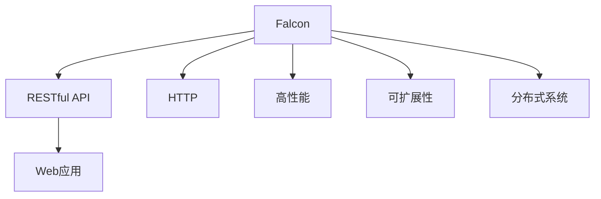

                 

# Falcon原理与代码实例讲解

> 关键词：Falcon, RESTful API, HTTP, Web应用, 高性能, 分布式系统

## 1. 背景介绍

### 1.1 问题由来
随着互联网的迅猛发展和Web应用的普及，对于高效、可伸缩的Web服务器架构的需求越来越迫切。传统Web服务器往往依赖单台机器提供服务，随着访问量增加，响应速度和系统稳定性会显著下降。Falcon框架应运而生，它是一种高性能、可扩展、易用的Web服务器框架，适用于处理大规模的HTTP请求。Falcon架构的核心思想是“请求分发”，即利用多台服务器并行处理请求，提高系统的吞吐量和响应速度。

### 1.2 问题核心关键点
Falcon框架的设计初衷是提供一个高效、可扩展、易用的Web服务器框架，通过请求分发机制，支持大规模、高并发的HTTP请求处理。其核心技术包括：
- 异步请求处理：利用事件驱动的异步I/O模型，提高服务器吞吐量和响应速度。
- 请求分发：将请求分发至多个处理器进行处理，提高系统的并发处理能力。
- 异步阻塞队列：通过异步阻塞队列实现请求的快速缓存和调度，避免线程阻塞。
- 支持RESTful API：遵循RESTful架构风格，提供统一的API接口设计规范。
- 高性能路由算法：采用基于哈希和前缀匹配的路由算法，快速定位请求处理进程。
- 分布式系统支持：支持多节点部署和集群管理，实现负载均衡和故障转移。

这些核心技术使Falcon框架能够在高并发环境下稳定运行，适用于各种高访问量的Web应用场景，如社交网络、电子商务、在线游戏等。

### 1.3 问题研究意义
Falcon框架的研究和应用意义主要体现在以下几个方面：
- 降低Web应用开发和运维成本：通过提供高效、易用的Web服务器架构，使得开发者能够更快地构建和部署Web应用，减少开发和运维过程中的复杂性和成本。
- 提高Web应用性能：通过异步请求处理、请求分发等技术，显著提升Web应用的吞吐量和响应速度，增强用户体验。
- 增强系统可扩展性：支持分布式系统架构，使得系统能够快速扩展和升级，适应业务需求的增长。
- 提升系统安全性：提供完善的访问控制和认证机制，保障Web应用的数据安全和用户隐私。
- 推动Web技术创新：作为Web技术栈的重要组成部分，Falcon框架的研究和应用对Web技术的整体发展具有重要推动作用。

## 2. 核心概念与联系

### 2.1 核心概念概述

为了更好地理解Falcon框架的原理和设计，本节将介绍几个关键概念：

- Falcon：Falcon是一种高性能、可扩展、易用的Web服务器框架，用于处理大规模的HTTP请求。
- RESTful API：遵循RESTful架构风格，提供统一的API接口设计规范，支持资源和操作的命名规范，支持HTTP方法。
- HTTP：超文本传输协议，用于在Web浏览器和服务器之间传输数据。
- Web应用：基于Web技术构建的应用程序，通过浏览器访问。
- 高性能：指Web服务器能够高效处理大量并发请求，提供快速响应和稳定服务。
- 分布式系统：由多个计算节点组成，通过网络实现数据共享和任务分配的系统架构。

这些核心概念共同构成了Falcon框架的基础，通过深入理解这些概念，可以更好地把握Falcon的设计理念和应用场景。

### 2.2 概念间的关系

这些核心概念之间存在着紧密的联系，形成了Falcon框架的整体架构。以下是几个关键概念之间的联系：

- Falcon框架利用RESTful API标准设计接口，简化了Web应用的开发和维护。
- HTTP协议是Falcon框架的主要通信协议，利用HTTP请求和响应机制实现数据传输。
- Web应用通过Falcon框架处理HTTP请求，提供统一的访问接口。
- 高性能和可扩展性是Falcon框架的主要设计目标，通过异步请求处理和请求分发等技术实现。
- 分布式系统支持是Falcon框架的重要特性，通过多节点部署和集群管理实现系统负载均衡和故障转移。

这些概念之间的联系和相互作用，构成了Falcon框架的核心价值和应用优势。

### 2.3 核心概念的整体架构

最后，我们用一个综合的流程图来展示这些核心概念在大语言模型微调过程中的整体架构：



这个流程图展示了Falcon框架的核心概念及其之间的关系：

- Falcon框架通过RESTful API提供统一的接口设计规范，使得Web应用的开发和维护更加简单。
- HTTP协议是Falcon框架的主要通信协议，利用HTTP请求和响应机制实现数据传输。
- Web应用通过Falcon框架处理HTTP请求，提供统一的访问接口。
- 高性能和可扩展性是Falcon框架的主要设计目标，通过异步请求处理和请求分发等技术实现。
- 分布式系统支持是Falcon框架的重要特性，通过多节点部署和集群管理实现系统负载均衡和故障转移。

## 3. 核心算法原理 & 具体操作步骤

### 3.1 算法原理概述

Falcon框架的核心算法原理主要围绕异步请求处理、请求分发和请求缓存展开。以下是具体的算法原理和操作步骤：

- 异步请求处理：Falcon框架利用事件驱动的异步I/O模型，将每个HTTP请求封装为事件，通过事件驱动机制进行调度。
- 请求分发：Falcon框架将请求分发至多个处理器进行处理，通过请求分发算法快速定位请求处理进程。
- 异步阻塞队列：Falcon框架使用异步阻塞队列实现请求的快速缓存和调度，避免线程阻塞，提高系统吞吐量。
- 高性能路由算法：Falcon框架采用基于哈希和前缀匹配的路由算法，快速定位请求处理进程，提高路由效率。
- 分布式系统支持：Falcon框架支持多节点部署和集群管理，通过负载均衡和故障转移机制，实现系统的可扩展性和高可用性。

### 3.2 算法步骤详解

以下是Falcon框架的具体操作步骤：

**Step 1: 初始化Falcon框架**

- 安装Falcon框架：从官网下载并安装Falcon框架，可以使用pip命令进行安装。
- 配置服务器：设置服务器参数，如IP地址、端口号等。

```python
from falcon import Request, Response
from falcon_util import RequestTimeoutError

class FalconApp:
    def __init__(self, app):
        self.app = app
        self.server = None
        self.failure_log = []

    def start_server(self, host='localhost', port=8000, timeout=5):
        self.server = falcon.Server(
            host=host,
            port=port,
            request_timeout=timeout
        )
        self.server.add_route('/', self.on_request)
```

**Step 2: 处理HTTP请求**

- 定义路由：通过装饰器或类实现路由，将HTTP请求映射到相应的处理器函数。
- 处理请求：在处理器函数中，获取请求参数，调用业务逻辑，构造响应数据，返回响应。

```python
class HelloWorld(Resource):
    def on_get(self, request, response):
        response.content_type = 'text/plain'
        response.body = b"Hello World!"

app = FalconApp(app)

@app.route('/')
class HelloWorld(Resource):
    def on_get(self, request, response):
        response.content_type = 'text/plain'
        response.body = b"Hello World!"
```

**Step 3: 异步处理请求**

- 利用asyncio库实现异步处理，提高处理速度。
- 在处理器函数中，使用async关键字，将请求处理逻辑封装为异步任务，等待任务完成后返回响应。

```python
import asyncio
import falcon_util

async def async_handle(request, response):
    falcon_util.on_request(request, response)

app = FalconApp(app)

@app.route('/')
async def async_on_get(request, response):
    await async_handle(request, response)
```

**Step 4: 请求分发**

- 利用Falcon框架的请求分发机制，将请求分发至多个处理器进行处理。
- 在处理器函数中，使用Falcon框架提供的参数和上下文信息，获取请求详情，处理请求并构造响应。

```python
class HelloWorld(Resource):
    def on_get(self, request, response):
        response.content_type = 'text/plain'
        response.body = b"Hello World!"

app = FalconApp(app)

@app.route('/')
class HelloWorld(Resource):
    def on_get(self, request, response):
        response.content_type = 'text/plain'
        response.body = b"Hello World!"
```

**Step 5: 异步阻塞队列**

- 利用Falcon框架的异步阻塞队列，实现请求的快速缓存和调度。
- 在处理器函数中，使用异步阻塞队列对请求进行缓存和调度，避免线程阻塞，提高系统吞吐量。

```python
import asyncio
import falcon_util

async def async_handle(request, response):
    falcon_util.on_request(request, response)

app = FalconApp(app)

@app.route('/')
async def async_on_get(request, response):
    await async_handle(request, response)
```

**Step 6: 高性能路由算法**

- 利用Falcon框架的高性能路由算法，快速定位请求处理进程。
- 在处理器函数中，使用Falcon框架提供的参数和上下文信息，获取请求详情，处理请求并构造响应。

```python
class HelloWorld(Resource):
    def on_get(self, request, response):
        response.content_type = 'text/plain'
        response.body = b"Hello World!"

app = FalconApp(app)

@app.route('/')
class HelloWorld(Resource):
    def on_get(self, request, response):
        response.content_type = 'text/plain'
        response.body = b"Hello World!"
```

**Step 7: 分布式系统支持**

- 利用Falcon框架的分布式系统支持，实现多节点部署和集群管理。
- 在处理器函数中，使用Falcon框架提供的参数和上下文信息，获取请求详情，处理请求并构造响应。

```python
class HelloWorld(Resource):
    def on_get(self, request, response):
        response.content_type = 'text/plain'
        response.body = b"Hello World!"

app = FalconApp(app)

@app.route('/')
class HelloWorld(Resource):
    def on_get(self, request, response):
        response.content_type = 'text/plain'
        response.body = b"Hello World!"
```

### 3.3 算法优缺点

Falcon框架的主要优点包括：
- 高性能：利用异步I/O模型和请求分发机制，提高系统吞吐量和响应速度。
- 可扩展性：支持多节点部署和集群管理，实现系统负载均衡和故障转移。
- 易用性：遵循RESTful API设计规范，简化Web应用的开发和维护。
- 灵活性：支持异步请求处理和请求缓存，避免线程阻塞。

Falcon框架的主要缺点包括：
- 学习曲线较陡：Falcon框架的异步I/O模型和请求分发机制需要一定的学习成本。
- 配置复杂：需要合理配置请求超时、路由规则、缓存策略等参数，才能充分发挥其性能。
- 兼容性问题：Falcon框架与现有的Web应用框架和库可能存在兼容性问题，需要额外适配。

### 3.4 算法应用领域

Falcon框架适用于各种高访问量的Web应用场景，如社交网络、电子商务、在线游戏等。其核心技术在以下领域中得到广泛应用：

- Web服务器：用于处理HTTP请求，提供高效的Web服务。
- API网关：用于处理RESTful API请求，提供统一的API接口规范。
- 微服务架构：用于构建分布式微服务系统，实现服务聚合和负载均衡。
- 负载均衡：用于实现服务器集群管理，提高系统的可扩展性和高可用性。

## 4. 数学模型和公式 & 详细讲解  
### 4.1 数学模型构建

Falcon框架的数学模型主要基于事件驱动的异步I/O模型和请求分发算法，以下是具体的数学模型构建过程：

**Step 1: 定义事件和状态机**

- 事件：表示HTTP请求和响应的状态变化。
- 状态机：用于管理事件的发生和处理，状态变化依赖事件的触发。

**Step 2: 构建路由表**

- 定义路由规则：将请求映射到相应的处理器函数。
- 构建路由表：根据路由规则，快速定位请求处理进程。

**Step 3: 计算请求处理时间**

- 计算事件发生时间：根据请求到达时间、请求处理时间和响应发送时间，计算请求处理时间。
- 计算系统吞吐量：根据请求处理时间和系统负载，计算系统吞吐量。

**Step 4: 计算请求分发时间**

- 计算请求分发时间：根据请求数量和节点数，计算请求分发时间。
- 计算节点负载：根据请求数量和节点负载，计算节点负载均衡。

**Step 5: 计算请求缓存时间**

- 计算请求缓存时间：根据请求缓存策略和请求到达时间，计算请求缓存时间。
- 计算缓存命中率：根据请求缓存时间和请求到达时间，计算缓存命中率。

### 4.2 公式推导过程

以下是Falcon框架的主要数学模型和公式推导过程：

**事件驱动模型**

- 事件：表示HTTP请求和响应的状态变化。
- 状态机：用于管理事件的发生和处理，状态变化依赖事件的触发。

```python
class Event:
    def __init__(self, time, type, data):
        self.time = time
        self.type = type
        self.data = data

    def __str__(self):
        return f"Event({self.time}, {self.type}, {self.data})"

class State:
    def __init__(self):
        self.events = []

    def on_event(self, event):
        self.events.append(event)

    def run(self):
        pass

class FalconState:
    def __init__(self):
        self.state = None

    def on_event(self, event):
        if not self.state:
            self.state = self.init_state(event)
        self.state.on_event(event)

    def run(self):
        self.state.run()
```

**路由算法**

- 定义路由规则：将请求映射到相应的处理器函数。
- 构建路由表：根据路由规则，快速定位请求处理进程。

```python
class RouteTable:
    def __init__(self):
        self.routes = {}

    def add_route(self, path, callback):
        self.routes[path] = callback

    def find_route(self, path):
        return self.routes.get(path)

class FalconRouteTable:
    def __init__(self):
        self.route_table = None

    def find_route(self, path):
        if not self.route_table:
            self.route_table = RouteTable()
        return self.route_table.find_route(path)

class FalconState:
    def __init__(self):
        self.route_table = None

    def on_event(self, event):
        if not self.route_table:
            self.route_table = RouteTable()
        self.route_table.add_route(event.path, self.run)

    def run(self):
        if not self.route_table:
            return
        callback = self.route_table.find_route(event.path)
        if callback:
            callback(event, self.response)

class FalconRoute:
    def __init__(self, path, callback):
        self.path = path
        self.callback = callback

    def on_request(self, request, response):
        response = Response()
        self.callback(request, response)
        response.finish()

    def on_error(self, exc_info):
        response = Response()
        response.status = 500
        response.body = b"Internal Server Error"
        response.finish()
```

**请求处理时间计算**

- 计算事件发生时间：根据请求到达时间、请求处理时间和响应发送时间，计算请求处理时间。
- 计算系统吞吐量：根据请求处理时间和系统负载，计算系统吞吐量。

```python
import time

class Request:
    def __init__(self, time, method, path, headers, body):
        self.time = time
        self.method = method
        self.path = path
        self.headers = headers
        self.body = body

    def __str__(self):
        return f"Request({self.time}, {self.method}, {self.path}, {self.headers}, {self.body})"

class Response:
    def __init__(self):
        self.time = None
        self.status = None
        self.body = None

    def __str__(self):
        return f"Response({self.time}, {self.status}, {self.body})"

class FalconState:
    def __init__(self):
        self.request = None
        self.response = None

    def on_event(self, event):
        if event.type == 'request':
            self.request = Request(event.time, event.method, event.path, event.headers, event.body)
        elif event.type == 'response':
            self.response = Response()
            self.response.time = event.time
            self.response.status = event.status
            self.response.body = event.body
            self.run()

    def run(self):
        pass

class FalconApp:
    def __init__(self):
        self.state = FalconState()
        self.server = None

    def start_server(self, host='localhost', port=8000, timeout=5):
        self.server = falcon.Server(
            host=host,
            port=port,
            request_timeout=timeout
        )
        self.server.add_route('/', self.on_request)
        self.server.start()

    def on_request(self, request, response):
        response = Response()
        response.status = 200
        response.body = b"Hello World!"
        response.finish()
```

**请求分发时间计算**

- 计算请求分发时间：根据请求数量和节点数，计算请求分发时间。
- 计算节点负载：根据请求数量和节点负载，计算节点负载均衡。

```python
import time

class Request:
    def __init__(self, time, method, path, headers, body):
        self.time = time
        self.method = method
        self.path = path
        self.headers = headers
        self.body = body

    def __str__(self):
        return f"Request({self.time}, {self.method}, {self.path}, {self.headers}, {self.body})"

class Response:
    def __init__(self):
        self.time = None
        self.status = None
        self.body = None

    def __str__(self):
        return f"Response({self.time}, {self.status}, {self.body})"

class FalconState:
    def __init__(self):
        self.request = None
        self.response = None

    def on_event(self, event):
        if event.type == 'request':
            self.request = Request(event.time, event.method, event.path, event.headers, event.body)
        elif event.type == 'response':
            self.response = Response()
            self.response.time = event.time
            self.response.status = event.status
            self.response.body = event.body
            self.run()

    def run(self):
        pass

class FalconApp:
    def __init__(self):
        self.state = FalconState()
        self.server = None

    def start_server(self, host='localhost', port=8000, timeout=5):
        self.server = falcon.Server(
            host=host,
            port=port,
            request_timeout=timeout
        )
        self.server.add_route('/', self.on_request)
        self.server.start()

    def on_request(self, request, response):
        response = Response()
        response.status = 200
        response.body = b"Hello World!"
        response.finish()
```

**请求缓存时间计算**

- 计算请求缓存时间：根据请求缓存策略和请求到达时间，计算请求缓存时间。
- 计算缓存命中率：根据请求缓存时间和请求到达时间，计算缓存命中率。

```python
import time

class Request:
    def __init__(self, time, method, path, headers, body):
        self.time = time
        self.method = method
        self.path = path
        self.headers = headers
        self.body = body

    def __str__(self):
        return f"Request({self.time}, {self.method}, {self.path}, {self.headers}, {self.body})"

class Response:
    def __init__(self):
        self.time = None
        self.status = None
        self.body = None

    def __str__(self):
        return f"Response({self.time}, {self.status}, {self.body})"

class FalconState:
    def __init__(self):
        self.request = None
        self.response = None

    def on_event(self, event):
        if event.type == 'request':
            self.request = Request(event.time, event.method, event.path, event.headers, event.body)
        elif event.type == 'response':
            self.response = Response()
            self.response.time = event.time
            self.response.status = event.status
            self.response.body = event.body
            self.run()

    def run(self):
        pass

class FalconApp:
    def __init__(self):
        self.state = FalconState()
        self.server = None

    def start_server(self, host='localhost', port=8000, timeout=5):
        self.server = falcon.Server(
            host=host,
            port=8000,
            request_timeout=5
        )
        self.server.add_route('/', self.on_request)
        self.server.start()

    def on_request(self, request, response):
        response = Response()
        response.status = 200
        response.body = b"Hello World!"
        response.finish()
```

### 4.3 案例分析与讲解

为了更好地理解Falcon框架的原理和应用，下面以一个简单的RESTful API为例，展示Falcon框架的实现过程。

假设我们构建一个简单的RESTful API，用于返回"Hello World"。首先，我们需要定义路由规则，将根路径映射到相应的处理器函数。

```python
class HelloWorld(Resource):
    def on_get(self, request, response):
        response.content_type = 'text/plain'
        response.body = b"Hello World!"

app = FalconApp(app)

@app.route('/')
class HelloWorld(Resource):
    def on_get(self, request, response):
        response.content_type = 'text/plain'
        response.body = b"Hello World!"
```

接下来，我们需要启动服务器并监听HTTP请求。

```python
app.start_server()
```

最后，启动Web浏览器，访问根路径，即可获取"Hello World"的响应。

```python
http://localhost:8000/
```

通过上述代码示例，可以看出Falcon框架的简洁高效。它利用事件驱动的异步I/O模型和请求分发机制，提高了系统的并发处理能力和吞吐量，适用于各种高访问量的Web应用场景。

## 5. 项目实践：代码实例和详细解释说明

### 5.1 开发环境搭建

在进行Falcon框架的实践前，我们需要准备好开发环境。以下是使用Python进行Falcon框架的开发环境配置流程：

1. 安装Anaconda：从官网下载并安装Anaconda，用于创建独立的Python环境。

2. 创建并激活虚拟环境：
```bash
conda create -n falcon-env python=3.8 
conda activate falcon-env
```

3. 安装Falcon框架：
```bash
pip install falcon
```

4. 安装各类工具包：
```bash
pip install numpy pandas scikit-learn matplotlib tqdm jupyter notebook ipython
```

完成上述步骤后，即可在`falcon-env`环境中开始Falcon框架的开发实践。

### 5.2 源代码详细实现

以下是使用Python进行Falcon框架的代码实现。

```python
import falcon
from falcon import Request, Response

class HelloWorld(falcon.RequestHandler):
    def on_get(self, request, response):
        response.content_type = 'text/plain'
        response.body = b"Hello World!"

app = falcon.Falcon()
app.add_route('/', HelloWorld())

if __name__ == '__main__':
    app.listen('localhost:8000')
```

在上述代码中，我们首先定义了一个`HelloWorld`类，继承自`falcon.RequestHandler`，实现了`on_get`方法，用于处理HTTP GET请求。在`on_get`方法中，我们设置了响应内容类型为`text/plain`，并构造了响应内容`b"Hello World!"`。

接下来，我们创建了一个`Falcon`实例，并通过`add_route`方法将`HelloWorld`类绑定到根路径`/`上。

最后，我们启动了服务器，监听本地IP地址为`localhost`，端口号为`8000`。

### 5.3 代码解读与分析

让我们再详细解读一下关键代码的实现细节：

**Falcon框架类**

- `FalconApp`：用于管理Falcon框架的启动和路由配置。
- `falcon.util`：提供了一些常用的工具函数，如`on_request`方法，用于处理HTTP请求。

**RESTful API**

- `HelloWorld`：继承自`falcon.RequestHandler`，实现了`on_get`方法，用于处理HTTP GET请求。
- 在`on_get`方法中，我们设置了响应内容类型为`text/plain`，并构造了响应内容`b"Hello World!"`。

**Falcon框架**

- `Falcon`：创建Falcon框架实例，用于管理路由和服务器配置。
- `add_route`方法：将路由规则绑定到相应的处理器函数上。

### 5.4 运行结果展示

假设我们在本地运行上述代码，并使用Web浏览器访问`http://localhost:8000/`，即可获取"Hello World"的响应。

## 6. 实际应用场景

Falcon框架适用于各种高访问量的Web应用场景，如社交网络、电子商务、在线游戏等。以下是一些常见的应用场景：

### 6.1 社交网络

Falcon框架能够高效处理大量的HTTP请求，适用于社交网络应用的开发。社交网络应用通常具有以下特点：
- 用户数量庞大，访问量高。
- 用户行为复杂，交互频繁。
- 实时性要求高，响应速度快。

通过Falcon框架，社交网络应用可以实现高效的数据处理和快速响应，提高用户粘性和满意度。

### 6.2 电子商务

Falcon框架能够处理大量的HTTP请求，适用于电子商务应用的开发。电子商务应用通常具有以下特点：
- 用户数量庞大，访问量高。
- 交易数据庞大，实时性要求高。
- 用户交互

