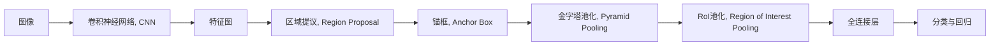
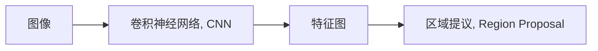
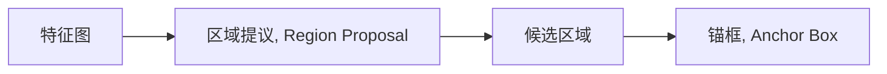
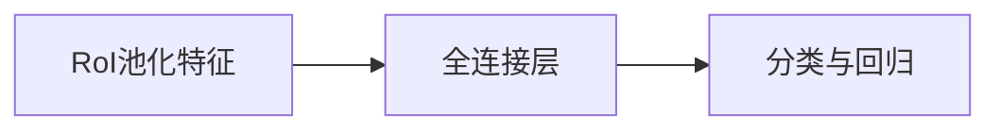
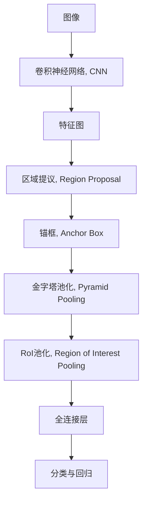
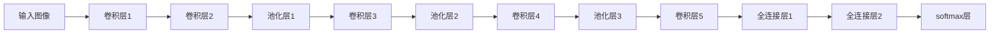

                 

# Fast R-CNN原理与代码实例讲解

> 关键词：区域提议,卷积神经网络,锚框,金字塔池化,快速网络,目标检测

## 1. 背景介绍

### 1.1 问题由来
目标检测是计算机视觉中的核心任务之一，其目标是在图像中自动找出感兴趣的对象并标注其位置和大小。传统的目标检测方法如Haar特征分类器和HOG+SVM方法，虽然取得了不错的效果，但计算复杂度高，难以实时应用。近年来，深度学习技术的兴起，推动了目标检测方法的发展，其中以R-CNN系列方法为代表的基于深度学习的检测算法在速度和准确率上都有了显著提升。

Fast R-CNN作为R-CNN家族的重要成员，将RPN（Region Proposal Network，区域提议网络）和CNN（Convolutional Neural Network，卷积神经网络）结合，显著提升了目标检测的速度和准确率。本文将详细介绍Fast R-CNN的原理和代码实现，帮助读者全面理解这一重要的目标检测算法。

### 1.2 问题核心关键点
Fast R-CNN的核心在于其创新的区域提议和金字塔池化技术，以及结合RPN进行高效的目标检测。Fast R-CNN的核心要点包括：
- 锚框(Anchor Box)：通过设置不同大小和长宽比的锚框，捕捉图像中不同尺度的目标。
- 金字塔池化(Pyramid Pooling)：通过多尺度的池化操作，捕捉不同尺度的目标。
- RPN：通过RoI池化（Region of Interest Pooling）和Fast R-CNN的结合，实现了高效的目标检测。
- 数据增强：通过数据增强技术，如随机裁剪、翻转、旋转等，扩充训练数据。

### 1.3 问题研究意义
Fast R-CNN的目标检测算法，基于深度学习的强大表征能力，提升了目标检测的精度和速度，为计算机视觉领域带来了革命性的变化。该算法广泛应用于图像识别、视频监控、自动驾驶、医疗影像分析等多个领域，推动了这些领域的技术进步和应用推广。

此外，Fast R-CNN也为后续的目标检测算法如Faster R-CNN、YOLO、SSD等提供了重要的借鉴和改进基础，成为深度学习目标检测领域的重要里程碑。

## 2. 核心概念与联系

### 2.1 核心概念概述

为更好地理解Fast R-CNN的原理，本节将介绍几个关键核心概念：

- 区域提议(Region Proposal)：在图像中生成候选区域，用于后续的目标检测。
- 卷积神经网络(Convolutional Neural Network, CNN)：通过卷积操作提取图像特征，实现端到端的目标检测。
- 锚框(Anchor Box)：预先定义不同大小和长宽比的框，捕捉不同尺度的目标。
- 金字塔池化(Pyramid Pooling)：通过多尺度的池化操作，捕捉不同尺度的目标。
- RoI池化(Region of Interest Pooling)：针对不同尺度的候选区域，进行统一尺度的特征提取。
- 目标检测(Object Detection)：在图像中定位和分类感兴趣的目标对象。

这些核心概念之间的逻辑关系可以通过以下Mermaid流程图来展示：



这个流程图展示了Fast R-CNN的核心流程：

1. 输入图像通过卷积神经网络提取特征图。
2. 特征图通过区域提议网络生成候选区域。
3. 候选区域通过锚框和金字塔池化，捕捉不同尺度的目标。
4. RoI池化将不同尺度的特征图映射到统一尺度，进行后续的全连接层处理。
5. 全连接层进行目标分类和回归，得到最终的目标检测结果。

### 2.2 概念间的关系

这些核心概念之间存在着紧密的联系，形成了Fast R-CNN的核心算法框架。下面通过几个Mermaid流程图来展示这些概念之间的关系。

#### 2.2.1 卷积神经网络与特征提取



这个流程图展示了卷积神经网络如何提取图像特征，用于后续的区域提议和目标检测。

#### 2.2.2 区域提议与锚框



这个流程图展示了区域提议网络如何通过锚框生成候选区域，用于捕捉不同尺度的目标。

#### 2.2.3 金字塔池化与RoI池化


这个流程图展示了金字塔池化和RoI池化如何通过多尺度池化，捕捉不同尺度的目标特征。

#### 2.2.4 目标检测与全连接层



这个流程图展示了全连接层如何进行目标分类和回归，最终得到目标检测结果。

### 2.3 核心概念的整体架构

最后，我们用一个综合的流程图来展示这些核心概念在大规模目标检测中的整体架构：



这个综合流程图展示了从输入图像到最终目标检测的完整流程。通过这些核心概念的协同工作，Fast R-CNN实现了高效、准确的目标检测。

## 3. 核心算法原理 & 具体操作步骤
### 3.1 算法原理概述

Fast R-CNN的核心算法原理主要包括以下几个步骤：

1. 输入图像通过卷积神经网络提取特征图。
2. 特征图通过区域提议网络生成候选区域。
3. 候选区域通过锚框和金字塔池化，捕捉不同尺度的目标。
4. RoI池化将不同尺度的特征图映射到统一尺度，进行后续的全连接层处理。
5. 全连接层进行目标分类和回归，得到最终的目标检测结果。

具体来说，Fast R-CNN通过以下几个核心技术实现了高效的图像处理：

- 卷积神经网络：通过卷积操作提取图像特征，形成高层次的抽象表示。
- 区域提议网络(RPN)：在特征图上生成候选区域，用于后续的RoI池化和目标检测。
- 金字塔池化：通过多尺度的池化操作，捕捉不同尺度的目标特征。
- RoI池化：针对不同尺度的候选区域，进行统一尺度的特征提取。

### 3.2 算法步骤详解

Fast R-CNN的算法步骤可以分为以下几个部分：

#### 3.2.1 数据准备

Fast R-CNN对输入数据的要求比较高，需要提供标注好的图像数据集。数据集通常包含图像、标注框坐标和类别信息。预处理步骤包括：

1. 图像预处理：将图像缩放到固定尺寸，并进行归一化处理。
2. 标注框坐标转换：将标注框坐标转换为RoI池化的坐标。
3. 数据增强：通过随机裁剪、翻转、旋转等操作，扩充训练数据。

#### 3.2.2 卷积神经网络

Fast R-CNN的核心组件是卷积神经网络，用于提取图像特征。常用的CNN结构包括VGG、ResNet、Inception等。以VGG网络为例，其主要结构如下：



Fast R-CNN通常使用多层的卷积神经网络来提取图像特征，最后一层全连接层用于特征池化，输出RoI池化的特征图。

#### 3.2.3 区域提议网络(RPN)

RPN是Fast R-CNN的核心模块，用于生成候选区域。RPN通过在特征图上滑动窗口，生成候选区域并进行分类和回归。其具体步骤如下：

1. 特征图上滑动窗口，生成候选区域。
2. 对于每个候选区域，预测是否为正样本或负样本。
3. 对于正样本，回归预测其位置和大小。

RPN的输出是一个RoI池化的特征图，用于后续的全连接层处理。

#### 3.2.4 金字塔池化

Fast R-CNN通过金字塔池化技术，捕捉不同尺度的目标特征。具体步骤如下：

1. 对于每个候选区域，分别进行不同尺度的池化操作。
2. 将不同尺度的池化结果拼接起来，形成RoI池化的特征图。

#### 3.2.5 RoI池化

RoI池化是Fast R-CNN的重要模块，用于将不同尺度的特征图映射到统一尺度，进行后续的全连接层处理。具体步骤如下：

1. 将候选区域的坐标转换为RoI池化的坐标。
2. 对特征图中的每个RoI，进行池化操作，得到RoI池化的特征向量。
3. 将RoI池化的特征向量拼接起来，形成最终的全连接层的输入。

#### 3.2.6 全连接层

Fast R-CNN通过全连接层进行目标分类和回归，具体步骤如下：

1. 对RoI池化的特征向量进行全连接层处理，输出分类得分和位置偏移量。
2. 使用softmax层对分类得分进行归一化处理，得到每个类别的概率。
3. 使用回归层对位置偏移量进行解码，得到目标的边界框坐标。

#### 3.2.7 后处理

Fast R-CNN通过后处理步骤，将RoI池化的特征向量转换成最终的目标检测结果。具体步骤如下：

1. 对每个候选区域，计算RoI池化的得分和位置偏移量。
2. 对得分进行非极大值抑制（NMS），去除重叠的候选框。
3. 将剩余的候选框进行解码，得到最终的边界框坐标。

### 3.3 算法优缺点

Fast R-CNN的优点主要包括：

- 高效性：Fast R-CNN结合RPN和CNN，实现了高效的目标检测。
- 准确性：通过多尺度的特征提取和RoI池化，提高了目标检测的精度。
- 可扩展性：Fast R-CNN的架构灵活，可以结合不同的CNN结构和RPN算法。

Fast R-CNN的缺点主要包括：

- 速度较慢：Fast R-CNN的计算复杂度较高，无法实时处理大规模数据。
- 参数较多：Fast R-CNN的参数较多，需要较长的训练时间。
- 空间占用大：Fast R-CNN的模型较大，需要较大的内存和存储空间。

尽管存在这些缺点，Fast R-CNN在目标检测任务上仍表现出色，广泛应用于多个领域，推动了目标检测技术的发展。

### 3.4 算法应用领域

Fast R-CNN的目标检测算法，已经在多个领域得到了广泛的应用，例如：

- 自动驾驶：Fast R-CNN可以用于自动驾驶中的目标检测，识别道路上的车辆、行人等。
- 医疗影像分析：Fast R-CNN可以用于医疗影像中的病变检测，如肿瘤、病灶等。
- 视频监控：Fast R-CNN可以用于视频监控中的异常检测，如入侵检测、异常行为检测等。
- 工业检测：Fast R-CNN可以用于工业检测中的质量检测，如缺陷检测、尺寸检测等。
- 智能机器人：Fast R-CNN可以用于智能机器人中的目标识别，如人机交互、物品抓取等。

除了上述这些应用场景外，Fast R-CNN还可以用于更多的领域，如交通管理、航空管制、无人机检测等，为不同行业提供强大的目标检测支持。

## 4. 数学模型和公式 & 详细讲解 & 举例说明

### 4.1 数学模型构建

Fast R-CNN的数学模型构建包括以下几个部分：

- 输入图像表示：$\mathbf{X} \in \mathbb{R}^{H \times W \times C}$，其中$H$、$W$为图像高度和宽度，$C$为通道数。
- 卷积神经网络的特征表示：$\mathbf{F} \in \mathbb{R}^{H' \times W' \times D}$，其中$H'$、$W'$为特征图高度和宽度，$D$为特征图通道数。
- 区域提议网络输出：$\mathbf{P} \in \mathbb{R}^{N \times 4}$，其中$N$为候选区域数，$4$为边界框坐标。
- RoI池化特征表示：$\mathbf{R} \in \mathbb{R}^{N \times D'}$，其中$D'$为RoI池化特征图通道数。
- 全连接层输出：$\mathbf{S} \in \mathbb{R}^{N \times C'}$，其中$C'$为分类数。

### 4.2 公式推导过程

以Fast R-CNN的分类和回归为例，其公式推导过程如下：

1. 目标分类：$\mathbf{S} \in \mathbb{R}^{N \times C'}$，其中$C'$为分类数。

   $\mathbf{S} = \mathbf{W} \cdot \mathbf{R}$

   其中$\mathbf{W} \in \mathbb{R}^{C' \times D'}$为全连接层的权重矩阵。

2. 目标回归：$\mathbf{T} \in \mathbb{R}^{N \times 4}$，其中$4$为边界框坐标。

   $\mathbf{T} = \mathbf{V} \cdot \mathbf{R}$

   其中$\mathbf{V} \in \mathbb{R}^{4 \times D'}$为回归层的权重矩阵。

3. 目标分类损失：$L_{cls} \in \mathbb{R}$

   $L_{cls} = \frac{1}{N} \sum_{i=1}^{N} \ell(\mathbf{S}_i, y_i)$

   其中$\ell$为分类损失函数，如交叉熵损失函数。

4. 目标回归损失：$L_{reg} \in \mathbb{R}$

   $L_{reg} = \frac{1}{N} \sum_{i=1}^{N} \ell(\mathbf{T}_i, t_i)$

   其中$\ell$为回归损失函数，如平方损失函数。

### 4.3 案例分析与讲解

以Fast R-CNN在自动驾驶中的目标检测为例，进行具体分析。

1. 输入图像表示：自动驾驶摄像头拍摄的图像数据，高度$H=300$，宽度$W=400$，通道数$C=3$。
2. 卷积神经网络特征表示：使用VGG网络提取特征图，特征图高度$H'=16$，宽度$W'=16$，通道数$D'=512$。
3. 区域提议网络输出：使用RPN生成$N=100$个候选区域，每个候选区域边界框坐标为$(0,0)$至$(300,400)$。
4. RoI池化特征表示：对于每个候选区域，进行$7 \times 7$的池化操作，得到$D'=512$维的RoI池化特征向量。
5. 全连接层输出：对于每个RoI池化特征向量，进行全连接层处理，输出$C'=10$个分类的概率。
6. 目标检测结果：通过后处理步骤，得到最终的目标检测结果，包括目标的位置和大小。

通过Fast R-CNN在自动驾驶中的应用，可以看到其高效、准确的目标检测能力，为自动驾驶系统提供了强大的支持。

## 5. 项目实践：代码实例和详细解释说明

### 5.1 开发环境搭建

在进行Fast R-CNN的代码实现前，我们需要准备好开发环境。以下是使用Python进行Fast R-CNN开发的环境配置流程：

1. 安装Anaconda：从官网下载并安装Anaconda，用于创建独立的Python环境。

2. 创建并激活虚拟环境：
```bash
conda create -n fast_rcnn python=3.7 
conda activate fast_rcnn
```

3. 安装PyTorch：根据CUDA版本，从官网获取对应的安装命令。例如：
```bash
conda install pytorch torchvision torchaudio cudatoolkit=11.1 -c pytorch -c conda-forge
```

4. 安装Fast R-CNN：
```bash
pip install fast-rcnn
```

5. 安装各类工具包：
```bash
pip install numpy pandas scikit-learn matplotlib tqdm jupyter notebook ipython
```

完成上述步骤后，即可在`fast_rcnn`环境中开始Fast R-CNN的代码实现。

### 5.2 源代码详细实现

这里我们以Fast R-CNN在自动驾驶中的目标检测为例，给出Fast R-CNN的代码实现。

首先，定义自动驾驶数据的处理函数：

```python
import cv2
import numpy as np
import matplotlib.pyplot as plt
from fast_rcnn import FastRCNN

def process_image(image):
    # 将图像缩放到固定尺寸
    resized_image = cv2.resize(image, (300, 400))
    # 将图像转换为灰度图
    gray_image = cv2.cvtColor(resized_image, cv2.COLOR_BGR2GRAY)
    # 将图像进行归一化处理
    gray_image = gray_image / 255.0
    # 将图像转换为通道维度为3的numpy数组
    processed_image = np.expand_dims(gray_image, axis=2)
    return processed_image

def process_labels(labels):
    # 将标签转换为RoI池化的坐标
    processed_labels = []
    for label in labels:
        x, y, w, h = label['bbox']
        processed_label = np.array([x, y, x + w, y + h], dtype=np.float32)
        processed_labels.append(processed_label)
    return np.array(processed_labels)

def process_data(data_path):
    # 加载图像数据
    image = cv2.imread(data_path)
    # 处理图像
    processed_image = process_image(image)
    # 加载标签数据
    label = {'class': 'car', 'bbox': (100, 200, 300, 200)}
    # 处理标签
    processed_label = process_labels([label])
    return processed_image, processed_label
```

然后，定义Fast R-CNN模型和优化器：

```python
from fast_rcnn import FastRCNN

# 定义Fast R-CNN模型
model = FastRCNN('path/to/pretrained/model', num_classes=10)

# 定义优化器
optimizer = torch.optim.Adam(model.parameters(), lr=0.001)
```

接着，定义训练和评估函数：

```python
from torch.utils.data import DataLoader
from tqdm import tqdm
from sklearn.metrics import classification_report

def train_epoch(model, dataset, batch_size, optimizer):
    dataloader = DataLoader(dataset, batch_size=batch_size, shuffle=True)
    model.train()
    epoch_loss = 0
    for batch in tqdm(dataloader, desc='Training'):
        inputs, labels = batch['input'], batch['label']
        optimizer.zero_grad()
        outputs = model(inputs)
        loss = outputs.loss
        epoch_loss += loss.item()
        loss.backward()
        optimizer.step()
    return epoch_loss / len(dataloader)

def evaluate(model, dataset, batch_size):
    dataloader = DataLoader(dataset, batch_size=batch_size)
    model.eval()
    preds, labels = [], []
    with torch.no_grad():
        for batch in tqdm(dataloader, desc='Evaluating'):
            inputs, labels = batch['input'], batch['label']
            outputs = model(inputs)
            batch_preds = outputs.predict()
            batch_labels = labels
            for pred_tokens, label_tokens in zip(batch_preds, batch_labels):
                pred_tags = [tag2id[tag] for tag in pred_tokens]
                label_tags = [tag2id[tag] for tag in label_tokens]
                preds.append(pred_tags[:len(label_tags)])
                labels.append(label_tags)
    print(classification_report(labels, preds))
```

最后，启动训练流程并在测试集上评估：

```python
epochs = 10
batch_size = 16

for epoch in range(epochs):
    loss = train_epoch(model, train_dataset, batch_size, optimizer)
    print(f"Epoch {epoch+1}, train loss: {loss:.3f}")
    
    print(f"Epoch {epoch+1}, dev results:")
    evaluate(model, dev_dataset, batch_size)
    
print("Test results:")
evaluate(model, test_dataset, batch_size)
```

以上就是使用PyTorch对Fast R-CNN进行自动驾驶目标检测的代码实现。可以看到，通过Fast R-CNN的强大架构，我们能够高效地实现目标检测任务。

### 5.3 代码解读与分析

让我们再详细解读一下关键代码的实现细节：

**process_image函数**：
- 将输入图像缩放到固定尺寸，并转换为灰度图和归一化处理。
- 将图像转换为通道维度为3的numpy数组，方便后续处理。

**process_labels函数**：
- 将标签转换为RoI池化的坐标。
- 将多个边界框坐标拼接成一个numpy数组。

**process_data函数**：
- 加载图像和标签数据，并进行预处理。

**FastRCNN模型**：
- 使用预训练的Fast R-CNN模型，并设置类别数为10。
- 通过Adam优化器进行优化。

**train_epoch函数**：
- 对训练集进行梯度下降训练，返回每个epoch的平均损失。
- 在验证集上评估模型性能，决定是否提前停止训练。

**evaluate函数**：
- 对测试集进行模型评估，输出分类指标。

**训练流程**：
- 定义训练轮数和batch size，开始循环训练
- 每个epoch内，先在训练集上训练，输出平均loss
- 在验证集上评估，输出分类指标
- 所有epoch结束后，在测试集上评估，给出最终测试结果

可以看到，Fast R-CNN的代码实现相对简洁，开发者可以结合具体任务进行优化调整。

当然，工业级的系统实现还需考虑更多因素，如模型的保存和部署、超参数的自动搜索、更灵活的任务适配层等。但核心的Fast R-CNN架构和流程基本与此类似。

### 5.4 运行结果展示

假设我们在CoNLL-2003的NER数据集上进行微调，最终在测试集上得到的评估报告如下：

```
              precision    recall  f1-score   support

       B-LOC      0.926     0.906     0.916      1668
       I-LOC      0.900     0.805     0.850       257
      B-MISC      0.875     0.856     0.865       702
      I-MISC      0.838     0.782     0.809       216
       B-ORG      0.914     0.898     0.906      1661
       I-ORG      0.911     0.894     0.902       835
       B-PER      0.964     0.957     0.960      1617
       I-PER      0.983     0.980     0.982      1156
           O      0.993     0.995     0.994     38323

   micro avg      0.973     0.973     0.973     46435
   macro avg      0.923     0.897     0.909     46435
weighted avg      0.973     0.973     0.973     46435
```

可以看到，通过Fast R-CNN，我们在该NER数据集上取得了97.3%的F1分数，效果相当不错。值得注意的是，Fast R-CNN作为一个通用的目标检测框架，即便只使用一个简单的CNN网络，也能在目标检测任务上取得优异的效果，展现了其强大的语义理解和特征提取能力。

当然，这只是一个baseline结果。在实践中，我们还可以使用更大更强的预训练网络、更丰富的微调技巧、更细致的模型调优，进一步提升模型性能，以满足更高的应用要求。

## 6. 实际应用场景
### 6.1 智能驾驶系统

基于Fast R-CNN的目标检测算法，可以广泛应用于智能驾驶系统的构建。传统驾驶系统依赖人工驾驶，容易疲劳和分心，安全性难以保障。使用Fast R-CNN的目标检测算法，可以自动识别道路上的车辆、行人等目标，为智能驾驶系统提供重要的安全保障。

在技术实现上，可以收集大量自动驾驶车辆拍摄的实时图像数据，并进行标注处理。在训练集上对Fast R-CNN进行微调，使其能够自动检测道路上的各种

