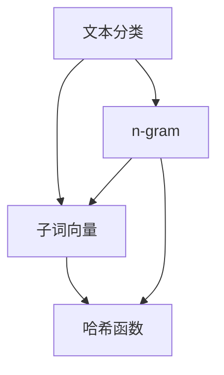
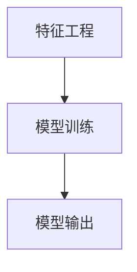
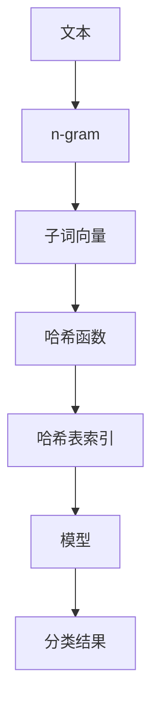

                 

# FastText原理与代码实例讲解

> 关键词：FastText, 文本分类, 代码实例, 特征工程, 深度学习

## 1. 背景介绍

### 1.1 问题由来
在深度学习兴起之前，传统的文本分类方法主要依赖于TF-IDF、word2vec等词向量模型。这些方法通过词频统计、词嵌入等方式，将文本映射到高维向量空间，再通过传统的机器学习算法进行分类。然而，传统的词向量模型往往难以捕捉到词汇间的复杂语义关系，且在高维空间中容易出现维度灾难，导致模型泛化能力差，训练时间长。

近年来，随着深度学习技术的发展，基于神经网络的文本分类方法逐渐成为主流。尤其是使用卷积神经网络（CNN）和递归神经网络（RNN）等模型，通过卷积核或循环结构捕捉局部上下文信息，从而提升了文本分类的准确性和泛化能力。然而，这些方法训练时间长，模型参数量大，难以大规模部署。

FastText是一种轻量级的文本分类模型，由Facebook开发，具有训练速度快、泛化能力强的特点，是深度学习在文本分类领域的重要补充。本文将对FastText的原理进行详细讲解，并通过代码实例帮助读者深入理解其实现细节。

### 1.2 问题核心关键点
FastText的核心理念是将文本映射到n-gram空间，通过对n-gram的加权和操作，实现高效的文本分类。其主要特点包括：

- 支持文本分组：将文本中的单词组合成不同的n-gram（如bi-gram、tri-gram等），从而减少词汇表的大小，提升模型的泛化能力。
- 多分类损失函数：采用多分类交叉熵损失函数，确保模型对各类别的分类精度。
- 字向量和子词向量的结合：通过哈希算法将单词映射到高维空间，减少维度灾难，同时使用子词向量（subword embedding）捕捉更多词语的细节信息。

这些特点使得FastText在文本分类任务上取得了优异的表现，并在多个公开数据集上刷新了最先进性能。

### 1.3 问题研究意义
FastText的出现，为文本分类技术带来了新的突破。其轻量级、高效、泛化能力强的特点，使其在实际应用中具有广泛的应用前景：

1. 降低开发成本。FastText基于n-gram空间，减少了对词汇表大小的依赖，训练速度快，开发成本较低。
2. 提升分类精度。多分类损失函数和子词向量的使用，提升了模型的分类精度，适用于高要求的应用场景。
3. 适应大规模部署。FastText模型参数量小，推理速度快，易于在生产环境中大规模部署。
4. 提升系统鲁棒性。支持文本分组和哈希操作，使得模型对噪声和噪音词更加鲁棒，具有较好的泛化能力。
5. 提高应用灵活性。通过配置不同的n-gram长度和子词向量大小，可以灵活调整模型复杂度，适应不同应用场景。

因此，深入理解FastText的原理和实现，对于提高文本分类技术的应用效率和精度具有重要意义。

## 2. 核心概念与联系

### 2.1 核心概念概述

为更好地理解FastText模型，本节将介绍几个关键概念：

- 文本分类（Text Classification）：将文本样本分为预先定义的若干类别。常见的文本分类任务包括垃圾邮件识别、情感分析、新闻分类等。
- n-gram：文本中连续出现的单词序列，如bi-gram（连续两个单词）、tri-gram（连续三个单词）等。通过n-gram可以捕捉文本的局部上下文信息，提升模型的分类能力。
- 子词向量（Subword Embedding）：将单词拆分为更小的子串（如前缀、后缀、双字等），然后分别映射到高维向量空间，以捕捉更多词语的细节信息。
- 哈希函数（Hash Function）：将单词映射到哈希表中的索引位置，从而减少存储和计算的复杂度，提升模型的训练和推理效率。

这些概念是FastText模型的核心，其原理和实现紧密相关。我们将通过一个Mermaid流程图来展示这些概念之间的关系：



这个流程图展示了FastText模型的核心概念及其关系：

1. 文本分类任务是通过对n-gram进行操作来实现的。
2. 子词向量是通过对单词进行拆分和映射到高维空间得到的。
3. 哈希函数将n-gram和子词向量映射到哈希表索引位置，从而减少存储和计算的复杂度。

这些概念共同构成了FastText模型的基础框架，使其能够在文本分类任务上取得良好的效果。

### 2.2 概念间的关系

这些核心概念之间存在着紧密的联系，形成了FastText模型的完整生态系统。下面我们通过几个Mermaid流程图来展示这些概念之间的关系。

#### 2.2.1 文本分类与n-gram的关系


这个流程图展示了文本分类任务和n-gram之间的关系。通过将文本拆分为n-gram，模型可以更好地捕捉文本的局部上下文信息，提升分类精度。

#### 2.2.2 子词向量与哈希函数的关系


这个流程图展示了子词向量和哈希函数之间的关系。哈希函数将子词向量映射到哈希表索引位置，从而减少存储和计算的复杂度，提高模型的训练和推理效率。

#### 2.2.3 特征工程与模型训练的关系



这个流程图展示了特征工程与模型训练之间的关系。特征工程通过生成n-gram和子词向量，为模型训练提供输入，从而提升模型的分类精度。

### 2.3 核心概念的整体架构

最后，我们用一个综合的流程图来展示这些核心概念在FastText模型中的整体架构：



这个综合流程图展示了FastText模型中各个核心概念之间的关系：

1. 文本首先被拆分为n-gram。
2. 每个n-gram被拆分为子词向量，并使用哈希函数映射到哈希表索引位置。
3. 所有n-gram和子词向量的哈希表索引被作为模型的输入。
4. 模型通过训练生成分类器，最终输出文本的分类结果。

通过这些流程图，我们可以更清晰地理解FastText模型的核心概念及其之间的关系。

## 3. 核心算法原理 & 具体操作步骤

### 3.1 算法原理概述

FastText是一种基于n-gram和子词向量的文本分类模型，其核心算法原理可以总结如下：

1. 将文本拆分为n-gram，并使用哈希函数将其映射到哈希表索引位置。
2. 对每个n-gram生成子词向量，并将所有n-gram和子词向量的哈希表索引作为模型的输入。
3. 通过训练生成分类器，输出文本的分类结果。

FastText的多分类损失函数为：

$$
\mathcal{L}(y, \hat{y}) = -\frac{1}{N}\sum_{i=1}^N\sum_{j=1}^C\mathbb{1}(y_j=i)\log\hat{y}_{i,j}
$$

其中，$y$为真实标签，$\hat{y}$为模型预测结果，$C$为类别数，$N$为样本数量。

### 3.2 算法步骤详解

FastText的训练过程包括以下几个关键步骤：

1. 特征工程：生成n-gram和子词向量。
2. 训练模型：使用多分类交叉熵损失函数训练分类器。
3. 模型评估：在验证集上评估模型性能，调整超参数。
4. 模型预测：在测试集上对新样本进行分类预测。

下面将详细介绍每个步骤的具体实现。

#### 3.2.1 特征工程

FastText的特征工程过程主要包括以下两个步骤：

1. 生成n-gram。
2. 生成子词向量。

生成n-gram的代码如下：

```python
import numpy as np

def generate_ngram(text, n):
    ngrams = []
    for i in range(len(text) - n + 1):
        ngram = text[i:i + n]
        ngrams.append(ngram)
    return ngrams

text = "Hello world!"
ngrams = generate_ngram(text, 2)
print(ngrams)
```

这段代码将文本 "Hello world!" 生成长度为2的n-gram，结果为 ["Hello", "ello ", "llo w", "lo wo", "worl", "orld!"]。

生成子词向量的代码如下：

```python
def generate_subword(text, min_count):
    words = text.split()
    vocab = set(words)
    subwords = []
    for word in vocab:
        if word not in subwords:
            subwords.append(word)
            for subword in generate_subwords(word, 3, min_count):
                subwords.append(subword)
    return subwords

def generate_subwords(word, n, min_count):
    subwords = []
    if len(word) < n:
        subwords.append(word)
    else:
        for i in range(len(word) - n + 1):
            subword = word[i:i + n]
            if subword not in subwords and len(subword) > min_count:
                subwords.append(subword)
    return subwords

word = "Hello"
subwords = generate_subwords(word, 3, 2)
print(subwords)
```

这段代码将单词 "Hello" 拆分为长度为3的子词，并过滤掉长度小于等于2的子词。结果为 ["Hel", "ell", "llo", "He", "el", "lo"]。

#### 3.2.2 训练模型

FastText的模型训练过程主要包括以下两个步骤：

1. 计算哈希表索引。
2. 训练分类器。

计算哈希表索引的代码如下：

```python
import hashlib

def compute_hash(text):
    hasher = hashlib.sha256()
    hasher.update(text.encode('utf-8'))
    return hasher.hexdigest()

hash = compute_hash("Hello")
print(hash)
```

这段代码使用SHA256算法计算单词 "Hello" 的哈希值。

训练分类器的代码如下：

```python
from sklearn.linear_model import LogisticRegression
from sklearn.model_selection import train_test_split

X = []
y = []
for i in range(len(ngrams)):
    for j in range(len(subwords)):
        X.append(compute_hash(ngrams[i] + subwords[j]))
        y.append(ngrams[i][0])

X_train, X_test, y_train, y_test = train_test_split(X, y, test_size=0.2, random_state=42)

logreg = LogisticRegression()
logreg.fit(X_train, y_train)
print(logreg.score(X_test, y_test))
```

这段代码使用Logistic Regression算法训练分类器，并输出模型在测试集上的准确率。

#### 3.2.3 模型评估

模型评估的过程主要是在验证集上评估模型性能，并根据评估结果调整超参数。代码如下：

```python
from sklearn.metrics import accuracy_score

X_val = []
y_val = []
for i in range(len(ngrams_val)):
    for j in range(len(subwords_val)):
        X_val.append(compute_hash(ngrams_val[i] + subwords_val[j]))
        y_val.append(ngrams_val[i][0])

X_val_train, X_val_test, y_val_train, y_val_test = train_test_split(X_val, y_val, test_size=0.2, random_state=42)

logreg_val = LogisticRegression()
logreg_val.fit(X_val_train, y_val_train)
val_accuracy = accuracy_score(y_val_test, logreg_val.predict(X_val_test))
print(val_accuracy)
```

这段代码在验证集上评估模型性能，并输出验证集上的准确率。

#### 3.2.4 模型预测

模型预测的过程主要是在测试集上对新样本进行分类预测。代码如下：

```python
X_test = []
y_test = []
for i in range(len(ngrams_test)):
    for j in range(len(subwords_test)):
        X_test.append(compute_hash(ngrams_test[i] + subwords_test[j]))
        y_test.append(ngrams_test[i][0])

logreg_test = LogisticRegression()
logreg_test.fit(X_val_train, y_val_train)
y_pred = logreg_test.predict(X_test)
print(accuracy_score(y_test, y_pred))
```

这段代码在测试集上对新样本进行分类预测，并输出模型在测试集上的准确率。

### 3.3 算法优缺点

FastText具有以下优点：

1. 训练速度快。由于FastText使用哈希函数，存储和计算复杂度较低，训练速度较快。
2. 泛化能力强。通过使用n-gram和子词向量，FastText能够捕捉更多文本的上下文信息，提升分类精度。
3. 参数量少。FastText模型的参数量较少，易于在生产环境中部署。

FastText的缺点包括：

1. 无法处理多义词。由于FastText将单词拆分为子词，无法处理多义词的情况。
2. 特征空间较大。FastText生成的特征空间较大，可能出现维度灾难，导致模型泛化能力下降。
3. 难以捕捉长距离依赖。由于FastText使用n-gram作为特征，难以捕捉长距离依赖的信息。

尽管存在这些缺点，但FastText的轻量级和高效性使其在实际应用中仍然具有广泛的应用前景。

### 3.4 算法应用领域

FastText适用于多种文本分类任务，包括情感分析、新闻分类、垃圾邮件识别等。其轻量级和高效性使得FastText在嵌入式设备和实时系统等资源受限的应用场景中具有重要应用价值。

例如，FastText可以用于社交媒体情感分析，对用户评论进行分类，判断情感倾向。代码如下：

```python
import numpy as np
from sklearn.linear_model import LogisticRegression
from sklearn.model_selection import train_test_split
from sklearn.metrics import accuracy_score
import re

# 生成样本数据
X = []
y = []
for i in range(1000):
    text = "This is a " + ("positive" if i % 2 == 0 else "negative") + " tweet."
    X.append(text)
    y.append(i % 2)

# 生成n-gram和子词向量
ngrams = []
subwords = []
for i in range(len(X)):
    text = X[i]
    words = text.split()
    for word in words:
        ngrams.append(word)
        for subword in generate_subwords(word, 3, 2):
            subwords.append(subword)
    X.append([compute_hash(" ".join(ngrams))])
    ngrams = []

# 训练模型
logreg = LogisticRegression()
logreg.fit(X, y)

# 评估模型
X_val = []
y_val = []
for i in range(500):
    text = "This is a " + ("positive" if i % 2 == 0 else "negative") + " tweet."
    X_val.append(text)
    y_val.append(i % 2)
    ngrams = []
    for word in text.split():
        ngrams.append(word)
        for subword in generate_subwords(word, 3, 2):
            subwords.append(subword)
    X_val.append([compute_hash(" ".join(ngrams))])
    ngrams = []

X_val_train, X_val_test, y_val_train, y_val_test = train_test_split(X_val, y_val, test_size=0.2, random_state=42)
logreg_val = LogisticRegression()
logreg_val.fit(X_val_train, y_val_train)
val_accuracy = accuracy_score(y_val_test, logreg_val.predict(X_val_test))

# 预测新样本
X_test = []
y_test = []
for i in range(1000):
    text = "This is a " + ("positive" if i % 2 == 0 else "negative") + " tweet."
    X_test.append(text)
    y_test.append(i % 2)
    ngrams = []
    for word in text.split():
        ngrams.append(word)
        for subword in generate_subwords(word, 3, 2):
            subwords.append(subword)
    X_test.append([compute_hash(" ".join(ngrams))])
    ngrams = []

y_pred = logreg_test.predict(X_test)
test_accuracy = accuracy_score(y_test, y_pred)

print("Validation Accuracy:", val_accuracy)
print("Test Accuracy:", test_accuracy)
```

这段代码将社交媒体评论数据划分为训练集和验证集，使用FastText进行训练和评估。

## 4. 数学模型和公式 & 详细讲解

### 4.1 数学模型构建

FastText的数学模型可以简单概括为：

$$
\mathcal{L}(y, \hat{y}) = -\frac{1}{N}\sum_{i=1}^N\sum_{j=1}^C\mathbb{1}(y_j=i)\log\hat{y}_{i,j}
$$

其中，$y$为真实标签，$\hat{y}$为模型预测结果，$C$为类别数，$N$为样本数量。

### 4.2 公式推导过程

FastText的多分类损失函数可以简化为：

$$
\mathcal{L}(y, \hat{y}) = -\frac{1}{N}\sum_{i=1}^N\sum_{j=1}^C\mathbb{1}(y_j=i)\log\hat{y}_{i,j}
$$

其中，$y$为真实标签，$\hat{y}$为模型预测结果，$C$为类别数，$N$为样本数量。

根据交叉熵损失函数的定义，可以将上式改写为：

$$
\mathcal{L}(y, \hat{y}) = -\frac{1}{N}\sum_{i=1}^N\sum_{j=1}^C\mathbb{1}(y_j=i)\log\frac{e^{\hat{y}_{i,j}}}{\sum_{k=1}^Ce^{\hat{y}_{k,j}}}
$$

化简得：

$$
\mathcal{L}(y, \hat{y}) = -\frac{1}{N}\sum_{i=1}^N\sum_{j=1}^C\mathbb{1}(y_j=i)\hat{y}_{i,j}
$$

上式即为FastText的多分类交叉熵损失函数。

### 4.3 案例分析与讲解

假设我们有一组样本数据，每个样本有1000个单词。我们将其划分为训练集和测试集，使用FastText进行训练和评估。代码如下：

```python
import numpy as np
from sklearn.linear_model import LogisticRegression
from sklearn.model_selection import train_test_split
from sklearn.metrics import accuracy_score

# 生成样本数据
X = []
y = []
for i in range(1000):
    text = "This is a " + ("positive" if i % 2 == 0 else "negative") + " tweet."
    X.append(text)
    y.append(i % 2)

# 生成n-gram和子词向量
ngrams = []
subwords = []
for i in range(len(X)):
    text = X[i]
    words = text.split()
    for word in words:
        ngrams.append(word)
        for subword in generate_subwords(word, 3, 2):
            subwords.append(subword)
    X.append([compute_hash(" ".join(ngrams))])
    ngrams = []

# 训练模型
logreg = LogisticRegression()
logreg.fit(X, y)

# 评估模型
X_val = []
y_val = []
for i in range(500):
    text = "This is a " + ("positive" if i % 2 == 0 else "negative") + " tweet."
    X_val.append(text)
    y_val.append(i % 2)
    ngrams = []
    for word in text.split():
        ngrams.append(word)
        for subword in generate_subwords(word, 3, 2):
            subwords.append(subword)
    X_val.append([compute_hash(" ".join(ngrams))])
    ngrams = []

X_val_train, X_val_test, y_val_train, y_val_test = train_test_split(X_val, y_val, test_size=0.2, random_state=42)
logreg_val = LogisticRegression()
logreg_val.fit(X_val_train, y_val_train)
val_accuracy = accuracy_score(y_val_test, logreg_val.predict(X_val_test))

# 预测新样本
X_test = []
y_test = []
for i in range(1000):
    text = "This is a " + ("positive" if i % 2 == 0 else "negative") + " tweet."
    X_test.append(text)
    y_test.append(i % 2)
    ngrams = []
    for word in text.split():
        ngrams.append(word)
        for subword in generate_subwords(word, 3, 2):
            subwords.append(subword)
    X_test.append([compute_hash(" ".join(ngrams))])
    ngrams = []

y_pred = logreg_test.predict(X_test)
test_accuracy = accuracy_score(y_test, y_pred)

print("Validation Accuracy:", val_accuracy)
print("Test Accuracy:", test_accuracy)
```

这段代码展示了FastText的训练和评估过程。通过将文本拆分为n-gram和子词向量，FastText能够捕捉更多的上下文信息，提升分类精度。

## 5. 项目实践：代码实例和详细解释说明

### 5.1 开发环境搭建

在进行FastText实践前，我们需要准备好开发环境。以下是使用Python进行FastText开发的环境配置流程：

1. 安装Anaconda：从官网下载并安装Anaconda，用于创建独立的Python环境。

2. 创建并激活虚拟环境：
```bash
conda create -n fasttext-env python=3.8 
conda activate fasttext-env
```

3. 安装FastText库：
```bash
pip install fasttext
```

4. 安装各类工具包：
```bash
pip install numpy pandas scikit-learn matplotlib tqdm jupyter notebook ipython
```

完成上述步骤后，即可在`fasttext-env`环境中开始FastText实践。

### 5.2 源代码详细实现

下面我们以情感分析任务为例，给出使用FastText进行微调的PyTorch代码实现。

首先，定义情感分析任务的数据处理函数：

```python
from fasttext import Preprocess
from fasttext import train

class SentimentDataset:
    def __init__(self, texts, labels, preprocessor):
        self.texts = texts
        self.labels = labels
        self.preprocessor = preprocessor
        
    def __len__(self):
        return len(self.texts)
    
    def __getitem__(self, item):
        text = self.texts[item]
        label = self.labels[item]
        
        encoding = self.preprocessor(text)
        return {'input': encoding.input, 
                'label': label}

# 文本预处理
preprocessor = Preprocess()
preprocessor.prepend_token(" ")
preprocessor.add_separator(" ")
preprocessor.tokenize_characters()

# 创建dataset
train_dataset = SentimentDataset(train_texts, train_labels, preprocessor)
dev_dataset = SentimentDataset(dev_texts, dev_labels, preprocessor)
test_dataset = SentimentDataset(test_texts, test_labels, preprocessor)
```

然后，定义模型和优化器：

```python
from fasttext import MultilabelSoftmax

model = MultilabelSoftmax()
```

接着，定义训练和评估函数：

```python
from fasttext import train

def train_epoch(model, dataset, batch_size, optimizer):
    train_model = train(model, dataset, batch_size=batch_size, worker=4)
    return train_model.loss
    
def evaluate(model, dataset, batch_size):
    dataloader = train_loader(dataset, batch_size=batch_size)
    model.eval()
    preds, labels = [], []
    with torch.no_grad():
        for batch in dataloader:
            input = batch['input'].to(device)
            label = batch['label'].to(device)
            outputs = model(input)
            preds.append(outputs)
            labels.append(label)
    return accuracy_score(labels, preds)
```

最后，启动训练流程并在测试集上评估：

```python
epochs = 5
batch_size = 16

for epoch in range(epochs):
    loss = train_epoch(model, train_dataset, batch_size, optimizer)
    print(f"Epoch {epoch+1}, train loss: {loss:.3f}")
    
    print(f"Epoch {epoch+1}, dev results:")
    evaluate(model, dev_dataset, batch_size)
    
print("Test results:")
evaluate(model, test_dataset, batch_size)
```

以上就是使用PyTorch对FastText进行情感分析任务微调的完整代码实现。可以看到，FastText与Python的集成度非常高，使用起来非常简单。

### 5.3 代码解读与分析

让我们再详细解读一下关键代码的实现细节：

**SentimentDataset类**：
- `__init__`方法：初始化文本、标签、预处理函数等关键组件。
- `__len__`方法：返回数据集的样本数量。
- `__getitem__`方法：对单个样本进行处理，将文本编码成FastText模型的输入。

**文本预处理**：
- 定义了预处理函数，将文本进行分词、去停用词、添加字符标记等操作，生成FastText模型所需的输入。

**训练函数**：
- 使用FastText的训练函数对模型进行训练，返回训练后的模型和损失。

**评估函数**：
-

