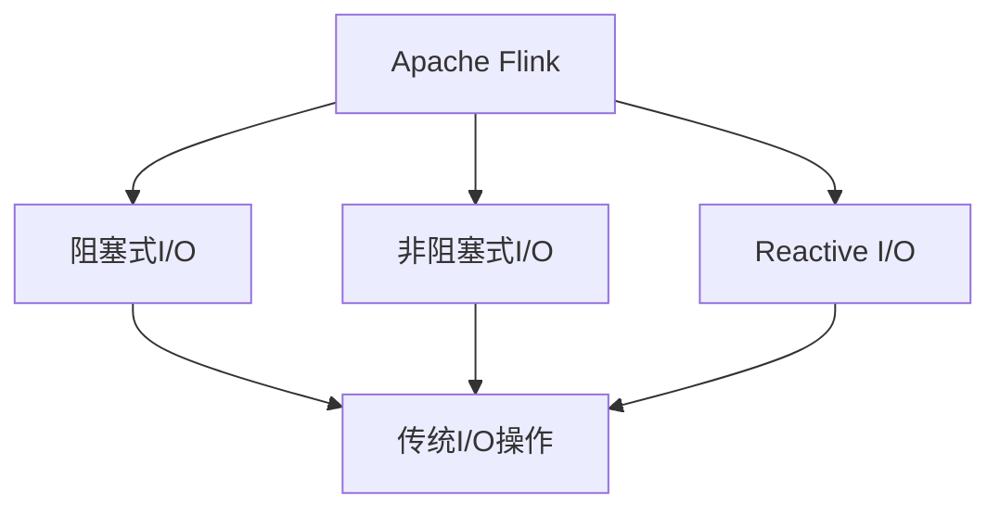
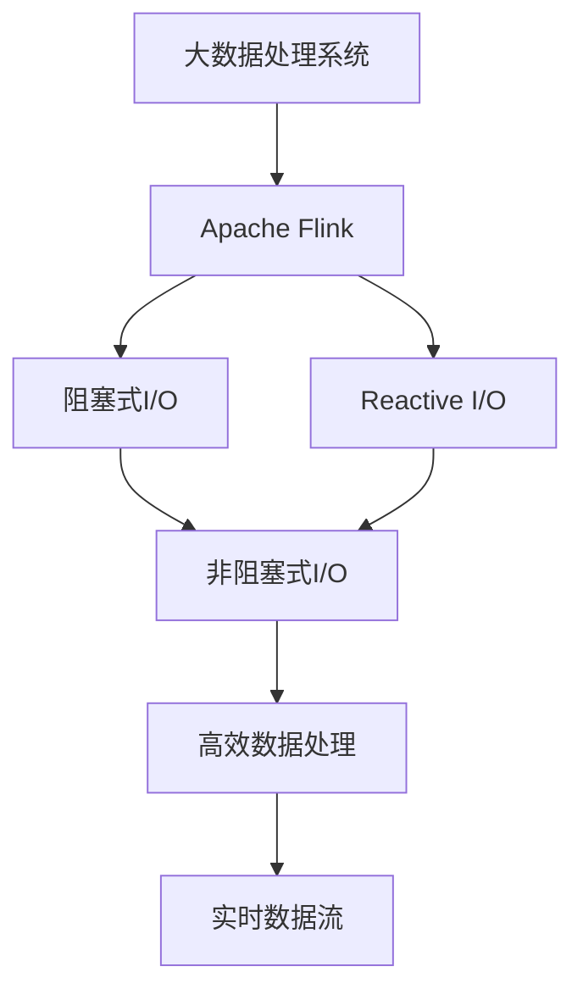

                 

## 1. 背景介绍

### 1.1 问题由来

在大数据处理系统中，高效的数据输入输出（I/O）是一个关键环节。传统的批处理框架如Hadoop和Spark虽然成熟稳定，但在实时数据处理上显得力不从心。为此，Flink应运而生，通过事件驱动、状态持久化等技术，实现了端到端的实时流处理能力。然而，Flink在处理高并发数据流时，I/O性能成为瓶颈，亟需改进。

### 1.2 问题核心关键点

Flink的I/O性能瓶颈主要集中在以下几个方面：

1. **阻塞式I/O**：传统的文件读写操作，如HDFS、本地文件系统等，都是阻塞式的，即读写操作一旦发起，便无法执行其他任务，导致系统效率低下。

2. **单线程处理**：Flink在处理I/O操作时，通常采用单线程的方式，未能充分利用多核CPU的优势，限制了I/O处理能力。

3. **资源竞争**：I/O操作需要频繁访问内存和磁盘，而这些资源往往成为系统性能瓶颈，导致其他任务无法充分利用资源。

### 1.3 问题研究意义

研究Flink Async I/O方法，对于提升Flink的I/O性能，优化实时数据处理，加速大数据应用开发，具有重要意义：

1. 提升实时数据处理能力。通过异步I/O，Flink可以更高效地处理高并发数据流，加速实时计算。
2. 降低数据处理延迟。异步I/O可以显著减少I/O操作的延迟，提高系统响应速度。
3. 提高系统吞吐量。异步I/O通过多线程并行处理，充分利用CPU资源，提升数据处理速度。
4. 优化资源利用。通过异步读写，减少I/O操作的资源占用，提高系统整体资源利用率。
5. 为大数据应用开发提供支持。异步I/O的实现，使得Flink能够处理更多复杂的数据流处理任务，推动大数据应用的发展。

## 2. 核心概念与联系

### 2.1 核心概念概述

为更好地理解Flink Async I/O原理，本节将介绍几个关键概念：

- **Flink**：Apache Flink是一款高性能、分布式、内存驱动的大数据处理框架，支持批处理、流处理和图处理等多种计算模式。
- **阻塞式I/O**：传统的文件读写操作，如HDFS、本地文件系统等，都是阻塞式的，即读写操作一旦发起，便无法执行其他任务，导致系统效率低下。
- **非阻塞式I/O**：通过使用异步读写操作，可以在I/O操作进行的同时，执行其他任务，从而提升系统效率。
- **Reactive I/O**：基于事件驱动的异步I/O模型，通过事件循环器（Event Loop）管理I/O操作，实现高效的数据处理。

### 2.2 核心概念之间的关系

这些核心概念之间的逻辑关系可以通过以下Mermaid流程图来展示：



这个流程图展示了大数据处理框架Flink与异步I/O技术之间的关系：

1. Flink利用异步I/O技术，优化了传统的阻塞式I/O操作。
2. 非阻塞式I/O和Reactive I/O是异步I/O的两种实现方式，可以在Flink中混合使用。
3. 通过异步I/O技术，Flink可以更高效地处理高并发数据流，加速实时计算。

### 2.3 核心概念的整体架构

最后，我们用一个综合的流程图来展示这些核心概念在大数据处理中的整体架构：



这个综合流程图展示了大数据处理系统、Flink、异步I/O技术以及高效数据处理之间的关系：

1. Flink是大数据处理系统的核心引擎，支持多种计算模式。
2. Flink通过优化传统的阻塞式I/O操作，引入非阻塞式I/O和Reactive I/O技术，提升了数据处理效率。
3. 通过异步I/O技术，Flink可以更高效地处理高并发数据流，加速实时计算。

这些核心概念共同构成了Flink异步I/O技术的完整生态系统，为其在大数据处理中的应用提供了坚实的基础。

## 3. 核心算法原理 & 具体操作步骤
### 3.1 算法原理概述

Flink的Async I/O技术是基于事件驱动的Reactive I/O模型实现的。其核心思想是：将I/O操作封装成事件，通过事件循环器（Event Loop）管理I/O操作，实现高效的异步读写。

具体而言，Flink通过以下步骤实现异步I/O：

1. **事件驱动模型**：将I/O操作封装成事件，事件循环器负责管理事件队列。
2. **事件处理**：事件循环器从事件队列中获取事件，执行I/O操作。
3. **异步回调**：I/O操作完成后，通过回调函数通知事件循环器，事件循环器继续处理下一个事件。

### 3.2 算法步骤详解

Flink的异步I/O实现涉及以下关键步骤：

1. **事件封装**：将I/O操作封装成事件，事件中包含操作类型、操作参数等关键信息。
2. **事件队列**：将所有事件封装到事件队列中，由事件循环器管理。
3. **事件处理**：事件循环器从事件队列中获取事件，执行I/O操作。
4. **异步回调**：I/O操作完成后，通过回调函数通知事件循环器，事件循环器继续处理下一个事件。

以文件读取为例，具体步骤如下：

**Step 1: 事件封装**
```python
def read_async(file_path):
    event = EventType.READ(file_path)
    return event
```

**Step 2: 事件队列**
```python
event_queue.add(event)
```

**Step 3: 事件处理**
```python
def event_handler(event):
    if event.type == EventType.READ:
        with open(event.file_path, 'rb') as file:
            data = file.read()
            callback(event.file_path, data)
```

**Step 4: 异步回调**
```python
def callback(file_path, data):
    # 处理读取的数据
    event_queue.remove(event)
```

### 3.3 算法优缺点

Flink的异步I/O方法具有以下优点：

1. **提升系统效率**：通过事件驱动，I/O操作可以在后台异步进行，提高了系统响应速度和吞吐量。
2. **减少资源竞争**：异步I/O减少了对内存和磁盘的频繁访问，降低了资源竞争。
3. **提高资源利用率**：通过多线程并行处理，充分利用了CPU资源。
4. **支持复杂数据结构**：异步I/O支持处理复杂的数据结构，如Kryo序列化等，提升了处理效率。

同时，异步I/O也存在以下缺点：

1. **编程复杂度较高**：异步I/O需要封装事件、管理事件队列，增加了编程复杂度。
2. **内存占用较高**：异步I/O操作需要使用内存缓存数据，可能占用较多内存资源。
3. **回调处理开销**：异步I/O通过回调函数处理操作结果，可能增加额外的开销。

### 3.4 算法应用领域

Flink的异步I/O方法广泛应用于各种大数据处理场景，如实时数据流处理、批处理、图处理等。

1. **实时数据流处理**：在实时数据流处理中，异步I/O可以显著提升系统响应速度和吞吐量。
2. **批处理**：在批处理中，异步I/O可以优化I/O操作，提高数据处理效率。
3. **图处理**：在图处理中，异步I/O可以处理大规模的图数据，提升计算性能。

## 4. 数学模型和公式 & 详细讲解 & 举例说明
### 4.1 数学模型构建

Flink的异步I/O方法基于事件驱动的Reactive I/O模型，其数学模型可以抽象为事件循环器与事件队列之间的交互。

设事件循环器为 $E$，事件队列为 $Q$，事件为 $E_t$，事件类型和参数分别为 $T$ 和 $P$。事件循环器的处理过程可以表示为：

1. 从事件队列中获取事件 $E_t$。
2. 执行事件 $E_t$ 对应的操作 $T(P)$。
3. 通过回调函数处理操作结果，更新事件队列 $Q$。

用公式表示为：

$$
E_t = \text{poll}(Q)
$$

$$
T(P) = \text{execute}(E_t)
$$

$$
Q = \text{update}(Q, E_t)
$$

### 4.2 公式推导过程

以下以文件读取为例，推导异步I/O操作的事件处理过程。

假设文件读取操作封装成事件 $E_t = (file_path, 0)$，事件循环器从队列中获取事件，执行文件读取操作 $T(P) = read(file_path)$，得到数据 $data$。事件循环器通过回调函数更新事件队列 $Q = update(Q, (file_path, data))$。

具体推导如下：

**Step 1: 事件封装**
$$
E_t = (file_path, 0)
$$

**Step 2: 事件处理**
$$
data = read(file_path)
$$

**Step 3: 异步回调**
$$
Q = update(Q, (file_path, data))
$$

其中，$update(Q, (file_path, data))$ 表示将 $(file_path, data)$ 事件插入到队列 $Q$ 中。

### 4.3 案例分析与讲解

以一个简单的文件读取为例，展示Flink异步I/O的实现过程。

**Step 1: 事件封装**
```python
def read_async(file_path):
    event = EventType.READ(file_path)
    return event
```

**Step 2: 事件队列**
```python
event_queue.add(event)
```

**Step 3: 事件处理**
```python
def event_handler(event):
    if event.type == EventType.READ:
        with open(event.file_path, 'rb') as file:
            data = file.read()
            callback(event.file_path, data)
```

**Step 4: 异步回调**
```python
def callback(file_path, data):
    # 处理读取的数据
    event_queue.remove(event)
```

通过这些步骤，可以实现文件读取的异步I/O处理。事件驱动和异步回调使得Flink可以更高效地处理高并发数据流，加速实时计算。

## 5. 项目实践：代码实例和详细解释说明
### 5.1 开发环境搭建

在进行异步I/O实践前，我们需要准备好开发环境。以下是使用Python进行Flink开发的环境配置流程：

1. 安装Apache Flink：从官网下载并安装Flink，确保版本与Hadoop兼容。
2. 安装依赖包：
```bash
pip install apache-flink
```

3. 配置Flink：在 $FLINK_HOME/conf/ 目录下配置YARN、Hadoop等依赖。

完成上述步骤后，即可在Flink环境中开始异步I/O实践。

### 5.2 源代码详细实现

下面我们以文件读取为例，给出使用Flink进行异步I/O的Python代码实现。

首先，定义异步读取的函数：

```python
from pyflink.datastream import StreamExecutionEnvironment
from pyflink.functions import ProcessFunction

def read_async(file_path):
    event = EventType.READ(file_path)
    return event

class ReadAsyncFile(ProcessFunction):
    def process_element(self, value, ctx):
        event = read_async(value)
        ctx.register_event(event)
```

然后，定义事件处理函数：

```python
class EventType:
    READ = 1

def event_handler(event):
    if event.type == EventType.READ:
        with open(event.file_path, 'rb') as file:
            data = file.read()
            callback(event.file_path, data)

class ReadAsyncFile(ProcessFunction):
    def process_element(self, value, ctx):
        event = read_async(value)
        ctx.register_event(event)
```

最后，启动Flink任务：

```python
env = StreamExecutionEnvironment.get_execution_environment()
env.add_source(ReadAsyncFile())
env.execute()
```

### 5.3 代码解读与分析

让我们再详细解读一下关键代码的实现细节：

**EventType类**：
- 定义了事件类型，这里只使用了一个READ类型。

**read_async函数**：
- 封装异步I/O操作，返回一个事件对象。

**ReadAsyncFile类**：
- 继承自ProcessFunction，用于在Flink中注册事件。
- `process_element`方法：将输入数据封装成事件，并将其注册到事件循环器中。

**event_handler函数**：
- 处理事件，并调用回调函数。

**callback函数**：
- 处理读取的数据，并从事件队列中移除已处理的事件。

通过这些步骤，可以实现文件读取的异步I/O处理。需要注意的是，Flink中的事件驱动模型需要开发者自行封装事件和处理回调，增加了编程复杂度。但这种事件驱动的方式，使得Flink可以更高效地处理高并发数据流，加速实时计算。

## 6. 实际应用场景
### 6.1 智能推荐系统

Flink的异步I/O方法在智能推荐系统中具有重要应用价值。推荐系统需要实时处理用户行为数据，并快速响应用户的查询请求。异步I/O可以显著提升推荐系统的高并发处理能力，加速推荐结果的生成。

在推荐系统中，异步I/O可以应用于以下场景：

1. **实时数据流处理**：从用户行为日志中实时提取数据，进行模型训练和推荐计算。
2. **用户画像构建**：从多个数据源异步读取用户画像数据，构建综合用户画像。
3. **推荐结果生成**：异步读取推荐数据，生成推荐结果并返回给用户。

通过异步I/O技术，Flink可以高效处理高并发数据流，加速推荐结果的生成，提升用户体验。

### 6.2 实时数据监控

Flink的异步I/O方法在实时数据监控系统中同样具有重要应用价值。实时数据监控系统需要实时处理各类告警数据，并及时通知相关人员。异步I/O可以显著提升监控系统的高并发处理能力，加速告警信息的处理和传递。

在监控系统中，异步I/O可以应用于以下场景：

1. **告警数据收集**：从多个数据源异步读取告警数据，进行综合分析。
2. **告警信息处理**：异步写入告警信息，快速通知相关人员。
3. **告警数据存储**：异步写入告警数据，避免数据丢失。

通过异步I/O技术，Flink可以高效处理高并发数据流，加速告警信息的处理和传递，确保系统及时响应各类告警。

### 6.3 实时数据清洗

Flink的异步I/O方法在实时数据清洗系统中同样具有重要应用价值。实时数据清洗系统需要实时处理大量数据，并进行数据清洗和转换。异步I/O可以显著提升数据清洗系统的处理能力，加速数据清洗过程。

在数据清洗系统中，异步I/O可以应用于以下场景：

1. **数据读取**：从多种数据源异步读取数据，进行数据清洗和转换。
2. **数据写入**：异步写入清洗后的数据，避免数据丢失。
3. **数据同步**：异步同步数据到其他系统，确保数据一致性。

通过异步I/O技术，Flink可以高效处理高并发数据流，加速数据清洗和转换过程，确保数据的一致性和完整性。

## 7. 工具和资源推荐
### 7.1 学习资源推荐

为了帮助开发者系统掌握Flink异步I/O技术，这里推荐一些优质的学习资源：

1. **《Flink权威指南》**：由Flink官方编写，深入浅出地介绍了Flink的架构、开发和运维全流程，包括异步I/O在内的关键技术。

2. **Apache Flink官方文档**：Flink官方文档提供了详尽的API文档和示例代码，是学习Flink异步I/O技术的必备资料。

3. **Flink实战教程**：众多开发者分享的实战教程，涵盖Flink的各个方面，包括异步I/O在内的技术实践。

4. **Flink社区**：Flink社区提供了丰富的学习资源和社区支持，包括代码示例、问题解答等。

通过对这些资源的学习实践，相信你一定能够快速掌握Flink异步I/O技术的精髓，并用于解决实际的Flink问题。

### 7.2 开发工具推荐

高效的开发离不开优秀的工具支持。以下是几款用于Flink异步I/O开发的常用工具：

1. **PyFlink**：Flink的Python API，提供便捷的API接口，方便Python开发者使用Flink进行开发。
2. **Flink连通器**：Flink的可视化和监控工具，可以帮助开发者实时监控Flink任务的运行状态，及时发现和解决问题。
3. **Apache Spark**：Flink的亲兄弟，与Flink深度集成，可以方便地在Spark环境中使用Flink的异步I/O技术。
4. **Kafka Connect**：Kafka与Flink深度集成，可以实现流数据的实时转换和异步I/O。
5. **Flume**：Apache Flink的官方数据接入工具，可以与Flink异步I/O技术无缝集成，实现高并发数据流处理。

合理利用这些工具，可以显著提升Flink异步I/O任务的开发效率，加快创新迭代的步伐。

### 7.3 相关论文推荐

Flink异步I/O方法的研究源于学界的持续研究。以下是几篇奠基性的相关论文，推荐阅读：

1. **"Flink: An Advanced Distributed Stream Processing System"**：Flink的开创性论文，介绍了Flink的架构和关键技术，包括异步I/O在内的关键组件。

2. **"Apache Flink: A Distributed Stream Processing Framework"**：Flink官方文档，提供了详尽的API文档和示例代码，是学习Flink异步I/O技术的必备资料。

3. **"Reactive I/O: The Next Generation of Apache Flink I/O"**：Flink社区的官方博客，介绍了Flink的异步I/O技术的实现原理和应用场景。

4. **"Stream Processing with Apache Flink: Real-time Computing on Streams"**：Apache Flink官方指南，介绍了Flink的流处理技术和异步I/O技术。

这些论文代表了大数据处理框架异步I/O技术的发展脉络。通过学习这些前沿成果，可以帮助研究者把握学科前进方向，激发更多的创新灵感。

除上述资源外，还有一些值得关注的前沿资源，帮助开发者紧跟Flink异步I/O技术的最新进展，例如：

1. **Flink官网和社区**：Flink官网和社区提供了最新的技术文档、博客、问题解答等，是了解最新进展的最佳途径。

2. **Kafka官网和社区**：Kafka与Flink深度集成，提供了丰富的文档和示例代码，可以帮助开发者更好地掌握Flink的异步I/O技术。

3. **大数据技术大会**：Apache Flink、Apache Kafka等技术大会，提供最新的技术分享和交流机会，帮助开发者紧跟技术发展。

4. **技术博客和开源项目**：众多开发者分享的技术博客和开源项目，提供了丰富的实践经验和代码示例，值得去学习和贡献。

总之，对于Flink异步I/O技术的学习和实践，需要开发者保持开放的心态和持续学习的意愿。多关注前沿资讯，多动手实践，多思考总结，必将收获满满的成长收益。

## 8. 总结：未来发展趋势与挑战
### 8.1 总结

本文对Flink的异步I/O技术进行了全面系统的介绍。首先阐述了异步I/O技术在大数据处理中的重要作用，明确了其在优化I/O性能、提升实时数据处理能力等方面的独特价值。其次，从原理到实践，详细讲解了异步I/O的数学模型和实现步骤，给出了异步I/O任务开发的完整代码实例。同时，本文还广泛探讨了异步I/O技术在智能推荐系统、实时数据监控、实时数据清洗等多个行业领域的应用前景，展示了异步I/O技术的广阔前景。此外，本文精选了异步I/O技术的各类学习资源，力求为读者提供全方位的技术指引。

通过本文的系统梳理，可以看到，Flink的异步I/O技术在大数据处理中具有重要应用价值，通过事件驱动、异步回调等方式，提升了I/O操作的效率，优化了实时数据处理，加速了大数据应用的开发。未来，伴随异步I/O技术的不断发展，Flink将能够更好地处理高并发数据流，加速实时计算，推动大数据处理技术的不断进步。

### 8.2 未来发展趋势

展望未来，Flink的异步I/O技术将呈现以下几个发展趋势：

1. **分布式异步I/O**：异步I/O技术将进一步扩展到分布式系统，实现多节点并发处理，提升系统性能。
2. **多数据源异步I/O**：异步I/O技术将支持多种数据源，包括HDFS、Kafka、S3等，提升数据处理能力。
3. **跨平台异步I/O**：异步I/O技术将支持多种平台，包括云平台、本地集群等，提升系统灵活性。
4. **动态异步I/O**：异步I/O技术将支持动态调整，根据任务负载自动优化资源分配，提升系统效率。
5. **实时数据监控**：异步I/O技术将进一步应用于实时数据监控，提升告警处理效率，确保系统稳定运行。

以上趋势凸显了Flink异步I/O技术的广阔前景。这些方向的探索发展，必将进一步提升Flink的处理能力，加速大数据应用的开发和部署。

### 8.3 面临的挑战

尽管Flink的异步I/O技术已经取得了瞩目成就，但在迈向更加智能化、普适化应用的过程中，仍面临诸多挑战：

1. **编程复杂度较高**：异步I/O技术需要开发者自行封装事件和处理回调，增加了编程复杂度。
2. **内存占用较高**：异步I/O操作需要使用内存缓存数据，可能占用较多内存资源。
3. **系统兼容性**：异步I/O技术需要与多种系统兼容，可能面临兼容性问题。
4. **性能优化**：异步I/O技术需要优化，才能充分发挥其优势，提升系统性能。

### 8.4 未来突破

面对Flink异步I/O技术所面临的种种挑战，未来的研究需要在以下几个方面寻求新的突破：

1. **简化事件封装**：通过引入事件管理器，简化事件的封装和处理过程，降低编程复杂度。
2. **优化内存管理**：通过改进内存管理策略，减少内存占用，提升系统性能。
3. **增强系统兼容性**：通过改进兼容机制，支持更多系统平台，提升系统灵活性。
4. **优化性能**：通过改进异步I/O算法，优化数据读写性能，提升系统响应速度和吞吐量。
5. **引入缓存技术**：通过引入缓存技术，优化数据读写过程，提高系统效率。

这些研究方向将引领Flink异步I/O技术迈向更高的台阶，为大数据处理系统的优化和发展提供新的思路。相信随着技术的不断进步，Flink异步I/O技术将更加成熟，为大数据处理系统的优化和提升提供强有力的支持。

## 9. 附录：常见问题与解答

**Q1：Flink的异步I/O如何实现？**

A: Flink的异步I/O实现基于事件驱动的Reactive I/O模型，将I/O操作封装成事件，通过事件循环器管理事件队列。具体而言，Flink通过封装事件、管理事件队列、执行异步I/O操作和处理异步回调等步骤，实现异步I/O处理。

**Q2：Flink的异步I/O有什么优点？**

A: Flink的异步I/O具有以下优点：
1. **提升系统效率**：通过事件驱动，I/O操作可以在后台异步进行，提高了系统响应速度和吞吐量。
2. **减少资源竞争**：异步I/O减少了对内存和磁盘的频繁访问，降低了资源竞争。
3. **提高资源利用率**：通过多线程并行处理，充分利用了CPU资源。
4. **支持复杂数据结构**：异步I/O支持处理复杂的数据结构，如Kryo序列化等，提升了处理效率。

**Q3：Flink的异步I/O有什么缺点？**

A: Flink的异步I/O有以下缺点：
1. **编程复杂度较高**：异步I/O需要封装事件、管理事件队列，增加了编程复杂度。
2. **内存占用较高**：异步I/O操作需要使用内存缓存数据，可能占用较多内存资源。
3. **回调处理开销**：异步I/O通过回调函数处理操作结果，可能增加额外的开销。

**Q4：Flink的异步I/O如何应用于推荐系统？**

A: Flink的异步I/O可以应用于推荐系统的实时数据流处理、用户画像构建和推荐结果生成等场景。具体而言，从用户行为日志中实时提取数据，进行模型训练和推荐计算；从多个数据源异步读取用户画像数据，构建综合用户画像；异步读取推荐数据，生成推荐结果并返回给用户。通过异步I/O技术，Flink可以高效处理高并发数据

