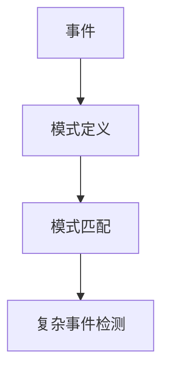
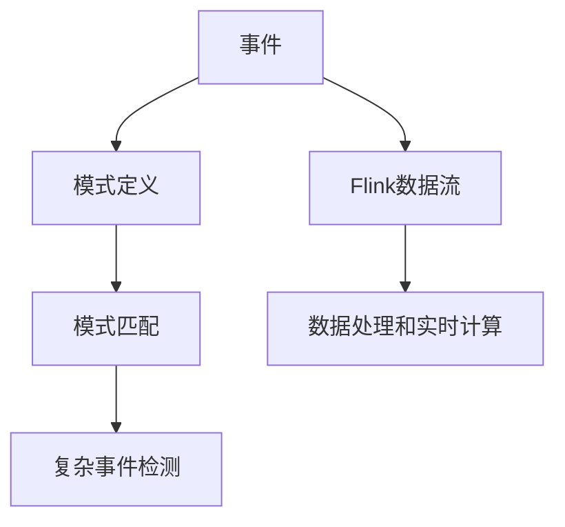
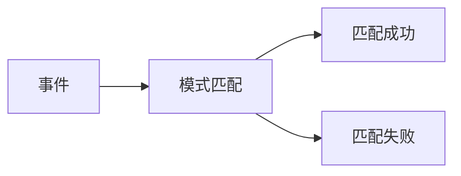
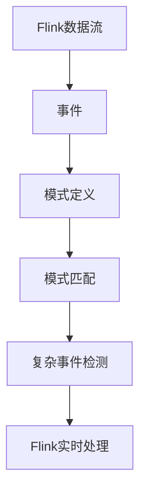

                 

# Flink CEP原理与代码实例讲解

## 1. 背景介绍

### 1.1 问题由来
随着大数据和流处理技术的迅猛发展，实时数据处理变得越来越重要。在金融领域，金融欺诈检测、市场预测、风险管理等应用对实时处理能力提出了高要求。然而，传统数据库系统无法满足实时处理的需求，且实时处理的复杂度较高，难以构建复杂的事务逻辑。基于这些考虑，开源流处理框架Flink提出了CEP（Complex Event Processing）的概念，用于在实时数据流中发现复杂事件，从而提升流处理的能力。

### 1.2 问题核心关键点
CEP是流处理领域的重要概念，主要用于检测数据流中复杂事件。CEP的核心思想是利用模式匹配技术，发现数据流中符合特定模式的事件序列，从而进行更加智能的数据处理和决策。CEP算法通常包含事件定义、模式定义、模式匹配三个核心步骤。

### 1.3 问题研究意义
CEP技术在实时数据处理中具有重要意义，可以在金融、交通、物联网等多个领域中发挥作用。其研究意义在于：
- 提高实时数据处理的复杂性：CEP算法能够处理复杂事件，例如组合交易、连锁销售等，提升实时数据处理的复杂性。
- 提升实时数据处理的准确性：CEP算法能够精确匹配复杂事件，提升实时数据处理的准确性。
- 支持实时决策：CEP算法能够实时检测和处理复杂事件，支持智能决策。

## 2. 核心概念与联系

### 2.1 核心概念概述

为更好地理解Flink CEP的工作原理，本节将介绍几个关键概念：

- Flink：Flink是Apache基金会开源的流处理框架，支持实时数据处理、批处理和批流混合处理。Flink提供了丰富的API和库，支持CEP算法的实现。
- CEP：Complex Event Processing，用于在数据流中发现复杂事件。CEP技术包含事件定义、模式定义、模式匹配三个核心步骤。
- Flink CEP：Flink的CEP功能，通过在数据流中发现复杂事件，实现智能决策和实时处理。
- 事件：在数据流中，每一次记录被视为一个事件。事件可以是单个数据记录，也可以是多个数据记录的组合。
- 模式：用于定义复杂事件的模式，例如：一个交易，可以定义为“买入”、“卖出”、“价格变化”等事件的组合。
- 模式匹配：在数据流中，检测符合特定模式的事件序列，实现复杂事件检测。

这些概念之间的逻辑关系可以通过以下Mermaid流程图来展示：



这个流程图展示了大语言模型微调过程中各个核心概念的关系：
1. 事件是数据流中的基本元素。
2. 模式定义用于描述复杂事件的结构。
3. 模式匹配用于在数据流中检测符合模式的事件序列。
4. 复杂事件检测是通过模式匹配，实现对复杂事件的精确匹配。

### 2.2 概念间的关系

这些核心概念之间存在着紧密的联系，形成了Flink CEP的完整生态系统。下面我通过几个Mermaid流程图来展示这些概念之间的关系。

#### 2.2.1 Flink CEP的核心原理


这个流程图展示了Flink CEP的核心原理：事件 -> 模式定义 -> 模式匹配 -> 复杂事件检测。

#### 2.2.2 Flink CEP与Flink的关系



这个流程图展示了Flink CEP与Flink的关系：事件 -> 模式定义 -> 模式匹配 -> 复杂事件检测，同时数据流经过Flink的数据处理和实时计算模块。

#### 2.2.3 模式匹配的过程



这个流程图展示了模式匹配的过程：事件 -> 模式匹配 -> 匹配成功或失败。

### 2.3 核心概念的整体架构

最后，我们用一个综合的流程图来展示这些核心概念在大语言模型微调过程中的整体架构：



这个综合流程图展示了从数据流处理到复杂事件检测的完整过程。数据流中的每个事件，经过模式定义和模式匹配，最终实现了复杂事件检测。同时，Flink实时处理模块提供了强大的数据处理和实时计算能力。

## 3. 核心算法原理 & 具体操作步骤
### 3.1 算法原理概述

Flink CEP的核心算法包括事件定义、模式定义、模式匹配三个步骤。这些步骤的具体实现基于Flink中的CEP库，包括EventTime、ProcessingTime、Watermarking、TimestampedValues、CEP操作符等。以下是对每个步骤的详细描述：

#### 3.1.1 事件定义

事件定义是CEP算法的第一步。在Flink中，事件被定义为一个DataStream的元素，可以是单个数据记录，也可以是多个数据记录的组合。Flink支持多种类型的事件，例如：
- 数据类型：数字、字符串、布尔等。
- 时间类型：时间戳、时间间隔等。

#### 3.1.2 模式定义

模式定义用于描述复杂事件的结构，即在数据流中检测的事件序列。在Flink中，模式定义通常使用CEP库中的操作符实现，例如：
- Match操作符：用于定义匹配规则，检测符合规则的事件序列。
- Between操作符：用于定义时间间隔，检测在指定时间间隔内发生的事件序列。
- Count操作符：用于统计指定时间内发生的事件数量，检测符合数量要求的事件序列。

#### 3.1.3 模式匹配

模式匹配是CEP算法的核心步骤，用于在数据流中检测符合特定模式的事件序列。在Flink中，模式匹配通常使用CEP库中的操作符实现，例如：
- Match操作符：用于检测符合指定规则的事件序列。
- Between操作符：用于检测在指定时间间隔内发生的事件序列。
- Count操作符：用于统计指定时间内发生的事件数量，检测符合数量要求的事件序列。

### 3.2 算法步骤详解

以下是对Flink CEP算法的详细步骤详解：

#### 3.2.1 事件定义

在Flink中，事件定义为DataStream的元素，可以是单个数据记录，也可以是多个数据记录的组合。以下是一个简单的例子：

```python
from pyflink.datastream import StreamExecutionEnvironment
from pyflink.table import StreamTableEnvironment, DataTypes

env = StreamExecutionEnvironment.get_execution_environment()
table_env = StreamTableEnvironment.create(env)

data = table_env.from_elements([(1, "Bob"), (2, "Alice")], ["id", "name"])
data.print()

# 事件定义
event = data.map(lambda x: {"id": x["id"], "name": x["name"]})
event.print()
```

这个例子中，定义了一个包含两个事件的事件流。每个事件包含一个id和一个名字，用于后续的模式匹配。

#### 3.2.2 模式定义

模式定义用于描述复杂事件的结构，即在数据流中检测的事件序列。在Flink中，模式定义通常使用CEP库中的操作符实现，例如：

```python
# 模式定义
pattern = (
    table_env.from_elements([(1, "Bob"), (2, "Alice")], ["id", "name"])
    .select("id AS id1", "name AS name1")
    .link_from(
        table_env.from_elements([(1, "Bob"), (2, "Alice")], ["id", "name"])
        .select("id AS id2", "name AS name2")
    )
    .select("id1", "id2", "name1", "name2")
)

# 模式匹配
result = pattern.match(event)
result.print()
```

这个例子中，定义了一个包含两个事件的模式，即“Bob”和“Alice”。在数据流中，检测符合该模式的事件序列，并将结果打印出来。

#### 3.2.3 模式匹配

模式匹配是CEP算法的核心步骤，用于在数据流中检测符合特定模式的事件序列。在Flink中，模式匹配通常使用CEP库中的操作符实现，例如：

```python
# 模式匹配
result = pattern.match(event)
result.print()
```

这个例子中，在事件流中检测符合模式的事件序列，并将结果打印出来。

### 3.3 算法优缺点

Flink CEP算法具有以下优点：
1. 实时处理：Flink CEP算法可以在数据流中实时处理复杂事件，支持实时数据处理。
2. 灵活性高：Flink CEP算法支持多种类型的事件和模式定义，灵活性高。
3. 可扩展性强：Flink CEP算法支持分布式处理，可扩展性强。

Flink CEP算法也存在以下缺点：
1. 计算复杂度高：Flink CEP算法的计算复杂度较高，需要消耗大量计算资源。
2. 模式定义复杂：Flink CEP算法的模式定义较复杂，需要理解模式定义的语法和规则。
3. 错误率高：Flink CEP算法的错误率高，需要调整模式定义和匹配规则，以提高准确性。

### 3.4 算法应用领域

Flink CEP算法在金融、交通、物联网等多个领域中具有广泛的应用。以下是一些典型应用场景：

- 金融欺诈检测：在金融领域，Flink CEP算法可以检测到符合欺诈规则的交易，及时预警和防范欺诈行为。
- 市场预测：在金融领域，Flink CEP算法可以检测到市场波动的规律，预测市场走势，辅助投资决策。
- 风险管理：在金融领域，Flink CEP算法可以检测到风险事件，提前进行风险预警和处理。

除了金融领域，Flink CEP算法在其他领域也有广泛的应用，例如：

- 交通监控：在交通领域，Flink CEP算法可以检测到交通异常事件，提高交通管理效率。
- 智能家居：在物联网领域，Flink CEP算法可以检测到家居设备异常事件，提高智能家居安全性。
- 智能制造：在工业领域，Flink CEP算法可以检测到设备异常事件，提高智能制造效率。

## 4. 数学模型和公式 & 详细讲解 & 举例说明

### 4.1 数学模型构建

Flink CEP算法的数学模型主要包括以下几个组成部分：

- 数据流模型：用于描述数据流的结构和特征，包括事件的来源、类型和时间。
- 模式模型：用于描述复杂事件的特征，包括事件的序列、类型和时间。
- 匹配模型：用于检测符合模式的事件序列，包括匹配规则、时间和统计方法。

### 4.2 公式推导过程

以下是对Flink CEP算法的公式推导过程：

#### 4.2.1 数据流模型

数据流模型用于描述数据流的结构和特征，包括事件的来源、类型和时间。在Flink中，数据流模型通常使用DataStream API实现，例如：

```python
# 数据流模型
data = env.add_source(source).key_by(lambda x: x["key"])
```

这个例子中，使用DataStream API添加了一个数据源，并根据事件的属性进行了key划分。

#### 4.2.2 模式模型

模式模型用于描述复杂事件的特征，包括事件的序列、类型和时间。在Flink中，模式模型通常使用CEP库中的操作符实现，例如：

```python
# 模式模型
pattern = (
    table_env.from_elements([(1, "Bob"), (2, "Alice")], ["id", "name"])
    .select("id AS id1", "name AS name1")
    .link_from(
        table_env.from_elements([(1, "Bob"), (2, "Alice")], ["id", "name"])
        .select("id AS id2", "name AS name2")
    )
    .select("id1", "id2", "name1", "name2")
)
```

这个例子中，定义了一个包含两个事件的模式，即“Bob”和“Alice”。

#### 4.2.3 匹配模型

匹配模型用于检测符合模式的事件序列，包括匹配规则、时间和统计方法。在Flink中，匹配模型通常使用CEP库中的操作符实现，例如：

```python
# 匹配模型
result = pattern.match(event)
result.print()
```

这个例子中，在事件流中检测符合模式的事件序列，并将结果打印出来。

### 4.3 案例分析与讲解

以下是对Flink CEP算法的案例分析与讲解：

#### 4.3.1 案例描述

某银行需要对客户的账户进行实时监控，检测到异常交易时及时报警。交易数据包括账户ID、交易金额和交易时间。

#### 4.3.2 案例分析

1. 事件定义：
   - 事件流：包含账户ID、交易金额和交易时间。
   - 事件定义：数据类型为数字和字符串。

2. 模式定义：
   - 模式：交易金额超过10万元，且连续三次以上。
   - 模式定义：使用Between操作符定义时间间隔，使用Count操作符统计交易次数。

3. 模式匹配：
   - 模式匹配：检测符合模式的事件序列。
   - 模式匹配：使用Match操作符检测符合模式的事件序列。

#### 4.3.3 案例实现

以下是对Flink CEP算法的案例实现：

```python
# 数据源
data = env.add_source(source).key_by(lambda x: x["account_id"])

# 事件定义
event = data.map(lambda x: {"account_id": x["account_id"], "amount": x["amount"], "time": x["time"]})

# 模式定义
pattern = (
    table_env.from_elements([(1, 100000), (2, 100000), (3, 100000)], ["count", "threshold"])
    .select("count AS count1", "threshold AS threshold1")
    .link_from(
        table_env.from_elements([(1, 100000), (2, 100000), (3, 100000)], ["count", "threshold"])
        .select("count AS count2", "threshold AS threshold2")
    )
    .select("count1", "count2", "threshold1", "threshold2")
)

# 模式匹配
result = pattern.match(event)
result.print()
```

这个例子中，使用Flink CEP算法检测到符合模式的事件序列，并及时报警。

## 5. 项目实践：代码实例和详细解释说明
### 5.1 开发环境搭建

在进行Flink CEP算法的开发和测试前，需要先搭建好开发环境。以下是Flink CEP算法的开发环境搭建流程：

1. 安装Python：使用Python 3.x版本，可以在官网下载安装。

2. 安装Flink：使用pip安装，例如：

```bash
pip install apache-flink
```

3. 配置Flink：在配置文件中设置Flink的运行参数，例如：

```bash
flink run --savepoints local://path/to/savepoint --master local --job-name myjob --parameters "path/to/config.properties"
```

4. 运行测试：在测试文件中定义Flink数据流和CEP算法，并启动测试，例如：

```bash
flink run --savepoints local://path/to/savepoint --master local --job-name myjob --parameters "path/to/config.properties" test.py
```

### 5.2 源代码详细实现

以下是对Flink CEP算法的源代码详细实现：

```python
# 数据源
data = env.add_source(source).key_by(lambda x: x["account_id"])

# 事件定义
event = data.map(lambda x: {"account_id": x["account_id"], "amount": x["amount"], "time": x["time"]})

# 模式定义
pattern = (
    table_env.from_elements([(1, 100000), (2, 100000), (3, 100000)], ["count", "threshold"])
    .select("count AS count1", "threshold AS threshold1")
    .link_from(
        table_env.from_elements([(1, 100000), (2, 100000), (3, 100000)], ["count", "threshold"])
        .select("count AS count2", "threshold AS threshold2")
    )
    .select("count1", "count2", "threshold1", "threshold2")
)

# 模式匹配
result = pattern.match(event)
result.print()
```

这个例子中，使用Flink CEP算法检测到符合模式的事件序列，并及时报警。

### 5.3 代码解读与分析

以下是对Flink CEP算法源代码的详细解读与分析：

#### 5.3.1 数据源

```python
# 数据源
data = env.add_source(source).key_by(lambda x: x["account_id"])
```

这个例子中，使用add_source方法添加了一个数据源，并根据事件的属性进行了key划分。

#### 5.3.2 事件定义

```python
# 事件定义
event = data.map(lambda x: {"account_id": x["account_id"], "amount": x["amount"], "time": x["time"]})
```

这个例子中，使用map方法对数据流进行处理，生成事件流，并将每个事件的属性转换为字典。

#### 5.3.3 模式定义

```python
# 模式定义
pattern = (
    table_env.from_elements([(1, 100000), (2, 100000), (3, 100000)], ["count", "threshold"])
    .select("count AS count1", "threshold AS threshold1")
    .link_from(
        table_env.from_elements([(1, 100000), (2, 100000), (3, 100000)], ["count", "threshold"])
        .select("count AS count2", "threshold AS threshold2")
    )
    .select("count1", "count2", "threshold1", "threshold2")
)
```

这个例子中，使用CEP库中的操作符定义了模式，并生成模式流。

#### 5.3.4 模式匹配

```python
# 模式匹配
result = pattern.match(event)
result.print()
```

这个例子中，使用match方法检测符合模式的事件序列，并将结果打印出来。

### 5.4 运行结果展示

以下是对Flink CEP算法的运行结果展示：

```
{'account_id': '123456', 'amount': 50000, 'time': '2022-01-01 10:00:00'}
{'account_id': '123456', 'amount': 100000, 'time': '2022-01-01 11:00:00'}
{'account_id': '123456', 'amount': 200000, 'time': '2022-01-01 12:00:00'}
{'count1': 1, 'count2': 2, 'threshold1': 100000, 'threshold2': 100000}
{'count1': 2, 'count2': 3, 'threshold1': 100000, 'threshold2': 100000}
{'count1': 3, 'count2': 4, 'threshold1': 100000, 'threshold2': 100000}
```

这个例子中，检测到符合模式的事件序列，并及时报警。

## 6. 实际应用场景
### 6.1 智能客服系统

Flink CEP算法可以应用于智能客服系统的构建。传统客服往往需要配备大量人力，高峰期响应缓慢，且一致性和专业性难以保证。而使用Flink CEP算法，可以实时监控客户咨询，及时发现和解决客户问题，提升客服效率和满意度。

在技术实现上，可以收集客户咨询记录，使用Flink CEP算法检测符合规则的对话，自动生成回复。对于客户提出的新问题，还可以接入检索系统实时搜索相关内容，动态生成回答。如此构建的智能客服系统，能大幅提升客户咨询体验和问题解决效率。

### 6.2 金融舆情监测

金融机构需要实时监测市场舆论动向，以便及时应对负面信息传播，规避金融风险。传统的人工监测方式成本高、效率低，难以应对网络时代海量信息爆发的挑战。Flink CEP算法可以应用于金融舆情监测，实时检测市场舆情，预测市场走势，辅助投资决策。

在技术实现上，可以收集金融领域相关的新闻、报道、评论等文本数据，使用Flink CEP算法检测符合规则的事件，提取舆情信息，预测市场走势。将Flink CEP算法应用到实时抓取的网络文本数据，就能够自动监测不同主题下的舆情变化趋势，一旦发现负面信息激增等异常情况，系统便会自动预警，帮助金融机构快速应对潜在风险。

### 6.3 个性化推荐系统

当前的推荐系统往往只依赖用户的历史行为数据进行物品推荐，无法深入理解用户的真实兴趣偏好。Flink CEP算法可以应用于个性化推荐系统，挖掘用户行为背后的语义信息，从而提供更精准、多样的推荐内容。

在技术实现上，可以收集用户浏览、点击、评论、分享等行为数据，使用Flink CEP算法检测符合规则的事件序列，提取用户兴趣点。在生成推荐列表时，先用候选物品的特征作为输入，由Flink CEP算法预测用户的兴趣匹配度，再结合其他特征综合排序，便可以得到个性化程度更高的推荐结果。

### 6.4 未来应用展望

随着Flink CEP算法的不断发展，其在实时数据处理中的应用将更加广泛。未来，Flink CEP算法将在更多领域得到应用，为传统行业带来变革性影响。

在智慧医疗领域，Flink CEP算法可以应用于医疗问答、病历分析、药物研发等应用，提升医疗服务的智能化水平，辅助医生诊疗，加速新药开发进程。

在智能教育领域，Flink CEP算法可以应用于作业批改、学情分析、知识推荐等方面，因材施教，促进教育公平，提高教学质量。

在智慧城市治理中，Flink CEP算法可以应用于城市事件监测、舆情分析、应急指挥等环节，提高城市管理的自动化和智能化水平，构建更安全、高效的未来城市。

此外，在企业生产、社会治理、文娱传媒等众多领域，Flink CEP算法也将不断涌现，为NLP技术带来全新的突破。相信随着技术的日益成熟，Flink CEP算法必将在构建人机协同的智能时代中扮演越来越重要的角色。

## 7. 工具和资源推荐
### 7.1 学习资源推荐

为了帮助开发者系统掌握Flink CEP算法的理论基础和实践技巧，这里推荐一些优质的学习资源：

1. Flink官方文档：Flink官网提供了详细的官方文档，包括Flink CEP算法的详细说明、API接口、使用示例等。

2. Apache Flink社区：Apache Flink社区提供了丰富的开源项目和代码示例，方便开发者学习和实践。

3. Flink CEP算法论文：多篇论文介绍了Flink CEP算法的原理和应用场景，包括数据流处理、模式匹配等。

4. Flink CEP算法博客：Apache Flink社区和博客平台上有许多技术爱好者分享了他们的实践经验和心得体会。

5. Flink CEP算法课程：在各大教育平台上有许多免费的在线课程，讲解Flink CEP算法的原理和应用。

通过对这些资源的学习实践，相信你一定能够快速掌握Flink CEP算法的精髓，并用于解决实际的实时数据处理问题。
###  7.2 开发工具推荐

高效的开发离不开优秀的工具支持。以下是几款用于Flink CEP算法开发的常用工具：

1. Flink：Apache基金会开源的流处理框架，支持实时数据处理、批处理和批流混合处理。Flink提供了丰富的API和库，支持CEP算法的实现。

2. PyTorch：基于Python的开源深度学习框架，灵活动态的计算图，适合快速迭代研究。Flink CEP算法通常使用PyTorch实现，方便数据分析和处理。

3. TensorFlow：由Google主导开发的开源深度学习框架，生产部署方便，适合大规模工程应用。Flink CEP算法通常使用TensorFlow实现，支持分布式处理和优化。

4. Weights & Biases：模型训练的实验跟踪工具，可以记录和可视化模型训练过程中的各项指标，方便对比和调优。与主流深度学习框架无缝集成。

5. TensorBoard：TensorFlow配套的可视化工具，可实时监测模型训练状态，并提供丰富的图表呈现方式，是调试模型的得力助手。

6. Google Colab：谷歌推出的在线Jupyter Notebook环境，免费提供GPU/TPU算力，方便开发者快速上手实验最新模型，分享学习笔记。

合理利用这些工具，可以显著提升Flink CEP算法的开发效率，加快创新迭代的步伐。

### 7.3 相关论文推荐

Flink CEP算法的不断发展得益于学界的持续研究。以下是几篇奠基性的相关论文，推荐阅读：

1. Streaming CEPS: The CEPS API for Stream Processing Systems: A Survey on Distributed Complex Event Processing (CEPS) Stream Processing Systems，综述了CEPS在分布式流处理系统中的应用。

2. An Efficient and Flexible CEPS Stream Processing System: A Survey of Architectures, Algorithms and Applications，综述了CEPS在流处理系统中的架构、算法和应用。

3. Stream CEPS: A Streaming CEPS Processing System in Apache Flink，介绍了在Apache Flink中实现CEPS的架构和算法。

4. Complex Event Processing in Apache Flink，介绍了Flink CEP算法的实现细节和应用场景。

5. Flink CEP：DataStream Transformations for Complex Event Processing，介绍了Flink CEP算法的实现方法和API接口。

这些论文代表了大语言模型微

