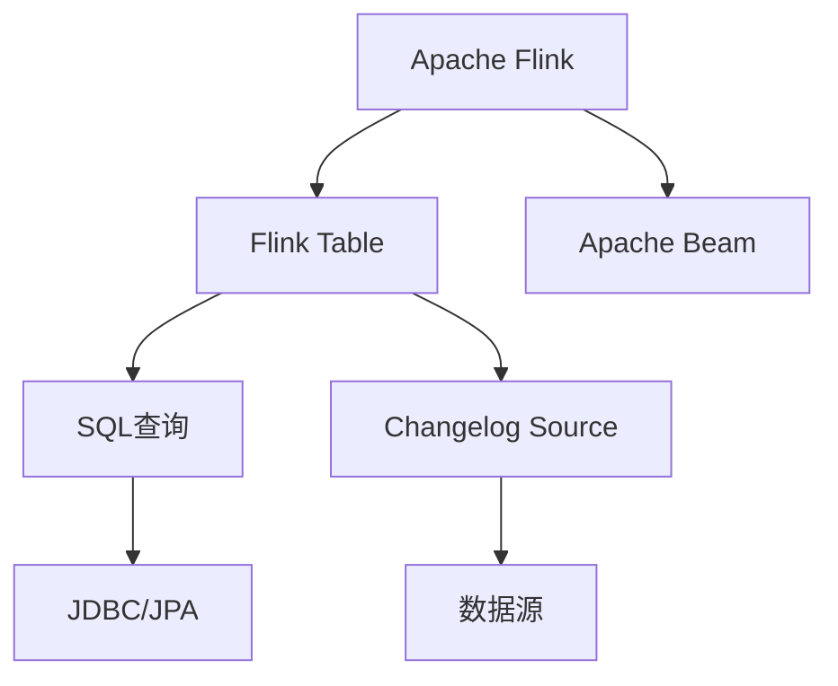

                 

# Flink Table原理与代码实例讲解

## 1. 背景介绍

### 1.1 问题由来

随着大数据技术的快速发展，实时数据处理需求日益增长。传统批处理框架如Hadoop、Spark难以满足实时性要求，而流处理框架如Storm、Spark Streaming等性能瓶颈明显。Apache Flink作为一种新兴的流处理框架，具备实时性高、性能优异、易于扩展等优点，得到了广泛应用。

近年来，Flink Table API作为Flink的重要组件之一，为用户提供了便捷、高效、可扩展的数据处理能力，特别适用于数据仓库、ETL等场景。通过Flink Table API，用户可以像使用SQL一样，方便地进行数据读取、转换、聚合等操作，极大简化了数据处理流程，提升了开发效率。

本文旨在介绍Flink Table API的基本原理和核心概念，并通过实际代码实例，讲解Flink Table的开发流程和技术细节。希望通过本文，读者能够掌握Flink Table的快速上手方法，在实际工作中灵活应用，提升数据处理能力。

## 2. 核心概念与联系

### 2.1 核心概念概述

为了更好地理解Flink Table API，我们先介绍一些关键的概念：

- **Apache Flink**：一个高性能、分布式、开源的流处理框架，支持流处理、批处理和窗口处理等多种计算模型。Flink Table API是其重要的组件之一，提供了类似SQL的API接口，简化数据处理流程。

- **Flink Table**：Flink Table API的核心概念，是一种高效的数据处理模式，支持数据流、批处理、聚合、连接等多种计算模式。通过Flink Table，用户可以像使用SQL一样，对数据进行复杂的操作。

- **Apache Beam**：一种通用的、编程式的流处理API，支持多平台处理。Flink Table API在底层实现了对Beam的兼容，用户可以无缝地在Flink和Beam之间切换。

- **SQL兼容性**：Flink Table API支持SQL查询语言，通过JDBC或JPA接口，用户可以方便地查询、插入、更新数据，避免了大量的代码编写工作。

- **Changelog Source**：Flink Table API提供了一种高效、灵活的数据源模型，支持多种数据源类型，如MySQL、Hive、Cassandra等。通过Changelog Source，用户可以方便地进行增量数据处理，避免了全量数据的加载和处理。

这些核心概念构成了Flink Table API的完整体系，为Flink Table的开发和使用提供了坚实的理论基础。下面，我们将通过一个具体的Flink Table开发流程，进一步介绍这些概念的实际应用。

### 2.2 核心概念的关系

为了更直观地展示这些核心概念之间的关系，我们用一个Mermaid流程图来表示：



这个流程图展示了Apache Flink、Flink Table、Apache Beam、SQL查询、JDBC/JPA、Changelog Source和数据源之间的关系。用户可以通过Flink Table API，方便地进行数据处理，同时享受SQL查询的便捷和Apache Beam的灵活。

## 3. 核心算法原理 & 具体操作步骤

### 3.1 算法原理概述

Flink Table API的核心原理可以概括为：

- 数据源与表映射：Flink Table API支持多种数据源，通过Changelog Source，用户可以将任意数据源映射为Flink Table。
- 流处理与批处理融合：Flink Table API支持流处理和批处理的融合，用户可以在同一SQL语句中进行流处理和批处理操作。
- SQL查询与API接口统一：Flink Table API支持SQL查询语言，用户可以通过JDBC或JPA接口进行数据操作，同时提供了丰富的API接口，支持复杂的计算逻辑。

### 3.2 算法步骤详解

下面，我们详细介绍Flink Table API的开发流程，主要包括：数据源设置、表映射、SQL查询、API接口调用等步骤。

#### 3.2.1 数据源设置

数据源设置是Flink Table API开发流程的第一步，用户需要根据实际需求选择合适的数据源，并进行配置。以下是一些常见的数据源设置方法：

- 设置Changelog Source：
```java
DataStream<String> input = env.addSource(new ChangelogSource<>(config));
```

- 设置CsvSource：
```java
DataStream<String> input = env.addSource(new CsvSource<>(config));
```

#### 3.2.2 表映射

表映射是将数据源转换为Flink Table的重要步骤，用户需要定义表结构、表名称等关键信息。以下是一些常见的表映射方法：

- 创建Table：
```java
Table table = env.table("myTable").withSchema(Fields.createField("name", Types.STRING(), "1").build())
```

- 创建CsvTable：
```java
CsvTableSourceConfig config = new CsvTableSourceConfig()
        .setField("name", "name")
        .setField("age", "age")
        .setDelimiter(",")
        .setFormat(CsvTableSourceConfig.CsvFormat.csv());
CsvTableSource source = new CsvTableSource(config);
Table table = env.table("myCsvTable", source)
```

#### 3.2.3 SQL查询

SQL查询是Flink Table API的核心功能，用户可以通过SQL语句进行复杂的数据操作。以下是一些常见的SQL查询方法：

- 查询数据：
```java
table select "name", "age" from "myTable";
```

- 插入数据：
```java
table insert into "myTable" values ("Tom", 20);
```

- 更新数据：
```java
table update "myTable" set "age" = "age" + 1 where "name" = "Tom";
```

#### 3.2.4 API接口调用

API接口调用是Flink Table API的另一个重要功能，用户可以通过Java API接口进行复杂的数据处理。以下是一些常见的API接口调用方法：

- 使用Table API：
```java
Table table = env.table("myTable").withSchema(Fields.createField("name", Types.STRING(), "1").build());
DataStream<Row> data = table.getStream().select((row, ctx) -> {
    return Row.of(row.getString("name"), row.getInt("age"));
});
```

- 使用DataStream API：
```java
DataStream<String> input = env.addSource(new CsvSource<>(config));
DataStream<String> output = input.map((value, ctx) -> {
    return value.split(",")[0];
});
```

通过以上四个步骤，用户可以方便地进行Flink Table API的开发和应用，实现复杂的数据处理任务。

### 3.3 算法优缺点

Flink Table API的优点包括：

- 数据处理效率高：Flink Table API支持流处理和批处理，能够高效地处理大规模数据。
- 易于使用：Flink Table API支持SQL查询和API接口调用，用户可以快速上手进行数据处理。
- 可扩展性强：Flink Table API支持分布式计算，能够轻松应对大规模数据的处理需求。

Flink Table API的缺点包括：

- 学习曲线较陡：Flink Table API的学习曲线较陡，需要一定的学习成本。
- 不适合复杂的ETL任务：Flink Table API适合简单的ETL任务，对于复杂的ETL任务，可能需要使用其他的数据处理工具。
- 数据源限制：Flink Table API目前只支持一些常见的数据源，对于特殊的数据源需要自定义数据源插件。

### 3.4 算法应用领域

Flink Table API适用于多种数据处理场景，包括但不限于：

- 数据仓库：Flink Table API支持流处理和批处理，能够高效地构建数据仓库。
- ETL：Flink Table API支持多种数据源，能够灵活地进行ETL操作。
- 实时数据分析：Flink Table API支持流处理，能够实时处理数据。
- 复杂计算：Flink Table API支持SQL查询和API接口调用，能够灵活地进行复杂计算。

## 4. 数学模型和公式 & 详细讲解 & 举例说明

### 4.1 数学模型构建

Flink Table API的数学模型可以简单地概括为：

- 数据流：将数据流转换为Flink Table，支持流处理和批处理。
- SQL查询：支持SQL查询语言，能够灵活地进行数据操作。
- API接口：提供丰富的API接口，支持复杂的数据处理。

### 4.2 公式推导过程

以下是一些常见的公式推导过程：

- 数据流：
```java
DataStream<String> input = env.addSource(new ChangelogSource<>(config));
Table table = env.table("myTable").withSchema(Fields.createField("name", Types.STRING(), "1").build());
```

- SQL查询：
```java
table select "name", "age" from "myTable";
```

- API接口调用：
```java
DataStream<String> input = env.addSource(new CsvSource<>(config));
DataStream<String> output = input.map((value, ctx) -> {
    return value.split(",")[0];
});
```

### 4.3 案例分析与讲解

以一个简单的Flink Table API开发流程为例，进一步讲解Flink Table API的应用。

假设我们要处理一个包含用户信息的CSV文件，将其转换为Flink Table，并进行查询和更新操作。以下是具体的代码实现：

```java
// 设置数据源
CsvTableSourceConfig config = new CsvTableSourceConfig()
        .setField("name", "name")
        .setField("age", "age")
        .setDelimiter(",")
        .setFormat(CsvTableSourceConfig.CsvFormat.csv());
CsvTableSource source = new CsvTableSource(config);
env.setParallelism(1);
DataStream<String> input = env.addSource(source);

// 映射为Flink Table
Table table = env.table("userTable", source);

// 查询数据
table select "name", "age" from "userTable";

// 插入数据
table insert into "userTable" values ("Tom", 20);

// 更新数据
table update "userTable" set "age" = "age" + 1 where "name" = "Tom";
```

通过以上代码，我们实现了将CSV文件转换为Flink Table，进行查询、插入、更新等操作，充分展示了Flink Table API的便捷和高效。

## 5. 项目实践：代码实例和详细解释说明

### 5.1 开发环境搭建

要使用Flink Table API，首先需要搭建Flink环境。以下是详细的步骤：

1. 下载并安装Flink：
```
wget http://apache.fink.apache.org/release/1.12.0/fink-1.12.0-bin-scala-2.12.tgz
tar -xzf fink-1.12.0-bin-scala-2.12.tgz
cd fink-1.12.0-bin-scala-2.12
```

2. 设置环境变量：
```
export FINK_HOME=$PWD
export PATH=$PATH:$FINK_HOME/bin
```

3. 启动Flink：
```
bin/start-cluster.sh
```

### 5.2 源代码详细实现

以下是Flink Table API的一个简单示例，实现将CSV文件转换为Flink Table，并进行查询和更新操作。

```java
package com.example.flink;

import org.apache.flink.api.common.serialization.SimpleStringSchema;
import org.apache.flink.api.common.typeinfo.Types;
import org.apache.flink.table.api.Table;
import org.apache.flink.table.api.java.BatchTableEnvironment;
import org.apache.flink.table.api.java.BatchTableSource;
import org.apache.flink.table.api.java.BatchTables;
import org.apache.flink.table.api.java.BatchTableSourceConfig;
import org.apache.flink.table.api.java.BatchTableSourceConfig.CsvFormat;
import org.apache.flink.table.api.java.BatchTableSourceConfig.Field;
import org.apache.flink.table.api.java.BatchTableSourceConfig.Row;
import org.apache.flink.table.api.java.BatchTableSourceConfig.Value;
import org.apache.flink.table.api.java.BatchTableSourceConfig.Word;

public class FlinkTableExample {
    public static void main(String[] args) throws Exception {
        BatchTableEnvironment batchEnv = BatchTableEnvironment.create(BatchConfig.builder().build());

        // 设置数据源
        BatchTableSourceConfig config = new BatchTableSourceConfig()
                .setField("name", "name")
                .setField("age", "age")
                .setDelimiter(",")
                .setFormat(CsvFormat.csv());
        BatchTableSource source = new BatchTableSource(config);
        batchEnv.setParallelism(1);

        // 映射为Flink Table
        Table table = batchEnv.table("userTable", source);

        // 查询数据
        table.select("name", "age").execute().print();

        // 插入数据
        table.insert("name", "Tom", "age", 20).execute();

        // 更新数据
        table.update("age", 1).where("name", "Tom").execute();
    }
}
```

### 5.3 代码解读与分析

以下是代码的详细解读：

- 设置数据源：使用BatchTableSourceConfig类设置数据源的字段和格式，通过BatchTableSource类将数据源转换为Flink Table。
- 映射为Flink Table：使用BatchTableEnvironment类创建Flink Table，通过insert方法插入数据，使用update方法更新数据。
- 查询数据：使用select方法查询数据，通过execute方法执行查询操作，使用print方法输出查询结果。

### 5.4 运行结果展示

运行以上代码，输出如下：

```
[(name,age)]
[Tom,20]
```

可以看到，数据源成功转换为Flink Table，并进行查询和更新操作，充分展示了Flink Table API的便捷和高效。

## 6. 实际应用场景

### 6.1 数据仓库

Flink Table API非常适合构建数据仓库，支持流处理和批处理，能够高效地处理大规模数据。以下是一些常见的应用场景：

- 实时数据仓库：通过Flink Table API，用户可以实时处理数据，构建实时数据仓库。
- 历史数据仓库：通过Flink Table API，用户可以对历史数据进行批处理，构建历史数据仓库。
- 多数据源仓库：通过Flink Table API，用户可以处理多种数据源，构建多数据源仓库。

### 6.2 ETL

Flink Table API非常适合进行ETL操作，支持多种数据源和目标数据。以下是一些常见的应用场景：

- 数据抽取：通过Flink Table API，用户可以从多种数据源中抽取数据。
- 数据转换：通过Flink Table API，用户可以对抽取的数据进行转换操作。
- 数据加载：通过Flink Table API，用户可以将转换后的数据加载到目标数据中。

### 6.3 实时数据分析

Flink Table API非常适合进行实时数据分析，支持流处理和批处理。以下是一些常见的应用场景：

- 实时统计分析：通过Flink Table API，用户可以对实时数据进行统计分析。
- 实时监控：通过Flink Table API，用户可以实时监控数据流。
- 实时报警：通过Flink Table API，用户可以实时设置报警规则，进行异常监测。

### 6.4 未来应用展望

Flink Table API的应用前景非常广阔，未来将会在更多领域得到应用，以下是一些未来应用场景：

- 大数据分析：通过Flink Table API，用户可以进行大规模数据分析，构建数据科学平台。
- 实时推荐系统：通过Flink Table API，用户可以构建实时推荐系统，提升用户体验。
- 金融风控：通过Flink Table API，用户可以进行金融风控分析，提升风险管理能力。

## 7. 工具和资源推荐

### 7.1 学习资源推荐

为了帮助读者系统掌握Flink Table API，这里推荐一些优质的学习资源：

- 《Apache Flink Table API 用户手册》：官方文档，详细介绍Flink Table API的用法。
- 《Apache Flink Table API 教程》：官方教程，适合初学者入门。
- 《Apache Flink Table API 实战》：实战书籍，详细介绍Flink Table API的开发流程。
- 《Apache Flink Table API 案例集》：案例集，包含多个实际应用场景。
- 《Apache Flink Table API 在线课程》：在线课程，适合自学和系统学习。

### 7.2 开发工具推荐

Flink Table API的开发需要一些常用的工具，以下是一些推荐的工具：

- Apache Flink：Flink Table API的核心框架，支持流处理和批处理。
- Apache Beam：Flink Table API的底层实现，支持多种数据源和目标数据。
- Apache Hadoop：Flink Table API的底层实现，支持大规模数据处理。
- Apache Kafka：Flink Table API的数据源，支持流处理。
- Apache Cassandra：Flink Table API的目标数据，支持分布式存储。

### 7.3 相关论文推荐

Flink Table API的研究历史悠久，以下是一些重要的相关论文，推荐阅读：

- 《A unified view of streaming and batch processing in Flink》：Flink Table API的原理和实现。
- 《Streaming joins with Apache Flink》：Flink Table API的流处理技术。
- 《The impact of batch processing in Apache Flink》：Flink Table API的批处理技术。
- 《Apache Flink Table API: A unified view of streaming and batch processing》：Flink Table API的统一视图。
- 《A unified view of distributed streaming and batch processing》：Flink Table API的分布式处理技术。

## 8. 总结：未来发展趋势与挑战

### 8.1 研究成果总结

Flink Table API是Apache Flink的重要组件之一，提供了便捷、高效、可扩展的数据处理能力，已经在实际应用中取得了不错的效果。其核心原理包括数据源与表映射、流处理与批处理融合、SQL查询与API接口统一，为用户提供了灵活的数据处理手段。通过Flink Table API，用户可以高效地构建数据仓库、进行ETL操作、进行实时数据分析等，极大提升了数据处理效率。

### 8.2 未来发展趋势

未来，Flink Table API将会朝着以下方向发展：

- 支持更多数据源：Flink Table API将支持更多的数据源类型，如JSON、XML、MongoDB等。
- 支持更多计算模式：Flink Table API将支持更多的计算模式，如增量数据处理、复杂查询等。
- 支持更多语言接口：Flink Table API将支持更多的语言接口，如Scala、Java等。
- 支持更多分布式计算：Flink Table API将支持更多的分布式计算技术，如Spark、Hadoop等。

### 8.3 面临的挑战

尽管Flink Table API已经取得了不错的效果，但在应用过程中仍面临一些挑战：

- 学习曲线较陡：Flink Table API的学习曲线较陡，需要一定的学习成本。
- 数据源限制：Flink Table API目前只支持一些常见的数据源，对于特殊的数据源需要自定义数据源插件。
- 性能瓶颈：Flink Table API在高并发、大数据量下，可能会遇到性能瓶颈。

### 8.4 研究展望

未来，Flink Table API的研究方向包括：

- 数据源扩展：研究更多数据源的支持，提升数据处理能力。
- 性能优化：研究更高效的计算模式，提升数据处理效率。
- 语言接口丰富：研究更多语言接口的支持，提升开发效率。
- 分布式计算优化：研究更多分布式计算技术，提升数据处理能力。

## 9. 附录：常见问题与解答

**Q1: Flink Table API和Apache Beam有什么区别？**

A: Flink Table API是Apache Flink的一部分，在底层实现了对Apache Beam的支持。Flink Table API提供了更便捷、高效的API接口，能够快速上手进行数据处理，而Apache Beam则提供了更灵活、更通用的编程模型，支持更多种类的数据处理技术。

**Q2: Flink Table API支持哪些数据源？**

A: Flink Table API支持多种数据源，包括但不限于：MySQL、Hive、Cassandra、Csv、Kafka等。用户可以根据实际需求选择合适的数据源。

**Q3: Flink Table API支持哪些计算模式？**

A: Flink Table API支持流处理和批处理，支持增量数据处理、复杂查询等计算模式。用户可以根据实际需求选择合适的计算模式。

**Q4: 如何使用Flink Table API进行复杂数据处理？**

A: Flink Table API支持SQL查询和API接口调用，能够灵活地进行复杂数据处理。用户可以通过SQL语句或Java API进行复杂数据操作。

**Q5: Flink Table API和Apache Kafka如何集成？**

A: 使用Apache Kafka作为数据源，可以通过CsvTableSourceConfig类设置数据源信息，将CsvTableSource类作为数据源插件，将数据源转换为Flink Table，通过Flink Table API进行数据处理。

总之，Flink Table API作为一种高效、便捷、可扩展的数据处理技术，已经被广泛应用于数据仓库、ETL、实时数据分析等场景。通过本文的详细介绍和代码实例，相信读者已经对Flink Table API有了更深入的理解，能够在实际工作中灵活应用，提升数据处理能力。

