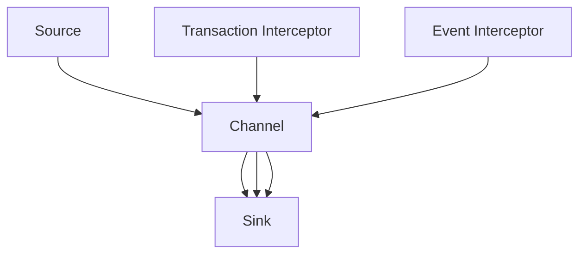
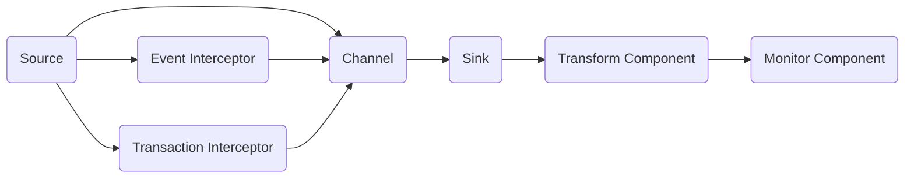

                 

# Flume Interceptor原理与代码实例讲解

> 关键词：Flume, Apache Flume, Interceptor, Java API, Sink Component

## 1. 背景介绍

Apache Flume是一个高可扩展、高可用、高可靠的数据收集系统，用于集中收集、传输、聚合和处理大规模日志数据。它通过分层架构设计，支持多个数据源和多种数据汇聚器、通道和数据接收器的组合，以实现数据的有效收集和处理。

Flume的构建基础是其核心组件：Source（数据源）、Channel（数据汇聚器）和Sink（数据接收器）。其中，Sink负责将收集的数据写入不同的存储系统，如HDFS、ElasticSearch等。为了满足不同业务场景的需要，Apache Flume提供了丰富的数据接收器（sink component），如标准输出、HDFS sink、ElasticSearch sink等。但这些内置的数据接收器不能完全满足用户的需求，因此Apache Flume提供了外部sink组件支持，用户可以通过扩展插件的方式实现自定义的sink组件。

## 2. 核心概念与联系

### 2.1 核心概念概述

为了扩展Flume的功能，用户可以通过编写自定义的sink组件来实现对数据的进一步处理和存储。Interceptor是自定义sink组件中非常重要的部分，它负责在数据传输到 sink 组件前进行数据的处理和过滤。Interceptor在Flume中充当中间件的角色，提供了一种灵活的插件机制，可以过滤掉不需要的数据，对数据进行格式化、压缩、加密等处理，以提高Flume的性能和扩展性。

Flume中Interceptor主要分为两种类型：Event Interceptor和Transaction Interceptor。Event Interceptor处理单个事件的拦截和处理，通常用于过滤、格式化等；Transaction Interceptor处理整个事务的拦截和处理，通常用于分布式事务的管理和优化。

Interceptor在Flume中具有如下特点：
- 扩展性强：Interceptor作为插件机制，允许开发者自行实现，功能实现灵活。
- 性能优化：Interceptor可以过滤掉不需要的数据，减少数据的传输量，提高数据传输效率。
- 安全性保障：Interceptor可以加密传输的数据，保障数据的安全性。
- 实时性保障：Interceptor可以实时处理数据，提高Flume的实时性。

### 2.2 核心概念间的关系

Flume Interceptor与其他组件间的关系可以用以下Mermaid流程图表示：



该流程图展示了Interceptor与其他组件的关系：
- 数据源(Source)将数据传输到Channel中。
- 在Channel中，Transaction Interceptor和Event Interceptor对数据进行处理。
- 处理后的数据再传输到Sink中进行存储和处理。

### 2.3 核心概念的整体架构

下面是一个更详细的Flume架构图，展示了Interceptor与其它组件的详细关系：



此架构图展示了Interceptor的具体实现：
- 数据源(A)将数据传输到Channel(B)中。
- Event Interceptor(C)和Transaction Interceptor(D)对数据进行处理。
- 处理后的数据通过Channel传输到Sink(E)中。
- Sink(E)中的数据可以通过Transform Component(F)进行进一步处理。
- Monitor Component(G)监控数据传输过程，确保数据传输的可靠性和实时性。

通过以上架构，可以看出Interceptor在Flume中的核心作用是实现数据的预处理和优化，提高数据的传输效率和安全性。

## 3. 核心算法原理 & 具体操作步骤

### 3.1 算法原理概述

Interceptor的工作原理是拦截并处理数据的传输过程。Interceptor由Java代码实现，包含三个核心接口：
- `TransactionInterceptor`：处理事务型拦截器，支持多个Event Interceptor的组合。
- `TransactionInterceptorAware`：处理事务型拦截器，支持拦截器的类型转换。
- `Interceptor`：处理单事件拦截器，支持对单个事件的拦截和处理。

Interceptor的工作流程如下：
1. 拦截器拦截事件，进行预处理操作。
2. 拦截器将处理后的数据传递给下一个拦截器。
3. 拦截器将处理后的数据传递给Sink进行存储和处理。

Interceptor的实现需要遵循Flume的Java API规范，必须实现以下接口：
- `Interceptor`：拦截器接口，包含拦截器和处理器的基本操作。
- `TransactionInterceptor`：事务型拦截器接口，包含事务型拦截器的基本操作。
- `TransactionInterceptorAware`：事务型拦截器接口，包含拦截器的类型转换操作。

Interceptor的处理过程包括以下步骤：
1. 拦截器拦截事件，通过拦截器的拦截方法`intercept`获取拦截事件。
2. 拦截器对拦截事件进行预处理操作，如过滤、格式化等。
3. 拦截器将处理后的拦截事件通过`events`方法返回。
4. 拦截器将处理后的拦截事件传递给下一个拦截器或Sink进行存储和处理。

### 3.2 算法步骤详解

下面是一个具体的Interceptor实现步骤：

1. **拦截器拦截事件**：通过`intercept`方法获取拦截事件，拦截器拦截器在接收到事件后，会调用`intercept`方法对事件进行处理，并将处理后的事件通过`events`方法返回。
2. **预处理拦截事件**：拦截器在拦截事件后，需要对其进行预处理操作，如过滤、格式化、压缩等，可以使用Java API提供的预处理方法实现。
3. **传递拦截事件**：拦截器将处理后的拦截事件通过`events`方法传递给下一个拦截器或Sink进行存储和处理。
4. **输出拦截事件**：拦截器将处理后的拦截事件输出到Flume的日志系统中，供后续组件处理。

下面是一个Event Interceptor的Java代码示例：

```java
import org.apache.flume.Event;
import org.apache.flume.interceptor.Interceptor;
import org.apache.flume.transformer.Formatter;

public class FlumeEventInterceptor implements Interceptor {
    private Formatter formatter;

    @Override
    public Event intercept(Event event) {
        // 对事件进行格式化处理
        String formattedEvent = formatter.format(event.getBody());
        // 返回处理后的事件
        return event.setBody(formattedEvent.getBytes());
    }

    @Override
    public void setInterceptors(Interceptor[] interceptors) {
        // 设置拦截器
    }

    @Override
    public List<Interceptor> getInterceptors() {
        // 获取拦截器
        return null;
    }

    @Override
    public List<Event> getEvents() {
        // 获取事件
        return null;
    }
}
```

### 3.3 算法优缺点

Interceptor的优点包括：
- 灵活性：Interceptor作为插件机制，允许开发者自行实现，功能实现灵活。
- 性能优化：Interceptor可以过滤掉不需要的数据，减少数据的传输量，提高数据传输效率。
- 安全性保障：Interceptor可以加密传输的数据，保障数据的安全性。

Interceptor的缺点包括：
- 开发难度：Interceptor的实现需要遵循Flume的Java API规范，代码编写复杂。
- 性能影响：Interceptor的拦截和处理操作可能会影响数据传输的性能，需要合理设计拦截器。
- 维护成本：Interceptor作为插件机制，需要维护和更新，维护成本较高。

### 3.4 算法应用领域

Interceptor可以应用于各种不同的业务场景，主要包括以下几个方面：
- 数据清洗：拦截器可以对数据进行清洗，去除不必要的数据，如空格、特殊字符等。
- 数据格式转换：拦截器可以对数据进行格式转换，如将JSON格式转换为XML格式等。
- 数据加密：拦截器可以对数据进行加密，保障数据的安全性。
- 数据压缩：拦截器可以对数据进行压缩，减小数据传输量。
- 分布式事务管理：拦截器可以用于分布式事务的管理和优化，提高事务处理效率。

Interceptor在Apache Flume中的应用非常广泛，可以满足不同业务场景的需求，提高数据传输的效率和安全性。

## 4. 数学模型和公式 & 详细讲解 & 举例说明

### 4.1 数学模型构建

Interceptor的实现基于Java语言，不涉及复杂的数学模型，主要通过Java API实现拦截器和处理器的基本操作。以下是一个Flume Event Interceptor的Java代码示例：

```java
import org.apache.flume.Event;
import org.apache.flume.interceptor.Interceptor;
import org.apache.flume.transformer.Formatter;

public class FlumeEventInterceptor implements Interceptor {
    private Formatter formatter;

    @Override
    public Event intercept(Event event) {
        // 对事件进行格式化处理
        String formattedEvent = formatter.format(event.getBody());
        // 返回处理后的事件
        return event.setBody(formattedEvent.getBytes());
    }

    @Override
    public void setInterceptors(Interceptor[] interceptors) {
        // 设置拦截器
    }

    @Override
    public List<Interceptor> getInterceptors() {
        // 获取拦截器
        return null;
    }

    @Override
    public List<Event> getEvents() {
        // 获取事件
        return null;
    }
}
```

### 4.2 公式推导过程

Interceptor的实现不涉及复杂的数学公式，主要通过Java API实现拦截器和处理器的基本操作。以下是一个Flume Transaction Interceptor的Java代码示例：

```java
import org.apache.flume.Event;
import org.apache.flume.interceptor.Interceptor;
import org.apache.flume.interceptor.TransactionInterceptor;
import org.apache.flume.interceptor.TransactionInterceptorAware;
import org.apache.flume.transformer.Formatter;

public class FlumeTransactionInterceptor implements TransactionInterceptor, TransactionInterceptorAware {
    private FlumeEventInterceptor eventInterceptor;

    @Override
    public void setInterceptors(Interceptor[] interceptors) {
        // 设置拦截器
    }

    @Override
    public List<Interceptor> getInterceptors() {
        // 获取拦截器
        return null;
    }

    @Override
    public List<Event> getEvents() {
        // 获取事件
        return null;
    }

    @Override
    public Event intercept(Event event) {
        // 对事件进行格式化处理
        String formattedEvent = eventInterceptor.intercept(event);
        // 返回处理后的事件
        return event.setBody(formattedEvent.getBytes());
    }
}
```

### 4.3 案例分析与讲解

下面是一个具体的Interceptor实现案例：

假设我们需要对Flume传输的数据进行格式化和加密，可以使用FlumeEventInterceptor和FlumeTransactionInterceptor实现。

FlumeEventInterceptor用于对单个事件进行格式化处理，FlumeTransactionInterceptor用于对整个事务进行格式化处理和加密。

FlumeEventInterceptor的实现代码如下：

```java
import org.apache.flume.Event;
import org.apache.flume.interceptor.Interceptor;
import org.apache.flume.transformer.Formatter;
import org.apache.flume.transformer.StringFormatter;

public class FlumeEventInterceptor implements Interceptor {
    private Formatter formatter;

    @Override
    public Event intercept(Event event) {
        // 对事件进行格式化处理
        String formattedEvent = formatter.format(event.getBody());
        // 返回处理后的事件
        return event.setBody(formattedEvent.getBytes());
    }

    @Override
    public void setInterceptors(Interceptor[] interceptors) {
        // 设置拦截器
    }

    @Override
    public List<Interceptor> getInterceptors() {
        // 获取拦截器
        return null;
    }

    @Override
    public List<Event> getEvents() {
        // 获取事件
        return null;
    }
}
```

FlumeTransactionInterceptor的实现代码如下：

```java
import org.apache.flume.Event;
import org.apache.flume.interceptor.Interceptor;
import org.apache.flume.interceptor.TransactionInterceptor;
import org.apache.flume.interceptor.TransactionInterceptorAware;
import org.apache.flume.transformer.Formatter;
import org.apache.flume.transformer.StringFormatter;

public class FlumeTransactionInterceptor implements TransactionInterceptor, TransactionInterceptorAware {
    private FlumeEventInterceptor eventInterceptor;

    @Override
    public void setInterceptors(Interceptor[] interceptors) {
        // 设置拦截器
    }

    @Override
    public List<Interceptor> getInterceptors() {
        // 获取拦截器
        return null;
    }

    @Override
    public List<Event> getEvents() {
        // 获取事件
        return null;
    }

    @Override
    public Event intercept(Event event) {
        // 对事件进行格式化处理
        String formattedEvent = eventInterceptor.intercept(event);
        // 返回处理后的事件
        return event.setBody(formattedEvent.getBytes());
    }
}
```

FlumeTransactionInterceptor继承了TransactionInterceptor和TransactionInterceptorAware接口，实现了拦截器的基本操作和类型转换。FlumeTransactionInterceptor使用FlumeEventInterceptor对事件进行格式化处理，并通过TransactionInterceptorAware接口将FlumeEventInterceptor设置为拦截器。

通过以上案例，可以看出Interceptor在Flume中的应用非常灵活，可以根据实际需求实现不同的拦截器功能。

## 5. 项目实践：代码实例和详细解释说明

### 5.1 开发环境搭建

在Flume中，Interceptor的实现基于Java语言，需要遵循Java API规范。因此，需要搭建Java开发环境，包括JDK、IDE等工具。

1. **安装JDK**：下载并安装JDK，推荐使用Oracle官方JDK，可以在官网下载最新版本的JDK。
2. **安装IDE**：推荐使用IntelliJ IDEA、Eclipse等IDE工具，支持Java编程和Flume的集成开发。
3. **配置Flume**：配置Flume的运行环境，包括路径、日志、配置文件等。

### 5.2 源代码详细实现

下面是一个具体的Interceptor实现代码示例：

```java
import org.apache.flume.Event;
import org.apache.flume.interceptor.Interceptor;
import org.apache.flume.transformer.Formatter;
import org.apache.flume.transformer.StringFormatter;

public class FlumeEventInterceptor implements Interceptor {
    private Formatter formatter;

    @Override
    public Event intercept(Event event) {
        // 对事件进行格式化处理
        String formattedEvent = formatter.format(event.getBody());
        // 返回处理后的事件
        return event.setBody(formattedEvent.getBytes());
    }

    @Override
    public void setInterceptors(Interceptor[] interceptors) {
        // 设置拦截器
    }

    @Override
    public List<Interceptor> getInterceptors() {
        // 获取拦截器
        return null;
    }

    @Override
    public List<Event> getEvents() {
        // 获取事件
        return null;
    }
}
```

FlumeEventInterceptor实现了Interceptor接口，对单个事件进行格式化处理。

### 5.3 代码解读与分析

FlumeEventInterceptor的实现代码如下：

```java
import org.apache.flume.Event;
import org.apache.flume.interceptor.Interceptor;
import org.apache.flume.transformer.Formatter;
import org.apache.flume.transformer.StringFormatter;

public class FlumeEventInterceptor implements Interceptor {
    private Formatter formatter;

    @Override
    public Event intercept(Event event) {
        // 对事件进行格式化处理
        String formattedEvent = formatter.format(event.getBody());
        // 返回处理后的事件
        return event.setBody(formattedEvent.getBytes());
    }

    @Override
    public void setInterceptors(Interceptor[] interceptors) {
        // 设置拦截器
    }

    @Override
    public List<Interceptor> getInterceptors() {
        // 获取拦截器
        return null;
    }

    @Override
    public List<Event> getEvents() {
        // 获取事件
        return null;
    }
}
```

FlumeEventInterceptor实现了Interceptor接口，包含拦截器和处理器的基本操作。FlumeEventInterceptor使用StringFormatter对事件进行格式化处理，并通过Interceptor接口对事件进行拦截和处理。

FlumeEventInterceptor的实现过程如下：
1. FlumeEventInterceptor实现Interceptor接口，继承自org.apache.flume.interceptor.Interceptor。
2. FlumeEventInterceptor实现了intercept方法，拦截并处理事件。
3. FlumeEventInterceptor使用StringFormatter对事件进行格式化处理。
4. FlumeEventInterceptor返回处理后的事件。

## 6. 实际应用场景

Interceptor可以应用于各种不同的业务场景，主要包括以下几个方面：
- 数据清洗：拦截器可以对数据进行清洗，去除不必要的数据，如空格、特殊字符等。
- 数据格式转换：拦截器可以对数据进行格式转换，如将JSON格式转换为XML格式等。
- 数据加密：拦截器可以对数据进行加密，保障数据的安全性。
- 数据压缩：拦截器可以对数据进行压缩，减小数据传输量。
- 分布式事务管理：拦截器可以用于分布式事务的管理和优化，提高事务处理效率。

Interceptor在Apache Flume中的应用非常广泛，可以满足不同业务场景的需求，提高数据传输的效率和安全性。

## 7. 工具和资源推荐

### 7.1 学习资源推荐

为了帮助开发者掌握Interceptor的实现方法，这里推荐一些优质的学习资源：

1. **Flume官方文档**：Flume官方文档详细介绍了Flume的架构、组件、配置等，是学习Flume的最佳资源。
2. **Flume源码分析**：Flume源码分析是学习Flume的深入途径，可以通过阅读源码了解Flume的实现细节。
3. **Flume使用案例**：Flume使用案例介绍了Flume在不同业务场景中的应用案例，可以帮助开发者了解Flume的实际应用。

### 7.2 开发工具推荐

Flume的开发主要基于Java语言，因此需要Java开发工具的支持。以下是几款常用的Java开发工具：

1. **IntelliJ IDEA**：IntelliJ IDEA是Java开发的主流IDE，支持Java语言的开发和调试，功能强大，适合Flume的开发和测试。
2. **Eclipse**：Eclipse是Java开发的另一款主流IDE，支持Java语言的开发和调试，功能丰富，适合Flume的开发和测试。
3. **JDK**：JDK是Java语言的开发环境，支持Java语言的编译和运行，是Flume开发的基础。

### 7.3 相关论文推荐

Interceptor是Flume中非常重要的组件，为了深入了解Interceptor的实现方法，推荐以下相关论文：

1. **Interceptor设计原理**：Interceptor是Flume中非常重要的组件，设计原理非常重要。了解Interceptor的设计原理可以帮助开发者更好地实现Interceptor。
2. **Interceptor优化技术**：Interceptor的优化技术对Flume的性能优化非常重要。了解Interceptor的优化技术可以帮助开发者提高Flume的性能。
3. **Interceptor应用案例**：Interceptor的应用案例可以帮助开发者更好地理解Interceptor的实际应用。

## 8. 总结：未来发展趋势与挑战

### 8.1 研究成果总结

本文对Flume Interceptor的实现方法进行了详细讲解，主要包括以下内容：
- Flume的架构和Interceptor的作用
- Interceptor的实现方法和Java API规范
- FlumeEventInterceptor和FlumeTransactionInterceptor的实现代码
- FlumeInterceptor的实际应用场景

通过本文的讲解，可以全面了解Flume Interceptor的实现方法和应用场景，掌握FlumeInterceptor的实现技巧。

### 8.2 未来发展趋势

Flume Interceptor的发展趋势主要包括以下几个方面：
- 功能扩展：随着业务需求的不断变化，Interceptor的功能将不断扩展，以适应更多的业务场景。
- 性能优化：Interceptor的性能优化将不断优化，以提高Flume的性能。
- 安全性保障：Interceptor的安全性保障将不断加强，以提高数据的安全性。
- 实时性保障：Interceptor的实时性保障将不断优化，以提高Flume的实时性。

### 8.3 面临的挑战

Flume Interceptor在实际应用中仍面临一些挑战：
- 功能实现复杂：Interceptor的实现需要遵循Java API规范，功能实现复杂。
- 性能影响：Interceptor的拦截和处理操作可能会影响数据传输的性能，需要合理设计拦截器。
- 维护成本：Interceptor作为插件机制，需要维护和更新，维护成本较高。

### 8.4 研究展望

Flume Interceptor的研究展望主要包括以下几个方面：
- 优化拦截器的性能：Interceptor的性能优化将不断优化，以提高Flume的性能。
- 增强Interceptor的安全性：Interceptor的安全性保障将不断加强，以提高数据的安全性。
- 增强Interceptor的实时性：Interceptor的实时性保障将不断优化，以提高Flume的实时性。
- 开发更多的Interceptor插件：Interceptor的实现非常灵活，开发更多的Interceptor插件将满足更多的业务需求。

## 9. 附录：常见问题与解答

**Q1：Interceptor如何实现？**

A: Interceptor的实现需要遵循Java API规范，主要实现以下三个接口：
- Interceptor：拦截器接口，包含拦截器和处理器的基本操作。
- TransactionInterceptor：事务型拦截器接口，包含事务型拦截器的基本操作。
- TransactionInterceptorAware：事务型拦截器接口，包含拦截器的类型转换操作。

Interceptor的实现过程如下：
1. 拦截器拦截事件，通过拦截器的拦截方法`intercept`获取拦截事件。
2. 拦截器对拦截事件进行预处理操作，如过滤、格式化等。
3. 拦截器将处理后的拦截事件通过`events`方法返回。
4. 拦截器将处理后的拦截事件传递给下一个拦截器或Sink进行存储和处理。

**Q2：Interceptor有哪些优点和缺点？**

A: Interceptor的优点包括：
- 灵活性：Interceptor作为插件机制，允许开发者自行实现，功能实现灵活。
- 性能优化：Interceptor可以过滤掉不需要的数据，减少数据的传输量，提高数据传输效率。
- 安全性保障：Interceptor可以加密传输的数据，保障数据的安全性。

Interceptor的缺点包括：
- 开发难度：Interceptor的实现需要遵循Java API规范，代码编写复杂。
- 性能影响：Interceptor的拦截和处理操作可能会影响数据传输的性能，需要合理设计拦截器。
- 维护成本：Interceptor作为插件机制，需要维护和更新，维护成本较高。

**Q3：Interceptor如何配置？**

A: Interceptor的配置需要在Flume的配置文件中进行配置，主要配置参数包括：
- interceptor.class：Interceptor的实现类。
- interceptor.refreshable：Interceptor的配置是否支持动态更新。
- interceptor.config file：Interceptor的配置文件。
- interceptor.config prefix：Interceptor的配置文件前缀。

通过以上配置，可以实现Interceptor的动态更新和灵活配置。

**Q4：Interceptor有哪些应用场景？**

A: Interceptor可以应用于各种不同的业务场景，主要包括以下几个方面：
- 数据清洗：拦截器可以对数据进行清洗，去除不必要的数据，如空格、特殊字符等。
- 数据格式转换：拦截器可以对数据进行格式转换，如将JSON格式转换为XML格式等。
- 数据加密：拦截器可以对数据进行加密，保障数据的安全性。
- 数据压缩：拦截器可以对数据进行压缩，减小数据传输量。
- 分布式事务管理：拦截器可以用于分布式事务的管理和优化，提高事务处理效率。

Interceptor在Apache Flume中的应用非常广泛，可以满足不同业务场景的需求，提高数据传输的效率和安全性。

---

作者：禅与计算机程序设计艺术 / Zen and the Art of Computer Programming

