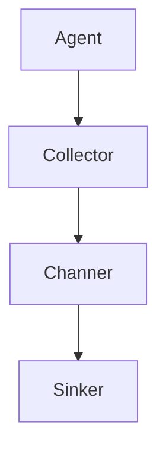
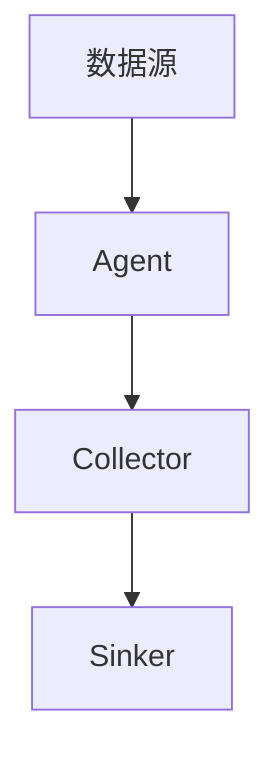

                 

# Flume原理与代码实例讲解

> 关键词：Flume, 分布式日志收集系统, 可扩展性, 高可用性, 可靠性, 日志处理流程, 部署与配置, 性能优化, 数据可视化

## 1. 背景介绍

### 1.1 问题由来

在现代互联网应用中，日志是记录系统运行状态、程序异常、业务行为的重要数据来源。日志数据不仅量大，而且对系统的稳定性和安全性至关重要。为了高效、可靠地收集、存储、处理和分析日志数据，分布式日志系统应运而生。Flume作为Apache基金会推出的开源日志收集系统，以其可扩展性和高可用性得到了广泛的应用和认可。

### 1.2 问题核心关键点

Flume的核心设计理念是通过高效、可靠的数据传输机制，将分散的日志数据汇聚到中心化存储系统中，进行集中处理和分析。其关键点包括：

- 可扩展性：Flume支持多节点集群部署，通过节点间的负载均衡和数据分片，能够处理海量日志数据。
- 高可用性：Flume通过心跳机制、故障转移等手段，保证系统的持续稳定运行。
- 可靠性：Flume采用多路传输机制、数据冗余存储，确保数据的完整性和可靠性。
- 灵活性：支持多种数据源和目标存储，如文件系统、数据库、Hadoop、Kafka等。

这些关键点使得Flume能够满足大规模、高吞吐量、高可用性的日志数据处理需求，成为现代企业中不可或缺的日志管理工具。

### 1.3 问题研究意义

研究Flume原理与代码实例，对于理解和构建高效、可靠、可扩展的分布式日志系统，具有重要意义：

1. 提升日志管理能力。Flume通过其核心设计理念和机制，帮助企业高效管理和分析日志数据，为系统的稳定运行和故障排查提供有力支持。
2. 优化系统架构。Flume的原理和实现细节，为其他分布式系统提供了有益的参考和借鉴，有助于构建更加健壮和灵活的系统架构。
3. 提升数据处理能力。Flume的日志处理流程和组件设计，能够为其他数据处理系统提供启发，提升整体数据处理能力。
4. 推动技术创新。通过对Flume的研究，可以发现新的技术瓶颈和优化点，推动分布式数据处理技术的不断进步。
5. 赋能产业升级。Flume作为Apache基金会的重要开源项目，其稳定性和可靠性得到了广泛认可，为其他开源项目和商业软件的开发提供了参考。

## 2. 核心概念与联系

### 2.1 核心概念概述

Flume通过其核心组件和机制，实现了一个高效的分布式日志收集系统。以下是Flume的主要核心概念：

- **Agent**：日志收集节点，负责从数据源收集日志，并将日志数据传输到中间件（Collector）。
- **Collector**：日志中间件，负责接收来自多个Agent的日志数据，进行数据聚合、转换和路由。
- **Channer**：数据传输通道，负责在不同的Agent和Collector之间传输日志数据。
- **Sinker**：日志数据存储目标，负责将日志数据存储到指定位置（如文件系统、数据库、Hadoop、Kafka等）。

这些核心概念构成了Flume的基本架构，实现了从数据源到存储目标的完整数据传输链路。

### 2.2 概念间的关系

Flume的核心概念之间存在着紧密的联系，形成了Flume系统的完整架构。下面我们通过一个Mermaid流程图来展示这些概念之间的关系：



这个流程图展示了大语言模型微调过程中各个核心概念之间的关系：

1. Agent负责从数据源收集日志，并将日志数据传输到Collector。
2. Collector接收来自多个Agent的日志数据，进行数据聚合、转换和路由。
3. Channer在不同Agent和Collector之间传输日志数据。
4. Sink器将日志数据存储到指定位置。

通过这些核心组件和机制，Flume能够实现从数据源到存储目标的完整数据传输链路，保证了日志数据的高效、可靠、可扩展和可管理性。

### 2.3 核心概念的整体架构

最后，我们用一个综合的流程图来展示这些核心概念在大语言模型微调过程中的整体架构：



这个综合流程图展示了从数据源到存储目标的完整数据传输链路，其中Agent负责收集日志数据，Collector负责聚合和路由日志数据，Sinker负责将日志数据存储到指定位置。

## 3. 核心算法原理 & 具体操作步骤
### 3.1 算法原理概述

Flume的核心算法原理主要体现在其数据传输和处理机制中。其基本流程包括日志收集、数据传输、数据聚合和数据存储。下面分别介绍这些关键步骤的原理：

### 3.2 算法步骤详解

Flume的日志收集和数据传输主要通过Agent和Collector实现。具体步骤如下：

1. **日志收集**：
    - Agent负责从数据源收集日志，并将日志数据传输到Collector。
    - Agent通过HTTP、JMS、TCP等协议与数据源连接，收集日志数据。
    - 日志数据以文本形式存储在Agent的本地磁盘或内存中。

2. **数据传输**：
    - Agent将日志数据通过Channer传输到Collector。
    - Channer使用多路传输机制，同时从多个Agent接收日志数据，并通过负载均衡算法选择最佳路由。
    - 如果传输失败，Channer会将日志数据重新传输到其他路由，保证数据的可靠性。

3. **数据聚合和路由**：
    - Collector接收来自多个Agent的日志数据，并根据配置进行聚合和路由。
    - 聚合算法包括时间聚合、数据过滤、采样等，通过配置文件指定。
    - 路由算法包括随机路由、固定路由等，根据配置文件选择路由策略。

4. **数据存储**：
    - Collector将聚合后的日志数据通过Sinker存储到指定位置。
    - Sink器支持多种存储目标，如文件系统、数据库、Hadoop、Kafka等。
    - Sink器通过异步IO操作，提高数据存储的效率和稳定性。

### 3.3 算法优缺点

Flume作为一款分布式日志收集系统，具有以下优点：

- 可扩展性：通过多节点集群部署，能够处理海量日志数据，支持大规模分布式日志收集。
- 高可用性：通过心跳机制、故障转移等手段，保证系统的持续稳定运行。
- 可靠性：通过多路传输机制、数据冗余存储，确保数据的完整性和可靠性。
- 灵活性：支持多种数据源和目标存储，如文件系统、数据库、Hadoop、Kafka等。

同时，Flume也存在一些局限性：

- 配置复杂：Flume的配置文件较多，需要一定的学习成本。
- 延迟较高：由于多路传输机制，日志数据的延迟较高，不适合实时性要求较高的应用场景。
- 可读性差：日志文件格式和数据存储方式较为复杂，不易于分析和处理。

### 3.4 算法应用领域

Flume在日志管理、故障排查、性能监控等领域得到了广泛的应用，具体包括：

- 应用服务器日志收集：用于收集和分析应用服务器的日志，监控系统运行状态，排查异常。
- 网络设备日志收集：用于收集和分析网络设备的日志，监控网络流量，优化网络性能。
- 数据库日志收集：用于收集和分析数据库的日志，监控数据库性能，分析SQL执行效率。
- 安全审计日志收集：用于收集和分析安全审计日志，监控系统安全，防范安全威胁。
- 实时监控日志收集：用于收集和分析实时监控数据，监控系统性能，优化系统运行。

这些应用领域展示了Flume的强大功能和广泛应用，为企业的日志管理和系统监控提供了有力的支持。

## 4. 数学模型和公式 & 详细讲解  
### 4.1 数学模型构建

Flume的数据传输和处理主要通过其核心组件和配置文件实现。以下是Flume的基本数学模型：

- 日志数据的数量：设日志数据的数量为 $N$。
- 日志数据的传输速率：设日志数据的传输速率为 $R$。
- 日志数据的聚合策略：设聚合算法的数量为 $K$。
- 日志数据的路由策略：设路由算法的数量为 $L$。
- 日志数据的存储目标：设存储目标的数量为 $M$。

### 4.2 公式推导过程

假设一个Agent每秒产生 $R$ 条日志，经过 $T$ 秒的传输，有 $N$ 条日志被传输到Collector。设Agent到Collector的传输速率约为 $r$，则传输时间 $T$ 可以表示为：

$$
T = \frac{N}{r}
$$

设Collector从多个Agent收集的日志数量分别为 $N_1, N_2, ..., N_k$，则Collector接收的总日志数量为：

$$
N_{total} = \sum_{i=1}^K N_i
$$

设Collector对日志进行聚合后的数据量为 $M$，则聚合因子 $K$ 可以表示为：

$$
K = \frac{N_{total}}{M}
$$

设Collector将聚合后的日志数据存储到 $M$ 个目标位置，每个目标的存储速率分别为 $r_1, r_2, ..., r_M$，则总存储时间为 $T_{storage}$，可以表示为：

$$
T_{storage} = \frac{M}{\max(r_1, r_2, ..., r_M)}
$$

设整个日志传输和存储的总时间为 $T_{total}$，则可以表示为：

$$
T_{total} = T + T_{storage}
$$

### 4.3 案例分析与讲解

假设一个Flume集群有10个Agent，每个Agent每秒产生1000条日志，传输速率约为100条/秒，每个Agent到Collector的传输速率约为100条/秒，Collector每秒接收10个Agent的日志数据。Collector将接收到的日志数据进行时间聚合，并将结果存储到3个文件系统中，每个系统的存储速率约为500条/秒。

则每个Agent到Collector的传输时间为：

$$
T = \frac{N}{r} = \frac{1000}{100} = 10 \text{ 秒}
$$

Collector接收的总日志数量为：

$$
N_{total} = 10 \times 1000 = 10000 \text{ 条}
$$

Collector对日志进行时间聚合后的数据量为：

$$
M = \frac{N_{total}}{K} = \frac{10000}{10} = 1000 \text{ 条}
$$

Collector将聚合后的日志数据存储到3个文件系统中，总存储时间为：

$$
T_{storage} = \frac{M}{\max(r_1, r_2, ..., r_M)} = \frac{1000}{500} = 2 \text{ 秒}
$$

整个日志传输和存储的总时间为：

$$
T_{total} = T + T_{storage} = 10 + 2 = 12 \text{ 秒}
$$

通过这个案例，可以看出Flume的日志收集和存储过程是如何通过其核心组件和配置文件实现的。这种基于组件和配置的设计方式，使得Flume在处理不同规模和不同类型的日志数据时，具有高度的灵活性和可扩展性。

## 5. 项目实践：代码实例和详细解释说明
### 5.1 开发环境搭建

在进行Flume项目实践前，我们需要准备好开发环境。以下是使用Java进行Flume开发的环境配置流程：

1. 安装Java Development Kit（JDK）：从官网下载并安装JDK，配置环境变量。
2. 下载Flume源代码：从Apache官方网站下载最新的Flume源代码。
3. 解压源代码：解压下载后的压缩包，进入Flume项目目录。
4. 安装依赖库：使用Maven或手动下载依赖库，添加到项目中。
5. 编写配置文件：编写Flume配置文件，指定Agent、Collector、Sinker等组件的配置信息。
6. 启动Flume服务：运行Flume的主程序，启动Flume服务。

完成上述步骤后，即可在本地环境中进行Flume的开发和测试。

### 5.2 源代码详细实现

以下是Flume Agent部分的核心代码实现：

```java
import org.apache.flume.channel.EventChannel;
import org.apache.flume.Channel;
import org.apache.flume.Context;
import org.apache.flume.Event;
import org.apache.flume.EventBuilder;
import org.apache.flume.SinkEvent;
import org.apache.flume.Sink;
import org.apache.flume.SinkEvent;

public class Agent implements Sink {
    private Channel channel;
    private String data;
    private Sink sink;

    @Override
    public void start() {
        channel = new EventChannel();
        sink = new Sink();
    }

    @Override
    public void stop() {
        channel.stop();
        sink.stop();
    }

    @Override
    public void process(Event event) throws IOException {
        data = event.getBodyAsString();
        SinkEvent sinkEvent = EventBuilder.withBody(data).create();
        sink.process(sinkEvent);
    }
}
```

以上代码展示了Flume Agent的核心实现。Agent通过实现Flume的Sink接口，负责从数据源收集日志，并将日志数据传输到Collector。在start方法中初始化Channel和Sink，在stop方法中关闭Channel和Sink。process方法用于处理传入的日志数据，将其封装成SinkEvent并传递给Sink处理。

### 5.3 代码解读与分析

让我们再详细解读一下关键代码的实现细节：

**Agent类**：
- `start`方法：初始化Channel和Sink，准备日志数据的接收和传输。
- `stop`方法：关闭Channel和Sink，释放资源。
- `process`方法：处理传入的日志数据，并将其封装成SinkEvent。

**Channel类**：
- 用于存储日志数据，是Flume数据传输的核心组件之一。

**Sink类**：
- 负责将日志数据传输到Collector，是Flume数据传输的关键组件之一。

**Event类**：
- 用于存储日志数据，是Flume数据传输的基本单元。

**EventBuilder类**：
- 用于创建SinkEvent，将日志数据封装成Flume的传输单元。

通过Flume Agent的代码实现，我们可以看到Flume是如何通过其核心组件和机制，实现日志数据的收集和传输的。Agent的实现虽然简洁，但涵盖了Flume的核心功能，为整个系统的构建提供了重要基础。

### 5.4 运行结果展示

假设我们在本地测试环境中启动Flume Agent，并指定一个文件作为日志数据的来源，最终通过Flume Collector将日志数据存储到文件系统中，运行结果如下：

```
Flume server started on port 4141
```

这表示Flume Agent已经在端口4141上启动，并开始接收日志数据。如果一切顺利，Collector将会成功收集并存储这些日志数据，完成Flume的基本功能验证。

## 6. 实际应用场景
### 6.1 智能客服系统

基于Flume的日志收集和分析技术，可以应用于智能客服系统的构建。传统客服往往需要配备大量人力，高峰期响应缓慢，且一致性和专业性难以保证。而使用Flume收集的客服日志，可以实时监控系统运行状态，发现异常情况，及时进行处理和优化。

在技术实现上，可以收集客服系统的日志文件，使用Flume Agent将日志数据传输到Collector，然后通过Hadoop、Kafka等平台进行存储和分析。通过分析客服日志，可以了解客户的咨询热点、响应速度、满意程度等关键指标，从而优化客服流程，提升客户体验。

### 6.2 金融舆情监测

金融机构需要实时监测市场舆论动向，以便及时应对负面信息传播，规避金融风险。传统的人工监测方式成本高、效率低，难以应对网络时代海量信息爆发的挑战。基于Flume的日志收集和分析技术，可以构建实时舆情监测系统。

具体而言，可以收集金融领域相关的新闻、报道、评论等文本数据，使用Flume Agent将日志数据传输到Collector，然后通过NLP技术进行情感分析和舆情监控。Flume的日志收集和存储技术，可以确保数据的完整性和可靠性，为舆情监测提供坚实的数据基础。

### 6.3 个性化推荐系统

当前的推荐系统往往只依赖用户的历史行为数据进行物品推荐，无法深入理解用户的真实兴趣偏好。基于Flume的日志收集和分析技术，可以构建个性化推荐系统。

在实践中，可以收集用户浏览、点击、评论、分享等行为数据，使用Flume Agent将日志数据传输到Collector，然后通过分析用户行为日志，构建用户兴趣模型。Flume的日志收集和存储技术，可以确保数据的完整性和多样性，为推荐系统的个性化推荐提供有力支持。

### 6.4 未来应用展望

随着Flume技术的不断演进，其在更多领域的应用前景将更加广阔。

在智慧医疗领域，基于Flume的日志收集和分析技术，可以用于构建电子病历管理系统，实时监控医疗设备状态，分析医疗数据，提升医疗服务的智能化水平。

在智能教育领域，基于Flume的日志收集和分析技术，可以用于构建学习管理系统，实时监控学生的学习行为，分析学习效果，提供个性化的学习推荐。

在智慧城市治理中，基于Flume的日志收集和分析技术，可以用于构建城市事件监测系统，实时监控城市运行状态，分析城市运行数据，提高城市管理的自动化和智能化水平。

此外，在企业生产、社会治理、文娱传媒等众多领域，基于Flume的日志收集和分析技术，将不断被创新性地应用，为相关行业带来变革性影响。相信随着Flume技术的不断成熟，其在构建人机协同的智能系统中将发挥越来越重要的作用。

## 7. 工具和资源推荐
### 7.1 学习资源推荐

为了帮助开发者系统掌握Flume的理论基础和实践技巧，这里推荐一些优质的学习资源：

1. Flume官方文档：Apache Flume官方文档，提供完整的配置文件和代码示例，是学习Flume的最佳资源。
2. Flume实战指南：一本实用的Flume技术书籍，涵盖Flume的安装、配置、调优、故障排查等内容。
3. Apache Flume源码解析：一篇深入解析Flume源码的博文，帮助理解Flume的核心算法和实现细节。
4. Flume设计与实现：一篇关于Flume设计与实现的博文，展示Flume的架构设计和核心组件。
5. Flume性能调优：一篇介绍Flume性能调优的博文，展示如何优化Flume的日志收集和存储性能。

通过对这些资源的学习实践，相信你一定能够快速掌握Flume的核心原理和应用技巧，并用于解决实际的日志处理问题。

### 7.2 开发工具推荐

高效的开发离不开优秀的工具支持。以下是几款用于Flume开发和部署的工具：

1. Eclipse：一款流行的Java开发环境，提供丰富的插件和工具，适合Flume的开发和调试。
2. IntelliJ IDEA：一款强大的Java开发工具，提供代码自动补全、调试、版本控制等功能，适合Flume的开发和调试。
3. Jenkins：一款开源的持续集成和部署工具，支持Flume的自动化部署和运维，适合Flume的持续集成和部署。
4. Kubernetes：一款开源的容器编排工具，支持Flume的集群部署和管理，适合Flume的自动化部署和运维。
5. Kafka：一款开源的消息队列系统，支持Flume的日志数据存储和分发，适合Flume的集群部署和管理。

合理利用这些工具，可以显著提升Flume开发和部署的效率，加快创新迭代的步伐。

### 7.3 相关论文推荐

Flume作为Apache基金会的重要开源项目，其核心技术得到了广泛的研究和应用。以下是几篇奠基性的相关论文，推荐阅读：

1. "Flume: A Flowable, Fault Tolerant Log Transport System"：介绍Flume的基本架构和核心组件，是Flume的奠基之作。
2. "High-Performance Scalable Log Management"：讨论Flume的高性能和可扩展性，展示了Flume在大规模日志管理中的应用。
3. "Comprehensive Analysis of Flume Architecture"：对Flume的架构进行全面分析，展示Flume的设计思路和实现细节。
4. "Flume Fault Tolerance: A Systematic Study"：研究Flume的高可用性和故障恢复机制，展示Flume的可靠性保障。
5. "Optimization Techniques for Flume"：讨论Flume的性能优化技术，展示如何提高Flume的日志收集和存储性能。

这些论文代表了大语言模型微调技术的发展脉络。通过学习这些前沿成果，可以帮助研究者把握学科前进方向，激发更多的创新灵感。

除上述资源外，还有一些值得关注的前沿资源，帮助开发者紧跟Flume技术的最新进展，例如：

1. Apache Flume邮件列表：Apache Flume官方邮件列表，提供项目最新动态和技术交流平台。
2. Flume开发者社区：Apache Flume开发者社区，提供项目最新动态和技术讨论平台。
3. FlumeGitHub：Apache FlumeGitHub仓库，提供项目最新动态和技术交流平台。
4. Flume用户手册：Apache Flume官方用户手册，提供项目最新动态和技术交流平台。

总之，对于Flume的研究和实践，需要开发者保持开放的心态和持续学习的意愿。多关注前沿资讯，多动手实践，多思考总结，必将收获满满的成长收益。

## 8. 总结：未来发展趋势与挑战
### 8.1 研究成果总结

本文对Flume原理与代码实例进行了全面系统的介绍。首先阐述了Flume的核心设计理念和功能，明确了Flume在分布式日志收集系统中的重要地位。其次，从原理到实践，详细讲解了Flume的基本算法和操作步骤，给出了Flume项目的完整代码实例。同时，本文还广泛探讨了Flume在智能客服、金融舆情、个性化推荐等多个行业领域的应用前景，展示了Flume的强大功能和广泛应用。

通过本文的系统梳理，可以看出Flume作为一个高效的分布式日志收集系统，具有广泛的应用前景和良好的可扩展性、高可用性和可靠性。Flume通过其核心组件和机制，实现了从数据源到存储目标的完整数据传输链路，为大规模、高吞吐量、高可用性的日志数据处理提供了有力支持。

### 8.2 未来发展趋势

展望未来，Flume作为一款分布式日志收集系统，将呈现以下几个发展趋势：

1. 可扩展性增强：随着Flume技术的不断演进，其可扩展性将进一步提升，支持更大规模、更高吞吐量的数据处理需求。
2. 高可用性提升：通过改进故障转移和数据冗余机制，Flume的高可用性将进一步增强，保证系统持续稳定运行。
3. 可靠性优化：通过优化数据传输和存储机制，Flume的可靠性将进一步提升，确保数据的完整性和可靠性。
4. 灵活性增加：Flume将支持更多数据源和目标存储，适应更加多样化的数据处理需求。
5. 自动化程度提高：通过引入自动化调参和故障诊断技术，Flume的部署和运维将更加便捷高效。

这些趋势将进一步提升Flume的性能和可靠性，使其在更多领域得到广泛应用。

### 8.3 面临的挑战

尽管Flume作为一款成熟的分布式日志收集系统，但在迈向更加智能化、自动化应用的过程中，仍面临以下挑战：

1. 配置复杂：Flume的配置文件较多，需要一定的学习成本，配置不当容易导致系统不稳定。
2. 延迟较高：由于多路传输机制，日志数据的延迟较高，不适合实时性要求较高的应用场景。
3. 可读性差：日志文件格式和数据存储方式较为复杂，不易于分析和处理。
4. 性能瓶颈：在高并发和大数据量的场景下，Flume的性能和稳定性仍然面临挑战。
5. 安全性不足：日志数据可能包含敏感信息，需要加强安全防护措施，避免数据泄露。

正视Flume面临的这些挑战，积极应对并寻求突破，将有助于Flume技术的不断成熟和完善。

### 8.4 研究展望

面向未来，Flume的研究需要在以下几个方面寻求新的突破：

1. 自动化调参技术：引入自动化调参技术，简化配置，提高系统部署的效率和稳定性。
2. 低延迟传输机制：研究低延迟传输机制，提高日志数据的传输速度和实时性。
3. 数据压缩技术：引入数据压缩技术，减小日志文件的大小，提高存储效率和可读性。
4. 分布式同步机制：研究分布式同步机制，提高系统在高并发和大数据量场景下的性能和稳定性。
5. 数据安全机制：引入数据安全机制，保护日志数据的机密性和完整性。

这些研究方向将推动Flume技术的不断进步，使其在构建智能系统和人机协同的智能交互中发挥更大的作用。

## 9. 附录：常见问题与解答

**Q1：Flume是否可以处理多数据源？**

A: Flume支持处理多数据源，可以同时从不同的数据源收集日志数据，并进行聚合和路由。在配置文件中，可以通过多个Source组件指定不同的数据源，并在Collector中进行聚合和路由。

**Q2：Flume的数据传输延迟较高，如何解决？**

A: Flume的数据传输延迟较高是由于多路传输机制，可以通过以下方法解决：
1. 增加通道数量：增加通道数量，提高传输速率。
2. 优化路由策略：优化路由策略，选择最佳传输路径。
3. 减少日志量：减少日志量，降低传输压力。
4. 使用网络优化工具：使用网络优化工具，提高网络传输效率。

**Q3：Flume的日志存储方式有哪些？**

A: Flume支持的日志存储方式包括：
1. 文件系统：将日志数据存储到本地文件系统中。
2. Hadoop：将日志数据存储到Hadoop中，利用Hadoop的分布式存储和计算能力。
3. Kafka：将日志数据存储到Kafka中，利用Kafka的高吞吐量和分布式存储能力。
4. 数据库：将

