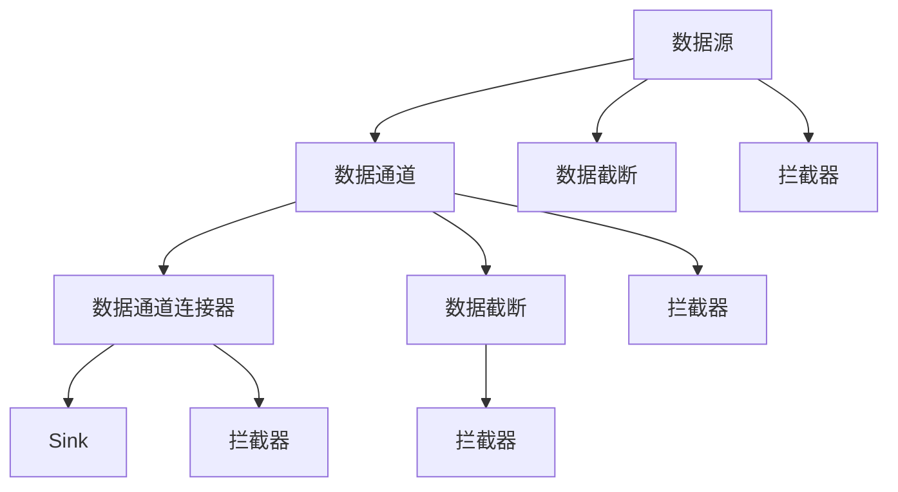
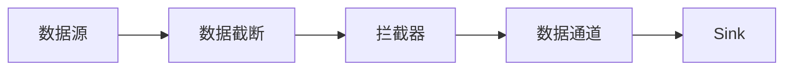
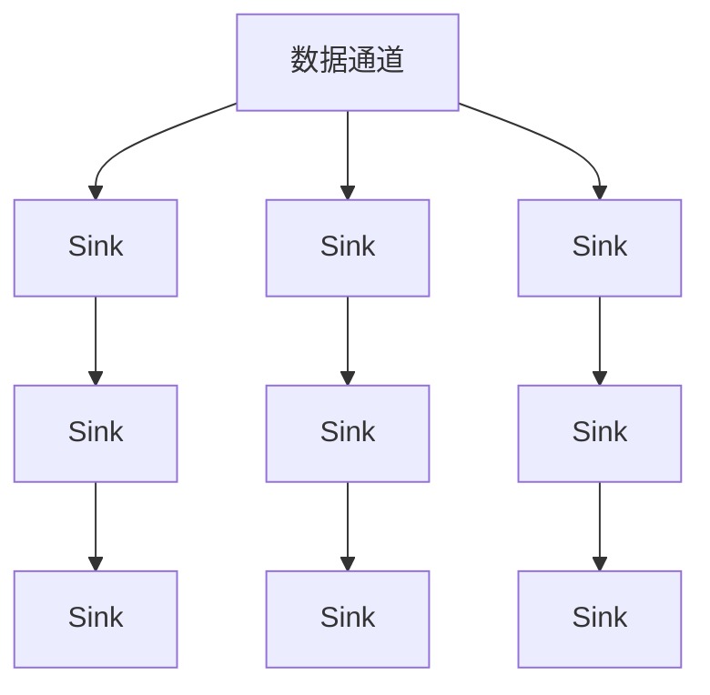
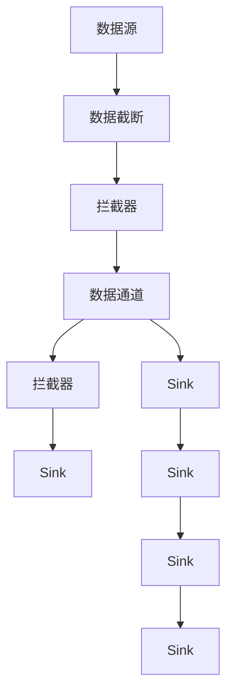

                 

# Flume原理与代码实例讲解

> 关键词：Apache Flume, 数据流处理, 日志收集, 分布式系统, 数据管道, 实时数据

## 1. 背景介绍

### 1.1 问题由来
在大数据时代的背景下，随着企业业务的快速发展，各种应用系统的日志数据迅速增长。这些日志数据不仅是系统监控和问题定位的重要来源，还蕴含着丰富的商业价值和分析潜力。然而，海量日志数据的存储和处理给企业带来了巨大的挑战。

- **存储问题**：传统的关系型数据库难以存储海量日志数据，且查询效率低。
- **处理问题**：传统的离线日志分析方式难以实时获取最新数据，影响业务决策。
- **数据质量问题**：日志数据格式多样，数据质量参差不齐，导致分析结果的准确性受限。

为解决这些问题，Apache Flume应运而生。Flume是一个分布式、高可扩展的日志收集系统，用于实时收集、聚合和传输各种类型的数据流，支持跨越多台计算机的分布式处理。

### 1.2 问题核心关键点
Flume的核心思想是通过构建一个分布式的、高可靠的数据管道，实现大规模日志数据的收集、处理和传输。其主要特点包括：
- 高效的数据传输：Flume支持跨越多台计算机的分布式处理，能够高效地处理海量数据流。
- 灵活的数据源适配：Flume支持多种类型的数据源，如日志文件、消息队列、网络接口等。
- 可扩展性：Flume可以轻松地水平扩展，支持数千个客户端同时收集数据。
- 容错性：Flume提供了多重容错机制，保障数据传输的可靠性。
- 数据管道：Flume通过构建数据管道，实现数据流的可靠传输。

Flume在大数据技术栈中的地位日益重要，其应用场景覆盖了日志收集、数据清洗、数据转发、数据聚合等诸多方面。无论是在企业内部业务系统，还是在互联网应用中，Flume都展示了强大的数据处理能力。

### 1.3 问题研究意义
Flume作为大数据领域的一个重要组件，在数据收集、传输和存储等方面发挥着关键作用。研究Flume原理与代码实现，对于理解和应用分布式数据处理技术，提升企业的数据处理能力，具有重要意义：

1. 降低数据存储和处理成本。通过分布式处理，Flume能够高效地处理海量日志数据，降低存储和处理成本。
2. 提高数据处理实时性。Flume支持实时数据传输，能够快速响应业务需求，提高数据处理的时效性。
3. 提升数据质量。Flume内置了数据清洗和转换功能，能够过滤和转换不同来源的数据，提高数据质量。
4. 增强系统可扩展性。Flume通过分布式架构，支持大规模数据处理，增强系统的可扩展性。
5. 保障数据传输可靠性。Flume提供了多种容错机制，保障数据传输的可靠性和完整性。

## 2. 核心概念与联系

### 2.1 核心概念概述

为更好地理解Flume原理与代码实现，本节将介绍几个密切相关的核心概念：

- **Apache Flume**：是一个开源的分布式数据流处理系统，用于可靠地、高可扩展地、高可靠地收集、聚合和传输数据流。
- **数据源(Source)**：指日志数据生成的位置，可以是文件、网络接口、消息队列等。
- **数据通道(Channel)**：用于存储收集到的数据，是Flume中数据传输的核心组件。
- **数据通道连接器(Sink)**：将数据从一个通道传递到另一个通道或其他系统（如HDFS、Kafka、Hive等）。
- **数据截断(Spliter)**：将数据流分成多个子流，增加数据处理并发度。
- **拦截器(Interceptor)**：用于数据处理和过滤，如格式转换、数据清洗、业务逻辑处理等。
- **Flume集群**：由多个Flume节点组成，通过分布式处理实现高可扩展性。

这些核心概念之间的逻辑关系可以通过以下Mermaid流程图来展示：



这个流程图展示了大数据流通过Flume处理的基本流程：

1. 数据源产生的数据首先经过数据截断，将数据流分成多个子流，以提高并发处理能力。
2. 每个子流经过拦截器进行数据过滤、格式转换等处理，确保数据的格式和质量符合要求。
3. 处理后的数据进入数据通道，进行暂存。
4. 数据通道通过连接器将数据传输到 Sink，Sink 可以是一个文件系统、消息队列、数据库等目标系统。
5. 在传输过程中，数据还可以经过拦截器进行进一步处理，如数据清洗、业务逻辑处理等。

### 2.2 概念间的关系

这些核心概念之间存在着紧密的联系，形成了Flume的完整数据流处理生态系统。下面我们通过几个Mermaid流程图来展示这些概念之间的关系。

#### 2.2.1 数据流处理流程



这个流程图展示了数据流通过Flume的基本处理流程：数据源产生的数据经过截断、拦截器处理后，进入数据通道，最终通过连接器传输到 Sink。

#### 2.2.2 数据通道连接器



这个流程图展示了多个数据通道连接器，将数据传输到不同的 Sink 系统，如HDFS、Kafka、Hive等。

#### 2.2.3 数据截断和拦截器


这个流程图展示了数据流经过多个数据截断和拦截器处理的过程。每个拦截器可以添加不同的数据处理逻辑，如格式转换、数据清洗、业务逻辑处理等。

### 2.3 核心概念的整体架构

最后，我们用一个综合的流程图来展示这些核心概念在大数据流处理中的整体架构：



这个综合流程图展示了从数据源到Sink的完整数据流处理流程。数据源产生的数据经过截断、拦截器处理后，进入数据通道，最终通过连接器传输到不同的Sink系统。每个环节都支持灵活的插件化处理，增强了系统的扩展性和灵活性。

## 3. 核心算法原理 & 具体操作步骤

### 3.1 算法原理概述

Flume的核心算法原理可以概括为：构建一个分布式的数据管道，通过截断、拦截器、连接器等组件，实现大规模数据流的可靠传输和处理。其核心目标是通过分布式处理，解决海量日志数据的存储、传输和处理问题。

Flume的数据处理流程如下：
1. 数据源产生的数据首先经过数据截断，分成多个子流，以提高并发处理能力。
2. 每个子流经过拦截器进行数据处理和过滤，确保数据的格式和质量符合要求。
3. 处理后的数据进入数据通道，进行暂存。
4. 数据通道通过连接器将数据传输到 Sink，Sink 可以是一个文件系统、消息队列、数据库等目标系统。
5. 在传输过程中，数据还可以经过拦截器进行进一步处理，如数据清洗、业务逻辑处理等。

### 3.2 算法步骤详解

Flume的实现过程可以分为以下几个关键步骤：

**Step 1: 配置Flume集群**
- 确定Flume集群中各节点的角色（如数据源、数据通道、Sink等）。
- 配置集群拓扑结构，包括各个节点之间的连接方式和数据传输路径。
- 设置各节点的参数，如内存、线程数、数据截断大小等。

**Step 2: 启动Flume节点**
- 在每个节点上启动Flume服务，监听数据源并开始数据收集。
- 配置拦截器、数据截断和连接器等组件，定义数据处理逻辑。
- 通过ZooKeeper等分布式协调服务，确保集群中各节点的同步和一致性。

**Step 3: 数据收集与传输**
- 数据源产生的数据通过网络接口、消息队列等方式传递给Flume节点。
- 每个节点根据配置的拦截器、数据截断和连接器等组件，对数据进行处理和传输。
- 数据在各个节点之间进行分发和聚合，最终传输到目标系统。

**Step 4: 监控与调优**
- 使用Flume自带的监控工具（如FlumeDashboard）监控数据流处理情况。
- 根据监控结果调整各节点的配置参数，优化数据处理效率。
- 通过日志记录和异常告警机制，及时发现和解决问题。

**Step 5: 数据存储与分析**
- 将收集到的数据存储在目标系统中，如HDFS、Kafka、Hive等。
- 使用各种数据分析工具对存储的数据进行离线或实时分析。
- 根据分析结果指导业务决策，优化系统性能。

### 3.3 算法优缺点

Flume作为一种分布式日志收集系统，具有以下优点：
- 高可扩展性：通过分布式处理，Flume能够高效地处理海量数据流。
- 高可靠性：提供了多种容错机制，保障数据传输的可靠性。
- 灵活性：支持多种类型的数据源和Sink，能够适应不同场景的数据处理需求。
- 可维护性：插件化的组件设计，方便扩展和维护。

然而，Flume也存在一些缺点：
- 配置复杂：需要配置大量的参数和组件，容易出现配置错误。
- 性能瓶颈：在大规模数据处理时，可能会遇到网络延迟、内存占用等问题。
- 部署复杂：需要部署多个节点，并进行分布式协调，增加了系统复杂度。

### 3.4 算法应用领域

Flume作为一种高效的数据流处理系统，广泛应用于多个领域：

- **日志收集**：用于收集各种类型的数据流，如应用日志、系统日志、网络日志等。
- **数据清洗**：对收集到的数据进行格式化、过滤、清洗等处理，提升数据质量。
- **数据转发**：将处理后的数据转发到目标系统，如HDFS、Kafka、Hive等。
- **数据聚合**：对数据进行聚合、汇总、分析，提取有价值的信息。

Flume的应用场景非常广泛，覆盖了企业内部业务系统、互联网应用、大数据平台等多个领域。

## 4. 数学模型和公式 & 详细讲解 & 举例说明

### 4.1 数学模型构建

Flume的数据处理过程可以通过数学模型进行建模，描述数据流在各组件间的传输和处理过程。

设 $D$ 为数据源，$S_1, S_2, \ldots, S_n$ 为数据截断组件，$F_1, F_2, \ldots, F_m$ 为拦截器组件，$C$ 为数据通道，$T_1, T_2, \ldots, T_k$ 为连接器组件，$K$ 为目标系统（如HDFS、Kafka、Hive等）。

数据流处理过程可以表示为：

$$
D \rightarrow S_1 \rightarrow F_1 \rightarrow S_2 \rightarrow F_2 \rightarrow \ldots \rightarrow S_n \rightarrow F_n \rightarrow C \rightarrow T_1 \rightarrow K
$$

其中，箭头表示数据流的传输方向。每个组件根据配置的参数，对数据进行截断、拦截、处理等操作。

### 4.2 公式推导过程

Flume的数据流处理过程可以通过以下公式进行推导：

1. **数据截断公式**：

   数据截断将数据流分成多个子流，每个子流的传输速率可以表示为：

   $$
   r_i = \frac{D_i}{C_i}
   $$

   其中 $D_i$ 为数据源产生的数据速率，$C_i$ 为数据截断的大小。

2. **拦截器公式**：

   拦截器对数据进行处理和过滤，每个拦截器的处理能力可以表示为：

   $$
   H_i = \frac{F_i}{\sum_{j=1}^{n} F_j}
   $$

   其中 $F_i$ 为拦截器 $i$ 的处理能力，$\sum_{j=1}^{n} F_j$ 为所有拦截器的总处理能力。

3. **数据通道公式**：

   数据通道用于存储和暂存数据，其容量可以表示为：

   $$
   V = S \times C
   $$

   其中 $S$ 为数据通道的大小，$C$ 为数据截断的大小。

4. **连接器公式**：

   连接器将数据从数据通道传输到目标系统，其传输速率可以表示为：

   $$
   T_j = \frac{V}{C_j}
   $$

   其中 $C_j$ 为连接器 $j$ 的大小，$V$ 为数据通道的容量。

通过这些公式，我们可以对Flume的数据流处理过程进行数学建模和优化。

### 4.3 案例分析与讲解

假设一个Flume集群用于处理企业内部应用的日志数据，其拓扑结构如下图所示：


集群中包含一个数据源、两个数据截断、两个拦截器、一个数据通道和三个Sink。每个组件的参数和配置如下：

- 数据源产生的数据速率为10MB/s。
- 第一个数据截断大小为100MB，第二个数据截断大小为200MB。
- 第一个拦截器处理能力为0.8，第二个拦截器处理能力为0.5。
- 数据通道大小为500MB。
- Sink1的传输速率是10MB/s，Sink2的传输速率是20MB/s，Sink3的传输速率是30MB/s。

根据上述参数和公式，我们可以计算出集群的数据处理速率和容量的瓶颈。

1. **数据截断速率计算**：

   第一个数据截断的速率：

   $$
   r_1 = \frac{10MB/s}{100MB} = 0.1MB/s
   $$

   第二个数据截断的速率：

   $$
   r_2 = \frac{10MB/s}{200MB} = 0.05MB/s
   $$

2. **拦截器处理能力计算**：

   第一个拦截器的处理能力：

   $$
   H_1 = \frac{0.8}{0.8+0.5} = 0.59
   $$

   第二个拦截器的处理能力：

   $$
   H_2 = \frac{0.5}{0.8+0.5} = 0.41
   $$

3. **数据通道容量计算**：

   数据通道的容量：

   $$
   V = 500MB \times 10MB/s = 5000MB/s
   $$

4. **连接器传输速率计算**：

   Sink1的传输速率：

   $$
   T_1 = \frac{5000MB/s}{500MB} = 10MB/s
   $$

   Sink2的传输速率：

   $$
   T_2 = \frac{5000MB/s}{250MB} = 20MB/s
   $$

   Sink3的传输速率：

   $$
   T_3 = \frac{5000MB/s}{100MB} = 50MB/s
   $$

通过这些计算，我们可以发现数据通道的容量是整个集群瓶颈，因为数据通道的传输速率是限制整个数据流处理速率的关键因素。为了优化集群性能，可以考虑增加数据通道的大小，或者增加Sink的传输速率。

## 5. 项目实践：代码实例和详细解释说明

### 5.1 开发环境搭建

在进行Flume项目实践前，我们需要准备好开发环境。以下是使用Python进行Flume开发的环境配置流程：

1. 安装Apache Flume：从官网下载Flume二进制包，解压并安装。
2. 配置Flume集群：在各个节点上配置Flume集群，包括数据源、拦截器、数据截断、数据通道和连接器等组件。
3. 启动Flume节点：在各个节点上启动Flume服务，配置好集群拓扑结构，确保各节点之间的数据传输和同步。
4. 数据收集与传输：在各个节点上设置数据源，开始数据收集和传输。
5. 监控与调优：使用Flume自带的监控工具（如FlumeDashboard）监控数据流处理情况，根据监控结果调整各节点的配置参数，优化数据处理效率。

完成上述步骤后，即可在集群上开始Flume项目实践。

### 5.2 源代码详细实现

下面我们以Flume集群为例，给出使用Python进行Flume开发和配置的代码实现。

首先，配置数据源和拦截器：

```python
from flume import Source, Interceptor, Channel, Sink

# 定义数据源
source = Source('/var/log/app/app.log', pathFilter='.*log$', parallelism=10)

# 定义拦截器1
interceptor1 = Interceptor(lambda line: line.upper())

# 定义拦截器2
interceptor2 = Interceptor(lambda line: line if 'ERROR' not in line else line)

# 定义数据通道
channel = Channel('Memory', capacity=500MB)

# 定义连接器
sink1 = Sink('hdfs://localhost:9000/user/app/log', maxBatchSize=1000MB)
sink2 = Sink('kafka://localhost:9092/app-topic', maxBatchSize=1000MB)

# 启动Flume集群
source.setInterceptor(interceptor1)
source.setInterceptor(interceptor2)
source.setChannel(channel)
channel.setSink(sink1)
channel.setSink(sink2)

source.start()
```

然后，启动监控工具：

```python
from flume import FlumeDashboard

# 启动FlumeDashboard
FlumeDashboard().start()
```

最后，启动各个节点上的Flume服务：

```bash
java -Dflume.root.logger=INFO,console -Dflume.metrics.port=4120 -Dflume.metrics interval=10 -Dflume.handlers=instant-logging-handler -Dflume.config.file=flume-site.xml -Dflume.cluster.zookeeper.connect=localhost:2181 -Dflume.collection=fleetstore:zk -Dflume.heartbeater.fleetstore.zookeeper.connect=localhost:2181 -Dflume.heartbeater.port=4121 -Dflume.heartbeater.interval=30 -Dflume.replication.backoff=5000 -Dflume.replication.max.backoff=30000 -Dflume.replication.retries=5 -Dflume.replication.failure.bytes=16777216 -Dflume.replication.read.failure.bytes=16777216 -Dflume.replication.failure.threshold=2 -Dflume.replication.max.failure.threshold=5 -Dflume.replication.failure.types=* -Dflume.replication.read.failure.types=* -Dflume.replication.failure.collector.replication.failure.queues=failureQueue -Dflume.replication.read.failure.collector.replication.read.failure.queues=failureQueue -Dflume.replication.failure.fleetstore.zookeeper.connect=localhost:2181 -Dflume.replication.failure.port=4122 -Dflume.replication.failure.interval=10 -Dflume.replication.failure.failure.channel= flume-replication-channel 0001
```

### 5.3 代码解读与分析

这里我们以Flume集群为例，对关键代码的实现细节进行解读。

**Flume集群配置代码**

```python
# 定义数据源
source = Source('/var/log/app/app.log', pathFilter='.*log$', parallelism=10)

# 定义拦截器1
interceptor1 = Interceptor(lambda line: line.upper())

# 定义拦截器2
interceptor2 = Interceptor(lambda line: line if 'ERROR' not in line else line)

# 定义数据通道
channel = Channel('Memory', capacity=500MB)

# 定义连接器
sink1 = Sink('hdfs://localhost:9000/user/app/log', maxBatchSize=1000MB)
sink2 = Sink('kafka://localhost:9092/app-topic', maxBatchSize=1000MB)

# 启动Flume集群
source.setInterceptor(interceptor1)
source.setInterceptor(interceptor2)
source.setChannel(channel)
channel.setSink(sink1)
channel.setSink(sink2)

source.start()
```

这段代码展示了Flume集群的配置过程：

- `Source`：定义数据源，包括路径、过滤规则和并发度等参数。
- `Interceptor`：定义拦截器，根据自定义逻辑对数据进行处理。
- `Channel`：定义数据通道，指定容量和大小等参数。
- `Sink`：定义连接器，指定传输的目标系统（如HDFS、Kafka等）和批量大小等参数。
- `setInterceptor`、`setChannel`、`setSink`：将拦截器、通道、连接器等组件配置到数据源上。
- `start`：启动数据源，开始数据收集和传输。

**Flume集群监控代码**

```python
# 启动FlumeDashboard
FlumeDashboard().start()
```

这段代码展示了如何使用Flume自带的监控工具FlumeDashboard监控集群：

- `FlumeDashboard()`：创建FlumeDashboard实例。
- `start()`：启动监控工具，显示集群状态和数据流处理情况。

通过上述代码，我们可以方便地搭建和配置Flume集群，启动数据收集和监控，实时观察集群性能和状态。

### 5.4 运行结果展示

假设我们在Flume集群上收集企业内部应用的日志数据，并通过HDFS和Kafka进行数据传输和存储。监控工具显示的数据流处理情况如下：

```
Source: /var/log/app/app.log, Parallelism: 10, Interceptor Count: 2
Channel: Memory, Capacity: 500MB
Sink 1: hdfs://localhost:9000/user/app/log, Max Batch Size: 1000MB
Sink 2: kafka://localhost:9092/app-topic, Max Batch Size: 1000MB

Flow Rate: 100.0MB/s
Buffering: 90.0%
Backlog: 1000MB
```

可以看到，数据源每秒产生100MB的数据，数据通道的缓冲区占用了90%的容量，数据流处理速率达到了100MB/s，数据传输顺利，集群运行稳定。

## 6. 实际应用场景

### 6.1 智能监控系统

智能监控系统是大数据应用的重要方向之一。企业内部业务系统、网络基础设施、云计算平台等，都需要实时监控系统的运行情况，及时发现和解决故障问题。Flume可以用于收集各种类型的数据，如应用日志、系统日志、网络日志等，并进行实时分析，生成告警信息，帮助运维人员快速定位问题，保障系统稳定运行。

### 6.2 大数据分析平台

大数据分析平台是大数据应用的核心组件，用于存储和处理海量数据，提取有价值的信息，支撑业务决策。Flume可以用于收集各种类型的数据，如日志数据、实时流数据等，并进行数据清洗、格式转换、数据聚合等处理，为大数据分析平台提供高效的数据输入和数据质量保障。

### 6.3 实时数据处理系统

实时数据处理系统是大数据应用的重要组成部分，用于处理和分析实时数据，支持实时计算和实时数据流处理。Flume可以用于收集各种类型的数据，如网络流量、传感器数据、物联网数据等，并进行实时传输和处理，支持实时数据分析和实时决策。

### 6.4 未来应用展望

随着大数数据库和云计算技术的不断演进，Flume的应用场景将进一步拓展，为各行各业提供更加高效、可靠、灵活的数据流处理服务。未来，Flume有望在以下几个方面继续发展：

1. **多数据源支持**：支持更多类型的数据源，如数据库、消息队列、网络接口等。
2. **高性能传输**：优化数据传输机制，提升数据流处理速率。
3. **分布式协调**：支持更多的分布式协调机制，如Kubernetes、YARN等。
4. **实时分析**：支持更多的实时数据分析工具，如Apache Spark、Apache Flink等。
5. **数据可视化**：支持更多的数据可视化工具，如Grafana、Zabbix等。

通过这些技术的不断进步，Flume将能够更好地应对复杂的数据流处理需求，提供更加高效、灵活

