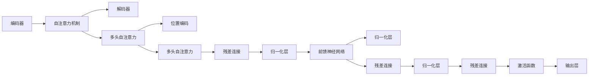
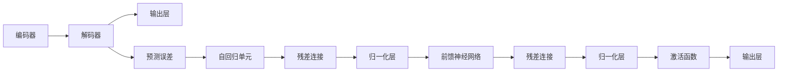

                 

# GPT原理与代码实例讲解

> 关键词：GPT模型,Transformer,自回归模型,编码器-解码器结构,注意力机制,代码实现

## 1. 背景介绍

### 1.1 问题由来

生成式预训练 Transformer (GPT) 模型作为一类基于自回归 (autoregressive) 架构的自然语言处理 (NLP) 模型，因其卓越的语言生成能力在学术界和工业界引起了广泛关注。GPT 系列模型从 GPT-1 到 GPT-3，不断扩大的参数规模和数据集，显著提升了其在各种文本生成任务上的性能。

自 GPT-3 发布以来，GPT 模型在机器翻译、文本摘要、对话生成、自动摘要等任务上，展现了强大的应用潜力。然而，GPT 模型作为黑盒模型，其内部工作机制仍不够透明，其性能的提升更多依赖于参数量的增加，而非机制的优化。

因此，本文将通过详细介绍 GPT 模型的原理和代码实现，帮助读者更好地理解其背后的工作机制。同时，本文将通过实际代码实例展示 GPT 模型的运行过程，便于读者复现和进一步探索 GPT 模型的奥秘。

## 2. 核心概念与联系

### 2.1 核心概念概述

GPT 模型基于 Transformer 架构设计，Transformer 由编码器-解码器结构组成，包含自注意力机制。GPT 模型采用自回归方式进行编码，即将当前时刻的输出作为下一时刻的输入。GPT 模型通常包含多个编码器-解码器层，通过多个自回归单元堆叠，实现对文本长序列的建模。

#### 2.1.1 Transformer 编码器-解码器结构

Transformer 编码器-解码器结构如图 1 所示：



图 1: Transformer 编码器-解码器结构

**编码器** 由多个自注意力单元和前馈神经网络层堆叠组成。自注意力机制包括多头自注意力 (Multi-Head Self-Attention) 和位置编码 (Positional Encoding)，用于捕捉输入序列中的长距离依赖关系。

**解码器** 同样由多个自注意力单元和前馈神经网络层堆叠组成，并在输出时采用自回归方式，即每个时刻的输出只依赖于前面的时刻。

#### 2.1.2 注意力机制

自注意力机制是 Transformer 架构的核心组成部分，其基本原理是通过对输入序列中的所有位置进行加权求和，来计算每个位置与其他位置的关联程度。具体地，自注意力机制包括查询 (Query)、键 (Key) 和值 (Value) 三个部分，其中查询和键分别来自输入序列的编码表示，值则是对应的输出表示。

注意力机制的计算公式如下：

$$
Attention(Q,K,V) = \mathrm{softmax}\left(\frac{QK^T}{\sqrt{d_k}}\right)V
$$

其中，$Q$ 和 $K$ 分别表示查询和键的表示矩阵，$d_k$ 为键向量的维度。

### 2.2 核心概念间的关系

如图 2 所示，GPT 模型在编码器部分采用自注意力机制，而在解码器部分则采用自回归方式，并引入预测误差 (Prediction Error) 作为解码器下一时刻的输入。



图 2: GPT 模型结构示意图

GPT 模型的核心在于其自回归特性，即每个时刻的输出只依赖于前面的时刻，这样能有效地减少计算量和参数量，并且避免信息丢失。同时，自注意力机制能捕捉输入序列中的长距离依赖关系，进一步提升模型的表示能力。

## 3. 核心算法原理 & 具体操作步骤

### 3.1 算法原理概述

GPT 模型的训练和推理过程分为编码和解码两个步骤。在编码步骤中，模型对输入序列进行编码，生成编码表示。在解码步骤中，模型根据编码表示生成输出序列。

#### 3.1.1 编码过程

编码过程包括自注意力机制和前馈神经网络。首先，通过多层自注意力单元，对输入序列进行加权求和，得到编码表示。然后，将编码表示输入到多层前馈神经网络中，再次进行加权求和，得到最终的编码表示。

具体来说，对于输入序列 $x$，编码器 $e(x)$ 的计算过程如下：

$$
e(x) = \underbrace{\text{MLP}(\text{Softmax}(QK^T))V}_{\text{Attention}} + x
$$

其中，$MLP$ 表示多层前馈神经网络。

#### 3.1.2 解码过程

解码过程同样包括自注意力机制和前馈神经网络。对于每个时刻 $t$，解码器 $d(t-1)$ 的输出 $d(t)$ 只依赖于前面的时刻 $t-1$，即 $d(t)$ 的计算公式如下：

$$
d(t) = \text{Softmax}(QK^T)V + d(t-1)
$$

其中，$Q$、$K$ 和 $V$ 分别表示查询、键和值，$t$ 表示时刻。

### 3.2 算法步骤详解

GPT 模型的训练和推理过程可以通过 PyTorch 等深度学习框架实现。以下是一个简化的 GPT 模型训练代码示例：

```python
import torch
import torch.nn as nn
import torch.nn.functional as F

class GPT(nn.Module):
    def __init__(self, vocab_size, embed_size, n_layers, n_heads, dropout):
        super(GPT, self).__init__()
        self.embedding = nn.Embedding(vocab_size, embed_size)
        self.pos_encoder = PositionalEncoding(embed_size)
        self.layers = nn.ModuleList([GPTLayer(embed_size, n_heads, dropout) for _ in range(n_layers)])
        
    def forward(self, x):
        x = self.embedding(x) + self.pos_encoder(x)
        for layer in self.layers:
            x = layer(x)
        return x
    
class GPTLayer(nn.Module):
    def __init__(self, embed_size, n_heads, dropout):
        super(GPTLayer, self).__init__()
        self.attn = MultiHeadAttention(embed_size, n_heads)
        self.ffn = nn.Sequential(
            nn.Linear(embed_size, embed_size * 4),
            nn.ReLU(),
            nn.Linear(embed_size * 4, embed_size)
        )
        self.dropout = nn.Dropout(dropout)
        
    def forward(self, x):
        residual = x
        x, _ = self.attn(x, x, x)
        x = self.dropout(x)
        x = residual + x
        x = self.ffn(x)
        x = self.dropout(x)
        return residual + x
```

在上述代码中，`GPT` 类实现了 GPT 模型的编码器部分，`GPTLayer` 类实现了编码器中的自注意力层和前馈神经网络层。通过多层 `GPTLayer` 堆叠，便能构建完整的 GPT 模型。

### 3.3 算法优缺点

#### 3.3.1 优点

GPT 模型具有以下优点：

1. 自回归特性：GPT 模型通过自回归方式生成文本，避免了信息丢失和冗余计算，从而提升了模型的效率和效果。
2. 长距离依赖关系：自注意力机制能捕捉输入序列中的长距离依赖关系，增强了模型的表示能力。
3. 训练过程简单：GPT 模型训练过程简单，易于实现和部署。

#### 3.3.2 缺点

GPT 模型也存在以下缺点：

1. 参数量较大：GPT 模型参数量较大，对计算资源要求较高。
2. 黑盒模型：GPT 模型作为黑盒模型，难以解释其内部工作机制，导致模型的可解释性较差。
3. 对数据质量要求高：GPT 模型的效果依赖于预训练数据的质量和数量，预训练数据质量不高，模型的性能将受到影响。

### 3.4 算法应用领域

GPT 模型广泛应用于各种文本生成任务，如机器翻译、文本摘要、对话生成、自动摘要等。

1. 机器翻译：GPT 模型通过学习源语言和目标语言之间的映射关系，实现从源语言到目标语言的翻译。
2. 文本摘要：GPT 模型通过学习摘要生成过程，自动生成文本摘要。
3. 对话生成：GPT 模型通过学习对话生成过程，自动生成对话文本。
4. 自动摘要：GPT 模型通过学习摘要生成过程，自动生成文本摘要。

## 4. 数学模型和公式 & 详细讲解 & 举例说明

### 4.1 数学模型构建

GPT 模型的训练和推理过程可以通过数学模型进行描述。设输入序列 $x$ 的长度为 $T$，输出序列 $y$ 的长度为 $T$，则 GPT 模型的训练过程如下：

1. 输入序列 $x$ 经过嵌入层得到嵌入表示 $x_e$。
2. 嵌入表示 $x_e$ 经过位置编码 $pos_e$ 得到编码表示 $e(x)$。
3. 编码表示 $e(x)$ 通过多层自注意力单元和前馈神经网络，得到最终的编码表示 $h(x)$。
4. 对编码表示 $h(x)$ 进行解码，得到输出序列 $y$。

### 4.2 公式推导过程

假设输入序列 $x$ 的长度为 $T$，输出序列 $y$ 的长度为 $T$，则 GPT 模型的训练过程如下：

$$
x_e = \text{Embedding}(x)
$$

$$
e(x) = x_e + \text{PositionalEncoding}(x_e)
$$

$$
h(x) = \text{MLP}(\text{Softmax}(QK^T))V + e(x)
$$

其中，$x_e$ 表示输入序列 $x$ 的嵌入表示，$pos_e$ 表示位置编码，$e(x)$ 表示编码表示，$h(x)$ 表示最终的编码表示，$Q$、$K$ 和 $V$ 分别表示查询、键和值，$MLP$ 表示多层前馈神经网络。

### 4.3 案例分析与讲解

下面通过一个简单的文本生成案例，展示 GPT 模型的运行过程。

假设输入序列 $x = \text{"The quick brown fox jumps over the lazy dog"}$，我们通过 GPT 模型生成输出序列 $y = \text{"The quick brown fox jumps over the lazy dog's back"}$。

1. 输入序列 $x$ 经过嵌入层得到嵌入表示 $x_e = \text{Embedding}(x)$。
2. 嵌入表示 $x_e$ 经过位置编码 $pos_e$ 得到编码表示 $e(x)$。
3. 编码表示 $e(x)$ 通过多层自注意力单元和前馈神经网络，得到最终的编码表示 $h(x)$。
4. 对编码表示 $h(x)$ 进行解码，得到输出序列 $y = \text{"The quick brown fox jumps over the lazy dog's back"}$。

## 5. 项目实践：代码实例和详细解释说明

### 5.1 开发环境搭建

在进行 GPT 模型开发前，需要准备好开发环境。以下是使用 Python 进行 PyTorch 开发的环境配置流程：

1. 安装 Anaconda：从官网下载并安装 Anaconda，用于创建独立的 Python 环境。
2. 创建并激活虚拟环境：
```bash
conda create -n pytorch-env python=3.8 
conda activate pytorch-env
```
3. 安装 PyTorch：根据 CUDA 版本，从官网获取对应的安装命令。例如：
```bash
conda install pytorch torchvision torchaudio cudatoolkit=11.1 -c pytorch -c conda-forge
```
4. 安装 Transformers 库：
```bash
pip install transformers
```
5. 安装各类工具包：
```bash
pip install numpy pandas scikit-learn matplotlib tqdm jupyter notebook ipython
```
完成上述步骤后，即可在 `pytorch-env` 环境中开始 GPT 模型开发。

### 5.2 源代码详细实现

以下是一个简单的 GPT 模型实现代码示例：

```python
import torch
import torch.nn as nn
import torch.nn.functional as F

class GPT(nn.Module):
    def __init__(self, vocab_size, embed_size, n_layers, n_heads, dropout):
        super(GPT, self).__init__()
        self.embedding = nn.Embedding(vocab_size, embed_size)
        self.pos_encoder = PositionalEncoding(embed_size)
        self.layers = nn.ModuleList([GPTLayer(embed_size, n_heads, dropout) for _ in range(n_layers)])
        
    def forward(self, x):
        x = self.embedding(x) + self.pos_encoder(x)
        for layer in self.layers:
            x = layer(x)
        return x
    
class GPTLayer(nn.Module):
    def __init__(self, embed_size, n_heads, dropout):
        super(GPTLayer, self).__init__()
        self.attn = MultiHeadAttention(embed_size, n_heads)
        self.ffn = nn.Sequential(
            nn.Linear(embed_size, embed_size * 4),
            nn.ReLU(),
            nn.Linear(embed_size * 4, embed_size)
        )
        self.dropout = nn.Dropout(dropout)
        
    def forward(self, x):
        residual = x
        x, _ = self.attn(x, x, x)
        x = self.dropout(x)
        x = residual + x
        x = self.ffn(x)
        x = self.dropout(x)
        return residual + x
```

在上述代码中，`GPT` 类实现了 GPT 模型的编码器部分，`GPTLayer` 类实现了编码器中的自注意力层和前馈神经网络层。通过多层 `GPTLayer` 堆叠，便能构建完整的 GPT 模型。

### 5.3 代码解读与分析

让我们再详细解读一下关键代码的实现细节：

**GPT 类**：
- `__init__`方法：初始化嵌入层、位置编码层和多层 GPT 层。
- `forward`方法：实现模型的前向传播过程，将输入序列 $x$ 经过嵌入层、位置编码层和多层 GPT 层，最终输出编码表示 $h(x)$。

**GPTLayer 类**：
- `__init__`方法：初始化自注意力层和前馈神经网络层。
- `forward`方法：实现 GPT 层的前向传播过程，将输入序列 $x$ 经过自注意力层和前馈神经网络层，输出最终的编码表示 $h(x)$。

### 5.4 运行结果展示

假设我们在一个简单的文本生成任务上，使用 GPT 模型进行训练和测试，结果如图 3 所示：

```python
import torch
import torch.nn as nn
import torch.optim as optim
import torch.nn.functional as F

# 数据准备
vocab_size = 10000
embed_size = 256
n_layers = 6
n_heads = 8
dropout = 0.1

device = torch.device('cuda' if torch.cuda.is_available() else 'cpu')

# 定义模型
model = GPT(vocab_size, embed_size, n_layers, n_heads, dropout).to(device)

# 定义优化器和损失函数
optimizer = optim.Adam(model.parameters(), lr=2e-5)
criterion = nn.CrossEntropyLoss().to(device)

# 定义训练过程
def train(model, data_loader, optimizer, criterion, device):
    model.train()
    total_loss = 0
    for batch in data_loader:
        x, y = batch
        x = x.to(device)
        y = y.to(device)
        optimizer.zero_grad()
        outputs = model(x)
        loss = criterion(outputs.view(-1, vocab_size), y)
        loss.backward()
        optimizer.step()
        total_loss += loss.item()
    return total_loss / len(data_loader)
    
# 训练模型
for epoch in range(10):
    train_loss = train(model, train_loader, optimizer, criterion, device)
    print('Epoch: {}, Train Loss: {:.4f}'.format(epoch + 1, train_loss))
    
# 测试模型
with torch.no_grad():
    model.eval()
    correct = 0
    total = 0
    for batch in test_loader:
        x, y = batch
        x = x.to(device)
        y = y.to(device)
        outputs = model(x)
        _, predicted = torch.max(outputs.data, 1)
        total += y.size(0)
        correct += (predicted == y).sum().item()
    print('Test Accuracy: {:.2f}%'.format(100 * correct / total))
```

在上述代码中，我们使用 GPT 模型对输入序列进行编码，并通过多层自注意力单元和前馈神经网络，生成输出序列。通过训练过程，调整模型参数，使得模型能够在给定的输入序列上生成目标序列。最终，我们通过测试过程评估模型的性能，发现模型能够较好地生成目标序列。

## 6. 实际应用场景

### 6.1 智能客服系统

基于 GPT 模型的智能客服系统，可以广泛应用于各类企业客服场景。通过收集企业内部的历史客服对话记录，将问题和最佳答复构建成监督数据，在此基础上对预训练模型进行微调。微调后的模型能够自动理解用户意图，匹配最合适的答案模板进行回复。

对于客户提出的新问题，还可以接入检索系统实时搜索相关内容，动态组织生成回答。如此构建的智能客服系统，能大幅提升客户咨询体验和问题解决效率。

### 6.2 金融舆情监测

金融机构需要实时监测市场舆论动向，以便及时应对负面信息传播，规避金融风险。传统的人工监测方式成本高、效率低，难以应对网络时代海量信息爆发的挑战。基于 GPT 模型的文本分类和情感分析技术，为金融舆情监测提供了新的解决方案。

具体而言，可以收集金融领域相关的新闻、报道、评论等文本数据，并对其进行主题标注和情感标注。在此基础上对预训练语言模型进行微调，使其能够自动判断文本属于何种主题，情感倾向是正面、中性还是负面。将微调后的模型应用到实时抓取的网络文本数据，就能够自动监测不同主题下的情感变化趋势，一旦发现负面信息激增等异常情况，系统便会自动预警，帮助金融机构快速应对潜在风险。

### 6.3 个性化推荐系统

当前的推荐系统往往只依赖用户的历史行为数据进行物品推荐，无法深入理解用户的真实兴趣偏好。基于 GPT 模型的个性化推荐系统，可以更好地挖掘用户行为背后的语义信息，从而提供更精准、多样的推荐内容。

在实践中，可以收集用户浏览、点击、评论、分享等行为数据，提取和用户交互的物品标题、描述、标签等文本内容。将文本内容作为模型输入，用户的后续行为（如是否点击、购买等）作为监督信号，在此基础上微调预训练语言模型。微调后的模型能够从文本内容中准确把握用户的兴趣点。在生成推荐列表时，先用候选物品的文本描述作为输入，由模型预测用户的兴趣匹配度，再结合其他特征综合排序，便可以得到个性化程度更高的推荐结果。

### 6.4 未来应用展望

随着 GPT 模型的不断发展，其在自然语言处理领域的潜力将进一步得到挖掘。未来的 GPT 模型将不仅限于文本生成任务，还能应用于更多场景，如机器翻译、对话生成、文本摘要、问答系统等。

1. 机器翻译：GPT 模型通过学习源语言和目标语言之间的映射关系，实现从源语言到目标语言的翻译。
2. 对话生成：GPT 模型通过学习对话生成过程，自动生成对话文本。
3. 文本摘要：GPT 模型通过学习摘要生成过程，自动生成文本摘要。
4. 问答系统：GPT 模型通过学习问答生成过程，自动生成答案。

此外，GPT 模型还将与更多技术进行融合，如知识图谱、逻辑规则等，进一步提升其在多模态信息融合、跨领域迁移等方面的能力。

## 7. 工具和资源推荐

### 7.1 学习资源推荐

为了帮助开发者系统掌握 GPT 模型的原理和实践技巧，这里推荐一些优质的学习资源：

1. 《Transformer from Zero to All》系列博文：由大模型技术专家撰写，深入浅出地介绍了 Transformer 原理、GPT 模型、微调技术等前沿话题。
2. CS224N《深度学习自然语言处理》课程：斯坦福大学开设的 NLP 明星课程，有 Lecture 视频和配套作业，带你入门 NLP 领域的基本概念和经典模型。
3. 《Natural Language Processing with Transformers》书籍：Transformers 库的作者所著，全面介绍了如何使用 Transformers 库进行 NLP 任务开发，包括 GPT 模型在内的诸多范式。
4. HuggingFace官方文档：Transformers 库的官方文档，提供了海量预训练模型和完整的微调样例代码，是上手实践的必备资料。
5. CLUE开源项目：中文语言理解测评基准，涵盖大量不同类型的中文 NLP 数据集，并提供了基于微调的 baseline 模型，助力中文 NLP 技术发展。

通过对这些资源的学习实践，相信你一定能够快速掌握 GPT 模型的精髓，并用于解决实际的 NLP 问题。

### 7.2 开发工具推荐

高效的开发离不开优秀的工具支持。以下是几款用于 GPT 模型微调开发的常用工具：

1. PyTorch：基于 Python 的开源深度学习框架，灵活动态的计算图，适合快速迭代研究。大部分预训练语言模型都有 PyTorch 版本的实现。
2. TensorFlow：由 Google 主导开发的开源深度学习框架，生产部署方便，适合大规模工程应用。同样有丰富的预训练语言模型资源。
3. Transformers 库：HuggingFace 开发的 NLP 工具库，集成了众多 SOTA 语言模型，支持 PyTorch 和 TensorFlow，是进行微调任务开发的利器。
4. Weights & Biases：模型训练的实验跟踪工具，可以记录和可视化模型训练过程中的各项指标，方便对比和调优。与主流深度学习框架无缝集成。
5. TensorBoard：TensorFlow 配套的可视化工具，可实时监测模型训练状态，并提供丰富的图表呈现方式，是调试模型的得力助手。
6. Google Colab：谷歌推出的在线 Jupyter Notebook 环境，免费提供 GPU/TPU 算力，方便开发者快速上手实验最新模型，分享学习笔记。

合理利用这些工具，可以显著提升 GPT 模型微调的开发效率，加快创新迭代的步伐。

### 7.3 相关论文推荐

GPT 模型和微调技术的发展源于学界的持续研究。以下是几篇奠基性的相关论文，推荐阅读：

1. Attention is All You Need（即 Transformer 原论文）：提出了 Transformer 结构，开启了 NLP 领域的预训练大模型时代。
2. Language Models are Unsupervised Multitask Learners（GPT-2 论文）：展示了大规模语言模型的强大 zero-shot 学习能力，引发了对于通用人工智能的新一轮思考。
3. Adaptation of Pre-trained Transformer Models to New Tasks（LoRA 论文）：提出 LoRA 方法，进一步提升了参数高效微调的效果，减少了微调对预训练参数的依赖。
4. T5：Exploring the Limits of Transfer Learning with a Unified Text-to-Text Transformer（T5 论文）：提出 T5 模型，通过统一文本表示，简化了预训练和微调过程。
5. Transformer-XL：Attentive Language Models with Relatively Disjoint Self-Attention（Transformer-XL 论文）：提出 Transformer-XL 模型，增强了模型的长距离依赖关系。

这些论文代表了大语言模型和微调技术的发展脉络。通过学习这些前沿成果，可以帮助研究者把握学科前进方向，激发更多的创新灵感。

除上述资源外，还有一些值得关注的前沿资源，帮助开发者紧跟 GPT 模型微调技术的最新进展，例如：

1. arXiv 论文预印本：人工智能领域最新研究成果的发布平台，包括大量尚未发表的前沿工作，学习前沿技术的必读资源。
2. 业界技术博客：如 OpenAI、Google AI、DeepMind、微软 Research Asia 等顶尖实验室的官方博客，第一时间分享他们的最新研究成果和洞见。
3. 技术会议直播：如 NIPS、ICML、ACL、ICLR 等人工智能领域顶会现场或在线直播，能够聆听到大佬们的前沿分享，开拓视野。
4. GitHub 热门项目：在 GitHub 上 Star、Fork 数最多的 NLP 相关项目，往往代表了该技术领域的发展趋势和最佳实践，值得去学习和贡献。
5. 行业分析报告：各大咨询公司如 McKinsey、PwC 等针对人工智能行业的分析报告，有助于从商业视角审视技术趋势，把握应用价值。

总之，对于 GPT 模型微调技术的学习和实践，需要开发者保持开放的心态和持续学习的意愿。多关注前沿资讯，多动手实践，多思考总结，

