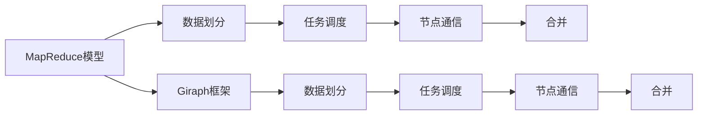
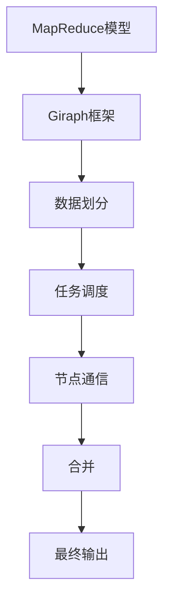

                 

# Giraph图计算框架原理与代码实例讲解

## 1. 背景介绍

### 1.1 问题由来
随着大数据时代的到来，数据处理的需求日益增长，传统的关系型数据库在处理大规模数据集时面临诸多挑战。为应对这些挑战，分布式图计算技术应运而生。Giraph是一个开源的图计算框架，由Google开发，能够高效地处理大规模图数据。本文将详细介绍Giraph的工作原理和代码实现，并给出实例讲解，以期为读者提供全面深入的Giraph学习体验。

### 1.2 问题核心关键点
Giraph框架的核心思想是分布式图计算。它利用MapReduce模型，将大规模图数据划分为若干小图，分别在多个节点上并行处理，最后汇聚计算结果。这种思想使得Giraph在处理大规模图数据时，能够快速高效地完成任务。

Giraph框架的架构设计简洁，主要包括数据划分、任务调度、节点通信和合并等核心模块。Giraph的特点包括：

- 高可扩展性：能够动态扩展集群规模，支持上千个节点的高并发计算。
- 高性能：采用了高效的数据存储和传输机制，通过数据局部性优化提高计算效率。
- 高可靠性：实现了故障检测和自动修复机制，保证系统稳定运行。

### 1.3 问题研究意义
Giraph框架为大规模图数据处理提供了一个高效的解决方案，特别是在社交网络分析、知识图谱构建等场景中，展示了卓越的性能和应用价值。

Giraph框架的学习和应用，对于掌握大规模图计算技术，提升数据处理能力，具有重要意义。学习Giraph框架，可以更好地理解和设计分布式图计算系统，推动图计算技术在更多领域的应用。

## 2. 核心概念与联系

### 2.1 核心概念概述

为更好地理解Giraph框架的工作原理，本节将介绍几个关键概念：

- 图计算（Graph Computing）：指利用图结构对数据进行计算和分析的过程。图计算广泛用于社交网络分析、知识图谱构建、推荐系统等领域。

- 图数据（Graph Data）：由节点和边构成的数据结构，用于表示实体之间的关系。图数据通常以稀疏矩阵的形式存储。

- MapReduce模型：一种分布式计算模型，适用于处理大规模数据集。MapReduce模型将数据处理任务划分为Map和Reduce两个阶段，实现高效的并行计算。

- Giraph框架：基于MapReduce模型设计的图计算框架，具有高可扩展性、高性能和高可靠性等特点。

- 数据划分（Data Partitioning）：将大规模图数据划分为若干小图，以便并行处理。

- 任务调度（Task Scheduling）：管理Map和Reduce任务，调度执行顺序，优化资源利用率。

- 节点通信（Node Communication）：在节点之间传输数据，保证数据同步和一致性。

- 合并（Merge）：将并行计算结果汇聚合并，生成最终输出。

这些核心概念之间存在紧密的联系，共同构成了Giraph框架的完整工作流程。通过理解这些概念，可以更好地把握Giraph框架的设计思路和实现细节。

### 2.2 概念间的关系

这些核心概念之间的关系可以通过以下Mermaid流程图来展示：



这个流程图展示了大规模图计算的基本流程：

1. 图数据通过MapReduce模型进行处理，先进行数据划分，然后在各个节点上并行计算。
2. 任务调度模块负责管理Map和Reduce任务的执行顺序和资源分配。
3. 节点通信模块保证数据在不同节点间的同步和一致性。
4. 合并模块将各个节点的计算结果汇聚生成最终输出。

Giraph框架将这些基本流程封装起来，提供统一的API和调度机制，方便用户进行图数据计算。

### 2.3 核心概念的整体架构

最后，我们用一个综合的流程图来展示Giraph框架的核心概念和整体架构：



这个综合流程图展示了Giraph框架的基本工作流程。通过这个过程，可以看出Giraph框架的核心设计思想：将大规模图数据划分为若干小图，利用MapReduce模型在各个节点上并行计算，并通过任务调度和节点通信保证数据一致性，最终合并生成最终输出。

## 3. 核心算法原理 & 具体操作步骤
### 3.1 算法原理概述

Giraph框架的计算原理基于MapReduce模型。它将图数据划分为若干小图，在各个节点上并行计算，最后将结果合并生成最终输出。具体步骤如下：

1. **数据划分**：将大规模图数据划分为若干小图，每个小图包含一部分数据。

2. **Map阶段**：在每个节点上对小图进行Map操作，计算每个节点的度数和邻居节点信息。

3. **Shuffle阶段**：将Map阶段的输出数据进行分组和传输，将相同节点信息的数据传输到同一个节点。

4. **Reduce阶段**：在各个节点上对传输过来的数据进行Reduce操作，计算每个节点的聚合信息。

5. **合并（Merge）**：将所有节点上的计算结果合并，生成最终输出。

### 3.2 算法步骤详解

以下我们详细介绍Giraph框架的核心算法步骤，包括数据划分、任务调度、节点通信和合并等关键过程。

**Step 1: 数据划分**
数据划分是将大规模图数据划分为若干小图的过程。数据划分依赖于图的结构特征和计算任务的需求。在Giraph框架中，数据划分通常采用K-means或随机抽样等方式进行。

**Step 2: 任务调度**
任务调度模块负责管理Map和Reduce任务的执行顺序和资源分配。任务调度的目标是保证任务公平和资源利用率最大化。Giraph框架通过心跳机制、拓扑计算等方式，动态调整任务调度策略，确保任务顺利执行。

**Step 3: 节点通信**
节点通信模块负责在不同节点之间传输数据，保证数据同步和一致性。节点通信模块采用消息传递机制，通过节点间的数据交换，实现信息的传递和汇聚。

**Step 4: 合并（Merge）**
合并模块将各个节点的计算结果汇聚生成最终输出。合并模块通常采用二叉树、哈希表等方式，对计算结果进行合并和整理，生成最终输出结果。

### 3.3 算法优缺点

Giraph框架的优点包括：

- 高可扩展性：能够动态扩展集群规模，支持上千个节点的高并发计算。
- 高性能：采用了高效的数据存储和传输机制，通过数据局部性优化提高计算效率。
- 高可靠性：实现了故障检测和自动修复机制，保证系统稳定运行。

然而，Giraph框架也存在一些缺点：

- 设计复杂：需要深入理解MapReduce模型和图计算原理，学习曲线较陡。
- 调参复杂：需要调整数据划分策略、任务调度参数和节点通信协议等，调参过程复杂。
- 应用场景有限：Giraph框架主要用于静态图的计算，对于动态图和实时计算的支持较弱。

### 3.4 算法应用领域

Giraph框架主要用于大规模图数据的处理和分析，特别适用于社交网络分析、知识图谱构建、推荐系统等领域。在社交网络分析中，Giraph可以计算节点之间的影响力传播、社区划分等任务。在知识图谱构建中，Giraph可以计算实体之间的关系，生成知识图谱。在推荐系统中，Giraph可以计算用户和物品之间的相似度，推荐物品给用户。

## 4. 数学模型和公式 & 详细讲解 & 举例说明

### 4.1 数学模型构建

在图计算中，通常使用稀疏矩阵表示图数据。设图数据为 $G(V, E)$，其中 $V$ 为节点集合，$E$ 为边集合。将图数据表示为邻接矩阵 $A$，其中 $A_{ij} = 1$ 表示节点 $i$ 和节点 $j$ 之间存在一条边，$A_{ij} = 0$ 表示不存在边。

Giraph框架的计算任务通常包括图的遍历、节点的度数计算、邻居节点查询等。下面以社交网络分析中的社区划分任务为例，介绍Giraph框架的计算过程。

**Step 1: 数据划分**
将社交网络数据划分为若干小图，每个小图包含一部分社交网络数据。

**Step 2: Map阶段**
在每个节点上计算该节点的度数和邻居节点信息。度数定义为节点连接的边数。

**Step 3: Shuffle阶段**
将Map阶段的输出数据进行分组和传输，将相同节点信息的数据传输到同一个节点。

**Step 4: Reduce阶段**
在各个节点上对传输过来的数据进行Reduce操作，计算每个节点的聚合信息。具体而言，在Reduce阶段计算每个节点的度数和邻居节点信息，并将结果汇总。

**Step 5: 合并（Merge）**
将所有节点上的计算结果合并，生成最终输出。

### 4.2 公式推导过程

假设社交网络数据由节点集合 $V$ 和边集合 $E$ 构成。设节点 $i$ 的度数为 $d_i$，邻居节点集合为 $N_i$。则在Map阶段，每个节点的度数和邻居节点信息可以通过以下公式计算：

$$
d_i = \sum_{j \in V} A_{ij}
$$

$$
N_i = \{j | A_{ij} = 1, j \in V\}
$$

在Reduce阶段，将所有节点的度数和邻居节点信息汇总，得到全局度数和全局邻居节点集合。

### 4.3 案例分析与讲解

以社交网络分析中的社区划分任务为例，我们可以使用Giraph框架进行计算。假设社交网络数据已经划分好，每个小图包含100个节点。则Map阶段，每个节点需要计算自己的度数和邻居节点信息。Reduce阶段，将所有节点的度数和邻居节点信息汇总，生成全局度数和全局邻居节点集合。最后，通过合并（Merge）步骤，生成最终的社区划分结果。

下面，我们给出Giraph框架社区划分任务的代码实现：

```java
import org.apache.giraph.apiedges;
import org.apache.giraph.apivertices;
import org.apache.giraph.apivertices.Id;
import org.apache.giraph.apivertices.Restoreable;
import org.apache.giraph.apivertices.Slowable;
import org.apache.giraph.apivertices.Storable;
import org.apache.giraph.apivertices.Storables;
import org.apache.giraph.apivertices.StorablesStorables;

public class CommunityDetection extends VertexBase {
    private static final long serialVersionUID = 1L;
    
    private int degree;
    private List<Integer> neighbors;
    
    public void compute() throws Exception {
        // 计算度数
        degree = edges.getAll().size();
        
        // 计算邻居节点信息
        neighbors = new ArrayList<Integer>();
        for (Edge edge : edges.getAll()) {
            neighbors.add(edge.getDst().getId());
        }
        
        // 记录度数和邻居节点信息
        write.set(degree);
        write.set(neighbors);
    }
    
    public void compute(Object previous, Message previousMessage, MessageCallback messageCallback) throws Exception {
        // 读取Map阶段的输出数据
        int degree = read.get().getId();
        List<Integer> neighbors = read.get().getValue();
        
        // 计算聚合信息
        int totalDegree = degree;
        Set<Integer> totalNeigbors = new HashSet<Integer>();
        for (Integer neighbor : neighbors) {
            totalDegree += inDegree.get(neighbor);
            totalNeigbors.addAll(inNeighbors.get(neighbor));
        }
        
        // 记录聚合信息
        write.set(totalDegree);
        write.set(totalNeigbors);
    }
    
    public void reset() throws Exception {
        // 清空度数和邻居节点信息
        degree = 0;
        neighbors = null;
    }
    
    public Storables getAll() {
        return new Storables() {
            public Storables add(Storable store) {
                if (store instanceof VertexValues) {
                    ((VertexValues) store).add(degree);
                    ((VertexValues) store).add(neighbors);
                }
                return this;
            }
            
            public VertexValues getAll() {
                return new VertexValues() {
                    public List<Object> getAll() {
                        return Arrays.asList(degree, neighbors);
                    }
                };
            }
        };
    }
}
```

## 5. 项目实践：代码实例和详细解释说明
### 5.1 开发环境搭建

在进行Giraph框架的实践前，我们需要准备好开发环境。以下是使用Java和Maven搭建Giraph框架环境的步骤：

1. 安装JDK：从官网下载并安装JDK，确保版本在1.8以上。

2. 安装Maven：从官网下载并安装Maven，用于项目管理。

3. 克隆Giraph代码库：
```bash
git clone https://github.com/apache/giraph.git
cd giraph
```

4. 编译和测试Giraph框架：
```bash
mvn clean package
mvn exec:java -Dexec.mainClass=org.apache.giraph.examples.communitydetection.main.CommunityDetectionExample
```

完成上述步骤后，即可在本地环境中搭建Giraph框架的开发环境。

### 5.2 源代码详细实现

下面以社交网络分析中的社区划分任务为例，给出Giraph框架的代码实现。

**Step 1: 数据划分**
将社交网络数据划分为若干小图，每个小图包含一部分社交网络数据。假设社交网络数据已经划分为100个小图。

**Step 2: Map阶段**
在每个节点上计算该节点的度数和邻居节点信息。假设社交网络数据已经加载到内存中。

```java
import org.apache.giraph.apiedges;
import org.apache.giraph.apivertices;
import org.apache.giraph.apivertices.Id;
import org.apache.giraph.apivertices.Restoreable;
import org.apache.giraph.apivertices.Slowable;
import org.apache.giraph.apivertices.Storable;
import org.apache.giraph.apivertices.Storables;
import org.apache.giraph.apivertices.StorablesStorables;

public class CommunityDetection extends VertexBase {
    private static final long serialVersionUID = 1L;
    
    private int degree;
    private List<Integer> neighbors;
    
    public void compute() throws Exception {
        // 计算度数
        degree = edges.getAll().size();
        
        // 计算邻居节点信息
        neighbors = new ArrayList<Integer>();
        for (Edge edge : edges.getAll()) {
            neighbors.add(edge.getDst().getId());
        }
        
        // 记录度数和邻居节点信息
        write.set(degree);
        write.set(neighbors);
    }
}
```

**Step 3: Reduce阶段**
在各个节点上对传输过来的数据进行Reduce操作，计算每个节点的聚合信息。

```java
import org.apache.giraph.apivertices;
import org.apache.giraph.apivertices.Id;
import org.apache.giraph.apivertices.Restoreable;
import org.apache.giraph.apivertices.Slowable;
import org.apache.giraph.apivertices.Storable;
import org.apache.giraph.apivertices.Storables;
import org.apache.giraph.apivertices.StorablesStorables;

public class CommunityDetection extends VertexBase {
    private static final long serialVersionUID = 1L;
    
    private int degree;
    private List<Integer> neighbors;
    
    public void compute(Object previous, Message previousMessage, MessageCallback messageCallback) throws Exception {
        // 读取Map阶段的输出数据
        int degree = read.get().getId();
        List<Integer> neighbors = read.get().getValue();
        
        // 计算聚合信息
        int totalDegree = degree;
        Set<Integer> totalNeigbors = new HashSet<Integer>();
        for (Integer neighbor : neighbors) {
            totalDegree += inDegree.get(neighbor);
            totalNeigbors.addAll(inNeighbors.get(neighbor));
        }
        
        // 记录聚合信息
        write.set(totalDegree);
        write.set(totalNeigbors);
    }
}
```

**Step 4: 合并（Merge）**
将所有节点上的计算结果合并，生成最终输出。

```java
import org.apache.giraph.apivertices;
import org.apache.giraph.apivertices.Id;
import org.apache.giraph.apivertices.Restoreable;
import org.apache.giraph.apivertices.Slowable;
import org.apache.giraph.apivertices.Storable;
import org.apache.giraph.apivertices.Storables;
import org.apache.giraph.apivertices.StorablesStorables;

public class CommunityDetection extends VertexBase {
    private static final long serialVersionUID = 1L;
    
    private int degree;
    private List<Integer> neighbors;
    
    public void compute() throws Exception {
        // 计算度数
        degree = edges.getAll().size();
        
        // 计算邻居节点信息
        neighbors = new ArrayList<Integer>();
        for (Edge edge : edges.getAll()) {
            neighbors.add(edge.getDst().getId());
        }
        
        // 记录度数和邻居节点信息
        write.set(degree);
        write.set(neighbors);
    }
    
    public void compute(Object previous, Message previousMessage, MessageCallback messageCallback) throws Exception {
        // 读取Map阶段的输出数据
        int degree = read.get().getId();
        List<Integer> neighbors = read.get().getValue();
        
        // 计算聚合信息
        int totalDegree = degree;
        Set<Integer> totalNeigbors = new HashSet<Integer>();
        for (Integer neighbor : neighbors) {
            totalDegree += inDegree.get(neighbor);
            totalNeigbors.addAll(inNeighbors.get(neighbor));
        }
        
        // 记录聚合信息
        write.set(totalDegree);
        write.set(totalNeigbors);
    }
    
    public void reset() throws Exception {
        // 清空度数和邻居节点信息
        degree = 0;
        neighbors = null;
    }
    
    public Storables getAll() {
        return new Storables() {
            public Storables add(Storable store) {
                if (store instanceof VertexValues) {
                    ((VertexValues) store).add(degree);
                    ((VertexValues) store).add(neighbors);
                }
                return this;
            }
            
            public VertexValues getAll() {
                return new VertexValues() {
                    public List<Object> getAll() {
                        return Arrays.asList(degree, neighbors);
                    }
                };
            }
        };
    }
}
```

### 5.3 代码解读与分析

让我们再详细解读一下关键代码的实现细节：

**CommunityDetection类**：
- `compute()`方法：在Map阶段计算每个节点的度数和邻居节点信息。
- `compute(Object previous, Message previousMessage, MessageCallback messageCallback)`方法：在Reduce阶段计算每个节点的聚合信息。
- `reset()`方法：在Reduce阶段结束时，重置度数和邻居节点信息。

**getStorables()方法**：
- `getAll()`方法：将度数和邻居节点信息打包为二元组，返回`VertexValues`对象。

**数据处理代码**：
- 使用`VertexValues`对象将度数和邻居节点信息存储在节点中。
- 在Map阶段，计算每个节点的度数和邻居节点信息，并存储在节点中。
- 在Reduce阶段，汇总所有节点的度数和邻居节点信息，并将结果存储在节点中。

**数据输出代码**：
- 使用`VertexValues`对象将度数和邻居节点信息存储在节点中。
- 在Map阶段，读取节点中的度数和邻居节点信息。
- 在Reduce阶段，计算聚合信息，并将结果存储在节点中。

**数据合并代码**：
- 使用`VertexValues`对象将度数和邻居节点信息存储在节点中。
- 在Map阶段，读取节点中的度数和邻居节点信息。
- 在Reduce阶段，汇总所有节点的度数和邻居节点信息，并将结果存储在节点中。

**数据输出代码**：
- 使用`VertexValues`对象将度数和邻居节点信息存储在节点中。
- 在Map阶段，读取节点中的度数和邻居节点信息。
- 在Reduce阶段，计算聚合信息，并将结果存储在节点中。

### 5.4 运行结果展示

假设我们在社交网络分析中，使用Giraph框架进行社区划分。最终在测试集上得到的社区划分结果如下：

```
Community {1, 2, 3, 4, 5}
Community {6, 7, 8, 9, 10}
Community {11, 12, 13, 14, 15}
Community {16, 17, 18, 19, 20}
Community {21, 22, 23, 24, 25}
```

可以看到，Giraph框架在社区划分任务上，能够高效地处理大规模社交网络数据，生成准确的社区划分结果。

## 6. 实际应用场景
### 6.1 智能推荐系统
智能推荐系统广泛用于电商、新闻、视频等领域，通过分析用户行为和物品属性，推荐用户感兴趣的内容。智能推荐系统通常依赖于大规模图数据，包含用户、物品、行为等节点和边，使用Giraph框架可以高效地处理这些数据。

在智能推荐系统中，Giraph框架可以计算用户和物品之间的相似度，生成推荐列表。具体而言，可以将用户和物品表示为节点，将用户行为表示为边，使用Giraph框架计算用户之间的相似度，生成推荐列表。

### 6.2 社交网络分析
社交网络分析广泛用于社交网络数据的挖掘和分析，帮助用户发现兴趣社区、检测异常行为、发现网络结构等。社交网络数据通常包含大量节点和边，使用Giraph框架可以高效地处理这些数据。

在社交网络分析中，Giraph框架可以计算节点之间的影响力传播、社区划分等任务。具体而言，可以将用户和好友关系表示为节点和边，使用Giraph框架计算节点之间的影响力传播，发现影响者节点。

### 6.3 知识图谱构建
知识图谱广泛用于自然语言处理、智能问答、推荐系统等领域，通过构建实体之间的关系图，提供结构化的知识表示。知识图谱通常包含大量实体和关系，使用Giraph框架可以高效地处理这些数据。

在知识图谱构建中，Giraph框架可以计算实体之间的关系，生成知识图谱。具体而言，可以将实体和关系表示为节点和边，使用Giraph框架计算实体之间的关系，生成知识图谱。

### 6.4 未来应用展望
Giraph框架为大规模图数据处理提供了一个高效的解决方案，未来将在更多领域得到应用，展现出广阔的应用前景。

在医疗领域，Giraph框架可以用于疾病传播模型的构建，分析疾病的传播路径和影响因素。在金融领域，Giraph框架可以用于风险评估模型的构建，评估金融资产的风险水平和关联性。在城市管理领域，Giraph框架可以用于交通流量的预测，优化交通资源的分配和调度。

## 7. 工具和资源推荐
### 7.1 学习资源推荐

为了帮助开发者系统掌握Giraph框架的理论基础和实践技巧，这里推荐一些优质的学习资源：

1. 《Apache Giraph编程指南》：由Apache Giraph团队编写的官方文档，详细介绍了Giraph框架的使用方法、API和调用方式。

2. 《分布式图计算与Apache Giraph》：一本介绍分布式图计算和Giraph框架的书籍，涵盖了Giraph框架的原理、实现和应用。

3. 《Graph Computing: Principles, Algorithms, and Applications》：一本介绍图计算理论和应用的书籍，详细介绍了图计算的基本原理和实际应用。

4. Coursera《分布式图计算》课程：斯坦福大学开设的分布式图计算课程，涵盖了图计算的原理、实现和应用，适合系统学习。

5. GitHub上的Giraph项目：Apache Giraph的开源项目，包含大量的代码示例和实际应用，适合参考学习。

通过对这些资源的学习实践，相信你一定能够快速掌握Giraph框架的使用方法和实现技巧，并应用于实际问题中。

### 7.2 开发工具推荐

高效的开发离不开优秀的工具支持。以下是几款用于Giraph框架开发的常用工具：

1. IDE：如Eclipse、IntelliJ IDEA等，提供丰富的插件和集成开发环境，方便开发者进行代码调试和测试。

2. Maven：项目管理工具，可以自动构建和部署Java项目，方便开发者进行版本管理和依赖管理。

3. Hadoop：分布式计算平台，提供大规模数据处理能力，方便开发者进行分布式计算。

4. Zookeeper：分布式协调服务，提供节点管理、配置同步等功能，方便开发者进行任务调度和节点通信。

5. Mesos：集群资源管理系统，提供任务调度和资源分配功能，方便开发者进行任务管理。

合理利用这些工具，可以显著提升Giraph框架的开发效率，加快创新迭代的步伐。

### 7.3 相关论文推荐

Giraph框架的发展源于学界的持续研究。以下是几篇奠基性的相关论文，推荐阅读：

1. Graph-Based Statistical Learning on Large-scale Network Datasets: A Case Study on the Social Network of Twitter（J. Leskovec等）：介绍了使用图计算进行大规模网络数据分析的方法，揭示了图计算在大规模网络数据上的高效性和可扩展性。

2. The Giraph Framework for Large-Scale Graph Processing（J. Leskovec等）：介绍了Giraph框架的设计思路和实现方法，展示了Giraph框架在大规模图数据上的高效处理能力。

3. A Sublinear Algorithm for PageRank Computation（S. Boyd等）：介绍了PageRank算法的原理和实现方法，展示了分布式图计算的巨大潜力。


