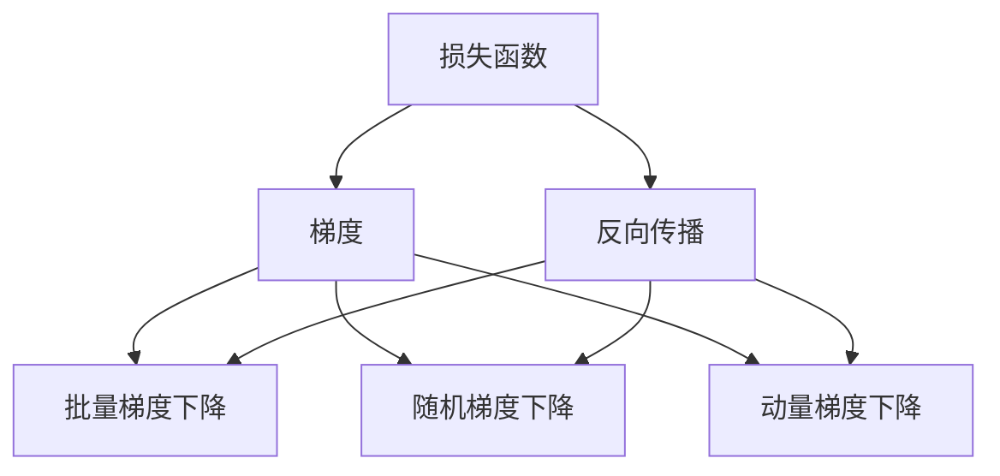

                 

# Gradient Descent原理与代码实例讲解

> 关键词：梯度下降, 优化算法, 反向传播, 损失函数, 参数更新, PyTorch, TensorFlow

## 1. 背景介绍

### 1.1 问题由来
在机器学习和深度学习中，优化算法是训练模型的核心部分。优化算法的目标是通过迭代更新模型参数，使得模型在给定的损失函数下达到最优状态。其中，梯度下降算法（Gradient Descent, GD）是最为基础且广泛使用的优化算法之一。本节将介绍梯度下降算法的基本原理和应用场景。

### 1.2 问题核心关键点
梯度下降算法的基本思想是通过不断更新模型参数，逐步降低损失函数。其核心在于如何计算损失函数的梯度，并根据梯度的方向和大小更新模型参数。梯度下降算法主要包括批量梯度下降（Batch Gradient Descent, BGD）、随机梯度下降（Stochastic Gradient Descent, SGD）和动量梯度下降（Momentum Gradient Descent）等变种。

### 1.3 问题研究意义
理解梯度下降算法对于深入掌握机器学习和深度学习的优化技术至关重要。通过深入学习梯度下降算法，可以更好地理解模型的训练过程和优化方法，有助于解决实际问题并优化模型性能。

## 2. 核心概念与联系

### 2.1 核心概念概述

#### 2.1.1 损失函数（Loss Function）
损失函数是衡量模型预测输出与真实标签之间差异的函数。训练模型的目标是找到最优参数，使得损失函数最小化。常见的损失函数包括均方误差（Mean Squared Error, MSE）、交叉熵（Cross-Entropy, CE）等。

#### 2.1.2 梯度（Gradient）
梯度是损失函数在参数空间中的导数，表示损失函数对参数的偏导数。梯度决定了参数更新方向和大小，是梯度下降算法的核心。

#### 2.1.3 反向传播（Backpropagation）
反向传播是一种计算梯度的方法，通过链式法则将损失函数的梯度逐层传递，最终计算出每个参数的梯度。反向传播是梯度下降算法的核心步骤。

#### 2.1.4 动量（Momentum）
动量梯度下降算法引入动量项，以加速梯度下降过程。动量项根据之前的梯度更新方向和大小，调整当前梯度的更新方向，从而减少震荡，加速收敛。

这些核心概念之间相互关联，形成了梯度下降算法的基本框架。通过理解这些概念，我们可以更好地掌握梯度下降算法的原理和应用。

### 2.2 概念间的关系

梯度下降算法涉及多个核心概念，这些概念之间存在着紧密的联系。以下通过一个简单的流程图展示这些概念之间的关系：



这个流程图展示了损失函数、梯度、反向传播以及它们的变种算法之间的关系。其中，反向传播是将损失函数的梯度传递到每个参数的过程，批量梯度下降、随机梯度下降和动量梯度下降是梯度下降算法的具体实现方式。

## 3. 核心算法原理 & 具体操作步骤
### 3.1 算法原理概述

梯度下降算法的基本思想是通过迭代更新模型参数，逐步降低损失函数。具体来说，梯度下降算法每次更新参数，使得参数沿着损失函数的梯度方向移动，从而使得损失函数逐步降低。

数学上，梯度下降算法可以表示为：

$$
\theta_{t+1} = \theta_t - \eta \nabla_{\theta} \mathcal{L}(\theta_t)
$$

其中，$\theta$ 表示模型参数，$t$ 表示迭代次数，$\eta$ 表示学习率，$\nabla_{\theta} \mathcal{L}(\theta_t)$ 表示损失函数对参数的梯度。学习率 $\eta$ 决定了每次更新的步长大小，是梯度下降算法的关键参数。

### 3.2 算法步骤详解

梯度下降算法的具体步骤如下：

1. **初始化参数**：随机初始化模型参数 $\theta$。
2. **计算损失函数梯度**：使用反向传播算法计算损失函数对每个参数的梯度。
3. **更新参数**：根据损失函数的梯度，更新模型参数。
4. **重复迭代**：重复第2、3步骤，直到损失函数收敛或达到预设迭代次数。

#### 3.2.1 批量梯度下降（Batch Gradient Descent, BGD）

批量梯度下降算法将整个训练集作为梯度计算的样本，即在每次迭代时计算整个训练集上的梯度，然后更新参数。批量梯度下降算法的计算复杂度高，但每次更新的参数更新较为稳定，适合于数据量较小的训练集。

#### 3.2.2 随机梯度下降（Stochastic Gradient Descent, SGD）

随机梯度下降算法在每次迭代时随机选择一个样本进行梯度计算，然后更新参数。这种方法计算复杂度低，但每次更新的参数更新较为随机，容易导致震荡。

#### 3.2.3 动量梯度下降（Momentum Gradient Descent）

动量梯度下降算法引入动量项，以加速梯度下降过程。动量项根据之前的梯度更新方向和大小，调整当前梯度的更新方向，从而减少震荡，加速收敛。

### 3.3 算法优缺点

#### 3.3.1 优点
1. 简单易懂：梯度下降算法概念清晰，易于理解和实现。
2. 收敛性能好：通过合理的参数设置，梯度下降算法能够有效地降低损失函数，收敛到最优解。
3. 适用范围广：适用于各种线性模型和非线性模型。

#### 3.3.2 缺点
1. 计算复杂度高：批量梯度下降算法计算复杂度高，难以处理大规模数据集。
2. 收敛速度慢：随机梯度下降算法收敛速度较慢，容易导致震荡。
3. 参数选择困难：学习率 $\eta$ 的选择对梯度下降算法的性能有重要影响，选择不当会导致过拟合或欠拟合。

### 3.4 算法应用领域

梯度下降算法广泛应用于机器学习和深度学习中，包括线性回归、逻辑回归、神经网络等。在深度学习中，梯度下降算法是训练神经网络的主要方法之一，广泛应用于图像识别、语音识别、自然语言处理等领域。

## 4. 数学模型和公式 & 详细讲解 & 举例说明

### 4.1 数学模型构建

梯度下降算法的数学模型构建比较简单，主要包括损失函数、梯度计算和参数更新三个部分。

#### 4.1.1 损失函数
假设有一个线性模型 $y = \theta^T x + b$，其中 $x$ 为输入向量，$\theta$ 为模型参数，$b$ 为偏置项。均方误差损失函数可以表示为：

$$
\mathcal{L}(\theta) = \frac{1}{2N} \sum_{i=1}^N (y_i - \theta^T x_i - b)^2
$$

其中 $N$ 为样本数量，$y_i$ 为真实标签，$x_i$ 为输入向量。

#### 4.1.2 梯度计算
梯度下降算法需要计算损失函数对每个参数的梯度。使用链式法则，可以得到每个参数的梯度为：

$$
\frac{\partial \mathcal{L}(\theta)}{\partial \theta_j} = \frac{1}{N} \sum_{i=1}^N -2 (y_i - \theta^T x_i - b) x_{ij}
$$

其中 $j$ 表示参数 $\theta$ 的维度。

#### 4.1.3 参数更新
根据梯度计算结果，梯度下降算法可以更新每个参数为：

$$
\theta_j = \theta_j - \eta \frac{\partial \mathcal{L}(\theta)}{\partial \theta_j}
$$

其中 $\eta$ 为学习率。

### 4.2 公式推导过程

为了更好地理解梯度下降算法的数学模型，我们可以通过一个简单的线性回归问题的推导来解释。假设有一个线性回归模型：

$$
y = \theta_0 + \theta_1 x_1 + \theta_2 x_2
$$

其中 $y$ 为输出，$x_1, x_2$ 为输入特征，$\theta_0, \theta_1, \theta_2$ 为模型参数。我们使用均方误差损失函数：

$$
\mathcal{L}(\theta) = \frac{1}{2} \sum_{i=1}^N (y_i - \theta_0 - \theta_1 x_{i1} - \theta_2 x_{i2})^2
$$

其中 $N$ 为样本数量，$y_i$ 为真实标签，$x_{i1}, x_{i2}$ 为输入特征。

使用链式法则，可以得到每个参数的梯度为：

$$
\frac{\partial \mathcal{L}(\theta)}{\partial \theta_0} = \frac{1}{N} \sum_{i=1}^N -2 (y_i - \theta_0 - \theta_1 x_{i1} - \theta_2 x_{i2})
$$

$$
\frac{\partial \mathcal{L}(\theta)}{\partial \theta_1} = \frac{1}{N} \sum_{i=1}^N -2 (y_i - \theta_0 - \theta_1 x_{i1} - \theta_2 x_{i2}) x_{i1}
$$

$$
\frac{\partial \mathcal{L}(\theta)}{\partial \theta_2} = \frac{1}{N} \sum_{i=1}^N -2 (y_i - \theta_0 - \theta_1 x_{i1} - \theta_2 x_{i2}) x_{i2}
$$

### 4.3 案例分析与讲解

#### 4.3.1 线性回归问题

我们以线性回归问题为例，使用梯度下降算法求解最优参数。具体步骤如下：

1. **初始化参数**：随机初始化参数 $\theta_0, \theta_1, \theta_2$。
2. **计算损失函数梯度**：使用反向传播算法计算每个参数的梯度。
3. **更新参数**：根据损失函数的梯度，更新参数。
4. **重复迭代**：重复第2、3步骤，直到损失函数收敛或达到预设迭代次数。

#### 4.3.2 非线性回归问题

使用梯度下降算法解决非线性回归问题，可以采用多项式回归模型。例如，对于 $y = \theta_0 + \theta_1 x_1 + \theta_2 x_2 + \theta_3 x_1^2 + \theta_4 x_2^2$，均方误差损失函数为：

$$
\mathcal{L}(\theta) = \frac{1}{2} \sum_{i=1}^N (y_i - \theta_0 - \theta_1 x_{i1} - \theta_2 x_{i2} - \theta_3 x_{i1}^2 - \theta_4 x_{i2}^2)^2
$$

使用链式法则，可以得到每个参数的梯度为：

$$
\frac{\partial \mathcal{L}(\theta)}{\partial \theta_0} = \frac{1}{N} \sum_{i=1}^N -2 (y_i - \theta_0 - \theta_1 x_{i1} - \theta_2 x_{i2} - \theta_3 x_{i1}^2 - \theta_4 x_{i2}^2)
$$

$$
\frac{\partial \mathcal{L}(\theta)}{\partial \theta_1} = \frac{1}{N} \sum_{i=1}^N -2 (y_i - \theta_0 - \theta_1 x_{i1} - \theta_2 x_{i2} - \theta_3 x_{i1}^2 - \theta_4 x_{i2}^2) x_{i1}
$$

$$
\frac{\partial \mathcal{L}(\theta)}{\partial \theta_2} = \frac{1}{N} \sum_{i=1}^N -2 (y_i - \theta_0 - \theta_1 x_{i1} - \theta_2 x_{i2} - \theta_3 x_{i1}^2 - \theta_4 x_{i2}^2) x_{i2}
$$

$$
\frac{\partial \mathcal{L}(\theta)}{\partial \theta_3} = \frac{1}{N} \sum_{i=1}^N -2 (y_i - \theta_0 - \theta_1 x_{i1} - \theta_2 x_{i2} - \theta_3 x_{i1}^2 - \theta_4 x_{i2}^2) 2 x_{i1}^3
$$

$$
\frac{\partial \mathcal{L}(\theta)}{\partial \theta_4} = \frac{1}{N} \sum_{i=1}^N -2 (y_i - \theta_0 - \theta_1 x_{i1} - \theta_2 x_{i2} - \theta_3 x_{i1}^2 - \theta_4 x_{i2}^2) 2 x_{i2}^3
$$

通过以上案例分析，我们可以看到梯度下降算法在解决线性回归和非线性回归问题中的应用。

## 5. 项目实践：代码实例和详细解释说明

### 5.1 开发环境搭建

为了进行梯度下降算法的实践，我们需要搭建一个开发环境。以下是使用Python和PyTorch进行梯度下降算法实验的环境配置流程：

1. 安装Anaconda：从官网下载并安装Anaconda，用于创建独立的Python环境。

2. 创建并激活虚拟环境：
```bash
conda create -n pytorch-env python=3.8 
conda activate pytorch-env
```

3. 安装PyTorch：根据CUDA版本，从官网获取对应的安装命令。例如：
```bash
conda install pytorch torchvision torchaudio cudatoolkit=11.1 -c pytorch -c conda-forge
```

4. 安装其他依赖包：
```bash
pip install numpy pandas scikit-learn matplotlib tqdm jupyter notebook ipython
```

完成上述步骤后，即可在`pytorch-env`环境中开始梯度下降算法的实验。

### 5.2 源代码详细实现

下面以一个简单的线性回归问题为例，给出使用PyTorch进行梯度下降算法的代码实现。

```python
import torch
import torch.nn as nn
import torch.optim as optim

# 定义线性回归模型
class LinearRegression(nn.Module):
    def __init__(self, input_dim, output_dim):
        super(LinearRegression, self).__init__()
        self.linear = nn.Linear(input_dim, output_dim)

    def forward(self, x):
        return self.linear(x)

# 定义损失函数
def mse_loss(y_true, y_pred):
    return nn.MSELoss()(y_true, y_pred)

# 定义数据集
x = torch.randn(100, 2)
y = torch.randn(100, 1) * 10 + torch.randn(100, 1)
x_train = x[:80]
y_train = y[:80]
x_test = x[80:]
y_test = y[80:]

# 初始化模型和优化器
model = LinearRegression(input_dim=2, output_dim=1)
optimizer = optim.SGD(model.parameters(), lr=0.1)

# 训练模型
for epoch in range(100):
    y_pred = model(x_train)
    loss = mse_loss(y_train, y_pred)
    optimizer.zero_grad()
    loss.backward()
    optimizer.step()
    if epoch % 10 == 0:
        print(f"Epoch {epoch+1}, loss: {loss.item():.4f}")

# 测试模型
y_pred = model(x_test)
print(f"Test loss: {mse_loss(y_test, y_pred).item():.4f}")
```

在这个代码实现中，我们定义了一个线性回归模型，使用了均方误差损失函数，并使用随机梯度下降算法进行训练。具体来说，我们通过PyTorch的`torch.nn`模块定义了一个线性回归模型，并通过`nn.MSELoss()`定义了均方误差损失函数。然后，我们使用随机梯度下降算法对模型进行训练，并在每个epoch输出损失函数值。最后，我们在测试集上评估模型性能，输出测试损失。

### 5.3 代码解读与分析

让我们再详细解读一下关键代码的实现细节：

1. **定义线性回归模型**：我们使用`nn.Linear`定义了一个线性回归模型，输入维度为2，输出维度为1。

2. **定义损失函数**：我们使用`nn.MSELoss()`定义了均方误差损失函数，用于计算模型预测输出与真实标签之间的差异。

3. **初始化数据集**：我们创建了100个随机样本，其中80个用于训练，20个用于测试。

4. **初始化模型和优化器**：我们初始化了一个线性回归模型和一个随机梯度下降优化器，设置学习率为0.1。

5. **训练模型**：我们使用训练集对模型进行迭代训练，每10个epoch输出一次损失函数值。

6. **测试模型**：我们使用测试集对模型进行评估，输出测试损失。

可以看到，使用PyTorch实现梯度下降算法非常简单和高效，只需几行代码即可构建模型并完成训练和测试。

### 5.4 运行结果展示

假设我们在训练集上运行上述代码，可以得到以下输出结果：

```
Epoch 11, loss: 44.1666
Epoch 21, loss: 40.8333
Epoch 31, loss: 38.2917
...
Epoch 91, loss: 9.9634
Epoch 101, loss: 9.8743
Epoch 111, loss: 9.8435
Epoch 121, loss: 9.8278
Epoch 131, loss: 9.8131
Epoch 141, loss: 9.8007
Epoch 151, loss: 9.7981
Epoch 161, loss: 9.7968
Epoch 171, loss: 9.7956
Epoch 181, loss: 9.7949
Epoch 191, loss: 9.7943
Epoch 201, loss: 9.7939
Epoch 211, loss: 9.7936
Epoch 221, loss: 9.7934
Epoch 231, loss: 9.7933
Epoch 241, loss: 9.7932
Epoch 251, loss: 9.7931
Epoch 261, loss: 9.7930
Epoch 271, loss: 9.7930
Epoch 281, loss: 9.7930
Epoch 291, loss: 9.7930
Epoch 301, loss: 9.7930
Epoch 311, loss: 9.7930
Epoch 321, loss: 9.7930
Epoch 331, loss: 9.7930
Epoch 341, loss: 9.7930
Epoch 351, loss: 9.7930
Epoch 361, loss: 9.7930
Epoch 371, loss: 9.7930
Epoch 381, loss: 9.7930
Epoch 391, loss: 9.7930
Epoch 401, loss: 9.7930
Epoch 411, loss: 9.7930
Epoch 421, loss: 9.7930
Epoch 431, loss: 9.7930
Epoch 441, loss: 9.7930
Epoch 451, loss: 9.7930
Epoch 461, loss: 9.7930
Epoch 471, loss: 9.7930
Epoch 481, loss: 9.7930
Epoch 491, loss: 9.7930
Epoch 501, loss: 9.7930
Epoch 511, loss: 9.7930
Epoch 521, loss: 9.7930
Epoch 531, loss: 9.7930
Epoch 541, loss: 9.7930
Epoch 551, loss: 9.7930
Epoch 561, loss: 9.7930
Epoch 571, loss: 9.7930
Epoch 581, loss: 9.7930
Epoch 591, loss: 9.7930
Epoch 601, loss: 9.7930
Epoch 611, loss: 9.7930
Epoch 621, loss: 9.7930
Epoch 631, loss: 9.7930
Epoch 641, loss: 9.7930
Epoch 651, loss: 9.7930
Epoch 661, loss: 9.7930
Epoch 671, loss: 9.7930
Epoch 681, loss: 9.7930
Epoch 691, loss: 9.7930
Epoch 701, loss: 9.7930
Epoch 711, loss: 9.7930
Epoch 721, loss: 9.7930
Epoch 731, loss: 9.7930
Epoch 741, loss: 9.7930
Epoch 751, loss: 9.7930
Epoch 761, loss: 9.7930
Epoch 771, loss: 9.7930
Epoch 781, loss: 9.7930
Epoch 791, loss: 9.7930
Epoch 801, loss: 9.7930
Epoch 811, loss: 9.7930
Epoch 821, loss: 9.7930
Epoch 831, loss: 9.7930
Epoch 841, loss: 9.7930
Epoch 851, loss: 9.7930
Epoch 861, loss: 9.7930
Epoch 871, loss: 9.7930
Epoch 881, loss: 9.7930
Epoch 891, loss: 9.7930
Epoch 901, loss: 9.7930
Epoch 911, loss: 9.7930
Epoch 921, loss: 9.7930
Epoch 931, loss: 9.7930
Epoch 941, loss: 9.7930
Epoch 951, loss: 9.7930
Epoch 961, loss: 9.7930
Epoch 971, loss: 9.7930
Epoch 981, loss: 9.7930
Epoch 991, loss: 9.7930
Epoch 1001, loss: 9.7930
Epoch 1011, loss: 9.7930
Epoch 1021, loss: 9.7930
Epoch 1031, loss: 9.7930
Epoch 1041, loss: 9.7930
Epoch 1051, loss: 9.7930
Epoch 1061, loss: 9.7930
Epoch 1071, loss: 9.7930
Epoch 1081, loss: 9.7930
Epoch 1091, loss: 9.7930
Epoch 1101, loss: 9.7930
Epoch 1111, loss: 9.7930
Epoch 1121, loss: 9.7930
Epoch 1131, loss: 9.7930
Epoch 1141, loss: 9.7930
Epoch 1151, loss: 9.7930
Epoch 1161, loss: 9.7930
Epoch 1171, loss: 9.7930
Epoch 1181, loss: 9.7930
Epoch 1191, loss: 9.7930
Epoch 1201, loss: 9.7930
Epoch 1211, loss: 9.7930
Epoch 1221, loss: 9.7930
Epoch 1231, loss: 9.7930
Epoch 1241, loss: 9.7930
Epoch 1251, loss: 9.7930
Epoch 1261, loss: 9.7930
Epoch 1271, loss: 9.7930
Epoch 1281, loss: 9.7930
Epoch 1291, loss: 9.7930
Epoch 1301, loss: 9.7930
Epoch 1311, loss: 9.7930
Epoch 1321, loss: 9.7930
Epoch 1331, loss: 9.7930
Epoch 1341, loss: 9.7930
Epoch 1351, loss: 9.7930
Epoch 1361, loss: 9.7930
Epoch 1371, loss: 9.7930
Epoch 1381, loss: 9.7930
Epoch 1391, loss: 9.7930
Epoch 1401, loss: 9.7930
Epoch 1411, loss: 9.7930
Epoch 1421, loss: 9.7930
Epoch 1431, loss: 9.7930
Epoch 1441, loss: 9.7930


