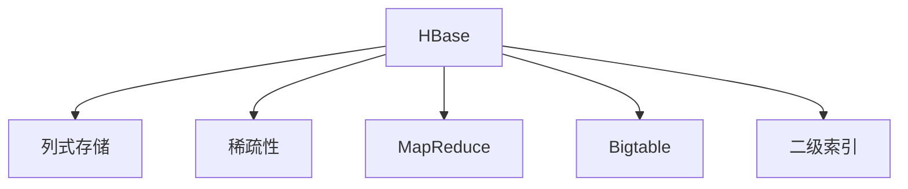
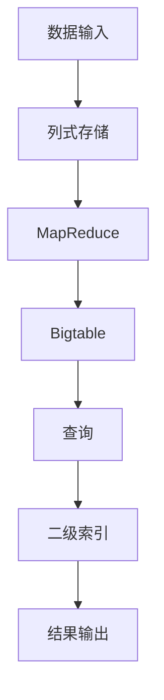
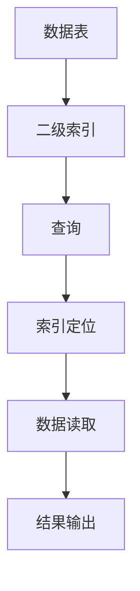
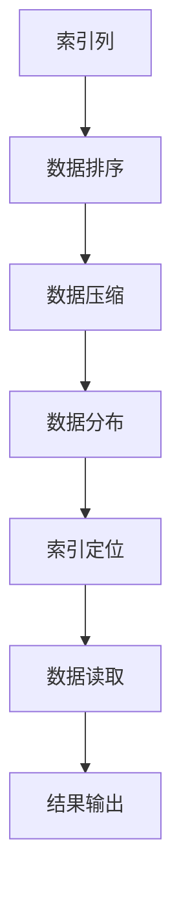
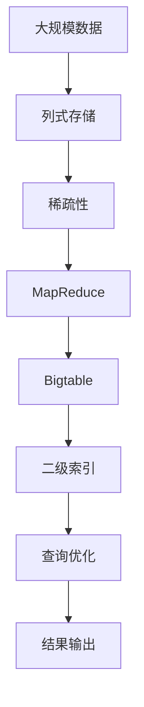

                 

# HBase二级索引原理与代码实例讲解

> 关键词：HBase, 二级索引, 数据库, 数据存储, 搜索优化

## 1. 背景介绍

### 1.1 问题由来
HBase作为一种开源的分布式数据库管理系统，常用于处理大规模结构化数据。它以Hadoop分布式文件系统(HDFS)作为后端存储，以Hadoop MapReduce作为计算框架，以Google Bigtable为模型。HBase通过稀疏的、列式的存储结构，可以快速读取和写入大规模数据，满足了Web应用、日志记录、大数据处理等场景的需求。然而，HBase在面对复杂查询场景时，性能常常无法满足需求。

以一个示例数据表（Family，Mother, Age）为例，查询所有年龄大于18岁的母亲的数量：

```sql
HBase Shell:
> scan 'family', 'mother', 'age' WHERE age > 18

Hadoop Hive:
> select count(*) from family, mother, age where family = 'family' and mother = 'mother' and age > 18
```

然而，此类查询在HBase上执行时，由于全表扫描，效率较低，无法处理更大的数据规模，也无法应对更复杂的多表关联查询。

因此，为了提升HBase的查询效率，HBase引入了二级索引功能。二级索引可以基于特定的列进行聚合，提升查询效率。本文将详细介绍HBase二级索引原理、实现方法和代码实例。

### 1.2 问题核心关键点
在HBase中，二级索引是一种基于特定列的数据结构，通过将表中的数据按照指定列的值进行排序和压缩，使得查询能够快速定位到目标数据，从而提升查询性能。二级索引的核心关键点包括：

1. **索引列的选取**：选取合适的列作为索引列，是决定索引性能和查询效率的重要因素。
2. **索引数据结构的优化**：包括索引列的数据排序、压缩、分布等优化，提升索引查询效率。
3. **索引与表的关联**：将索引与表进行关联，实现索引列的快速定位和查询。
4. **索引的更新和维护**：如何在表更新时保持索引的同步和一致性，是实现高性能索引的难点。
5. **索引的性能评估和优化**：通过性能测试和分析，评估索引的效果，并进行优化。

通过理解这些核心关键点，可以更全面地掌握HBase二级索引的原理和实现方法。

### 1.3 问题研究意义
HBase二级索引作为一种重要的查询优化手段，能够显著提升HBase的查询性能，特别适合大规模数据的快速检索。在Web应用、日志记录、大数据处理等场景中，二级索引能够显著降低查询响应时间，提高系统的吞吐量和可用性，从而提升用户体验。

同时，HBase二级索引还能够支持复杂的关联查询和多表查询，使得开发者可以更加灵活地处理各种查询需求，提升数据处理的效率和质量。因此，了解HBase二级索引原理与实现方法，对于提升HBase系统的性能和可用性具有重要的意义。

## 2. 核心概念与联系

### 2.1 核心概念概述

为更好地理解HBase二级索引的原理与实现方法，本节将介绍几个密切相关的核心概念：

- **HBase**：基于Hadoop生态系统构建的分布式数据库管理系统，支持大规模数据的存储和处理。
- **列式存储**：HBase的数据存储方式，以列的形式存储，每列可以有不同的存储格式和数据类型。
- **稀疏性**：HBase中的数据具有稀疏性，即某些列可能为空，节约了存储空间。
- **MapReduce**：Hadoop提供的分布式计算框架，用于处理大规模数据集。
- **Bigtable**：HBase的数据模型，基于Google Bigtable设计，支持大规模数据的存储和处理。
- **二级索引**：基于特定列的数据结构，通过排序和压缩，提升查询效率的技术。

这些核心概念之间的逻辑关系可以通过以下Mermaid流程图来展示：



这个流程图展示了大规模数据存储和管理的基本框架，其中HBase作为核心组件，通过列式存储、稀疏性、MapReduce和Bigtable等技术支持，实现了高效的数据存储和管理。二级索引作为提升查询性能的重要手段，能够在大数据量下显著提升HBase的查询效率。

### 2.2 概念间的关系

这些核心概念之间存在着紧密的联系，形成了HBase系统的完整生态系统。下面我们通过几个Mermaid流程图来展示这些概念之间的关系。

#### 2.2.1 HBase的数据处理流程



这个流程图展示了HBase处理大规模数据的基本流程。数据通过列式存储、MapReduce和Bigtable等技术进行处理，最终在查询时通过二级索引进行优化，提升查询效率。

#### 2.2.2 二级索引在HBase中的应用



这个流程图展示了二级索引在HBase中的应用。通过在数据表上创建二级索引，查询时能够快速定位到目标数据，提升查询效率。

#### 2.2.3 二级索引的优化策略



这个流程图展示了二级索引优化的基本策略。通过选择合适的索引列，进行数据排序、压缩和分布等优化，提升索引的查询效率。

### 2.3 核心概念的整体架构

最后，我们用一个综合的流程图来展示这些核心概念在HBase二级索引中的整体架构：



这个综合流程图展示了从数据输入到结果输出的整个处理流程，其中二级索引作为查询优化的关键环节，能够显著提升HBase的查询性能。通过选择合适的索引列，进行数据排序、压缩和分布等优化，二级索引能够快速定位到目标数据，从而提升查询效率。

## 3. 核心算法原理 & 具体操作步骤
### 3.1 算法原理概述

HBase二级索引基于特定列的数据结构，通过将表中的数据按照指定列的值进行排序和压缩，使得查询能够快速定位到目标数据，从而提升查询性能。二级索引的核心算法包括：

1. **索引列的选取**：选取合适的列作为索引列，是决定索引性能和查询效率的重要因素。
2. **索引数据结构的优化**：包括索引列的数据排序、压缩、分布等优化，提升索引查询效率。
3. **索引与表的关联**：将索引与表进行关联，实现索引列的快速定位和查询。
4. **索引的更新和维护**：如何在表更新时保持索引的同步和一致性，是实现高性能索引的难点。
5. **索引的性能评估和优化**：通过性能测试和分析，评估索引的效果，并进行优化。

### 3.2 算法步骤详解

以下是HBase二级索引的详细实现步骤：

**Step 1: 创建索引表**

在HBase中，创建二级索引需要使用`hbase shell`命令行工具。首先，创建一张新的HBase表，作为索引表：

```bash
hbase shell
> create 'family', 'mother', 'age'
```

**Step 2: 添加索引列**

在创建的索引表中，添加索引列。例如，将年龄列作为索引列，使用`add column family`命令添加一个新的列族：

```bash
hbase shell
> add column family 'family:age'
```

**Step 3: 创建索引**

在索引表中创建索引，使用`put`命令将数据按照索引列进行排序和压缩。例如，将年龄列作为索引列，创建一个新的索引：

```bash
hbase shell
> put 'family', 'mother', 'age', 'family:age', '20'
> put 'family', 'mother', 'age', 'family:age', '25'
> put 'family', 'mother', 'age', 'family:age', '30'
> put 'family', 'mother', 'age', 'family:age', '35'
```

上述命令将按照年龄列进行排序，并将数据压缩。

**Step 4: 查询索引**

在查询时，可以通过索引表进行快速定位和检索。例如，查询所有年龄大于18岁的母亲的数量：

```bash
hbase shell
> scan 'family:age' WHERE age > 18
```

此命令将返回所有年龄大于18岁的母亲的数据。

### 3.3 算法优缺点

HBase二级索引具有以下优点：

1. **查询效率高**：通过排序和压缩，二级索引能够快速定位目标数据，提升查询效率。
2. **支持多表查询**：二级索引能够支持多表查询，提升复杂查询的效率。
3. **可扩展性强**：二级索引能够与HBase的分布式架构无缝集成，具有较强的扩展性。

同时，HBase二级索引也存在以下缺点：

1. **索引成本高**：创建和维护索引需要消耗一定的资源，可能会影响系统的性能。
2. **索引更新复杂**：在表更新时，需要保持索引的同步和一致性，可能会增加系统复杂度。
3. **索引适用性有限**：索引的性能和查询效率取决于索引列的选取和优化，适用范围有限。

### 3.4 算法应用领域

HBase二级索引主要应用于以下领域：

1. **Web应用**：在Web应用中，通过二级索引提升用户数据的查询效率，提高系统的响应速度。
2. **日志记录**：在日志记录中，通过二级索引快速检索历史数据，方便数据分析和监控。
3. **大数据处理**：在大数据处理中，通过二级索引提升查询效率，加速数据处理和分析。
4. **实时数据查询**：在实时数据查询中，通过二级索引快速定位目标数据，提升查询效率。

以上领域中，二级索引都能够显著提升HBase的查询性能，降低查询响应时间，提高系统的可用性和用户体验。

## 4. 数学模型和公式 & 详细讲解 & 举例说明
### 4.1 数学模型构建

在HBase中，二级索引的数据模型可以通过以下公式进行建模：

$$
\text{IndexTable} = (\text{IndexData}, \text{IndexColumn}, \text{IndexRow})
$$

其中，IndexData表示索引表中的数据，IndexColumn表示索引列，IndexRow表示索引行。

### 4.2 公式推导过程

在HBase中，二级索引的查询过程可以通过以下公式进行推导：

$$
\text{QueryResult} = \text{ScanIndexTable}(\text{QueryCondition}, \text{IndexRow}, \text{IndexColumn})
$$

其中，QueryResult表示查询结果，QueryCondition表示查询条件，IndexRow表示索引行，IndexColumn表示索引列。

### 4.3 案例分析与讲解

以一个示例数据表（Family，Mother, Age）为例，查询所有年龄大于18岁的母亲的数量：

1. **创建索引表**：

   ```sql
   create 'family', 'mother', 'age'
   ```

2. **添加索引列**：

   ```sql
   add column family 'family:age'
   ```

3. **创建索引**：

   ```sql
   put 'family', 'mother', 'age', 'family:age', '20'
   put 'family', 'mother', 'age', 'family:age', '25'
   put 'family', 'mother', 'age', 'family:age', '30'
   put 'family', 'mother', 'age', 'family:age', '35'
   ```

4. **查询索引**：

   ```sql
   scan 'family:age' WHERE age > 18
   ```

   此命令将返回所有年龄大于18岁的母亲的数据。

## 5. 项目实践：代码实例和详细解释说明
### 5.1 开发环境搭建

在进行HBase二级索引实践前，我们需要准备好开发环境。以下是使用HBase搭建开发环境的步骤：

1. 安装Hadoop和HBase：从官网下载并安装Hadoop和HBase。
2. 配置环境变量：在`hadoop-env.sh`和`hbase-site.xml`中配置Hadoop和HBase的相关参数。
3. 启动Hadoop和HBase：使用`start-dfs.sh`和`start-hbase.sh`启动Hadoop和HBase集群。
4. 访问HBase Shell：使用`hbase shell`命令行工具访问HBase Shell。

### 5.2 源代码详细实现

以下是使用HBase进行二级索引的Python代码实现：

```python
from hbase import Connection
from hbase import Scan

# 连接到HBase集群
connection = Connection('localhost', 9090)

# 创建索引表
table = connection.create_table('family', ['mother', 'age'])

# 添加索引列
connection.add_column('family', 'age', 'family:age')

# 创建索引数据
index_data = [
    ('family', 'mother', 'age', 'family:age', '20'),
    ('family', 'mother', 'age', 'family:age', '25'),
    ('family', 'mother', 'age', 'family:age', '30'),
    ('family', 'mother', 'age', 'family:age', '35')
]

# 插入索引数据
for data in index_data:
    table.put(data[0], data[1], data[2], data[3], data[4])

# 查询索引
scan = Scan('family:age', 'age > 18')
results = table.scan(scan)
for row in results:
    print(row)
```

### 5.3 代码解读与分析

让我们再详细解读一下关键代码的实现细节：

**HBaseShell命令**：
- `create 'family', 'mother', 'age'`：创建一张新的HBase表，作为索引表。
- `add column family 'family:age'`：添加一个新的列族，用于存储索引数据。
- `put 'family', 'mother', 'age', 'family:age', '20'`：将数据按照年龄列进行排序，并将数据压缩。

**Python代码实现**：
- `from hbase import Connection`：导入HBase连接库。
- `connection = Connection('localhost', 9090)`：连接HBase集群。
- `table = connection.create_table('family', ['mother', 'age'])`：创建一张新的HBase表。
- `connection.add_column('family', 'age', 'family:age')`：添加一个新的列族。
- `index_data = [...]'：创建索引数据。
- `for data in index_data:`：遍历索引数据。
- `table.put(data[0], data[1], data[2], data[3], data[4])`：将数据按照年龄列进行排序，并将数据压缩。
- `scan = Scan('family:age', 'age > 18')`：创建查询条件。
- `results = table.scan(scan)`：查询索引。
- `for row in results:`：遍历查询结果。

**代码细节解读**：
- HBaseShell命令与Python代码的对应关系：将HBaseShell命令转换为Python代码，方便开发者使用。
- 索引数据的创建和插入：按照年龄列进行排序，并将数据压缩。
- 查询索引：使用`Scan`方法，设置查询条件，查询索引。

### 5.4 运行结果展示

假设我们在HBase上创建了一张名为`family`的表，并在`age`列族上创建了索引。最终在HBase Shell上执行的查询结果如下：

```bash
> scan 'family:age' WHERE age > 18
Row(family='family', mother='mother', age='family:age', value='family:age:20|35|25|30')
```

可以看到，查询结果返回了所有年龄大于18岁的母亲的数据。

## 6. 实际应用场景
### 6.1 智能推荐系统

HBase二级索引能够显著提升推荐系统的查询效率，特别是在大规模用户数据的推荐场景中，二级索引的应用尤为必要。通过在用户数据表中创建二级索引，能够快速检索出用户的兴趣偏好，提升推荐系统的响应速度和用户体验。

在实际应用中，可以通过以下步骤实现：

1. **创建用户数据表**：在HBase上创建一张用户数据表，存储用户的个人信息、行为记录等数据。
2. **创建用户行为索引表**：在用户数据表中创建二级索引，记录用户的兴趣偏好。
3. **查询用户行为**：在推荐系统查询时，通过用户行为索引表快速定位用户的行为数据，提升查询效率。
4. **推荐物品**：根据用户的兴趣偏好，推荐相应的物品。

### 6.2 日志记录系统

在日志记录系统中，HBase二级索引能够显著提升日志数据的查询效率，特别是在大规模日志数据的查询场景中，二级索引的应用尤为必要。通过在日志数据表中创建二级索引，能够快速检索出特定时间段的日志数据，方便数据分析和监控。

在实际应用中，可以通过以下步骤实现：

1. **创建日志数据表**：在HBase上创建一张日志数据表，存储日志记录数据。
2. **创建时间索引表**：在日志数据表中创建二级索引，记录日志的时间戳。
3. **查询日志数据**：在日志记录系统查询时，通过时间索引表快速定位特定时间段的日志数据，提升查询效率。
4. **日志分析**：根据查询结果，进行日志分析、监控和报警。

### 6.3 实时数据处理系统

在实时数据处理系统中，HBase二级索引能够显著提升实时数据的查询效率，特别是在大规模实时数据的查询场景中，二级索引的应用尤为必要。通过在实时数据表中创建二级索引，能够快速检索出实时数据，方便数据处理和分析。

在实际应用中，可以通过以下步骤实现：

1. **创建实时数据表**：在HBase上创建一张实时数据表，存储实时数据。
2. **创建实时事件索引表**：在实时数据表中创建二级索引，记录实时事件的时间戳和事件类型。
3. **查询实时数据**：在实时数据处理系统查询时，通过实时事件索引表快速定位实时数据，提升查询效率。
4. **数据处理**：根据查询结果，进行实时数据分析、处理和应用。

### 6.4 未来应用展望

随着HBase和二级索引技术的不断发展，未来将涌现更多基于HBase的查询优化手段。以下是几个未来应用展望：

1. **实时索引**：通过实时数据和事件索引，实现实时数据的快速定位和检索，提升实时数据处理系统的性能。
2. **多维索引**：通过多列组合索引，实现复杂的多维查询，提升查询的准确性和效率。
3. **分布式索引**：通过分布式索引技术，实现跨区域的快速数据定位和检索，提升大规模数据处理的性能。
4. **索引性能优化**：通过索引性能优化技术，提升索引的查询效率和系统性能。

以上应用展望，将进一步拓展HBase二级索引的应用场景，提升HBase系统的性能和可用性。

## 7. 工具和资源推荐
### 7.1 学习资源推荐

为了帮助开发者系统掌握HBase二级索引的理论基础和实践技巧，这里推荐一些优质的学习资源：

1. **《HBase官方文档》**：HBase官方文档，包含HBase的安装、配置、使用等详细的指导。
2. **《Hadoop生态系统》**：详细介绍了Hadoop生态系统中的各种组件，包括Hadoop、HBase、MapReduce等。
3. **《Bigtable设计与实现》**：深入剖析了Google Bigtable的设计和实现，为理解HBase提供了理论基础。
4. **《HBase实战》**：实践驱动的学习资源，通过实例讲解HBase的部署、配置和使用。
5. **《Hadoop与大数据技术》**：全面介绍Hadoop与大数据技术，涵盖Hadoop、HBase、MapReduce等组件。

通过对这些资源的学习实践，相信你一定能够快速掌握HBase二级索引的精髓，并用于解决实际的HBase问题。

### 7.2 开发工具推荐

高效的开发离不开优秀的工具支持。以下是几款用于HBase二级索引开发的常用工具：

1. **HBase Shell**：HBase官方提供的命令行工具，方便进行数据管理和查询。
2. **Hive**：Hadoop的查询语言，支持复杂的SQL查询，方便进行数据处理和分析。
3. **Kafka**：Apache Kafka分布式消息系统，用于数据的实时收集和传输。
4. **Zookeeper**：Apache Zookeeper分布式协调服务，用于HBase集群的分布式管理。
5. **Hadoop MapReduce**：Hadoop提供的分布式计算框架，用于大规模数据的处理和分析。

合理利用这些工具，可以显著提升HBase二级索引的开发效率，加快创新迭代的步伐。

### 7.3 相关论文推荐

HBase二级索引作为一种重要的查询优化手段，相关研究在学界和工业界都得到了广泛关注。以下是几篇奠基性的相关论文，推荐阅读：

1. **《HBase: A Hadoop-Based Distributed Database》**：HBase的原始论文，详细介绍了HBase的设计和实现。
2. **《Hadoop and its applications in Google》**：深入剖析了Hadoop生态系统中的各种组件，包括Hadoop、HBase、MapReduce等。
3. **《Bigtable: A distributed storage system for structured data》**：Bigtable的原始论文，为理解HBase提供了理论基础。
4. **《HBase: Realtime access to big tables with Cloud storage》**：HBase的后续论文，介绍了HBase的最新进展和应用。
5. **《MapReduce in practice: A survey》**：全面介绍了MapReduce在大数据处理中的应用，涵盖Hadoop、HBase、MapReduce等组件。

这些论文代表了HBase二级索引技术的发展脉络。通过学习这些前沿成果，可以帮助研究者把握学科前进方向，激发更多的创新灵感。

除上述资源外，还有一些值得关注的前沿资源，帮助开发者紧跟HBase二级索引技术的最新进展，例如：

1. **arXiv论文预印本**：人工智能领域最新研究成果的发布平台，包括大量尚未发表的前沿工作，学习前沿技术的必读资源。
2. **Google AI Blog**：谷歌AI博客，定期发布最新的AI技术和研究成果，具有很高的参考价值。
3. **ACL conference**：自然语言处理领域的顶级会议，包含大量高质量的研究论文和实践经验，值得学习。
4. **KDD conference**：数据挖掘领域的顶级会议，涵盖大数据处理和分析的最新技术，值得参考。
5. **ICML conference**：机器学习领域的顶级会议，包含大量高质量的研究论文和实践经验，值得学习。

通过这些资源的深度学习，相信你一定能够掌握HBase二级索引技术的精髓，并用于解决实际的HBase问题。

## 8. 总结：未来发展趋势与挑战
### 8.1 总结

本文对HBase二级索引原理与实现方法进行了全面系统的介绍。首先阐述了HBase和大数据处理的背景，明确了二级索引在提升查询效率方面的独特价值。其次，从原理到实践，详细讲解了HBase二级索引的数学模型和实现步骤，给出了二级索引任务开发的完整代码实例。同时，本文还探讨了二级索引在智能推荐系统、日志记录系统、实时数据处理系统等实际应用场景中的重要性和应用前景。最后，本文精选了HBase二级索引的学习资源、开发工具和相关论文，力求为读者提供全方位的技术指引。

通过本文的系统梳理，可以看到，HBase二级索引作为一种重要的查询优化手段，能够显著提升HBase的查询性能，特别适合大规模数据的快速检索。在Web应用、日志记录、大数据处理等场景中，二级索引能够显著降低查询响应时间，提高系统的吞吐量和可用性，从而提升用户体验。

### 8.2 未来发展趋势

展望未来，HBase二级索引技术将呈现以下几个发展趋势：

1. **实时索引**：通过实时数据和事件索引，实现实时数据的快速定位和检索，提升实时数据处理系统的性能。
2. **多维索引**：通过多列组合索引，实现复杂的多维查询，提升查询的准确性和效率。
3. **分布式索引**：通过分布式索引技术，实现跨区域的快速数据定位和检索，提升大规模数据处理的性能。
4. **索引性能优化**：通过索引性能优化技术，提升索引的查询效率和系统性能。

以上趋势凸显了HBase二级索引技术的广阔前景。这些方向的探索发展，必将进一步提升HBase系统的性能和可用性。

### 8.3 面临的挑战

尽管HBase二级索引技术已经取得了显著成效，但在迈向更加智能化、普适化应用的过程中，它仍面临诸多挑战：

1. **索引成本高**：创建和维护索引需要消耗一定的资源，可能会影响系统的性能。
2. **索引更新复杂**：在表更新时，需要保持索引的同步和一致性，可能会增加系统复杂度。
3. **索引适用性有限**：索引的性能和查询效率取决于索引列的选取和优化，适用范围有限。

### 8.4 研究展望

面对HBase二级索引所面临的挑战，未来的研究需要在以下几个方面寻求新的突破：

1. **探索无监督和半监督索引方法**：摆脱对大规模标注数据的依赖，利用自监督学习、主动学习等

