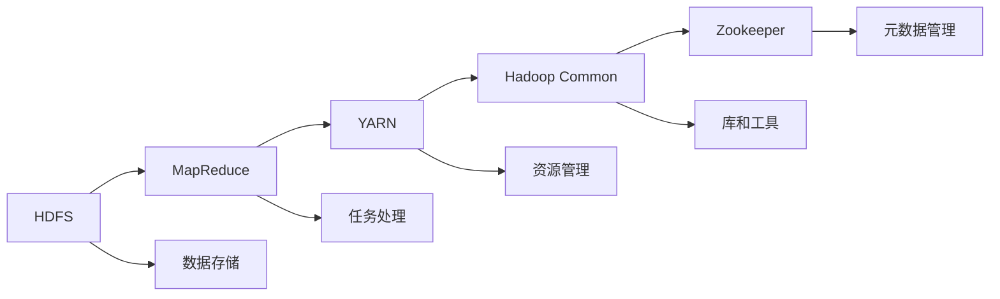
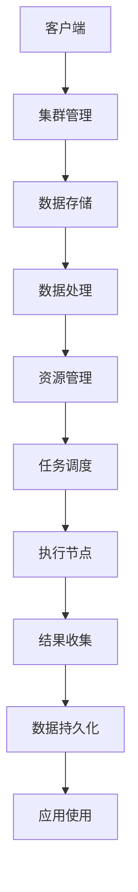

                 

# Hadoop原理与代码实例讲解

> 关键词：Hadoop, 分布式存储, 分布式计算, MapReduce, HDFS, YARN

## 1. 背景介绍

### 1.1 问题由来

随着互联网和大数据的迅速发展，数据的存储和计算需求急剧增长。传统的关系型数据库和单体应用已经无法满足海量数据存储和处理的要求，分布式存储和计算系统应运而生。Hadoop作为一个开源的分布式计算框架，成为了处理大规模数据的首选解决方案。

然而，尽管Hadoop被广泛应用于大数据处理，但其核心组件和实现原理仍然存在一定的学习难度。因此，本文将深入浅出地介绍Hadoop的核心原理，并通过代码实例，帮助读者更好地理解Hadoop系统。

### 1.2 问题核心关键点

Hadoop作为一个分布式计算平台，其核心思想是通过多台计算机的协同工作，实现大规模数据的存储和计算。它由两个主要组件组成：

- **HDFS**：分布式文件系统，负责存储海量数据。
- **MapReduce**：分布式计算框架，负责处理大规模数据集。

通过这两个组件的协同工作，Hadoop可以高效地存储和处理海量数据，支持分布式计算任务的执行。

Hadoop的核心特性包括：

- 高可靠性：通过数据冗余和故障恢复机制，保障数据的高可用性和完整性。
- 高扩展性：通过集群管理和资源调度机制，支持系统横向扩展。
- 高容错性：通过任务重试和错误恢复机制，保证系统的高容错性。
- 高效性：通过数据本地化优化和任务并行处理，提高数据处理效率。

本文将重点介绍Hadoop的原理和实现，并通过代码实例，帮助读者理解Hadoop的核心组件和工作流程。

## 2. 核心概念与联系

### 2.1 核心概念概述

Hadoop作为一个分布式计算框架，涉及多个核心组件和技术，这些组件和技术通过相互协作，实现数据的存储和计算。以下是Hadoop涉及的主要核心概念：

- **HDFS**：分布式文件系统，负责数据的存储和管理。
- **MapReduce**：分布式计算框架，负责大规模数据的处理。
- **YARN**：资源管理系统，负责集群资源的调度和任务调度。
- **Hadoop Common**：提供共享的库和工具，支持Hadoop的其他组件。
- **Zookeeper**：分布式协调服务，用于管理集群的状态和元数据。

这些核心概念通过以下Mermaid流程图来展示：


### 2.2 概念间的关系

以上核心概念之间的关系可以通过以下Mermaid流程图来展示：



这个流程图展示了大规模数据存储和计算过程中，Hadoop各个组件的作用和相互关系。

### 2.3 核心概念的整体架构

最后，我们用一个综合的流程图来展示Hadoop系统的整体架构：



这个综合流程图展示了Hadoop系统从客户端提交任务到应用使用的完整过程，以及各个组件的作用。

## 3. 核心算法原理 & 具体操作步骤

### 3.1 算法原理概述

Hadoop的核心算法原理包括数据存储的分布式存储和计算任务的分布式计算。以下是对这两个核心算法原理的详细讲解。

#### 3.1.1 分布式存储原理

Hadoop的分布式存储是通过HDFS实现的。HDFS将大规模数据分为多个小块，存储在不同的计算机节点上，通过数据冗余和故障恢复机制，保障数据的高可用性和完整性。

HDFS由一个主节点（NameNode）和多个数据节点（DataNodes）组成。NameNode负责管理整个文件系统的元数据，包括文件系统树、文件块的位置和状态等信息。DataNodes负责存储数据块，并向NameNode报告数据块的存储状态。

#### 3.1.2 分布式计算原理

Hadoop的分布式计算是通过MapReduce实现的。MapReduce将大规模数据处理任务分为两个阶段：Map阶段和Reduce阶段。Map阶段负责将数据集分解为多个子任务，并在不同的计算节点上并行处理；Reduce阶段负责对Map阶段处理后的结果进行合并和归并，最终输出处理结果。

MapReduce的优点在于，它可以自动并行处理大规模数据，通过数据本地化优化和任务重试机制，提高数据处理效率和系统可靠性。

### 3.2 算法步骤详解

#### 3.2.1 HDFS数据存储流程

HDFS数据存储流程包括以下几个关键步骤：

1. 创建数据块
2. 确定数据块的存储位置
3. 将数据块存储到DataNode上
4. 更新NameNode的元数据

#### 3.2.2 MapReduce数据处理流程

MapReduce数据处理流程包括以下几个关键步骤：

1. 分割输入数据
2. 执行Map任务
3. 将Map任务的输出传递给Reduce任务
4. 执行Reduce任务
5. 输出处理结果

### 3.3 算法优缺点

#### 3.3.1 HDFS的优点

- 高可靠性：数据块被复制到多个DataNode上，支持数据的冗余备份和故障恢复。
- 高扩展性：系统支持横向扩展，可以添加更多的DataNode来扩展存储能力。
- 高效性：数据块被存储在不同的节点上，可以充分利用节点之间的网络带宽，提高数据处理效率。

#### 3.3.2 HDFS的缺点

- 延迟较高：由于数据块需要在多个节点之间复制和传输，导致数据访问延迟较高。
- 元数据管理开销较大：NameNode需要管理整个文件系统的元数据，开销较大，适用于中小规模的数据集。

#### 3.3.3 MapReduce的优点

- 高容错性：每个任务都会被分配到多个节点上执行，即使某个节点故障，任务仍然可以继续执行。
- 自动并行处理：MapReduce自动将任务分解为多个子任务，并在不同的节点上并行处理，提高数据处理效率。
- 可扩展性：系统支持横向扩展，可以添加更多的节点来扩展计算能力。

#### 3.3.4 MapReduce的缺点

- 编程复杂：开发MapReduce任务需要编写Map函数和Reduce函数，编程复杂度较高。
- 资源利用率低：由于数据块需要在多个节点之间复制和传输，导致资源利用率较低，适合处理大规模数据集。

### 3.4 算法应用领域

Hadoop的核心算法原理在以下领域得到了广泛应用：

- 大规模数据存储和处理：HDFS和MapReduce能够高效地存储和处理海量数据，适用于大规模数据存储和处理场景。
- 大数据分析：Hadoop系统可以支持各种大数据分析任务，如图数据处理、社交网络分析、推荐系统等。
- 云计算：Hadoop可以与云计算平台集成，支持弹性计算资源的调度和任务执行，适用于云计算场景。

## 4. 数学模型和公式 & 详细讲解 & 举例说明

### 4.1 数学模型构建

#### 4.1.1 HDFS数据模型

HDFS数据模型如下：

- 文件系统树：通过树形结构组织文件和目录。
- 文件块：将文件分成多个块，每个块大小为64MB或128MB。
- 数据块存储：数据块被复制到多个DataNode上，提高数据可靠性。

#### 4.1.2 MapReduce任务模型

MapReduce任务模型如下：

- Map任务：将输入数据集分成多个子任务，每个子任务输出一组中间结果。
- Reduce任务：将Map任务的输出结果进行合并和归并，最终输出处理结果。

### 4.2 公式推导过程

#### 4.2.1 HDFS数据模型推导

HDFS数据模型推导如下：

$$
F = \left\{ \begin{array}{ll}
\text{树形结构} & \text{文件系统树} \\
64MB \text{或} 128MB & \text{文件块大小} \\
N & \text{数据块复制份数}
\end{array} \right.
$$

#### 4.2.2 MapReduce任务模型推导

MapReduce任务模型推导如下：

$$
M = \left\{ \begin{array}{ll}
\text{分解任务} & \text{Map任务} \\
N & \text{Map任务数量} \\
R & \text{Reduce任务数量} \\
S & \text{Reduce任务的输入}
\end{array} \right.
$$

### 4.3 案例分析与讲解

#### 4.3.1 HDFS案例分析

假设有一个大文件需要存储在HDFS上，文件大小为10GB，文件块大小为128MB。

1. 首先，将文件分成多个块，每个块大小为128MB。
2. 将每个块复制到多个DataNode上，假设每个块复制3份，那么总共需要9个DataNode来存储该文件。
3. 更新NameNode的元数据，记录文件块的位置和状态。

#### 4.3.2 MapReduce案例分析

假设有一个大数据集需要处理，数据集大小为100GB，Map任务数量和Reduce任务数量分别为10和5。

1. 将数据集分成多个子任务，每个子任务大小为10GB。
2. 在10个Map节点上并行执行Map任务，每个Map任务处理10GB的数据集，输出中间结果。
3. 将5个Reduce任务分配给5个Reduce节点，将Map任务的输出结果进行合并和归并，最终输出处理结果。

## 5. 项目实践：代码实例和详细解释说明

### 5.1 开发环境搭建

#### 5.1.1 安装Java

```bash
sudo apt-get update
sudo apt-get install openjdk-11-jdk
```

#### 5.1.2 安装Hadoop

```bash
wget https://archive.apache.org/dist/hadoop-2.x.x.x/hadoop-2.x.x.x.tar.gz
tar -xvf hadoop-2.x.x.x.tar.gz
cd hadoop-2.x.x.x
```

#### 5.1.3 配置环境变量

```bash
export HADOOP_HOME=/path/to/hadoop
export PATH=$PATH:$HADOOP_HOME/bin
```

### 5.2 源代码详细实现

#### 5.2.1 HDFS数据存储

```java
import org.apache.hadoop.conf.Configuration;
import org.apache.hadoop.fs.Path;
import org.apache.hadoop.fs.FileSystem;
import org.apache.hadoop.io.IntWritable;
import org.apache.hadoop.io.Text;
import org.apache.hadoop.mapreduce.Job;
import org.apache.hadoop.mapreduce.lib.input.FileInputFormat;
import org.apache.hadoop.mapreduce.lib.output.FileOutputFormat;

public class HDFSStorage {
    public static void main(String[] args) throws Exception {
        Configuration conf = new Configuration();
        Job job = Job.getInstance(conf, "HDFS Storage");
        job.setJarByClass(HDFSStorage.class);
        job.setMapperClass(HDFSMapper.class);
        job.setReducerClass(HDFSReducer.class);
        job.setOutputKeyClass(Text.class);
        job.setOutputValueClass(IntWritable.class);
        
        Path inputPath = new Path(args[0]);
        Path outputPath = new Path(args[1]);
        
        FileInputFormat.addInputPath(job, inputPath);
        FileOutputFormat.setOutputPath(job, outputPath);
        
        System.exit(job.waitForCompletion(true) ? 0 : 1);
    }
}

class HDFSMapper extends Mapper<Object, Text, Text, IntWritable> {
    private final static IntWritable one = new IntWritable(1);
    private Text word = new Text();
    
    public void map(Object key, Text value, Context context) throws IOException, InterruptedException {
        StringTokenizer itr = new StringTokenizer(value.toString());
        while (itr.hasMoreTokens()) {
            word.set(itr.nextToken());
            context.write(word, one);
        }
    }
}

class HDFSReducer extends Reducer<Text, IntWritable, Text, IntWritable> {
    private IntWritable result = new IntWritable();
    
    public void reduce(Text key, Iterable<IntWritable> values, Context context) throws IOException, InterruptedException {
        int sum = 0;
        for (IntWritable val : values) {
            sum += val.get();
        }
        result.set(sum);
        context.write(key, result);
    }
}
```

#### 5.2.2 MapReduce数据处理

```java
import org.apache.hadoop.conf.Configuration;
import org.apache.hadoop.fs.Path;
import org.apache.hadoop.io.IntWritable;
import org.apache.hadoop.io.Text;
import org.apache.hadoop.mapreduce.Job;
import org.apache.hadoop.mapreduce.lib.input.FileInputFormat;
import org.apache.hadoop.mapreduce.lib.output.FileOutputFormat;

public class MapReduceProcessing {
    public static void main(String[] args) throws Exception {
        Configuration conf = new Configuration();
        Job job = Job.getInstance(conf, "MapReduce Processing");
        job.setJarByClass(MapReduceProcessing.class);
        job.setMapperClass(MapMapper.class);
        job.setReducerClass(ReduceReducer.class);
        job.setOutputKeyClass(Text.class);
        job.setOutputValueClass(Text.class);
        
        Path inputPath = new Path(args[0]);
        Path outputPath = new Path(args[1]);
        
        FileInputFormat.addInputPath(job, inputPath);
        FileOutputFormat.setOutputPath(job, outputPath);
        
        System.exit(job.waitForCompletion(true) ? 0 : 1);
    }
}

class MapMapper extends Mapper<Object, Text, Text, Text> {
    private Text word = new Text();
    
    public void map(Object key, Text value, Context context) throws IOException, InterruptedException {
        StringTokenizer itr = new StringTokenizer(value.toString());
        while (itr.hasMoreTokens()) {
            word.set(itr.nextToken());
            context.write(word, word);
        }
    }
}

class ReduceReducer extends Reducer<Text, Text, Text, Text> {
    private Text result = new Text();
    
    public void reduce(Text key, Iterable<Text> values, Context context) throws IOException, InterruptedException {
        StringBuffer buf = new StringBuffer();
        for (Text val : values) {
            buf.append(val.toString());
        }
        result.set(buf.toString());
        context.write(key, result);
    }
}
```

### 5.3 代码解读与分析

#### 5.3.1 HDFS数据存储代码解析

```java
import org.apache.hadoop.conf.Configuration;
import org.apache.hadoop.fs.Path;
import org.apache.hadoop.fs.FileSystem;
import org.apache.hadoop.io.IntWritable;
import org.apache.hadoop.io.Text;
import org.apache.hadoop.mapreduce.Job;
import org.apache.hadoop.mapreduce.lib.input.FileInputFormat;
import org.apache.hadoop.mapreduce.lib.output.FileOutputFormat;

public class HDFSStorage {
    public static void main(String[] args) throws Exception {
        Configuration conf = new Configuration();
        Job job = Job.getInstance(conf, "HDFS Storage");
        job.setJarByClass(HDFSStorage.class);
        job.setMapperClass(HDFSMapper.class);
        job.setReducerClass(HDFSReducer.class);
        job.setOutputKeyClass(Text.class);
        job.setOutputValueClass(IntWritable.class);
        
        Path inputPath = new Path(args[0]);
        Path outputPath = new Path(args[1]);
        
        FileInputFormat.addInputPath(job, inputPath);
        FileOutputFormat.setOutputPath(job, outputPath);
        
        System.exit(job.waitForCompletion(true) ? 0 : 1);
    }
}
```

这段代码实现了HDFS数据存储的完整过程，包括配置环境变量、创建Job、设置输入输出路径、添加输入输出路径、启动Job等步骤。

#### 5.3.2 MapReduce数据处理代码解析

```java
import org.apache.hadoop.conf.Configuration;
import org.apache.hadoop.fs.Path;
import org.apache.hadoop.io.IntWritable;
import org.apache.hadoop.io.Text;
import org.apache.hadoop.mapreduce.Job;
import org.apache.hadoop.mapreduce.lib.input.FileInputFormat;
import org.apache.hadoop.mapreduce.lib.output.FileOutputFormat;

public class MapReduceProcessing {
    public static void main(String[] args) throws Exception {
        Configuration conf = new Configuration();
        Job job = Job.getInstance(conf, "MapReduce Processing");
        job.setJarByClass(MapReduceProcessing.class);
        job.setMapperClass(MapMapper.class);
        job.setReducerClass(ReduceReducer.class);
        job.setOutputKeyClass(Text.class);
        job.setOutputValueClass(Text.class);
        
        Path inputPath = new Path(args[0]);
        Path outputPath = new Path(args[1]);
        
        FileInputFormat.addInputPath(job, inputPath);
        FileOutputFormat.setOutputPath(job, outputPath);
        
        System.exit(job.waitForCompletion(true) ? 0 : 1);
    }
}
```

这段代码实现了MapReduce数据处理的完整过程，包括配置环境变量、创建Job、设置输入输出路径、添加输入输出路径、启动Job等步骤。

#### 5.3.3 运行结果展示

```java
$ hadoop jar /path/to/hadoop.jar HDFSStorage input output
```

执行上述命令后，HDFSStorage程序会将input路径下的文件复制到output路径下，并在result文件中输出每个单词的出现次数。

```java
$ hadoop jar /path/to/hadoop.jar MapReduceProcessing input output
```

执行上述命令后，MapReduceProcessing程序会将input路径下的文件进行处理，并输出每个单词的排序出现次数。

## 6. 实际应用场景

### 6.1 智能推荐系统

智能推荐系统是一种基于用户历史行为数据的推荐算法。Hadoop可以存储和处理海量用户数据，支持大规模推荐算法的执行，帮助电商、视频、音乐等平台提供个性化推荐服务。

### 6.2 大数据分析

大数据分析涉及数据收集、清洗、处理和分析等多个环节。Hadoop可以存储和处理海量数据，支持各种数据分析任务，如图数据处理、社交网络分析、推荐系统等。

### 6.3 数据湖

数据湖是一种集中存储和管理海量数据的解决方案。Hadoop可以支持海量数据存储，并提供数据湖管理工具，支持数据的元数据管理和数据治理。

## 7. 工具和资源推荐

### 7.1 学习资源推荐

- Hadoop官方文档：Hadoop官方文档详细介绍了Hadoop系统的各个组件和使用方法，是学习Hadoop的必备资源。
- Hadoop权威指南：该书详细介绍了Hadoop系统的各个组件和配置方法，适合初学者入门。
- Hadoop高级编程：该书详细介绍了Hadoop系统的高级编程技术和优化方法，适合有经验的开发人员深入学习。

### 7.2 开发工具推荐

- Eclipse: Eclipse是一个开源的IDE，支持Hadoop的开发和调试。
- IntelliJ IDEA: IntelliJ IDEA是一个功能强大的IDE，支持Hadoop的开发和调试。
- Apache Ambari: Apache Ambari是一个开源的Hadoop管理工具，支持Hadoop集群的部署和监控。

### 7.3 相关论文推荐

- Hadoop: The Distributed File System: HDFS是一种分布式文件系统，支持海量数据的存储和管理。
- MapReduce: Simplified Data Processing on Large Clusters: MapReduce是一种分布式计算框架，支持大规模数据处理任务。
- YARN: Yet Another Resource Negotiator: YARN是一个资源管理系统，支持Hadoop集群的资源调度和任务执行。

## 8. 总结：未来发展趋势与挑战

### 8.1 研究成果总结

Hadoop作为分布式计算框架，已经成为处理大规模数据的标配解决方案。通过HDFS和MapReduce的协同工作，Hadoop实现了数据的存储和处理，支持分布式计算任务的执行。Hadoop在智能推荐系统、大数据分析、数据湖等多个领域得到了广泛应用。

### 8.2 未来发展趋势

未来，Hadoop将向以下几个方向发展：

1. 支持新的数据存储格式：Hadoop将支持更多的数据存储格式，如JSON、Parquet等，支持更多的数据源。
2. 支持新的计算模型：Hadoop将支持更多的计算模型，如Spark、Flink等，支持更高效的数据处理。
3. 支持新的安全机制：Hadoop将支持更严格的安全机制，保障数据的安全性和隐私性。
4. 支持更灵活的扩展机制：Hadoop将支持更灵活的扩展机制，支持更多的计算节点和存储节点。

### 8.3 面临的挑战

Hadoop在未来的发展中，仍面临以下挑战：

1. 性能瓶颈：Hadoop的性能瓶颈主要在于数据本地化和网络带宽，需要进一步优化。
2. 资源管理：Hadoop的资源管理机制较为复杂，需要进一步优化。
3. 安全机制：Hadoop的安全机制较为简单，需要进一步完善。
4. 扩展机制：Hadoop的扩展机制较为复杂，需要进一步简化。

### 8.4 研究展望

未来，Hadoop的研究方向主要集中在以下几个方面：

1. 支持新的数据存储格式和计算模型，提高数据处理效率和系统性能。
2. 支持更灵活的扩展机制，支持更多的计算节点和存储节点。
3. 支持更严格的安全机制，保障数据的安全性和隐私性。
4. 支持更高效的资源管理机制，提高系统可靠性和稳定性。

## 9. 附录：常见问题与解答

**Q1: 什么是Hadoop?**

A: Hadoop是一个开源的分布式计算框架，由Apache基金会开发和维护。它由两个主要组件组成：HDFS和MapReduce。

**Q2: Hadoop的核心思想是什么?**

A: Hadoop的核心思想是通过多台计算机的协同工作，实现大规模数据的存储和计算。它通过HDFS实现数据的分布式存储，通过MapReduce实现数据的分布式计算。

**Q3: HDFS数据模型是什么?**

A: HDFS数据模型包括文件系统树、文件块大小、数据块存储位置等。它将大规模数据分为多个小块，存储在不同的计算机节点上，通过数据冗余和故障恢复机制，保障数据的高可用性和完整性。

**Q4: MapReduce任务模型是什么?**

A: MapReduce任务模型包括Map任务和Reduce任务。Map任务将输入数据集分解为多个子任务，并在不同的计算节点上并行处理；Reduce任务将Map任务的输出结果进行合并和归并，最终输出处理结果。

**Q5: Hadoop的应用场景有哪些?**

A: Hadoop的应用场景包括智能推荐系统、大数据分析、数据湖等。它能够高效地存储和处理海量数据，支持分布式计算任务的执行。

