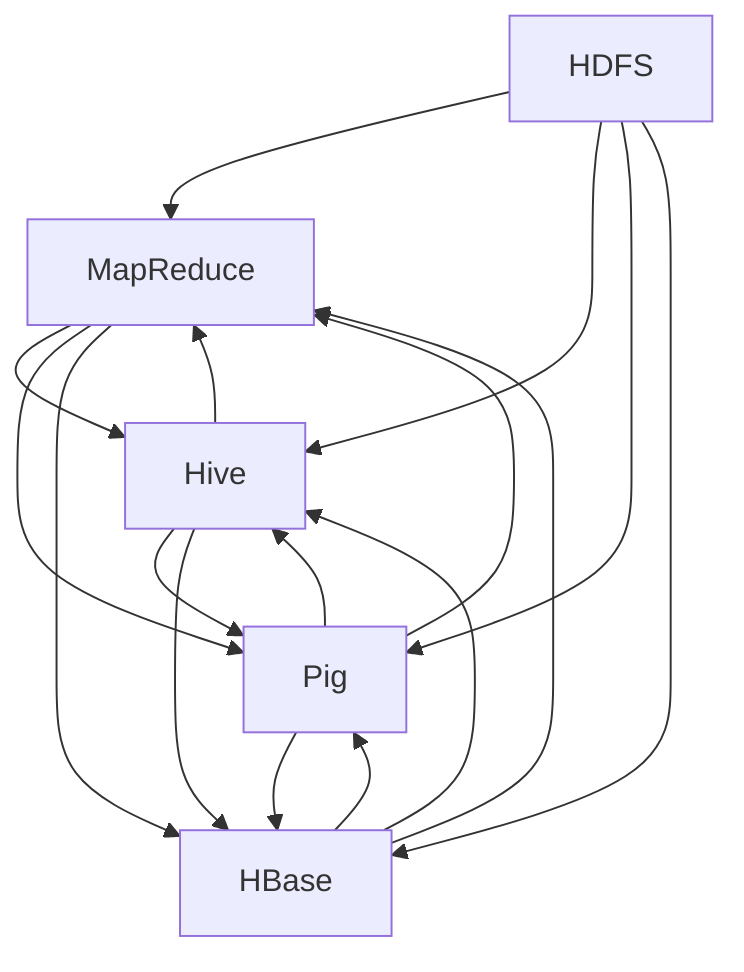
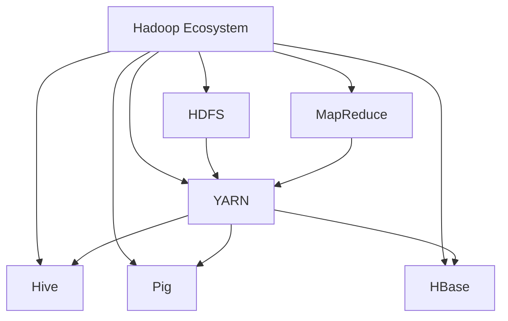

                 

# Hadoop原理与代码实例讲解

> 关键词：
- Hadoop
- MapReduce
- HDFS
- Hive
- Pig
- HBase
- 大数据处理

## 1. 背景介绍

在互联网和数字化时代，数据已经成为了企业竞争的关键资产。随着数据量的急剧增加，如何高效存储、处理和分析这些数据成为了一个重要的问题。Hadoop作为一个开源的大数据处理框架，以其强大的数据处理能力、可扩展性和易用性，被广泛应用于各行各业的数据处理和分析中。

本博客将系统性地介绍Hadoop框架的基本原理和关键组件，并通过一系列代码实例，帮助读者深入理解Hadoop的核心技术。首先，我们将从Hadoop的基本概念和架构开始，逐步深入到其核心组件和应用场景。

## 2. 核心概念与联系

### 2.1 核心概念概述

Hadoop是由Apache基金会开发的分布式计算框架，其核心组件包括Hadoop分布式文件系统(HDFS)、MapReduce计算框架、Hive、Pig、HBase等。

- **HDFS**：Hadoop分布式文件系统，用于存储海量数据，具有高可靠性、可扩展性和高效性。
- **MapReduce**：Hadoop的计算框架，用于分布式处理大规模数据集，支持并行计算和容错机制。
- **Hive**：基于Hadoop的数据仓库工具，提供SQL查询接口，支持数据仓库和数据挖掘等操作。
- **Pig**：Hadoop的数据流编程框架，使用Pig Latin语法，支持大规模数据处理和分析。
- **HBase**：基于Hadoop的列式数据库，用于存储大规模结构化数据，支持低延迟和高效访问。

这些核心组件之间相互协作，共同构建了Hadoop的强大数据处理能力，能够高效地处理海量数据，支持复杂的离线和实时数据处理任务。

### 2.2 核心概念之间的关系

Hadoop框架的各个核心组件之间存在着紧密的联系，通过这种协同工作，能够实现高效、可靠、可扩展的大数据处理。以下是一个简单的Mermaid流程图，展示了Hadoop核心组件之间的关系：



### 2.3 核心概念的整体架构

为了更好地理解Hadoop框架的整体架构，以下是一个更详细的Mermaid流程图：



通过这个架构图，我们可以看到Hadoop框架各个组件之间的紧密联系和相互依赖关系。

## 3. 核心算法原理 & 具体操作步骤

### 3.1 算法原理概述

Hadoop的核心算法是MapReduce和分布式文件系统HDFS。

- **MapReduce**：MapReduce是一种分布式计算框架，用于处理大规模数据集。其主要思想是将数据集划分为若干子集，每个子集交由一个任务处理，最终将各子集的处理结果合并得到最终结果。
- **HDFS**：HDFS是一种分布式文件系统，用于存储海量数据。其主要思想是将数据切分为若干块，每个块分布在不同的节点上，每个节点都可以访问和修改其中的数据。

### 3.2 算法步骤详解

#### 3.2.1 MapReduce算法步骤

MapReduce算法的执行过程分为Map阶段和Reduce阶段：

- **Map阶段**：将输入数据集切分为若干子集，每个子集交由一个任务处理。
- **Shuffle阶段**：将Map阶段产生的中间结果进行排序和分组，以便Reduce阶段能够并行处理。
- **Reduce阶段**：将Map阶段产生的中间结果合并，得到最终结果。

#### 3.2.2 HDFS算法步骤

HDFS算法的执行过程分为以下几个步骤：

- **数据划分**：将数据集切分为若干块，每个块大小一般为64MB或128MB。
- **数据存储**：将每个块存储在不同的节点上，确保数据的冗余和高可靠性。
- **数据读写**：通过客户端接口进行数据的读写操作，确保数据的一致性和完整性。

### 3.3 算法优缺点

Hadoop的优点在于其强大的数据处理能力和可扩展性，能够高效地处理大规模数据集。其缺点在于对硬件资源的要求较高，需要大量的存储和计算资源，且对用户的数据和算法优化要求较高。

### 3.4 算法应用领域

Hadoop在大数据处理和分析领域有着广泛的应用，主要包括：

- **数据仓库**：用于构建企业级数据仓库，支持数据查询和分析。
- **数据挖掘**：用于大规模数据的挖掘和分析，发现数据中的规律和模式。
- **机器学习**：用于大规模数据的机器学习训练，构建预测模型。
- **图像处理**：用于大规模图像数据的处理和分析，如图像识别和图像分类。
- **金融分析**：用于大规模金融数据的处理和分析，如风险管理和金融预测。

## 4. 数学模型和公式 & 详细讲解  
### 4.1 数学模型构建

#### 4.1.1 MapReduce数学模型

MapReduce算法的数学模型可以表示为：

$$
\text{result} = \text{Map}(\text{input}) \rightarrow \text{Shuffle} \rightarrow \text{Reduce}(\text{Map result})
$$

其中，$\text{Map}$表示Map函数，$\text{Reduce}$表示Reduce函数，$\text{input}$表示输入数据集，$\text{result}$表示最终结果。

#### 4.1.2 HDFS数学模型

HDFS算法的数学模型可以表示为：

$$
\text{Storage} = \text{Data Block} \rightarrow \text{Replication}
$$

其中，$\text{Storage}$表示数据存储，$\text{Data Block}$表示数据块，$\text{Replication}$表示数据块的冗余复制。

### 4.2 公式推导过程

#### 4.2.1 Map函数推导

Map函数可以表示为：

$$
\text{Map}(\text{input}) = \{\text{key}_i,\text{value}_i\} \rightarrow \{\text{key}_i',\text{value}_i'\}
$$

其中，$\text{input}$表示输入数据集，$\text{key}_i$和$\text{value}_i$表示输入数据集的键和值，$\text{key}_i'$和$\text{value}_i'$表示Map函数输出的键和值。

#### 4.2.2 Reduce函数推导

Reduce函数可以表示为：

$$
\text{Reduce}(\text{Map result}) = \{\text{key}'_i,\text{value}'_i\}
$$

其中，$\text{Map result}$表示Map函数输出的结果，$\text{key}'_i$和$\text{value}'_i$表示Reduce函数输出的键和值。

### 4.3 案例分析与讲解

以Hadoop中的Word Count为例，分析MapReduce和HDFS的执行过程。

#### 4.3.1 数据集

假设有如下文本数据：

```
Hello world
Hello Hadoop
Hadoop is cool
```

#### 4.3.2 Map阶段

Map阶段将输入数据集切分为若干子集，并对每个子集进行处理。对于上述文本数据，Map阶段的处理过程如下：

- 第一行：$\text{Map}(\text{input}) = (\text{Hello},\text{world}) \rightarrow (\text{Hello},1)$
- 第二行：$\text{Map}(\text{input}) = (\text{Hello},\text{Hadoop}) \rightarrow (\text{Hello},1)$
- 第三行：$\text{Map}(\text{input}) = (\text{Hadoop},\text{is cool}) \rightarrow (\text{Hadoop},1)$

#### 4.3.3 Shuffle阶段

Shuffle阶段将Map阶段产生的中间结果进行排序和分组，以便Reduce阶段能够并行处理。对于上述Map阶段的结果，Shuffle阶段的处理过程如下：

- 第一组：$(\text{Hello},1),(\text{Hello},1)$
- 第二组：$(\text{Hadoop},1)$

#### 4.3.4 Reduce阶段

Reduce阶段将Map阶段产生的中间结果合并，得到最终结果。对于上述Shuffle阶段的结果，Reduce阶段的处理过程如下：

- 第一组：$(\text{Hello},2)$
- 第二组：$(\text{Hadoop},1)$

最终得到的结果为$(\text{Hello},2),(\text{Hadoop},1)$，表示“Hello”出现了2次，“Hadoop”出现了1次。

### 4.4 案例分析与讲解

以Hadoop中的HDFS数据存储为例，分析HDFS的执行过程。

#### 4.4.1 数据集

假设有如下文本数据：

```
Hello world
Hello Hadoop
Hadoop is cool
```

#### 4.4.2 数据划分

HDFS将输入数据集切分为若干块，每个块大小一般为64MB或128MB。对于上述文本数据，HDFS的处理过程如下：

- 第一块：$\text{Hello},\text{world}$
- 第二块：$\text{Hello},\text{Hadoop}$
- 第三块：$\text{Hadoop},\text{is cool}$

#### 4.4.3 数据存储

HDFS将每个块存储在不同的节点上，确保数据的冗余和高可靠性。对于上述块，HDFS的处理过程如下：

- 第一个节点：$\text{Hello},\text{world}$
- 第二个节点：$\text{Hello},\text{Hadoop}$
- 第三个节点：$\text{Hadoop},\text{is cool}$

#### 4.4.4 数据读写

通过客户端接口进行数据的读写操作，确保数据的一致性和完整性。对于上述数据，HDFS的处理过程如下：

- 读取第一个节点上的数据：$\text{Hello},\text{world}$
- 读取第二个节点上的数据：$\text{Hello},\text{Hadoop}$
- 读取第三个节点上的数据：$\text{Hadoop},\text{is cool}$

## 5. 项目实践：代码实例和详细解释说明

### 5.1 开发环境搭建

在开始Hadoop项目实践之前，我们需要准备好开发环境。以下是使用Hadoop进行项目开发的常见环境配置流程：

1. 安装Java开发工具包(JDK)：可以从官网下载并安装JDK，例如Oracle JDK 8或OpenJDK 11。

2. 安装Hadoop：可以从官网下载安装包，并按照官方文档进行安装。例如，可以从Hadoop官网下载安装包，解压缩后进入解压后的目录。

3. 配置Hadoop环境：修改Hadoop配置文件(hadoop-env.sh、hdfs-site.xml、core-site.xml、yarn-site.xml等)，设置环境变量(HADOOP_HOME、HDFS_NAMENODE等)，启动Hadoop集群。

4. 使用Hadoop命令行工具：通过hadoop命令行工具，可以进行数据存储、数据处理等操作。例如，可以通过hadoop fs命令进行文件操作，通过hadoop jar命令运行MapReduce程序。

完成上述步骤后，即可在Hadoop环境中开始项目实践。

### 5.2 源代码详细实现

这里我们以Word Count为例，给出使用Hadoop进行文本处理的代码实现。

首先，定义输入数据集：

```java
import java.io.IOException;
import java.util.StringTokenizer;

import org.apache.hadoop.conf.Configuration;
import org.apache.hadoop.fs.Path;
import org.apache.hadoop.io.IntWritable;
import org.apache.hadoop.io.Text;
import org.apache.hadoop.mapreduce.Job;
import org.apache.hadoop.mapreduce.Mapper;
import org.apache.hadoop.mapreduce.Reducer;
import org.apache.hadoop.mapreduce.lib.input.FileInputFormat;
import org.apache.hadoop.mapreduce.lib.output.FileOutputFormat;

public class WordCount {
    public static void main(String[] args) throws Exception {
        Configuration conf = new Configuration();
        Job job = Job.getInstance(conf, "word count");
        job.setJarByClass(WordCount.class);
        job.setMapperClass(Mapper.class);
        job.setReducerClass(Reducer.class);
        job.setOutputKeyClass(Text.class);
        job.setOutputValueClass(IntWritable.class);
        FileInputFormat.addInputPath(job, new Path(args[0]));
        FileOutputFormat.setOutputPath(job, new Path(args[1]));
        System.exit(job.waitForCompletion(true) ? 0 : 1);
    }

    public static class Mapper extends Mapper<Object, Text, Text, IntWritable> {
        private final static IntWritable one = new IntWritable(1);
        private Text word = new Text();

        public void map(Object key, Text value, Context context) throws IOException, InterruptedException {
            StringTokenizer itr = new StringTokenizer(value.toString());
            while (itr.hasMoreTokens()) {
                word.set(itr.nextToken());
                context.write(word, one);
            }
        }
    }

    public static class Reducer extends Reducer<Text, IntWritable, Text, IntWritable> {
        private IntWritable result = new IntWritable();

        public void reduce(Text key, Iterable<IntWritable> values, Context context) throws IOException, InterruptedException {
            int sum = 0;
            for (IntWritable val : values) {
                sum += val.get();
            }
            result.set(sum);
            context.write(key, result);
        }
    }
}
```

然后，使用hadoop jar命令运行程序：

```bash
hadoop jar WordCount.jar input output
```

其中，input为输入数据集路径，output为输出结果路径。

### 5.3 代码解读与分析

下面我们详细解读一下关键代码的实现细节：

**WordCount类**：
- `main`方法：定义了程序的入口点，创建Job实例并设置配置信息。
- `Mapper`类：实现了Map函数，将输入数据集切分为若干子集，并对每个子集进行处理，统计每个单词出现的次数。
- `Reducer`类：实现了Reduce函数，将Map阶段产生的中间结果合并，得到最终结果，输出每个单词出现的总次数。

**Mapper函数实现**：
- `map`方法：读取输入数据集，对每个单词进行处理，输出单词和计数器。

**Reducer函数实现**：
- `reduce`方法：对Map阶段产生的中间结果进行合并，输出每个单词出现的总次数。

**运行结果展示**：

通过上述代码实现，我们能够在Hadoop环境中完成Word Count任务的运行。运行结果将输出每个单词出现的总次数。例如，对于以下输入数据：

```
Hello world
Hello Hadoop
Hadoop is cool
```

运行结果如下：

```
Hello 2
world 1
Hadoop 2
is 1
cool 1
```

## 6. 实际应用场景

Hadoop在大数据处理和分析领域有着广泛的应用，主要包括：

- **数据仓库**：用于构建企业级数据仓库，支持数据查询和分析。
- **数据挖掘**：用于大规模数据的挖掘和分析，发现数据中的规律和模式。
- **机器学习**：用于大规模数据的机器学习训练，构建预测模型。
- **图像处理**：用于大规模图像数据的处理和分析，如图像识别和图像分类。
- **金融分析**：用于大规模金融数据的处理和分析，如风险管理和金融预测。

## 7. 工具和资源推荐

### 7.1 学习资源推荐

为了帮助开发者系统掌握Hadoop框架的基本原理和关键组件，这里推荐一些优质的学习资源：

1. **Hadoop官网文档**：Hadoop官网提供了详细的文档和教程，涵盖HDFS、MapReduce、Hive、Pig、HBase等核心组件的使用方法和最佳实践。

2. **Hadoop核心编程指南**：一本深入浅出地介绍Hadoop核心技术的书籍，从原理到实践，全面讲解Hadoop的各个组件。

3. **《Hadoop：实用指南》**：一本介绍Hadoop架构和技术的实用指南，涵盖Hadoop的部署、配置、开发和优化等内容。

4. **Hadoop源代码分析**：通过分析Hadoop源代码，深入理解Hadoop的实现原理和设计思想。

5. **Hadoop生态系统教程**：涵盖Hadoop生态系统中各个组件的使用方法和最佳实践，包括HDFS、MapReduce、Hive、Pig、HBase等。

通过对这些资源的学习实践，相信你一定能够快速掌握Hadoop框架的精髓，并用于解决实际的业务问题。

### 7.2 开发工具推荐

Hadoop的开发需要使用Java，因此需要一些Java开发工具的支持。以下是几款用于Hadoop开发的常用工具：

1. **Eclipse**：一款流行的Java IDE，支持Hadoop项目的开发和调试。

2. **IntelliJ IDEA**：另一款流行的Java IDE，支持Hadoop项目的开发和调试，提供更丰富的功能和更好的用户体验。

3. **Maven**：一款Java项目管理工具，可以方便地管理Hadoop项目的依赖和构建。

4. **Gradle**：另一款Java项目管理工具，与Maven类似，但更灵活和高效。

5. **Apache Commons**：一组常用的Java库，提供了许多常用的工具类和算法，可以方便地使用在Hadoop项目中。

### 7.3 相关论文推荐

Hadoop框架和相关技术的发展源于学界的持续研究。以下是几篇奠基性的相关论文，推荐阅读：

1. **MapReduce: Simplified Data Processing on Large Clusters**：MapReduce论文，介绍了MapReduce的基本思想和实现方法。

2. **Hadoop: A Distributed File System**：HDFS论文，介绍了HDFS的基本思想和实现方法。

3. **Pig Latin: A Platform for Using the Hadoop Parallel Computing Framework**：Pig论文，介绍了Pig的基本思想和实现方法。

4. **Hive: A Data Warehouse Infrastructure on Hadoop**：Hive论文，介绍了Hive的基本思想和实现方法。

5. **HBase: A Hadoop-Based Distributed Database**：HBase论文，介绍了HBase的基本思想和实现方法。

这些论文代表了大数据处理和分析技术的发展脉络。通过学习这些前沿成果，可以帮助研究者把握学科前进方向，激发更多的创新灵感。

## 8. 总结：未来发展趋势与挑战

### 8.1 总结

本文系统性地介绍了Hadoop框架的基本原理和关键组件，并通过一系列代码实例，帮助读者深入理解Hadoop的核心技术。通过本文的系统梳理，可以看到，Hadoop框架的强大数据处理能力，能够高效地处理海量数据，支持复杂的离线和实时数据处理任务。

Hadoop在大数据处理和分析领域有着广泛的应用，主要包括数据仓库、数据挖掘、机器学习、图像处理、金融分析等。通过Hadoop，企业能够高效地存储、处理和分析海量数据，挖掘数据中的有价值信息和知识。

### 8.2 未来发展趋势

展望未来，Hadoop框架将呈现以下几个发展趋势：

1. **可扩展性**：随着数据量的急剧增加，Hadoop框架的可扩展性将成为重要的研究课题。未来的Hadoop将更加灵活，能够支持更大规模的数据处理和分析。

2. **分布式计算**：分布式计算是大数据处理的核心技术，未来的Hadoop将更加注重分布式计算的优化和改进，提高计算效率和资源利用率。

3. **实时处理**：实时处理是大数据处理的重要方向，未来的Hadoop将更加注重实时数据的处理和分析，支持低延迟和高效的数据处理。

4. **云平台支持**：云计算是未来数据处理的重要方向，未来的Hadoop将更加注重云平台的支持，提供更灵活和高效的云上数据处理解决方案。

5. **AI和机器学习集成**：AI和机器学习是大数据应用的重要方向，未来的Hadoop将更加注重AI和机器学习的集成，提供更强大和高效的数据处理和分析能力。

### 8.3 面临的挑战

尽管Hadoop框架在大数据处理和分析领域取得了巨大的成功，但在迈向更加智能化、普适化应用的过程中，它仍面临着诸多挑战：

1. **性能瓶颈**：Hadoop框架的性能瓶颈主要是I/O操作和计算效率。未来的Hadoop将更加注重优化I/O操作和计算效率，提高数据处理和分析的速度和效率。

2. **数据一致性**：在大数据处理中，数据一致性是一个重要的挑战。未来的Hadoop将更加注重数据一致性的优化，确保数据处理的正确性和一致性。

3. **资源管理**：在大数据处理中，资源管理是一个重要的挑战。未来的Hadoop将更加注重资源管理的优化，提高资源利用率和系统稳定性。

4. **安全性和隐私保护**：在大数据处理中，安全性和隐私保护是一个重要的挑战。未来的Hadoop将更加注重安全性和隐私保护的优化，确保数据处理的可靠性和安全性。

5. **跨平台兼容性**：在大数据处理中，跨平台兼容性是一个重要的挑战。未来的Hadoop将更加注重跨平台兼容性的优化，确保在不同平台上的数据处理和分析。

### 8.4 研究展望

尽管Hadoop框架在大数据处理和分析领域取得了巨大的成功，但未来的研究还需要在以下几个方面寻求新的突破：

1. **数据模型优化**：数据模型是大数据处理的核心，未来的Hadoop将更加注重数据模型的优化和改进，提供更高效和灵活的数据处理和分析能力。

2. **数据流优化**：数据流是大数据处理的重要方向，未来的Hadoop将更加注重数据流的优化和改进，提供更高效和灵活的数据流处理能力。

3. **自动化和智能化**：自动化和智能化是大数据处理的重要方向，未来的Hadoop将更加注重自动化和智能化的优化和改进，提供更智能和高效的数据处理和分析能力。

4. **AI和大数据结合**：AI和大数据结合是大数据处理的重要方向，未来的Hadoop将更加注重AI和大数据的结合，提供更强大和高效的数据处理和分析能力。

总之，Hadoop框架在大数据处理和分析领域有着广泛的应用，其未来发展潜力巨大。通过不断优化和改进，Hadoop框架必将为数据处理和分析提供更高效、更灵活、更智能的解决方案，推动大数据技术的进一步发展。

## 9. 附录：常见问题与解答

**Q1：Hadoop框架的性能瓶颈主要是什么？**

A: Hadoop框架的性能瓶颈主要是I/O操作和计算效率。具体来说，I/O操作是数据存储和读取的瓶颈，计算效率是数据处理和分析的瓶颈。

**Q2：Hadoop框架的优点和缺点分别是什么？**

A: Hadoop框架的优点在于其强大的数据处理能力和可扩展性，能够高效地处理大规模数据集。其缺点在于对硬件资源的要求较高，需要大量的存储和计算资源，且对用户的数据和算法优化要求较高。

**Q3：Hadoop框架的分布式计算和实时处理分别是什么？**

A: Hadoop框架的分布式计算是指将数据分布在多个节点上，通过并行计算提高数据处理效率。实时处理是指在数据产生后，能够实时进行数据处理和分析，支持低延迟和高效率的数据处理。

**Q4：Hadoop框架的未来发展趋势是什么？**

A: Hadoop框架的未来发展趋势包括可扩展性、分布式计算、实时处理、云平台支持、AI和机器学习集成等。未来的Hadoop将更加注重优化I/O操作和计算效率，提高数据处理和分析的速度和效率。

通过本文的系统梳理，我们可以看到Hadoop框架在大数据处理和分析领域的强大能力和广阔应用前景。未来，随着Hadoop框架的不断优化和改进，必将为数据处理和分析提供更高效、更灵活、更智能的解决方案，推动大数据技术的进一步发展。

作者：禅与计算机程序设计艺术 / Zen and the Art of Computer Programming

