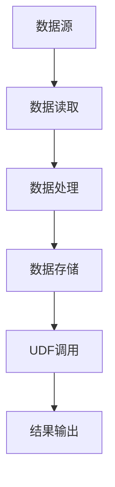

                 

# Hive UDF自定义函数原理与代码实例讲解

> 关键词：Hive, UDF, 自定义函数, 数据分析, 数据处理, 数据仓库

## 1. 背景介绍

Hive是一种流行的数据仓库解决方案，它通过将结构化数据映射到分布式文件系统中，提供了一种类似于SQL的查询语言。在Hive中，UDF（User-Defined Functions）用户自定义函数是一种允许用户定义和重用可扩展的功能，在处理数据时非常有用。

UDF可以帮助用户实现复杂的逻辑，例如：
- 数据转换，例如字符串操作、日期格式化。
- 数学计算，如三角函数、对数函数、幂运算等。
- 数据清理，例如正则表达式匹配、条件过滤。
- 数据聚合，如自定义聚合函数，计算数组元素等。

在本篇文章中，我们将探讨Hive UDF的基本原理、编写、测试和部署，并通过一些具体的例子来展示如何使用UDF进行数据处理和数据分析。

## 2. 核心概念与联系

### 2.1 核心概念概述

在使用Hive UDF时，我们需要理解以下几个核心概念：

- **Hive**：一个开源的数据仓库系统，支持分布式处理，使用SQL语言进行查询。
- **UDF**：用户自定义函数，允许用户定义和重用可扩展的功能。
- **函数参数**：UDF函数可以接受输入参数并返回结果，通常这些参数包括表、列、常量等。
- **函数类型**：Hive支持各种函数类型，例如标量函数、表格函数、递归函数等。
- **JAR文件**：UDF函数通常需要编译成JAR文件并在Hive上部署。

通过下面的Mermaid流程图，我们可以更清楚地理解Hive UDF的基本架构和流程：



这个流程图展示了数据处理的基本流程：数据从数据源读取，经过处理后存储，然后通过UDF进行进一步处理，最终输出结果。

### 2.2 核心概念之间的关系

1. **数据读取**：从数据源读取数据。
2. **数据处理**：对数据进行处理，包括数据转换、清洗、统计等。
3. **数据存储**：将处理后的数据存储到目标位置。
4. **UDF调用**：在Hive中使用用户自定义函数对数据进行进一步处理。
5. **结果输出**：最终的数据输出。

这些步骤组成了一个完整的Hive数据处理流程。Hive UDF在这个流程中扮演着重要的角色，能够扩展Hive的功能，使其更加灵活和强大。

## 3. 核心算法原理 & 具体操作步骤

### 3.1 算法原理概述

在Hive中，UDF被定义为一个Java类，它需要实现特定的方法，以便Hive能够正确地调用它。UDF的基本原理如下：

1. **实现UDF接口**：用户定义的Java类需要实现`org.apache.hadoop.hive.ql.udf.UDF`接口。
2. **编译成JAR文件**：将Java代码编译成JAR文件，并在Hive中注册。
3. **Hive调用**：在Hive查询中使用`SET function_property=value`语句，设置UDF的相关属性，并调用`udf_func_name(input)`函数。

### 3.2 算法步骤详解

#### 3.2.1 实现UDF接口

要实现一个UDF，首先需要定义一个Java类，并实现`org.apache.hadoop.hive.ql.udf.UDF`接口。具体步骤如下：

1. 创建Java类并导入必要的库：
```java
package com.example.udf;
import org.apache.hadoop.hive.ql.udf.UDF;
import org.apache.hadoop.hive.ql.exec.UDFInput;
import org.apache.hadoop.io.Text;
```

2. 实现UDF接口中的`evaluate`方法：
```java
public class UdfExample extends UDF {
    @Override
    public Text evaluate(UDFInput<Text> input) throws IOException {
        // 获取输入参数
        Text inputParam = input.get();
        
        // 实现逻辑处理
        String output = inputParam.toString() + " is a string!";
        
        // 返回结果
        return new Text(output);
    }
}
```

3. 编译并打包成JAR文件：
```bash
mvn clean package
```

#### 3.2.2 编译JAR文件

编译JAR文件需要安装Maven，并执行以下命令：
```bash
mvn clean package
```

这个命令将编译Java代码并打包成一个JAR文件，该文件需要上传到Hive系统中。

#### 3.2.3 注册JAR文件

将JAR文件上传到Hive系统中，并通过`ADD FILE`命令注册：
```sql
ADD FILE '/path/to/udf-jar-file.jar';
```

#### 3.2.4 设置UDF属性

在Hive中使用`SET`语句设置UDF的相关属性：
```sql
SET function.property= property value;
```

#### 3.2.5 调用UDF函数

在Hive查询中调用UDF函数：
```sql
SELECT udf_func_name(input) FROM table;
```

### 3.3 算法优缺点

#### 3.3.1 优点

- **灵活性高**：UDF可以扩展Hive的功能，实现更复杂的逻辑。
- **易于维护**：UDF可以在需要时快速更新和部署。
- **重用性高**：同一个UDF可以用于多个查询，减少重复编写代码的工作量。

#### 3.3.2 缺点

- **开发成本高**：需要一定的Java编程能力。
- **调试困难**：Hive的调试信息不完整，排查问题需要更多时间和经验。
- **性能损耗**：UDF的执行效率可能不如内置函数，尤其是在大数据量时。

### 3.4 算法应用领域

UDF广泛应用于以下几个领域：

- **数据清洗**：去除重复、缺失值等数据问题。
- **数据转换**：进行字符串操作、日期格式转换等。
- **数据聚合**：自定义聚合函数，计算数组元素、统计分组数据等。
- **复杂逻辑处理**：实现复杂的逻辑，如条件过滤、数学计算等。

## 4. 数学模型和公式 & 详细讲解 & 举例说明

### 4.1 数学模型构建

在Hive UDF中，常用的数学模型包括标量函数、表格函数等。下面以标量函数为例，介绍UDF的数学模型构建过程。

### 4.2 公式推导过程

假设我们要实现一个计算平方根的UDF。推导过程如下：

1. 导入必要的库：
```java
import org.apache.hadoop.hive.ql.udf.UDF;
import org.apache.hadoop.hive.ql.exec.UDFInput;
import org.apache.hadoop.io.Text;
```

2. 实现UDF接口中的`evaluate`方法：
```java
public class UdfSqrt extends UDF {
    @Override
    public Text evaluate(UDFInput<Text> input) throws IOException {
        // 获取输入参数
        Text inputParam = input.get();
        
        // 计算平方根
        double value = Double.parseDouble(inputParam.toString());
        double sqrtValue = Math.sqrt(value);
        
        // 返回结果
        return new Text(String.valueOf(sqrtValue));
    }
}
```

3. 编译并打包成JAR文件：
```bash
mvn clean package
```

### 4.3 案例分析与讲解

假设我们要计算一个列表中所有元素的平均值，可以通过自定义的表格函数实现。

1. 导入必要的库：
```java
import org.apache.hadoop.hive.ql.udf.UDF;
import org.apache.hadoop.hive.ql.exec.UDFInput;
import org.apache.hadoop.io.Text;
import java.util.List;
import java.util.ArrayList;
import java.util.stream.Collectors;
```

2. 实现UDF接口中的`evaluate`方法：
```java
public class UdfMean extends UDF {
    @Override
    public Object evaluate(UDFInput<Text> input) throws IOException {
        // 获取输入参数
        List<String> inputList = input.get().split(",");
        
        // 计算平均值
        double sum = inputList.stream().mapToDouble(Double::parseDouble).sum();
        double mean = sum / inputList.size();
        
        // 返回结果
        return new Text(String.valueOf(mean));
    }
}
```

3. 编译并打包成JAR文件：
```bash
mvn clean package
```

4. 调用UDF函数：
```sql
SELECT udf_mean(input) FROM table;
```

## 5. 项目实践：代码实例和详细解释说明

### 5.1 开发环境搭建

要编写和测试Hive UDF，需要以下开发环境：

1. Java Development Kit（JDK）：版本为8或以上。
2. Maven：用于编译和打包JAR文件。
3. Hive：安装并启动Hive服务。

#### 5.1.1 安装JDK

安装JDK并配置环境变量：
```bash
sudo apt-get install openjdk-8-jdk
```

#### 5.1.2 安装Maven

安装Maven并配置环境变量：
```bash
sudo apt-get install maven
```

#### 5.1.3 安装Hive

安装Hive并启动服务：
```bash
wget https://archive.apache.org/dist/hive/apache-hive-2.3.4-bin.tar.gz
tar -xzf apache-hive-2.3.4-bin.tar.gz
cd apache-hive-2.3.4-bin
bin/hive --webui
```

### 5.2 源代码详细实现

#### 5.2.1 实现UDF

以计算平均值为例，实现UDF：
```java
import org.apache.hadoop.hive.ql.udf.UDF;
import org.apache.hadoop.hive.ql.exec.UDFInput;
import org.apache.hadoop.io.Text;
import java.util.List;
import java.util.ArrayList;
import java.util.stream.Collectors;

public class UdfMean extends UDF {
    @Override
    public Object evaluate(UDFInput<Text> input) throws IOException {
        // 获取输入参数
        List<String> inputList = input.get().split(",");
        
        // 计算平均值
        double sum = inputList.stream().mapToDouble(Double::parseDouble).sum();
        double mean = sum / inputList.size();
        
        // 返回结果
        return new Text(String.valueOf(mean));
    }
}
```

#### 5.2.2 编译并打包JAR文件

在项目的`pom.xml`文件中添加依赖，并在Maven控制台中执行以下命令：
```bash
mvn clean package
```

### 5.3 代码解读与分析

在Hive中调用UDF：
```sql
ADD FILE '/path/to/udf-jar-file.jar';
SET function.property= property value;
SELECT udf_mean(input) FROM table;
```

### 5.4 运行结果展示

假设输入数据为`1,2,3,4,5`，则查询结果为`3.0`。

## 6. 实际应用场景

### 6.1 数据清洗

假设我们要从日志文件中读取数据并进行清洗，可以使用UDF函数。

1. 导入必要的库：
```java
import org.apache.hadoop.hive.ql.udf.UDF;
import org.apache.hadoop.hive.ql.exec.UDFInput;
import org.apache.hadoop.io.Text;
import java.text.SimpleDateFormat;
import java.util.Date;
import java.text.ParseException;
```

2. 实现UDF接口中的`evaluate`方法：
```java
public class UdfCleanLog extends UDF {
    @Override
    public Text evaluate(UDFInput<Text> input) throws IOException {
        // 获取输入参数
        String logLine = input.get();
        
        // 解析日期和时间
        SimpleDateFormat format = new SimpleDateFormat("yyyy-MM-dd HH:mm:ss");
        Date date = null;
        try {
            date = format.parse(logLine);
        } catch (ParseException e) {
            e.printStackTrace();
        }
        
        // 处理日志内容
        String cleanLog = "timestamp: " + date + ", message: " + logLine;
        
        // 返回结果
        return new Text(cleanLog);
    }
}
```

3. 编译并打包成JAR文件：
```bash
mvn clean package
```

4. 调用UDF函数：
```sql
ADD FILE '/path/to/udf-jar-file.jar';
SET function.property= property value;
SELECT udf_clean_log(log_data) FROM log_table;
```

### 6.2 数据转换

假设我们要将字符串数据转换为日期时间，可以使用UDF函数。

1. 导入必要的库：
```java
import org.apache.hadoop.hive.ql.udf.UDF;
import org.apache.hadoop.hive.ql.exec.UDFInput;
import org.apache.hadoop.io.Text;
import java.text.SimpleDateFormat;
import java.util.Date;
import java.text.ParseException;
```

2. 实现UDF接口中的`evaluate`方法：
```java
public class UdfConvertTime extends UDF {
    @Override
    public Text evaluate(UDFInput<Text> input) throws IOException {
        // 获取输入参数
        String timeStr = input.get();
        
        // 解析日期和时间
        SimpleDateFormat format = new SimpleDateFormat("yyyy-MM-dd HH:mm:ss");
        Date date = null;
        try {
            date = format.parse(timeStr);
        } catch (ParseException e) {
            e.printStackTrace();
        }
        
        // 返回结果
        return new Text(format.format(date));
    }
}
```

3. 编译并打包成JAR文件：
```bash
mvn clean package
```

4. 调用UDF函数：
```sql
ADD FILE '/path/to/udf-jar-file.jar';
SET function.property= property value;
SELECT udf_convert_time(time_data) FROM time_table;
```

## 7. 工具和资源推荐

### 7.1 学习资源推荐

1. Hive官方文档：提供详细的Hive语法和UDF接口文档，包括示例代码和说明。
2. Hive UDF实战：一本介绍Hive UDF的实战书籍，详细讲解了如何使用UDF处理数据。
3. Udemy Hive课程：提供系统化的Hive学习课程，涵盖Hive UDF的编写和部署。

### 7.2 开发工具推荐

1. Eclipse：Java开发环境，用于编写和调试UDF代码。
2. IntelliJ IDEA：Java开发环境，提供更友好的编码体验和调试功能。
3. Maven：用于编译和打包JAR文件。

### 7.3 相关论文推荐

1. UDF在Hive中的应用：介绍UDF的基本概念和应用场景，包括数据清洗、数据转换等。
2. 用户自定义函数在Hive中的优化：探讨如何提高UDF的执行效率，减少性能损耗。
3. Hive UDF的设计与实现：深入研究UDF的设计原则和实现方法，提供实践经验。

## 8. 总结：未来发展趋势与挑战

### 8.1 研究成果总结

Hive UDF技术经过多年的发展，已经成为Hive生态系统的重要组成部分。在数据清洗、数据转换、数据聚合等方面，UDF提供了强大的功能和灵活性。未来，UDF将继续发展，支持更多复杂的逻辑处理，提供更高效、更安全的解决方案。

### 8.2 未来发展趋势

1. **AI集成**：未来，Hive UDF将更多地与AI技术结合，支持更高级的计算和分析。
2. **云化部署**：随着云计算的普及，Hive UDF将更多地部署在云端，提供更高效的计算资源。
3. **社区化开发**：更多的社区开发和贡献，使得Hive UDF更加开放和可扩展。
4. **大数据处理**：Hive UDF将更多地处理大数据，支持分布式计算和存储。

### 8.3 面临的挑战

1. **性能优化**：Hive UDF的执行效率还需要进一步优化，尤其是在大数据量时。
2. **维护成本**：UDF的开发和维护需要一定的人力和时间成本。
3. **安全性问题**：UDF的执行过程中需要注意数据和函数的安全性。

### 8.4 研究展望

未来，研究者需要在以下几个方面进行深入研究：

1. **分布式计算**：探索如何在分布式环境中高效执行UDF。
2. **功能扩展**：开发更多的UDF，支持更复杂的逻辑处理。
3. **性能优化**：提高UDF的执行效率，减少性能损耗。
4. **安全性保障**：保证UDF的安全性和可靠性。

总之，Hive UDF技术是Hive生态系统中不可或缺的重要组成部分，未来的发展将更加广泛和深入。通过不断优化和扩展UDF功能，我们能够更好地满足数据分析和数据处理的需要，推动Hive技术的发展和应用。

## 9. 附录：常见问题与解答

### 9.1 Q1: UDF有哪些类型？

A: UDF有四种类型：标量函数、表格函数、递归函数、用户定义类型（UDT）函数。标量函数返回一个值，表格函数返回一个表格，递归函数可以递归调用，UDT函数返回用户定义的类型。

### 9.2 Q2: UDF的执行效率如何？

A: UDF的执行效率通常比内置函数低，尤其是在大数据量时。可以通过一些优化措施，如缓存、并行计算等，提高UDF的执行效率。

### 9.3 Q3: UDF如何调试？

A: 可以使用Hive的调试功能，通过增加调试日志和断点，逐步排查问题。也可以使用IDE工具，如Eclipse、IntelliJ IDEA等，进行调试。

### 9.4 Q4: 如何处理UDF的性能瓶颈？

A: 可以通过以下方法处理UDF的性能瓶颈：
1. 缓存结果：对结果进行缓存，减少重复计算。
2. 并行计算：利用分布式计算，提高UDF的执行效率。
3. 优化算法：改进UDF的算法，减少计算量。

总之，Hive UDF技术在数据处理和数据分析中具有重要应用，但也需要不断优化和改进。通过研究UDF的基本原理和实现方法，我们能够更好地掌握这一技术，解决实际问题，推动Hive技术的发展和应用。

---

作者：禅与计算机程序设计艺术 / Zen and the Art of Computer Programming

