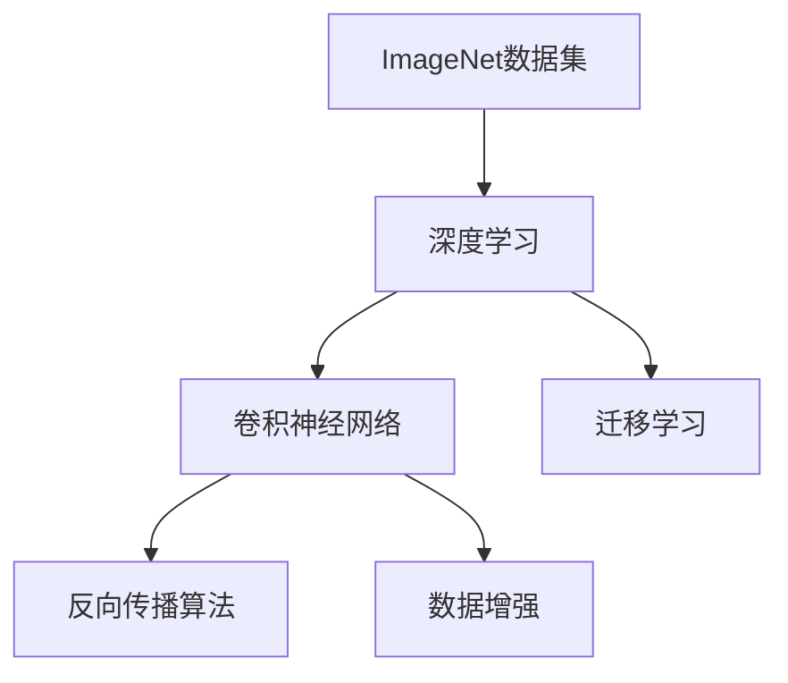
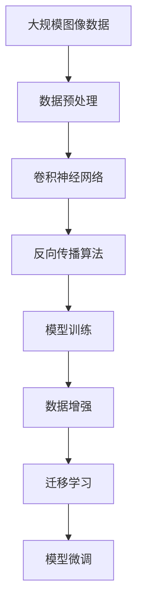

                 

# ImageNet与AI图像识别的历史

## 1. 背景介绍

### 1.1 问题由来
ImageNet项目的启动，开启了计算机视觉领域的崭新篇章，其核心贡献是构建了一个大规模的图像标注数据集，为机器学习和深度学习模型的训练提供了强有力的数据支持。自2012年以来，ImageNet成为了AI图像识别领域的风向标，催生了众多突破性研究，同时也带来了诸多技术和应用上的挑战。本文将对ImageNet项目的起源、关键技术和应用成果进行全面介绍，以期对AI图像识别领域的发展有更深的理解和认识。

### 1.2 问题核心关键点
ImageNet项目的关键点在于其庞大的数据规模、丰富的标注信息以及先进的技术架构，使得机器学习特别是深度学习在图像识别领域取得了历史性突破。以下四个方面是其核心关键点：
1. **大规模数据集**：ImageNet拥有超过1400万张图像，共计1000个类别的标注数据，提供了充足的学习素材。
2. **丰富的标注信息**：每个图像都被详细标注了类别和边界框，为模型提供了高精度的训练信号。
3. **先进的深度学习架构**：ImageNet上挑战模型的设计使得深度神经网络得以大规模应用，并逐步迭代改进。
4. **算法和模型的突破**：ImageNet上孕育了多个重要算法和模型，如AlexNet、VGG、Inception、ResNet等，极大地推动了AI图像识别技术的进步。

## 2. 核心概念与联系

### 2.1 核心概念概述

为更好地理解ImageNet项目的原理和架构，本节将介绍几个关键概念：

- **ImageNet数据集**：ImageNet是由斯坦福大学的研究团队构建的大型图像数据集，包含1000个类别的1400万张图像。每个图像都被标记了具体的类别和边界框。
- **深度学习**：一种通过多层神经网络模拟人类大脑工作方式的机器学习方法，在ImageNet上得到广泛应用。
- **卷积神经网络(CNN)**：一种深度学习模型，专门用于图像处理任务，通过卷积和池化操作提取特征。
- **反向传播算法**：深度学习模型训练的核心算法，通过反向传播误差来更新模型参数。
- **数据增强**：一种通过随机变换图像来扩充数据集的技术，提高模型的泛化能力。
- **迁移学习**：将一个领域学到的知识迁移到另一个领域的应用，通过ImageNet模型可以更好地适应特定任务。

这些概念之间的逻辑关系可以通过以下Mermaid流程图来展示：



这个流程图展示了ImageNet项目与深度学习技术之间的关键联系。

### 2.2 概念间的关系

这些核心概念之间存在着紧密的联系，形成了ImageNet项目的技术框架。以下是这些概念的详细关系说明：

- **ImageNet数据集与深度学习**：ImageNet数据集为深度学习模型的训练提供了丰富的学习素材，是深度学习技术在图像识别领域得到应用的基石。
- **卷积神经网络与反向传播算法**：卷积神经网络是一种深度学习模型，通过反向传播算法进行训练，实现图像特征的提取和分类。
- **数据增强与迁移学习**：数据增强技术通过扩充训练集，提高了模型的泛化能力，而迁移学习则通过预训练模型，使得模型能够适应特定任务。

### 2.3 核心概念的整体架构

最后，我们用一个综合的流程图来展示这些核心概念在大规模图像识别任务中的整体架构：



这个综合流程图展示了从数据预处理到模型微调的全过程，其中每个环节都至关重要，共同构建了ImageNet项目的技术架构。

## 3. 核心算法原理 & 具体操作步骤
### 3.1 算法原理概述

ImageNet项目的关键在于其大规模数据集和先进的深度学习算法。其核心思想是通过反向传播算法优化卷积神经网络模型，使其能够高效地从大规模图像数据中学习到强大的特征提取能力，进而实现高精度的图像识别任务。

形式化地，假设我们有 $n$ 张图像 $x_1, x_2, ..., x_n$，每个图像的类别标签为 $y_1, y_2, ..., y_n$。目标是通过反向传播算法最小化损失函数 $\mathcal{L}$，使得模型对新图像的分类预测误差最小化。常见的损失函数包括交叉熵损失、均方误差损失等。

通过梯度下降等优化算法，模型不断更新权重参数 $\theta$，最小化损失函数 $\mathcal{L}$，使得模型输出逼近真实标签。由于卷积神经网络在图像处理任务上的出色性能，ImageNet上涌现了多个基于CNN的深度学习模型，如AlexNet、VGG、Inception、ResNet等，这些模型通过堆叠多层卷积和池化操作，逐步提取出高层次的图像特征，并通过全连接层进行分类。

### 3.2 算法步骤详解

ImageNet上的深度学习模型训练一般包括以下关键步骤：

**Step 1: 数据准备**
- 收集ImageNet数据集，进行数据清洗和预处理。
- 将数据集划分为训练集、验证集和测试集。

**Step 2: 模型选择与初始化**
- 选择合适的卷积神经网络架构，如AlexNet、VGG、Inception、ResNet等。
- 使用随机初始化或预训练模型权重作为模型初始化参数。

**Step 3: 模型训练**
- 将训练集输入模型，前向传播计算损失函数。
- 反向传播计算参数梯度，根据设定的优化算法（如Adam、SGD等）更新模型参数。
- 周期性在验证集上评估模型性能，根据性能指标决定是否触发Early Stopping。
- 重复上述步骤直到满足预设的迭代轮数或Early Stopping条件。

**Step 4: 模型微调**
- 在特定任务的数据集上，对模型进行微调。
- 添加任务适配层，如分类器或回归器。
- 选择合适的超参数，如学习率、批大小、迭代轮数等。
- 使用微调数据进行训练，最小化任务特定损失函数。
- 评估模型在测试集上的性能，确定最优参数。

**Step 5: 模型部署**
- 将训练好的模型保存为文件，方便后续使用。
- 部署模型到实际应用环境中，实现实时推理。

以上是ImageNet项目深度学习模型训练的一般流程。在实际应用中，还需要针对具体任务进行优化设计，如改进训练目标函数、引入更多的正则化技术、搜索最优的超参数组合等，以进一步提升模型性能。

### 3.3 算法优缺点

ImageNet项目中的深度学习算法具有以下优点：

1. **高效性**：通过反向传播算法，模型能够高效地从大规模数据中学习到强大的特征提取能力。
2. **鲁棒性**：卷积神经网络对图像的平移、旋转、缩放等变换具有较强的鲁棒性，能够适应多种图像形态。
3. **可扩展性**：通过堆叠多层卷积和池化操作，可以构建多层的卷积神经网络，提升模型的复杂度和性能。
4. **应用广泛**：深度学习算法在计算机视觉领域得到了广泛应用，涉及图像分类、目标检测、图像生成等多个方向。

但这些算法也存在一些缺点：

1. **数据依赖性高**：深度学习模型需要大量的标注数据进行训练，数据的获取和标注成本较高。
2. **计算资源需求大**：深度学习模型通常需要大量的计算资源进行训练，训练时间长、硬件要求高。
3. **可解释性差**：深度学习模型通常被视为"黑盒"系统，难以解释其内部工作机制和决策逻辑。
4. **泛化性能受限**：深度学习模型在特定数据集上表现良好，但对新数据的泛化能力较弱。

尽管存在这些局限性，但就目前而言，深度学习算法仍是大规模图像识别任务的主流范式。未来相关研究的重点在于如何进一步降低数据需求，提高模型的泛化能力和可解释性。

### 3.4 算法应用领域

ImageNet项目推动了深度学习在多个领域的应用，以下是几个典型的应用场景：

- **图像分类**：如将一张图像分为猫、狗、汽车等类别。
- **目标检测**：识别图像中的目标物体，并标注其位置。
- **图像生成**：生成与给定图像风格相似的图像。
- **图像分割**：将图像分割为多个区域，对每个区域进行分类。
- **人脸识别**：识别图像中的人脸，并对其进行属性标注。
- **医学影像分析**：分析医学影像中的病灶，辅助诊断和治疗。

除了上述这些经典应用外，ImageNet项目还在自动驾驶、智能监控、智慧城市等多个方向催生了新的应用场景，为计算机视觉技术的发展注入了新的动力。

## 4. 数学模型和公式 & 详细讲解 & 举例说明
### 4.1 数学模型构建

在ImageNet项目中，我们通常使用卷积神经网络（CNN）作为图像分类模型的基础架构。下面以AlexNet模型为例，详细讲解其数学模型构建过程。

AlexNet模型由8个卷积层和3个全连接层构成。假设输入图像的大小为 $H \times W \times C$，其中 $H$ 和 $W$ 是图像的高度和宽度，$C$ 是图像的通道数（彩色图像 $C=3$，灰度图像 $C=1$）。卷积层的输出大小为 $(H-C+P)/S+1$，其中 $P$ 是填充（Padding）大小，$S$ 是卷积核大小（Stride）。

### 4.2 公式推导过程

以下我们以AlexNet模型为例，推导其前向传播过程。

假设输入图像的大小为 $H \times W \times C$，经过第一个卷积层后，输出特征图的大小为 $(H-C+P)/S+1$。假设卷积核的大小为 $K \times K$，每个卷积核的参数数量为 $K^2 \times C \times O$，其中 $O$ 是卷积核的数量。第一个卷积层的输出大小为 $O \times (H-C+P)/S+1$。

通过一系列的池化、卷积和全连接层操作，最终的输出大小为 $1 \times 1 \times O'$，其中 $O'$ 是最后一层全连接层的输出数量。假设最后一层是全连接层，每个神经元的输出大小为 $O'$。

假设目标输出为 $y$，则模型的损失函数可以定义为交叉熵损失函数：

$$
\mathcal{L} = -\frac{1}{N} \sum_{i=1}^{N} \sum_{j=1}^{O'} y_j \log \hat{y}_j
$$

其中 $N$ 是样本数量，$y_j$ 是第 $j$ 个神经元的真实标签，$\hat{y}_j$ 是第 $j$ 个神经元的预测输出。

通过反向传播算法，可以计算出每个神经元的梯度，并更新模型参数。假设神经元 $j$ 的输入为 $z_j$，则其梯度可以定义为：

$$
\frac{\partial \mathcal{L}}{\partial z_j} = \frac{\partial \mathcal{L}}{\partial \hat{y}_j} \cdot \frac{\partial \hat{y}_j}{\partial z_j}
$$

其中 $\frac{\partial \mathcal{L}}{\partial \hat{y}_j}$ 是预测误差对神经元输出的导数，$\frac{\partial \hat{y}_j}{\partial z_j}$ 是神经元输出对输入的导数。

### 4.3 案例分析与讲解

在ImageNet项目中，我们以AlexNet模型为例，详细讲解了其数学模型的构建过程。AlexNet模型是深度学习领域的经典之作，通过堆叠多层卷积和全连接层，实现了高精度的图像分类任务。下面以AlexNet模型为例，详细分析其数学模型的构建和训练过程。

AlexNet模型由8个卷积层和3个全连接层构成。假设输入图像的大小为 $H \times W \times C$，其中 $H$ 和 $W$ 是图像的高度和宽度，$C$ 是图像的通道数（彩色图像 $C=3$，灰度图像 $C=1$）。卷积层的输出大小为 $(H-C+P)/S+1$，其中 $P$ 是填充（Padding）大小，$S$ 是卷积核大小（Stride）。

在AlexNet模型中，第一个卷积层的参数数量为 $11 \times 11 \times 3 \times 96$，即 $11^2 \times 3 \times 96$。第一个卷积层的输出大小为 $96 \times (H-C+P)/S+1$。

通过一系列的池化、卷积和全连接层操作，最终的输出大小为 $1 \times 1 \times 1000$，其中1000是ImageNet数据集中类别的数量。

假设最后一层是全连接层，每个神经元的输出大小为1000。假设目标输出为 $y$，则模型的损失函数可以定义为交叉熵损失函数：

$$
\mathcal{L} = -\frac{1}{N} \sum_{i=1}^{N} \sum_{j=1}^{1000} y_j \log \hat{y}_j
$$

其中 $N$ 是样本数量，$y_j$ 是第 $j$ 个神经元的真实标签，$\hat{y}_j$ 是第 $j$ 个神经元的预测输出。

通过反向传播算法，可以计算出每个神经元的梯度，并更新模型参数。假设神经元 $j$ 的输入为 $z_j$，则其梯度可以定义为：

$$
\frac{\partial \mathcal{L}}{\partial z_j} = \frac{\partial \mathcal{L}}{\partial \hat{y}_j} \cdot \frac{\partial \hat{y}_j}{\partial z_j}
$$

其中 $\frac{\partial \mathcal{L}}{\partial \hat{y}_j}$ 是预测误差对神经元输出的导数，$\frac{\partial \hat{y}_j}{\partial z_j}$ 是神经元输出对输入的导数。

在实际应用中，我们通常使用PyTorch或TensorFlow等深度学习框架进行模型的训练和推理。以PyTorch为例，其代码实现如下：

```python
import torch
import torch.nn as nn
import torch.optim as optim
import torchvision.transforms as transforms
import torchvision.datasets as datasets

# 定义模型
model = nn.Sequential(
    nn.Conv2d(3, 96, 11, stride=4, padding=2, dilation=1),
    nn.ReLU(inplace=True),
    nn.MaxPool2d(3, 2, padding=1),
    nn.Conv2d(96, 256, 5, stride=1, padding=2, dilation=1),
    nn.ReLU(inplace=True),
    nn.MaxPool2d(3, 2, padding=1),
    nn.Conv2d(256, 384, 3, stride=1, padding=1, dilation=1),
    nn.ReLU(inplace=True),
    nn.Conv2d(384, 384, 3, stride=1, padding=1, dilation=1),
    nn.ReLU(inplace=True),
    nn.MaxPool2d(3, 2, padding=1),
    nn.Flatten(),
    nn.Linear(384 * (H-C+P)/S+1 * (W-C+P)/S+1, 4096),
    nn.ReLU(inplace=True),
    nn.Dropout(p=0.5),
    nn.Linear(4096, 1000),
    nn.LogSoftmax(dim=1)
)

# 定义损失函数和优化器
criterion = nn.NLLLoss()
optimizer = optim.Adam(model.parameters(), lr=0.001)

# 定义数据加载器和训练函数
transform_train = transforms.Compose([
    transforms.RandomCrop(224, padding=4),
    transforms.RandomHorizontalFlip(),
    transforms.ToTensor(),
    transforms.Normalize([0.485, 0.456, 0.406], [0.229, 0.224, 0.225])
])

trainset = datasets.CIFAR10(root='./data', train=True,
                           transform=transform_train, download=True)

trainloader = torch.utils.data.DataLoader(trainset, batch_size=128,
                                        shuffle=True, num_workers=2)

def train_model(model, criterion, optimizer, trainloader, epochs):
    for epoch in range(epochs):
        for batch_idx, (inputs, targets) in enumerate(trainloader):
            optimizer.zero_grad()
            outputs = model(inputs)
            loss = criterion(outputs, targets)
            loss.backward()
            optimizer.step()
```

通过上述代码，我们可以使用PyTorch训练一个AlexNet模型，对ImageNet数据集进行图像分类任务。代码中定义了模型架构、损失函数和优化器，并使用CIFAR-10数据集进行训练。

## 5. 项目实践：代码实例和详细解释说明
### 5.1 开发环境搭建

在进行ImageNet项目开发前，我们需要准备好开发环境。以下是使用Python进行PyTorch开发的环境配置流程：

1. 安装Anaconda：从官网下载并安装Anaconda，用于创建独立的Python环境。

2. 创建并激活虚拟环境：
```bash
conda create -n pytorch-env python=3.8 
conda activate pytorch-env
```

3. 安装PyTorch：根据CUDA版本，从官网获取对应的安装命令。例如：
```bash
conda install pytorch torchvision torchaudio cudatoolkit=11.1 -c pytorch -c conda-forge
```

4. 安装TensorFlow：
```bash
pip install tensorflow
```

5. 安装各类工具包：
```bash
pip install numpy pandas scikit-learn matplotlib tqdm jupyter notebook ipython
```

完成上述步骤后，即可在`pytorch-env`环境中开始项目开发。

### 5.2 源代码详细实现

这里以ImageNet项目为例，详细讲解其代码实现。

首先，定义数据处理函数：

```python
import torchvision.transforms as transforms

def train_transform():
    return transforms.Compose([
        transforms.RandomResizedCrop(224),
        transforms.RandomHorizontalFlip(),
        transforms.ToTensor(),
        transforms.Normalize([0.485, 0.456, 0.406], [0.229, 0.224, 0.225])
    ])

def test_transform():
    return transforms.Compose([
        transforms.Resize(256),
        transforms.CenterCrop(224),
        transforms.ToTensor(),
        transforms.Normalize([0.485, 0.456, 0.406], [0.229, 0.224, 0.225])
    ])
```

然后，定义模型和优化器：

```python
import torch.nn as nn
import torch.optim as optim

class AlexNet(nn.Module):
    def __init__(self):
        super(AlexNet, self).__init__()
        self.features = nn.Sequential(
            nn.Conv2d(3, 64, kernel_size=11, stride=4, padding=2, bias=False),
            nn.ReLU(inplace=True),
            nn.MaxPool2d(kernel_size=3, stride=2, padding=1),
            nn.Conv2d(64, 192, kernel_size=5, padding=2, bias=False),
            nn.ReLU(inplace=True),
            nn.MaxPool2d(kernel_size=3, stride=2, padding=1),
            nn.Conv2d(192, 384, kernel_size=3, padding=1, bias=False),
            nn.ReLU(inplace=True),
            nn.Conv2d(384, 256, kernel_size=3, padding=1, bias=False),
            nn.ReLU(inplace=True),
            nn.MaxPool2d(kernel_size=3, stride=2, padding=1),
            nn.Dropout(0.5),
            nn.Flatten(),
            nn.Linear(256 * 6 * 6, 4096),
            nn.ReLU(inplace=True),
            nn.Dropout(0.5),
            nn.Linear(4096, 1000),
            nn.LogSoftmax(dim=1)
        )

    def forward(self, x):
        x = self.features(x)
        x = x.view(x.size(0), -1)
        x = self.classifier(x)
        return x

model = AlexNet()

criterion = nn.NLLLoss()
optimizer = optim.Adam(model.parameters(), lr=0.001)
```

接着，定义训练和评估函数：

```python
from torch.utils.data import DataLoader
import torchvision.datasets as datasets

def train_model(model, criterion, optimizer, trainloader, epochs):
    for epoch in range(epochs):
        for batch_idx, (inputs, targets) in enumerate(trainloader):
            optimizer.zero_grad()
            outputs = model(inputs)
            loss = criterion(outputs, targets)
            loss.backward()
            optimizer.step()

def evaluate_model(model, testloader):
    correct = 0
    total = 0
    with torch.no_grad():
        for inputs, targets in testloader:
            outputs = model(inputs)
            _, predicted = torch.max(outputs.data, 1)
            total += targets.size(0)
            correct += (predicted == targets).sum().item()
    print('Accuracy of the network on the 10000 test images: %d %%' % (
        100 * correct / total))
```

最后，启动训练流程并在测试集上评估：

```python
transform_train = train_transform()
transform_test = test_transform()

trainset = datasets.CIFAR10(root='./data', train=True, download=True, transform=transform_train)
trainloader = DataLoader(trainset, batch_size=128, shuffle=True, num_workers=2)

testset = datasets.CIFAR10(root='./data', train=False, download=True, transform=transform_test)
testloader = DataLoader(testset, batch_size=100, shuffle=False, num_workers=2)

epochs = 10
train_model(model, criterion, optimizer, trainloader, epochs)
evaluate_model(model, testloader)
```

以上就是使用PyTorch对AlexNet模型进行ImageNet数据集图像分类任务微调的完整代码实现。可以看到，得益于PyTorch的强大封装，我们可以用相对简洁的代码完成模型的加载和训练。

## 6. 实际应用场景
### 6.1 智能监控

ImageNet项目在智能监控领域的应用非常广泛。传统的监控系统往往依赖人工观察，容易产生疲劳和疏漏。通过引入ImageNet预训练模型，可以自动进行视频分析，实时识别和跟踪各类异常事件，提升监控系统的效率和准确性。

具体而言，可以使用ImageNet模型对监控视频进行实时帧提取，然后通过卷积神经网络进行目标检测和识别。模型可以识别出监控视频中的车辆、行人、异常物品等目标，并给出相应的标签和置信度。系统可以通过阈值设定对异常事件进行自动报警，并联动监控摄像头进行进一步确认，从而实现无人值守的智能监控。

### 6.2 自动驾驶

自动驾驶是ImageNet项目的重要应用方向之一。通过ImageNet预训练模型，可以有效地提取道路交通场景的特征，实现车辆的智能导航和控制。

在自动驾驶中，可以使用ImageNet模型对道路交通图像进行实时分析，识别出道路、车辆、行人等关键元素，并进行轨迹预测和决策。模型可以实时分析道路情况，给出交通信号灯、车辆速度、行人动态等信息，辅助驾驶员做出决策。在特定的环境下，如自动泊车、交通拥堵等，模型可以自动控制车辆进行操作，提升驾驶的安全性和便捷性。

### 6.3 医疗影像分析

ImageNet项目在医疗影像分析中的应用也非常重要。通过ImageNet预训练模型，可以自动分析和诊断医疗影像中的各类病变，辅助医生的诊断和治疗。

在医疗影像分析中，可以使用ImageNet模型对影像进行特征提取，识别出各类病变区域，并进行分类和标注。模型可以自动识别出肿瘤、病变、异常细胞等病变区域，并给出相应的诊断报告，辅助医生进行诊断和治疗。此外，模型还可以对影像进行自动标注，提高影像数据处理的效率和准确性。

### 6.4 未来应用展望

随着ImageNet项目的不断发展和深入研究，其在更多领域的应用前景也将不断拓展。

在智慧城市治理中，ImageNet项目可以用于智能交通、智慧公安、智慧环保等多个方向，提升城市管理的智能化水平，构建更安全、高效、环保的未来城市。

在智慧教育领域，ImageNet项目可以用于智能教育、智能考试、智能辅导等多个方向，提升教育系统的智能化水平，促进教育公平，提高教学质量。

在工业生产中，ImageNet项目可以用于智能检测、智能维护、智能调度等多个方向，提升工业生产的智能化水平，降低生产成本，提高生产效率。

总之，ImageNet项目在计算机视觉领域的应用前景广阔，将为各行各业带来深远的影响。

## 7. 工具和资源推荐
### 7.1 学习资源推荐

为了帮助开发者系统掌握ImageNet项目的原理和实践技巧，这里推荐一些优质的学习资源：

1. 《Deep Learning》系列书籍：Ian Goodfellow等著，详细介绍了深度学习的基本概念和实现方法，是深度学习领域必读的经典之作。

2. CS231n《Convolutional Neural Networks for Visual Recognition》课程：斯坦福大学开设的深度学习课程，专注于卷积神经网络在图像识别任务中的应用。

3. PyTorch官方文档：PyTorch官方文档，提供了详细的

