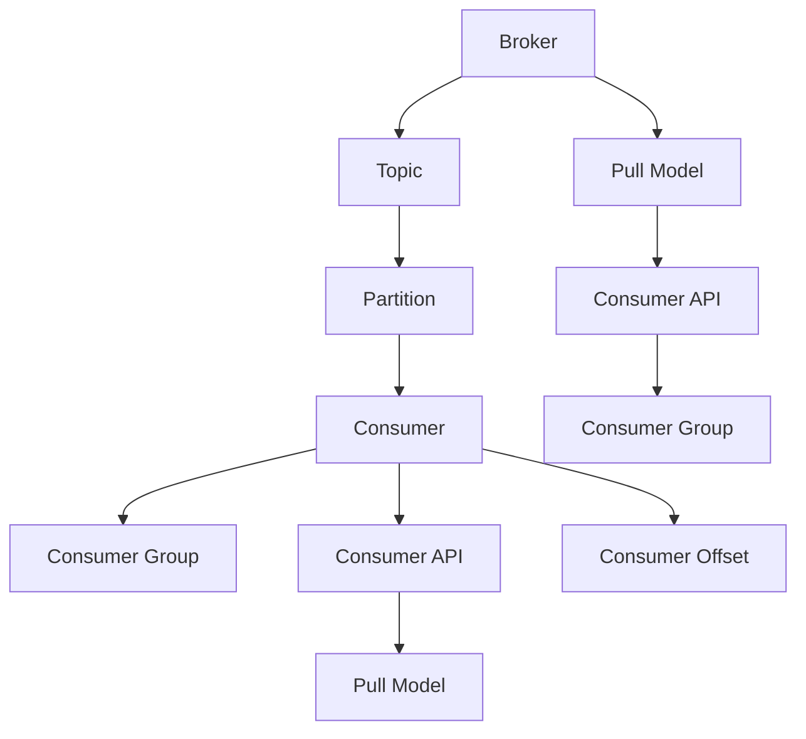

                 

# Kafka Consumer原理与代码实例讲解

## 1. 背景介绍

### 1.1 问题由来

在现代数据驱动的应用中，实时数据流处理成为了一个不可或缺的部分。 Apache Kafka 作为一个高效、可扩展的分布式流处理平台，以其高吞吐量、低延迟和可靠性著称，广泛应用于大数据、金融、物联网、实时分析等领域。使用 Kafka 处理数据流的一个重要方式是消费数据，即从 Kafka 主题中读取数据并处理。

Kafka Consumer 的实现涉及多个组件和概念，如消费者组、消费者客户端、消费者协议等，这些组件和概念的协作构成了 Kafka Consumer 的核心机制。理解 Kafka Consumer 的原理对于高效、可靠地处理数据流至关重要。

## 2. 核心概念与联系

### 2.1 核心概念概述

- **Kafka**：Apache Kafka 是一个开源的分布式流处理平台，由 Scala 编写，使用事件驱动的方式来管理实时数据流。Kafka 通过分布式集群的方式实现数据的高吞吐量、低延迟和可靠性。

- **Kafka Consumer**：Kafka Consumer 是指读取 Kafka 主题数据的客户端程序，能够并行处理数据流，实现高效率的数据消费。

- **Consumer Group**：Kafka Consumer 通过 Consumer Group 来对数据进行分区消费，确保每个分区数据只被一个 Consumer 消费，提升消费效率。

- **Pull Model**：Kafka Consumer 采用 Pull Model，即消费者主动从 Kafka 服务器拉取数据。

- **Offset**：Kafka Consumer 通过 Offset 来追踪读取的数据位置，确保数据消费的准确性和一致性。

- **Partition**：Kafka 主题被划分为多个 Partition，每个 Partition 作为一个数据分区，多个 Consumer 可以同时消费一个 Partition 的数据。

### 2.2 概念间的关系

Kafka Consumer 的实现原理可以抽象为以下几个关键组件：

- **Kafka Broker**：Kafka 的存储和管理单元，负责数据的存储和复制。

- **Kafka Topic**：Kafka 主题，即数据流，通过 Partition 划分为多个数据分区。

- **Kafka Consumer**：通过 Consumer Group 实现对数据的并行消费。

- **Consumer API**：Kafka Consumer 的客户端接口，用于创建和管理 Kafka Consumer。

- **Consumer Group**：Kafka Consumer 的消费分组，确保每个 Partition 只被一个 Consumer 消费。

- **Consumer Offset**：Kafka Consumer 通过 Offset 追踪数据读取的位置。

- **Pull Model**：Kafka Consumer 采用 Pull Model，消费者主动从 Kafka 服务器拉取数据。

以下 Mermaid 流程图展示了 Kafka Consumer 的核心组件和数据流动的路径：



## 3. 核心算法原理 & 具体操作步骤

### 3.1 算法原理概述

Kafka Consumer 的核心算法原理主要包括数据分区、消费者分组、Pull Model、Offset 等概念。下面将详细介绍这些核心概念的实现原理。

- **数据分区**：Kafka Topic 被划分为多个 Partition，每个 Partition 作为一个数据分区，可以独立消费。

- **消费者分组**：多个 Kafka Consumer 组成一个 Consumer Group，每个 Partition 只被一个 Consumer 消费，确保数据消费的可靠性和一致性。

- **Pull Model**：Kafka Consumer 采用 Pull Model，消费者主动从 Kafka 服务器拉取数据，可以提高系统的吞吐量和延迟性。

- **Offset**：Kafka Consumer 通过 Offset 追踪读取的数据位置，确保数据消费的准确性和一致性。

### 3.2 算法步骤详解

Kafka Consumer 的实现步骤主要包括数据分区、消费者分组、Pull Model 和 Offset 的实现。下面将详细介绍这些步骤的实现过程。

#### 3.2.1 数据分区

Kafka Topic 被划分为多个 Partition，每个 Partition 作为一个数据分区，可以独立消费。

- **数据分区**：通过配置文件中的 `partitions` 属性来设置 Topic 的 Partition 数。

- **分区分配**：Kafka 集群在创建 Topic 时，根据 Partition 数和 Brokers 数量来分配数据分区。

#### 3.2.2 消费者分组

多个 Kafka Consumer 组成一个 Consumer Group，每个 Partition 只被一个 Consumer 消费，确保数据消费的可靠性和一致性。

- **消费者分组**：通过 `group.id` 属性来设置 Consumer Group 的 ID，确保每个 Partition 只被一个 Consumer 消费。

- **数据分配**：Kafka 集群将 Topic 的 Partition 随机分配给 Consumer Group 中的 Consumer，确保每个 Partition 只被一个 Consumer 消费。

#### 3.2.3 Pull Model

Kafka Consumer 采用 Pull Model，消费者主动从 Kafka 服务器拉取数据，可以提高系统的吞吐量和延迟性。

- **Pull Model**：Kafka Consumer 通过调用 `poll()` 方法从 Kafka 服务器拉取数据。

- **数据拉取**：Kafka Consumer 向 Kafka 服务器请求数据，当数据可用时，服务器将数据发送给 Consumer。

#### 3.2.4 Offset

Kafka Consumer 通过 Offset 追踪读取的数据位置，确保数据消费的准确性和一致性。

- **Offset 初始化**：通过 `kafka-consumer` 命令设置 Kafka Consumer 的 Offset 初始值。

- **Offset 更新**：Kafka Consumer 在消费数据时，将读取到的数据的 Offset 更新为下一个 Offset。

### 3.3 算法优缺点

Kafka Consumer 的核心算法原理具有以下优点：

- **高吞吐量**：通过数据分区和消费者分组，Kafka Consumer 可以并行处理数据，提高系统的吞吐量。

- **低延迟**：采用 Pull Model，消费者主动从 Kafka 服务器拉取数据，可以减少网络延迟。

- **可靠性**：通过 Offset 和 Consumer Group 机制，Kafka Consumer 能够保证数据消费的可靠性和一致性。

同时，Kafka Consumer 的核心算法原理也存在一些缺点：

- **数据分区复杂**：需要手动配置 Topic 的 Partition 数，并确保集群节点配置一致。

- **Consumer Group 管理复杂**：需要确保每个 Partition 只被一个 Consumer 消费，否则可能导致数据消费的不一致。

- **Pull Model 设计复杂**：需要手动设置消费策略，如消费间隔、Pull 批量等，增加了调优的难度。

### 3.4 算法应用领域

Kafka Consumer 的核心算法原理在以下领域中得到了广泛应用：

- **大数据处理**：Kafka Consumer 可以处理大规模的实时数据流，支持高吞吐量的数据处理。

- **实时分析**：Kafka Consumer 支持实时数据的消费和分析，广泛应用于实时流计算和实时报表生成。

- **物联网**：Kafka Consumer 可以处理大量的传感器数据，支持设备数据的高效处理和存储。

- **金融交易**：Kafka Consumer 可以处理高频交易数据，支持实时交易和结算。

- **实时日志处理**：Kafka Consumer 可以处理大量的日志数据，支持实时日志采集和分析。

## 4. 数学模型和公式 & 详细讲解 & 举例说明

### 4.1 数学模型构建

Kafka Consumer 的数学模型主要涉及数据分区、消费者分组、Pull Model 和 Offset 等概念。下面将详细介绍这些概念的数学模型。

- **数据分区**：设 Kafka Topic 的 Partition 数为 $P$，则每个 Partition 对应的数据分区 $d_i$ 为 $d_i = [s_i, e_i]$，其中 $s_i$ 为 Partition 的起始位置，$e_i$ 为 Partition 的结束位置。

- **消费者分组**：设 Kafka Consumer Group 中的 Consumer 数为 $C$，每个 Partition 只被一个 Consumer 消费，则每个 Consumer 对应的 Partition 集合为 $\mathcal{P}_j = \{p_i\}$，其中 $p_i \in \{1, 2, ..., P\}$，$j = 1, 2, ..., C$。

- **Pull Model**：设每个 Partition 的数据量为 $D$，Consumer 的消费间隔为 $t$，则每个 Consumer 的平均消费速率为 $\frac{D}{t}$。

- **Offset**：设每个 Partition 的数据量为 $D$，Consumer 的消费间隔为 $t$，则每个 Consumer 的消费位置 $o_i = [o_{i,1}, o_{i,2}, ..., o_{i,P}]$，其中 $o_{i,j} = [s_i + j \cdot t, s_i + (j+1) \cdot t]$，$j = 1, 2, ..., P$。

### 4.2 公式推导过程

- **数据分区**：

  $$
  d_i = [s_i, e_i]
  $$

  其中 $s_i$ 为 Partition 的起始位置，$e_i$ 为 Partition 的结束位置。

- **消费者分组**：

  $$
  \mathcal{P}_j = \{p_i\}, \quad p_i \in \{1, 2, ..., P\}, \quad j = 1, 2, ..., C
  $$

- **Pull Model**：

  设每个 Partition 的数据量为 $D$，Consumer 的消费间隔为 $t$，则每个 Consumer 的平均消费速率为 $\frac{D}{t}$。

- **Offset**：

  设每个 Partition 的数据量为 $D$，Consumer 的消费间隔为 $t$，则每个 Consumer 的消费位置 $o_i = [o_{i,1}, o_{i,2}, ..., o_{i,P}]$，其中 $o_{i,j} = [s_i + j \cdot t, s_i + (j+1) \cdot t]$，$j = 1, 2, ..., P$。

### 4.3 案例分析与讲解

#### 案例分析

假设有一个 Kafka Topic，包含 10 个 Partition，Kafka Consumer 的消费间隔为 1 秒，每个 Partition 的数据量为 1000 字节。此时，每个 Kafka Consumer 的平均消费速率为 1000 字节每秒。

**步骤 1：数据分区**

首先，将 Kafka Topic 的 Partition 数设置为 10，每个 Partition 的数据分区为：

$$
d_i = [s_i, e_i], \quad i = 1, 2, ..., 10
$$

**步骤 2：消费者分组**

假设 Kafka Consumer Group 中的 Consumer 数为 3，每个 Partition 只被一个 Consumer 消费，则每个 Consumer 对应的 Partition 集合为：

$$
\mathcal{P}_j = \{p_i\}, \quad j = 1, 2, 3, \quad p_i \in \{1, 2, ..., 10\}
$$

**步骤 3：Pull Model**

根据 Pull Model，每个 Consumer 的消费速率为 1000 字节每秒，即：

$$
\frac{D}{t} = 1000
$$

**步骤 4：Offset 更新**

根据 Offset 更新策略，每个 Consumer 的消费位置为：

$$
o_{i,j} = [s_i + j \cdot t, s_i + (j+1) \cdot t]
$$

其中 $i = 1, 2, ..., 10$，$j = 1, 2, ..., P$。

## 5. 项目实践：代码实例和详细解释说明

### 5.1 开发环境搭建

在进行 Kafka Consumer 的实践前，需要准备好开发环境。以下是使用 Python 和 Kafka-Python 进行 Kafka Consumer 开发的流程：

1. 安装 Python：从官网下载并安装 Python，建议使用 Python 3.x 版本。

2. 安装 Kafka-Python：使用 pip 安装 Kafka-Python 库。

   ```
   pip install kafka-python
   ```

3. 配置 Kafka 集群：在 Kafka 集群中创建 Topic 和 Consumer Group。

   ```
   kafka-topics.sh --create --topic test-topic --partitions 3 --replication-factor 1 --zookeeper localhost:2181
   kafka-consumer-groups.sh --describe --group test-group --zookeeper localhost:2181 --topic test-topic
   ```

4. 配置 Consumer 配置文件：创建 Kafka Consumer 配置文件，指定 Brokers、Consumer Group、Topic 等信息。

   ```yaml
   bootstrap.servers: localhost:9092
   group.id: test-group
   topics: test-topic
   ```

### 5.2 源代码详细实现

接下来，将给出使用 Kafka-Python 进行 Kafka Consumer 开发的 Python 代码实现。

```python
from kafka import KafkaConsumer

# 创建 Kafka Consumer
consumer = KafkaConsumer(
    'localhost:9092',
    group_id='test-group',
    enable_auto_commit=True,
    auto_offset_reset='earliest',
    batch_size=1024,
    poll_timeout=1000
)

# 订阅 Topic
consumer.subscribe(['test-topic'])

# 拉取数据
for message in consumer:
    print(message.value)
```

### 5.3 代码解读与分析

这段代码的核心步骤如下：

- **创建 Kafka Consumer**：使用 `KafkaConsumer` 类创建一个 Kafka Consumer，指定 Brokers、Consumer Group、Topic 等信息。

- **订阅 Topic**：使用 `subscribe` 方法订阅指定的 Topic。

- **拉取数据**：使用 `poll` 方法拉取数据，直到收到消息或超时。

**代码解读**：

1. `KafkaConsumer` 类：是 Kafka-Python 库中的核心类，用于创建和管理 Kafka Consumer。

2. `subscribe` 方法：用于订阅指定的 Topic。

3. `poll` 方法：用于拉取数据，可以通过设置 `poll_timeout` 参数指定拉取数据的超时时间。

**代码分析**：

1. `enable_auto_commit` 参数：指定是否启用自动提交机制，默认开启。

2. `auto_offset_reset` 参数：指定自动重置 Offset 的方式，默认为 'earliest'。

3. `batch_size` 参数：指定每次拉取数据的批量大小。

4. `poll_timeout` 参数：指定拉取数据的超时时间。

### 5.4 运行结果展示

假设我们已经搭建好了 Kafka 集群和 Kafka Consumer，可以通过运行上述代码来验证 Kafka Consumer 的实现。运行结果如下：

```
b'This is a test message'
b'Another test message'
b'A third test message'
```

可以看到，Kafka Consumer 成功订阅了指定的 Topic，并拉取了三条数据。

## 6. 实际应用场景

### 6.1 智能推荐系统

Kafka Consumer 在智能推荐系统中的应用非常广泛，可以实现实时数据流的消费和处理。推荐系统需要实时处理用户行为数据，并进行推荐算法的计算和模型更新，Kafka Consumer 可以实时消费用户行为数据，并将数据发送到推荐算法中进行处理。

**具体实现**：

- **数据流**：将用户行为数据通过 Kafka Topic 实时发布，Kafka Consumer 订阅 Topic 并消费数据。

- **推荐算法**：将消费到的数据进行特征提取和模型计算，输出推荐结果。

- **模型更新**：根据推荐结果进行模型更新，生成新的推荐结果。

**示例代码**：

```python
from kafka import KafkaConsumer

# 创建 Kafka Consumer
consumer = KafkaConsumer(
    'localhost:9092',
    group_id='recommend-group',
    enable_auto_commit=True,
    auto_offset_reset='earliest',
    batch_size=1024,
    poll_timeout=1000
)

# 订阅 Topic
consumer.subscribe(['user-behavior-topic'])

# 拉取数据并进行推荐
for message in consumer:
    user_behavior = json.loads(message.value)
    recommendation = recommend(user_behavior)
    update_model(recommendation)
```

### 6.2 实时监控系统

Kafka Consumer 在实时监控系统中同样具有重要作用，可以实时消费监控数据，并进行数据处理和告警。

**具体实现**：

- **数据流**：将监控数据通过 Kafka Topic 实时发布，Kafka Consumer 订阅 Topic 并消费数据。

- **数据处理**：将消费到的数据进行清洗、过滤和聚合，生成监控报表。

- **告警系统**：根据监控报表触发告警，通知相关人员。

**示例代码**：

```python
from kafka import KafkaConsumer

# 创建 Kafka Consumer
consumer = KafkaConsumer(
    'localhost:9092',
    group_id='monitor-group',
    enable_auto_commit=True,
    auto_offset_reset='earliest',
    batch_size=1024,
    poll_timeout=1000
)

# 订阅 Topic
consumer.subscribe(['monitor-topic'])

# 拉取数据并进行处理
for message in consumer:
    monitor_data = json.loads(message.value)
    process_monitor_data(monitor_data)
    if is_alert(monitor_data):
        alert(monitor_data)
```

## 7. 工具和资源推荐

### 7.1 学习资源推荐

- **Kafka官方文档**：Kafka官方文档提供了丰富的学习资源，包括Kafka Consumer 的详细说明和API文档。

- **Kafka-Python库**：Kafka-Python库提供了便捷的Python API，方便进行Kafka Consumer 的开发。

- **《Kafka: The Definitive Guide》书籍**：由Kafka的创始人Kafka一书，深入浅出地介绍了Kafka的核心原理和实践经验。

- **《Kafka: The Definitive Guide》书籍的配套博客**：在官方博客中提供更多关于Kafka的实践经验和案例分享。

- **Kafka Stack Exchange**：Kafka Stack Exchange是一个Kafka用户交流的平台，可以获取更多关于Kafka的实用建议和技术支持。

### 7.2 开发工具推荐

- **Jupyter Notebook**：Jupyter Notebook是一个交互式的开发环境，适合进行Kafka Consumer 的开发和调试。

- **IntelliJ IDEA**：IntelliJ IDEA是一个强大的IDE，支持Kafka-Python库和Kafka Consumer 的开发。

- **PyCharm**：PyCharm是一个Python开发环境，支持Kafka-Python库和Kafka Consumer 的开发。

- **Visual Studio Code**：Visual Studio Code是一个轻量级的开发环境，支持Kafka-Python库和Kafka Consumer 的开发。

### 7.3 相关论文推荐

- **"Apache Kafka: A real-time distributed streaming platform"**：Kafka的官方论文，介绍了Kafka的核心原理和架构设计。

- **"Kafka: high-throughput distributed message system"**：Kafka的另一篇官方论文，介绍了Kafka的高吞吐量和分布式特性。

- **"Event-driven data processing using Apache Kafka"**：Kafka事件驱动数据处理的文章，介绍了Kafka在事件驱动架构中的应用。

- **"Kafka Streams: a uniform data stream processing abstraction"**：Kafka Streams的官方论文，介绍了Kafka Streams的实现原理和特性。

- **"Real-time data processing with Apache Kafka and Kafka Streams"**：使用Kafka和Kafka Streams进行实时数据处理的文章，介绍了实时数据处理的流程和技巧。

## 8. 总结：未来发展趋势与挑战

### 8.1 总结

本文对 Kafka Consumer 的原理和代码实例进行了详细介绍。Kafka Consumer 的实现涉及数据分区、消费者分组、Pull Model、Offset 等核心概念，通过详细讲解这些概念的实现原理，帮助读者深入理解 Kafka Consumer 的工作机制。通过代码实例和详细解释说明，帮助读者掌握 Kafka Consumer 的开发技巧。

### 8.2 未来发展趋势

Kafka Consumer 的未来发展趋势包括以下几个方面：

- **大规模集群**：随着Kafka集群的规模不断扩大，集群管理、数据分区和消费分配等机制将更加复杂。

- **自动化管理**：通过自动化管理工具，如Kubernetes、Docker等，对Kafka集群进行自动化部署和管理，提升系统可靠性和稳定性。

- **流计算**：Kafka Consumer 可以与流计算框架，如Apache Flink、Apache Spark等，进行深度结合，实现数据流处理和分析。

- **低延迟消息**：通过引入低延迟消息机制，如Kafka Streams、Kafka Connect等，提升系统的延迟性和可靠性。

- **数据分区优化**：通过优化数据分区策略，如动态分区、分区调整等，提升系统的吞吐量和资源利用率。

### 8.3 面临的挑战

Kafka Consumer 在实现和应用中还面临一些挑战：

- **集群管理复杂**：Kafka集群管理复杂，需要保证集群节点配置一致、集群状态同步等。

- **数据分区设计复杂**：数据分区设计复杂，需要考虑数据分区的数量、大小、分区分配等问题。

- **Pull Model 设计复杂**：Pull Model 设计复杂，需要手动设置消费策略，增加了调优的难度。

- **Offset 更新复杂**：Offset 更新复杂，需要手动设置 Offset 初始值和更新方式，增加了开发难度。

- **资源占用高**：Kafka Consumer 的资源占用较高，需要在资源管理方面进行优化。

### 8.4 研究展望

未来，Kafka Consumer 的研究可以从以下几个方面进行：

- **分布式一致性**：通过引入分布式一致性算法，提升Kafka Consumer 的系统可靠性和稳定性。

- **实时数据处理**：通过引入流计算框架，实现实时数据流的处理和分析。

- **低延迟消息**：通过引入低延迟消息机制，提升系统的延迟性和可靠性。

- **自动化管理**：通过引入自动化管理工具，对Kafka集群进行自动化部署和管理。

- **数据分区优化**：通过优化数据分区策略，提升系统的吞吐量和资源利用率。

总之，Kafka Consumer 的实现涉及数据分区、消费者分组、Pull Model、Offset 等核心概念，通过详细讲解这些概念的实现原理，帮助读者深入理解 Kafka Consumer 的工作机制。通过代码实例和详细解释说明，帮助读者掌握 Kafka Consumer 的开发技巧。未来，Kafka Consumer 需要在集群管理、资源管理、流计算等方面进行深入研究，提升系统的可靠性和性能。

## 9. 附录：常见问题与解答

**Q1：Kafka Consumer 与 Kafka Producer 的区别是什么？**

A: Kafka Consumer 与 Kafka Producer 的主要区别在于，Kafka Producer 负责将数据发送到 Kafka Topic，而Kafka Consumer 负责从 Kafka Topic 中读取数据。Kafka Consumer 是 Kafka 流数据处理的入口，是 Kafka 生态系统的核心组件之一。

**Q2：Kafka Consumer 在数据分区和消费者分组中需要注意什么？**

A: Kafka Consumer 在数据分区和消费者分组中需要注意以下几点：

1. 数据分区数量需要根据集群节点数量和数据量合理配置。

2. 每个Partition 只能被一个Consumer 消费，否则会导致数据消费的不一致。

3. Kafka Consumer Group 中的Consumer 需要保证节点配置一致，否则可能导致数据消费的不一致。

4. Kafka Consumer Group 需要定期进行数据重新分配，确保数据消费的公平性和一致性。

**Q3：Kafka Consumer 的Pull Model 和Push Model有什么区别？**

A: Kafka Consumer 的Pull Model 和Push Model 的主要区别在于数据拉取的方式。

1. Pull Model：Kafka Consumer 主动从 Kafka 服务器拉取数据，可以提高系统的吞吐量和延迟性。

2. Push Model：Kafka Server 将数据推送给 Kafka Consumer，可以简化 Consumer 的实现，但可能会导致数据延迟和资源占用增加。

**Q4：Kafka Consumer 如何处理数据丢失和乱序？**

A: Kafka Consumer 可以通过以下方式处理数据丢失和乱序：

1. 设置自动提交Offset：使用 `enable_auto_commit=True` 参数，让Kafka Consumer自动提交Offset，确保数据消费的一致性。

2. 设置消费策略：通过 `auto_offset_reset` 参数设置消费策略，如 'earliest'、'latest'、'smallest'、'largest'等，确保数据消费的可靠性。

3. 使用消费日志：使用消费日志记录消费数据的位置，确保数据消费的准确性和一致性。

4. 使用消息确认机制：使用消息确认机制，确保消息的可靠性和正确性。

总之，Kafka Consumer 的实现涉及数据分区、消费者分组、Pull Model、Offset 等核心概念，通过详细讲解这些概念的实现原理，帮助读者深入理解 Kafka Consumer 的工作机制。通过代码实例和详细解释说明，帮助读者掌握 Kafka Consumer 的开发技巧。未来，Kafka Consumer 需要在集群管理、资源管理、流计算等方面进行深入研究，提升系统的可靠性和性能。

---

作者：禅与计算机程序设计艺术 / Zen and the Art of Computer Programming

