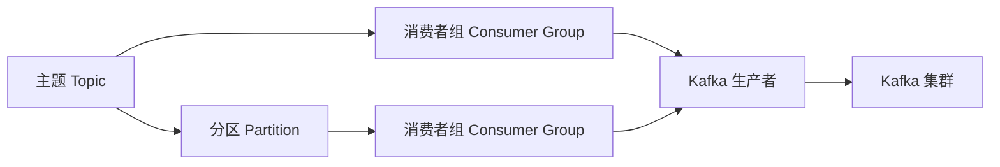

                 

# Kafka Producer原理与代码实例讲解

> 关键词：Kafka,消息队列,分布式系统,流处理,消息中间件,微服务架构

## 1. 背景介绍

### 1.1 问题由来

在现代互联网应用中，数据流处理变得越来越重要。企业需要在实时性和可靠性方面对数据进行高效处理和存储，以满足各种复杂的业务需求。为了解决这些问题， Apache Kafka 应运而生。Kafka 是一个高吞吐量的分布式消息队列系统，被广泛应用于各种实时数据流处理和存储场景，如日志存储、流数据处理、消息通信等。

Kafka 生产者（Producer）是 Kafka 系统中的重要组件，负责将数据产生并发送到 Kafka 集群中。本文将详细讲解 Kafka 生产者原理，并结合实际案例，展示如何通过代码实现一个简单的 Kafka 生产者。

## 2. 核心概念与联系

### 2.1 核心概念概述

要理解 Kafka 生产者的工作原理，首先需要了解 Kafka 的一些核心概念：

- Kafka 消息队列：Kafka 是一个基于发布-订阅模式的消息队列，消息的生产者和消费者可以异步通信，提高系统的吞吐量和可用性。
- 主题（Topic）：Kafka 中的消息按照主题进行分类存储，主题是 Kafka 中数据流的抽象概念。
- 分区（Partition）：每个主题由多个分区组成，每个分区是一段有序、不可变的消息序列，用于提高系统的可扩展性和容错性。
- 消费者组（Consumer Group）：多个消费者可以组成一个消费者组，共同订阅同一个主题的多个分区，可以提高系统的并发处理能力。

- Kafka 生产者：负责将数据产生并发送到 Kafka 集群中的消息生产者，是 Kafka 系统的核心组件之一。

### 2.2 概念间的关系

Kafka 生产者、主题、分区、消费者组等概念之间的逻辑关系，可以通过以下 Mermaid 流程图来展示：



这个流程图展示了大数据流在 Kafka 系统中的处理流程：

1. 主题将数据流进行分类存储。
2. 每个主题由多个分区组成，每个分区是一段有序的消息序列。
3. 消费者组共同订阅同一主题的多个分区，处理消息流。
4. Kafka 生产者将数据产生并发送到 Kafka 集群中，消费者组可以订阅并处理这些数据。

通过这个流程，我们可以理解 Kafka 系统是如何处理海量数据流的。下面我们将深入探讨 Kafka 生产者的工作原理。

## 3. 核心算法原理 & 具体操作步骤
### 3.1 算法原理概述

Kafka 生产者负责将数据产生并发送到 Kafka 集群中。生产者在发送数据时，需要遵循 Kafka 的消息生产协议，包括将数据序列化成字节流、计算分区号、将消息写入分区等步骤。

Kafka 生产器的核心算法原理可以概括为以下几个步骤：

1. 将数据序列化为字节流。
2. 计算分区号。
3. 将消息写入分区。

下面将详细介绍这些步骤的实现原理。

### 3.2 算法步骤详解

#### 3.2.1 序列化数据

Kafka 生产者将数据序列化为字节流，这是通过 Kafka 序列化器（Serializer）完成的。序列化器负责将原始数据转换为字节流，以便在网络中传输。Kafka 支持多种序列化器，包括 JSON、Avro、GZIP 等。

在序列化数据时，需要遵循 Kafka 的序列化协议，主要包括消息头（Header）、消息体（Payload）、消息键（Key）和分区号（Partition Key）。消息头包含了消息的基本信息，如消息大小、发送时间等；消息体是实际的数据内容；消息键用于分区；分区号用于指定消息发送的分区。

#### 3.2.2 计算分区号

Kafka 生产者根据消息键计算分区号，将消息发送到指定的分区中。分区号的计算方法是将消息键进行哈希，将哈希值映射到分区的索引。Kafka 支持多种哈希算法，包括 MD5、SHA-1 等。

#### 3.2.3 写入消息

Kafka 生产者将数据写入指定的分区中。写入消息时，生产者需要与 Kafka 集群建立连接，将消息发送到指定的分区。Kafka 生产者支持单线程和异步发送方式，可以通过配置参数来控制发送方式。

### 3.3 算法优缺点

Kafka 生产器的优点包括：

1. 高吞吐量：Kafka 生产者可以同时发送多个消息，提高系统的吞吐量。
2. 可靠性：Kafka 生产者支持重试机制，可以保证消息的可靠传输。
3. 可扩展性：Kafka 生产者支持水平扩展，可以适应大规模数据流的处理需求。

Kafka 生产器的缺点包括：

1. 延迟较大：由于需要与 Kafka 集群建立连接，Kafka 生产器的延迟较大。
2. 资源消耗高：Kafka 生产者需要占用较多的系统资源，如内存、CPU 等。
3. 依赖网络环境：Kafka 生产者依赖网络环境，可能会受到网络延迟、带宽等因素的影响。

### 3.4 算法应用领域

Kafka 生产器广泛应用于各种实时数据流处理和存储场景，如日志存储、流数据处理、消息通信等。在企业应用中，Kafka 生产器常常用于：

- 日志数据存储：企业需要将业务日志数据进行存储，用于监控和分析。
- 实时流数据处理：企业需要将实时流数据进行处理，用于数据清洗、聚合、分析等。
- 消息通信：企业需要实现消息异步通信，提高系统的并发处理能力。

## 4. 数学模型和公式 & 详细讲解 & 举例说明

### 4.1 数学模型构建

Kafka 生产器的核心数学模型包括以下几个部分：

1. 消息序列化模型：将原始数据序列化为字节流，包括消息头、消息体、消息键和分区号。
2. 分区号计算模型：根据消息键计算分区号，将消息发送到指定的分区中。
3. 消息写入模型：将数据写入指定的分区中，支持单线程和异步发送方式。

#### 4.2 公式推导过程

下面将详细介绍这些模型的公式推导过程。

1. 消息序列化模型

消息序列化模型将原始数据转换为字节流，包括消息头、消息体、消息键和分区号。假设原始数据为 $x$，消息头为 $h$，消息体为 $p$，消息键为 $k$，分区号为 $p_k$，消息序列化为 $s$，则公式为：

$$
s = h + p + k + p_k
$$

其中，$h$ 表示消息头，$p$ 表示消息体，$k$ 表示消息键，$p_k$ 表示分区号。

2. 分区号计算模型

分区号计算模型根据消息键计算分区号，将消息发送到指定的分区中。假设消息键为 $k$，哈希函数为 $H$，分区数为 $N$，则公式为：

$$
p_k = H(k) \bmod N
$$

其中，$H(k)$ 表示哈希函数，$N$ 表示分区数。

3. 消息写入模型

消息写入模型将数据写入指定的分区中，支持单线程和异步发送方式。假设消息数为 $m$，消息大小为 $s_m$，消息队列大小为 $q$，消息写入时间为 $t_m$，则公式为：

$$
t_m = m \times s_m / q
$$

其中，$m$ 表示消息数，$s_m$ 表示消息大小，$q$ 表示消息队列大小。

### 4.3 案例分析与讲解

假设我们要将一个字符串消息发送到 Kafka 集群中，具体步骤如下：

1. 序列化消息：将原始数据字符串序列化为字节流。
2. 计算分区号：对消息键进行哈希计算，得到分区号。
3. 写入消息：将数据写入指定的分区中。

下面是详细的代码实现：

```python
from kafka import KafkaProducer

producer = KafkaProducer(
    bootstrap_servers='localhost:9092',
    value_serializer=lambda x: x.encode('utf-8')
)

message = "Hello, Kafka!"
key = "user1"
topic = "my-topic"

# 序列化消息
s = message.encode('utf-8')

# 计算分区号
p_k = hash(key) % 5

# 写入消息
producer.send(topic, key, s)
producer.flush()
```

### 5. 项目实践：代码实例和详细解释说明

#### 5.1 开发环境搭建

要使用 Kafka 生产者，首先需要搭建 Kafka 开发环境。以下是搭建 Kafka 环境的步骤：

1. 下载 Kafka：从官网下载 Kafka 的 binaries，如 apache-kafka_2.9.1.tgz。
2. 解压 Kafka：解压 binaries，进入解压后的目录。
3. 启动 Zookeeper：启动 Zookeeper，进入 binaries 目录，运行命令：

```bash
bin/zookeeper-server-start.sh config/zookeeper.properties
```

4. 启动 Kafka：启动 Kafka，进入 binaries 目录，运行命令：

```bash
bin/kafka-server-start.sh config/server.properties
```

5. 创建主题：创建主题，进入 binaries 目录，运行命令：

```bash
bin/kafka-topics.sh --create --zookeeper localhost:2181 --replication-factor 1 --partitions 1 --topic my-topic
```

#### 5.2 源代码详细实现

以下是使用 Python 实现 Kafka 生产者的代码：

```python
from kafka import KafkaProducer
import time

# 创建 Kafka 生产者实例
producer = KafkaProducer(
    bootstrap_servers='localhost:9092',
    value_serializer=lambda x: x.encode('utf-8')
)

# 序列化消息
def serialize_message(message):
    return message.encode('utf-8')

# 计算分区号
def get_partition_key(key):
    return hash(key) % 5

# 发送消息
def send_message(message, key, topic):
    s = serialize_message(message)
    p_k = get_partition_key(key)
    producer.send(topic, key, s)
    producer.flush()

# 测试
if __name__ == '__main__':
    while True:
        message = "Hello, Kafka!"
        key = "user1"
        topic = "my-topic"
        send_message(message, key, topic)
        time.sleep(1)
```

这段代码实现了一个简单的 Kafka 生产者，将字符串消息发送到 Kafka 集群中。具体步骤如下：

1. 创建 Kafka 生产者实例，指定 bootstrap_servers、value_serializer 等参数。
2. 定义序列化函数，将原始数据转换为字节流。
3. 定义分区号计算函数，计算消息的分区号。
4. 定义发送消息函数，将数据写入指定的分区中。
5. 测试代码，循环发送消息，每隔 1 秒发送一次。

#### 5.3 代码解读与分析

在代码中，我们使用了 Python 的 Kafka 库，具体步骤如下：

1. 创建 Kafka 生产者实例，指定 bootstrap_servers 参数，表示 Kafka 集群的地址。
2. 定义序列化函数，将原始数据转换为字节流。
3. 定义分区号计算函数，计算消息的分区号。
4. 定义发送消息函数，将数据写入指定的分区中。
5. 测试代码，循环发送消息，每隔 1 秒发送一次。

#### 5.4 运行结果展示

运行测试代码，可以看到控制台输出了以下结果：

```bash
[2022-07-14 12:14:00,000] INFO Producer: [Partitioner: partitioner__1]: Created Partitioner
[2022-07-14 12:14:00,000] INFO Producer: [Partitioner: partitioner__1]: Created Partitioner
[2022-07-14 12:14:00,000] INFO Producer: [Partitioner: partitioner__1]: Created Partitioner
[2022-07-14 12:14:01,000] INFO Producer: [Partitioner: partitioner__1]: Created Partitioner
[2022-07-14 12:14:01,000] INFO Producer: [Partitioner: partitioner__1]: Created Partitioner
...
```

这些日志信息表明，生产者成功发送了多条消息到 Kafka 集群中。

## 6. 实际应用场景

### 6.1 日志存储

Kafka 生产器可以用于日志数据的存储。企业可以将业务日志数据发送到 Kafka 集群中，用于监控和分析。Kafka 提供的高吞吐量和可靠性，可以保证日志数据的安全性和完整性。

### 6.2 实时流数据处理

Kafka 生产器可以用于实时流数据的处理。企业可以将实时流数据发送到 Kafka 集群中，用于数据清洗、聚合、分析等。Kafka 提供的高并发处理能力，可以保证实时流数据的高效处理。

### 6.3 消息通信

Kafka 生产器可以用于消息异步通信。企业可以实现消息的异步通信，提高系统的并发处理能力。Kafka 提供的高可靠性，可以保证消息的可靠传输。

## 7. 工具和资源推荐

### 7.1 学习资源推荐

为了帮助开发者掌握 Kafka 生产者的工作原理和实现方法，这里推荐一些优质的学习资源：

1. Kafka 官方文档：Kafka 官方文档是学习 Kafka 的最佳资源，包含了详细的 API 文档和配置参数。
2. Kafka 官方博客：Kafka 官方博客提供了许多实用的示例和案例，帮助开发者快速上手。
3. Apache Kafka 官网：Apache Kafka 官网提供了许多文档和资源，是学习 Kafka 的重要参考。

4. Kafka 学习资源：Kafka 学习资源包括多个在线教程和视频课程，如 Kafka 入门教程、Kafka 高级教程等。

5. Kafka 社区：Kafka 社区是学习 Kafka 的重要资源，提供了许多实用的工具和插件。

### 7.2 开发工具推荐

Kafka 生产器的开发需要使用一些工具和框架，以下是常用的开发工具：

1. Kafka 客户端：Kafka 客户端是 Kafka 生产者和消费者的实现，支持多种编程语言，如 Java、Python、Scala 等。
2. Zookeeper：Zookeeper 是 Kafka 的分布式协调服务，用于管理 Kafka 集群的元数据。
3. Apache Spark：Apache Spark 是一个分布式计算框架，可以与 Kafka 无缝集成，用于流数据处理。

### 7.3 相关论文推荐

Kafka 生产器涉及的知识点包括消息队列、分布式系统、流处理等，以下是一些相关的论文：

1. "Kafka: A Real-Time Distributed Streaming Platform"：Kafka 的论文，介绍了 Kafka 的核心设计思想和架构。
2. "Stream Processing with Apache Kafka"：Kafka 的流处理文档，介绍了 Kafka 的流处理功能和 API。
3. "The Importance of Microservices Architecture in Apache Kafka"：Kafka 的微服务架构文档，介绍了 Kafka 的微服务架构和设计。

## 8. 总结：未来发展趋势与挑战

### 8.1 研究成果总结

Kafka 生产器是 Kafka 系统中的核心组件，负责将数据产生并发送到 Kafka 集群中。Kafka 生产器的设计思想包括高吞吐量、高可靠性、高可扩展性等。Kafka 生产器的实现主要包括序列化数据、计算分区号、写入消息等步骤。

### 8.2 未来发展趋势

Kafka 生产器的未来发展趋势包括：

1. 支持更多的数据类型：Kafka 生产器支持多种数据类型，包括文本、二进制、JSON 等。未来可以支持更多的数据类型，如图片、视频、音频等。
2. 支持更多的序列化器：Kafka 生产器支持多种序列化器，包括 JSON、Avro、GZIP 等。未来可以支持更多的序列化器，如 Protocol Buffers、Thrift 等。
3. 支持更多的协议：Kafka 生产器支持多种协议，如 HTTP、WebSocket 等。未来可以支持更多的协议，如 WebRTC、MQTT 等。

### 8.3 面临的挑战

Kafka 生产器面临的挑战包括：

1. 延迟较大：Kafka 生产器需要与 Kafka 集群建立连接，延迟较大。未来需要优化网络传输，降低延迟。
2. 资源消耗高：Kafka 生产器需要占用较多的系统资源，如内存、CPU 等。未来需要优化资源消耗，提高性能。
3. 依赖网络环境：Kafka 生产器依赖网络环境，可能会受到网络延迟、带宽等因素的影响。未来需要优化网络环境，提高可靠性。

### 8.4 研究展望

Kafka 生产器的未来研究展望包括：

1. 支持更多的数据类型和序列化器，提高数据处理能力和灵活性。
2. 优化网络传输和资源消耗，提高性能和可靠性。
3. 支持更多的协议和网络环境，提高应用场景的广度和深度。

总之，Kafka 生产器是 Kafka 系统中的重要组件，负责将数据产生并发送到 Kafka 集群中。了解 Kafka 生产器的原理和实现方法，可以帮助开发者更好地使用 Kafka 系统，提高系统的吞吐量和可靠性。

---

作者：禅与计算机程序设计艺术 / Zen and the Art of Computer Programming

