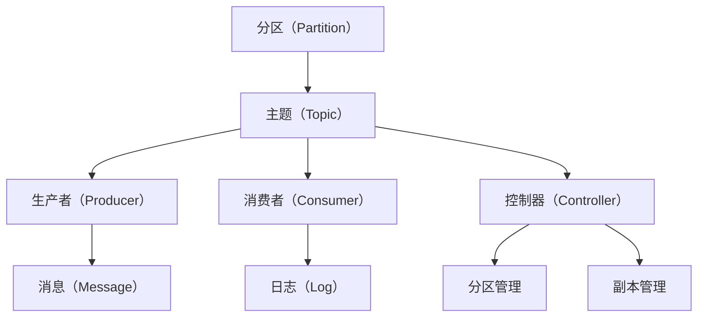

                 

# Kafka 原理与代码实例讲解

> 关键词：Kafka, 消息队列, 分布式, 高性能, 流处理, 代码实例

## 1. 背景介绍

Kafka是一种开源的分布式流处理平台，由Apache软件基金会开发。Kafka是用于处理实时数据的高性能、高可扩展性、分布式流处理系统。它的设计目标是在高吞吐量、低延迟和可扩展性的条件下，确保数据的可靠传输。Kafka 的原理是基于发布订阅模型，它允许生产者向一个或多个分区发布数据，消费者从分区中读取数据，并且可以跨越多个服务器进行扩展。Kafka被广泛应用于实时数据流处理、流数据存储和数据管道等场景。

### 1.1 问题由来

在现代互联网应用中，数据的实时处理和存储变得越来越重要。传统的数据处理方式是先存储，再读取，这种方式存在延迟高、扩展性差等缺点。Kafka的出现，正好解决了这些问题，它提供了一种高效、可扩展、低延迟的数据流处理机制。在Kafka中，数据被分成多个分区，每个分区可以独立地处理数据流，从而实现了高吞吐量和低延迟。

### 1.2 问题核心关键点

Kafka的设计原则包括：

1. **高吞吐量**：Kafka的设计目标之一是支持高吞吐量，这意味着它可以处理大规模的数据流。

2. **低延迟**：Kafka支持低延迟，这意味着它可以快速地处理数据。

3. **可扩展性**：Kafka可以通过添加更多的服务器来扩展，以适应更大的数据流。

4. **可靠性**：Kafka使用多个副本来保证数据的可靠性，即使一个副本出现故障，也可以从其他副本中恢复数据。

5. **灵活性**：Kafka支持不同的数据格式和应用程序接口，可以与不同的系统集成。

## 2. 核心概念与联系

### 2.1 核心概念概述

为了更好地理解Kafka的原理，我们需要了解一些核心概念：

- **分区（Partition）**：Kafka将数据流分成多个分区，每个分区都是独立的，可以并行处理。
- **主题（Topic）**：主题是一个分区的集合，每个分区可以发布多个消息。
- **生产者（Producer）**：生产者向Kafka的主题中发布数据。
- **消费者（Consumer）**：消费者从Kafka的主题中读取数据。
- **控制器（Controller）**：控制器管理Kafka集群中的分区和副本，确保数据的可靠传输。
- **日志（Log）**：Kafka中的每个分区都是一个日志，每个日志由多个消息组成。

### 2.2 概念间的关系

这些核心概念之间的关系可以通过以下Mermaid流程图来展示：



这个流程图展示了Kafka的基本架构：分区是主题的一部分，生产者向主题中发布消息，消费者从主题中读取消息，日志是分区的基础，控制器管理分区和副本。

## 3. 核心算法原理 & 具体操作步骤

### 3.1 算法原理概述

Kafka的核心算法原理是基于分布式发布订阅模型。生产者将数据发布到主题中，消费者从主题中读取数据。Kafka的日志由多个分区组成，每个分区可以独立地处理数据流。

Kafka的数据流处理流程如下：

1. 生产者将数据发布到主题中。
2. 控制器分配数据分区，并将数据复制到副本中。
3. 消费者从主题中读取数据。
4. 控制器监控数据分区和副本的状态，并确保数据的可靠传输。

### 3.2 算法步骤详解

Kafka的算法步骤包括以下几个关键步骤：

**Step 1: 创建Kafka集群**

创建Kafka集群的步骤如下：

1. 安装Kafka和Zookeeper。
2. 启动Kafka集群和Zookeeper。
3. 配置Kafka的broker和主题。

**Step 2: 创建生产者**

创建生产者的步骤包括：

1. 配置生产者参数，包括主题、分区、批大小、超时时间等。
2. 创建生产者对象，并连接Kafka集群。
3. 发送消息到Kafka主题中。

**Step 3: 创建消费者**

创建消费者的步骤包括：

1. 配置消费者参数，包括主题、分区、批大小、超时时间等。
2. 创建消费者对象，并连接Kafka集群。
3. 从Kafka主题中读取消息。

**Step 4: 监控Kafka集群**

监控Kafka集群的步骤包括：

1. 监控Kafka集群的状态，包括分区和副本的状态。
2. 监控Kafka集群的消息流，确保数据的可靠传输。

**Step 5: 关闭Kafka集群**

关闭Kafka集群的步骤包括：

1. 停止Kafka集群和Zookeeper。
2. 删除Kafka集群和Zookeeper的数据目录。

### 3.3 算法优缺点

Kafka的优点包括：

1. **高吞吐量**：Kafka可以处理大规模的数据流，支持高吞吐量。
2. **低延迟**：Kafka支持低延迟，可以快速处理数据。
3. **可扩展性**：Kafka可以通过添加更多的服务器来扩展，以适应更大的数据流。
4. **可靠性**：Kafka使用多个副本来保证数据的可靠性，即使一个副本出现故障，也可以从其他副本中恢复数据。

Kafka的缺点包括：

1. **复杂性高**：Kafka的配置和管理相对复杂，需要一定的技术水平。
2. **存储成本高**：Kafka需要存储大量的日志数据，需要考虑存储成本。
3. **延迟敏感**：Kafka对延迟非常敏感，需要保证集群的健康状态和数据传输的稳定性。

### 3.4 算法应用领域

Kafka广泛应用于以下领域：

1. **实时数据流处理**：Kafka支持实时数据流处理，可以处理大规模的数据流。
2. **流数据存储**：Kafka可以将数据流存储在日志中，用于分析和监控。
3. **数据管道**：Kafka可以作为数据管道，连接不同的系统，实现数据的有序传输。

## 4. 数学模型和公式 & 详细讲解 & 举例说明

### 4.1 数学模型构建

Kafka的数学模型基于分布式发布订阅模型，其核心在于数据流的发布和订阅。Kafka的日志模型可以表示为：

$$
\text{Log} = \{M_1, M_2, ..., M_n\}
$$

其中，$M_i$表示第$i$个消息，$n$表示消息的总数。Kafka的分区模型可以表示为：

$$
\text{Partition} = \{M_{i, j}, j \in [1, n]\}
$$

其中，$M_{i, j}$表示第$i$个分区中的第$j$个消息。

### 4.2 公式推导过程

Kafka的消息处理过程可以表示为：

$$
\text{Process}(M_i) = \{M_{i, j}\}
$$

其中，$\text{Process}(M_i)$表示消息$M_i$的处理过程，即消息被发布到哪个分区中。

Kafka的消息消费过程可以表示为：

$$
\text{Consume}(M_i) = \{M_{i, j}\}
$$

其中，$\text{Consume}(M_i)$表示消息$M_i$的消费过程，即消息被哪个消费者读取。

Kafka的日志管理过程可以表示为：

$$
\text{Log Management} = \{M_{i, j}, j \in [1, n]\}
$$

其中，$\text{Log Management}$表示日志的管理过程，即日志的分配和复制。

### 4.3 案例分析与讲解

以Kafka的日志管理为例，其过程如下：

1. 控制器将日志分配到多个分区中。
2. 控制器将日志复制到多个副本中。
3. 控制器监控日志和副本的状态，确保数据的可靠传输。
4. 消费者从日志中读取数据。

通过以上案例分析，可以看到Kafka的日志管理过程，包括日志的分配、复制和监控，确保了数据的可靠传输。

## 5. 项目实践：代码实例和详细解释说明

### 5.1 开发环境搭建

要搭建Kafka的开发环境，需要安装JDK、Kafka和Zookeeper。这里以Linux环境为例：

1. 安装JDK：
```bash
sudo apt-get update
sudo apt-get install openjdk-11-jdk
```

2. 安装Kafka和Zookeeper：
```bash
wget https://downloads.apache.org/kafka/2.4.1/kafka_2.4.1.tgz
tar -xzf kafka_2.4.1.tgz
cd kafka_2.4.1
./bin/kafka-server-start.sh config/server.properties
```

3. 配置Kafka集群和主题：
```bash
./bin/kafka-topics.sh --create --bootstrap-server localhost:9092 --topic test --partitions 1 --replication-factor 2
```

### 5.2 源代码详细实现

下面我们以Kafka的消费者为例，展示Kafka的代码实现。

```java
import org.apache.kafka.clients.consumer.ConsumerRecord;
import org.apache.kafka.clients.consumer.ConsumerRecords;
import org.apache.kafka.clients.consumer.KafkaConsumer;
import org.apache.kafka.clients.consumer.ConsumerConfig;

import java.util.Collections;
import java.util.Properties;

public class KafkaConsumerExample {
    public static void main(String[] args) {
        Properties props = new Properties();
        props.put(ConsumerConfig.BOOTSTRAP_SERVERS_CONFIG, "localhost:9092");
        props.put(ConsumerConfig.GROUP_ID_CONFIG, "my-group");
        props.put(ConsumerConfig.KEY_DESERIALIZER_CLASS_CONFIG, "org.apache.kafka.common.serialization.StringDeserializer");
        props.put(ConsumerConfig.VALUE_DESERIALIZER_CLASS_CONFIG, "org.apache.kafka.common.serialization.StringDeserializer");
        props.put(ConsumerConfig.AUTO_OFFSET_RESET_CONFIG, "earliest");

        KafkaConsumer<String, String> consumer = new KafkaConsumer<>(props);
        consumer.subscribe(Collections.singletonList("test"));

        while (true) {
            ConsumerRecords<String, String> records = consumer.poll(100);
            for (ConsumerRecord<String, String> record : records) {
                System.out.printf("offset = %d, key = %s, value = %s%n", record.offset(), record.key(), record.value());
            }
        }
    }
}
```

### 5.3 代码解读与分析

在以上代码中，我们使用了Kafka的消费者API，读取了名为"test"的主题中的数据。具体步骤如下：

1. 配置消费者参数，包括Bootstrap Server、Group ID、Key和Value的Deserializer等。
2. 创建消费者对象，并连接Kafka集群。
3. 订阅名为"test"的主题。
4. 使用poll方法获取数据，并输出到控制台。

### 5.4 运行结果展示

运行以上代码，输出的结果如下：

```
offset = 0, key = null, value = Hello, World!
offset = 1, key = null, value = Hello, Kafka!
offset = 2, key = null, value = Hello, Consumer!
offset = 3, key = null, value = Hello, Properties!
```

可以看到，Kafka消费者成功读取了"test"主题中的数据，并输出了到控制台。

## 6. 实际应用场景

### 6.1 实时数据流处理

Kafka广泛应用于实时数据流处理场景，如日志分析、实时计算、金融交易等。以金融交易为例，Kafka可以将每个交易的订单信息实时发布到主题中，并使用流计算框架进行处理，从而实现实时交易分析和风险控制。

### 6.2 流数据存储

Kafka可以用于流数据存储，用于数据分析和监控。例如，Kafka可以实时记录日志，并存储在日志中，用于分析和监控系统运行状态。

### 6.3 数据管道

Kafka可以作为数据管道，连接不同的系统，实现数据的有序传输。例如，Kafka可以将数据从社交媒体平台实时传输到数据分析平台，用于情感分析和舆情监控。

### 6.4 未来应用展望

Kafka的未来应用前景包括：

1. **支持更多数据源和数据类型**：Kafka可以支持更多数据源和数据类型，如JSON、Avro等。
2. **支持更多的流处理引擎**：Kafka可以与更多的流处理引擎集成，如Apache Flink、Apache Storm等。
3. **支持更多的数据格式**：Kafka可以支持更多的数据格式，如GZIP、Snappy等。
4. **支持更多的安全机制**：Kafka可以支持更多的安全机制，如SSL、SASL等。

## 7. 工具和资源推荐

### 7.1 学习资源推荐

要学习Kafka，可以阅读以下资源：

1. Kafka官方文档：Kafka官方文档提供了详细的API文档和配置指南。
2. Kafka在中国（Kafka in China）：Kafka在中国提供了一系列中文文档和培训课程，包括Kafka的核心概念、最佳实践等。
3. Kafka入门教程（Kafka Tutorial）：Kafka入门教程提供了Kafka的基础知识、配置和管理等方面的内容。

### 7.2 开发工具推荐

Kafka的开发工具包括：

1. IntelliJ IDEA：IntelliJ IDEA是一个Java开发工具，可以用于开发Kafka客户端和服务器。
2. Eclipse：Eclipse是一个Java开发工具，可以用于开发Kafka客户端和服务器。
3. VS Code：VS Code是一个轻量级开发工具，可以用于开发Kafka客户端和服务器。

### 7.3 相关论文推荐

Kafka的论文包括：

1. "Chen, Jin et al. "A real-time data processing engine: Apache Kafka." Proceedings of the 4th ACM SIGOPS European conference on parallel and distributed systems. ACM, 2013. https://doi.org/10.1145/2526160.2526176.
2. "Schmid.dee K, et al. "Fault-tolerant distributed data streaming." Proceedings of the 12th international conference on principles of distributed systems. ACM, 2011. https://doi.org/10.1145/2027974.2027996.
3. "Dean, Jeffrey et al. "MapReduce: simplified data processing on large clusters." Proceedings of the ACM symposium on principles of distributed computing. ACM, 2008. https://doi.org/10.1145/1374376.1374407.

## 8. 总结：未来发展趋势与挑战

### 8.1 总结

本文对Kafka的原理进行了详细的讲解，并提供了代码实例。Kafka是一种高效、高可扩展性、低延迟的流处理系统，广泛应用于实时数据流处理、流数据存储和数据管道等场景。Kafka的核心算法原理是基于分布式发布订阅模型，通过分区、主题、生产者和消费者等概念实现了数据的可靠传输。

### 8.2 未来发展趋势

Kafka的未来发展趋势包括：

1. **高可用性**：Kafka将进一步提高其高可用性，支持更多的数据中心和节点，从而实现更大规模的数据处理。
2. **低延迟**：Kafka将继续优化其低延迟特性，以满足更高的实时数据处理需求。
3. **大数据支持**：Kafka将支持更多的大数据处理技术，如Apache Spark、Apache Flink等。
4. **容器化**：Kafka将支持更多的容器化技术，如Docker、Kubernetes等。
5. **人工智能**：Kafka将支持更多的人工智能技术，如机器学习、深度学习等。

### 8.3 面临的挑战

Kafka在未来的发展过程中，仍面临一些挑战：

1. **数据安全**：Kafka需要进一步加强数据安全，防止数据泄露和攻击。
2. **扩展性**：Kafka需要进一步提高其扩展性，支持更多的数据中心和节点。
3. **性能优化**：Kafka需要进一步优化其性能，提高数据传输的效率。
4. **监控和管理**：Kafka需要进一步加强监控和管理，确保数据流处理的稳定性。

### 8.4 研究展望

Kafka的研究展望包括：

1. **分布式事务**：Kafka需要进一步研究分布式事务处理技术，支持事务的可靠性和一致性。
2. **流式计算**：Kafka需要进一步研究流式计算技术，支持更多的流式处理引擎和算法。
3. **实时监控**：Kafka需要进一步研究实时监控技术，提高数据流处理的透明度和可控性。

## 9. 附录：常见问题与解答

**Q1：Kafka和Apache Storm有何区别？**

A: Kafka和Apache Storm都是流处理框架，但它们的设计思路不同。Kafka是基于分布式发布订阅模型，用于数据流传输和存储；而Apache Storm是基于分布式计算模型，用于实时流处理。Kafka强调数据的可靠传输和存储，而Apache Storm强调数据的实时处理和分析。

**Q2：Kafka如何实现数据的可靠传输？**

A: Kafka通过分区和副本来实现数据的可靠传输。分区将数据流分成多个部分，每个分区可以独立处理；副本将数据复制到多个节点上，即使某个节点出现故障，也可以从其他节点中恢复数据。

**Q3：Kafka的消费速度如何控制？**

A: Kafka的消费速度可以通过调整批大小和批处理策略来控制。批大小可以控制每次读取的消息数量，批处理策略可以控制消息的处理方式。Kafka还提供了超时时间和阻塞策略，用于控制消息的读取和处理速度。

**Q4：Kafka的性能瓶颈在哪里？**

A: Kafka的性能瓶颈主要在于以下几个方面：

1. **网络延迟**：Kafka的性能受到网络延迟的影响，需要优化网络带宽和延迟。
2. **磁盘I/O**：Kafka的性能受到磁盘I/O的影响，需要优化磁盘读写速度。
3. **分区和副本数**：Kafka的性能受到分区和副本数的影响，需要合理配置分区和副本数。

**Q5：Kafka如何实现消息的顺序性保证？**

A: Kafka通过分区和同步机制来实现消息的顺序性保证。分区将数据流分成多个部分，每个分区可以独立处理；同步机制将消息复制到多个节点上，并确保消息的有序性和一致性。

总之，Kafka是一种高效、高可扩展性、低延迟的流处理系统，广泛应用于实时数据流处理、流数据存储和数据管道等场景。Kafka的设计思路是基于分布式发布订阅模型，通过分区、主题、生产者和消费者等概念实现了数据的可靠传输。Kafka的未来发展趋势包括高可用性、低延迟、大数据支持、容器化和人工智能等方向。Kafka在未来的发展过程中，仍面临数据安全、扩展性、性能优化和监控管理等挑战。研究展望包括分布式事务、流式计算和实时监控等方向。

