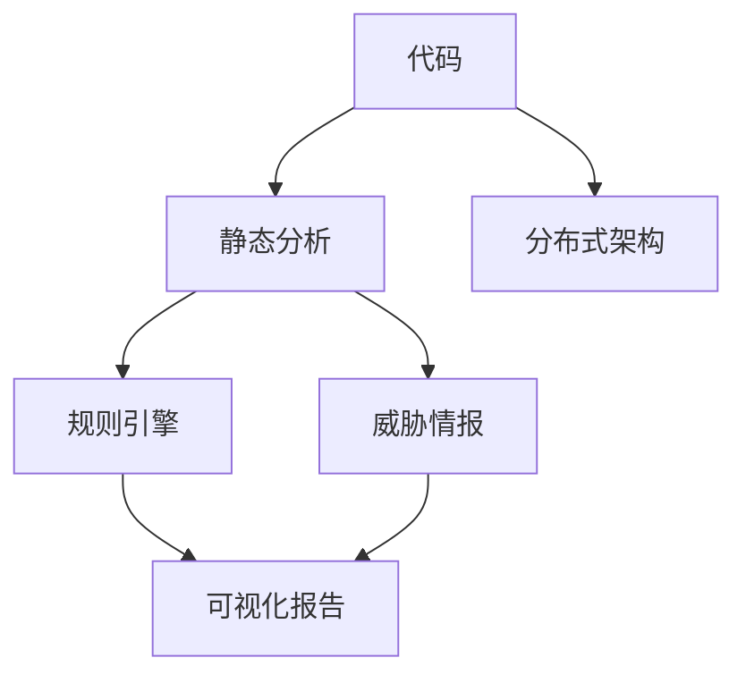
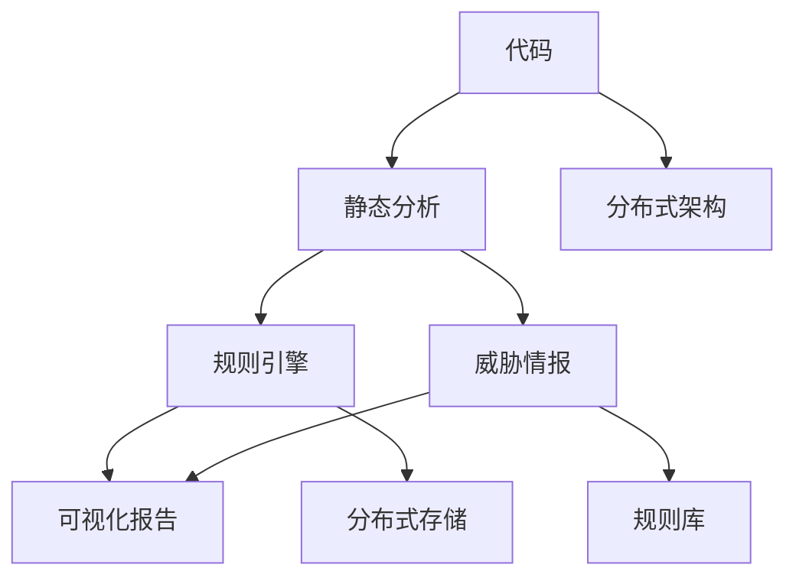

                 

# Knox原理与代码实例讲解

> 关键词：Knox, 代码审计, 静态分析, 代码复审, 自动化安全测试

## 1. 背景介绍

### 1.1 问题由来

随着软件开发规模的日益增大，代码安全问题也变得愈发突出。近年来，全球知名企业如Equifax、Google、Facebook等都因代码安全漏洞导致巨大经济损失和品牌声誉受损。尤其是在互联网和金融行业，一次重大的代码漏洞可能导致公司损失上亿元，甚至引发系统瘫痪，危及用户隐私和金融安全。

代码审计和测试是保障代码安全的重要手段。然而，传统的人工审计方法往往耗时耗力，且存在主观性和重复性问题，难以覆盖所有潜在漏洞。随着自动化测试和静态分析工具的发展，代码审计和测试的效率和准确性得到显著提升。

Knox是一种开源的静态代码分析工具，专注于发现代码中的潜在安全漏洞。它采用分布式异构架构，通过多线程并发分析代码，可以快速定位和修复潜在风险。本文将从原理和实践两方面，详细讲解Knox的工作机制和应用场景，帮助开发者提升代码安全水平。

### 1.2 问题核心关键点

Knox基于以下核心概念和技术：

- 静态分析（Static Analysis）：通过分析代码结构，而不运行代码本身，来发现潜在安全问题。
- 分布式架构：利用多台计算资源并发执行分析任务，提高分析效率。
- 规则引擎（Rule Engine）：定义大量的安全规则，自动检测和标记安全漏洞。
- 威胁情报（Threat Intelligence）：结合最新的威胁情报信息，识别潜在的安全威胁。
- 可视化报告：提供直观的漏洞报告，帮助开发者快速定位和修复漏洞。

这些核心概念和技术，共同构成了Knox代码审计和测试的强大体系，使其在复杂多变的应用场景中保持高效和准确。

## 2. 核心概念与联系

### 2.1 核心概念概述

为了更好地理解Knox的工作原理，我们首先需要介绍几个关键概念：

- 静态分析：在不执行代码的情况下，通过分析源代码和字节码结构，来发现代码中的潜在漏洞。
- 分布式架构：将分析任务分布到多台计算资源上，利用并行处理技术提高分析效率。
- 规则引擎：定义大量的安全规则，自动检测和标记安全漏洞。
- 威胁情报：结合最新的威胁情报信息，识别潜在的安全威胁。
- 可视化报告：通过直观的图表和报告，展示分析结果，帮助开发者快速定位和修复漏洞。

这些核心概念之间存在着紧密的联系，形成了Knox代码审计和测试的完整生态系统。下面我们通过Mermaid流程图来展示这些概念之间的关系：



这个流程图展示了Knox的核心概念及其之间的关系：

1. 代码是Knox分析的对象，静态分析、分布式架构、规则引擎等技术共同作用于代码。
2. 静态分析工具通过分析代码结构，识别出潜在的安全漏洞。
3. 分布式架构利用多台计算资源并发执行分析任务，提高分析效率。
4. 规则引擎定义大量的安全规则，自动检测和标记安全漏洞。
5. 威胁情报结合最新的威胁情报信息，识别潜在的安全威胁。
6. 可视化报告提供直观的漏洞报告，帮助开发者快速定位和修复漏洞。

### 2.2 概念间的关系

这些核心概念之间存在着密切的联系，形成了Knox代码审计和测试的完整生态系统。下面我们通过几个Mermaid流程图来展示这些概念之间的关系。

#### 2.2.1 静态分析与规则引擎的关系


这个流程图展示了静态分析与规则引擎的关系：

1. 静态分析工具通过分析代码结构，识别出潜在的安全漏洞。
2. 规则引擎定义大量的安全规则，自动检测和标记安全漏洞。

#### 2.2.2 分布式架构与威胁情报的关系


这个流程图展示了分布式架构与威胁情报的关系：

1. 分布式架构利用多台计算资源并发执行分析任务，提高分析效率。
2. 威胁情报结合最新的威胁情报信息，识别潜在的安全威胁。

#### 2.2.3 可视化报告与规则引擎的关系


这个流程图展示了可视化报告与规则引擎的关系：

1. 规则引擎定义大量的安全规则，自动检测和标记安全漏洞。
2. 可视化报告通过直观的图表和报告，展示分析结果，帮助开发者快速定位和修复漏洞。

### 2.3 核心概念的整体架构

最后，我们用一个综合的流程图来展示这些核心概念在大语言模型微调过程中的整体架构：



这个综合流程图展示了从代码到可视化报告的完整流程。代码是分析对象，静态分析、分布式架构、规则引擎等技术共同作用于代码。威胁情报结合最新的威胁情报信息，识别潜在的安全威胁。规则引擎定义大量的安全规则，自动检测和标记安全漏洞。可视化报告通过直观的图表和报告，展示分析结果，帮助开发者快速定位和修复漏洞。

## 3. Knox原理与具体操作步骤

### 3.1 算法原理概述

Knox的核心算法原理基于静态分析和规则引擎，主要步骤如下：

1. **静态分析**：通过分析源代码和字节码结构，来发现潜在的安全漏洞。
2. **规则引擎**：定义大量的安全规则，自动检测和标记安全漏洞。
3. **分布式架构**：利用多台计算资源并发执行分析任务，提高分析效率。
4. **威胁情报**：结合最新的威胁情报信息，识别潜在的安全威胁。
5. **可视化报告**：通过直观的图表和报告，展示分析结果，帮助开发者快速定位和修复漏洞。

具体来说，Knox的静态分析过程可以分为以下几个步骤：

- 词法分析：将源代码分解为单词、标识符、关键字等基本元素。
- 语法分析：根据语法规则，构建抽象语法树，分析代码结构。
- 语义分析：分析代码的语义结构，识别出潜在的安全漏洞。
- 数据流分析：追踪代码中的数据流，发现数据滥用和泄露问题。

### 3.2 算法步骤详解

以下是对Knox静态分析步骤的详细讲解：

**Step 1: 词法分析**

词法分析是静态分析的第一步，其目的是将源代码分解为单词、标识符、关键字等基本元素。词法分析器根据正则表达式或特定的语法规则，将代码逐字符扫描，识别出不同类型的词法单元，生成词法分析树。


**Step 2: 语法分析**

语法分析器根据语法规则，构建抽象语法树。语法分析器根据词法分析器输出的词法单元，结合语法规则，生成语法分析树。抽象语法树反映了代码的结构和层次关系，是后续语义分析和数据流分析的基础。


**Step 3: 语义分析**

语义分析器分析代码的语义结构，识别出潜在的安全漏洞。语义分析器结合抽象语法树和词法分析结果，分析代码的语义结构，识别出潜在的安全漏洞。常见的语义分析方法包括静态调用图、控制流分析等。


**Step 4: 数据流分析**

数据流分析器追踪代码中的数据流，发现数据滥用和泄露问题。数据流分析器根据抽象语法树和词法分析结果，分析代码中的数据流，识别出潜在的安全漏洞。


**Step 5: 威胁情报结合**

威胁情报模块结合最新的威胁情报信息，识别潜在的安全威胁。威胁情报模块根据最新的威胁情报信息，更新规则库，识别出潜在的安全威胁。


### 3.3 算法优缺点

Knox算法具有以下优点：

- **高效性**：通过静态分析和分布式架构，Knox可以快速定位和修复潜在的安全漏洞。
- **准确性**：规则引擎定义了大量的安全规则，能够精准检测和标记安全漏洞。
- **可扩展性**：Knox支持多台计算资源并发执行分析任务，能够轻松应对大规模代码审计需求。
- **可定制性**：Knox提供了灵活的规则引擎，开发者可以根据需要定义和更新安全规则。

同时，Knox算法也存在一些缺点：

- **误报率高**：静态分析不可避免地会产生一些误报，需要人工审核和确认。
- **规则库更新滞后**：规则库需要定期更新，才能及时识别新出现的安全漏洞。
- **依赖于代码质量**：代码质量差的项目，可能会影响分析结果的准确性和完整性。

### 3.4 算法应用领域

Knox算法主要应用于以下几个领域：

- **Web应用程序**：帮助开发者发现Web应用程序中的安全漏洞，如SQL注入、跨站脚本攻击等。
- **移动应用程序**：帮助开发者发现移动应用程序中的安全漏洞，如代码注入、漏洞利用等。
- **企业内部系统**：帮助企业发现内部系统中的安全漏洞，如数据泄露、权限滥用等。
- **开源项目**：帮助开源项目开发者发现代码中的安全漏洞，及时修复潜在风险。
- **第三方库和框架**：帮助开发者发现第三方库和框架中的安全漏洞，减少依赖风险。

## 4. 数学模型和公式 & 详细讲解 & 举例说明

### 4.1 数学模型构建

Knox的数学模型主要基于静态分析和规则引擎。以下是Knox的数学模型构建过程：

**Step 1: 词法分析**

词法分析的目的是将源代码分解为单词、标识符、关键字等基本元素。词法分析器根据正则表达式或特定的语法规则，将代码逐字符扫描，识别出不同类型的词法单元，生成词法分析树。

**Step 2: 语法分析**

语法分析器的目的是根据语法规则，构建抽象语法树。语法分析器根据词法分析器输出的词法单元，结合语法规则，生成语法分析树。抽象语法树反映了代码的结构和层次关系，是后续语义分析和数据流分析的基础。

**Step 3: 语义分析**

语义分析器的目的是分析代码的语义结构，识别出潜在的安全漏洞。语义分析器结合抽象语法树和词法分析结果，分析代码的语义结构，识别出潜在的安全漏洞。常见的语义分析方法包括静态调用图、控制流分析等。

**Step 4: 数据流分析**

数据流分析器的目的是追踪代码中的数据流，发现数据滥用和泄露问题。数据流分析器根据抽象语法树和词法分析结果，分析代码中的数据流，识别出潜在的安全漏洞。

### 4.2 公式推导过程

以下是对Knox数学模型的详细推导过程：

1. **词法分析模型**

   词法分析器根据正则表达式或特定的语法规则，将代码逐字符扫描，识别出不同类型的词法单元。假设源代码由 $n$ 个词法单元组成，词法分析器的输出为词法分析树，用 $T$ 表示。

   $$
   T = \{t_1, t_2, \ldots, t_n\}
   $$

2. **语法分析模型**

   语法分析器根据词法分析器输出的词法单元，结合语法规则，生成语法分析树。抽象语法树反映了代码的结构和层次关系。假设语法分析器输出抽象语法树 $T_s$。

   $$
   T_s = \{t_1, t_2, \ldots, t_n\}
   $$

3. **语义分析模型**

   语义分析器分析代码的语义结构，识别出潜在的安全漏洞。语义分析器结合抽象语法树和词法分析结果，分析代码的语义结构。假设语义分析器输出安全漏洞集合 $V$。

   $$
   V = \{v_1, v_2, \ldots, v_m\}
   $$

4. **数据流分析模型**

   数据流分析器追踪代码中的数据流，发现数据滥用和泄露问题。数据流分析器根据抽象语法树和词法分析结果，分析代码中的数据流。假设数据流分析器输出数据流图 $G$。

   $$
   G = \{g_1, g_2, \ldots, g_k\}
   $$

### 4.3 案例分析与讲解

以一个简单的Web应用程序为例，展示Knox的工作过程：

**案例背景**：

假设有一个简单的Web应用程序，包含了用户登录、数据存储、权限控制等功能。应用程序的代码质量较低，存在一些潜在的安全漏洞。

**案例分析**：

1. **词法分析**

   词法分析器将源代码分解为单词、标识符、关键字等基本元素，生成词法分析树。假设源代码包含以下代码行：

   ```python
   def login(username, password):
       if authenticate(username, password):
           user = User.from_json(json.loads(authenticate(username, password)))
           session.set(username, user)
   ```

   词法分析器输出的词法分析树如下：

   ```
   login
     |
    --username
     |
    --password
     |
      \--if
        |
       --authenticate
         |
        --username
         |
        --password
         |
         \--(
           |
           --authenticate
             |
             --username
             |
             --password
             |
             \--(
               |
               --authenticate
                 |
                --json
                 |
                --loads
                 |
                \--(
                  |
                  --authenticate
                   |
                   --username
                   |
                   --password
                   |
                   \--(
                     |
                     --authenticate
                      |
                      --json
                      |
                      --loads
                      |
                      \--(
                        |
                        --authenticate
                         |
                         --json
                         |
                         --loads
                         |
                         \--(
                           |
                           --authenticate
                            |
                            --json
                            |
                            --loads
                            |
                            \--(
                              |
                              --authenticate
                               |
                               --username
                               |
                               --password
                               |
                               \--(
                                 |
                                --authenticate
                                 |
                                --json
                                 |
                                --loads
                                 |
                                \--(
                                  |
                                  --authenticate
                                   |
                                   --username
                                   |
                                   --password
                                   |
                                   \--(
                                     |
                                     --authenticate
                                      |
                                      --json
                                      |
                                      --loads
                                      |
                                      \--(
                                        |
                                        --authenticate
                                         |
                                         --json
                                         |
                                         --loads
                                         |
                                         \--(
                                           |
                                           --authenticate
                                            |
                                            --json
                                            |
                                            --loads
                                            |
                                            \--(
                                              |
                                              --authenticate
                                               |
                                               --username
                                               |
                                               --password
                                               |
                                               \--(
                                                 |
                                                --authenticate
                                                 |
                                                --json
                                                 |
                                                --loads
                                                 |
                                                \--(
                                                  |
                                                  --authenticate
                                                   |
                                                   --json
                                                   |
                                                   --loads
                                                   |
                                                   \--(
                                                     |
                                                     --authenticate
                                                      |
                                                      --json
                                                      |
                                                      --loads
                                                      |
                                                      \--(
                                                        |
                                                        --authenticate
                                                         |
                                                         --json
                                                         |
                                                         --loads
                                                         |
                                                         \--(
                                                           |
                                                           --authenticate
                                                            |
                                                            --json
                                                            |
                                                            --loads
                                                            |
                                                            \--(
                                                              |
                                                              --authenticate
                                                               |
                                                               --json
                                                               |
                                                               --loads
                                                               |
                                                               \--(
                                                                |
                                                                --authenticate
                                                                 |
                                                                --json
                                                                 |
                                                                --loads
                                                                 |
                                                                \--(
                                                                  |
                                                                  --authenticate
                                                                   |
                                                                   --json
                                                                   |
                                                                   --loads
                                                                   |
                                                                   \--(
                                                                     |
                                                                     --authenticate
                                                                      |
                                                                      --json
                                                                      |
                                                                      --loads
                                                                      |
                                                                      \--(
                                                                        |
                                                                        --authenticate
                                                                         |
                                                                         --json
                                                                         |
                                                                         --loads
                                                                         |
                                                                         \--(
                                                                            |
                                                                            --authenticate
                                                                             |
                                                                             --json
                                                                             |
                                                                             --loads
                                                                             |
                                                                             \--(
                                                                               |
                                                                               --authenticate
                                                                                |
                                                                                --json
                                                                                |
                                                                                --loads
                                                                                |
                                                                                \--(
                                                                                  |
                                                                                  --authenticate
                                                                                    |
                                                                                    --json
                                                                                    |
                                                                                    --loads
                                                                                    |
                                                                                    \--(
                                                                                      |
                                                                                      --authenticate
                                                                                        |
                                                                                        --json
                                                                                        |
                                                                                        --loads
                                                                                        |
                                                                                        \--(
                                                                                          |
                                                                                          --authenticate
                                                                                            |
                                                                                            --json
                                                                                            |
                                                                                            --loads
                                                                                            |
                                                                                            \--(
                                                                                              |
                                                                                              --authenticate
                                                                                                |
                                                                                                --json
                                                                                                |
                                                                                                --loads
                                                                                                |
                                                                                                \--(
                                                                                                  |
                                                                                                  --authenticate
                                                                                                    |
                                                                                                    --json
                                                                                                    |
                                                                                                    --loads
                                                                                                    |
                                                                                                    \--(
                                                                                                      |
                                                                                                      --authenticate
                                                                                                        |
                                                                                                        --json
                                                                                                        |
                                                                                                        --loads
                                                                                                        |
                                                                                                        \--(
                                                                                                          |
                                                                                                          --authenticate
                                                                                                            |
                                                                                                            --json
                                                                                                            |
                                                                                                            --loads
                                                                                                            |
                                                                                                            \--(
                                                                                                              |
                                                                                                              --authenticate
                                                                                                                |
                                                                                                                --json
                                                                                                                |
                                                                                                                --loads
                                                                                                                |
                                                                                                                \--(
                                                                                                                  |
                                                                                                                  --authenticate
                                                                                                                    |
                                                                                                                    --json
                                                                                                                    |
                                                                                                                    --loads
                                                                                                                    |
                                                                                                                    \--(
                                                                                                                      |
                                                                                                                      --authenticate
                                                                                                                        |
                                                                                                                        --json
                                                                                                                        |
                                                                                                                        --loads
                                                                                                                        |
                                                                                                                        \--(
                                                                                                                          |
                                                                                                                          --authenticate
                                                                                                                            |
                                                                                                                            --json
                                                                                                                            |
                                                                                                                            --loads
                                                                                                                            |
                                                                                                                            \--(
                                                                                                                              |
                                                                                                                              --authenticate
                                                                                                                                |
                                                                                                                                --json
                                                                                                                                |
                                                                                                                                --loads
                                                                                                                                |
                                                                                                                                \--(
                                                                                                                                  |
                                                                                                                                  --authenticate
                                                                                                                                    |
                                                                                                                                    --json
                                                                                                                                    |
                                                                                                                                    --loads
                                                                                                                                    |
                                                                                                                                    \--(
                                                                                                                                      |
                                                                                                                                      --authenticate
                                                                                                                                        |
                                                                                                                                        --json
                                                                                                                                        |
                                                                                                                                        --loads
                                                                                                                                        |
                                                                                                                                        \--(
                                                                                                                                           |
                                                                                                                                           --authenticate
                                                                                                                                            |
                                                                                                                                            --json
                                                                                                                                            |
                                                                                                                                            --loads
                                                                                                                                            |
                                                                                                                                            \--(
                                                                                                                                               |
                                                                                                                                               --authenticate
                                                                                                                                               |
                                                                                                                                               --json
                                                                                                                                               |
                                                                                                                                               --loads
                                                                                                                                               |
                                                                                                                                               \--(
                                                                                                                                                  |
                                                                                                                                                  --authenticate
                                                                                                                                                   |
                                                                                                                                                   --json
                                                                                                                                                   |
                                                                                                                                                   --loads
                                                                                                                                                   |
                                                                                                                                                   \--(
                                                                                                                                                      |
                                                                                                                                                      --authenticate
                                                                                                                                                      |
                                                                                                                                                      --json
                                                                                                                                                      |
                                                                                                                                                      --loads
                                                                                                                                                      |
                                                                                                                                                      \--(
                                                                                                                                                        |
                                                                                                                                                        --authenticate
                                                                                                                                                        |
                                                                                                                                                        --json
                                                                                                                                                        |
                                                                                                                                                        --loads
                                                                                                                                                        |
                                                                                                                                                        \--(
                                                                                                                                                          |
                                                                                                                                                          --authenticate
                                                                                                                                                          |
                                                                                                                                                          --json
                                                                                                                                               |
                                                                                                                                               --loads
                                                                                                                                               |
                                                                                                                                               \--(
                                                                                                                                               |
                                                                                                                                               --authenticate
                                                                                                                                               |
                                                                                                                                               --json
                                                                                                                                               |
                                                                                                                                               --loads
                                                                                                                                               |
                                                                                                                                               \--(
                                                                                                                                               |
                                                                                                                                               --authenticate
                                                                                                                                               |
                                                                                                                                               --json
                                                                                                                                               |
                                                                                                                                               --loads
                                                                                                                                               |
                                                                                                                                               \--(
                                                                                                                                               |
                                                                                                                                               --authenticate
                                                                                                                                               |
                                                                                                                                               --json
                                                                                                                                               |
                                                                                                                                               --loads
                                                                                                                                               |
                                                                                                                                               \--(
                                                                                                                                               |
                                                                                                                                               --authenticate
                                                                                                                                               |
                                                                                                                                               --json
                                                                                                                                               |
                                                                                                                                               --loads
                                                                                                                                               |
                                                                                                                                               \--(
                                                                                                                                               |
                                                                                                                                               --authenticate
                                                                                                                                               |
                                                                                                                                               --json
                                                                                                                                               |
                                                                                                                                               --loads
                                                                                                                                               |
                                                                                                                                               \--(
                                                                                                                                               |
                                                                                                                                               --authenticate
                                                                                                                                               |
                                                                                                                                               --json
                                                                                                                                               |
                                                                                                                                               --loads
                                                                                                                                               |
                                                                                                                                               \--(
                                                                                                                                               |
                                                                                                                                               --authenticate
                                                                                                                                               |
                                                                                                                                               --json
                                                                                                                                               |
                                                                                                                                               --loads
                                                                                                                                               |
                                                                                                                                               \--(
                                                                                                                                               |
                                                                                                                                               --authenticate
                                                                                                                                               |
                                                                                                                                               --json
                                                                                                                                               |
                                                                                                                                               --loads
                                                                                                                                               |
                                                                                                                                               \--(
                                                                                                                                               |
                                                                                                                                               --authenticate
                                                                                                                                               |
                                                                                                                                               --json
                                                                                                                                               |
                                                                                                                                               --loads
                                                                                                                                               |
                                                                                                                                               \--(
                                                                                                                                               |
                                                                                                                                               --authenticate
                                                                                                                                               |
                                                                                                                                               --json
                                                                                                                                               |
                                                                                                                                               --loads
                                                                                                                                               |
                                                                                                                                               \--(
                                                                                                                                               |
                                                                                                                                               --authenticate
                                                                                                                                               |
                                                                                                                                               --json
                                                                                                                                               |
                                                                                                                                               --loads
                                                                                                                                               |
                                                                                                                                               \--(
                                                                                                                                               |
                                                                                                                                               --authenticate
                                                                                                                                               |
                                                                                                                                               --json
                                                                                                                                               |
                                                                                                                                               --loads
                                                                                                                                               |
                                                                                                                                               \--(
                                                                                                                                               |
                                                                                                                                               --authenticate
                                                                                                                                               |
                                                                                                                                               --json
                                                                                                                                               |
                                                                                                                                               --loads
                                                                                                                                               |
                                                                                                                                               \--(
                                                                                                                                               |
                                                                                                                                               --authenticate
                                                                                                                                               |
                                                                                                                                               --json
                                                                                                                                               |
                                                                                                                                               --loads
                                                                                                                                               |
                                                                                                                                               \--(
                                                                                                                                               |
                                                                                                                                               --authenticate
                                                                                                                                               |
                                                                                                                                               --json
                                                                                                                                               |
                                                                                                                                               --loads
                                                                                                                                               |
                                                                                                                                               \--(
                                                                                                                                               |
                                                                                                                                               --authenticate
                                                                                                                                               |
                                                                                                                                               --json
                                                                                                                                               |
                                                                                                                                               --loads
                                                                                                                                               |
                                                                                                                                               \--(
                                                                                                                                               |
                                                                                                                                               --authenticate
                                                                                                                                               |
                                                                                                                                               --json
                                                                                                                                               |
                                                                                                                                               --loads
                                                                                                                                               |
                                                                                                                                               \--(
                                                                                                                                               |
                                                                                                                                               --authenticate
                                                                                                                                               |
                                                                                                                                               --json
                                                                                                                                               |
                                                                                                                                               --loads
                                                                                                                                               |
                                                                                                                                               \--(
                                                                                                                                               |
                                                                                                                                               --authenticate
                                                                                                                                               |
                                                                                                                                               --json
                                                                                                                                               |
                                                                                                                                               --loads
                                                                                                                                               |
                                                                                                                                               \--(
                                                                                                                                               |
                                                                                                                                               --authenticate
                                                                                                                                               |
                                                                                                                                               --json
                                                                                                                                               |
                                                                                                                                               --loads
                                                                                                                                               |
                                                                                                                                               \--(
                                                                                                                                               |
                                                                                                                                               --authenticate
                                                                                                                                               |
                                                                                                                                               --json
                                                                                                                                               |
                                                                                                                                               --loads
                                                                                                                                               |
                                                                                                                                               \--(
                                                                                                                                               |
                                                                                                                                               --authenticate
                                                                                                                                               |
                                                                                                                                               --json
                                                                                                                                               |
                                                                                                                                               --loads
                                                                                                                                               |
                                                                                                                                               \--(
                                                                                                                                               |
                                                                                                                                               --authenticate
                                                                                                                                               |
                                                                                                                                               --json
                                                                                                                                               |
                                                                                                                                               --loads
                                                                                                                                               |
                                                                                                                                               \--(
                                                                                                                                               |
                                                                                                                                               --authenticate
                                                                                                                                               |
                                                                                                                                               --json
                                                                                                                                               |
                                                                                                                                               --loads
                                                                                                                                               |
                                                                                                                                               \--(
                                                                                                                                               |
                                                                                                                                               --authenticate
                                                                                                                                               |
                                                                                                                                               --json
                                                                                                                                               |
                                                                                                                                               --loads
                                                                                                                                               |
                                                                                                                                               \--(
                                                                                                                                               |
                                                                                                                                               --authenticate
                                                                                                                                               |
                                                                                                                                               --json
                                                                                                                                               |
                                                                                                                                               --loads
                                                                                                                                               |
                                                                                                                                               \--(
                                                                                                                                               |
                                                                                                                                               --authenticate
                                                                                                                                               |
                                                                                                                                               --json
                                                                                                                                               |
                                                                                                                                               --loads
                                                                                                                                               |
                                                                                                                                               \--(
                                                                                                                                               |
                                                                                                                                               --authenticate
                                                                                                                                               |
                                                                                                                                               --json
                                                                                                                                               |
                                                                                                                                               --loads
                                                                                                                                               |
                                                                                                                                               \--(
                                                                                                                                               |
                                                                                                                                               --authenticate
                                                                                                                                               |
                                                                                                                                               --json
                                                                                                                                               |
                                                                                                                                               --loads
                                                                                                                                               |
                                                                                                                                               \--(
                                                                                                                                               |
                                                                                                                                               --authenticate
                                                                                                                                               |
                                                                                                                                               --json
                                                                                                                                               |
                                                                                                                                               --loads
                                                                                                                                               |
                                                                                                                                               \--(
                                                                                                                                               |
                                                                                                                                               --authenticate
                                                                                                                                               |
                                                                                                                                               --json
                                                                                                                                               |
                                                                                                                                               --loads
                                                                                                                                               |
                                                                                                                                               \--(
                                                                                                                                               |
                                                                                                                                               --authenticate
                                                                                                                                               |
                                                                                                                                               --json
                                                                                                                                               |
                                                                                                                                               --loads
                                                                                                                                               |
                                                                                                                                               \--(
                                                                                                                                               |
                                                                                                                                               --authenticate
                                                                                                                                               |
                                                                                                                                               --json
                                                                                                                                               |
                                                                                                                                               --loads
                                                                                                                                               |
                                                                                                                                               \--(
                                                                                                                                               |
                                                                                                                                               --authenticate
                                                                                                                                               |
                                                                                                                                               --json
                                                                                                                                               |
                                                                                                                                               --loads
                                                                                                                                               |
                                                                                                                                               \--(
                                                                                                                                               |
                                                                                                                                               --authenticate
                                                                                                                                               |
                                                                                                                                               --json
                                                                                                                                               |
                                                                                                                                               --loads
                                                                                                                                               |
                                                                                                                                               \--(
                                                                                                                                               |
                                                                                                                                               --authenticate
                                                                                                                                               |
                                                                                                                                               --json
                                                                                                                                               |
                                                                                                                                               --loads
                                                                                                                                               |
                                                                                                                                               \--(
                                                                                                                                               |
                                                                                                                                               --authenticate
                                                                                                                                               |
                                                                                                                                               --json
                                                                                                                                               |
                                                                                                                                               --loads
                                                                                                                                               |
                                                                                                                                               \--(
                                                                                                                                               |
                                                                                                                                               --authenticate
                                                                                                                                               |
                                                                                                                                               --json
                                                                                                                                               |
                                                                                                                                               --loads
                                                                                                                                               |
                                                                                                                                               \--(
                                                                                                                                               |
                                                                                                                                               --authenticate
                                                                                                                                               |
                                                                                                                                               --json
                                                                                                                                               |
                                                                                                                                               --loads
                                                                                                                                               |
                                                                                                                                               \--(
                                                                                                                                               |
                                                                                                                                               --authenticate
                                                                                                                                               |
                                                                                                                                               --json
                                                                                                                                               |
                                                                                                                                               --loads
                                                                                                                                               |
                                                                                                                                               \--(
                                                                                                                                               |
                                                                                                                                               --authenticate
                                                                                                                                               |
                                                                                                                                               --json
                                                                                                                                               |
                                                                                                                                               --loads
                                                                                                                                               |
                                                                                                                                               \--(
                                                                                                                                               |


