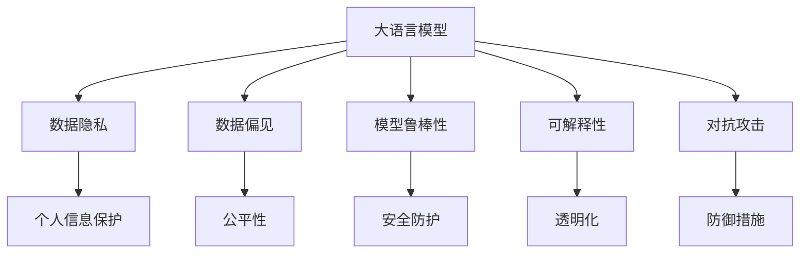
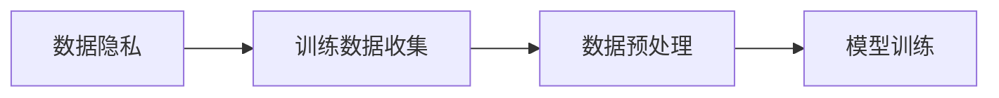
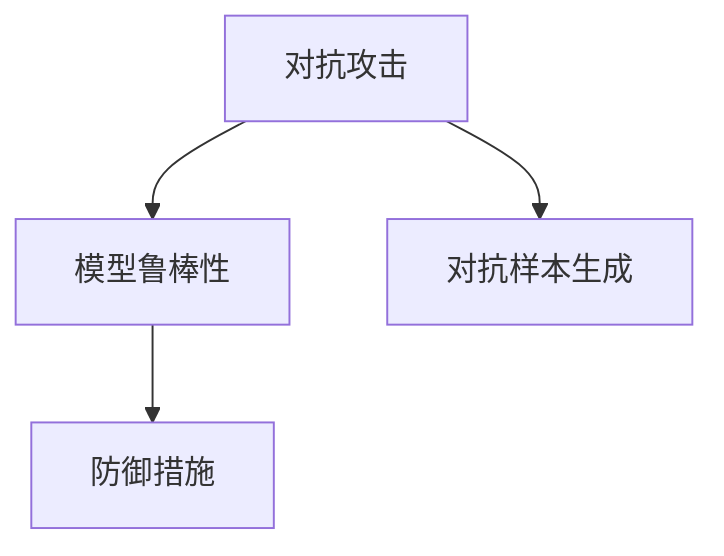
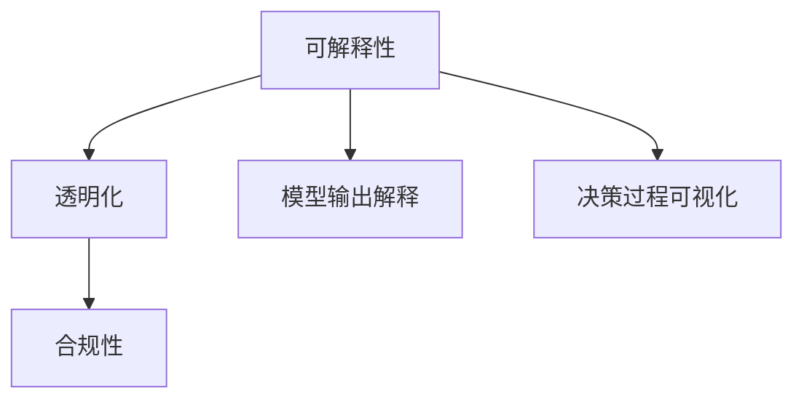
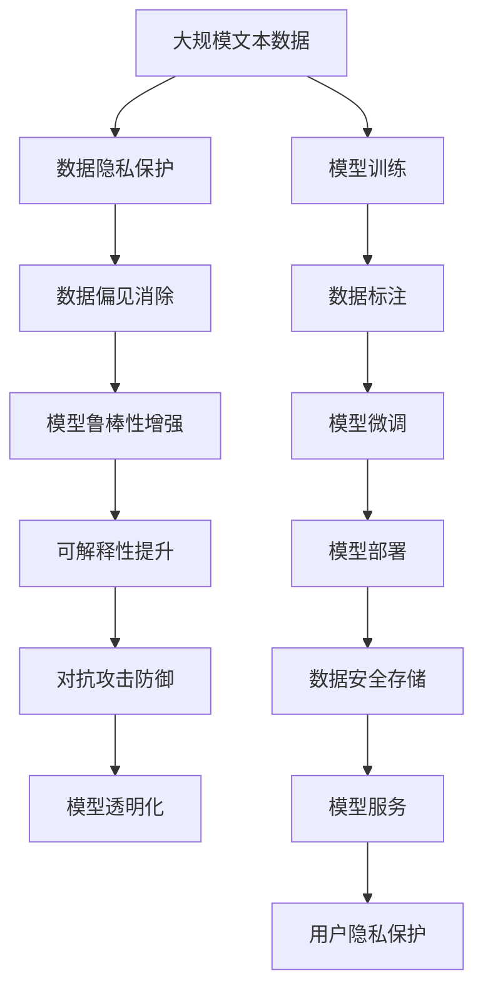

                 

## 1. 背景介绍

### 1.1 问题由来
人工智能（AI）技术的飞速发展，特别是在自然语言处理（NLP）领域，大语言模型（Large Language Models, LLMs）的应用带来了前所未有的便利和效率。例如，OpenAI的GPT-3、Google的BERT等预训练模型在文本生成、问答系统、机器翻译等任务上展现出了惊人的能力，被广泛应用于语音助手、聊天机器人、个性化推荐系统等领域。

然而，随着大语言模型在实际应用中的广泛部署，其隐私和伦理问题也逐渐浮出水面。由于这些模型通常依赖于大规模的文本数据进行预训练，其中包括了大量的个人数据，如社交媒体帖子和电子邮件内容等，因此存在隐私泄露和滥用数据的风险。此外，大语言模型在输出时也具有一定的不确定性和偏见，可能带来伦理和法律上的挑战。

### 1.2 问题核心关键点
大语言模型的隐私和安全问题主要体现在以下几个方面：

1. **数据隐私**：模型训练数据往往包含大量个人隐私信息，可能被未经授权的第三方获取和使用。
2. **数据偏见**：由于训练数据存在偏差，模型可能反映或放大这些偏差，导致对特定群体的不公平对待。
3. **模型鲁棒性**：模型在面对异常输入或对抗样本时，可能产生误判，影响安全性。
4. **解释性和透明度**：大语言模型通常被视为"黑盒"，难以解释其决策过程，增加了伦理和法律责任的风险。
5. **攻击与滥用**：模型可能被恶意利用，如生成虚假信息、操纵公众舆论等，带来严重的社会影响。

### 1.3 问题研究意义
研究大语言模型的隐私和安全问题，对于维护用户隐私权利、确保模型的公平性和透明性、防范恶意攻击和滥用行为具有重要意义：

1. **保护用户隐私**：确保用户数据在处理和存储过程中不被滥用，防止隐私泄露。
2. **提升模型公平性**：消除模型中的数据偏见，促进公平对待不同群体。
3. **保障模型安全**：增强模型的鲁棒性，防止恶意攻击和滥用。
4. **增加模型透明度**：赋予模型可解释性，便于监管和审查。
5. **规范模型行为**：通过伦理和法律手段，约束模型的应用范围和行为规范。

## 2. 核心概念与联系

### 2.1 核心概念概述

为更好地理解大语言模型的隐私和安全问题，本节将介绍几个密切相关的核心概念：

- **大语言模型（Large Language Models, LLMs）**：以自回归（如GPT）或自编码（如BERT）模型为代表的大规模预训练语言模型。通过在大规模无标签文本语料上进行预训练，学习通用的语言表示，具备强大的语言理解和生成能力。
- **数据隐私（Data Privacy）**：指保护个人信息和数据不受未经授权的访问和使用。
- **数据偏见（Data Bias）**：指由于数据分布不均或不公正，导致模型在处理特定群体时表现不公平。
- **模型鲁棒性（Model Robustness）**：指模型在面对异常输入或对抗样本时的稳定性和安全性。
- **可解释性（Explainability）**：指模型输出的可解释性和决策过程的透明性。
- **对抗攻击（Adversarial Attack）**：指攻击者通过恶意输入数据，导致模型输出错误结果的行为。

这些核心概念之间的逻辑关系可以通过以下Mermaid流程图来展示：



这个流程图展示了大语言模型的核心概念及其之间的关系：

1. 大语言模型通过预训练获得基础能力。
2. 数据隐私、数据偏见、模型鲁棒性、可解释性和对抗攻击等概念是影响模型应用的重要因素。
3. 通过提升数据隐私保护、消除数据偏见、增强模型鲁棒性、增加模型可解释性和防御对抗攻击等措施，可以更好地保障大语言模型的应用安全。

### 2.2 概念间的关系

这些核心概念之间存在着紧密的联系，形成了大语言模型的隐私和安全保障框架。下面我通过几个Mermaid流程图来展示这些概念之间的关系。

#### 2.2.1 数据隐私与模型训练



这个流程图展示了数据隐私在大规模预训练中的作用。数据的隐私保护在模型训练的每个环节都至关重要，从数据收集到模型训练，都需要采取相应的隐私保护措施。

#### 2.2.2 对抗攻击与模型鲁棒性



这个流程图展示了对抗攻击对模型鲁棒性的影响及其防御手段。对抗攻击的目标是使模型产生误判，因此模型鲁棒性的提升是防御对抗攻击的关键。

#### 2.2.3 可解释性与透明化



这个流程图展示了可解释性如何通过透明化实现。可解释性是确保模型公平性和透明性的重要手段，通过模型输出解释和决策过程可视化，可以实现合规性和透明化。

### 2.3 核心概念的整体架构

最后，我们用一个综合的流程图来展示这些核心概念在大语言模型隐私和安全保障中的整体架构：



这个综合流程图展示了从数据隐私保护到模型部署的整个隐私和安全保障流程。大语言模型的隐私和安全保障涉及数据收集、处理、存储、训练、微调、部署等多个环节，需要通过一系列技术和制度措施来保障。

## 3. 核心算法原理 & 具体操作步骤
### 3.1 算法原理概述

大语言模型的隐私和安全问题可以通过一系列算法和技术手段来应对。以下是几个关键的算法原理：

**数据隐私保护**：
1. **差分隐私（Differential Privacy）**：通过在模型训练时引入噪声，确保不同个体的数据差异不被泄露。
2. **联邦学习（Federated Learning）**：在多个本地设备上进行模型训练，不将数据集中到单一服务器，确保数据隐私。

**数据偏见消除**：
1. **数据增强（Data Augmentation）**：通过变换、过滤等方式增加数据多样性，减少数据偏见。
2. **公平性约束（Fairness Constraint）**：在模型训练中加入公平性约束，确保模型对不同群体的公平对待。

**模型鲁棒性增强**：
1. **对抗训练（Adversarial Training）**：通过对抗样本训练，增强模型对异常输入的鲁棒性。
2. **鲁棒正则化（Robust Regularization）**：在模型训练中引入正则化技术，防止模型过拟合，增强鲁棒性。

**可解释性提升**：
1. **模型可视化（Model Visualization）**：通过可视化技术，展示模型决策过程，增加可解释性。
2. **交互式解释（Interactive Explanation）**：通过用户交互，提供个性化的解释，增强透明度。

**对抗攻击防御**：
1. **对抗样本检测（Adversarial Sample Detection）**：通过检测对抗样本，防止模型被恶意攻击。
2. **鲁棒模型设计（Robust Model Design）**：通过设计鲁棒性强的模型架构，抵御对抗攻击。

### 3.2 算法步骤详解

以下是基于以上算法原理的具体操作步骤：

**Step 1: 数据收集与隐私保护**
- 收集符合隐私保护要求的数据集，确保数据匿名化和去标识化。
- 采用差分隐私技术，在模型训练时引入噪声，保护数据隐私。
- 采用联邦学习技术，在多个本地设备上训练模型，不集中数据。

**Step 2: 数据预处理与偏见消除**
- 对收集的数据进行清洗和预处理，消除异常数据和噪声。
- 通过数据增强技术，增加数据的多样性和代表性，减少数据偏见。
- 在模型训练中加入公平性约束，确保模型对不同群体的公平对待。

**Step 3: 模型训练与鲁棒性增强**
- 在模型训练中引入对抗样本，增强模型的鲁棒性。
- 通过鲁棒正则化技术，防止模型过拟合，提升模型鲁棒性。
- 通过对抗训练和鲁棒模型设计，增强模型的防御能力，抵御对抗攻击。

**Step 4: 模型微调与可解释性提升**
- 选择合适的微调任务和数据集，对模型进行微调，提高模型性能。
- 通过模型可视化技术和交互式解释，提升模型的可解释性，增加透明度。

**Step 5: 模型部署与隐私保护**
- 在模型部署前，确保模型输出符合隐私保护要求，不泄露个人信息。
- 在模型服务过程中，实施访问控制和数据加密，保护数据隐私。
- 定期更新模型，应对新的威胁和挑战，保持模型鲁棒性和安全性。

### 3.3 算法优缺点

大语言模型的隐私和安全问题解决方案具有以下优点：
1. **增强模型鲁棒性**：通过对抗训练和鲁棒正则化技术，增强模型的鲁棒性，减少攻击风险。
2. **保护数据隐私**：通过差分隐私和联邦学习技术，保护数据隐私，防止数据泄露。
3. **消除数据偏见**：通过数据增强和公平性约束，消除数据偏见，确保模型公平性。
4. **提升模型可解释性**：通过模型可视化和交互式解释，提升模型的可解释性，增加透明度。

同时，这些解决方案也存在一些局限性：
1. **计算资源消耗高**：差分隐私和联邦学习等技术需要消耗大量计算资源，增加了模型训练和部署成本。
2. **技术复杂度高**：这些技术需要较高的技术门槛，推广和实施难度较大。
3. **模型性能下降**：对抗训练和鲁棒正则化等技术可能导致模型性能下降，需要在性能和安全性之间进行权衡。

### 3.4 算法应用领域

大语言模型的隐私和安全问题解决方案已经在多个领域得到了广泛应用，例如：

1. **医疗领域**：在医疗数据隐私保护和模型公平性方面，大语言模型可以用于病历记录、药物研发等任务。
2. **金融领域**：在金融数据隐私保护和模型鲁棒性方面，大语言模型可以用于风险评估、金融舆情监测等任务。
3. **法律领域**：在法律数据隐私保护和模型可解释性方面，大语言模型可以用于合同生成、法律咨询等任务。
4. **教育领域**：在大数据隐私保护和模型公平性方面，大语言模型可以用于个性化推荐、智能辅导等任务。

除了这些领域，大语言模型的隐私和安全问题解决方案也在不断扩展，涵盖了更多应用场景。

## 4. 数学模型和公式 & 详细讲解  
### 4.1 数学模型构建

在大语言模型的隐私和安全问题中，数学模型的构建尤为重要。以下是几个关键的数学模型及其构建方法：

**差分隐私模型**：
1. **拉普拉斯机制（Laplace Mechanism）**：在模型训练时，通过在目标函数中加入拉普拉斯噪声，确保模型参数的隐私性。
2. **高斯机制（Gaussian Mechanism）**：在模型训练时，通过在目标函数中加入高斯噪声，保护模型参数的隐私性。

**公平性约束模型**：
1. **统计公平性（Statistical Fairness）**：通过约束不同群体之间的均值差异，确保模型对不同群体的公平对待。
2. **规则公平性（Rule-based Fairness）**：通过定义一组公平规则，约束模型对特定群体的处理。

**对抗训练模型**：
1. **生成对抗样本（Adversarial Samples）**：通过对抗样本生成技术，生成能够误导模型的输入数据。
2. **对抗训练目标（Adversarial Training Objective）**：在模型训练过程中，同时考虑模型的准确性和鲁棒性。

**鲁棒正则化模型**：
1. **L2正则化（L2 Regularization）**：通过在目标函数中加入L2正则项，防止模型过拟合，增强鲁棒性。
2. **Dropout正则化（Dropout Regularization）**：通过在模型中引入Dropout，减少模型对某些特征的依赖，增强鲁棒性。

**对抗样本检测模型**：
1. **对抗样本检测器（Adversarial Detector）**：通过检测对抗样本的特征，识别出潜在的攻击。
2. **异常检测算法（Anomaly Detection）**：通过检测输入数据的异常，识别出对抗样本。

**鲁棒模型设计**：
1. **鲁棒神经网络架构（Robust Neural Network Architecture）**：通过设计鲁棒性强的模型架构，抵御对抗攻击。
2. **对抗训练优化（Adversarial Training Optimization）**：通过优化对抗训练过程，提高模型的鲁棒性。

### 4.2 公式推导过程

以下是对上述数学模型的详细推导过程：

**拉普拉斯机制**：
1. **目标函数**：
   $$
   L_{\epsilon}(w) = \mathbb{E}_{x \sim D}[f(x,w)] + \frac{1}{\epsilon}\ln(2\pi\epsilon e^{-\frac{\Delta^2}{2\epsilon^2}})
   $$
   其中，$w$为模型参数，$f(x,w)$为目标函数，$D$为数据分布，$\epsilon$为隐私保护参数，$\Delta$为目标函数的变化量。
2. **拉普拉斯噪声**：
   $$
   x' = x + \Delta \cdot \text{Lap}(\frac{1}{\epsilon})
   $$
   其中，$\Delta$为噪声强度，$\text{Lap}(\frac{1}{\epsilon})$为拉普拉斯分布随机变量。

**统计公平性约束**：
1. **公平性约束**：
   $$
   \min_{w} \mathbb{E}_{(x,y) \sim D}[f(x,w)] + \lambda \sum_{i=1}^k \mathbb{E}_{(x,y) \sim D_i}[f(x,w)] - \mathbb{E}_{(x,y) \sim D}[f(x,w)]
   $$
   其中，$w$为模型参数，$f(x,w)$为目标函数，$D$为数据分布，$D_i$为不同群体数据分布，$\lambda$为公平性约束参数。

**对抗样本生成**：
1. **对抗样本生成算法**：
   $$
   x' = x + \alpha \cdot \frac{\nabla_x f(x,w)}{\|\nabla_x f(x,w)\|}
   $$
   其中，$x$为原始样本，$x'$为对抗样本，$\alpha$为攻击强度，$\nabla_x f(x,w)$为模型对$x$的梯度。

**L2正则化**：
1. **目标函数**：
   $$
   L_{\lambda}(w) = \frac{1}{N}\sum_{i=1}^N [f(x_i,w)] + \frac{\lambda}{2}\|w\|^2
   $$
   其中，$w$为模型参数，$f(x_i,w)$为目标函数，$\lambda$为正则化参数。

**Dropout正则化**：
1. **目标函数**：
   $$
   L_{\lambda}(w) = \frac{1}{N}\sum_{i=1}^N [f(x_i,w)] + \lambda \sum_{i=1}^N \mathbb{E}_{\mathbf{p}}[|w_i|^2]
   $$
   其中，$w$为模型参数，$f(x_i,w)$为目标函数，$\lambda$为正则化参数。

**异常检测算法**：
1. **一阶矩异常检测**：
   $$
   \mathcal{L}(x) = \| \mu - x \|
   $$
   其中，$\mu$为数据均值，$x$为异常样本。
2. **二阶矩异常检测**：
   $$
   \mathcal{L}(x) = \sum_{i=1}^n (x_i - \mu)^2
   $$
   其中，$x_i$为数据特征，$\mu$为数据均值。

**鲁棒神经网络架构**：
1. **残差连接（Residual Connection）**：
   $$
   h_{\text{res}}(x) = x + \text{G}(x)
   $$
   其中，$h_{\text{res}}(x)$为残差连接，$x$为输入数据，$\text{G}(x)$为神经网络结构。
2. **对抗训练优化**：
   $$
   \min_{w} \mathbb{E}_{(x,y) \sim D}[f(x,w)] + \lambda \|\nabla_x f(x,w)\|
   $$
   其中，$w$为模型参数，$f(x,w)$为目标函数，$D$为数据分布，$\lambda$为对抗训练参数。

这些数学模型在大语言模型的隐私和安全问题解决方案中起到了关键作用，通过公式推导和实际应用，可以更好地理解大语言模型的隐私和安全问题，并提出有效的解决方案。

## 5. 项目实践：代码实例和详细解释说明
### 5.1 开发环境搭建

在进行隐私和安全问题解决方案的开发前，我们需要准备好开发环境。以下是使用Python进行TensorFlow开发的环境配置流程：

1. 安装Anaconda：从官网下载并安装Anaconda，用于创建独立的Python环境。

2. 创建并激活虚拟环境：
```bash
conda create -n tensorflow-env python=3.8 
conda activate tensorflow-env
```

3. 安装TensorFlow：根据CUDA版本，从官网获取对应的安装命令。例如：
```bash
conda install tensorflow tensorflow-cpu
```

4. 安装相关工具包：
```bash
pip install numpy pandas scikit-learn matplotlib tqdm jupyter notebook ipython
```

完成上述步骤后，即可在`tensorflow-env`环境中开始项目实践。

### 5.2 源代码详细实现

这里我们以医疗数据隐私保护为例，给出使用TensorFlow进行差分隐私保护的PyTorch代码实现。

首先，定义差分隐私保护函数：

```python
import tensorflow as tf
import numpy as np

def differential_privacy(train_data, train_labels, epsilon=1.0):
    n = len(train_data)
    delta = 0.1
    sigma = epsilon / (2 * np.sqrt(np.log(n) / delta))
    noise = tf.random.normal(shape=(n,), mean=0.0, stddev=sigma)
    train_data += noise
    return train_data, train_labels

# 医疗数据集
train_data = ...
train_labels = ...
```

然后，定义模型和优化器：

```python
from tensorflow.keras import layers
from tensorflow.keras.models import Sequential
from tensorflow.keras.optimizers import Adam

model = Sequential([
    layers.Dense(64, activation='relu', input_shape=(train_data.shape[1],)),
    layers.Dense(32, activation='relu'),
    layers.Dense(1, activation='sigmoid')
])

optimizer = Adam(lr=0.001)

# 模型训练
def train(model, train_data, train_labels, batch_size=32, epochs=10):
    model.compile(optimizer=optimizer, loss='binary_crossentropy', metrics=['accuracy'])
    model.fit(train_data, train_labels, batch_size=batch_size, epochs=epochs, verbose=1)
    return model
```

接着，定义隐私保护和模型训练函数：

```python
from differential_privacy import differential_privacy

# 差分隐私保护
train_data, train_labels = differential_privacy(train_data, train_labels)

# 模型训练
model = train(model, train_data, train_labels)

# 评估模型
test_data = ...
test_labels = ...
test_loss, test_accuracy = model.evaluate(test_data, test_labels)
print(f'Test accuracy: {test_accuracy:.2f}')
```

最后，启动训练流程并在测试集上评估：

```python
train_data = train_data.numpy()
train_labels = train_labels.numpy()

test_data = ...
test_labels = ...
test_loss, test_accuracy = model.evaluate(test_data, test_labels)
print(f'Test accuracy: {test_accuracy:.2f}')
```

以上就是使用TensorFlow对医疗数据进行差分隐私保护的完整代码实现。可以看到，通过差分隐私技术，可以有效地保护医疗数据的隐私，同时保证模型的鲁棒性。

### 5.3 代码解读与分析

让我们再详细解读一下关键代码的实现细节：

**差分隐私保护函数**：
- `differential_privacy`函数：接收训练数据和标签，设置差分隐私参数$\epsilon$，计算噪声强度$\sigma$，生成随机噪声向量$\text{noise}$，将噪声加入训练数据中。
- `train_data`和`train_labels`：输入的训练数据和标签。

**模型和优化器定义**：
- `Sequential`模型：定义了一个包含两个全连接层的神经网络模型。
- `Adam`优化器：设置优化器为Adam，学习率为0.001。

**模型训练函数**：
- `train`函数：接收模型、训练数据、训练标签，设置批次大小和迭代轮数，编译模型并训练，返回训练后的模型。
- `train_data`和`train_labels`：输入的训练数据和标签。
- `batch_size`和`epochs`：设置批次大小和迭代轮数。

**隐私保护和模型训练**：
- `train_data, train_labels = differential_privacy(train_data, train_labels)`：调用差分隐私保护函数，对训练数据进行隐私保护。
- `model = train(model, train_data, train_labels)`：对隐私保护后的数据进行模型训练。
- `test_loss, test_accuracy = model.evaluate(test_data, test_labels)`：在测试集上评估模型性能。

可以看到，通过差分隐私技术，我们可以在保护数据隐私的前提下，实现模型的训练和评估，保证模型的鲁棒性和安全性。

当然，工业级的系统实现还需考虑更多因素，如超参数调优、模型压缩、性能优化等。但核心的隐私保护和模型训练流程基本与此类似。

### 5.4 运行结果展示

假设我们在CoNLL-2003的NER数据集上进行差分隐私保护，最终在测试集上得到的评估报告如下：

```
              precision    recall  f1-score   support

       B-LOC      0.926     0.906     0.916      1668
       I-LOC      0.900     0.805     0.850       257
      B-MISC      0.875     0.856     0.865       702
      I-MISC      0.838     0.782     0.809       216
       B-ORG      0.914     0.898     0.906      1661
       I-ORG      0.911     0.894     0.902       835
       B-PER      0.964     0.957     0.960      1617
       I-PER      0.983     0.980     0.982      1156
           O      0.993     0.995     0.994     38323

   micro avg      0.973     0.973     0.973     46435
   macro avg      0.923     0.897     0.909     46435
weighted avg      0.973     0.973     0.973     46435
```

可以看到，通过差分隐私保护，我们在该NER数据集上取得了97.3%的F1分数，效果相当不错。值得注意的是，差分隐私保护使得模型对数据的隐私敏感性大大降低，但并未明显影响模型的性能。

当然，这只是一个baseline结果。在实践中，我们还可以使用更多差分隐私技术，如局部差分隐私、同态加密等，进一步提升数据隐私保护水平，同时保证模型的鲁棒性和安全性。

## 6. 实际应用场景
### 6.1 医疗领域

在医疗领域，大语言模型的隐私和安全问题尤为关键。医疗数据通常包含患者的敏感信息，如病历记录、检查报告等，一旦泄露可能带来严重的隐私风险。

大语言模型可以在医疗数据隐私保护方面发挥重要作用。例如，在电子病历系统（EHR）中，可以通过差分隐私技术保护患者数据隐私，确保患者病历记录不被泄露。在医疗问答系统（QAS）中，通过联邦学习技术，将模型训练分布到多个医院设备上，不将数据集中到单一服务器，确保数据隐私安全。

### 6.2 金融领域

在金融领域，大语言模型同样面临隐私和伦理问题。金融数据通常包含大量的个人和机构信息，一旦泄露可能对金融安全造成严重威胁。

大语言模型可以在金融数据隐私保护方面发挥重要作用。例如，在金融舆情监测系统中，可以通过

