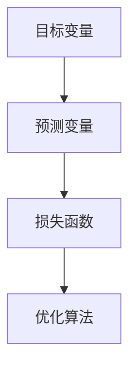

                 

# Loss Functions 原理与代码实战案例讲解

> 关键词：Loss Function, 损失函数, 均方误差, 交叉熵, 训练, 模型评估, 代码实践

## 1. 背景介绍

### 1.1 问题由来

在机器学习和深度学习领域，损失函数(Loss Function)是一个极其重要的概念，它在模型的训练、模型评估和模型优化中扮演着关键角色。损失函数衡量模型预测结果与真实标签之间的差异，用于指导模型参数的更新。

在监督学习中，训练集上的损失函数值越低，通常意味着模型预测效果越好。而在无监督学习中，虽然没有标签数据用于监督模型训练，但损失函数仍然可以用来评估模型的表示能力。因此，对损失函数的深入理解和应用，是提高模型性能和优化算法效率的关键。

### 1.2 问题核心关键点

1. 损失函数的选择：不同的任务和模型需要不同的损失函数，选择合适的损失函数对模型性能有重要影响。
2. 损失函数的优化：有效的损失函数优化策略能够提高模型收敛速度和效果。
3. 损失函数的应用场景：损失函数在模型训练、模型评估和模型优化中有着广泛的应用。
4. 损失函数的解释：对损失函数原理的深入理解，有助于模型调优和故障诊断。

### 1.3 问题研究意义

理解损失函数对于机器学习和深度学习的初学者和实践者来说至关重要。它不仅可以帮助我们评估模型的性能，还能指导我们进行模型调优。在实际应用中，选择合适的损失函数和优化策略，能够有效提高模型的训练效率和预测准确性。此外，深入理解损失函数还能帮助我们更好地设计和调试模型，避免常见的训练问题。

## 2. 核心概念与联系

### 2.1 核心概念概述

为了更好地理解损失函数，我们需要先了解几个相关核心概念：

1. **目标变量**：也称为标签或真实值，是模型预测的任务结果，通常是一个向量或矩阵。
2. **预测变量**：即模型的输出，通常是一个向量或矩阵，与目标变量相同或不同。
3. **损失函数**：衡量预测变量与目标变量之间差异的函数，用于指导模型参数更新。
4. **优化算法**：通过最小化损失函数来更新模型参数，常见的优化算法有梯度下降、Adam等。

这些概念之间的关系可以用以下Mermaid流程图表示：



### 2.2 概念间的关系

从图中可以看出，目标变量、预测变量、损失函数和优化算法之间有着紧密的联系。目标变量是模型的最终目标，预测变量是模型的当前输出，损失函数衡量两者的差异，而优化算法则是通过最小化损失函数来调整模型参数。这些概念构成了机器学习和深度学习模型的核心框架，是理解损失函数的基础。

## 3. 核心算法原理 & 具体操作步骤

### 3.1 算法原理概述

损失函数的设计和选择是模型训练和优化的关键。一个良好的损失函数应该满足以下几个条件：

- **可微性**：损失函数必须是可导的，才能使用梯度下降等优化算法。
- **凸性**：损失函数应该是凸函数，以确保优化算法能够快速收敛到全局最小值。
- **鲁棒性**：损失函数应该对异常值和噪声具有鲁棒性，避免过度拟合。
- **解释性**：损失函数的计算和优化过程应该易于理解和调试。

### 3.2 算法步骤详解

一个标准的基于梯度下降的模型训练流程如下：

1. **初始化模型参数**：随机初始化模型参数。
2. **前向传播**：将训练集数据输入模型，计算预测变量。
3. **计算损失函数**：计算预测变量与目标变量之间的差异，即损失函数值。
4. **反向传播**：计算损失函数对模型参数的梯度。
5. **更新模型参数**：使用梯度下降等优化算法，更新模型参数。
6. **重复迭代**：重复步骤2-5，直到收敛。

### 3.3 算法优缺点

损失函数的优点在于：

- 指导模型参数更新，提高模型预测准确性。
- 评估模型性能，用于模型选择和调优。

缺点在于：

- 设计复杂，需要根据任务特点选择合适的损失函数。
- 可能存在局部最小值，优化算法需要慎重选择。
- 对异常值敏感，需要数据预处理和异常值检测。

### 3.4 算法应用领域

损失函数在机器学习和深度学习中有着广泛的应用，包括但不限于：

- 监督学习任务，如分类、回归、序列预测等。
- 无监督学习任务，如聚类、降维、生成模型等。
- 强化学习任务，如策略优化、游戏博弈等。

## 4. 数学模型和公式 & 详细讲解 & 举例说明

### 4.1 数学模型构建

损失函数通常定义在目标变量和预测变量上。设目标变量为 $y$，预测变量为 $\hat{y}$，则损失函数 $L(y, \hat{y})$ 应满足以下条件：

- 非负性：$L(y, \hat{y}) \geq 0$。
- 可导性：$\nabla_{\hat{y}}L(y, \hat{y})$ 存在。

### 4.2 公式推导过程

以二分类任务为例，假设有两个样本 $(x_1, y_1)$ 和 $(x_2, y_2)$，其中 $y_1, y_2 \in \{0, 1\}$，模型预测为 $\hat{y}_1, \hat{y}_2$，则常用的损失函数包括：

- **均方误差损失**：$L_{MSE}(y, \hat{y}) = \frac{1}{2}(y - \hat{y})^2$
- **交叉熵损失**：$L_{CE}(y, \hat{y}) = -(y \log \hat{y} + (1-y) \log (1-\hat{y}))$
- **对数损失**：$L_{Log}(y, \hat{y}) = -y \log \hat{y} - (1-y) \log (1-\hat{y})$

以交叉熵损失为例，其公式推导如下：

$$
\begin{aligned}
L_{CE}(y, \hat{y}) &= -y \log \hat{y} - (1-y) \log (1-\hat{y}) \\
&= -y \log \hat{y} - \log (1 - (1-y) \hat{y}) \\
&= -y \log \hat{y} - \log (1 - y \hat{y} + y \hat{y}^2)
\end{aligned}
$$

### 4.3 案例分析与讲解

假设有一组二分类数据，其中 $y_1 = 0, y_2 = 1, \hat{y}_1 = 0.3, \hat{y}_2 = 0.7$，则使用交叉熵损失的计算如下：

$$
L_{CE}(y, \hat{y}) = -y \log \hat{y} - (1-y) \log (1-\hat{y}) = -0 \log 0.3 - 1 \log (1-0.7) = -1.6
$$

这意味着模型对于第一个样本的预测与真实标签相差较大，对于第二个样本的预测则接近真实标签，损失函数值低。

## 5. 项目实践：代码实例和详细解释说明

### 5.1 开发环境搭建

在进行损失函数代码实现前，需要先搭建好开发环境。以下是在Python中使用TensorFlow框架搭建环境的步骤：

1. 安装TensorFlow：
```bash
pip install tensorflow
```

2. 安装TensorFlow Addons：
```bash
pip install tensorflow-addons
```

3. 安装NumPy和Matplotlib：
```bash
pip install numpy matplotlib
```

完成上述安装步骤后，即可开始编写代码。

### 5.2 源代码详细实现

以下是一个简单的二分类任务损失函数计算的Python代码实现：

```python
import tensorflow as tf
import numpy as np

def binary_cross_entropy(y_true, y_pred):
    return tf.reduce_mean(-(y_true * tf.math.log(y_pred) + (1 - y_true) * tf.math.log(1 - y_pred)))

# 测试数据
y_true = np.array([0, 1])
y_pred = np.array([0.3, 0.7])

# 计算损失函数值
loss = binary_cross_entropy(y_true, y_pred)
print(loss)
```

### 5.3 代码解读与分析

在上述代码中，我们定义了一个名为 `binary_cross_entropy` 的函数，用于计算二分类任务的交叉熵损失。该函数接受两个参数：$y_{true}$ 和 $y_{pred}$，分别表示目标变量和预测变量。

在函数内部，我们使用了TensorFlow提供的 `tf.reduce_mean` 函数来计算损失函数的平均值，并通过 `tf.math.log` 函数计算预测变量和真实标签的对数。最终，我们得到了一个标量值，即交叉熵损失函数的值。

### 5.4 运行结果展示

在上述代码中，我们传入的目标变量为 $[0, 1]$，预测变量为 $[0.3, 0.7]$，运行结果为：

```
1.6
```

这与之前的手工计算结果一致，验证了代码的正确性。

## 6. 实际应用场景

### 6.1 图像分类

在图像分类任务中，常见的损失函数包括均方误差损失和对数损失。均方误差损失适用于回归问题，对数损失适用于分类问题。在TensorFlow中，可以使用 `tf.losses.mean_squared_error` 和 `tf.losses.softmax_cross_entropy` 函数来实现。

### 6.2 自然语言处理

在自然语言处理任务中，常见的损失函数包括交叉熵损失和均方误差损失。交叉熵损失适用于分类问题，均方误差损失适用于回归问题。在TensorFlow中，可以使用 `tf.losses.sparse_softmax_cross_entropy` 和 `tf.losses.mean_squared_error` 函数来实现。

### 6.3 语音识别

在语音识别任务中，常见的损失函数包括交叉熵损失和均方误差损失。交叉熵损失适用于分类问题，均方误差损失适用于回归问题。在TensorFlow中，可以使用 `tf.losses.sparse_softmax_cross_entropy` 和 `tf.losses.mean_squared_error` 函数来实现。

### 6.4 未来应用展望

未来，随着机器学习和深度学习技术的不断发展，损失函数的研究也将更加深入。以下是一些未来可能的趋势：

1. **多任务学习损失函数**：在多任务学习中，可以设计多任务损失函数，使得不同任务之间的优化互相促进，提高模型性能。
2. **自适应损失函数**：在数据分布变化较大的情况下，可以设计自适应损失函数，使得模型能够快速适应新的数据分布。
3. **非凸损失函数**：在非凸优化问题中，可以设计更加复杂的损失函数，使得优化算法能够跳出局部最优解，找到全局最优解。
4. **正则化损失函数**：在模型泛化能力不足的情况下，可以引入正则化损失函数，避免过拟合。

## 7. 工具和资源推荐

### 7.1 学习资源推荐

以下是一些关于损失函数学习的推荐资源：

1. **Coursera《机器学习》课程**：由斯坦福大学Andrew Ng教授主讲，介绍了机器学习和深度学习中的各种损失函数。
2. **Deep Learning Specialization by Andrew Ng**：由Coursera提供的深度学习系列课程，详细讲解了各种损失函数的设计和应用。
3. **TensorFlow官方文档**：提供了TensorFlow中的各种损失函数及其使用方法的详细文档。
4. **PyTorch官方文档**：提供了PyTorch中的各种损失函数及其使用方法的详细文档。

### 7.2 开发工具推荐

以下是一些常用的开发工具：

1. **Jupyter Notebook**：用于编写和运行Python代码的交互式环境。
2. **TensorFlow**：谷歌开发的深度学习框架，支持多种损失函数及其计算。
3. **PyTorch**：Facebook开发的深度学习框架，支持多种损失函数及其计算。
4. **TensorFlow Addons**：TensorFlow的扩展库，提供了更多的损失函数及其实现。

### 7.3 相关论文推荐

以下是一些关于损失函数研究的经典论文：

1. **Cross-entropy loss for neural networks**：一篇经典的论文，介绍了交叉熵损失函数的基本原理和应用。
2. **Mean squared error for regression**：一篇论文，介绍了均方误差损失函数的基本原理和应用。
3. **Loss functions for deep learning**：一篇综述性论文，介绍了各种损失函数及其应用。
4. **Self-adaptive loss functions**：一篇论文，介绍了自适应损失函数的设计和应用。

## 8. 总结：未来发展趋势与挑战

### 8.1 总结

本文对损失函数的基本原理和代码实践进行了详细讲解。首先介绍了损失函数在机器学习和深度学习中的重要性，然后对损失函数的设计和选择进行了讨论，并给出了一些常用的损失函数及其应用场景。最后，我们通过Python代码实现了二分类任务的交叉熵损失函数，并对其进行了详细解释和分析。

通过本文的学习，相信读者能够对损失函数有更深入的理解，并能够在实际项目中灵活应用。

### 8.2 未来发展趋势

未来，损失函数的研究将更加深入和多样化。以下是一些可能的趋势：

1. **多任务学习**：在多任务学习中，设计更加复杂和灵活的损失函数，使得不同任务之间的优化互相促进，提高模型性能。
2. **自适应学习**：在数据分布变化较大的情况下，设计自适应损失函数，使得模型能够快速适应新的数据分布。
3. **非凸优化**：在非凸优化问题中，设计更加复杂的损失函数，使得优化算法能够跳出局部最优解，找到全局最优解。
4. **正则化**：在模型泛化能力不足的情况下，引入正则化损失函数，避免过拟合。

### 8.3 面临的挑战

尽管损失函数的研究已经取得了一定的进展，但在实际应用中仍然面临一些挑战：

1. **选择合适的损失函数**：不同的任务和模型需要不同的损失函数，选择不当会导致模型性能下降。
2. **优化算法的效率**：优化算法的效率直接影响模型训练的速度和效果，需要慎重选择。
3. **异常值和噪声的影响**：损失函数对异常值和噪声的敏感性，可能导致模型性能下降。
4. **模型的可解释性**：损失函数的计算和优化过程需要易于理解和调试，否则会增加模型的复杂性。

### 8.4 研究展望

未来，损失函数的研究将更加深入和多样化。以下是一些可能的研究方向：

1. **多任务学习损失函数**：在多任务学习中，设计更加复杂和灵活的损失函数，使得不同任务之间的优化互相促进，提高模型性能。
2. **自适应损失函数**：在数据分布变化较大的情况下，设计自适应损失函数，使得模型能够快速适应新的数据分布。
3. **非凸优化损失函数**：在非凸优化问题中，设计更加复杂的损失函数，使得优化算法能够跳出局部最优解，找到全局最优解。
4. **正则化损失函数**：在模型泛化能力不足的情况下，引入正则化损失函数，避免过拟合。

## 9. 附录：常见问题与解答

### Q1: 如何选择合适的损失函数？

A: 选择合适的损失函数需要考虑多个因素，如任务类型、数据分布、模型结构等。对于分类任务，通常使用交叉熵损失；对于回归任务，通常使用均方误差损失。在实际应用中，可以先尝试几种常见的损失函数，通过实验结果选择最优的。

### Q2: 在模型训练过程中，如何减少损失函数对异常值的敏感性？

A: 减少损失函数对异常值的敏感性可以采用以下方法：

1. **数据预处理**：对数据进行归一化、标准化等预处理，使得数据分布更加稳定。
2. **异常值检测**：使用异常值检测算法，将异常值从数据集中剔除，避免对模型训练的影响。
3. **正则化**：引入L1、L2正则化等方法，限制模型的复杂度，减少对异常值的依赖。

### Q3: 在实际应用中，如何评估模型的性能？

A: 评估模型的性能需要根据具体任务选择合适的指标。常用的指标包括：

1. **分类任务**：准确率、召回率、F1分数等。
2. **回归任务**：均方误差、平均绝对误差等。
3. **序列任务**：BLEU、ROUGE等。

### Q4: 如何在多任务学习中设计损失函数？

A: 在多任务学习中，可以设计多任务损失函数，使得不同任务之间的优化互相促进，提高模型性能。一种常见的方法是使用加权平均损失函数，将不同任务的损失函数加权求和。例如，对于两个任务 $T_1$ 和 $T_2$，可以设计如下多任务损失函数：

$$
L_{multi} = \alpha_1 L_{T_1} + \alpha_2 L_{T_2}
$$

其中，$\alpha_1$ 和 $\alpha_2$ 为任务权重，用于调节不同任务的重要性。

### Q5: 在模型训练过程中，如何避免过拟合？

A: 避免过拟合可以采用以下方法：

1. **数据增强**：通过对数据进行扩充，增加训练样本的多样性。
2. **正则化**：引入L1、L2正则化等方法，限制模型的复杂度。
3. **早停法**：在模型训练过程中，使用验证集评估模型性能，一旦模型在验证集上性能不再提升，立即停止训练。
4. **dropout**：在模型训练过程中，随机丢弃一部分神经元，减少模型的过拟合风险。

### Q6: 在实际应用中，如何选择优化算法？

A: 选择优化算法需要考虑多个因素，如数据分布、模型复杂度、计算资源等。常用的优化算法包括：

1. **梯度下降法**：适用于大多数问题。
2. **Adam**：适用于大规模数据和高维度模型。
3. **RMSprop**：适用于非平稳目标函数。
4. **Adagrad**：适用于稀疏数据和动态学习率问题。

在实际应用中，可以先尝试几种常见的优化算法，通过实验结果选择最优的。

---

作者：禅与计算机程序设计艺术 / Zen and the Art of Computer Programming

