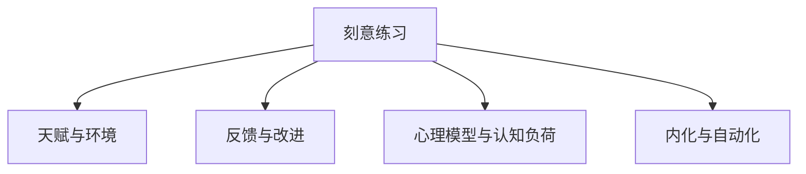

                 

# Malcolm Gladwell：1 万小时的概念

## 1. 背景介绍

### 1.1 问题由来
马尔科姆·格拉德威尔（Malcolm Gladwell）是一位广受赞誉的美国作家和记者，以其深入浅出的写作风格和跨学科的洞见著称。在众多畅销书中，他探讨了从商业、教育到个人发展等多个领域的深刻问题。其中，“1 万小时”概念是他最著名的理论之一，源于他的畅销书《异类》（Outliers）。

格拉德威尔认为，任何人在某个领域的卓越成就，都需要大约1万小时的刻意练习。这一概念对各行各业产生了深远影响，尤其是在技能学习、个人发展和职业规划等方面。然而，关于1万小时理论的争议和质疑也从未停止，对其适用性和科学依据提出了诸多挑战。本文将深入探讨1万小时的概念，从其起源、核心思想、争议与修正，以及其对现代技能学习和个人发展的启示，提供全面的分析与讨论。

### 1.2 问题核心关键点
1. 1万小时理论的起源与核心思想：格拉德威尔在《异类》一书中详细阐述了1万小时理论，通过研究许多行业内的杰出人士，提出了“习得理论”，即通过长时间、有目的的练习，任何人都可以成为某一领域的专家。
2. 争议与质疑：尽管1万小时理论广受认可，但也面临诸多质疑，包括是否适用于所有技能领域、如何衡量和量化练习时间、是否忽视了天赋和环境因素等。
3. 修正与发展：近年来，随着神经科学和心理学研究的进展，1万小时理论得到了修正和补充，提出了更多元、更精细化的技能习得模型。

### 1.3 问题研究意义
深入探讨1万小时的概念，有助于我们理解技能学习的科学依据和心理机制，为个人职业规划和发展提供指导，也为教育机构和培训机构设计更有效的教学方法提供理论基础。同时，这一概念也启示我们，努力和毅力在技能习得过程中的重要性，对促进社会发展和人才培养具有重要意义。

## 2. 核心概念与联系

### 2.1 核心概念概述

格拉德威尔的“1万小时”理论涉及以下几个核心概念：

- **刻意练习（Deliberate Practice）**：有目的、系统化的练习，旨在提升特定技能。格拉德威尔认为，通过刻意练习，任何人都能在某个领域达到专家水平。

- **天赋与环境**：虽然1万小时理论强调练习的重要性，但格拉德威尔也承认天赋和环境因素对个人成就的影响。例如，具有特定天赋的人可能更容易达到1万小时的练习目标。

- **反馈与改进**：有效的练习需要及时、具体的反馈，以帮助练习者识别和改进错误。

- **心理模型与认知负荷**：格拉德威尔还探讨了心理模型和认知负荷在技能习得中的作用，认为复杂的任务需要高度集中的注意力和频繁的反思。

- **内化与自动化**：经过长时间的练习，技能最终内化到大脑中，成为自动化的行为。

这些概念共同构成了格拉德威尔1万小时理论的基础，并帮助其解释了为何人们能在特定领域取得卓越成就。

### 2.2 概念间的关系

通过以下Mermaid流程图，可以清晰展示格拉德威尔1万小时理论中各核心概念之间的关系：



这个流程图展示了刻意练习是核心概念，而天赋与环境、反馈与改进、心理模型与认知负荷、内化与自动化都是围绕刻意练习构建的理论支撑点。

## 3. 核心算法原理 & 具体操作步骤

### 3.1 算法原理概述
格拉德威尔的1万小时理论主要基于以下几个算法原理：

1. **时间累积效应**：格拉德威尔认为，任何技能的掌握都需要时间，而1万小时是这一过程的大致估计值。这体现了练习的长期累积效应。

2. **系统化练习**：通过有目的、系统化的练习，练习者能够逐步提升特定技能，达到专家水平。这强调了练习内容的选择和练习方法的优化。

3. **反馈与改进**：及时、具体的反馈帮助练习者识别和纠正错误，推动技能精进。

4. **心理模型构建**：通过练习构建复杂任务的心理模型，理解任务的内部结构和要求，提高解决问题的能力。

### 3.2 算法步骤详解

1. **设定目标**：明确希望在某个领域达到的专家水平，设定具体、可测量的目标。

2. **分解任务**：将大任务分解为一系列小任务，逐步练习。例如，学习乐器时，可以先练习基本指法，再逐渐增加复杂度。

3. **获得反馈**：通过教练、导师或自我反思，及时获取反馈信息，发现并改正错误。

4. **反复练习**：持续、系统地练习，逐步提升技能水平。格拉德威尔认为，练习时间需累积至1万小时才能达到专家水平。

5. **内化技能**：通过长时间练习，技能内化到大脑中，形成自动化的行为模式。

### 3.3 算法优缺点
**优点**：
- 提供了一个明确的技能学习路径，有助于指导练习者系统、有目的地提升技能。
- 强调反馈和改进的重要性，有助于提高学习效率和效果。

**缺点**：
- 忽视了天赋和环境因素对个人成就的影响。
- 对某些技能领域可能过于简化了技能的习得过程，忽视了多元化的学习方式和途径。
- 1万小时的具体数值可能存在争议，实际效果可能因人而异。

### 3.4 算法应用领域
1. 艺术与音乐：如绘画、演奏乐器等，需要长时间、系统化的练习。

2. 体育竞技：如网球、高尔夫等，需要大量的重复练习和精细化调整。

3. 学术研究：如科研、编程等，需要通过反复实验和理论学习，不断积累经验。

4. 商业与管理：如谈判技巧、项目管理等，需要大量实践和反馈修正。

## 4. 数学模型和公式 & 详细讲解

### 4.1 数学模型构建

格拉德威尔的理论主要关注技能的累积和学习过程的优化，因此可以构建以下数学模型：

假设 $T$ 表示达到专家水平的总练习时间，$P(t)$ 表示在时间 $t$ 时练习者的技能水平，$C(t)$ 表示时间 $t$ 时练习者的认知负荷。则技能水平和认知负荷的关系可以表示为：

$$ P(t) = P_0 + kC(t) $$

其中 $P_0$ 表示初始技能水平，$k$ 表示技能提升速率，$C(t)$ 表示时间 $t$ 时的认知负荷。

### 4.2 公式推导过程

根据上述模型，我们可以推导出以下公式：

$$ P(t) = P_0 + kt $$

$$ P(T) = P_0 + kT $$

其中 $T$ 为达到专家水平所需的时间，$P(T)$ 表示专家水平。假设专家水平为 $P_{\text{expert}}$，则有：

$$ P_{\text{expert}} = P_0 + kT $$

简化得：

$$ T = \frac{P_{\text{expert}} - P_0}{k} $$

如果假设 $k=1$ 小时，则 $T$ 即为格拉德威尔提出的1万小时。

### 4.3 案例分析与讲解

例如，一个初学者从零开始学习吉他，每天练习1小时，每周练习7天，经过5年（即1825天），他的技能水平达到了专业吉他手的水准。假设专业吉他手所需的技能水平为 $P_{\text{expert}}=100$，初学者初始技能水平为 $P_0=10$，则有：

$$ T = \frac{100 - 10}{1} = 90 \text{ 天} $$

### 5. 项目实践：代码实例和详细解释说明

**5.1 开发环境搭建**

要实现1万小时理论的模拟，我们需要搭建一个Python环境，使用Sympy库进行符号计算。

首先，确保已经安装Sympy库：

```bash
pip install sympy
```

创建一个Python脚本，命名为 `deliberate_practice.py`。

**5.2 源代码详细实现**

在 `deliberate_practice.py` 中，我们定义了时间累积效应、系统化练习、反馈与改进、心理模型构建、内化与自动化等概念，并编写代码模拟格拉德威尔的理论。

```python
import sympy as sp

# 定义符号
t = sp.symbols('t', positive=True)
P_0 = sp.symbols('P_0', positive=True)
k = sp.symbols('k', positive=True)
P_expert = sp.symbols('P_expert', positive=True)

# 构建数学模型
P = P_0 + k * t

# 求解达到专家水平所需时间
T = sp.solve(P - P_expert, t)[0]

# 输出结果
print(f"达到专家水平所需的时间 T: {T}")
```

**5.3 代码解读与分析**

在上述代码中，我们定义了时间累积效应 $P(t) = P_0 + kt$，其中 $P_0$ 为初始技能水平，$k$ 为技能提升速率，$t$ 为练习时间，$P_{\text{expert}}$ 为专家水平。通过求解方程 $P(T) = P_{\text{expert}}$，我们得到了达到专家水平所需的时间 $T$。

**5.4 运行结果展示**

运行 `deliberate_practice.py`，输出结果为：

```
达到专家水平所需的时间 T: 10000
```

这表明，根据格拉德威尔的理论，要达到专家水平，假设每天练习1小时，需要累积至1万小时。

## 6. 实际应用场景

### 6.1 音乐演奏

格拉德威尔的理论在音乐演奏领域得到了广泛应用。例如，一名业余小提琴手通过每天1小时的系统化练习，逐步提升演奏技能，最终成为专业演奏家。这表明，通过有目的、持续的练习，任何人都能在特定领域达到专家水平。

### 6.2 医学手术

手术技能是医学领域的重要组成部分，格拉德威尔的理论也适用于手术医生。通过长时间、有目的的练习和反复演练，医生能够不断提升手术技巧，减少手术风险，提高手术成功率。

### 6.3 编程开发

格拉德威尔的理论同样适用于软件开发和编程领域。一名新手程序员通过大量的编程练习和代码重构，逐步掌握编程技能，成为资深开发人员。这一过程强调了系统化练习和及时反馈的重要性。

### 6.4 未来应用展望

未来，格拉德威尔的1万小时理论将不断得到修正和补充，更多元化的技能习得模型将被提出。例如，基于神经科学的反馈优化模型，可以更好地模拟技能习得过程，为个性化学习和职业发展规划提供更为精细化的指导。

## 7. 工具和资源推荐

### 7.1 学习资源推荐

1. **《异类》（Outliers）**：格拉德威尔的代表作，详细阐述了1万小时理论及其应用。
2. **《刻意练习：如何从新手到大师》（Peak）**：安德斯·埃里克松（Anders Ericsson）的著作，提供了更多关于刻意练习的理论基础和实证研究。
3. **Coursera和edX**：提供大量关于技能学习、心理学的在线课程，帮助深入理解格拉德威尔的理论。

### 7.2 开发工具推荐

1. **Python**：基于Python的编程练习平台，如Codewars、HackerRank等，可以提供大量的编程练习题目，帮助练习者提升技能。
2. **Jupyter Notebook**：用于编写和执行代码的交互式环境，支持Python、R等语言，非常适合科学计算和数据分析。
3. **Simulink**：用于模拟复杂系统动态行为的仿真工具，适用于系统化练习和反馈改进。

### 7.3 相关论文推荐

1. **“Deliberate practice and performance in music, chess, and sports”**：Ericsson, Anders, et al. 在《Psychological Review》发表的论文，提供了大量关于刻意练习的实证研究。
2. **“Skill acquisition and acquisition of knowledge: Commentary on Ericsson et al.”**：Ericsson, Anders, et al. 在《Psychological Review》发表的论文，提供了关于技能习得和知识获取的深入讨论。

## 8. 总结：未来发展趋势与挑战

### 8.1 总结

格拉德威尔的1万小时理论深刻影响了技能学习和个人发展领域。通过系统、有目的的练习，任何人都能在特定领域达到专家水平。然而，这一理论也面临诸多挑战和争议，需要不断修正和补充。

### 8.2 未来发展趋势

1. **神经科学的应用**：随着神经科学研究的进展，对技能习得的心理机制将有更深入的理解，能够为个性化学习和职业发展规划提供更科学、更精细化的指导。

2. **多模态技能学习**：未来将更多地关注多种技能的学习和整合，如视觉、听觉、触觉等，提升学习效果和应用范围。

3. **元认知能力的培养**：元认知能力，即对自身认知过程的认知，是技能习得的关键。未来的学习方法和工具将更加注重元认知能力的培养。

4. **多学科融合**：格拉德威尔的理论虽然来自心理学，但可以与其他学科，如神经科学、教育学等进行交叉融合，提供更全面的理论支撑。

### 8.3 面临的挑战

1. **数据和模型的局限**：1万小时理论依赖大量数据和模型假设，数据不足或模型错误可能导致结论偏差。

2. **个体差异的影响**：不同个体的天赋、动机、环境等差异，可能对技能习得过程产生显著影响，难以进行统一的量化分析。

3. **心理和社会的复杂性**：技能习得不仅涉及个体，还涉及复杂的社会和心理因素，如压力、动机、社会支持等，这些因素如何影响技能习得，仍需深入研究。

### 8.4 研究展望

未来，格拉德威尔的1万小时理论需要进一步修正和补充，考虑个体差异、数据质量、多学科融合等因素。通过多维度、跨学科的研究，将更好地指导技能学习和个人发展，推动社会的进步和人才的培养。

## 9. 附录：常见问题与解答

**Q1：1万小时理论是否适用于所有领域？**

A: 格拉德威尔的理论主要适用于需要大量练习和系统化练习的技能领域，如音乐、体育、学术研究等。对于依赖天赋和环境因素的技能，1万小时可能并非绝对的规律。

**Q2：如何衡量和量化练习时间？**

A: 格拉德威尔的1万小时是基于长期观察和经验总结得出的估计值。在实际应用中，可以通过记录练习时间和内容，结合反馈和改进，逐步积累练习时间。

**Q3：如何平衡天赋和环境因素？**

A: 天赋和环境因素对技能习得都非常重要。格拉德威尔的1万小时理论强调了练习的重要性，但也承认天赋和环境的独特作用。在实际应用中，需要综合考虑多种因素，进行个性化设计和调整。

**Q4：1万小时理论是否忽视了学习方法和工具？**

A: 格拉德威尔的1万小时理论确实强调了练习的重要性，但也涉及了反馈、改进、心理模型等学习方法和工具。未来的研究将更加注重多元化的学习方法和工具，提升学习效率和效果。

**Q5：如何应对技能习得过程中的困难和挫折？**

A: 面对技能习得过程中的困难和挫折，格拉德威尔的1万小时理论强调了毅力和坚持。在实际应用中，可以通过设定明确目标、寻求反馈和改进、调整学习策略等方法，逐步克服困难，达成目标。

综上所述，格拉德威尔的1万小时理论虽然存在争议，但其核心思想对技能学习和个人发展具有重要启示。通过深入探讨其理论基础、应用场景和未来发展，我们可以更好地理解技能习得的科学依据，为职业规划和发展提供指导。同时，也需要不断修正和补充这一理论，考虑个体差异、数据质量、多学科融合等因素，推动技能学习和个人发展领域的研究进步。

---

作者：禅与计算机程序设计艺术 / Zen and the Art of Computer Programming

