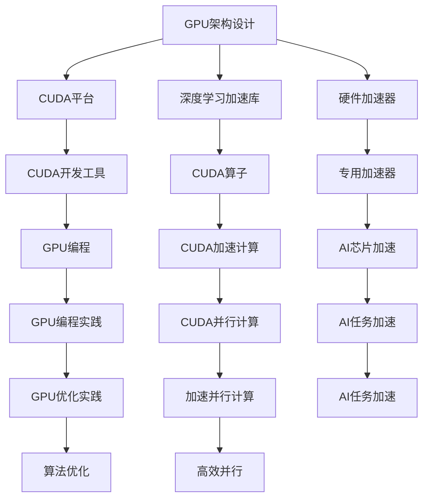
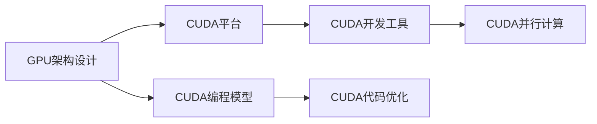
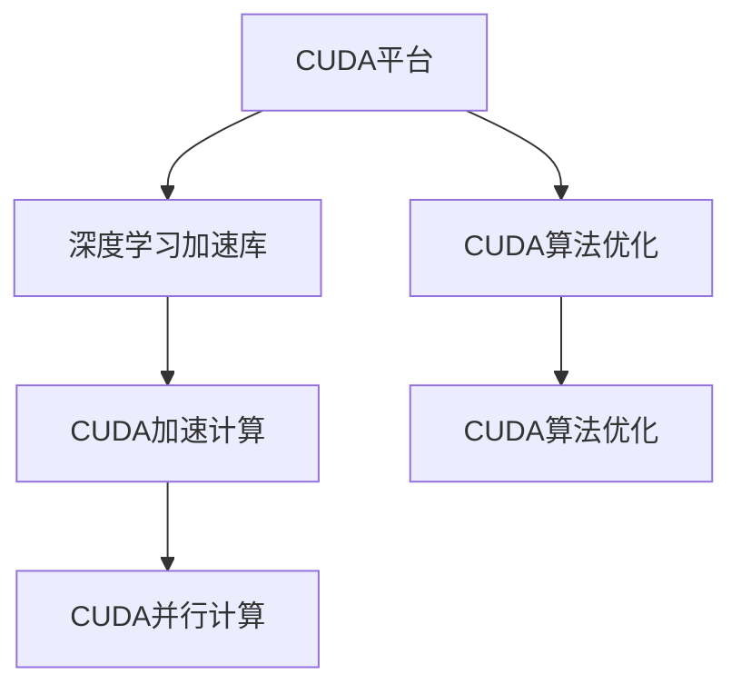
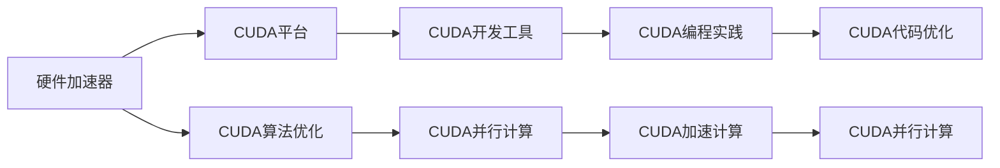

                 

# NVIDIA的GPU技术与AI算力

## 1. 背景介绍

随着人工智能(AI)技术的不断发展和普及，GPU（图形处理单元）作为计算密集型任务的重要加速器，在AI领域的应用越来越广泛。NVIDIA作为GPU技术的主导者，不仅推动了GPU在图形渲染领域的发展，也在AI算力方面发挥了重要作用。本文将从GPU技术和AI算力的角度，探讨NVIDIA在AI领域的贡献和未来展望。

### 1.1 问题由来

GPU技术的快速发展，使得其在大规模并行计算中的应用变得越来越广泛。AI算力作为计算密集型的领域，GPU的高并行计算能力使其成为不可或缺的计算工具。NVIDIA凭借其强大的GPU硬件和优化的软件栈，在AI算力方面占据了主导地位。

NVIDIA的GPU技术不仅在图像渲染和视频处理上取得了显著成就，其CUDA（Compute Unified Device Architecture）平台使得开发者能够高效利用GPU的并行计算能力，从而推动了AI算力的大幅提升。NVIDIA通过不断的技术创新和产品升级，不断拓展GPU在AI领域的应用范围，成为AI算力提升的重要推动力。

### 1.2 问题核心关键点

NVIDIA在AI算力方面的核心技术主要包括以下几个方面：

1. **GPU架构设计**：NVIDIA的GPU架构设计，使其能够高效地处理大规模并行计算任务。其先进的并行处理能力，使得GPU成为AI算力提升的关键。

2. **CUDA平台**：NVIDIA的CUDA平台，提供了强大的开发工具和高效的并行计算框架，使得开发者能够充分利用GPU的并行计算能力，从而推动了AI算力的大幅提升。

3. **深度学习加速库**：NVIDIA通过深度学习加速库如cuDNN（CUDA Deep Neural Network）、TensorRT等，进一步优化了GPU在AI任务中的性能。

4. **硬件加速器**：NVIDIA的硬件加速器如NVIDIA AI芯片，进一步提升了GPU在AI任务中的处理能力。

5. **软件优化**：NVIDIA通过软件优化和算法改进，不断提升GPU在AI任务中的处理效率。

### 1.3 问题研究意义

研究NVIDIA的GPU技术与AI算力，对于推动AI技术的普及和应用具有重要意义：

1. **提升AI算力**：GPU技术能够显著提升AI任务的计算效率，使得AI应用能够更快地落地。

2. **降低计算成本**：GPU技术的硬件加速能力，减少了AI任务所需的计算资源，降低了计算成本。

3. **推动AI应用发展**：GPU技术使得更多的企业和个人能够使用AI技术，推动了AI应用的发展。

4. **促进产业升级**：AI算力的大幅提升，促进了各行业数字化转型和产业升级。

## 2. 核心概念与联系

### 2.1 核心概念概述

为了更好地理解NVIDIA的GPU技术与AI算力的关系，本节将介绍几个密切相关的核心概念：

- **GPU架构设计**：指NVIDIA在GPU硬件设计上的创新，使其能够高效地处理大规模并行计算任务。

- **CUDA平台**：指NVIDIA提供的开发平台和工具，用于充分利用GPU的并行计算能力。

- **深度学习加速库**：指NVIDIA提供的优化深度学习算法的库，如cuDNN、TensorRT等。

- **硬件加速器**：指NVIDIA设计的专用硬件，用于加速特定AI任务，如NVIDIA AI芯片。

- **软件优化**：指NVIDIA通过算法优化和工具链优化，提升GPU在AI任务中的处理效率。

这些核心概念之间的逻辑关系可以通过以下Mermaid流程图来展示：



这个流程图展示了大语言模型微调过程中各个核心概念之间的联系：

1. **GPU架构设计**：为CUDA平台提供了硬件基础。
2. **CUDA平台**：为深度学习加速库、硬件加速器和软件优化提供了开发工具。
3. **深度学习加速库**：为GPU编程和加速计算提供了优化算子。
4. **硬件加速器**：为特定AI任务提供了专用加速。
5. **软件优化**：通过算法优化和工具链优化提升了GPU在AI任务中的处理效率。

### 2.2 概念间的关系

这些核心概念之间存在着紧密的联系，形成了NVIDIA在AI算力提升的完整生态系统。下面我们通过几个Mermaid流程图来展示这些概念之间的关系。

#### 2.2.1 GPU架构设计与CUDA平台的关系



这个流程图展示了GPU架构设计与CUDA平台之间的关系：

1. **GPU架构设计**：为CUDA平台提供了底层硬件支持。
2. **CUDA平台**：通过编程模型和开发工具，使得开发者能够高效利用GPU的并行计算能力。

#### 2.2.2 CUDA平台与深度学习加速库的关系



这个流程图展示了CUDA平台与深度学习加速库之间的关系：

1. **CUDA平台**：提供了深度学习加速库的开发环境和优化工具。
2. **深度学习加速库**：通过优化算法，进一步提升了GPU在AI任务中的性能。

#### 2.2.3 硬件加速器与CUDA平台的关系



这个流程图展示了硬件加速器与CUDA平台之间的关系：

1. **硬件加速器**：为特定AI任务提供了专用加速。
2. **CUDA平台**：通过编程模型和开发工具，使得开发者能够高效利用硬件加速器的并行计算能力。

### 2.3 核心概念的整体架构

最后，我们用一个综合的流程图来展示这些核心概念在大语言模型微调过程中的整体架构：

```mermaid
graph TB
    A[大规模文本数据] --> B[预训练]
    B --> C[大语言模型]
    C --> D[CUDA平台]
    D --> E[GPU编程]
    E --> F[CUDA并行计算]
    F --> G[CUDA加速计算]
    G --> H[CUDA算法优化]
    H --> I[CUDA深度学习加速库]
    I --> J[深度学习模型]
    J --> K[GPU加速计算]
    K --> L[CUDA并行计算]
    L --> M[CUDA优化算法]
    M --> N[CUDA编程实践]
    N --> O[CUDA开发工具]
    O --> P[CUDA平台]
    P --> Q[CUDA并行计算]
    Q --> R[CUDA硬件加速器]
    R --> S[CUDA专用加速器]
    S --> T[CUDA算法优化]
    T --> U[CUDA编程模型]
    U --> V[CUDA优化实践]
    V --> W[CUDA编程工具]
    W --> X[CUDA深度学习加速库]
    X --> Y[GPU加速计算]
    Y --> Z[CUDA并行计算]
    Z --> AA[CUDA算法优化]
    AA --> AB[CUDA编程模型]
    AB --> AC[CUDA编程实践]
    AC --> AD[CUDA开发工具]
    AD --> AE[CUDA平台]
    AE --> AF[CUDA并行计算]
    AF --> AG[CUDA硬件加速器]
    AG --> AH[CUDA专用加速器]
    AH --> AI[CUDA算法优化]
    AI --> AJ[CUDA编程模型]
    AJ --> AK[CUDA编程实践]
    AK --> AL[CUDA开发工具]
    AL --> AM[CUDA平台]
    AM --> AN[CUDA并行计算]
    AN --> AO[CUDA硬件加速器]
    AO --> AP[CUDA专用加速器]
    AP --> AQ[CUDA算法优化]
    AQ --> AR[CUDA编程模型]
    AR --> AS[CUDA编程实践]
    AS --> AT[CUDA开发工具]
    AT --> AU[CUDA平台]
    AU --> AV[CUDA并行计算]
    AV --> AW[CUDA硬件加速器]
    AW --> AX[CUDA专用加速器]
    AX --> AY[CUDA算法优化]
    AY --> AZ[CUDA编程模型]
    AZ --> BA[CUDA编程实践]
    BA --> BB[CUDA开发工具]
    BB --> BC[CUDA平台]
    BC --> BD[CUDA并行计算]
    BD --> BE[CUDA硬件加速器]
    BE --> BF[CUDA专用加速器]
    BF --> BG[CUDA算法优化]
    BG --> BH[CUDA编程模型]
    BH --> BI[CUDA编程实践]
    BI --> BJ[CUDA开发工具]
    BJ --> BK[CUDA平台]
    BK --> BL[CUDA并行计算]
    BL --> BM[CUDA硬件加速器]
    BM --> BN[CUDA专用加速器]
    BN --> BO[CUDA算法优化]
    BO --> BP[CUDA编程模型]
    BP --> BQ[CUDA编程实践]
    BQ --> BR[CUDA开发工具]
    BR --> BS[CUDA平台]
    BS --> BT[CUDA并行计算]
    BT --> BU[CUDA硬件加速器]
    BU --> BV[CUDA专用加速器]
    BV --> BW[CUDA算法优化]
    BW --> BX[CUDA编程模型]
    BX --> BY[CUDA编程实践]
    BY --> BZ[CUDA开发工具]
    BZ --> CA[CUDA平台]
    CA --> CB[CUDA并行计算]
    CB --> CC[CUDA硬件加速器]
    CC --> CD[CUDA专用加速器]
    CD --> CE[CUDA算法优化]
    CE --> CF[CUDA编程模型]
    CF --> CG[CUDA编程实践]
    CG --> CH[CUDA开发工具]
    CH --> CI[CUDA平台]
    CI --> CJ[CUDA并行计算]
    CJ --> CK[CUDA硬件加速器]
    CK --> CL[CUDA专用加速器]
    CL --> CM[CUDA算法优化]
    CM --> CN[CUDA编程模型]
    CN --> CO[CUDA编程实践]
    CO --> CP[CUDA开发工具]
    CP --> CQ[CUDA平台]
    CQ --> CR[CUDA并行计算]
    CR --> CS[CUDA硬件加速器]
    CS --> CT[CUDA专用加速器]
    CT --> CU[CUDA算法优化]
    CU --> CV[CUDA编程模型]
    CV --> CW[CUDA编程实践]
    CW --> CX[CUDA开发工具]
    CX --> CY[CUDA平台]
    CY --> CZ[CUDA并行计算]
    CZ --> DA[CUDA硬件加速器]
    DA --> DB[CUDA专用加速器]
    DB --> DC[CUDA算法优化]
    DC --> DD[CUDA编程模型]
    DD --> DE[CUDA编程实践]
    DE --> DF[CUDA开发工具]
    DF --> DG[CUDA平台]
    DG --> DH[CUDA并行计算]
    DH --> DI[CUDA硬件加速器]
    DI --> DJ[CUDA专用加速器]
    DJ --> DK[CUDA算法优化]
    DK --> DL[CUDA编程模型]
    DL --> DM[CUDA编程实践]
    DM --> DN[CUDA开发工具]
    DN --> DO[CUDA平台]
    DO --> DP[CUDA并行计算]
    DP --> DQ[CUDA硬件加速器]
    DQ --> DR[CUDA专用加速器]
    DR --> DS[CUDA算法优化]
    DS --> DT[CUDA编程模型]
    DT --> DU[CUDA编程实践]
    DU --> DV[CUDA开发工具]
    DV --> DW[CUDA平台]
    DW --> DX[CUDA并行计算]
    DX --> DY[CUDA硬件加速器]
    DY --> DZ[CUDA专用加速器]
    DZ --> EA[CUDA算法优化]
    EA --> EB[CUDA编程模型]
    EB --> EC[CUDA编程实践]
    EC --> ED[CUDA开发工具]
    ED --> EE[CUDA平台]
    EE --> EF[CUDA并行计算]
    EF --> EG[CUDA硬件加速器]
    EG --> EH[CUDA专用加速器]
    EH --> EI[CUDA算法优化]
    EI --> EJ[CUDA编程模型]
    EJ --> EK[CUDA编程实践]
    EK --> EL[CUDA开发工具]
    EL --> EM[CUDA平台]
    EM --> EN[CUDA并行计算]
    EN --> EO[CUDA硬件加速器]
    EO --> EP[CUDA专用加速器]
    EP --> EQ[CUDA算法优化]
    EQ --> ER[CUDA编程模型]
    ER --> ES[CUDA编程实践]
    ES --> ET[CUDA开发工具]
    ET --> EU[CUDA平台]
    EU --> EV[CUDA并行计算]
    EV --> EW[CUDA硬件加速器]
    EW --> EX[CUDA专用加速器]
    EX --> EY[CUDA算法优化]
    EY --> EZ[CUDA编程模型]
    EZ --> FA[CUDA编程实践]
    FA --> FB[CUDA开发工具]
    FB --> FC[CUDA平台]
    FC --> FD[CUDA并行计算]
    FD --> FE[CUDA硬件加速器]
    FE --> FF[CUDA专用加速器]
    FF --> FG[CUDA算法优化]
    FG --> FH[CUDA编程模型]
    FH --> FI[CUDA编程实践]
    FI --> FJ[CUDA开发工具]
    FJ --> FM[CUDA平台]
    FM --> FN[CUDA并行计算]
    FN --> FO[CUDA硬件加速器]
    FO --> FP[CUDA专用加速器]
    FP --> FQ[CUDA算法优化]
    FQ --> FR[CUDA编程模型]
    FR --> FS[CUDA编程实践]
    FS --> FT[CUDA开发工具]
    FT --> FU[CUDA平台]
    FU --> FV[CUDA并行计算]
    FV --> FW[CUDA硬件加速器]
    FW --> FX[CUDA专用加速器]
    FX --> FY[CUDA算法优化]
    FY --> FZ[CUDA编程模型]
    FZ --> GA[CUDA编程实践]
    GA --> GB[CUDA开发工具]
    GB --> GC[CUDA平台]
    GC --> GD[CUDA并行计算]
    GD --> GE[CUDA硬件加速器]
    GE --> GF[CUDA专用加速器]
    GF --> GG[CUDA算法优化]
    GG --> GH[CUDA编程模型]
    GH --> GI[CUDA编程实践]
    GI --> GJ[CUDA开发工具]
    GJ --> GM[CUDA平台]
    GM --> GN[CUDA并行计算]
    GN --> GO[CUDA硬件加速器]
    GO --> GP[CUDA专用加速器]
    GP --> GQ[CUDA算法优化]
    GQ --> GR[CUDA编程模型]
    GR --> GS[CUDA编程实践]
    GS --> GT[CUDA开发工具]
    GT --> GU[CUDA平台]
    GU -->GV[CUDA并行计算]
    GV --> GW[CUDA硬件加速器]
    GW --> GX[CUDA专用加速器]
    GX -->GY[CUDA算法优化]
    GY --> GZ[CUDA编程模型]
    GZ --> HA[CUDA编程实践]
    HA --> HB[CUDA开发工具]
    HB --> HC[CUDA平台]
    HC --> HD[CUDA并行计算]
    HD --> HE[CUDA硬件加速器]
    HE --> HF[CUDA专用加速器]
    HF --> HG[CUDA算法优化]
    HG --> HH[CUDA编程模型]
    HH --> HI[CUDA编程实践]
    HI --> HJ[CUDA开发工具]
    HJ --> HM[CUDA平台]
    HM --> HN[CUDA并行计算]
    HN --> HO[CUDA硬件加速器]
    HO --> HP[CUDA专用加速器]
    HP --> HQ[CUDA算法优化]
    HQ --> HR[CUDA编程模型]
    HR --> HS[CUDA编程实践]
    HS --> HT[CUDA开发工具]
    HT --> HU[CUDA平台]
    HU --> HV[CUDA并行计算]
    HV --> HW[CUDA硬件加速器]
    HW --> HX[CUDA专用加速器]
    HX -->HY[CUDA算法优化]
    HY --> HZ[CUDA编程模型]
    HZ --> IA[CUDA编程实践]
    IA --> IB[CUDA开发工具]
    IB --> IC[CUDA平台]
    IC --> ID[CUDA并行计算]
    ID --> IE[CUDA硬件加速器]
    IE --> IF[CUDA专用加速器]
    IF --> IG[CUDA算法优化]
    IG --> IH[CUDA编程模型]
    IH --> II[CUDA编程实践]
    II --> IJ[CUDA开发工具]
    IJ --> IM[CUDA平台]
    IM --> IN[CUDA并行计算]
    IN --> IO[CUDA硬件加速器]
    IO --> IP[CUDA专用加速器]
    IP --> IQ[CUDA算法优化]
    IQ --> IR[CUDA编程模型]
    IR --> IS[CUDA编程实践]
    IS --> IT[CUDA开发工具]
    IT --> IU[CUDA平台]
    IU --> IV[CUDA并行计算]
    IV --> IW[CUDA硬件加速器]
    IW --> IX[CUDA专用加速器]
    IX --> IY[CUDA算法优化]
    IY --> IZ[CUDA编程模型]
    IZ --> JA[CUDA编程实践]
    JA --> JB[CUDA开发工具]
    JB --> JC[CUDA平台]
    JC --> JD[CUDA并行计算]
    JD --> JE[CUDA硬件加速器]
    JE --> JF[CUDA专用加速器]
    JF --> JG[CUDA算法优化]
    JG --> JH[CUDA编程模型]
    JH --> JI[CUDA编程实践]
    JI --> JJ[CUDA开发工具]
    JJ --> JM[CUDA平台]
    JM --> JN[CUDA并行计算]
    JN --> JO[CUDA硬件加速器]
    JO --> JP[CUDA专用加速器]
    JP --> JQ[CUDA算法优化]
    JQ --> JR[CUDA编程模型]
    JR --> JS[CUDA编程实践]
    JS --> JT[CUDA开发工具]
    JT --> JU[CUDA平台]
    JU --> JV[CUDA并行计算]
    JV --> JW[CUDA硬件加速器]
    JW --> JX[CUDA专用加速器]
    JX --> JY[CUDA算法优化]
    JY --> JZ[CUDA编程模型]
    JZ --> KA[CUDA编程实践]
    KA --> KB[CUDA开发工具]
    KB --> KC[CUDA平台]
    JC --> KD[CUDA并行计算]
    KD --> KE[CUDA硬件加速器]
    KE --> KF[CUDA专用加速器]
    KF --> KG[CUDA算法优化]
    KG --> KH[CUDA编程模型]
    KH --> KI[CUDA编程实践]
    KI --> KJ[CUDA开发工具]
    KJ --> KK[CUDA平台]
    KK --> KL[CUDA并行计算]
    KL --> KM[CUDA硬件加速器]
    KM --> KN[CUDA专用加速器]
    KN --> KO[CUDA算法优化]
    KO --> KP[CUDA编程模型]
    KP --> KQ[CUDA编程实践]
    KQ --> KR[CUDA开发工具]
    KR --> KS[CUDA平台]
    KS --> KT[CUDA并行计算]
    KT --> KU[CUDA硬件加速器]
    KU --> KV[CUDA专用加速器]
    KV --> KW[CUDA算法优化]
    KW --> KX[CUDA编程模型]
    KX --> KY[CUDA编程实践]
    KY --> KZ[CUDA开发工具]
    KZ --> LA[CUDA平台]
    LA --> LB[CUDA并行计算]
    LB --> LC[CUDA硬件加速器]
    LC --> LD[CUDA专用加速器]
    LD --> LE[CUDA算法优化]
    LE --> LF[CUDA编程模型]
    LF --> LG[CUDA编程实践]
    LG --> LH[CUDA开发工具]
    LH --> LI[CUDA平台]
    LI --> LJ[CUDA并行计算]
    LJ --> LK[CUDA硬件加速器]
    LK --> LL[CUDA专用加速器]
    LL --> LM[CUDA算法优化]
    LM --> LN[CUDA编程模型]
    LN --> LO[CUDA编程实践]
    LO --> LP[CUDA开发工具]
    LP --> LQ[CUDA平台]
    LQ --> LR[CUDA并行计算]
    LR --> LS[CUDA硬件加速器]
    LS --> LT[CUDA专用加速器]
    LT --> LU[CUDA算法优化]
    LU --> LV[CUDA编程模型]
    LV --> LW[CUDA编程实践]
    LW --> LX[CUDA开发工具]
    LX --> LY[CUDA平台]
    LY --> LZ[CUDA并行计算]
    LZ --> MA[CUDA硬件加速器]
    MA --> MB[CUDA专用加速器]
    MB --> MC[CUDA算法优化]
    MC --> MD[CUDA编程模型]
    MD --> ME[CUDA编程实践]
    ME --> MF[CUDA开发工具]
    MF --> MG[CUDA平台]
    MG --> MH[CUDA并行计算]
    MH --> MI[CUDA硬件加速器]
    MI --> MJ[CUDA专用加速器]
    MJ --> MK[CUDA算法优化]
    MK --> ML[CUDA编程模型]
    ML --> MM[CUDA编程实践]
    MM --> MN[CUDA开发工具]
    MN --> MO[CUDA平台]
    MO --> MP[CUDA并行计算]
    MP --> MQ[CUDA硬件加速器]
    MQ --> MR[CUDA专用加速器]
    MR --> MS[CUDA算法优化]
    MS --> MT[CUDA编程模型]
    MT --> MU[CUDA编程实践]
    MU --> MV[CUDA开发工具]
    MV --> MW[CUDA平台]
    MW --> MX[CUDA并行计算]
    MX --> MY[CUDA硬件加速器]
    MY --> MZ[CUDA专用加速器]
    MZ --> NA[CUDA算法优化]
    NA --> NB[CUDA编程模型]
    NB --> NC[CUDA编程实践]
    NC --> ND[CUDA开发工具]
    ND --> NE[CUDA平台]
    NE --> NF[CUDA并行计算]
    NF --> NG[CUDA硬件加速器]
    NG --> NH[CUDA专用加速器]
    NH --> NI[CUDA算法优化]
    NI --> NJ[CUDA编程模型]
    NJ --> NK[CUDA编程实践]
    NK --> NL[CUDA开发工具]
    NL --> NM[CUDA平台]
    NM --> NN[CUDA并行计算]
    NN --> NO[CUDA硬件加速器]
    NO --> NP[CUDA专用加速器]
    NP --> NQ[CUDA算法优化]
    NQ --> NR[CUDA编程模型]
    NR --> NS[CUDA编程实践]
    NS --> NT[CUDA开发工具]
    NT --> NU[CUDA平台]
    NU --> NV[CUDA并行计算]
    NV --> NW[CUDA硬件加速器]
    NW --> NX[CUDA专用加速器]
    NX --> NY[CUDA算法优化]
    NY --> NZ[CUDA编程模型]
    NZ --> OA[CUDA编程实践]
    OA --> OB[CUDA开发工具]
    OB --> OC[CUDA平台]
    OC --> OD[CUDA并行计算]
    OD --> OE[CUDA硬件加速器]
    OE --> OF[CUDA专用加速器]
    OF --> OG[CUDA算法优化]
    OG --> OH[CUDA编程模型]
    OH --> OI[CUDA编程实践]
    OI --> OJ[CUDA开发工具]
    OJ --> OK[CUDA平台]
    OK --> OL[CUDA并行计算]
    OL --> OM[CUDA硬件加速器]
    OM --> ON[CUDA专用加速器]
    ON --> OQ[CUDA算法优化]
    OQ --> OR[CUDA编程模型]
    OR --> OS[CUDA编程实践]
    OS --> OT[CUDA开发工具]
    OT --> OU[CUDA平台]
    OU -->OV[CUDA并行计算]
    OV --> OW[CUDA硬件加速器]
    OW --> OX[CUDA专用加速器]
    OX --> OY[CUDA算法优化]
    OY --> OZ[CUDA编程模型]
    OZ --> PA[CUDA编程实践]
    PA --> PB[CUDA开发工具]
    PB --> PC[CUDA平台]
    PC --> PD[CUDA并行计算]
    PD --> PE[CUDA硬件加速器]
    PE --> PF[CUDA专用加速器]
    PF --> PG[CUDA算法优化]
    PG --> PH[CUDA编程模型]
    PH --> PI[CUDA编程实践]
    PI --> PJ[CUDA开发工具]
    PJ --> PK[CUDA平台]
    PK --> PL[CUDA并行计算]
    PL --> PM[CUDA硬件加速器]
    PM --> PN[CUDA专用加速器]
    PN --> PO[CUDA算法优化]
    PO --> PP[CUDA编程模型]
    PP --> PQ[CUDA编程实践]
    PQ --> PR[CUDA开发工具]
    PR --> PS[CUDA平台]
    PS --> PT[CUDA并行计算]
    PT --> PU[CUDA硬件加速器]
    PU --> PV[CUDA专用加速器]
    PV --> PW[CUDA算法优化]
    PW --> PX[CUDA编程模型]
    PX --> PY[CUDA编程实践]
    PY --> PZ[CUDA开发工具]
    PZ --> QA[CUDA平台]
    QA --> QB[CUDA并行计算]
    QB --> QC[CUDA硬件加速器]
    QC --> QD[CUDA专用加速器]
    QD --> QE[CUDA算法优化]
    QE --> QF[CUDA编程模型]
    QF --> QG[CUDA编程实践]
    QG -->

