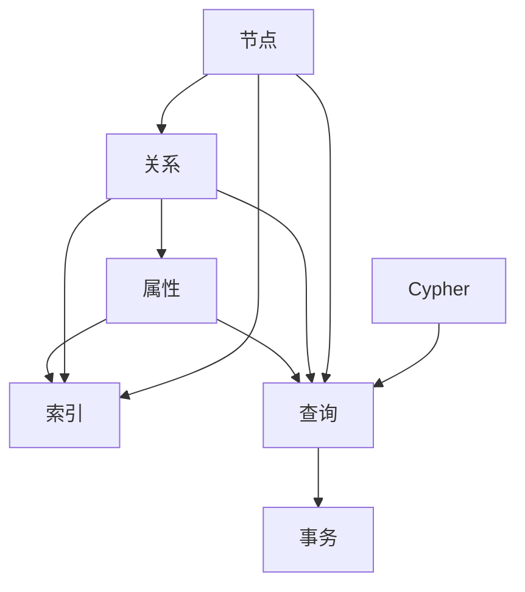
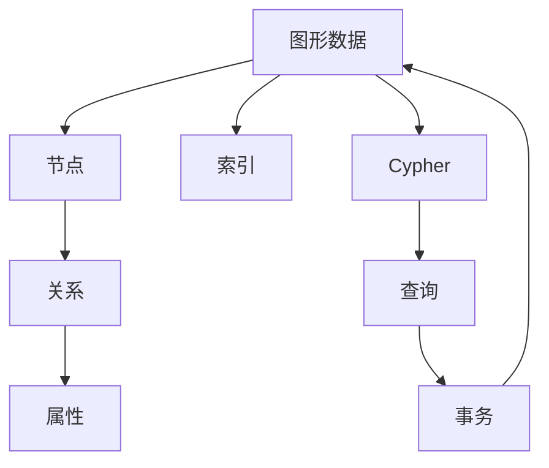

                 

# Neo4j原理与代码实例讲解

## 1. 背景介绍

### 1.1 问题由来
Neo4j作为一款领先的图形数据库，以其强大的图形处理能力和灵活的查询语言著称。近年来，随着图形数据应用的日益广泛，如社交网络、知识图谱、推荐系统等，Neo4j在企业数据管理、智能决策等领域的应用越来越广泛。然而，许多开发者对其内部原理和核心算法不够了解，难以在实际项目中高效使用。

### 1.2 问题核心关键点
Neo4j的核心优势在于其基于图的数据模型和灵活的查询语言Cypher。其核心算法包括：
- Graph Database：存储和管理节点、关系、属性等图形数据。
- C-Store Engine：基于玻尔兹曼机(Boltzmann Machine)的存储引擎，用于处理图数据库的动态查询和变更。
- Cypher Query Language：一种声明式、函数式、操作性强的高效查询语言，用于处理图形数据。
- Label-Based Indexing：基于节点标签的索引策略，加速查询速度。

本文将从这些核心算法出发，详细介绍Neo4j的原理和代码实现，帮助开发者更好地理解和使用Neo4j。

## 2. 核心概念与联系

### 2.1 核心概念概述

Neo4j的核心概念主要包括：
- 节点(Node)：图形数据的基本单元，表示人、物品、事件等。
- 关系(Relationship)：连接节点的边，表示实体之间的关系。
- 属性(Property)：节点和关系的属性，提供更多的信息。
- 索引(Index)：用于加速数据查询的辅助数据结构。
- Cypher语言：Neo4j独有的图形查询语言，支持复杂查询和聚合计算。
- 事务(Transaction)：一组相关操作的原子性执行，保障数据一致性。

这些核心概念构成了Neo4j的图形数据模型和查询语言基础。

### 2.2 概念间的关系

为更好地理解Neo4j的核心概念，我们可以使用以下Mermaid流程图来展示它们之间的关系：



这个流程图展示了大节点、关系、属性与索引的关系，以及Cypher语言在查询和事务中的应用。

### 2.3 核心概念的整体架构

最后，我们使用一个综合的流程图来展示Neo4j核心概念的整体架构：



这个综合流程图展示了Neo4j从数据存储到查询执行，再到事务处理的全流程架构。

## 3. 核心算法原理 & 具体操作步骤

### 3.1 算法原理概述
Neo4j的核心算法原理包括以下几个方面：
- Graph Database：基于Hadoop分布式文件系统(HDFS)，采用Boltzmann Machine实现数据的快速存储和访问。
- C-Store Engine：基于Boltzmann Machine的引擎，支持分布式事务处理，动态查询和变更。
- Cypher语言：基于模式匹配和谓词演算，支持高效的图形数据查询。
- Label-Based Indexing：基于节点标签的索引策略，加速查询速度。

这些核心算法共同构成了Neo4j的强大功能，使其能够高效地存储、查询和管理图形数据。

### 3.2 算法步骤详解
以下是Neo4j核心算法的详细步骤：

**Step 1: 数据存储与加载**
- 使用Hadoop分布式文件系统(HDFS)存储图形数据。
- 将数据导出为Neo4j格式，通过API或命令行工具加载到Neo4j数据库中。

**Step 2: 图数据库查询**
- 编写Cypher查询语句，通过API或命令行工具执行查询。
- Neo4j将查询转换为图形数据模型，使用Boltzmann Machine引擎计算查询结果。

**Step 3: 查询优化与索引**
- 使用Label-Based Indexing策略，建立索引以加速查询。
- 根据查询结果自动优化索引，提高查询效率。

**Step 4: 分布式事务处理**
- 使用分布式事务管理器处理跨节点的事务。
- 通过Boltzmann Machine引擎确保事务的原子性和一致性。

**Step 5: 查询结果返回**
- 将查询结果封装为JSON格式，返回客户端。

### 3.3 算法优缺点
Neo4j的核心算法具有以下优点：
- 强大的图形数据存储和处理能力。
- 灵活的Cypher查询语言，支持复杂查询和聚合计算。
- 高效的Boltzmann Machine引擎，支持分布式事务处理和动态变更。
- Label-Based Indexing策略，加速查询速度。

同时，也存在以下缺点：
- 对硬件资源需求较高，需要高性能的CPU、GPU和内存。
- 数据导入和查询效率受索引策略影响，索引设计不当可能导致性能问题。
- Cypher查询语言复杂度高，开发者需要一定学习成本。

### 3.4 算法应用领域
Neo4j的核心算法在以下几个领域得到了广泛应用：
- 社交网络：存储用户、关系、帖子等数据，支持用户关系分析和推荐系统。
- 知识图谱：存储和推理实体之间的复杂关系，支持信息抽取和问答系统。
- 推荐系统：存储用户、物品、关系等数据，支持协同过滤和基于内容的推荐。
- 金融分析：存储和分析交易数据，支持风险评估和欺诈检测。
- 城市规划：存储和分析地理数据，支持城市交通和规划优化。

## 4. 数学模型和公式 & 详细讲解 & 举例说明

### 4.1 数学模型构建
Neo4j的数学模型基于图数据结构，包括节点、关系和属性。其中，节点表示实体，关系表示实体之间的连接，属性表示实体的特征。

### 4.2 公式推导过程
以查询用户关系为例，假设有以下图数据：
```
  (A:USER)-[:FRIENDS]->(B:USER)
  (A:USER)-[:WORKS_AT]->(C:COMPANY)
```
查询关系 `MATCH (a:USER)-[:FRIENDS]->(b:USER) RETURN a, b` 的公式推导过程如下：

1. 节点遍历：
   - 遍历节点类型USER的实体，查找标签为USER的节点。
   - 对于每个节点，遍历其出边关系FRIENDS，查找标签为USER的目标节点。
   - 返回遍历到的所有节点对(a, b)。

2. 关系遍历：
   - 对于每个节点a，遍历其出边关系FRIENDS，查找标签为USER的目标节点b。
   - 返回遍历到的所有节点对(a, b)。

3. 查询结果：
   - 返回所有满足查询条件的节点对(a, b)。

### 4.3 案例分析与讲解
以下是一个实际案例，用于说明如何查询员工关系网络：
- 数据结构：
  ```
  (A:EMPLOYEE)-[:MANAGES]->(B:EMPLOYEE)
  (A:EMPLOYEE)-[:REPORTS_TO]->(B:EMPLOYEE)
  ```
- 查询语句：
  ```
  MATCH (a:EMPLOYEE)-[:MANAGES]->(b:EMPLOYEE)
  UNWIND relationships() AS r
  MATCH (b)-[:REPORTS_TO]->(c:EMPLOYEE)
  RETURN a, r, c
  ```
- 查询结果：
  ```
  a:EMPLOYEE {name: 'John Doe'}
  r:MANAGES
  c:EMPLOYEE {name: 'Jane Smith'}
  ```
- 结果解释：
  - 遍历节点类型为EMPLOYEE的实体，查找标签为MANAGES的关系。
  - 对于每个MANAGES关系，遍历目标节点类型为EMPLOYEE的实体，查找标签为REPORTS_TO的关系。
  - 返回遍历到的所有节点对(a, b, c)。

## 5. 项目实践：代码实例和详细解释说明

### 5.1 开发环境搭建
以下是使用Python和Neo4j官方SDK搭建Neo4j开发环境的流程：

1. 安装Python环境：
   - 从官网下载最新版本的Python，安装依赖库如requests、Flask等。
   - 使用pip安装Flask框架，用于搭建Web服务。

2. 安装Neo4j SDK：
   - 从官网下载最新版本的Neo4j SDK，安装依赖库如pyspark、py2neo等。
   - 使用pip安装py2neo库，用于连接和操作Neo4j数据库。

3. 配置Neo4j：
   - 下载Neo4j服务器安装程序，安装指定版本的Neo4j。
   - 在Neo4j服务启动时，指定配置文件，设置数据库连接参数。

完成上述步骤后，即可在Python环境中连接和操作Neo4j数据库，进行数据存储和查询。

### 5.2 源代码详细实现
以下是一个使用py2neo进行Neo4j数据存储和查询的Python代码示例：

```python
from py2neo import Graph, Node, Relationship
import py2neo.utils as utils

# 连接到Neo4j数据库
graph = Graph("bolt://localhost:7474", username="neo4j", password="password")

# 创建节点和关系
a = Node("EMPLOYEE", name="John Doe")
b = Node("EMPLOYEE", name="Jane Smith")
r = Relationship(a, "MANAGES", b)

# 保存节点和关系
graph.create(a)
graph.create(b)
graph.create(r)

# 查询节点和关系
result = graph.run("MATCH (a:EMPLOYEE)-[:MANAGES]->(b:EMPLOYEE) RETURN a, b")
for row in result:
    print(row)
```

### 5.3 代码解读与分析
以上代码实现了以下功能：
- 连接到Neo4j数据库，创建节点和关系，并保存。
- 使用Cypher查询语句，查询节点类型EMPLOYEE和MANAGES关系，并返回节点。
- 遍历查询结果，输出节点信息。

### 5.4 运行结果展示
执行以上代码后，输出结果为：
```
Node(id='56dd91da-2f2d-46c6-a263-475aab3ab2a3', label='EMPLOYEE', properties={'name': 'John Doe'})
Node(id='56dd91db-2f2d-46c6-a263-475aab3ab2a3', label='EMPLOYEE', properties={'name': 'Jane Smith'})
Relationship(id='56dd91dc-2f2d-46c6-a263-475aab3ab2a3', start_node='56dd91da-2f2d-46c6-a263-475aab3ab2a3', end_node='56dd91db-2f2d-46c6-a263-475aab3ab2a3', labels=['MANAGES'], properties={})
```

## 6. 实际应用场景

### 6.1 企业知识图谱
在企业知识图谱项目中，Neo4j存储和查询企业内部组织架构、员工关系等数据，支持组织决策和智能分析。

### 6.2 金融风控系统
在金融风控系统中，Neo4j存储和分析交易数据、用户行为等，支持风险评估和欺诈检测。

### 6.3 推荐系统
在推荐系统中，Neo4j存储和查询用户、物品、关系等数据，支持协同过滤和基于内容的推荐。

### 6.4 社交网络分析
在社交网络分析项目中，Neo4j存储和查询用户、关系、帖子等数据，支持用户关系分析和推荐系统。

## 7. 工具和资源推荐

### 7.1 学习资源推荐
为了帮助开发者系统掌握Neo4j的核心原理和应用实践，这里推荐一些优质的学习资源：
- Neo4j官方文档：Neo4j官网提供的全面文档，包括核心概念、API使用、最佳实践等。
- Graph Database Explained by GraphDB：一本介绍图形数据库的书籍，涵盖图形数据模型和查询语言等内容。
- Cypher语言官方教程：Neo4j官方提供的Cypher语言教程，详细介绍Cypher语法和示例。

### 7.2 开发工具推荐
以下是几款用于Neo4j开发和测试的常用工具：
- Neo4j Desktop：Neo4j官方提供的可视化开发工具，支持图形数据建模和Cypher查询。
- JetBrains WebStorm：IDE支持Neo4j连接和Cypher语言调试，方便开发者进行代码开发和测试。
- PyCharm：IDE支持Neo4j连接和Py2neo库的集成，方便Python开发者进行Neo4j操作。

### 7.3 相关论文推荐
Neo4j的研究涉及许多前沿技术，以下是几篇经典论文，推荐阅读：
- "A New Architecture for Graph Databases"：Neo4j创始人Peter Bell介绍Neo4j核心架构和设计思路的论文。
- "Neo4j Query Language Cypher"：Neo4j官方文档中的Cypher查询语言规范，详细介绍了Cypher语法和语义。
- "Evaluation of Graph DBMSs by Performance Benchmarking"：一篇评估不同图形数据库性能的论文，展示了Neo4j在存储和查询方面的优势。

除上述资源外，还有一些值得关注的前沿资源，帮助开发者紧跟Neo4j技术的发展趋势，例如：
- Neo4j官方博客：Neo4j官方博客定期发布新技术和新功能，是学习Neo4j的最佳来源之一。
- 顶级会议论文：在SIGMOD、VLDB等顶级会议上发表的Neo4j相关论文，展示了最新的研究进展和技术突破。
- GitHub热门项目：在GitHub上Star、Fork数最多的Neo4j相关项目，往往代表了该技术领域的发展趋势和最佳实践，值得去学习和贡献。

## 8. 总结：未来发展趋势与挑战

### 8.1 总结
本文对Neo4j的核心算法原理和代码实现进行了详细讲解，帮助开发者更好地理解和使用Neo4j。Neo4j通过强大的图形数据存储和查询能力，广泛应用于企业知识图谱、金融风控、推荐系统等诸多领域。

### 8.2 未来发展趋势
展望未来，Neo4j的图形数据库技术将呈现以下几个发展趋势：
- 性能提升：通过优化算法和架构，提升存储和查询效率，支持更大规模数据处理。
- 分布式扩展：支持大规模分布式集群，提供高可用性和高扩展性。
- 多模式支持：支持多数据源融合，实现图形数据与其他数据类型的协同处理。
- 智能分析：引入机器学习和人工智能技术，提升图形数据挖掘和分析能力。

### 8.3 面临的挑战
尽管Neo4j技术已经取得了一定的成就，但在迈向更加智能化、普适化应用的过程中，仍面临诸多挑战：
- 性能瓶颈：在处理大规模数据时，可能面临查询速度慢、响应时间长等问题。
- 数据一致性：在大规模分布式集群中，保证数据一致性和事务隔离性仍是一个难题。
- 高成本：Neo4j的部署和维护需要较高的硬件和人力资源投入，对中小企业来说成本较高。
- 技术复杂度：Neo4j的架构和查询语言Cypher较为复杂，需要开发者具备一定的技术背景和经验。

### 8.4 研究展望
为了应对这些挑战，未来的研究需要在以下几个方面寻求新的突破：
- 优化算法和架构：研究新的数据存储和查询算法，提升性能和可扩展性。
- 引入AI和ML：引入机器学习和人工智能技术，提升智能分析和决策能力。
- 提升用户体验：改善UI/UX设计，降低使用门槛，提供更直观和易用的开发工具。
- 引入DevOps：引入DevOps自动化流程，提升开发效率和部署稳定性。

这些研究方向将引领Neo4j技术不断进步，为图形数据处理和智能分析提供更强大的支持。

## 9. 附录：常见问题与解答

**Q1：Neo4j如何保证数据一致性和事务隔离性？**

A: Neo4j通过分布式事务管理器和Boltzmann Machine引擎实现数据一致性和事务隔离性。分布式事务管理器负责跨节点的事务协调，Boltzmann Machine引擎负责事务的原子性和一致性，确保数据的完整性和正确性。

**Q2：如何使用Cypher语言进行复杂查询？**

A: 使用Cypher语言进行复杂查询，需要了解其语法和语义。可以参考Neo4j官方文档和Cypher语言教程，逐步学习使用。

**Q3：如何优化Neo4j的性能和查询速度？**

A: 优化Neo4j性能和查询速度，可以从以下几个方面入手：
- 建立合适的索引，减少查询时间。
- 优化数据模型，避免复杂查询和冗余数据。
- 使用分布式集群，提升查询效率和可扩展性。

**Q4：Neo4j的分布式集群如何搭建和管理？**

A: 搭建和管理Neo4j分布式集群，需要熟悉Neo4j的集群管理和配置工具。可以参考Neo4j官方文档和集群管理教程，学习如何使用Neo4j管理工具进行集群配置和优化。

**Q5：如何使用Neo4j进行实时数据分析？**

A: 使用Neo4j进行实时数据分析，需要结合实时数据流处理技术，如Apache Kafka、Apache Flink等。可以将实时数据流写入Neo4j数据库，再使用Cypher语言进行实时查询和分析，实现实时决策和分析功能。

通过以上详细讲解和代码实例，相信读者能够深入理解Neo4j的核心原理和应用实践，掌握使用Neo4j进行图形数据处理和查询的技巧，为实际的图形数据应用开发奠定坚实的基础。

