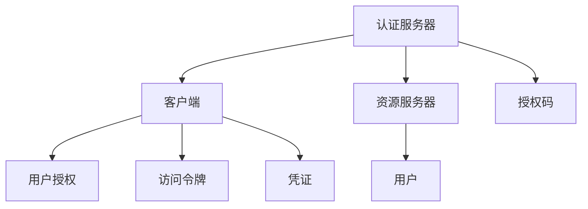
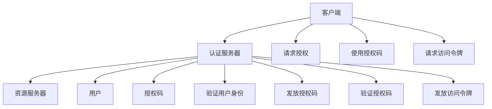
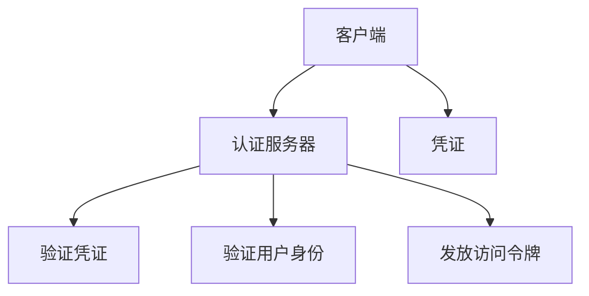
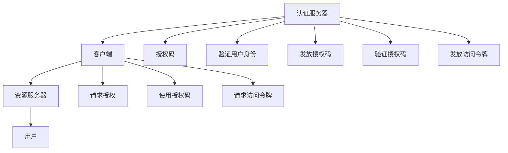

                 

# OAuth 2.0 的跨应用集成

> 关键词：OAuth 2.0, 跨应用集成, 身份认证, 访问控制, 安全协议, 身份认证与授权, 认证中心, 用户授权

## 1. 背景介绍

### 1.1 问题由来

在当前互联网环境中，跨应用、跨平台的身份认证与授权变得尤为普遍。用户希望在多个应用中无需重复输入用户名和密码，同时应用提供商也期望能够方便地控制用户对资源的访问权限。OAuth 2.0协议应运而生，通过标准化身份认证与授权机制，解决了跨应用集成的问题，极大地提升了用户体验和应用的安全性。

### 1.2 问题核心关键点

OAuth 2.0 协议的核心在于利用用户授权机制，实现身份认证与授权的分离。其设计理念是“不泄露密码”，即用户授权给应用后，应用能够以用户身份访问授权的资源，但不会知道用户的密码。核心组件包括认证服务器（Authorization Server）、资源服务器（Resource Server）和客户端（Client），它们通过标准化的请求和响应流程完成身份认证与授权的交互。

### 1.3 问题研究意义

OAuth 2.0 的跨应用集成对于提升应用安全性、简化用户体验、促进应用集成和开放生态系统建设具有重要意义：

- 提升安全性：通过分离身份认证和授权过程，减少了密码泄露的风险。
- 简化用户体验：用户只需一次授权，即可在不同应用间安全访问。
- 促进应用集成：跨应用的身份认证与授权标准，促进了应用间的互操作性。
- 开放生态系统：开放标准有助于构建一个跨应用、跨平台的应用生态系统。

## 2. 核心概念与联系

### 2.1 核心概念概述

为更好地理解OAuth 2.0协议的跨应用集成，本节将介绍几个关键概念：

- **认证服务器（Authorization Server）**：负责颁发和验证OAuth 2.0访问令牌（Access Token），并接收和验证客户端的授权请求。
- **资源服务器（Resource Server）**：保护受保护的资源，并验证访问令牌的合法性。
- **客户端（Client）**：申请访问令牌并使用其访问受保护的资源。
- **用户（Resource Owner）**：资源的拥有者，通过认证服务器授权访问其资源。
- **访问令牌（Access Token）**：允许客户端访问受保护资源的令牌。
- **凭证（Credentials）**：客户端向认证服务器证明其身份的凭证，如客户端密钥（Client Secret）。

这些概念之间的逻辑关系可以通过以下Mermaid流程图来展示：



这个流程图展示了OAuth 2.0协议的基本流程：

1. 客户端向认证服务器请求授权码。
2. 用户授权客户端访问其资源。
3. 认证服务器发放授权码。
4. 客户端使用授权码换取访问令牌。
5. 客户端使用访问令牌访问资源服务器受保护的资源。

### 2.2 概念间的关系

这些核心概念之间存在着紧密的联系，形成了OAuth 2.0协议的完整架构。下面我通过几个Mermaid流程图来展示这些概念之间的关系。

#### 2.2.1 OAuth 2.0 协议的主要流程



这个流程图展示了OAuth 2.0协议的基本流程：

1. 客户端向认证服务器请求授权。
2. 认证服务器验证用户身份。
3. 认证服务器发放授权码。
4. 客户端使用授权码请求访问令牌。
5. 认证服务器验证授权码，发放访问令牌。
6. 客户端使用访问令牌访问资源服务器。

#### 2.2.2 认证服务器的身份验证



这个流程图展示了认证服务器如何验证客户端的凭证和用户身份，并发放访问令牌：

1. 客户端向认证服务器提交凭证。
2. 认证服务器验证凭证。
3. 认证服务器验证用户身份。
4. 认证服务器发放访问令牌。

### 2.3 核心概念的整体架构

最后，我们用一个综合的流程图来展示这些核心概念在大规模部署环境下的整体架构：



这个综合流程图展示了OAuth 2.0协议在大规模部署环境下的整体架构。通过分层的架构设计，认证服务器和资源服务器可以独立部署和扩展，提升了系统的稳定性和可维护性。

## 3. 核心算法原理 & 具体操作步骤
### 3.1 算法原理概述

OAuth 2.0协议的核心算法原理主要围绕身份认证与授权的分离，通过访问令牌实现对受保护资源的访问控制。其基本流程如下：

1. **认证与授权分离**：用户通过认证服务器授权，认证服务器发放授权码给客户端。
2. **访问令牌获取**：客户端使用授权码请求访问令牌，认证服务器验证授权码并发放访问令牌。
3. **访问控制**：客户端使用访问令牌访问资源服务器受保护的资源。

### 3.2 算法步骤详解

OAuth 2.0协议的详细步骤可以分为四个主要阶段：

1. **授权码获取阶段**：
    - 客户端向认证服务器请求授权码。
    - 认证服务器重定向用户到授权页面，用户授权。
    - 用户授权后，认证服务器发放授权码给客户端。

2. **访问令牌获取阶段**：
    - 客户端使用授权码请求访问令牌。
    - 认证服务器验证授权码，发放访问令牌。
    - 客户端获取访问令牌后，可以使用它访问受保护的资源。

3. **资源访问阶段**：
    - 客户端使用访问令牌访问资源服务器受保护的资源。
    - 资源服务器验证访问令牌的合法性，允许或拒绝访问请求。

4. **访问令牌刷新阶段**：
    - 客户端定期请求访问令牌刷新，获取新的访问令牌。
    - 认证服务器验证旧令牌的合法性，发放新的访问令牌。
    - 客户端使用新访问令牌继续访问受保护的资源。

### 3.3 算法优缺点

OAuth 2.0协议具有以下优点：

- **身份认证与授权分离**：增强了安全性，减少了密码泄露的风险。
- **灵活的授权策略**：支持多种授权模式，如授权码模式、令牌模式、密码模式等。
- **开放标准**：通用性强，广泛应用于各种应用场景。

同时，该协议也存在一些缺点：

- **复杂性**：协议流程相对复杂，需要理解和配置。
- **密钥管理**：需要管理客户端密钥，增加了运维负担。
- **依赖第三方**：认证服务器和资源服务器需要独立部署和管理。

### 3.4 算法应用领域

OAuth 2.0协议广泛应用于以下领域：

- **社交网络**：如Facebook、Twitter等，用户授权应用访问其个人资料。
- **云服务**：如AWS、Azure等，用户授权应用访问其存储和计算资源。
- **第三方支付**：如PayPal、支付宝等，用户授权应用访问其金融信息。
- **开发者平台**：如GitHub、Google Cloud Platform等，开发者授权应用访问其代码和数据。

除此之外，OAuth 2.0协议也在智能家居、物联网、车联网等领域得到了广泛应用，成为跨应用、跨平台身份认证与授权的通用标准。

## 4. 数学模型和公式 & 详细讲解 & 举例说明

### 4.1 数学模型构建

OAuth 2.0协议主要涉及以下几个数学模型：

1. **授权码获取阶段**：
   - 客户端请求授权码：
   ```
   POST /authorize HTTP/1.1
   Host: auth.example.com
   Content-Type: application/x-www-form-urlencoded

   client_id=CLIENT_ID&redirect_uri=REDIRECT_URI&response_type=code
   ```

2. **访问令牌获取阶段**：
   - 客户端使用授权码请求访问令牌：
   ```
   POST /token HTTP/1.1
   Host: auth.example.com
   Content-Type: application/x-www-form-urlencoded

   grant_type=authorization_code&code=AUTHORIZATION_CODE&redirect_uri=REDIRECT_URI&client_id=CLIENT_ID&client_secret=CLIENT_SECRET
   ```

3. **资源访问阶段**：
   - 客户端使用访问令牌访问资源：
   ```
   GET /api/resource HTTP/1.1
   Host: api.example.com
   Authorization: Bearer ACCESS_TOKEN
   ```

4. **访问令牌刷新阶段**：
   - 客户端请求访问令牌刷新：
   ```
   POST /token HTTP/1.1
   Host: auth.example.com
   Content-Type: application/x-www-form-urlencoded

   grant_type=refresh_token&refresh_token=REFRESH_TOKEN&client_id=CLIENT_ID&client_secret=CLIENT_SECRET
   ```

### 4.2 公式推导过程

以下我以授权码模式为例，推导OAuth 2.0协议的数学模型：

1. **授权码获取阶段**：
   - 客户端请求授权码：
   ```
   POST /authorize HTTP/1.1
   Host: auth.example.com
   Content-Type: application/x-www-form-urlencoded

   client_id=CLIENT_ID&redirect_uri=REDIRECT_URI&response_type=code
   ```

2. **访问令牌获取阶段**：
   - 客户端使用授权码请求访问令牌：
   ```
   POST /token HTTP/1.1
   Host: auth.example.com
   Content-Type: application/x-www-form-urlencoded

   grant_type=authorization_code&code=AUTHORIZATION_CODE&redirect_uri=REDIRECT_URI&client_id=CLIENT_ID&client_secret=CLIENT_SECRET
   ```

3. **资源访问阶段**：
   - 客户端使用访问令牌访问资源：
   ```
   GET /api/resource HTTP/1.1
   Host: api.example.com
   Authorization: Bearer ACCESS_TOKEN
   ```

4. **访问令牌刷新阶段**：
   - 客户端请求访问令牌刷新：
   ```
   POST /token HTTP/1.1
   Host: auth.example.com
   Content-Type: application/x-www-form-urlencoded

   grant_type=refresh_token&refresh_token=REFRESH_TOKEN&client_id=CLIENT_ID&client_secret=CLIENT_SECRET
   ```

### 4.3 案例分析与讲解

以GitHub的OAuth 2.0认证为例，分析其具体实现：

1. **授权码获取阶段**：
    - 客户端向GitHub请求授权码：
    ```
    https://github.com/login/oauth/authorize?client_id=CLIENT_ID&redirect_uri=REDIRECT_URI&scope=REQUIRED_SCOPES&state=STATE&response_type=code
    ```

2. **访问令牌获取阶段**：
    - 客户端使用GitHub返回的授权码请求访问令牌：
    ```
    https://github.com/login/oauth/access_token?client_id=CLIENT_ID&client_secret=CLIENT_SECRET&code=AUTHORIZATION_CODE&redirect_uri=REDIRECT_URI
    ```

3. **资源访问阶段**：
    - 客户端使用GitHub返回的访问令牌访问GitHub API：
    ```
    GET https://api.github.com/user/repos
    Authorization: Bearer ACCESS_TOKEN
    ```

4. **访问令牌刷新阶段**：
    - 客户端请求GitHub返回的访问令牌刷新令牌：
    ```
    https://github.com/login/oauth/access_token?refresh_token=REFRESH_TOKEN&client_id=CLIENT_ID&client_secret=CLIENT_SECRET
    ```

通过上述案例分析，可以看到OAuth 2.0协议在实际应用中的实现过程。GitHub的OAuth 2.0认证机制详细遵循了OAuth 2.0协议的标准流程，确保了认证过程的安全性和可靠性。

## 5. 项目实践：代码实例和详细解释说明

### 5.1 开发环境搭建

在进行OAuth 2.0实践前，我们需要准备好开发环境。以下是使用Python进行OAuth 2.0开发的环境配置流程：

1. 安装Python：从官网下载并安装Python，Python 3.x及以上版本支持OAuth 2.0。

2. 安装OAuth 2.0库：
   ```
   pip install requests
   ```

3. 配置开发环境：
   ```
   # 设置环境变量
   export OAuth_CLIENT_ID=CLIENT_ID
   export OAuth_CLIENT_SECRET=CLIENT_SECRET
   export OAuth_REDIRECT_URI=REDIRECT_URI
   ```

完成上述步骤后，即可在本地开始OAuth 2.0的开发实践。

### 5.2 源代码详细实现

这里我们以GitHub的OAuth 2.0认证为例，给出使用Python进行OAuth 2.0认证的代码实现。

```python
import requests

def get_authorization_url(client_id, redirect_uri, scopes):
    authorization_url = 'https://github.com/login/oauth/authorize'
    params = {
        'client_id': client_id,
        'redirect_uri': redirect_uri,
        'scope': ' '.join(scopes),
        'response_type': 'code'
    }
    response = requests.get(authorization_url, params=params)
    return response.url

def get_access_token(authorization_code, client_id, client_secret, redirect_uri):
    access_token_url = 'https://github.com/login/oauth/access_token'
    data = {
        'client_id': client_id,
        'client_secret': client_secret,
        'code': authorization_code,
        'redirect_uri': redirect_uri
    }
    response = requests.post(access_token_url, data=data)
    return response.json()

def get_user_info(access_token):
    user_info_url = 'https://api.github.com/user'
    headers = {
        'Authorization': f'Bearer {access_token}'
    }
    response = requests.get(user_info_url, headers=headers)
    return response.json()

# 配置客户端ID、客户端密钥、重定向URI
CLIENT_ID = 'CLIENT_ID'
CLIENT_SECRET = 'CLIENT_SECRET'
REDIRECT_URI = 'REDIRECT_URI'

# 用户授权GitHub应用访问其资源
authorization_url = get_authorization_url(CLIENT_ID, REDIRECT_URI, ['read:org'])
response = requests.get(authorization_url)

# 用户授权后，GitHub将重定向到重定向URI，返回授权码
authorization_code = response.url.split('code=')[-1]

# 使用授权码获取访问令牌
access_token = get_access_token(authorization_code, CLIENT_ID, CLIENT_SECRET, REDIRECT_URI)

# 使用访问令牌访问GitHub API获取用户信息
user_info = get_user_info(access_token)
print(user_info)
```

在上述代码中，我们定义了三个关键函数：

1. `get_authorization_url`函数：生成OAuth 2.0授权页面的URL。
2. `get_access_token`函数：使用授权码获取访问令牌。
3. `get_user_info`函数：使用访问令牌访问GitHub API获取用户信息。

这些函数通过调用GitHub的API，实现了OAuth 2.0协议的标准流程。开发者可以根据实际应用场景，灵活修改这些函数的参数和返回值，实现符合自身需求的OAuth 2.0认证功能。

### 5.3 代码解读与分析

让我们再详细解读一下关键代码的实现细节：

**get_authorization_url函数**：
- 根据客户端ID、重定向URI和必要作用域生成OAuth 2.0授权页面的URL。
- 作用域（scope）参数指定了客户端请求的访问权限。

**get_access_token函数**：
- 使用授权码请求访问令牌，返回访问令牌的信息。
- 客户端密钥（client_secret）用于身份验证，确保只有授权的客户端才能获取访问令牌。

**get_user_info函数**：
- 使用访问令牌访问GitHub API获取用户信息，包括用户ID、用户名、GitHub仓库列表等。
- 访问令牌（access_token）用于身份验证，确保只有授权的客户端才能访问GitHub API。

### 5.4 运行结果展示

假设我们在GitHub上注册了一个应用，并在开发者设置中配置了OAuth 2.0认证。运行上述代码后，系统会提示用户授权GitHub应用访问其资源，用户授权后，应用将获取访问令牌，并使用该令牌访问GitHub API获取用户信息。最终输出结果可能如下：

```
{
    "id": 12345678,
    "login": "username",
    "avatar_url": "https://avatars.githubusercontent.com/u/12345678?v=4",
    ...
}
```

可以看到，通过OAuth 2.0协议，我们成功地在GitHub上实现了认证和授权，并获取了用户信息。这为后续的资源访问和业务集成打下了坚实的基础。

## 6. 实际应用场景

### 6.1 社交网络应用

社交网络应用如Facebook、Twitter等，广泛采用OAuth 2.0协议进行用户授权和资源访问。用户可以通过授权应用，访问其个人资料、发布状态、评论点赞等。例如，Facebook用户授权Instagram应用访问其相册，Instagram应用即可获取用户的照片信息，进行智能推荐和个性化展示。

### 6.2 云服务平台

云服务平台如AWS、Azure等，也广泛采用OAuth 2.0协议进行用户授权和资源访问。云服务提供商允许用户通过OAuth 2.0协议授权应用访问其存储和计算资源，例如云存储、数据库、虚拟机等。用户授权后，应用即可访问云资源，进行数据存储、计算处理等操作。

### 6.3 第三方支付平台

第三方支付平台如PayPal、支付宝等，同样采用OAuth 2.0协议进行用户授权和资源访问。用户可以通过授权应用，访问其金融信息、支付记录、信用额度等。例如，支付宝用户授权微信应用访问其支付记录，微信应用即可获取用户的支付流水，进行理财分析、风险评估等。

### 6.4 开发者平台

开发者平台如GitHub、Google Cloud Platform等，也广泛采用OAuth 2.0协议进行用户授权和资源访问。开发者可以通过OAuth 2.0协议授权应用访问其代码、数据、文档等资源，例如GitHub仓库、代码仓库、API文档等。开发者授权后，应用即可访问GitHub资源，进行代码托管、文档阅读、API调用等操作。

## 7. 工具和资源推荐

### 7.1 学习资源推荐

为了帮助开发者系统掌握OAuth 2.0协议的理论基础和实践技巧，这里推荐一些优质的学习资源：

1. **OAuth 2.0官方文档**：OAuth 2.0基金会官方文档，详细介绍了OAuth 2.0协议的各个组成部分和实现细节。
2. **《OAuth 2.0: The Definitive Guide》书籍**：OAuth 2.0协议的权威指南，涵盖了OAuth 2.0协议的各个方面。
3. **《RESTful API设计》书籍**：介绍RESTful API的设计和实现，其中包括OAuth 2.0协议的应用。
4. **OAuth 2.0在线课程**：如Coursera、Udemy等在线课程平台上的OAuth 2.0课程，帮助开发者深入学习OAuth 2.0协议。
5. **OAuth 2.0博客和社区**：如IETF、W3C等标准化组织，以及OAuth 2.0基金会、Github等社区，提供了丰富的学习资料和实践经验。

通过对这些资源的学习实践，相信你一定能够快速掌握OAuth 2.0协议的精髓，并用于解决实际的OAuth 2.0问题。

### 7.2 开发工具推荐

高效的开发离不开优秀的工具支持。以下是几款用于OAuth 2.0开发的常用工具：

1. **OAuth 2.0客户端库**：如Python的requests-oauthlib、Java的OAuth2Client等，提供了OAuth 2.0协议的简化实现。
2. **OAuth 2.0测试工具**：如Postman、Rest-Assured等，方便测试OAuth 2.0协议的各个流程和接口。
3. **OAuth 2.0开发平台**：如Auth0、Okta等，提供了OAuth 2.0协议的托管服务，简化开发流程。
4. **OAuth 2.0日志和监控工具**：如OAuth 2.0日志审计工具、OAuth 2.0监控仪表盘，帮助开发者监控OAuth 2.0协议的安全性。

合理利用这些工具，可以显著提升OAuth 2.0开发的效率，加快创新迭代的步伐。

### 7.3 相关论文推荐

OAuth 2.0协议的发展源于学界的持续研究。以下是几篇奠基性的相关论文，推荐阅读：

1. **《OAuth 2.0 Authorization Framework》**：IETF制定的OAuth 2.0协议标准。
2. **《OAuth 2.0 for Internet of Things》**：OAuth 2.0在物联网领域的应用研究。
3. **《OAuth 2.0 Secure Access Control》**：OAuth 2.0协议的安全性分析。
4. **《OAuth 2.0 in Smartphones》**：OAuth 2.0在智能手机上的应用研究。
5. **《OAuth 2.0 in Cloud Computing》**：OAuth 2.0协议在云计算中的应用研究。

这些论文代表了大规模应用背景下的OAuth 2.0协议的发展脉络。通过学习这些前沿成果，可以帮助研究者把握学科前进方向，激发更多的创新灵感。

除上述资源外，还有一些值得关注的前沿资源，帮助开发者紧跟OAuth 2.0协议的最新进展，例如：

1. **OAuth 2.0预印本**：如IETF预印本，提供了OAuth 2.0协议的最新草案和研究进展。
2. **OAuth 2.0技术博客**：如OAuth 2.0基金会、IETF、W3C等标准化组织和社区，发布了大量的技术文章和实践案例。
3. **OAuth 2.0会议和研讨会**：如IETF会议、OAuth 2.0大会、Github开发者日等，提供了OAuth 2.0协议的最新动态和实践经验。

通过关注这些前沿资源，可以保持对OAuth 2.0协议的深入理解和实践前沿，不断提升自己的专业水平。

## 8. 总结：未来发展趋势与挑战

### 8.1 总结

本文对OAuth 2.0协议的跨应用集成进行了全面系统的介绍。首先阐述了OAuth 2.0协议的背景和意义，明确了其身份认证与授权分离的设计理念。其次，从原理到实践，详细讲解了OAuth 2.0协议的标准流程和关键步骤，给出了OAuth 2.0认证的代码实例。同时，本文还广泛探讨了OAuth 2.0协议在社交网络、云服务、第三方支付、开发者平台等多个领域的应用前景，展示了OAuth 2.0协议的广泛应用。最后，本文精选了OAuth 2.0协议的学习资源、开发工具和相关论文，力求为读者提供全方位的技术指引。

通过本文的系统梳理，可以看到，OAuth 2.0协议在身份认证与授权领域的应用已经相当成熟，成为跨应用、跨平台身份认证与授权的通用标准。未来，随着技术的不断演进和应用场景的扩展，OAuth 2.0协议将面临新的挑战和机遇，需要持续创新和优化。

### 8.2 未来发展趋势

展望未来，OAuth 2.0协议的发展趋势主要体现在以下几个方面：

1. **安全性提升**：随着OAuth 2.0协议的广泛应用，安全性问题变得尤为突出。未来需要进一步提升OAuth 2.0协议的安全性，如采用更安全的加密算法、增强授权码的验证机制、引入多因素认证等。

2. **跨平台互操作性**：随着物联网、移动应用、智能设备等领域的扩展，OAuth 2.0协议需要支持更多平台和设备。未来需要实现跨平台、跨设备的互操作性，如OAuth 2.0 for IoT、OAuth 2.0 for Smartphones等。

3. **微服务架构支持**：随着微服务架构的普及，OAuth 2.0协议需要支持微服务化的身份认证与授权。未来需要引入OAuth 2.0微服务插件、OAuth 2.0微服务治理等技术，提升OAuth 2.0协议的灵活性和可扩展性。

4. **隐私保护增强**：随着用户隐私意识的提升，OAuth 2.0协议需要进一步加强对用户隐私的保护。未来需要引入隐私增强技术，如差分隐私、匿名化处理等，确保用户数据的安全性。

5. **自动化和智能化**：随着人工智能技术的发展，OAuth 2.0协议需要引入自动化和智能化技术，提升用户体验和运营效率。未来需要引入OAuth 2.0自动化管理工具、OAuth 2.0智能推荐系统等技术，优化用户体验和资源利用率。

### 8.3 面临的挑战

尽管OAuth 2.0协议已经取得了显著成就，但在迈向更加智能化、普适化应用的过程中，它仍面临着诸多

