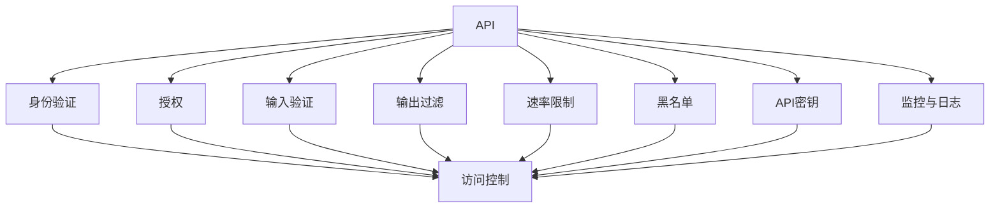

                 

# OWASP API 安全风险清单解读

> 关键词：API安全, OWASP, 安全风险, 清单解读, 防御策略

## 1. 背景介绍

在当今数字化时代，API（Application Programming Interface）是连接应用系统的桥梁，支持跨系统和跨平台的数据交换、业务逻辑整合和第三方服务调用。然而，API的广泛应用也带来了新的安全挑战。为了帮助开发者识别和缓解API的安全风险，OWASP（Open Web Application Security Project）发布了一系列API安全风险清单，涵盖了常见的API安全问题和技术建议，为API设计和开发提供了重要参考。

### 1.1 问题由来

API的广泛使用使得数据泄露、服务中断、拒绝服务攻击等问题日益突出。据统计，80%的网络攻击针对API，而70%的安全问题源于API本身。因此，了解和应对API安全风险成为了保障系统安全的关键。

### 1.2 问题核心关键点

 OWASP API 安全风险清单包括以下几个核心关键点：

- **身份验证与授权**：确保API调用者身份的真实性，以及是否具备访问特定资源的权限。
- **输入验证与输出过滤**：防止恶意数据进入API，以及控制API输出的内容。
- **防护机制**：设置速率限制、黑名单等防护措施，防止恶意攻击。
- **认证和密钥管理**：使用安全的认证机制和密钥管理策略，确保API的安全通信。
- **监控与日志**：监控API的访问和使用情况，及时发现和响应安全事件。

### 1.3 问题研究意义

深入理解和应用OWASP API安全风险清单，对于提升API安全性、减少安全事件的发生具有重要意义：

1. **增强API安全性**：明确API安全风险，帮助开发者设计更安全的API接口。
2. **提高防护水平**：提供具体的防护措施，提升API系统的防御能力。
3. **指导合规性**：遵循行业最佳实践，确保API系统符合相关安全标准。
4. **促进跨平台互操作性**：通过统一的API安全标准，增强API系统的互操作性和兼容性。

## 2. 核心概念与联系

### 2.1 核心概念概述

- **API（Application Programming Interface）**：一组定义接口和访问协议的规则，用于不同系统或组件之间的交互。
- **身份验证（Authentication）**：验证用户身份的过程，确保只有授权用户才能访问API。
- **授权（Authorization）**：根据用户身份和权限，决定其是否能够访问API资源。
- **输入验证（Input Validation）**：检查进入API的输入数据，防止恶意代码或数据注入。
- **输出过滤（Output Filtering）**：控制API输出的内容，防止敏感信息泄露。
- **速率限制（Rate Limiting）**：限制API访问速率，防止DDoS攻击和滥用。
- **黑名单（Blacklist）**：维护一个禁止访问的黑名单，阻止恶意IP或用户。
- **API密钥（API Key）**：用于API调用认证的密钥，确保通信的机密性。
- **监控与日志（Monitoring & Logging）**：监控API使用情况，记录相关日志以便事后审计和追踪。

这些概念之间的关系可以通过以下Mermaid流程图来展示：



### 2.2 概念间的关系

以上概念构成了一个完整的API安全架构，共同保障API系统的安全运行。在实践中，这些概念相互作用，形成一个动态的安全防护体系：

- **身份验证**：是API安全的基础，确保只有合法用户才能访问。
- **授权**：在身份验证基础上，进一步限制用户的访问权限。
- **输入验证与输出过滤**：防止恶意代码注入和敏感信息泄露，保护数据安全。
- **速率限制和黑名单**：防止DDoS攻击和滥用，确保API的稳定运行。
- **API密钥管理**：确保API通信的机密性和完整性。
- **监控与日志**：监控API的使用情况，及时发现和响应安全事件，为事后审计提供依据。

这些概念相互补充，共同构建了API安全的防护体系。理解这些概念及其相互关系，是保障API安全的重要前提。

## 3. 核心算法原理 & 具体操作步骤

### 3.1 算法原理概述

API安全风险清单的防护原理主要包括以下几个方面：

1. **基于角色的访问控制**：根据用户角色分配权限，限制其访问资源。
2. **API密钥管理**：使用安全的密钥交换和存储机制，确保API通信的安全性。
3. **输入验证与输出过滤**：通过规则和算法验证输入数据，过滤恶意内容。
4. **速率限制和黑名单**：限制访问速率，维护黑名单，防止滥用和攻击。
5. **监控与日志**：实时监控API使用情况，记录日志以供事后分析。

### 3.2 算法步骤详解

以下是一个典型的API安全风险清单防护流程：

1. **身份验证**：API调用者通过认证机制提交身份信息。
2. **授权**：系统根据身份信息判断用户是否具有访问权限。
3. **输入验证**：对API输入进行验证，确保其格式和内容合法。
4. **输出过滤**：控制API输出的内容，防止敏感信息泄露。
5. **速率限制**：根据API调用情况，限制访问速率。
6. **黑名单**：根据黑名单机制，拒绝黑名单中的IP或用户。
7. **API密钥管理**：确保API通信的机密性和完整性。
8. **监控与日志**：记录API调用日志，实时监控使用情况。

### 3.3 算法优缺点

#### 优点

- **系统性强**：清单提供了全面的安全防护措施，涵盖API的各个环节。
- **易于实施**：每项措施都有具体的技术实现建议，易于实施和部署。
- **社区支持**：清单得到了OWASP社区的支持，有丰富的文档和工具资源。

#### 缺点

- **复杂度高**：清单中的每项措施都需要综合考虑，增加了系统复杂度。
- **过度设计**：对于小型API系统，部分措施可能显得过于复杂。
- **动态性不足**：清单中的防护措施相对静态，难以应对新的安全威胁。

### 3.4 算法应用领域

OWASP API安全风险清单适用于各种规模的API系统，特别是在以下领域具有重要应用：

- **金融行业**：涉及大量敏感数据的API，需要严格的身份验证和授权机制。
- **电商行业**：用户注册、支付等关键API需要防止DDoS攻击和数据泄露。
- **云服务提供商**：云API需要保证数据的机密性和完整性，防止恶意访问。
- **物联网**：物联网设备通过API进行通信，需要防止数据泄露和未授权访问。
- **企业内部系统**：企业内部API需要控制访问权限，防止内部威胁。

## 4. 数学模型和公式 & 详细讲解 & 举例说明

### 4.1 数学模型构建

假设一个API系统需要进行输入验证，其数学模型可以表示为：

$$
f(x) = 
\begin{cases}
1 & \text{if } x \text{ 合法} \\
0 & \text{if } x \text{ 非法}
\end{cases}
$$

其中，$x$ 表示API输入数据，$f(x)$ 表示验证结果。

### 4.2 公式推导过程

对于输入验证，可以使用以下规则进行推导：

1. **格式检查**：验证输入数据是否符合预设格式。
2. **内容检查**：检查输入数据中是否包含敏感字符或非法代码。
3. **长度检查**：限制输入数据的长度范围。
4. **正则表达式**：使用正则表达式匹配输入数据的模式。

以格式检查为例，其公式推导如下：

$$
f(x) = 
\begin{cases}
1 & \text{if } \text{match pattern}(x) = \text{True} \\
0 & \text{if } \text{match pattern}(x) = \text{False}
\end{cases}
$$

其中，$\text{match pattern}(x)$ 表示检查输入数据是否符合预设模式。

### 4.3 案例分析与讲解

**案例：验证API输入数据的长度**

```python
def validate_length(x):
    pattern = re.compile(r'^[A-Za-z0-9]{6,16}$')
    return 1 if pattern.match(x) else 0
```

**讲解**：使用正则表达式验证输入数据的长度是否在6到16个字符之间，符合条件的返回1，否则返回0。

## 5. 项目实践：代码实例和详细解释说明

### 5.1 开发环境搭建

#### 5.1.1 安装依赖

```bash
pip install flask flask-restful
```

#### 5.1.2 配置环境

创建一个flask应用，并在app.py中配置API路由和请求处理函数：

```python
from flask import Flask, request, jsonify
from flask_restful import Resource, Api

app = Flask(__name__)
api = Api(app)

# 配置API路由
api.add_resource(HelloWorld, '/')

class HelloWorld(Resource):
    def get(self):
        x = request.args.get('x')
        result = validate_length(x)
        return jsonify({'result': result})
```

### 5.2 源代码详细实现

在validate_length函数中，使用正则表达式进行输入验证，代码如下：

```python
import re

def validate_length(x):
    pattern = re.compile(r'^[A-Za-z0-9]{6,16}$')
    return 1 if pattern.match(x) else 0
```

### 5.3 代码解读与分析

**代码解读**：

- **正则表达式**：使用`re.compile`创建正则表达式对象，匹配输入数据是否符合预设格式。
- **返回值处理**：根据匹配结果返回1或0，作为API验证结果。

**性能分析**：

- **时间复杂度**：$O(n)$，其中$n$为输入数据长度。
- **空间复杂度**：$O(1)$，只使用固定大小的变量。

### 5.4 运行结果展示

运行应用，访问`http://localhost:5000/?x=1234567890`，返回结果为`{'result': 1}`，表示输入数据合法。

```json
{
    "result": 1
}
```

## 6. 实际应用场景

### 6.1 金融行业

在金融行业中，API用于资金转账、账户查询等关键业务。由于涉及大量敏感数据，API安全至关重要。通过OWASP API安全风险清单，可以采取以下措施：

- **身份验证**：使用OAuth2、API密钥等机制进行身份验证。
- **授权**：根据用户角色分配权限，限制访问权限。
- **输入验证与输出过滤**：防止SQL注入、XSS攻击等。
- **速率限制**：防止DDoS攻击和滥用。
- **API密钥管理**：使用HTTPS、HMAC等技术确保通信安全。
- **监控与日志**：实时监控API使用情况，记录日志以供审计。

### 6.2 电商行业

电商行业的API涉及订单管理、支付处理等核心业务。为了防止数据泄露和滥用，可以采用以下防护措施：

- **身份验证**：使用用户名密码、SMS验证等机制进行身份验证。
- **授权**：限制用户对订单、库存等关键数据的访问。
- **输入验证与输出过滤**：防止SQL注入、XSS攻击等。
- **速率限制**：防止DDoS攻击和滥用。
- **API密钥管理**：使用HTTPS、HMAC等技术确保通信安全。
- **监控与日志**：实时监控API使用情况，记录日志以供审计。

### 6.3 云服务提供商

云服务提供商的API需要确保数据的安全性和可用性。通过OWASP API安全风险清单，可以采取以下措施：

- **身份验证**：使用OAuth2、API密钥等机制进行身份验证。
- **授权**：根据用户角色分配权限，限制访问权限。
- **输入验证与输出过滤**：防止SQL注入、XSS攻击等。
- **速率限制**：防止DDoS攻击和滥用。
- **API密钥管理**：使用HTTPS、HMAC等技术确保通信安全。
- **监控与日志**：实时监控API使用情况，记录日志以供审计。

### 6.4 物联网

物联网设备通过API进行数据传输和控制。为了保障数据安全，可以采用以下防护措施：

- **身份验证**：使用设备认证、API密钥等机制进行身份验证。
- **授权**：限制设备对敏感数据的访问。
- **输入验证与输出过滤**：防止SQL注入、XSS攻击等。
- **速率限制**：防止DDoS攻击和滥用。
- **API密钥管理**：使用HTTPS、HMAC等技术确保通信安全。
- **监控与日志**：实时监控API使用情况，记录日志以供审计。

## 7. 工具和资源推荐

### 7.1 学习资源推荐

- **OWASP API安全指南**：
  - [OWASP API Security Guide](https://owasp.org/www-project-api-security-guide/)
  - [OWASP API Security Cheat Sheet](https://owasp.org/www-project-api-security-cheat-sheet/)
- **Flask Web开发教程**：
  - [Flask官方文档](https://flask.palletsprojects.com/en/2.x/)
  - [Flask-RESTful文档](https://flask-restful.readthedocs.io/en/latest/)
- **正则表达式教程**：
  - [正则表达式30分钟入门教程](https://regexr.com/)
  - [Python正则表达式文档](https://docs.python.org/3/library/re.html)

### 7.2 开发工具推荐

- **Flask**：轻量级的Python Web框架，易于上手。
- **Flask-RESTful**：基于Flask的RESTful Web服务扩展，方便实现API接口。
- **Swagger**：用于API文档生成和测试的工具，支持多种API框架。
- **Postman**：API测试和调试工具，支持多种协议和格式。

### 7.3 相关论文推荐

- **OWASP API安全指南**：
  - [OWASP API Security Guide](https://owasp.org/www-project-api-security-guide/)
  - [OWASP API Security Cheat Sheet](https://owasp.org/www-project-api-security-cheat-sheet/)
- **Flask Web开发教程**：
  - [Flask官方文档](https://flask.palletsprojects.com/en/2.x/)
  - [Flask-RESTful文档](https://flask-restful.readthedocs.io/en/latest/)
- **正则表达式教程**：
  - [正则表达式30分钟入门教程](https://regexr.com/)
  - [Python正则表达式文档](https://docs.python.org/3/library/re.html)

## 8. 总结：未来发展趋势与挑战

### 8.1 研究成果总结

OWASP API安全风险清单为API系统的安全防护提供了系统的指导和建议，涵盖身份验证、授权、输入验证、输出过滤、速率限制、黑名单、API密钥管理和监控与日志等多个方面。清单的广泛应用，显著提升了API系统的安全性，保护了用户数据和系统资源。

### 8.2 未来发展趋势

未来API安全的发展趋势包括以下几个方面：

1. **自动化防护**：使用机器学习和人工智能技术，实现自动化的安全防护，提高防护效率。
2. **零信任架构**：采用零信任安全模型，在API系统中实现细粒度的访问控制。
3. **微服务安全**：在微服务架构中，对每个服务进行单独的防护，提升系统安全性。
4. **云安全**：在云环境中，对API进行分布式、多层次的安全防护，应对云环境下的新威胁。
5. **动态安全策略**：根据API使用情况，动态调整防护策略，确保系统始终处于安全状态。

### 8.3 面临的挑战

尽管OWASP API安全风险清单为API安全提供了重要指导，但在实际应用中仍面临一些挑战：

1. **复杂性高**：清单中的每项措施都需要综合考虑，增加了系统复杂度。
2. **动态性不足**：清单中的防护措施相对静态，难以应对新的安全威胁。
3. **性能影响**：某些防护措施（如速率限制、黑名单等）可能会影响API的性能和可用性。
4. **缺乏标准化**：不同API系统采用的防护措施可能存在差异，缺乏统一的标准化。

### 8.4 研究展望

未来API安全的研究方向包括：

1. **自动化防护技术**：研究机器学习和人工智能在API安全防护中的应用，提高防护效率。
2. **零信任架构**：探索零信任安全模型，实现细粒度的访问控制。
3. **微服务安全**：在微服务架构中，对每个服务进行单独的防护，提升系统安全性。
4. **云安全**：在云环境中，对API进行分布式、多层次的安全防护，应对云环境下的新威胁。
5. **动态安全策略**：根据API使用情况，动态调整防护策略，确保系统始终处于安全状态。

## 9. 附录：常见问题与解答

**Q1：API安全清单中的每项措施都需要实现吗？**

A: 根据API系统的具体情况，选择合适的防护措施。清单中的每项措施都具有重要的防护价值，但并不一定需要全部实现。例如，对于小型API系统，速率限制和黑名单可能显得过于复杂，可以酌情简化。

**Q2：API安全清单是否适用于所有API系统？**

A: 清单适用于各种规模和类型的API系统，特别是涉及敏感数据和核心业务的API。对于简单的API系统，清单中的部分措施可能过于复杂，需要根据实际情况进行调整。

**Q3：API密钥管理有哪些最佳实践？**

A: API密钥管理的最佳实践包括：
1. 使用HTTPS和HMAC确保通信安全。
2. 定期更换密钥，避免密钥泄露。
3. 对密钥进行分级管理，限制访问权限。
4. 对密钥使用进行审计，记录日志。

**Q4：API输入验证有哪些常见技术？**

A: API输入验证的常见技术包括：
1. 正则表达式匹配。
2. 白名单和黑名单过滤。
3. 输入格式化。
4. 数据类型验证。
5. 数据库和缓存限制。

**Q5：API监控与日志有哪些重要指标？**

A: API监控与日志的重要指标包括：
1. 访问次数和频率。
2. 请求时间和响应时间。
3. 请求来源和IP地址。
4. 请求方法、路径和参数。
5. 异常和错误记录。

通过以上解答，可以更好地理解OWASP API安全风险清单，并将其应用于实际API系统的防护中。

---

作者：禅与计算机程序设计艺术 / Zen and the Art of Computer Programming

