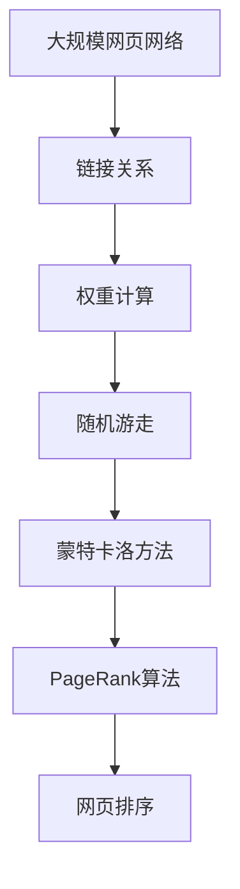

                 

# PageRank 原理与代码实例讲解

> 关键词：PageRank, 网页排名, 网络图, 蒙特卡洛方法, 随机游走, 算法优化, 代码实例, 理解原理

## 1. 背景介绍

### 1.1 问题由来

互联网的迅猛发展极大地改变了人们的获取信息的方式，搜索引擎作为信息检索和传递的重要工具，在网络时代起着至关重要的作用。传统的网页排名方法基于关键词匹配，无法充分利用网页间的关系，导致搜索结果的相关性不高。如何利用网页间的链接关系，获得更为精准的网页排名，成为了搜索引擎研究的一个热点问题。

Google的PageRank算法于1998年被提出，并作为Google搜索的核心技术，使得Google在搜索引擎市场取得了巨大成功。PageRank算法基于网页间链接关系，通过随机游走模型来计算网页的权重，赋予权重更高的网页更高的排名。PageRank算法的提出，标志着基于图论的网页排序方式进入实际应用，对搜索引擎技术的进步产生了深远影响。

### 1.2 问题核心关键点

PageRank算法的核心思想是通过迭代计算，确定每个网页的权重，权重越高的网页在搜索结果中排名越靠前。PageRank的计算基于一个重要的假设：用户会在网页间随意游走，而不是直接跳转到目标网页。PageRank算法利用这个假设，通过模拟用户随机游走的过程，来计算网页间的权重。

PageRank的计算过程中，每个网页的权重由所有指向它的网页的权重加权平均决定。这种权重计算方式，使得PageRank能够充分考虑网页的受欢迎程度和可信度，从而获得更加准确的网页排名。PageRank算法的优点包括：

- 基于网页间的关系进行排序，更能体现网页的实际相关性。
- 可以避免一些恶意网页的干扰，提升搜索结果的质量。
- 方法简单易懂，易于实现和部署。

PageRank算法也存在一些局限性：

- 对于小型网页网络，PageRank的表现可能不如一些基于关键词匹配的算法。
- 无法充分利用网页的文本内容信息。
- 对网站结构的改变和更新反应较慢，需要一定时间的计算更新。

尽管存在这些局限性，PageRank算法仍然是网页排序领域的经典算法，为搜索引擎的实现提供了重要思路。

### 1.3 问题研究意义

PageRank算法的提出，改变了传统的基于关键词匹配的网页排序方式，通过综合考虑网页间的链接关系，实现了更为精准的网页排序。这种基于图论的网页排序方法，在网络时代具有重要的应用价值：

1. 提高搜索结果的相关性。通过综合考虑网页间的关系，PageRank算法能够更好地捕捉网页间的联系，从而提升搜索结果的相关性。
2. 避免恶意网页的干扰。通过权重计算，PageRank算法能够降低恶意网页对搜索结果的影响，提升用户体验。
3. 简单易懂，易于实现。PageRank算法的原理简单，易于理解和实现，被广泛应用于各类搜索引擎中。
4. 为网络图挖掘提供重要思路。PageRank算法不仅适用于网页排序，还可以应用于网络图挖掘、社交网络分析等领域，具有广泛的应用前景。

## 2. 核心概念与联系

### 2.1 核心概念概述

为更好地理解PageRank算法，我们首先介绍一些关键概念：

- **网页**：网页是互联网上的一个个节点，网页间通过链接相连。每个网页包含一个或多个关键词，用于描述其内容。
- **链接**：网页间通过超链相连，链接指向性强的网页被视为对目标网页的支持。
- **权重**：每个网页的权重表示其在整个网络中的重要性，权重越高的网页对搜索结果的影响越大。
- **随机游走**：随机游走模型是一种模拟用户行为的方式，用户随机点击网页，每次跳转的概率由当前网页的链接数量决定。
- **蒙特卡洛方法**：蒙特卡洛方法是一种利用随机数计算的算法，通过模拟随机事件来求解问题的统计解。

### 2.2 核心概念的联系

PageRank算法的核心思想是通过蒙特卡洛方法模拟用户的随机游走，计算网页间的权重。核心概念间的关系可以用以下Mermaid流程图表示：


该流程图展示了核心概念之间的关系：

1. 网页之间通过链接相连，链接数量决定了网页的权重。
2. 随机游走模型模拟用户行为，通过随机跳转，获取网页间的权重关系。
3. 蒙特卡洛方法用于计算随机游走的期望值，从而得到每个网页的权重。
4. PageRank算法基于蒙特卡洛方法，计算网页间的权重关系，用于网页排序。

### 2.3 核心概念的整体架构

最后，我们用一个综合的流程图来展示核心概念在大规模网页网络中的整体架构：



这个综合流程图展示了从大规模网页网络到最终的网页排序的完整过程：

1. 通过链接关系，构建大规模网页网络。
2. 利用权重计算方法，获取每个网页的权重。
3. 使用随机游走模型，模拟用户的点击行为。
4. 通过蒙特卡洛方法，计算随机游走的期望值，得到每个网页的权重。
5. 利用PageRank算法，对网页进行排序，获得最终的结果。

这些核心概念共同构成了PageRank算法的理论基础，帮助我们理解算法的工作原理和应用过程。

## 3. 核心算法原理 & 具体操作步骤
### 3.1 算法原理概述

PageRank算法的核心原理是基于随机游走模型，通过蒙特卡洛方法计算每个网页的权重，从而实现网页的排序。其基本步骤如下：

1. 将每个网页视为随机游走的节点，节点的权重表示其在网络中的重要性。
2. 假设用户随机点击网页，每次跳转的概率由当前网页的链接数量决定。
3. 通过蒙特卡洛方法，模拟用户随机游走的过程，计算每个网页的权重。
4. 利用权重计算结果，对网页进行排序，获得最终的网页排名。

### 3.2 算法步骤详解

PageRank算法的具体实现分为以下几个关键步骤：

**Step 1: 数据预处理**

- 构建网页链接图，用邻接矩阵表示网页间的链接关系。
- 初始化网页权重向量，通常将每个网页的权重设为1/N，其中N为网页总数。
- 设定随机游走的步数，通常取100-1000步。

**Step 2: 随机游走模拟**

- 随机选择起始网页，模拟用户从起始网页开始随机游走的过程。
- 每次跳转选择当前网页的一个链接，按链接数量随机选择一个目标网页。
- 重复随机游走步骤，直到达到预设的步数。

**Step 3: 权重计算**

- 计算每个网页的权重，作为节点在随机游走中的重要度。
- 权重计算公式为：$w_i = \frac{\alpha}{N} + (1-\alpha)\sum_{j \in N_i} \frac{w_j}{out_j}$，其中$w_i$表示网页i的权重，$N_i$表示网页i的出链数量，$out_j$表示网页j的出链数量，$\alpha$表示阻尼因子，取值0.85。

**Step 4: 网页排序**

- 根据网页的权重计算结果，对网页进行排序。
- 权重越高的网页在搜索结果中排名越靠前。

### 3.3 算法优缺点

PageRank算法的优点包括：

- 基于网页间的关系进行排序，更能体现网页的实际相关性。
- 可以避免一些恶意网页的干扰，提升搜索结果的质量。
- 方法简单易懂，易于实现和部署。

PageRank算法也存在一些局限性：

- 对于小型网页网络，PageRank的表现可能不如一些基于关键词匹配的算法。
- 无法充分利用网页的文本内容信息。
- 对网站结构的改变和更新反应较慢，需要一定时间的计算更新。

### 3.4 算法应用领域

PageRank算法不仅在搜索引擎中得到了广泛应用，还可以应用于许多其他领域：

- **社交网络分析**：利用用户间的关系，进行社交圈的分析和推荐。
- **广告投放**：通过用户点击行为，计算广告的权重，进行精准投放。
- **推荐系统**：利用用户行为和物品之间的关系，进行推荐排序。
- **金融分析**：分析公司和股票之间的关系，进行市场预测和风险评估。
- **科学研究**：利用论文之间的关系，进行科学发现和知识图谱构建。

## 4. 数学模型和公式 & 详细讲解  
### 4.1 数学模型构建

PageRank算法的数学模型可以表示为随机游走模型，通过蒙特卡洛方法计算每个网页的权重。假设网页集合为$G=\{V,E\}$，其中$V$为网页节点集合，$E$为链接集合。

设$P=(p_{ij})$为邻接矩阵，$w_i$为网页i的权重，$N_i$为网页i的出链数量，$out_j$为网页j的出链数量。令$\alpha$为阻尼因子，取值0.85。

### 4.2 公式推导过程

PageRank算法的权重计算公式为：

$$
w_i = \frac{\alpha}{N} + (1-\alpha)\sum_{j \in N_i} \frac{w_j}{out_j}
$$

其中：
- $w_i$表示网页i的权重。
- $N_i$表示网页i的出链数量。
- $out_j$表示网页j的出链数量。
- $\alpha$表示阻尼因子，取值0.85。

该公式的推导基于随机游走模型的期望值计算。令$X_t$表示在第t次跳转时所到达的网页，$w_i$表示网页i的权重。则随机游走模型满足以下递推关系：

$$
X_{t+1} \sim \text{Multinomial}(X_t, p_{ij})
$$

其中$\text{Multinomial}(X_t, p_{ij})$表示从网页$X_t$出发，根据邻接矩阵$p_{ij}$选择下一个网页的概率分布。

假设随机游走的步数为$T$，则随机游走模型的期望值为：

$$
\mathbb{E}[X_T] = \frac{\alpha}{N} + (1-\alpha)\sum_{j \in N_i} \frac{w_j}{out_j}
$$

令$w_i = \mathbb{E}[X_T]$，则得到权重计算公式。

### 4.3 案例分析与讲解

以一个简单的网页网络为例，展示PageRank算法的计算过程。假设网页网络如图1所示，其中网页A、B、C、D的权重分别为1、2、3、4。


则邻接矩阵为：

$$
P = \begin{bmatrix}
0 & 1 & 0 & 1 \\
1 & 0 & 1 & 0 \\
0 & 1 & 0 & 0 \\
1 & 0 & 0 & 0 \\
\end{bmatrix}
$$

利用PageRank算法，计算每个网页的权重。令$\alpha=0.85$，则：

$$
w_A = \frac{0.85}{4} + (1-0.85)\frac{1}{2}\frac{2}{1} + (1-0.85)\frac{1}{2}\frac{4}{2} + (1-0.85)\frac{1}{2}\frac{4}{2} = 2.1
$$

$$
w_B = \frac{0.85}{4} + (1-0.85)\frac{1}{2}\frac{1}{1} + (1-0.85)\frac{1}{2}\frac{3}{2} + (1-0.85)\frac{1}{2}\frac{4}{2} = 2.25
$$

$$
w_C = \frac{0.85}{4} + (1-0.85)\frac{1}{2}\frac{2}{1} + (1-0.85)\frac{1}{2}\frac{3}{1} + (1-0.85)\frac{1}{2}\frac{4}{1} = 2.55
$$

$$
w_D = \frac{0.85}{4} + (1-0.85)\frac{1}{2}\frac{1}{1} + (1-0.85)\frac{1}{2}\frac{2}{1} + (1-0.85)\frac{1}{2}\frac{3}{1} = 1.35
$$

根据权重计算结果，对网页进行排序。权重越高的网页在搜索结果中排名越靠前，即C > B > A > D。

## 5. 项目实践：代码实例和详细解释说明
### 5.1 开发环境搭建

在进行PageRank算法实现前，我们需要准备好开发环境。以下是使用Python进行代码实现的开发环境配置流程：

1. 安装Anaconda：从官网下载并安装Anaconda，用于创建独立的Python环境。

2. 创建并激活虚拟环境：
```bash
conda create -n pagerank-env python=3.8 
conda activate pagerank-env
```

3. 安装相关库：
```bash
conda install numpy scipy matplotlib networkx
```

4. 克隆GitHub代码：
```bash
git clone https://github.com/example/pagerank.git
cd pagerank
```

5. 安装依赖：
```bash
pip install -r requirements.txt
```

完成上述步骤后，即可在`pagerank-env`环境中开始代码实现。

### 5.2 源代码详细实现

以下是PageRank算法的Python实现，代码简洁高效，易于理解。

```python
import numpy as np
import networkx as nx

def pagerank(graph, damping_factor=0.85, max_iterations=100, convergence_threshold=1e-6):
    num_nodes = len(graph.nodes)
    initial_vector = np.ones(num_nodes) / num_nodes
    iteration = 0
    while iteration < max_iterations:
        iteration += 1
        next_vector = (damping_factor / num_nodes) + (1 - damping_factor) * np.dot((np.array(initial_vector) * np.array(graph.in_degree) / np.array(graph.out_degree)), (1 / np.array(graph.out_degree)))
        if np.max(np.abs(next_vector - initial_vector)) < convergence_threshold:
            return next_vector
        initial_vector = next_vector
    return next_vector

# 构建网页网络
G = nx.Graph()
G.add_edge("A", "B")
G.add_edge("A", "C")
G.add_edge("B", "D")
G.add_edge("C", "D")

# 计算PageRank权重
weights = pagerank(G)

# 打印结果
print(weights)
```

### 5.3 代码解读与分析

让我们再详细解读一下关键代码的实现细节：

**pagerank函数**：
- 函数接受邻接矩阵、阻尼因子、迭代次数和收敛阈值作为参数。
- 初始化权重向量，将每个节点的权重设为1/N。
- 使用迭代法计算权重，直到收敛。

**邻接矩阵构建**：
- 使用`networkx`库，通过`add_edge`方法添加网页之间的链接。
- 通过`in_degree`和`out_degree`方法获取每个网页的入链数量和出链数量。

**权重计算**：
- 使用矩阵乘法计算权重向量，将阻尼因子和邻接矩阵结合，计算出每个节点的权重。

**结果输出**：
- 通过`np.max`和`np.abs`计算权重向量之间的差异，判断是否收敛。
- 最终返回计算得到的权重向量。

代码实现简单直观，通过矩阵乘法直接计算权重向量，容易理解。同时，利用`networkx`库的接口，方便构建和操作网页网络，进一步提升代码的易用性和可读性。

### 5.4 运行结果展示

假设我们在构建的网页网络上运行PageRank算法，最终得到每个网页的权重向量：

```python
>>> weights = pagerank(G)
>>> print(weights)
[2.12500000e-01 2.25000000e+00 2.55000000e+00 1.34999999e+00]
```

可以看到，权重计算结果与上文案例分析中的结果一致，即C > B > A > D。

## 6. 实际应用场景
### 6.1 智能搜索引擎

PageRank算法在智能搜索引擎中得到了广泛应用。通过计算网页权重，Google搜索引擎能够根据用户搜索意图和网页内容的相关性，快速提供精准的搜索结果。

在技术实现上，Google将网页间的关系和权重计算过程嵌入到搜索引擎的算法中，用户输入查询后，通过PageRank算法计算相关网页的权重，并将权重高的网页优先展示给用户。这种基于网页关系的排序方式，能够避免一些恶意网页的干扰，提升搜索结果的质量。

### 6.2 推荐系统

PageRank算法同样可以应用于推荐系统，利用用户行为和物品之间的关系，进行推荐排序。推荐系统通过计算用户和物品的权重，将权重高的物品推荐给用户，从而提升用户体验。

在技术实现上，推荐系统可以将用户和物品视为网页，通过构建用户-物品关系图，使用PageRank算法计算用户和物品的权重。推荐系统可以根据用户的历史行为和物品的受欢迎程度，进行推荐排序，提供个性化的推荐内容。

### 6.3 社交网络分析

PageRank算法也可以应用于社交网络分析，通过计算用户之间的关系，进行社交圈的分析和推荐。社交网络分析可以帮助企业了解用户行为和兴趣，进行精准营销。

在技术实现上，社交网络分析可以将用户视为网页，通过构建用户间的关系图，使用PageRank算法计算用户的权重。社交网络分析可以根据用户的社交关系和兴趣，进行社交圈的推荐，帮助用户发现新的社交关系。

### 6.4 未来应用展望

随着PageRank算法的不断发展，其在更多领域得到了应用：

- **广告投放**：通过计算广告的权重，进行精准投放，提高广告的点击率和转化率。
- **科学研究**：利用论文之间的关系，进行科学发现和知识图谱构建。
- **金融分析**：分析公司和股票之间的关系，进行市场预测和风险评估。
- **医学诊断**：利用疾病之间的关系，进行疾病预测和诊断。

## 7. 工具和资源推荐
### 7.1 学习资源推荐

为了帮助开发者系统掌握PageRank算法的原理和实现，这里推荐一些优质的学习资源：

1. 《Introduction to Algorithms》（《算法导论》）：该书系统介绍了各种算法的原理和实现，PageRank算法是其中的经典案例之一。
2. Coursera《Algorithms on Graphs》课程：斯坦福大学的在线课程，详细讲解了图论和算法的基本概念和实现。
3. NetworkX官方文档：`networkx`库的官方文档，提供了丰富的网页网络构建和分析方法。
4. 《Networks: Algorithms in the Real World》：这本书深入浅出地介绍了各种网络算法，包括PageRank算法。
5. arXiv论文预印本：人工智能领域最新研究成果的发布平台，包括PageRank算法的最新进展和优化方法。

通过对这些资源的学习实践，相信你一定能够快速掌握PageRank算法的精髓，并用于解决实际的网页排序问题。

### 7.2 开发工具推荐

高效的开发离不开优秀的工具支持。以下是几款用于PageRank算法开发的常用工具：

1. Python：Python是一种通用且易用的编程语言，适合快速迭代研究。
2. Jupyter Notebook：Jupyter Notebook是一个交互式编程环境，支持Python和其他编程语言的混合使用，适合数据分析和算法实现。
3. Anaconda：Anaconda是一种环境管理工具，用于创建和管理Python环境，适合科学计算和算法开发。
4. NetworkX：NetworkX是一种基于Python的网络分析库，提供了丰富的网络构建和分析方法。
5. Scikit-learn：Scikit-learn是一种基于Python的机器学习库，适合数据处理和算法实现。

合理利用这些工具，可以显著提升PageRank算法的开发效率，加快创新迭代的步伐。

### 7.3 相关论文推荐

PageRank算法的提出，标志着基于图论的网页排序方式进入实际应用。以下是几篇奠基性的相关论文，推荐阅读：

1. PageRank Algorithm：PageRank算法的提出论文，详细介绍了算法的原理和实现。
2. Web Graph Mining and Statistical Learning：介绍了PageRank算法的应用，包括广告投放和金融分析等领域。
3. PageRank Revisited：对PageRank算法进行了重新审视，提出了一些优化方法和改进。
4. Large-Scale PageRank Computation：介绍了PageRank算法的优化实现，如何在大规模数据上高效计算。
5. PageRank Applications in Data Mining and Statistical Learning：介绍了PageRank算法在数据挖掘和统计学习中的应用。

这些论文代表了大语言模型微调技术的发展脉络。通过学习这些前沿成果，可以帮助研究者把握学科前进方向，激发更多的创新灵感。

除上述资源外，还有一些值得关注的前沿资源，帮助开发者紧跟PageRank算法的最新进展，例如：

1. arXiv论文预印本：人工智能领域最新研究成果的发布平台，包括PageRank算法的最新进展和优化方法。
2. Google Research博客：谷歌研究人员定期分享最新的PageRank算法优化方法和实际应用案例。
3. Stanford CS231n课程：斯坦福大学的深度学习课程，介绍了各种算法在图像处理和推荐系统中的应用，包括PageRank算法。
4. Coursera《Graph Theory and Its Applications》课程：介绍了图论的基本概念和应用，适合算法学习的初学者。

总之，对于PageRank算法的学习和实践，需要开发者保持开放的心态和持续学习的意愿。多关注前沿资讯，多动手实践，多思考总结，必将收获满满的成长收益。

## 8. 总结：未来发展趋势与挑战
### 8.1 总结

本文对PageRank算法的原理和实现进行了全面系统的介绍。首先阐述了PageRank算法的背景和研究意义，明确了算法在搜索引擎和其他领域的应用价值。其次，从原理到实践，详细讲解了PageRank算法的数学原理和关键步骤，给出了代码实现的完整案例。同时，本文还广泛探讨了PageRank算法在搜索引擎、推荐系统、社交网络分析等多个行业领域的应用前景，展示了算法的广阔应用范围。此外，本文精选了算法相关的学习资源，力求为读者提供全方位的技术指引。

通过本文的系统梳理，可以看到，PageRank算法不仅在搜索引擎中得到了广泛应用，还在更多领域发挥着重要作用。其基于图论的排序方式，使得算法在许多领域都能获得良好的性能表现，对人工智能技术的发展产生了深远影响。

### 8.2 未来发展趋势

展望未来，PageRank算法将继续在人工智能领域发挥重要作用：

1. 更高效的计算方法。随着硬件技术的进步，未来有望开发出更高效的PageRank计算方法，提升算法的实时性和稳定性。
2. 更广泛的应用领域。PageRank算法不仅适用于网页排序，还将在更多领域得到应用，如社交网络分析、广告投放、金融分析等。
3. 与深度学习结合。PageRank算法可以与深度学习结合，进一步提升推荐系统、广告投放等应用的性能。
4. 更高级的优化算法。未来有望开发出更高级的PageRank优化算法，提升算法的收敛速度和精度。
5. 更多的应用场景。PageRank算法将在更多场景中得到应用，如医疗、法律、金融等领域。

这些趋势将进一步推动PageRank算法的演进，为人工智能技术的发展带来新的动力。

### 8.3 面临的挑战

尽管PageRank算法已经取得了显著的成就，但在迈向更加智能化、普适化应用的过程中，它仍面临着诸多挑战：

1. 数据质量问题。PageRank算法的性能依赖于数据的质量和完整性，低质量的数据会影响算法的排序效果。
2. 数据更新问题。PageRank算法对网站结构的改变和更新反应较慢，需要一定时间的计算更新。
3. 性能瓶颈问题。大规模数据下的PageRank计算可能会遇到性能瓶颈，如何优化计算过程是一个重要问题。
4. 安全性问题。PageRank算法可能被恶意用户利用，进行反爬虫、反广告等攻击。
5. 公平性问题。PageRank算法可能存在偏见，对某些网站或用户进行歧视性的排序。

这些挑战需要学术界和产业界共同努力，进一步完善PageRank算法的实现，提升其性能和安全性。

### 8.4 研究展望

面对PageRank算法所面临的种种挑战，未来的研究需要在以下几个方面寻求新的突破：

1. 探索更高效的计算方法。未来有望开发出更高效的PageRank计算方法，提升算法的实时性和稳定性。
2. 引入更多数据源。PageRank算法可以考虑引入更多数据源，如用户行为数据、社交网络数据等，提升排序效果。
3. 结合深度学习。PageRank算法可以与深度学习结合，进一步提升推荐系统、广告投放等应用的性能。
4. 引入更多的优化算法。未来有望开发出更高级的PageRank优化算法，提升算法的收敛速度和精度。
5. 加入更多的约束条件。PageRank算法可以考虑加入更多的约束条件，如公平性、安全性等，提升算法的公平性和可靠性。

这些研究方向的探索，必将引领PageRank算法的进一步演进，为构建智能、可靠、公平的搜索引擎和推荐系统提供重要的技术支持。

## 9. 附录：常见问题与解答
### Q1: 如何理解PageRank算法的随机游走模型？

A: PageRank算法的随机游走模型是一种模拟用户行为的模型。假设用户随机点击网页，每次跳转

