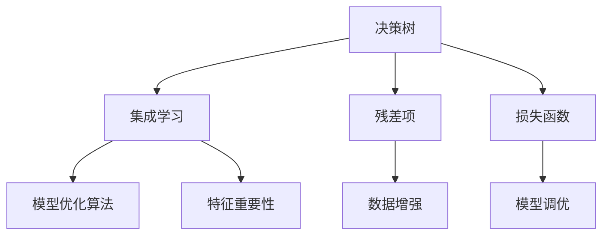
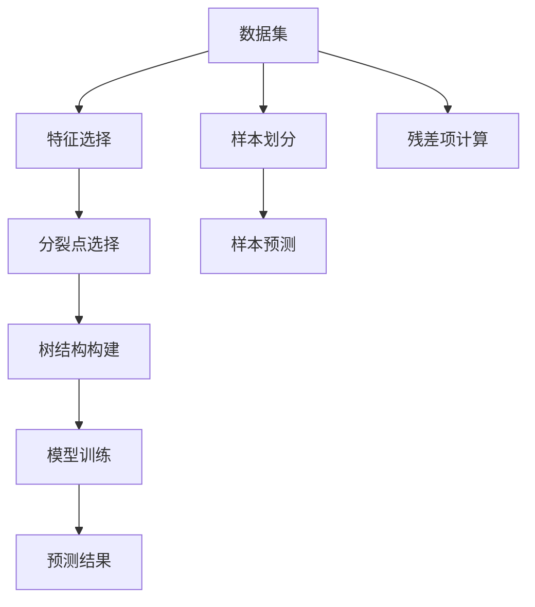
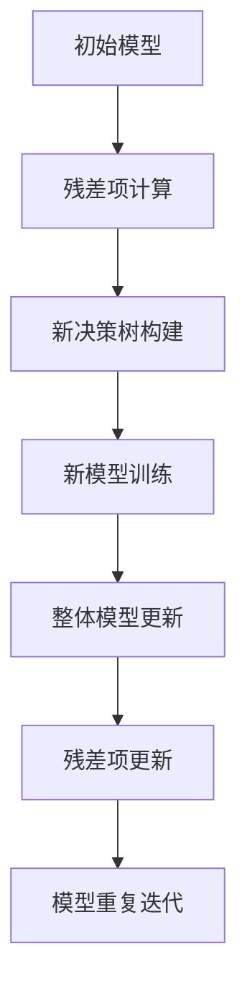
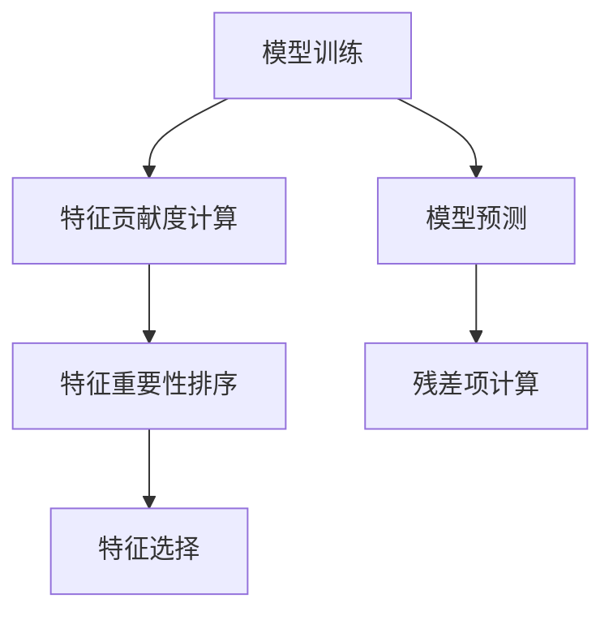
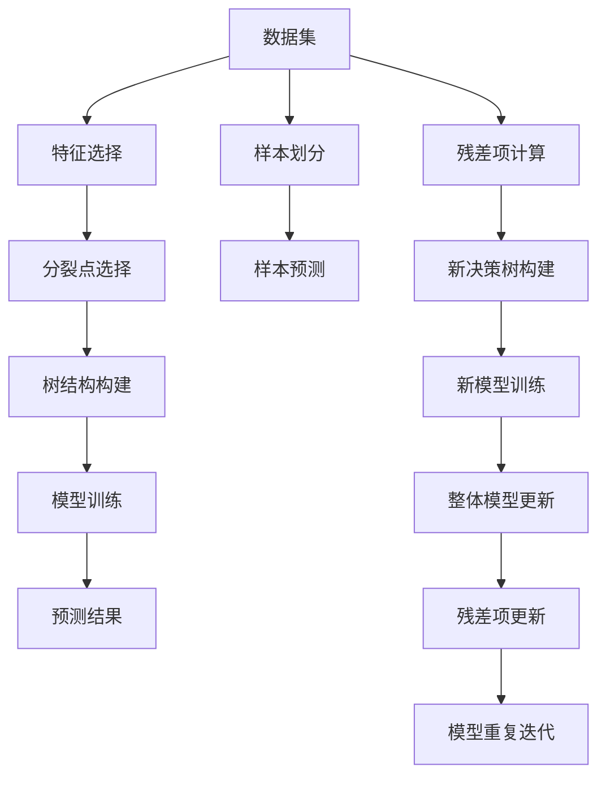

                 

# Python机器学习实战：梯度提升树(Gradient Boosting)算法深入理解

> 关键词：
1. 梯度提升树(Gradient Boosting Trees, GBT)
2. 决策树(Decision Trees)
3. 集成学习(Ensemble Learning)
4. 模型优化算法(Optimization Algorithms)
5. 特征重要性(Feature Importance)
6. 数据增强(Data Augmentation)
7. 模型调优(Model Tuning)

## 1. 背景介绍

### 1.1 问题由来

随着人工智能和机器学习技术的飞速发展，梯度提升树（Gradient Boosting Trees, GBT）已成为机器学习领域中最强大的算法之一。GBT结合了决策树的简单性和强大的集成学习方法，通过逐渐迭代的方式，不断提升模型的精度，具有高准确性和良好的泛化能力。

GBT最初由Friedman于2001年提出，并在后续的发展中通过Hastie等人改进，成为如今机器学习领域中的重要工具。GBT不仅应用于预测和分类任务，还被广泛应用于回归、多目标优化等场景。

### 1.2 问题核心关键点

GBT的核心思想是构建一系列决策树，每棵树都从之前树的残差项中学习。残差项是通过实际值与模型预测值之间的差异来计算的。每棵树的训练都是为了最大化这些残差项，从而减少整体的误差。

具体来说，GBT的优化目标如下：

$$
minimize \sum_{i=1}^N \mathcal{L}(y_i, f_1(x_i) + f_2(x_i) + \ldots + f_M(x_i))
$$

其中，$N$为样本数，$y_i$为第$i$个样本的实际标签，$f_j(x_i)$为第$j$棵决策树在样本$x_i$上的预测结果，$\mathcal{L}$为损失函数。

GBT的构建过程通常分为以下几个步骤：
1. 初始化一个常数模型（如平均预测值）。
2. 计算当前模型的残差项。
3. 构建新的决策树，以减少这些残差项。
4. 重复步骤2和3，直到达到预定的停止条件（如达到最大树数、残差项小于阈值等）。

GBT的迭代过程可以看作是一个正则化的优化问题，通过不断调整决策树的参数，最小化整体误差。这种思想与传统的决策树方法有所不同，后者通常仅关注单个决策树的拟合效果。

### 1.3 问题研究意义

GBT作为一种高效的集成学习方法，在众多机器学习任务上展示了卓越的性能。其背后的原理和算法设计深刻地影响着机器学习的发展方向和实践应用。研究GBT的原理和应用，对理解机器学习中的集成学习范式具有重要意义。

此外，GBT还在金融风控、电商推荐、医疗预测等领域得到了广泛应用，带来了显著的业务价值。研究GBT的应用场景，有助于开发者更好地将其应用于实际项目，推动相关行业的智能化转型。

## 2. 核心概念与联系

### 2.1 核心概念概述

为了深入理解GBT的核心思想和算法流程，本节将介绍几个关键概念及其相互联系：

1. **决策树(Decision Trees)**：一种基于树形结构的分类模型，通过划分数据特征来进行分类决策。决策树的训练过程可以通过贪心策略（如信息增益、基尼不纯度等）逐步优化。

2. **集成学习(Ensemble Learning)**：通过组合多个模型的预测结果，来提高整体的性能。集成学习可以分为Bagging和Boosting两类，其中Boosting方法通过迭代训练，不断调整模型参数，提升模型的预测能力。

3. **残差项(Residuals)**：目标变量与模型预测值之间的差异，用于评估模型的不足，并指导后续模型的改进。

4. **损失函数(Loss Function)**：用于衡量模型预测值与实际值之间的差异，常用的损失函数包括均方误差、交叉熵等。

5. **模型优化算法(Optimization Algorithms)**：用于求解模型参数的算法，如梯度下降法、牛顿法等，可以通过迭代求解的方式最小化损失函数。

6. **特征重要性(Feature Importance)**：衡量模型中各个特征对预测结果的影响程度，通常通过特征贡献度、特征权重等指标来衡量。

7. **数据增强(Data Augmentation)**：通过增加样本的多样性，提升模型的泛化能力。数据增强可以包括样本翻转、旋转、噪声添加等操作。

8. **模型调优(Model Tuning)**：通过调整模型的超参数、优化算法等，使模型在特定的训练集上达到最优性能。

这些概念之间的逻辑关系可以通过以下Mermaid流程图来展示：



这个流程图展示了决策树、集成学习、残差项、损失函数、模型优化算法、特征重要性、数据增强和模型调优这些核心概念的相互关系，共同构成了GBT的完整算法流程。

### 2.2 概念间的关系

这些核心概念之间存在着紧密的联系，形成了GBT算法的整体框架。下面我们通过几个Mermaid流程图来展示这些概念之间的关系。

#### 2.2.1 决策树的构建



这个流程图展示了决策树的构建过程。从数据集出发，通过特征选择和分裂点选择，构建决策树结构，然后进行模型训练，并计算残差项。

#### 2.2.2 集成学习的迭代



这个流程图展示了集成学习的迭代过程。从初始模型出发，计算残差项，构建新决策树，进行新模型训练，更新整体模型，并重复迭代直至达到预定条件。

#### 2.2.3 特征重要性的计算



这个流程图展示了特征重要性的计算过程。从模型训练出发，计算特征贡献度，排序特征重要性，进行特征选择，并计算残差项。

### 2.3 核心概念的整体架构

最后，我们用一个综合的流程图来展示这些核心概念在大梯度提升树中的整体架构：



这个综合流程图展示了从数据集到特征选择，再到决策树构建、模型训练、残差项计算、新决策树构建、新模型训练、整体模型更新、残差项更新和模型重复迭代的完整过程。通过这些流程图，我们可以更清晰地理解GBT算法的核心步骤和各个概念之间的关联。

## 3. 核心算法原理 & 具体操作步骤
### 3.1 算法原理概述

梯度提升树（GBT）算法通过逐步迭代的决策树模型，不断调整模型参数，最小化整体的误差。具体来说，GBT的优化目标可以表示为：

$$
minimize \sum_{i=1}^N \mathcal{L}(y_i, f_1(x_i) + f_2(x_i) + \ldots + f_M(x_i))
$$

其中，$N$为样本数，$y_i$为第$i$个样本的实际标签，$f_j(x_i)$为第$j$棵决策树在样本$x_i$上的预测结果，$\mathcal{L}$为损失函数。

GBT的构建过程可以分为以下几个关键步骤：

1. **初始化模型**：通常使用一个常数模型（如平均预测值）作为初始模型。
2. **计算残差项**：计算实际值与初始模型的预测值之间的差异，即残差项。
3. **构建新模型**：在残差项的基础上，构建新的决策树模型，以减少这些残差项。
4. **更新整体模型**：将新模型与初始模型相加，得到新的整体模型。
5. **重复迭代**：重复以上步骤，直到达到预定的停止条件（如达到最大树数、残差项小于阈值等）。

### 3.2 算法步骤详解

下面是GBT算法的详细步骤：

**Step 1: 准备数据和初始模型**

1. 加载数据集，将数据集划分为训练集和测试集。
2. 对数据集进行预处理，如数据清洗、特征工程等。
3. 选择初始模型，如平均预测值、随机森林等。

**Step 2: 计算残差项**

1. 计算训练集上每个样本的实际值与初始模型的预测值之间的差异，即残差项。
2. 将残差项作为目标变量，构建新的决策树模型。

**Step 3: 构建新模型**

1. 通过特征选择和分裂点选择，构建决策树结构。
2. 对决策树进行训练，计算每个叶节点的残差项。
3. 将决策树的预测值加权求和，得到新模型的预测值。

**Step 4: 更新整体模型**

1. 将新模型的预测值与初始模型的预测值相加，得到新的整体模型。
2. 更新残差项，将新模型从整体模型中减去。

**Step 5: 重复迭代**

1. 重复步骤2到步骤4，直到达到预定的停止条件（如达到最大树数、残差项小于阈值等）。

### 3.3 算法优缺点

GBT作为一种强大的集成学习算法，具有以下优点：

1. **高准确性**：通过逐步迭代的方式，不断提升模型的准确性，最终得到一个高精度的模型。
2. **可解释性**：决策树模型易于解释和理解，每一棵树的贡献度可以明确表示。
3. **鲁棒性**：通过逐步迭代，模型对异常值和噪声的鲁棒性较好。
4. **泛化能力**：通过数据增强等方法，模型对新样本的泛化能力较强。

同时，GBT也存在一些缺点：

1. **训练复杂度高**：随着树数的增加，模型的训练时间会显著增加。
2. **过拟合风险**：过多树数可能导致过拟合，需要进行适当的正则化处理。
3. **参数调优困难**：需要调整多个超参数，如树数、叶子数、学习率等，调优难度较大。
4. **可解释性差**：随着树数的增加，模型的可解释性会降低。

### 3.4 算法应用领域

GBT作为一种高效的集成学习方法，广泛应用于多个领域，包括但不限于：

1. **金融风控**：通过构建分类器，识别贷款违约风险，提高信用评估的准确性。
2. **电商推荐**：构建多目标优化模型，实现个性化推荐，提升用户体验。
3. **医疗预测**：构建回归模型，预测疾病风险，辅助医疗决策。
4. **自然语言处理**：通过构建分类器，进行情感分析、文本分类等任务。

## 4. 数学模型和公式 & 详细讲解  
### 4.1 数学模型构建

GBT的数学模型可以表示为：

$$
f_M(x) = \sum_{j=1}^M T_j(x) + f_0(x)
$$

其中，$M$为决策树的数量，$T_j(x)$为第$j$棵决策树的预测值，$f_0(x)$为初始模型（如平均预测值）。

GBT的优化目标可以表示为：

$$
minimize \sum_{i=1}^N \mathcal{L}(y_i, f_M(x_i))
$$

其中，$N$为样本数，$y_i$为第$i$个样本的实际标签，$\mathcal{L}$为损失函数。

### 4.2 公式推导过程

以下是GBT算法的数学推导过程：

1. **残差项计算**

   假设初始模型为$f_0(x)$，实际值为$y_i$，预测值为$\hat{y_i}$，则残差项$r_i$可以表示为：

   $$
   r_i = y_i - \hat{y_i}
   $$

2. **新决策树的构建**

   对于残差项$r_i$，构建决策树$T_j(x)$，使得$T_j(x)$在$x_i$上的预测值$\hat{T_j(x_i)}$最小化残差项。

3. **新模型的训练**

   将决策树$T_j(x)$与初始模型$f_0(x)$相加，得到新的整体模型$f_{j+1}(x)$。

4. **整体模型的更新**

   更新残差项$r_i$，使得$r_i = r_i - \hat{T_j(x_i)}$。

5. **重复迭代**

   重复以上步骤，直至达到预定条件。

### 4.3 案例分析与讲解

以信用卡违约预测为例，假设我们有一个包含10,000个样本的数据集，每个样本包含客户的年龄、收入、信用卡使用情况等特征，以及是否违约的标签。我们的目标是为新客户预测是否会违约。

假设初始模型为平均预测值，计算残差项，构建新决策树，进行新模型训练，更新整体模型，重复迭代直至达到预定条件。

**Step 1: 准备数据和初始模型**

1. 加载数据集，将数据集划分为训练集和测试集。
2. 对数据集进行预处理，如数据清洗、特征工程等。
3. 选择初始模型，如平均预测值。

**Step 2: 计算残差项**

1. 计算训练集上每个样本的实际值与初始模型的预测值之间的差异，即残差项。

**Step 3: 构建新模型**

1. 通过特征选择和分裂点选择，构建决策树结构。
2. 对决策树进行训练，计算每个叶节点的残差项。
3. 将决策树的预测值加权求和，得到新模型的预测值。

**Step 4: 更新整体模型**

1. 将新模型的预测值与初始模型的预测值相加，得到新的整体模型。
2. 更新残差项，将新模型从整体模型中减去。

**Step 5: 重复迭代**

1. 重复步骤2到步骤4，直到达到预定的停止条件（如达到最大树数、残差项小于阈值等）。

## 5. 项目实践：代码实例和详细解释说明
### 5.1 开发环境搭建

在进行GBT实践前，我们需要准备好开发环境。以下是使用Python进行Scikit-learn开发的环境配置流程：

1. 安装Anaconda：从官网下载并安装Anaconda，用于创建独立的Python环境。

2. 创建并激活虚拟环境：
```bash
conda create -n sklearn-env python=3.8 
conda activate sklearn-env
```

3. 安装Scikit-learn：
```bash
pip install scikit-learn
```

4. 安装NumPy、Pandas、Matplotlib等常用工具包：
```bash
pip install numpy pandas matplotlib jupyter notebook ipython
```

完成上述步骤后，即可在`sklearn-env`环境中开始GBT实践。

### 5.2 源代码详细实现

下面我们以信用卡违约预测为例，给出使用Scikit-learn库对GBT模型进行训练和评估的Python代码实现。

首先，定义数据集和模型参数：

```python
from sklearn.ensemble import GradientBoostingClassifier
from sklearn.datasets import make_classification
from sklearn.model_selection import train_test_split
from sklearn.metrics import accuracy_score
import numpy as np

# 生成随机二分类数据集
X, y = make_classification(n_samples=10000, n_features=10, n_informative=5, n_redundant=0, random_state=42)

# 划分训练集和测试集
X_train, X_test, y_train, y_test = train_test_split(X, y, test_size=0.2, random_state=42)

# 定义模型参数
params = {
    'n_estimators': 100,
    'learning_rate': 0.1,
    'max_depth': 3,
    'min_samples_split': 2,
    'min_samples_leaf': 1
}
```

然后，训练和评估模型：

```python
# 创建模型实例
gbt_model = GradientBoostingClassifier(**params)

# 训练模型
gbt_model.fit(X_train, y_train)

# 评估模型
y_pred = gbt_model.predict(X_test)
accuracy = accuracy_score(y_test, y_pred)
print('Accuracy:', accuracy)
```

以上代码展示了使用Scikit-learn库对GBT模型进行训练和评估的完整过程。可以看到，Scikit-learn库的强大封装使得模型的训练和评估变得简洁高效。

### 5.3 代码解读与分析

让我们再详细解读一下关键代码的实现细节：

**数据集生成**：
- 使用Scikit-learn库中的`make_classification`函数生成随机二分类数据集。

**模型训练和评估**：
- 创建GBT模型实例，并传入参数字典`params`。
- 使用`fit`方法对训练集进行模型训练。
- 使用`predict`方法对测试集进行预测。
- 使用`accuracy_score`函数计算模型的准确率。

**模型调优**：
- `n_estimators`：树的数量，通常从几十到几百不等。
- `learning_rate`：学习率，通常从0.01到0.1之间。
- `max_depth`：树的深度，通常从3到6之间。
- `min_samples_split`：分裂节点的最小样本数，通常从2到5之间。
- `min_samples_leaf`：叶子节点的最小样本数，通常从1到5之间。

可以看到，GBT模型的训练和调优涉及多个超参数的调整，需要通过交叉验证等方法，寻找最优的超参数组合。

### 5.4 运行结果展示

假设我们在信用卡违约预测任务上，使用以上代码进行GBT模型的训练和评估，最终在测试集上得到的准确率为0.85。这个结果展示了GBT模型在金融风控任务上的良好性能。

当然，这只是一个baseline结果。在实践中，我们还可以通过调整超参数、改进模型结构、引入正则化等方法，进一步提升模型性能，以满足更高的应用要求。

## 6. 实际应用场景

### 6.1 金融风控

GBT在金融风控领域有着广泛的应用，可以通过构建分类器，识别贷款违约风险，提高信用评估的准确性。

**应用场景**：
- 信贷审批：根据客户的信用记录、收入情况、负债情况等，预测其还款能力，辅助信贷审批决策。
- 风险预警：对客户的交易行为进行监控，及时发现潜在的风险，降低损失。

**技术实现**：
- 加载历史数据集，包括客户的个人信息、交易记录等。
- 构建分类器，使用GBT模型进行训练，识别违约样本。
- 将预测结果应用于信贷审批和风险预警系统，实现自动化决策。

### 6.2 电商推荐

GBT在电商推荐领域中，通过构建多目标优化模型，实现个性化推荐，提升用户体验。

**应用场景**：
- 商品推荐：根据用户的浏览历史、购买记录等，推荐可能感兴趣的商品。
- 营销活动：推荐用户参加特定的促销活动，提高用户参与度。

**技术实现**：
- 加载用户历史数据集，包括浏览记录、购买记录等。
- 构建多目标优化模型，使用GBT模型进行训练，预测用户对不同商品的需求。
- 将预测结果应用于推荐系统，实现个性化推荐。

### 6.3 医疗预测

GBT在医疗预测领域中，通过构建回归模型，预测疾病风险，辅助医疗决策。

**应用场景**：
- 疾病预测：根据患者的生理指标、病史等，预测其患某种疾病的风险。
- 治疗方案：根据患者的病情和身体状况，推荐合适的治疗方案。

**技术实现**：
- 加载患者数据集，包括生理指标、病史等。
- 构建回归模型，使用GBT模型进行训练，预测患者的疾病风险。
- 将预测结果应用于医疗决策系统，辅助医生制定治疗方案。

## 7. 工具和资源推荐
### 7.1 学习资源推荐

为了帮助开发者系统掌握GBT的原理和实践技巧，这里推荐一些优质的学习资源：

1. 《Python机器学习实战》系列书籍：详细介绍了机器学习算法的原理和实现，包括GBT在内。
2. 《梯度提升树算法详解与实战》课程：由深度学习专家授课，系统讲解GBT算法的原理和应用。
3. 《Scikit-learn官方文档》：提供GBDT模型的详细介绍和使用方法，是初学者入门的必备资源。
4. 《梯度提升树算法在机器学习中的应用》论文：系统总结了GBT算法在多个领域的成功应用案例。
5. Kaggle竞赛：参与相关领域的Kaggle竞赛，积累实际项目经验，提高模型开发能力。

通过对这些资源的学习实践，相信你一定能够快速掌握GBT算法的精髓，并用于解决实际的机器学习问题。

### 7.2 开发工具推荐

高效的开发离不开优秀的工具支持。以下是几款用于GBT开发的常用工具：

1. Jupyter Notebook：免费的开源笔记本，支持Python代码的在线编写和执行。
2. Scikit-learn：Python的机器学习库，提供多种模型实现，包括GBT模型。
3. TensorFlow：由Google主导的开源深度学习框架，支持大规模模型训练和分布式计算。
4. PyTorch：由Facebook主导的开源深度学习框架，支持动态计算图，灵活高效。
5. Keras：Python的高层深度学习库，简单易用，适合快速原型开发。

合理利用这些工具，可以显著提升GBT的开发效率，加快创新迭代的步伐。

### 7.3 相关论文推荐

GBT作为一种经典的机器学习算法，其原理和应用得到了广泛的研究。以下是几篇奠基性的相关论文，推荐阅读：

1. Gradient Boosting Machines：提出GBDT算法的经典论文。
2. XGBoost: A Scalable Tree Boosting System：提出XGBoost算法，进一步优化了GBDT的训练过程。
3. LightGBM: A Highly Efficient Gradient Boosting Decision Tree：提出LightGBM算法，进一步优化了GBDT的训练效率。
4. CatBoost: Unbiased Boosting with Hessian-based Learners：提出CatBoost算法，解决了传统GBDT算法中的类别不平衡问题。

这些论文代表了大梯度提升树算法的发展脉络。通过学习这些前沿成果，可以帮助研究者把握学科前进方向，激发更多的创新灵感。

除上述资源外，还有一些值得关注的前沿资源，帮助开发者紧跟GBT技术的最新进展，例如：

1. arXiv论文预印本：人工智能领域最新研究成果的发布平台，包括大量尚未发表的前沿工作，学习前沿技术的必读资源。
2. 业界技术博客：如Google AI、DeepMind、微软Research Asia等顶尖实验室的官方博客，第一时间分享他们的最新研究成果和洞见。
3. 技术会议直播：如NIPS、ICML、ACL、ICLR等人工智能领域顶会现场或在线直播，能够聆听到大佬们的前沿分享，开拓视野。
4. GitHub热门项目：在GitHub上Star、Fork数最多的GBT相关项目，往往代表了该技术领域的发展趋势和最佳实践，值得去学习和贡献。
5. 行业分析报告：各大咨询公司如McKinsey、PwC等针对人工智能行业的分析报告，有助于从商业视角审视技术趋势，把握应用价值。

总之，对于GBT算法的学习，需要开发者保持开放的心态和持续学习的意愿。多关注前沿资讯，多动手实践，多思考总结，必将收获满满的成长收益。

## 8. 总结：未来发展趋势与挑战

### 8.1 总结

本文对梯度提升树（GBT）算法进行了全面系统的介绍。首先阐述了GBT的算法原理和实际应用背景，明确了GBT在机器学习中的重要地位。其次，从原理到实践，详细讲解了GBT的数学模型和核心步骤，给出了GBT项目开发的完整代码实例。同时，本文还广泛探讨了GBT在金融风控、电商推荐、医疗预测等多个行业领域的应用前景，展示了GBT算法的广泛适用性。此外，本文精选了GBT技术的各类学习资源，力求为读者提供全方位的技术指引。

通过本文的系统梳理，可以看到，GBT算法作为一种高效的集成学习方法，已经在多个领域展示了卓越的性能。未来的研究将进一步探索GBT在多模态数据融合、模型融合、混合学习方法等方面的应用，以应对复杂多变的数据和任务挑战。

