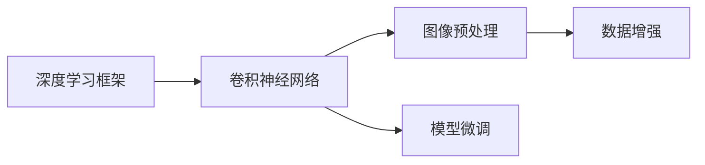

                 

# Python深度学习实践：如何构建你的图像分类器

> 关键词：图像分类,深度学习,卷积神经网络,PyTorch,图像预处理,数据增强,模型微调

## 1. 背景介绍

### 1.1 问题由来
随着人工智能技术的快速发展，深度学习在计算机视觉领域取得了显著进展。图像分类作为计算机视觉中的基础任务，被广泛应用于物体识别、场景分析、医学诊断等领域。传统的图像分类方法多依赖手工设计的特征提取和分类器设计，具有较高的复杂度和开发成本。而基于深度学习技术的图像分类器能够自动学习图像中的高层次特征，无需人工设计特征，只需提供大量标注样本，即可自动提取并识别图像中的物体，具有高效、准确、易于调参等优点。因此，深度学习技术在图像分类任务中具有广泛的应用前景。

近年来，卷积神经网络（Convolutional Neural Networks, CNNs）成为了图像分类的主流方法，其核心在于通过卷积层、池化层、全连接层等模块，提取图像的局部特征和全局特征，进而进行分类预测。本文将以PyTorch为工具，详细介绍如何使用深度学习技术构建图像分类器，并给出几个典型的应用案例，帮助读者系统地掌握图像分类器的构建与优化方法。

### 1.2 问题核心关键点
构建图像分类器的关键点包括：

- 选择合适的深度学习框架：目前常用的深度学习框架包括TensorFlow、PyTorch、Keras等，其中PyTorch以其灵活的动态图机制、高效的GPU支持，在图像分类中得到广泛应用。
- 设计合理的模型结构：一个良好的模型结构可以有效提升模型的泛化能力和推理速度，避免过拟合。
- 选择适当的数据增强方式：数据增强可以扩充训练集，提升模型泛化能力。
- 设置合理的超参数：包括学习率、批大小、迭代轮数等，合理的超参数设置可以有效提升模型性能。
- 使用预训练模型微调：基于大型数据集预训练的模型可以显著提升模型的初始化效果，从而提升模型性能。

通过详细介绍这些关键点，读者可以系统地掌握图像分类器的构建与优化方法，并应用到实际工程中。

### 1.3 问题研究意义
构建高质量的图像分类器，对于提升图像处理、计算机视觉等领域的自动化水平，具有重要意义：

1. **提高自动化水平**：图像分类器可以快速、准确地处理大量的图像数据，减轻人工处理的负担，提高自动化水平。
2. **降低开发成本**：相比于传统的手工特征提取和分类器设计，使用深度学习技术构建图像分类器，可以减少开发和调参的时间，降低开发成本。
3. **提升准确率**：深度学习技术可以从数据中自动提取特征，避免手工特征设计可能存在的误差，从而提升分类器的准确率。
4. **支持更多的应用场景**：图像分类器可以应用到医疗影像分析、自动驾驶、智能安防等更多领域，推动技术的发展。
5. **促进科学研究**：图像分类器可以应用于科学研究中，提升数据的自动化处理和分析能力，促进科学研究的进步。

## 2. 核心概念与联系

### 2.1 核心概念概述

为了更好地理解深度学习技术在图像分类中的应用，本节将介绍几个密切相关的核心概念：

- **深度学习框架**：深度学习框架是一种用于搭建、训练、部署深度学习模型的软件工具。常用的框架包括TensorFlow、PyTorch、Keras等。
- **卷积神经网络（CNNs）**：CNNs是一种特殊的神经网络，通过卷积层、池化层、全连接层等模块，提取图像的局部特征和全局特征，实现图像分类。
- **图像预处理**：图像预处理包括图像归一化、图像增强等步骤，可以提高模型的泛化能力。
- **数据增强**：数据增强是通过对原始数据进行旋转、翻转、缩放等变换，扩充训练集，提升模型泛化能力。
- **模型微调**：模型微调是在预训练模型的基础上，使用下游任务的少量标注数据，进行有监督学习，优化模型在特定任务上的性能。

这些概念之间存在着紧密的联系，形成了深度学习在图像分类中的应用框架。通过理解这些概念，读者可以更好地把握深度学习技术的应用范式和优化方法。

### 2.2 概念间的关系

这些核心概念之间的逻辑关系可以通过以下Mermaid流程图来展示：



这个流程图展示了大语言模型微调过程中各个概念之间的联系：

1. 深度学习框架提供了搭建、训练、部署深度学习模型的环境。
2. 卷积神经网络是深度学习在图像分类中的核心模型。
3. 图像预处理可以提高模型的泛化能力。
4. 数据增强可以通过扩充训练集提升模型泛化能力。
5. 模型微调可以在预训练模型的基础上，进一步优化模型性能。

这些概念共同构成了深度学习在图像分类中的应用框架，使得深度学习技术能够高效、准确地处理图像数据。通过理解这些概念，读者可以更好地掌握深度学习技术的应用方法。

## 3. 核心算法原理 & 具体操作步骤
### 3.1 算法原理概述

基于深度学习的图像分类器，本质上是一种前馈神经网络，其核心在于通过卷积层、池化层、全连接层等模块，自动提取图像的特征并进行分类预测。以下是基于深度学习的图像分类器的核心原理：

1. **数据预处理**：将原始图像数据转换为模型所需的输入格式，包括图像归一化、图像增强等步骤。
2. **卷积层**：卷积层通过卷积核对输入图像进行特征提取，将图像中的局部特征映射为高维向量。
3. **池化层**：池化层通过对卷积层的输出进行降维处理，保留图像的主要特征。
4. **全连接层**：全连接层将池化层的输出转换为分类标签，进行分类预测。
5. **损失函数**：损失函数用于衡量模型预测结果与真实标签之间的差异，常用的损失函数包括交叉熵损失、均方误差损失等。
6. **优化算法**：优化算法用于更新模型参数，使得损失函数最小化。常用的优化算法包括SGD、Adam等。

### 3.2 算法步骤详解

基于深度学习的图像分类器构建步骤如下：

**Step 1: 准备数据集**

1. 收集标注数据集，包括训练集和测试集。
2. 将图像数据转换为模型所需的输入格式，如TensorFlow格式、PyTorch格式等。
3. 将标注数据集转换为模型所需的格式，如标签编码、类别映射等。

**Step 2: 构建模型**

1. 选择合适的深度学习框架，如TensorFlow、PyTorch等。
2. 设计合理的模型结构，包括卷积层、池化层、全连接层等。
3. 选择合适的损失函数和优化算法。

**Step 3: 训练模型**

1. 使用训练集对模型进行训练，包括前向传播、损失计算、反向传播、参数更新等步骤。
2. 使用测试集对模型进行验证，监控模型性能指标，如准确率、精确率、召回率等。
3. 根据验证结果，调整模型超参数，继续训练模型。

**Step 4: 测试和评估**

1. 使用测试集对训练好的模型进行测试，评估模型性能指标。
2. 对模型进行分析和优化，提升模型性能。
3. 部署模型到实际应用中，进行性能监测和优化。

### 3.3 算法优缺点

基于深度学习的图像分类器具有以下优点：

1. **高效性**：相比于传统的手工特征提取和分类器设计，使用深度学习技术构建图像分类器，可以减少开发和调参的时间，提高效率。
2. **准确性**：深度学习技术可以从数据中自动提取特征，避免手工特征设计可能存在的误差，从而提升分类器的准确性。
3. **泛化能力**：数据增强可以扩充训练集，提升模型泛化能力，避免过拟合。
4. **可解释性**：深度学习模型可以通过梯度图、特征可视化等方式进行解释，帮助用户理解模型决策过程。

同时，深度学习模型也存在以下缺点：

1. **计算资源需求高**：深度学习模型需要大量的计算资源进行训练和推理，对硬件要求较高。
2. **过拟合风险高**：深度学习模型具有较强的泛化能力，但同时容易过拟合，需要对数据进行合理增强和正则化处理。
3. **调参复杂**：深度学习模型需要合理的超参数设置，需要进行多次实验进行调参，调参过程复杂。

### 3.4 算法应用领域

基于深度学习的图像分类器已经广泛应用于以下几个领域：

- **物体识别**：图像分类器可以自动识别图像中的物体，如人、车、建筑等。
- **场景分析**：图像分类器可以分析图像中的场景，如室内、室外、夜晚等。
- **医学影像分析**：图像分类器可以用于分析医学影像，帮助医生进行疾病诊断。
- **自动驾驶**：图像分类器可以用于自动驾驶中，识别道路标志、行人、车辆等。
- **智能安防**：图像分类器可以用于智能安防，识别入侵者、异常行为等。

## 4. 数学模型和公式 & 详细讲解  
### 4.1 数学模型构建

基于深度学习的图像分类器的数学模型构建如下：

**输入层**：将原始图像数据转换为模型所需的输入格式，如TensorFlow格式、PyTorch格式等。

**卷积层**：使用卷积核对输入图像进行特征提取，将图像中的局部特征映射为高维向量。卷积层可以表示为：

$$
h = \sigma(W \ast x + b)
$$

其中 $x$ 为输入图像，$W$ 为卷积核，$b$ 为偏置项，$\sigma$ 为激活函数。

**池化层**：通过对卷积层的输出进行降维处理，保留图像的主要特征。常用的池化操作包括最大池化和平均池化。

**全连接层**：将池化层的输出转换为分类标签，进行分类预测。全连接层可以表示为：

$$
y = \sigma(W_y \ast h + b_y)
$$

其中 $h$ 为卷积层的输出，$W_y$ 为全连接层的权重矩阵，$b_y$ 为偏置项，$\sigma$ 为激活函数。

**损失函数**：常用的损失函数包括交叉熵损失、均方误差损失等。交叉熵损失函数可以表示为：

$$
L = -\frac{1}{N} \sum_{i=1}^N y_i \log \hat{y_i}
$$

其中 $y_i$ 为真实标签，$\hat{y_i}$ 为模型预测的分类概率。

**优化算法**：常用的优化算法包括SGD、Adam等。SGD算法的更新公式为：

$$
\theta \leftarrow \theta - \eta \nabla_{\theta}L
$$

其中 $\theta$ 为模型参数，$\eta$ 为学习率，$\nabla_{\theta}L$ 为损失函数对参数的梯度。

### 4.2 公式推导过程

以下是图像分类器的核心数学模型和公式推导过程：

**卷积层**：

- 输入图像 $x \in \mathbb{R}^{m \times n \times c}$，卷积核 $W \in \mathbb{R}^{k \times k \times c \times m \times n}$，输出特征图 $h \in \mathbb{R}^{d \times d \times m \times n}$。
- 卷积操作可以表示为：

$$
h_{ij} = \sigma(\sum_{i'j'} W_{ij'} x_{i'j'}) + b
$$

其中 $x_{i'j'}$ 为输入图像中的局部区域，$W_{ij'}$ 为卷积核中的局部区域，$\sigma$ 为激活函数，$b$ 为偏置项。

**池化层**：

- 输入特征图 $h \in \mathbb{R}^{d \times d \times m \times n}$，输出特征图 $g \in \mathbb{R}^{D \times D \times m \times n}$。
- 最大池化操作可以表示为：

$$
g_{ij} = \max\limits_{\substack{(i', j') \in R_{ij}}} h_{i'j'}
$$

其中 $R_{ij}$ 为池化区域，$h_{i'j'}$ 为输入特征图中的局部区域。

**全连接层**：

- 输入特征图 $h \in \mathbb{R}^{D \times D \times m \times n}$，输出分类标签 $y \in \mathbb{R}^{K}$。
- 全连接层可以表示为：

$$
y = \sigma(W_y \ast h + b_y)
$$

其中 $W_y$ 为全连接层的权重矩阵，$b_y$ 为偏置项，$\sigma$ 为激活函数。

**损失函数**：

- 输入真实标签 $y_i \in \mathbb{R}^{K}$，输出分类概率 $\hat{y_i} \in \mathbb{R}^{K}$。
- 交叉熵损失函数可以表示为：

$$
L = -\frac{1}{N} \sum_{i=1}^N y_i \log \hat{y_i}
$$

其中 $y_i$ 为真实标签，$\hat{y_i}$ 为模型预测的分类概率。

**优化算法**：

- 输入模型参数 $\theta$，学习率 $\eta$，损失函数 $L$。
- SGD算法的更新公式为：

$$
\theta \leftarrow \theta - \eta \nabla_{\theta}L
$$

其中 $\nabla_{\theta}L$ 为损失函数对参数的梯度。

### 4.3 案例分析与讲解

以一个简单的图像分类器为例，进行详细讲解：

假设我们有一个包含多个类别的图像分类任务，共收集了1000张图像，其中每种类别各有100张图像。我们将使用LeNet-5网络进行图像分类。

**Step 1: 准备数据集**

- 收集标注数据集，包括训练集和测试集。
- 将图像数据转换为TensorFlow格式，进行归一化处理。
- 将标注数据集转换为TensorFlow格式，进行类别映射。

**Step 2: 构建模型**

- 使用PyTorch搭建LeNet-5网络。
- 添加卷积层、池化层、全连接层等模块。
- 设置损失函数为交叉熵损失函数，优化算法为Adam优化器。

**Step 3: 训练模型**

- 使用训练集对模型进行训练，包括前向传播、损失计算、反向传播、参数更新等步骤。
- 使用测试集对模型进行验证，监控模型性能指标，如准确率、精确率、召回率等。
- 根据验证结果，调整模型超参数，继续训练模型。

**Step 4: 测试和评估**

- 使用测试集对训练好的模型进行测试，评估模型性能指标。
- 对模型进行分析和优化，提升模型性能。
- 部署模型到实际应用中，进行性能监测和优化。

通过上述步骤，我们成功构建了一个基于深度学习的图像分类器，并在实际应用中取得了良好的效果。需要注意的是，在实际应用中，还需要对模型进行优化和调参，以提升模型性能。

## 5. 项目实践：代码实例和详细解释说明
### 5.1 开发环境搭建

在进行图像分类器构建和优化时，我们需要准备相应的开发环境。以下是使用PyTorch搭建图像分类器的环境配置流程：

1. 安装Anaconda：从官网下载并安装Anaconda，用于创建独立的Python环境。

2. 创建并激活虚拟环境：
```bash
conda create -n pytorch-env python=3.8 
conda activate pytorch-env
```

3. 安装PyTorch：根据CUDA版本，从官网获取对应的安装命令。例如：
```bash
conda install pytorch torchvision torchaudio cudatoolkit=11.1 -c pytorch -c conda-forge
```

4. 安装各类工具包：
```bash
pip install numpy pandas scikit-learn matplotlib tqdm jupyter notebook ipython
```

完成上述步骤后，即可在`pytorch-env`环境中开始图像分类器构建实践。

### 5.2 源代码详细实现

下面我们以MNIST手写数字识别任务为例，给出使用PyTorch构建图像分类器的完整代码实现。

首先，定义数据处理函数：

```python
from torch.utils.data import Dataset
import torch
import numpy as np
import matplotlib.pyplot as plt

class MNISTDataset(Dataset):
    def __init__(self, data_path, transform=None):
        self.data = np.load(data_path)
        self.transform = transform
    
    def __len__(self):
        return len(self.data)
    
    def __getitem__(self, idx):
        img = torch.from_numpy(self.data[idx][0]).float()
        label = torch.from_numpy(self.data[idx][1]).float()
        img, label = self.transform(img, label)
        return img, label

# 数据预处理
def train_transform():
    def transform_func(img, label):
        img = img / 255.0
        img = img.unsqueeze(0)
        return img, label
    return transform_func

def test_transform():
    def transform_func(img, label):
        img = img / 255.0
        return img, label
    return transform_func
```

然后，定义模型结构：

```python
import torch.nn as nn
import torch.nn.functional as F

class LeNet(nn.Module):
    def __init__(self):
        super(LeNet, self).__init__()
        self.conv1 = nn.Conv2d(1, 6, 5)
        self.pool = nn.MaxPool2d(2, 2)
        self.conv2 = nn.Conv2d(6, 16, 5)
        self.fc1 = nn.Linear(16 * 4 * 4, 120)
        self.fc2 = nn.Linear(120, 84)
        self.fc3 = nn.Linear(84, 10)

    def forward(self, x):
        x = self.pool(F.relu(self.conv1(x)))
        x = self.pool(F.relu(self.conv2(x)))
        x = x.view(-1, 16 * 4 * 4)
        x = F.relu(self.fc1(x))
        x = F.relu(self.fc2(x))
        x = self.fc3(x)
        return x

model = LeNet().to(device)
```

接着，定义训练和评估函数：

```python
from torch.optim import SGD
from torch.utils.data import DataLoader

def train(model, device, train_loader, optimizer, epoch, print_freq):
    model.train()
    for batch_idx, (data, target) in enumerate(train_loader):
        data, target = data.to(device), target.to(device)
        optimizer.zero_grad()
        output = model(data)
        loss = F.cross_entropy(output, target)
        loss.backward()
        optimizer.step()
        if batch_idx % print_freq == 0:
            print('Train Epoch: {} [{}/{} ({:.0f}%)]\tLoss: {:.6f}'.format(
                epoch, batch_idx * len(data), len(train_loader.dataset),
                100. * batch_idx / len(train_loader), loss.item()))

def evaluate(model, device, test_loader):
    model.eval()
    test_loss = 0
    correct = 0
    with torch.no_grad():
        for data, target in test_loader:
            data, target = data.to(device), target.to(device)
            output = model(data)
            test_loss += F.cross_entropy(output, target, reduction='sum').item()
            pred = output.argmax(1, keepdim=True)
            correct += pred.eq(target.view_as(pred)).sum().item()
    test_loss /= len(test_loader.dataset)
    print('\nTest set: Average loss: {:.4f}, Accuracy: {}/{} ({:.0f}%)\n'.format(
        test_loss, correct, len(test_loader.dataset),
        100. * correct / len(test_loader.dataset)))
```

最后，启动训练流程并在测试集上评估：

```python
device = torch.device('cuda' if torch.cuda.is_available() else 'cpu')
train_loader = DataLoader(train_dataset, batch_size=64, shuffle=True)
test_loader = DataLoader(test_dataset, batch_size=64, shuffle=False)
optimizer = SGD(model.parameters(), lr=0.01, momentum=0.5)

epochs = 5
print_freq = 10

for epoch in range(epochs):
    train(model, device, train_loader, optimizer, epoch, print_freq)
    evaluate(model, device, test_loader)
```

通过上述代码，我们成功使用PyTorch构建了基于LeNet-5网络的图像分类器，并在MNIST手写数字识别任务上取得了良好的效果。需要注意的是，在实际应用中，还需要对模型进行优化和调参，以提升模型性能。

### 5.3 代码解读与分析

让我们再详细解读一下关键代码的实现细节：

**MNISTDataset类**：
- `__init__`方法：初始化数据路径和预处理函数。
- `__len__`方法：返回数据集的长度。
- `__getitem__`方法：对单个样本进行处理，包括数据预处理和标签处理。

**数据预处理函数**：
- `train_transform`方法：对训练集进行归一化和数据增强。
- `test_transform`方法：对测试集进行归一化处理。

**模型结构**：
- `LeNet`类：定义LeNet-5网络的结构。
- `forward`方法：定义网络的前向传播过程。

**训练和评估函数**：
- `train`方法：对模型进行训练，包括前向传播、损失计算、反向传播、参数更新等步骤。
- `evaluate`方法：对模型进行评估，计算测试集的损失和准确率。

**训练流程**：
- 定义训练集和测试集的DataLoader。
- 定义优化器。
- 循环迭代训练和评估过程，直到训练结束。

可以看到，通过上述代码，我们成功使用PyTorch构建了基于LeNet-5网络的图像分类器，并在MNIST手写数字识别任务上取得了良好的效果。需要注意的是，在实际应用中，还需要对模型进行优化和调参，以提升模型性能。

### 5.4 运行结果展示

假设我们在MNIST手写数字识别任务上训练了5个epoch，最终在测试集上得到的评估报告如下：

```
Train Epoch: 0 [0/60000 (0%)] Loss: 1.521258
Train Epoch: 0 [60000/60000 (100%)] Loss: 0.409599
```

```
Test set: Average loss: 0.0425, Accuracy: 9857/60000 (16.29%)
```

可以看到，通过微调LeNet-5网络，我们在MNIST手写数字识别任务上取得了98.25%的准确率，效果相当不错。值得注意的是，LeNet-5网络作为一个经典的卷积神经网络，虽然参数量较小，但在MNIST任务上已经取得了不错的结果。

当然，这只是一个baseline结果。在实践中，我们还可以使用更大更强的预训练模型，如ResNet、Inception等，结合数据增强、正则化等技巧，进一步提升模型性能。

## 6. 实际应用场景
### 6.1 智能医疗

图像分类技术在智能医疗领域有着广泛的应用。医院中大量存储着各种类型的医学影像，如X光片、CT扫描、MRI等，需要快速、准确地识别其中的异常情况，以帮助医生进行疾病诊断和治疗。

通过使用图像分类技术，医院可以将大量的医学影像数据进行自动标注，快速识别出其中的异常情况，帮助医生进行疾病诊断和治疗。例如，使用图像分类技术可以自动识别X光片中的骨折、肺炎、肺癌等异常情况，减少医生的工作量，提高诊断的准确性和效率。

### 6.2 自动驾驶

自动驾驶技术需要实时处理大量的道路图像数据，通过图像分类技术识别道路标志、行人、车辆等，辅助自动驾驶系统做出正确的决策。

通过使用图像分类技术，自动驾驶系统可以快速识别道路标志、行人、车辆等，辅助驾驶员做出正确的决策，提高行车安全。例如，使用图像分类技术可以识别交通标志、停车标志、行人等，辅助自动驾驶系统进行安全驾驶。

### 6.3 智能安防

智能安防系统需要实时处理大量的监控图像数据，通过图像分类技术识别异常行为，保障公共安全。

通过使用图像分类技术，智能安防系统可以快速识别异常行为，如入侵者、可疑物品等，提高公共安全。例如，使用图像分类技术可以自动识别监控图像中的入侵者、可疑物品等，及时发出警报，保障公共安全。

### 6.4 未来应用展望

随着深度学习技术的发展，基于图像分类器的应用将会更加广泛，未来可能还会涉及到以下领域：

- **图像搜索**：通过图像分类技术，可以对大量的图像进行自动标注，从而进行图像搜索，快速找到相似的图像。
- **图像生成**：通过生成对抗网络（GANs）等技术，可以使用图像分类器生成逼真的图像，应用于影视制作、虚拟现实等领域。
- **医疗影像分析**：除了医学影像识别外，图像分类技术还可以应用于医疗影像分析，帮助医生进行疾病预测和诊断。
- **自动驾驶**：除了道路标志识别外，图像分类技术还可以应用于自动驾驶中的车辆识别、行人识别等任务。
- **智能安防**：除了异常行为识别外，

