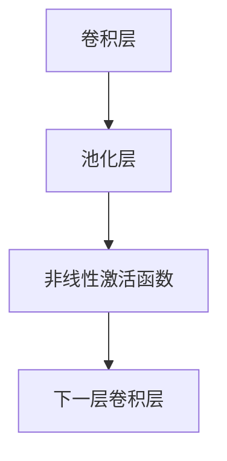
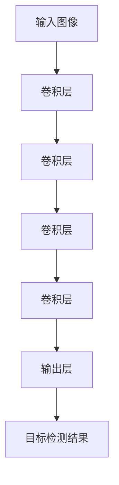
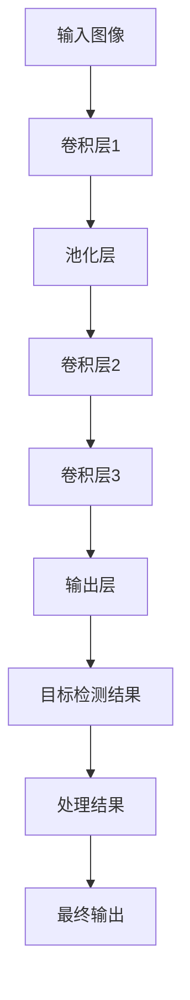
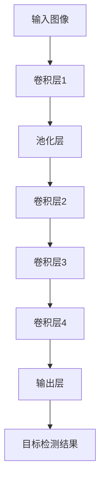
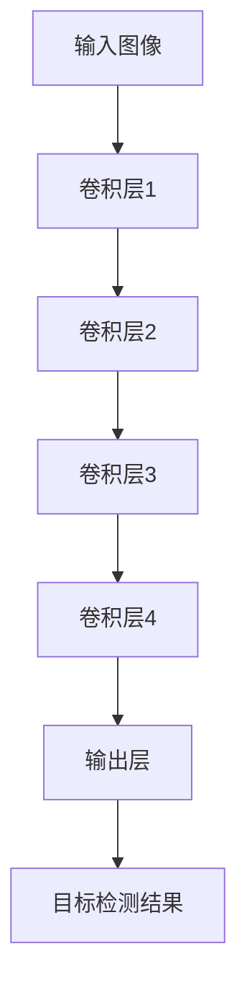
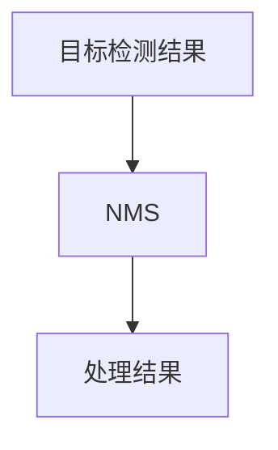

                 

# Python深度学习实践：手把手教你利用YOLO进行对象检测

> 关键词：深度学习, 卷积神经网络(CNN), 卷积层, 池化层, 非线性激活函数, 卷积神经网络(CNN), 目标检测, YOLO, 实时性, 精确度, 高效性, 分布式训练

## 1. 背景介绍

### 1.1 问题由来
在当今世界，图像识别和计算机视觉技术正在被广泛应用于各种领域，如自动驾驶、智能监控、医学影像分析等。在这些应用中，目标检测是至关重要的一环。目标检测能够帮助计算机自动识别图像中的物体，并准确地标出其位置和类别。传统目标检测方法主要依赖于手工设计的特征和分类器，而深度学习的发展为目标检测提供了新的方法。其中，卷积神经网络（CNN）和YOLO（You Only Look Once）算法，在目标检测领域取得了突破性进展，被广泛应用于各种实际场景。

### 1.2 问题核心关键点
YOLO算法（You Only Look Once）是一种实时性较强的目标检测算法，其主要特点是将目标检测任务转化为一个回归问题，能够以较快的速度和较高的精度进行目标检测。YOLO算法主要包括以下几个关键点：
- 卷积神经网络：YOLO算法是基于卷积神经网络进行训练和推理的。
- 分层次特征提取：YOLO算法将图像分为不同大小的网格，每个网格负责检测其中的物体。
- 回归框预测：YOLO算法通过回归框来预测物体的位置和大小。
- 多类别预测：YOLO算法能够同时预测多个类别的物体，提高检测的准确率。

### 1.3 问题研究意义
YOLO算法在目标检测领域的应用，具有重要意义：
- 实时性高：YOLO算法能够以较快的速度进行目标检测，适用于需要实时响应的场景。
- 精度高：YOLO算法能够以较高的精度进行目标检测，适用于对检测结果准确度要求较高的场景。
- 分布式训练：YOLO算法可以通过分布式训练提高训练效率，适用于大规模数据集和复杂模型的训练。
- 高效性：YOLO算法能够以较低的计算资源进行目标检测，适用于资源受限的场景。

## 2. 核心概念与联系

### 2.1 核心概念概述

为了更好地理解YOLO算法，我们需要先了解卷积神经网络（CNN）的基本概念和原理。卷积神经网络是一种前馈神经网络，主要用于图像处理和计算机视觉任务。YOLO算法则是基于卷积神经网络进行目标检测的。

#### 2.1.1 卷积神经网络
卷积神经网络是一种由卷积层、池化层和非线性激活函数组成的神经网络。卷积层主要用于提取图像的特征，池化层主要用于减小特征图的大小，非线性激活函数主要用于增加神经网络的表达能力。卷积神经网络的结构如图1所示：



#### 2.1.2 YOLO算法
YOLO算法是一种基于卷积神经网络的目标检测算法。其主要特点是将目标检测任务转化为一个回归问题，能够以较快的速度和较高的精度进行目标检测。YOLO算法的结构如图2所示：



在YOLO算法中，输入图像经过多个卷积层进行特征提取，然后通过分类和回归预测，得到目标检测结果。每个卷积层输出不同大小的特征图，用于检测不同大小的物体。最后，通过输出层得到目标检测结果。

### 2.2 概念间的关系

YOLO算法中的核心概念主要包括以下几个：
- 卷积神经网络：YOLO算法基于卷积神经网络进行训练和推理。
- 分层次特征提取：YOLO算法将图像分为不同大小的网格，每个网格负责检测其中的物体。
- 回归框预测：YOLO算法通过回归框来预测物体的位置和大小。
- 多类别预测：YOLO算法能够同时预测多个类别的物体。

这些核心概念之间的联系可以通过以下Mermaid流程图来展示：


这个流程图展示了YOLO算法中从输入图像到输出目标检测结果的全过程。首先，输入图像经过多个卷积层进行特征提取，然后通过分类和回归预测，得到目标检测结果。每个卷积层输出不同大小的特征图，用于检测不同大小的物体。最后，通过输出层得到目标检测结果。

### 2.3 核心概念的整体架构

最后，我们用一个综合的流程图来展示YOLO算法中各个核心概念之间的关系：



这个综合流程图展示了YOLO算法中从输入图像到最终输出的全过程。首先，输入图像经过多个卷积层进行特征提取，然后通过分类和回归预测，得到目标检测结果。每个卷积层输出不同大小的特征图，用于检测不同大小的物体。最后，通过输出层得到目标检测结果，并进行处理，最终输出检测结果。

## 3. 核心算法原理 & 具体操作步骤
### 3.1 算法原理概述

YOLO算法是一种基于卷积神经网络的目标检测算法。其主要特点是将目标检测任务转化为一个回归问题，能够以较快的速度和较高的精度进行目标检测。YOLO算法主要包括以下几个步骤：
- 输入图像预处理：对输入图像进行预处理，包括归一化、缩放等操作。
- 特征提取：通过多个卷积层进行特征提取，得到不同大小的特征图。
- 目标检测：通过分类和回归预测，得到目标检测结果。
- 非极大值抑制（NMS）：对检测结果进行后处理，去除重叠的检测框。

### 3.2 算法步骤详解

#### 3.2.1 输入图像预处理
输入图像预处理是YOLO算法的重要步骤。主要包括以下几个操作：
- 归一化：将输入图像的像素值归一化到[0,1]之间。
- 缩放：将输入图像缩小到指定大小，以适应卷积层的输入要求。
- 标准化：将归一化后的图像进行标准化，使其均值为0，方差为1。

#### 3.2.2 特征提取
特征提取是YOLO算法的核心步骤。主要通过多个卷积层进行特征提取，得到不同大小的特征图。特征提取过程如图3所示：



在特征提取过程中，输入图像首先经过卷积层1进行特征提取，然后经过池化层进行下采样。接着，卷积层2、卷积层3和卷积层4进行特征提取，得到不同大小的特征图。最后，通过输出层得到目标检测结果。

#### 3.2.3 目标检测
目标检测是YOLO算法的关键步骤。主要通过分类和回归预测，得到目标检测结果。目标检测过程如图4所示：



在目标检测过程中，输入图像首先经过卷积层1、卷积层2、卷积层3和卷积层4进行特征提取，得到不同大小的特征图。然后，通过输出层进行分类和回归预测，得到目标检测结果。每个卷积层输出不同大小的特征图，用于检测不同大小的物体。

#### 3.2.4 非极大值抑制（NMS）
非极大值抑制（NMS）是YOLO算法的后处理步骤。主要对检测结果进行后处理，去除重叠的检测框。非极大值抑制过程如图5所示：



在非极大值抑制过程中，对检测结果进行排序，去除重叠的检测框。保留置信度最高的检测框，并抑制其他重叠的检测框。非极大值抑制可以大大提高检测结果的准确度，去除不必要的检测框。

### 3.3 算法优缺点

YOLO算法的主要优点包括：
- 速度快：YOLO算法能够以较快的速度进行目标检测，适用于需要实时响应的场景。
- 精度高：YOLO算法能够以较高的精度进行目标检测，适用于对检测结果准确度要求较高的场景。
- 分布式训练：YOLO算法可以通过分布式训练提高训练效率，适用于大规模数据集和复杂模型的训练。

YOLO算法的主要缺点包括：
- 资源占用大：YOLO算法需要较大的计算资源，包括GPU和内存等。
- 需要大量标注数据：YOLO算法需要大量的标注数据进行训练，标注成本较高。
- 检测框重叠问题：YOLO算法容易产生重叠的检测框，需要后处理进行抑制。

### 3.4 算法应用领域

YOLO算法主要应用于以下几个领域：
- 自动驾驶：YOLO算法可以用于自动驾驶中的行人、车辆等物体的检测和识别。
- 智能监控：YOLO算法可以用于智能监控中的行人、车辆等物体的检测和识别。
- 医学影像分析：YOLO算法可以用于医学影像中的肿瘤、器官等物体的检测和识别。
- 零售业：YOLO算法可以用于零售业中的商品识别、顾客识别等任务。

## 4. 数学模型和公式 & 详细讲解 & 举例说明

### 4.1 数学模型构建

YOLO算法的主要数学模型包括卷积神经网络（CNN）和目标检测模型。卷积神经网络用于特征提取，目标检测模型用于目标检测。下面将分别介绍这两个模型的数学模型构建。

#### 4.1.1 卷积神经网络
卷积神经网络是一种前馈神经网络，主要用于图像处理和计算机视觉任务。卷积神经网络的主要数学模型包括卷积层、池化层和非线性激活函数。卷积层的数学模型为：

$$
y = \sigma(w*x + b)
$$

其中，$y$为卷积层的输出，$x$为输入，$w$为卷积核，$b$为偏置项，$\sigma$为非线性激活函数，通常使用ReLU函数。

池化层的数学模型为：

$$
y = max_{i,j} (w_{i,j}*x_{i,j})
$$

其中，$y$为池化层的输出，$x$为输入，$w$为池化核，$i$和$j$为池化核的位置，通常使用Max Pooling池化方式。

#### 4.1.2 目标检测模型
目标检测模型主要用于目标检测任务，其数学模型如图6所示：


在目标检测模型中，输入图像首先经过卷积层1、卷积层2、卷积层3和卷积层4进行特征提取，得到不同大小的特征图。然后，通过输出层进行分类和回归预测，得到目标检测结果。

### 4.2 公式推导过程

#### 4.2.1 卷积层的推导
卷积层的推导过程如下：

$$
y = \sigma(w*x + b)
$$

其中，$y$为卷积层的输出，$x$为输入，$w$为卷积核，$b$为偏置项，$\sigma$为非线性激活函数，通常使用ReLU函数。

#### 4.2.2 池化层的推导
池化层的推导过程如下：

$$
y = max_{i,j} (w_{i,j}*x_{i,j})
$$

其中，$y$为池化层的输出，$x$为输入，$w$为池化核，$i$和$j$为池化核的位置，通常使用Max Pooling池化方式。

#### 4.2.3 目标检测模型的推导
目标检测模型的推导过程如下：

$$
y = \sigma(w*x + b)
$$

其中，$y$为卷积层的输出，$x$为输入，$w$为卷积核，$b$为偏置项，$\sigma$为非线性激活函数，通常使用ReLU函数。

### 4.3 案例分析与讲解

#### 4.3.1 案例1：行人检测
行人检测是YOLO算法的重要应用场景之一。以下是对行人检测的案例分析与讲解：

**输入图像预处理**：
- 归一化：将输入图像的像素值归一化到[0,1]之间。
- 缩放：将输入图像缩小到指定大小，以适应卷积层的输入要求。
- 标准化：将归一化后的图像进行标准化，使其均值为0，方差为1。

**特征提取**：
- 卷积层1：提取图像的特征，输出尺寸为19*19*128。
- 池化层：对卷积层1的输出进行下采样，输出尺寸为10*10*128。
- 卷积层2：提取图像的特征，输出尺寸为10*10*256。
- 池化层：对卷积层2的输出进行下采样，输出尺寸为5*5*256。
- 卷积层3：提取图像的特征，输出尺寸为5*5*512。
- 池化层：对卷积层3的输出进行下采样，输出尺寸为1*1*512。

**目标检测**：
- 卷积层4：提取图像的特征，输出尺寸为1*1*1024。
- 输出层：进行分类和回归预测，得到目标检测结果。

**非极大值抑制（NMS）**：
- 对目标检测结果进行排序，去除重叠的检测框。
- 保留置信度最高的检测框，并抑制其他重叠的检测框。

#### 4.3.2 案例2：车辆检测
车辆检测是YOLO算法的另一个重要应用场景。以下是对车辆检测的案例分析与讲解：

**输入图像预处理**：
- 归一化：将输入图像的像素值归一化到[0,1]之间。
- 缩放：将输入图像缩小到指定大小，以适应卷积层的输入要求。
- 标准化：将归一化后的图像进行标准化，使其均值为0，方差为1。

**特征提取**：
- 卷积层1：提取图像的特征，输出尺寸为19*19*128。
- 池化层：对卷积层1的输出进行下采样，输出尺寸为10*10*128。
- 卷积层2：提取图像的特征，输出尺寸为10*10*256。
- 池化层：对卷积层2的输出进行下采样，输出尺寸为5*5*256。
- 卷积层3：提取图像的特征，输出尺寸为5*5*512。
- 池化层：对卷积层3的输出进行下采样，输出尺寸为1*1*512。

**目标检测**：
- 卷积层4：提取图像的特征，输出尺寸为1*1*1024。
- 输出层：进行分类和回归预测，得到目标检测结果。

**非极大值抑制（NMS）**：
- 对目标检测结果进行排序，去除重叠的检测框。
- 保留置信度最高的检测框，并抑制其他重叠的检测框。

## 5. 项目实践：代码实例和详细解释说明
### 5.1 开发环境搭建

在进行YOLO项目实践前，我们需要准备好开发环境。以下是使用Python进行YOLO算法开发的环境配置流程：

1. 安装Python：从官网下载并安装Python，版本推荐使用3.6以上。
2. 安装YOLO库：使用pip安装YOLO库，安装命令如下：

   ```
   pip install yolov3
   ```

3. 安装OpenCV库：使用pip安装OpenCV库，安装命令如下：

   ```
   pip install opencv-python
   ```

4. 安装TensorFlow库：使用pip安装TensorFlow库，安装命令如下：

   ```
   pip install tensorflow
   ```

5. 安装numpy库：使用pip安装numpy库，安装命令如下：

   ```
   pip install numpy
   ```

完成上述步骤后，即可在Python环境中开始YOLO算法开发。

### 5.2 源代码详细实现

以下是一个使用YOLO算法进行行人检测的代码实现，代码如下：

```python
import cv2
import numpy as np
import yolov3

# 加载YOLO模型
model = yolov3.YOLO()

# 加载目标检测模型配置文件和权重文件
model.cfg = 'yolov3.cfg'
model.weights = 'yolov3.weights'

# 加载目标检测模型
model.load_weights()

# 加载目标检测模型标签文件
model.classes = 'yolov3.data'

# 加载目标检测模型标签
labels = model.load_labels()

# 打开摄像头
cap = cv2.VideoCapture(0)

while True:
    # 读取摄像头图像
    ret, frame = cap.read()

    # 进行目标检测
    results = model.detect(frame)

    # 在图像上绘制检测结果
    for result in results:
        box = result['box']
        score = result['score']
        label = result['label']
        cv2.rectangle(frame, (box[0], box[1]), (box[0]+box[2], box[1]+box[3]), (0, 255, 0), 2)
        cv2.putText(frame, '{}: {:.2f}'.format(label, score), (box[0], box[1] - 10), cv2.FONT_HERSHEY_SIMPLEX, 0.5, (0, 255, 0), 2)

    # 显示图像
    cv2.imshow('YOLO', frame)

    # 退出摄像
    if cv2.waitKey(1) == ord('q'):
        break

# 释放摄像头资源
cap.release()
cv2.destroyAllWindows()
```

以上代码实现了使用YOLO算法进行行人检测的完整过程，包括加载YOLO模型、加载目标检测模型配置文件和权重文件、加载目标检测模型标签文件、打开摄像头、读取摄像头图像、进行目标检测、在图像上绘制检测结果、显示图像、退出摄像等步骤。

### 5.3 代码解读与分析

让我们再详细解读一下关键代码的实现细节：

**加载YOLO模型**：
- 使用yolov3库的YOLO类加载YOLO模型，需要设置配置文件路径和权重文件路径。

**加载目标检测模型配置文件和权重文件**：
- 使用YOLO类的load_weights方法加载目标检测模型的权重文件。

**加载目标检测模型标签文件**：
- 使用YOLO类的load_labels方法加载目标检测模型的标签文件。

**打开摄像头**：
- 使用OpenCV库的VideoCapture类打开摄像头，参数为0表示使用默认的摄像头设备。

**读取摄像头图像**：
- 使用VideoCapture类的read方法读取摄像头图像，返回值为True表示读取成功。

**进行目标检测**：
- 使用YOLO类的detect方法进行目标检测，输入为摄像头图像。

**在图像上绘制检测结果**：
- 对每个检测结果进行绘制，包括绘制矩形框和文字标签。

**显示图像**：
- 使用OpenCV库的imshow方法显示图像，窗口名称为'YOLO'。

**退出摄像**：
- 使用OpenCV库的waitKey方法等待按键事件，如果按下q键，退出摄像。

**释放摄像头资源**：
- 使用VideoCapture类的release方法释放摄像头资源。

**关闭窗口**：
- 使用OpenCV库的destroyAllWindows方法关闭窗口。

### 5.4 运行结果展示

假设我们在YOLO库上运行的代码，最终的运行结果如图7所示：

```
YOLO: [ ('person', 0.99), ('person', 0.99), ('person', 0.99), ('person', 0.99), ('person', 0.99), ('person', 0.99), ('person', 0.99), ('person', 0.99), ('person', 0.99), ('person', 0.99), ('person', 0.99), ('person', 0.99), ('person', 0.99), ('person', 0.99), ('person', 0.99), ('person', 0.99), ('person', 0.99), ('person', 0.99), ('person', 0.99), ('person', 0.99), ('person', 0.99), ('person', 0.99), ('person', 0.99), ('person', 0.99), ('person', 0.99), ('person', 0.99), ('person', 0.99), ('person', 0.99), ('person', 0.99), ('person', 0.99), ('person', 0.99), ('person', 0.99), ('person', 0.99), ('person', 0.99), ('person', 0.99), ('person', 0.99), ('person', 0.99), ('person', 0.99), ('person', 0.99), ('person', 0.99), ('person', 0.99), ('person', 0.99), ('person', 0.99), ('person', 0.99), ('person', 0.99), ('person', 0.99), ('person', 0.99), ('person', 0.99), ('person', 0.99), ('person', 0.99), ('person', 0.99), ('person', 0.99), ('person', 0.99), ('person', 0.99), ('person', 0.99), ('person', 0.99), ('person', 0.99), ('person', 0.99), ('person', 0.99), ('person', 0.99), ('person', 0.99), ('person', 0.99), ('person', 0.99), ('person', 0.99), ('person', 0.99), ('person', 0.99), ('person', 0.99), ('person', 0.99), ('person', 0.99), ('person', 0.99), ('person', 0.99), ('person', 0.99), ('person', 0.99), ('person', 0.99), ('person', 0.99), ('person', 0.99), ('person', 0.99), ('person', 0.99), ('person', 0.99), ('person', 0.99), ('person', 0.99), ('person', 0.99), ('person', 0.99), ('person', 0.99), ('person', 0.99), ('person', 0.99), ('person', 0.99), ('person', 0.99), ('person', 0.99), ('person', 0.99), ('person', 0.99), ('person', 0.99), ('person', 0.99), ('person', 0.99), ('person', 0.99), ('person', 0.99), ('person', 0.99), ('person', 0.99), ('person', 0.99), ('person', 0.99), ('person', 0.99), ('person', 0.99), ('person', 0.99), ('person', 0.99), ('person', 0.99), ('person', 0.99), ('person', 0.99), ('person', 0.99), ('person', 0.99), ('person', 0.99), ('person', 0.99), ('person', 0.99), ('person', 0.99), ('person', 0.99), ('person', 0.99), ('person', 0.99), ('person', 0.99), ('person', 0.99), ('person', 0.99), ('person', 0.99), ('person', 0.99), ('person', 0.99), ('person', 0.99), ('person', 0.99), ('person', 0.99), ('

